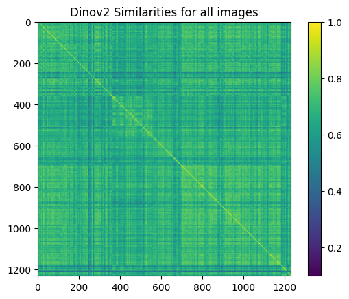
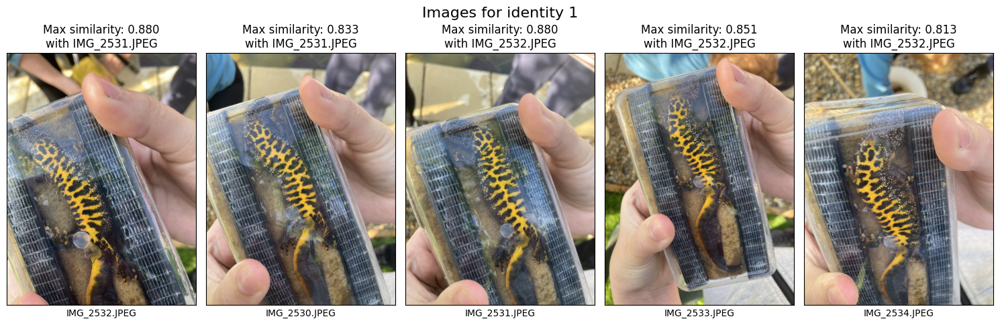

# Artefacts


<!-- WARNING: THIS FILE WAS AUTOGENERATED! DO NOT EDIT! -->

``` python
import os
import sys
import torch
import pandas as pd
import numpy as np
import matplotlib.pyplot as plt
from wildlife_tools.similarity import CosineSimilarity
from wildlife_datasets import analysis, datasets, splits
import pycocotools.mask as mask_util
from wildlife_tools.data import ImageDataset
from sklearn.metrics import average_precision_score
import numpy as np
import timm
from transformers import AutoModel
import torch
import numpy as np
from wildlife_tools.inference import TopkClassifier, KnnClassifier
from wildlife_tools.features import DeepFeatures
import torchvision.transforms as T
from PIL import Image
import kaggle
import pandas as pd
from wildlife_tools.data import ImageDataset, FeatureDataset, FeatureDatabase
from gcn_reid.segmentation import decode_rle_mask
from gcn_reid.newt_dataset import upload_to_kaggle
from pathlib import Path
from gcn_reid.newt_dataset import download_kaggle_dataset
from tqdm import tqdm
from transformers import AutoImageProcessor, AutoModel
import cv2
from IPython import display
```

    2025-06-27 09:18:41.180455: E external/local_xla/xla/stream_executor/cuda/cuda_fft.cc:477] Unable to register cuFFT factory: Attempting to register factory for plugin cuFFT when one has already been registered
    WARNING: All log messages before absl::InitializeLog() is called are written to STDERR
    E0000 00:00:1751015921.203058   14306 cuda_dnn.cc:8310] Unable to register cuDNN factory: Attempting to register factory for plugin cuDNN when one has already been registered
    E0000 00:00:1751015921.210017   14306 cuda_blas.cc:1418] Unable to register cuBLAS factory: Attempting to register factory for plugin cuBLAS when one has already been registered

``` python
dataset_name = 'mshahoyi/gcn-id-2024'
dataset_path = Path('data/gcn-id-2024')
download_kaggle_dataset(dataset_name, dataset_path)
```

    Dataset already exists at data/gcn-id-2024

    PosixPath('data/gcn-id-2024')

``` python
metadata = pd.read_csv(dataset_path / 'metadata.csv')
metadata
```

<div>
<style scoped>
    .dataframe tbody tr th:only-of-type {
        vertical-align: middle;
    }
&#10;    .dataframe tbody tr th {
        vertical-align: top;
    }
&#10;    .dataframe thead th {
        text-align: right;
    }
</style>

<table class="dataframe" data-quarto-postprocess="true" data-border="1">
<thead>
<tr style="text-align: right;">
<th data-quarto-table-cell-role="th"></th>
<th data-quarto-table-cell-role="th">reference_id</th>
<th data-quarto-table-cell-role="th">file_path</th>
<th data-quarto-table-cell-role="th">file_name</th>
<th data-quarto-table-cell-role="th">is_video</th>
<th data-quarto-table-cell-role="th">identity</th>
<th data-quarto-table-cell-role="th">creation_date</th>
<th data-quarto-table-cell-role="th">bbox</th>
<th data-quarto-table-cell-role="th">segmentation_mask_rle</th>
<th data-quarto-table-cell-role="th">is_hard_test_query</th>
<th data-quarto-table-cell-role="th">is_hard_val_query</th>
<th data-quarto-table-cell-role="th">is_least_similar_test_query</th>
<th data-quarto-table-cell-role="th">is_least_similar_val_query</th>
<th data-quarto-table-cell-role="th">is_random_test_query</th>
<th data-quarto-table-cell-role="th">is_random_val_query</th>
</tr>
</thead>
<tbody>
<tr>
<td data-quarto-table-cell-role="th">0</td>
<td>GCN34-P3-S2</td>
<td>newts/1/IMG_2532.JPEG</td>
<td>IMG_2532.JPEG</td>
<td>False</td>
<td>1</td>
<td>2024-05-10 08:37:21+00:00</td>
<td>[14.939163208007812, 507.19061279296875, 1066....</td>
<td>2048x1536:Sd`03ko14N0000000bNKcRN0^O5om1KcRN1]...</td>
<td>NaN</td>
<td>False</td>
<td>NaN</td>
<td>NaN</td>
<td>True</td>
<td>NaN</td>
</tr>
<tr>
<td data-quarto-table-cell-role="th">1</td>
<td>GCN34-P3-S2</td>
<td>newts/1/IMG_2530.JPEG</td>
<td>IMG_2530.JPEG</td>
<td>False</td>
<td>1</td>
<td>2024-05-10 08:37:19+00:00</td>
<td>[288.80975341796875, 363.1075439453125, 1062.7...</td>
<td>2048x1536:[ajb03;31K_n1:YQN10O4Knm1h0lQN_O2O0M...</td>
<td>NaN</td>
<td>False</td>
<td>NaN</td>
<td>NaN</td>
<td>False</td>
<td>NaN</td>
</tr>
<tr>
<td data-quarto-table-cell-role="th">2</td>
<td>GCN34-P3-S2</td>
<td>newts/1/IMG_2531.JPEG</td>
<td>IMG_2531.JPEG</td>
<td>False</td>
<td>1</td>
<td>2024-05-10 08:37:20+00:00</td>
<td>[288.86181640625, 521.5284423828125, 1159.4096...</td>
<td>2048x1536:Pcdb07^o1d0D7H=E5K5L5J5K3M4M3M10001N...</td>
<td>NaN</td>
<td>False</td>
<td>NaN</td>
<td>NaN</td>
<td>False</td>
<td>NaN</td>
</tr>
<tr>
<td data-quarto-table-cell-role="th">3</td>
<td>GCN34-P3-S2</td>
<td>newts/1/IMG_2533.JPEG</td>
<td>IMG_2533.JPEG</td>
<td>False</td>
<td>1</td>
<td>2024-05-10 08:37:23+00:00</td>
<td>[489.2838134765625, 169.9361572265625, 1132.72...</td>
<td>2048x1536:X`Vo06do1;H;dNH]RN&gt;[m1e1]O5M4K4M3M3L...</td>
<td>NaN</td>
<td>False</td>
<td>NaN</td>
<td>NaN</td>
<td>False</td>
<td>NaN</td>
</tr>
<tr>
<td data-quarto-table-cell-role="th">4</td>
<td>GCN34-P3-S2</td>
<td>newts/1/IMG_2534.JPEG</td>
<td>IMG_2534.JPEG</td>
<td>False</td>
<td>1</td>
<td>2024-05-10 08:37:24+00:00</td>
<td>[365.6585388183594, 454.51068115234375, 1005.9...</td>
<td>2048x1536:SmZd03lo13M3M2O1O1N2`QNJTm16gRN3Vm1M...</td>
<td>NaN</td>
<td>True</td>
<td>NaN</td>
<td>NaN</td>
<td>False</td>
<td>NaN</td>
</tr>
<tr>
<td data-quarto-table-cell-role="th">...</td>
<td>...</td>
<td>...</td>
<td>...</td>
<td>...</td>
<td>...</td>
<td>...</td>
<td>...</td>
<td>...</td>
<td>...</td>
<td>...</td>
<td>...</td>
<td>...</td>
<td>...</td>
<td>...</td>
</tr>
<tr>
<td data-quarto-table-cell-role="th">2460</td>
<td>GCN2-P4-S6</td>
<td>newts/206/IMG_3588.JPEG</td>
<td>IMG_3588.JPEG</td>
<td>False</td>
<td>206</td>
<td>2024-06-07 08:13:15+00:00</td>
<td>[497.18017578125, 333.2651062011719, 1013.9716...</td>
<td>2046x1538:Zido07bo17M2M2N2N2O1O1N2O1O0O2O1N2O1...</td>
<td>NaN</td>
<td>NaN</td>
<td>NaN</td>
<td>NaN</td>
<td>NaN</td>
<td>NaN</td>
</tr>
<tr>
<td data-quarto-table-cell-role="th">2461</td>
<td>GCN2-P4-S6</td>
<td>newts/206/IMG_3583.MOV</td>
<td>IMG_3583.MOV</td>
<td>True</td>
<td>206</td>
<td>2024-06-07 14:48:31+00:00</td>
<td>NaN</td>
<td>NaN</td>
<td>NaN</td>
<td>NaN</td>
<td>NaN</td>
<td>NaN</td>
<td>NaN</td>
<td>NaN</td>
</tr>
<tr>
<td data-quarto-table-cell-role="th">2462</td>
<td>GCN2-P4-S6</td>
<td>newts/206/IMG_3583.JPEG</td>
<td>IMG_3583.JPEG</td>
<td>False</td>
<td>206</td>
<td>2024-06-07 08:13:06+00:00</td>
<td>[3.999234437942505, 593.5800170898438, 1326.80...</td>
<td>2046x1538:Z[1&gt;6`1Vm1`NjRN`1Vm1`NjRN`1Um1h0L6J5...</td>
<td>NaN</td>
<td>NaN</td>
<td>NaN</td>
<td>NaN</td>
<td>NaN</td>
<td>NaN</td>
</tr>
<tr>
<td data-quarto-table-cell-role="th">2463</td>
<td>GCN2-P4-S6</td>
<td>newts/206/IMG_3588.MOV</td>
<td>IMG_3588.MOV</td>
<td>True</td>
<td>206</td>
<td>2024-06-07 14:48:27+00:00</td>
<td>NaN</td>
<td>NaN</td>
<td>NaN</td>
<td>NaN</td>
<td>NaN</td>
<td>NaN</td>
<td>NaN</td>
<td>NaN</td>
</tr>
<tr>
<td data-quarto-table-cell-role="th">2464</td>
<td>GCN2-P4-S6</td>
<td>newts/206/IMG_3586.MOV</td>
<td>IMG_3586.MOV</td>
<td>True</td>
<td>206</td>
<td>2024-06-07 14:48:20+00:00</td>
<td>NaN</td>
<td>NaN</td>
<td>NaN</td>
<td>NaN</td>
<td>NaN</td>
<td>NaN</td>
<td>NaN</td>
<td>NaN</td>
</tr>
</tbody>
</table>

<p>2465 rows × 14 columns</p>
</div>

``` python
artifacts_path = Path('artifacts')
```

``` python
dino_features_df = pd.read_csv(artifacts_path / 'metadata_with_features.csv')
dino_features_df['dinov2_features'] = dino_features_df['dinov2_features'].apply(eval)
dino_features_df
```

<div>
<style scoped>
    .dataframe tbody tr th:only-of-type {
        vertical-align: middle;
    }
&#10;    .dataframe tbody tr th {
        vertical-align: top;
    }
&#10;    .dataframe thead th {
        text-align: right;
    }
</style>

<table class="dataframe" data-quarto-postprocess="true" data-border="1">
<thead>
<tr style="text-align: right;">
<th data-quarto-table-cell-role="th"></th>
<th data-quarto-table-cell-role="th">reference_id</th>
<th data-quarto-table-cell-role="th">file_path</th>
<th data-quarto-table-cell-role="th">file_name</th>
<th data-quarto-table-cell-role="th">is_video</th>
<th data-quarto-table-cell-role="th">identity</th>
<th data-quarto-table-cell-role="th">creation_date</th>
<th data-quarto-table-cell-role="th">bbox</th>
<th data-quarto-table-cell-role="th">segmentation_mask_rle</th>
<th data-quarto-table-cell-role="th">dinov2_features</th>
</tr>
</thead>
<tbody>
<tr>
<td data-quarto-table-cell-role="th">0</td>
<td>GCN34-P3-S2</td>
<td>newts/1/IMG_2532.JPEG</td>
<td>IMG_2532.JPEG</td>
<td>False</td>
<td>1</td>
<td>2024-05-10 08:37:21+00:00</td>
<td>[14.939163208007812, 507.19061279296875, 1066....</td>
<td>2048x1536:Sd`03ko14N0000000bNKcRN0^O5om1KcRN1]...</td>
<td>[0.15917837619781494, 1.008996844291687, -3.47...</td>
</tr>
<tr>
<td data-quarto-table-cell-role="th">1</td>
<td>GCN34-P3-S2</td>
<td>newts/1/IMG_2530.JPEG</td>
<td>IMG_2530.JPEG</td>
<td>False</td>
<td>1</td>
<td>2024-05-10 08:37:19+00:00</td>
<td>[288.80975341796875, 363.1075439453125, 1062.7...</td>
<td>2048x1536:[ajb03;31K_n1:YQN10O4Knm1h0lQN_O2O0M...</td>
<td>[0.2540416121482849, -0.6189689636230469, -2.4...</td>
</tr>
<tr>
<td data-quarto-table-cell-role="th">2</td>
<td>GCN34-P3-S2</td>
<td>newts/1/IMG_2531.JPEG</td>
<td>IMG_2531.JPEG</td>
<td>False</td>
<td>1</td>
<td>2024-05-10 08:37:20+00:00</td>
<td>[288.86181640625, 521.5284423828125, 1159.4096...</td>
<td>2048x1536:Pcdb07^o1d0D7H=E5K5L5J5K3M4M3M10001N...</td>
<td>[-0.3387486934661865, -0.4380609393119812, -1....</td>
</tr>
<tr>
<td data-quarto-table-cell-role="th">3</td>
<td>GCN34-P3-S2</td>
<td>newts/1/IMG_2533.JPEG</td>
<td>IMG_2533.JPEG</td>
<td>False</td>
<td>1</td>
<td>2024-05-10 08:37:23+00:00</td>
<td>[489.2838134765625, 169.9361572265625, 1132.72...</td>
<td>2048x1536:X`Vo06do1;H;dNH]RN&gt;[m1e1]O5M4K4M3M3L...</td>
<td>[1.2573355436325073, 0.47167059779167175, -1.6...</td>
</tr>
<tr>
<td data-quarto-table-cell-role="th">4</td>
<td>GCN34-P3-S2</td>
<td>newts/1/IMG_2534.JPEG</td>
<td>IMG_2534.JPEG</td>
<td>False</td>
<td>1</td>
<td>2024-05-10 08:37:24+00:00</td>
<td>[365.6585388183594, 454.51068115234375, 1005.9...</td>
<td>2048x1536:SmZd03lo13M3M2O1O1N2`QNJTm16gRN3Vm1M...</td>
<td>[0.5498214960098267, -0.217705637216568, -1.48...</td>
</tr>
<tr>
<td data-quarto-table-cell-role="th">...</td>
<td>...</td>
<td>...</td>
<td>...</td>
<td>...</td>
<td>...</td>
<td>...</td>
<td>...</td>
<td>...</td>
<td>...</td>
</tr>
<tr>
<td data-quarto-table-cell-role="th">1227</td>
<td>GCN2-P4-S6</td>
<td>newts/206/IMG_3584.JPEG</td>
<td>IMG_3584.JPEG</td>
<td>False</td>
<td>206</td>
<td>2024-06-07 08:13:07+00:00</td>
<td>[3.784446954727173, 689.7179565429688, 1264.17...</td>
<td>2046x1538:Qc1=ao1000NU1lPN^Oik1GnSNn2\k1o0L3L2...</td>
<td>[0.47062012553215027, -0.17789024114608765, 0....</td>
</tr>
<tr>
<td data-quarto-table-cell-role="th">1228</td>
<td>GCN2-P4-S6</td>
<td>newts/206/IMG_3587.JPEG</td>
<td>IMG_3587.JPEG</td>
<td>False</td>
<td>206</td>
<td>2024-06-07 08:13:14+00:00</td>
<td>[533.1634521484375, 384.0157165527344, 1025.15...</td>
<td>2046x1538:ggjQ19co13M3M2O1N2N2N1O2O1N2O001N2N1...</td>
<td>[1.1572446823120117, 0.08006935566663742, -1.5...</td>
</tr>
<tr>
<td data-quarto-table-cell-role="th">1229</td>
<td>GCN2-P4-S6</td>
<td>newts/206/IMG_3586.JPEG</td>
<td>IMG_3586.JPEG</td>
<td>False</td>
<td>206</td>
<td>2024-06-07 08:13:11+00:00</td>
<td>[3.742919683456421, 945.6688842773438, 1264.32...</td>
<td>2046x1538:ld7:`o1m0SO:I4M2M3N1N10001O001O0O100...</td>
<td>[-0.28730177879333496, -1.254452109336853, -1....</td>
</tr>
<tr>
<td data-quarto-table-cell-role="th">1230</td>
<td>GCN2-P4-S6</td>
<td>newts/206/IMG_3588.JPEG</td>
<td>IMG_3588.JPEG</td>
<td>False</td>
<td>206</td>
<td>2024-06-07 08:13:15+00:00</td>
<td>[497.18017578125, 333.2651062011719, 1013.9716...</td>
<td>2046x1538:Zido07bo17M2M2N2N2O1O1N2O1O0O2O1N2O1...</td>
<td>[0.8618399500846863, 0.15614207088947296, -2.5...</td>
</tr>
<tr>
<td data-quarto-table-cell-role="th">1231</td>
<td>GCN2-P4-S6</td>
<td>newts/206/IMG_3583.JPEG</td>
<td>IMG_3583.JPEG</td>
<td>False</td>
<td>206</td>
<td>2024-06-07 08:13:06+00:00</td>
<td>[3.999234437942505, 593.5800170898438, 1326.80...</td>
<td>2046x1538:Z[1&gt;6`1Vm1`NjRN`1Vm1`NjRN`1Um1h0L6J5...</td>
<td>[0.4422491192817688, -0.05180462449789047, 0.1...</td>
</tr>
</tbody>
</table>

<p>1232 rows × 9 columns</p>
</div>

``` python
deep_features_df = pd.read_csv(artifacts_path/'baseline_features.csv')

deep_features_df['mega_features'] = deep_features_df['mega_features'].apply(eval)
deep_features_df['miewid_features'] = deep_features_df['miewid_features'].apply(eval)
deep_features_df['mega_features_cropped'] = deep_features_df['mega_features_cropped'].apply(eval)
deep_features_df['miewid_features_cropped'] = deep_features_df['miewid_features_cropped'].apply(eval)
deep_features_df['mega_features_cropped_rotated'] = deep_features_df['mega_features_cropped_rotated'].apply(eval)
deep_features_df['miewid_features_cropped_rotated'] = deep_features_df['miewid_features_cropped_rotated'].apply(eval)
deep_features_df['mega_features_rotated'] = deep_features_df['mega_features_rotated'].apply(eval)
deep_features_df['miewid_features_rotated'] = deep_features_df['miewid_features_rotated'].apply(eval)
deep_features_df
```

<div>
<style scoped>
    .dataframe tbody tr th:only-of-type {
        vertical-align: middle;
    }
&#10;    .dataframe tbody tr th {
        vertical-align: top;
    }
&#10;    .dataframe thead th {
        text-align: right;
    }
</style>

<table class="dataframe" data-quarto-postprocess="true" data-border="1">
<thead>
<tr style="text-align: right;">
<th data-quarto-table-cell-role="th"></th>
<th data-quarto-table-cell-role="th">reference_id</th>
<th data-quarto-table-cell-role="th">path</th>
<th data-quarto-table-cell-role="th">image_name</th>
<th data-quarto-table-cell-role="th">is_video</th>
<th data-quarto-table-cell-role="th">identity</th>
<th data-quarto-table-cell-role="th">creation_date</th>
<th data-quarto-table-cell-role="th">bbox</th>
<th data-quarto-table-cell-role="th">segmentation_mask_rle</th>
<th data-quarto-table-cell-role="th">is_hard_test_query</th>
<th data-quarto-table-cell-role="th">is_hard_val_query</th>
<th data-quarto-table-cell-role="th">...</th>
<th data-quarto-table-cell-role="th">is_random_test_query</th>
<th data-quarto-table-cell-role="th">is_random_val_query</th>
<th data-quarto-table-cell-role="th">mega_features</th>
<th data-quarto-table-cell-role="th">miewid_features</th>
<th data-quarto-table-cell-role="th">mega_features_cropped</th>
<th data-quarto-table-cell-role="th">miewid_features_cropped</th>
<th data-quarto-table-cell-role="th">mega_features_cropped_rotated</th>
<th
data-quarto-table-cell-role="th">miewid_features_cropped_rotated</th>
<th data-quarto-table-cell-role="th">mega_features_rotated</th>
<th data-quarto-table-cell-role="th">miewid_features_rotated</th>
</tr>
</thead>
<tbody>
<tr>
<td data-quarto-table-cell-role="th">0</td>
<td>GCN34-P3-S2</td>
<td>newts/1/IMG_2532.JPEG</td>
<td>IMG_2532.JPEG</td>
<td>False</td>
<td>1</td>
<td>2024-05-10 08:37:21+00:00</td>
<td>[14.939163208007812, 507.19061279296875, 1066....</td>
<td>2048x1536:Sd`03ko14N0000000bNKcRN0^O5om1KcRN1]...</td>
<td>NaN</td>
<td>False</td>
<td>...</td>
<td>True</td>
<td>NaN</td>
<td>[-0.2315349131822586, -0.6071900129318237, 0.2...</td>
<td>[-1.0500768423080444, 0.9018495678901672, 1.10...</td>
<td>[-0.26754456758499146, -0.3176382780075073, -0...</td>
<td>[-0.9890046119689941, -0.3878686726093292, 0.0...</td>
<td>[-0.09139543771743774, -0.27838510274887085, -...</td>
<td>[-2.282212018966675, -1.1495726108551025, 0.36...</td>
<td>[0.03521648794412613, -0.27079200744628906, 0....</td>
<td>[-0.6298500895500183, 1.3818387985229492, 0.42...</td>
</tr>
<tr>
<td data-quarto-table-cell-role="th">1</td>
<td>GCN34-P3-S2</td>
<td>newts/1/IMG_2530.JPEG</td>
<td>IMG_2530.JPEG</td>
<td>False</td>
<td>1</td>
<td>2024-05-10 08:37:19+00:00</td>
<td>[288.80975341796875, 363.1075439453125, 1062.7...</td>
<td>2048x1536:[ajb03;31K_n1:YQN10O4Knm1h0lQN_O2O0M...</td>
<td>NaN</td>
<td>False</td>
<td>...</td>
<td>False</td>
<td>NaN</td>
<td>[-0.26202958822250366, -0.36001867055892944, 0...</td>
<td>[-0.7708876729011536, -0.0288423839956522, 2.0...</td>
<td>[-0.1098005622625351, -0.8450853824615479, -0....</td>
<td>[-0.9856569766998291, 0.9584597945213318, 0.01...</td>
<td>[0.07837007194757462, -0.1861935257911682, 0.1...</td>
<td>[-0.7282273769378662, 1.7479289770126343, 1.67...</td>
<td>[0.11916843801736832, -0.4386592507362366, 0.3...</td>
<td>[0.30683621764183044, -0.7263781428337097, 1.2...</td>
</tr>
<tr>
<td data-quarto-table-cell-role="th">2</td>
<td>GCN34-P3-S2</td>
<td>newts/1/IMG_2531.JPEG</td>
<td>IMG_2531.JPEG</td>
<td>False</td>
<td>1</td>
<td>2024-05-10 08:37:20+00:00</td>
<td>[288.86181640625, 521.5284423828125, 1159.4096...</td>
<td>2048x1536:Pcdb07^o1d0D7H=E5K5L5J5K3M4M3M10001N...</td>
<td>NaN</td>
<td>False</td>
<td>...</td>
<td>False</td>
<td>NaN</td>
<td>[-0.10255614668130875, -0.5083745718002319, 0....</td>
<td>[-2.023824453353882, 1.434230089187622, 1.3461...</td>
<td>[0.23407597839832306, -0.5330269932746887, -0....</td>
<td>[-0.4053780734539032, 1.5312628746032715, 0.22...</td>
<td>[0.010707120411098003, -0.2526978552341461, 0....</td>
<td>[0.07896972447633743, -0.052093833684921265, -...</td>
<td>[0.4626787602901459, -0.20769257843494415, 0.2...</td>
<td>[0.3217676877975464, -0.014798182062804699, 0....</td>
</tr>
<tr>
<td data-quarto-table-cell-role="th">3</td>
<td>GCN34-P3-S2</td>
<td>newts/1/IMG_2533.JPEG</td>
<td>IMG_2533.JPEG</td>
<td>False</td>
<td>1</td>
<td>2024-05-10 08:37:23+00:00</td>
<td>[489.2838134765625, 169.9361572265625, 1132.72...</td>
<td>2048x1536:X`Vo06do1;H;dNH]RN&gt;[m1e1]O5M4K4M3M3L...</td>
<td>NaN</td>
<td>False</td>
<td>...</td>
<td>False</td>
<td>NaN</td>
<td>[0.08337608724832535, -0.6282830834388733, 0.7...</td>
<td>[-0.5282672047615051, 0.8011835813522339, 3.37...</td>
<td>[-0.23315174877643585, -0.11018437892198563, 0...</td>
<td>[-1.0730949640274048, -1.6122236251831055, -0....</td>
<td>[-0.11565772444009781, -0.22544527053833008, -...</td>
<td>[-2.143435001373291, 0.8045357465744019, -0.56...</td>
<td>[0.2420016974210739, -0.21130432188510895, 0.1...</td>
<td>[-0.7259004712104797, 0.5267841219902039, 1.34...</td>
</tr>
<tr>
<td data-quarto-table-cell-role="th">4</td>
<td>GCN34-P3-S2</td>
<td>newts/1/IMG_2534.JPEG</td>
<td>IMG_2534.JPEG</td>
<td>False</td>
<td>1</td>
<td>2024-05-10 08:37:24+00:00</td>
<td>[365.6585388183594, 454.51068115234375, 1005.9...</td>
<td>2048x1536:SmZd03lo13M3M2O1O1N2`QNJTm16gRN3Vm1M...</td>
<td>NaN</td>
<td>True</td>
<td>...</td>
<td>False</td>
<td>NaN</td>
<td>[-0.09542281180620193, -0.17980623245239258, 0...</td>
<td>[-1.5232231616973877, 1.9110876321792603, 0.73...</td>
<td>[0.028459327295422554, -0.3369773328304291, -0...</td>
<td>[-1.5894969701766968, 0.6951966285705566, 0.99...</td>
<td>[0.13891857862472534, -0.7412286400794983, -0....</td>
<td>[-1.5177595615386963, -0.8847625255584717, -0....</td>
<td>[-0.048625629395246506, -0.1544991135597229, 0...</td>
<td>[-1.8346766233444214, -1.370731234550476, -0.1...</td>
</tr>
<tr>
<td data-quarto-table-cell-role="th">...</td>
<td>...</td>
<td>...</td>
<td>...</td>
<td>...</td>
<td>...</td>
<td>...</td>
<td>...</td>
<td>...</td>
<td>...</td>
<td>...</td>
<td>...</td>
<td>...</td>
<td>...</td>
<td>...</td>
<td>...</td>
<td>...</td>
<td>...</td>
<td>...</td>
<td>...</td>
<td>...</td>
<td>...</td>
</tr>
<tr>
<td data-quarto-table-cell-role="th">418</td>
<td>GCN7-P3-S6</td>
<td>newts/202/IMG_3618.JPEG</td>
<td>IMG_3618.JPEG</td>
<td>False</td>
<td>202</td>
<td>2024-06-07 08:17:00+00:00</td>
<td>[173.46243286132812, 251.09988403320312, 1007....</td>
<td>2046x1538:]UV;2m18ek14RSNJ_O159;@8:j0KRe10^YN2...</td>
<td>False</td>
<td>NaN</td>
<td>...</td>
<td>NaN</td>
<td>NaN</td>
<td>[0.36045947670936584, -0.4749039113521576, -0....</td>
<td>[0.7483136057853699, -0.9030152559280396, -0.4...</td>
<td>[-0.004413387272506952, 0.20352308452129364, -...</td>
<td>[1.0502841472625732, -0.22691012918949127, 3.3...</td>
<td>[0.18683913350105286, -0.00535912811756134, -0...</td>
<td>[0.6201332807540894, 1.0667979717254639, 1.559...</td>
<td>[0.5556980967521667, -0.2275843620300293, -0.2...</td>
<td>[-0.463854044675827, 0.08879463374614716, -0.2...</td>
</tr>
<tr>
<td data-quarto-table-cell-role="th">419</td>
<td>GCN7-P3-S6</td>
<td>newts/202/IMG_3617.JPEG</td>
<td>IMG_3617.JPEG</td>
<td>False</td>
<td>202</td>
<td>2024-06-07 08:16:56+00:00</td>
<td>[333.4060974121094, 442.3371887207031, 1123.58...</td>
<td>2046x1538:Rlde0g0km1G_RNDOQ1ol1POoRN\2kl1`0J5T...</td>
<td>False</td>
<td>NaN</td>
<td>...</td>
<td>NaN</td>
<td>NaN</td>
<td>[0.11689276248216629, -0.6378297209739685, -0....</td>
<td>[2.944108247756958, -1.1957786083221436, -0.55...</td>
<td>[-0.05661837384104729, -0.5120153427124023, 0....</td>
<td>[1.580594778060913, 0.3132788836956024, 0.5221...</td>
<td>[-0.07758941501379013, -0.9480556845664978, -0...</td>
<td>[0.2786090672016144, 0.957034170627594, 1.7876...</td>
<td>[-0.39309993386268616, -0.5051690340042114, -0...</td>
<td>[0.06167209893465042, -0.06622131168842316, 1....</td>
</tr>
<tr>
<td data-quarto-table-cell-role="th">420</td>
<td>GCN7-P3-S6</td>
<td>newts/202/IMG_3616.JPEG</td>
<td>IMG_3616.JPEG</td>
<td>False</td>
<td>202</td>
<td>2024-06-07 08:16:55+00:00</td>
<td>[372.7743225097656, 699.0594482421875, 1003.42...</td>
<td>2046x1538:k_lg0;4Kan1c1SO`0D;G8J7H7L4K5L4M4L3M...</td>
<td>True</td>
<td>NaN</td>
<td>...</td>
<td>NaN</td>
<td>NaN</td>
<td>[0.44931793212890625, -0.3496696650981903, -0....</td>
<td>[0.3646894693374634, -0.7953448295593262, 0.17...</td>
<td>[-0.0834624394774437, -0.4534577429294586, -0....</td>
<td>[-1.7752217054367065, -1.4919720888137817, 2.1...</td>
<td>[0.039754800498485565, -1.0401729345321655, -0...</td>
<td>[-0.4306054413318634, 0.4130638539791107, -0.1...</td>
<td>[-0.28096890449523926, -0.5068223476409912, -0...</td>
<td>[1.842775583267212, 0.19924509525299072, -0.47...</td>
</tr>
<tr>
<td data-quarto-table-cell-role="th">421</td>
<td>GCN7-P3-S6</td>
<td>newts/202/IMG_3615.JPEG</td>
<td>IMG_3615.JPEG</td>
<td>False</td>
<td>202</td>
<td>2024-06-07 08:16:54+00:00</td>
<td>[414.04083251953125, 1346.5162353515625, 966.7...</td>
<td>2046x1538:Ph`j0&lt;So1h0B?[Oc0Al0WO8I9Bc0C&lt;C6K6I6...</td>
<td>False</td>
<td>NaN</td>
<td>...</td>
<td>NaN</td>
<td>NaN</td>
<td>[0.5203171372413635, -0.11299236863851547, -0....</td>
<td>[1.9476923942565918, -0.48994749784469604, -0....</td>
<td>[-0.16569338738918304, -0.04783319681882858, 0...</td>
<td>[0.7953149080276489, 3.5982272624969482, 1.564...</td>
<td>[-0.02434113249182701, 0.0037951553240418434, ...</td>
<td>[-0.5937361121177673, -1.4422950744628906, 1.6...</td>
<td>[0.3658801019191742, -0.36543792486190796, 0.0...</td>
<td>[0.14535380899906158, -1.3468108177185059, 0.4...</td>
</tr>
<tr>
<td data-quarto-table-cell-role="th">422</td>
<td>GCN7-P3-S6</td>
<td>newts/202/IMG_3619.JPEG</td>
<td>IMG_3619.JPEG</td>
<td>False</td>
<td>202</td>
<td>2024-06-07 08:17:01+00:00</td>
<td>[581.1024780273438, 81.09144592285156, 1273.64...</td>
<td>2046x1538:nRlU12ao1n0POP1gjNaNk:l1gD[NR;k1iD[N...</td>
<td>False</td>
<td>NaN</td>
<td>...</td>
<td>NaN</td>
<td>NaN</td>
<td>[-0.35377237200737, -0.5530931949615479, -0.42...</td>
<td>[0.6184273362159729, -0.3226028084754944, 0.39...</td>
<td>[-0.12055592983961105, -0.40245503187179565, -...</td>
<td>[0.23289822041988373, 0.8358160257339478, 1.84...</td>
<td>[-0.04343392699956894, -0.38101255893707275, -...</td>
<td>[0.9455059766769409, 3.2257723808288574, 0.252...</td>
<td>[-0.49605798721313477, -0.2443748116493225, -0...</td>
<td>[0.8435536026954651, -0.8342486023902893, 0.58...</td>
</tr>
</tbody>
</table>

<p>423 rows × 22 columns</p>
</div>

# Output least similar images

``` python
dinov2_features = np.array(dino_features_df['dinov2_features'].tolist())
```

``` python
# Calculate cosine similarities manually
def cosine_similarity(a, b):
    # Normalize the vectors
    a_norm = a / np.linalg.norm(a, axis=1)[:, np.newaxis]
    b_norm = b / np.linalg.norm(b, axis=1)[:, np.newaxis]
    # Calculate similarity matrix
    return np.dot(a_norm, b_norm.T)

dinov2_similarities = cosine_similarity(dinov2_features, dinov2_features)

dinov2_similarities.shape
```

    (1232, 1232)

``` python
# Here I will create a dataframe of all similarities for each image
dino_features_df['id_and_image_name'] = dino_features_df['identity'].astype(str) + '_' + dino_features_df['file_name']
dino_features_df['id_and_image_name']
```

    0         1_IMG_2532.JPEG
    1         1_IMG_2530.JPEG
    2         1_IMG_2531.JPEG
    3         1_IMG_2533.JPEG
    4         1_IMG_2534.JPEG
                  ...        
    1227    206_IMG_3584.JPEG
    1228    206_IMG_3587.JPEG
    1229    206_IMG_3586.JPEG
    1230    206_IMG_3588.JPEG
    1231    206_IMG_3583.JPEG
    Name: id_and_image_name, Length: 1232, dtype: object

``` python
dinov2_similarities_df = pd.DataFrame(dinov2_similarities, index=dino_features_df['id_and_image_name'], columns=dino_features_df['id_and_image_name'])
plt.imshow(dinov2_similarities_df.to_numpy())
plt.title('Dinov2 Similarities for all images')
plt.colorbar()
plt.show()
```



``` python
dinov2_similarities_df.to_csv(artifacts_path/'dinov2_similarities.csv')
dinov2_similarities_df
```

<div>
<style scoped>
    .dataframe tbody tr th:only-of-type {
        vertical-align: middle;
    }
&#10;    .dataframe tbody tr th {
        vertical-align: top;
    }
&#10;    .dataframe thead th {
        text-align: right;
    }
</style>

<table class="dataframe" data-quarto-postprocess="true" data-border="1">
<thead>
<tr style="text-align: right;">
<th data-quarto-table-cell-role="th">id_and_image_name</th>
<th data-quarto-table-cell-role="th">1_IMG_2532.JPEG</th>
<th data-quarto-table-cell-role="th">1_IMG_2530.JPEG</th>
<th data-quarto-table-cell-role="th">1_IMG_2531.JPEG</th>
<th data-quarto-table-cell-role="th">1_IMG_2533.JPEG</th>
<th data-quarto-table-cell-role="th">1_IMG_2534.JPEG</th>
<th data-quarto-table-cell-role="th">2_IMG_2524.JPEG</th>
<th data-quarto-table-cell-role="th">2_IMG_2527.JPEG</th>
<th data-quarto-table-cell-role="th">2_IMG_2526.JPEG</th>
<th data-quarto-table-cell-role="th">2_IMG_2525.JPEG</th>
<th data-quarto-table-cell-role="th">2_IMG_2528.JPEG</th>
<th data-quarto-table-cell-role="th">...</th>
<th data-quarto-table-cell-role="th">205_IMG_3581.JPEG</th>
<th data-quarto-table-cell-role="th">205_IMG_3577.JPEG</th>
<th data-quarto-table-cell-role="th">205_IMG_3580.JPEG</th>
<th data-quarto-table-cell-role="th">205_IMG_3578.JPEG</th>
<th data-quarto-table-cell-role="th">206_IMG_3585.JPEG</th>
<th data-quarto-table-cell-role="th">206_IMG_3584.JPEG</th>
<th data-quarto-table-cell-role="th">206_IMG_3587.JPEG</th>
<th data-quarto-table-cell-role="th">206_IMG_3586.JPEG</th>
<th data-quarto-table-cell-role="th">206_IMG_3588.JPEG</th>
<th data-quarto-table-cell-role="th">206_IMG_3583.JPEG</th>
</tr>
<tr>
<th data-quarto-table-cell-role="th">id_and_image_name</th>
<th data-quarto-table-cell-role="th"></th>
<th data-quarto-table-cell-role="th"></th>
<th data-quarto-table-cell-role="th"></th>
<th data-quarto-table-cell-role="th"></th>
<th data-quarto-table-cell-role="th"></th>
<th data-quarto-table-cell-role="th"></th>
<th data-quarto-table-cell-role="th"></th>
<th data-quarto-table-cell-role="th"></th>
<th data-quarto-table-cell-role="th"></th>
<th data-quarto-table-cell-role="th"></th>
<th data-quarto-table-cell-role="th"></th>
<th data-quarto-table-cell-role="th"></th>
<th data-quarto-table-cell-role="th"></th>
<th data-quarto-table-cell-role="th"></th>
<th data-quarto-table-cell-role="th"></th>
<th data-quarto-table-cell-role="th"></th>
<th data-quarto-table-cell-role="th"></th>
<th data-quarto-table-cell-role="th"></th>
<th data-quarto-table-cell-role="th"></th>
<th data-quarto-table-cell-role="th"></th>
<th data-quarto-table-cell-role="th"></th>
</tr>
</thead>
<tbody>
<tr>
<td data-quarto-table-cell-role="th">1_IMG_2532.JPEG</td>
<td>1.000000</td>
<td>0.813332</td>
<td>0.879888</td>
<td>0.850998</td>
<td>0.813479</td>
<td>0.746874</td>
<td>0.724935</td>
<td>0.698625</td>
<td>0.748820</td>
<td>0.658164</td>
<td>...</td>
<td>0.688525</td>
<td>0.690578</td>
<td>0.676408</td>
<td>0.703017</td>
<td>0.675177</td>
<td>0.708753</td>
<td>0.700074</td>
<td>0.746665</td>
<td>0.691813</td>
<td>0.696542</td>
</tr>
<tr>
<td data-quarto-table-cell-role="th">1_IMG_2530.JPEG</td>
<td>0.813332</td>
<td>1.000000</td>
<td>0.833461</td>
<td>0.800902</td>
<td>0.729356</td>
<td>0.712115</td>
<td>0.643013</td>
<td>0.600463</td>
<td>0.681778</td>
<td>0.600570</td>
<td>...</td>
<td>0.643940</td>
<td>0.620823</td>
<td>0.631780</td>
<td>0.622667</td>
<td>0.587712</td>
<td>0.626577</td>
<td>0.633139</td>
<td>0.629304</td>
<td>0.635964</td>
<td>0.604534</td>
</tr>
<tr>
<td data-quarto-table-cell-role="th">1_IMG_2531.JPEG</td>
<td>0.879888</td>
<td>0.833461</td>
<td>1.000000</td>
<td>0.834979</td>
<td>0.795149</td>
<td>0.716890</td>
<td>0.702605</td>
<td>0.676005</td>
<td>0.727538</td>
<td>0.634601</td>
<td>...</td>
<td>0.649514</td>
<td>0.656397</td>
<td>0.624289</td>
<td>0.644107</td>
<td>0.615615</td>
<td>0.644176</td>
<td>0.651721</td>
<td>0.665901</td>
<td>0.653605</td>
<td>0.621452</td>
</tr>
<tr>
<td data-quarto-table-cell-role="th">1_IMG_2533.JPEG</td>
<td>0.850998</td>
<td>0.800902</td>
<td>0.834979</td>
<td>1.000000</td>
<td>0.780088</td>
<td>0.756950</td>
<td>0.668114</td>
<td>0.640386</td>
<td>0.732097</td>
<td>0.651160</td>
<td>...</td>
<td>0.720670</td>
<td>0.660763</td>
<td>0.692657</td>
<td>0.700327</td>
<td>0.623296</td>
<td>0.650449</td>
<td>0.690462</td>
<td>0.675733</td>
<td>0.657201</td>
<td>0.654708</td>
</tr>
<tr>
<td data-quarto-table-cell-role="th">1_IMG_2534.JPEG</td>
<td>0.813479</td>
<td>0.729356</td>
<td>0.795149</td>
<td>0.780088</td>
<td>1.000000</td>
<td>0.730636</td>
<td>0.732146</td>
<td>0.680611</td>
<td>0.724181</td>
<td>0.726167</td>
<td>...</td>
<td>0.659030</td>
<td>0.687106</td>
<td>0.637938</td>
<td>0.700483</td>
<td>0.691518</td>
<td>0.664188</td>
<td>0.651867</td>
<td>0.697254</td>
<td>0.614804</td>
<td>0.670923</td>
</tr>
<tr>
<td data-quarto-table-cell-role="th">...</td>
<td>...</td>
<td>...</td>
<td>...</td>
<td>...</td>
<td>...</td>
<td>...</td>
<td>...</td>
<td>...</td>
<td>...</td>
<td>...</td>
<td>...</td>
<td>...</td>
<td>...</td>
<td>...</td>
<td>...</td>
<td>...</td>
<td>...</td>
<td>...</td>
<td>...</td>
<td>...</td>
<td>...</td>
</tr>
<tr>
<td data-quarto-table-cell-role="th">206_IMG_3584.JPEG</td>
<td>0.708753</td>
<td>0.626577</td>
<td>0.644176</td>
<td>0.650449</td>
<td>0.664188</td>
<td>0.714146</td>
<td>0.699209</td>
<td>0.687429</td>
<td>0.745159</td>
<td>0.673599</td>
<td>...</td>
<td>0.763114</td>
<td>0.734511</td>
<td>0.755917</td>
<td>0.751901</td>
<td>0.939096</td>
<td>1.000000</td>
<td>0.813961</td>
<td>0.878643</td>
<td>0.767568</td>
<td>0.918880</td>
</tr>
<tr>
<td data-quarto-table-cell-role="th">206_IMG_3587.JPEG</td>
<td>0.700074</td>
<td>0.633139</td>
<td>0.651721</td>
<td>0.690462</td>
<td>0.651867</td>
<td>0.718811</td>
<td>0.668693</td>
<td>0.631837</td>
<td>0.700078</td>
<td>0.622394</td>
<td>...</td>
<td>0.746712</td>
<td>0.684394</td>
<td>0.755745</td>
<td>0.752171</td>
<td>0.788080</td>
<td>0.813961</td>
<td>1.000000</td>
<td>0.836224</td>
<td>0.913911</td>
<td>0.806955</td>
</tr>
<tr>
<td data-quarto-table-cell-role="th">206_IMG_3586.JPEG</td>
<td>0.746665</td>
<td>0.629304</td>
<td>0.665901</td>
<td>0.675733</td>
<td>0.697254</td>
<td>0.740875</td>
<td>0.724477</td>
<td>0.713933</td>
<td>0.735753</td>
<td>0.667181</td>
<td>...</td>
<td>0.769256</td>
<td>0.732786</td>
<td>0.786979</td>
<td>0.786723</td>
<td>0.869043</td>
<td>0.878643</td>
<td>0.836224</td>
<td>1.000000</td>
<td>0.782906</td>
<td>0.882148</td>
</tr>
<tr>
<td data-quarto-table-cell-role="th">206_IMG_3588.JPEG</td>
<td>0.691813</td>
<td>0.635964</td>
<td>0.653605</td>
<td>0.657201</td>
<td>0.614804</td>
<td>0.677047</td>
<td>0.616284</td>
<td>0.619100</td>
<td>0.669488</td>
<td>0.574665</td>
<td>...</td>
<td>0.688912</td>
<td>0.645019</td>
<td>0.697031</td>
<td>0.689405</td>
<td>0.713369</td>
<td>0.767568</td>
<td>0.913911</td>
<td>0.782906</td>
<td>1.000000</td>
<td>0.765179</td>
</tr>
<tr>
<td data-quarto-table-cell-role="th">206_IMG_3583.JPEG</td>
<td>0.696542</td>
<td>0.604534</td>
<td>0.621452</td>
<td>0.654708</td>
<td>0.670923</td>
<td>0.690024</td>
<td>0.667251</td>
<td>0.638447</td>
<td>0.704495</td>
<td>0.651841</td>
<td>...</td>
<td>0.730754</td>
<td>0.678890</td>
<td>0.742274</td>
<td>0.740046</td>
<td>0.882133</td>
<td>0.918880</td>
<td>0.806955</td>
<td>0.882148</td>
<td>0.765179</td>
<td>1.000000</td>
</tr>
</tbody>
</table>

<p>1232 rows × 1232 columns</p>
</div>

``` python
def plot_identity_similarities(identity, dino_features_df, dinov2_similarities, dataset_path):
    """Plot all images for a given identity with their similarity scores.
    
    Args:
        identity: The identity ID to plot
        dino_features_df: DataFrame containing image features and metadata
        dinov2_similarities: Matrix of similarity scores between all images
        dataset_path: Path to the dataset containing the images
    """
    identity_df = dino_features_df[dino_features_df['identity'] == identity]

    n_images = len(identity_df)
    n_cols = n_images
    n_rows = (n_images + n_cols - 1) // n_cols

    plt.figure(figsize=(3*n_cols, 5*n_rows))

    for idx, (_, row) in enumerate(identity_df.iterrows()):
        # Get similarities for this image with other images of same identity
        image_idx = dino_features_df[dino_features_df['file_name'] == row['file_name']].index[0]
        similarities = dinov2_similarities[image_idx]
        
        # Get max similarity with other images of same identity (excluding self)
        same_identity_mask = (dino_features_df['identity'] == identity) & (dino_features_df['file_name'] != row['file_name'])
        if same_identity_mask.any():
            max_similarity = np.max(similarities[same_identity_mask])
        else:
            max_similarity = 0.0

        # Plot image
        plt.subplot(n_rows, n_cols, idx + 1)
        img = plt.imread(dataset_path/row['file_path'])
        plt.imshow(img)
        plt.xticks([])
        plt.yticks([])
        
        # Get name of most similar image
        if same_identity_mask.any():
            most_similar_idx = np.argmax(similarities[same_identity_mask])
            most_similar_name = dino_features_df.loc[same_identity_mask, 'file_name'].iloc[most_similar_idx]
            plt.title(f'Max similarity: {max_similarity:.3f}\nwith {most_similar_name}')
        else:
            plt.title(f'Max similarity: {max_similarity:.3f}\nNo other images')
        plt.xlabel(row['file_name'])

    plt.suptitle(f'Images for identity {identity}', fontsize=16)
    plt.tight_layout()
```

``` python
identity = dino_features_df['identity'].iloc[0]
plot_identity_similarities(identity, dino_features_df, dinov2_similarities, dataset_path)
```



``` python
dinov2_similarities_df.loc[dinov2_similarities_df.index.str.startswith('1_'), dinov2_similarities_df.columns.str.startswith('1_')]
```

<div>
<style scoped>
    .dataframe tbody tr th:only-of-type {
        vertical-align: middle;
    }
&#10;    .dataframe tbody tr th {
        vertical-align: top;
    }
&#10;    .dataframe thead th {
        text-align: right;
    }
</style>

<table class="dataframe" data-quarto-postprocess="true" data-border="1">
<thead>
<tr style="text-align: right;">
<th data-quarto-table-cell-role="th">id_and_image_name</th>
<th data-quarto-table-cell-role="th">1_IMG_2532.JPEG</th>
<th data-quarto-table-cell-role="th">1_IMG_2530.JPEG</th>
<th data-quarto-table-cell-role="th">1_IMG_2531.JPEG</th>
<th data-quarto-table-cell-role="th">1_IMG_2533.JPEG</th>
<th data-quarto-table-cell-role="th">1_IMG_2534.JPEG</th>
</tr>
<tr>
<th data-quarto-table-cell-role="th">id_and_image_name</th>
<th data-quarto-table-cell-role="th"></th>
<th data-quarto-table-cell-role="th"></th>
<th data-quarto-table-cell-role="th"></th>
<th data-quarto-table-cell-role="th"></th>
<th data-quarto-table-cell-role="th"></th>
</tr>
</thead>
<tbody>
<tr>
<td data-quarto-table-cell-role="th">1_IMG_2532.JPEG</td>
<td>1.000000</td>
<td>0.813332</td>
<td>0.879888</td>
<td>0.850998</td>
<td>0.813479</td>
</tr>
<tr>
<td data-quarto-table-cell-role="th">1_IMG_2530.JPEG</td>
<td>0.813332</td>
<td>1.000000</td>
<td>0.833461</td>
<td>0.800902</td>
<td>0.729356</td>
</tr>
<tr>
<td data-quarto-table-cell-role="th">1_IMG_2531.JPEG</td>
<td>0.879888</td>
<td>0.833461</td>
<td>1.000000</td>
<td>0.834979</td>
<td>0.795149</td>
</tr>
<tr>
<td data-quarto-table-cell-role="th">1_IMG_2533.JPEG</td>
<td>0.850998</td>
<td>0.800902</td>
<td>0.834979</td>
<td>1.000000</td>
<td>0.780088</td>
</tr>
<tr>
<td data-quarto-table-cell-role="th">1_IMG_2534.JPEG</td>
<td>0.813479</td>
<td>0.729356</td>
<td>0.795149</td>
<td>0.780088</td>
<td>1.000000</td>
</tr>
</tbody>
</table>

</div>

``` python
n_images = 4

image_counts = dino_features_df.groupby('identity').file_name.count()
identities_with_n_images = image_counts[image_counts == n_images].index.tolist()
intra_identity_similarities_path = artifacts_path / 'intra_identity_similarities' / f'n_images_{n_images}'
intra_identity_similarities_path.mkdir(parents=True, exist_ok=True)

for identity in identities_with_n_images:
    plot_identity_similarities(identity, dino_features_df, dinov2_similarities, dataset_path)
    plt.savefig(intra_identity_similarities_path / f'identity_{identity}_similarities.png')
    plt.close()
    df = dinov2_similarities_df.loc[dinov2_similarities_df.index.str.startswith(f'{identity}_'), dinov2_similarities_df.columns.str.startswith(f'{identity}_')]
    df.to_csv(intra_identity_similarities_path / f'identity_{identity}_similarities.csv')
    
    # Preview the similarity matrix for this identity
    display.display(df.style.background_gradient(cmap='RdYlBu', vmin=-1, vmax=1)
              .format("{:.3f}")
              .set_caption(f"Similarity matrix for identity {identity}"))
```

<style type="text/css">
#T_4b61a_row0_col0, #T_4b61a_row1_col1, #T_4b61a_row2_col2, #T_4b61a_row3_col3 {
  background-color: #313695;
  color: #f1f1f1;
}
#T_4b61a_row0_col1, #T_4b61a_row1_col0 {
  background-color: #5385bd;
  color: #f1f1f1;
}
#T_4b61a_row0_col2, #T_4b61a_row2_col0 {
  background-color: #3b56a5;
  color: #f1f1f1;
}
#T_4b61a_row0_col3, #T_4b61a_row3_col0 {
  background-color: #4471b2;
  color: #f1f1f1;
}
#T_4b61a_row1_col2, #T_4b61a_row2_col1 {
  background-color: #4b7db8;
  color: #f1f1f1;
}
#T_4b61a_row1_col3, #T_4b61a_row3_col1 {
  background-color: #578abf;
  color: #f1f1f1;
}
#T_4b61a_row2_col3, #T_4b61a_row3_col2 {
  background-color: #426cb0;
  color: #f1f1f1;
}
</style>

<table id="T_4b61a" data-quarto-postprocess="true">
<thead>
<tr>
<th class="index_name level0"
data-quarto-table-cell-role="th">id_and_image_name</th>
<th id="T_4b61a_level0_col0" class="col_heading level0 col0"
data-quarto-table-cell-role="th">38_IMG_2505.JPEG</th>
<th id="T_4b61a_level0_col1" class="col_heading level0 col1"
data-quarto-table-cell-role="th">38_IMG_2502.JPEG</th>
<th id="T_4b61a_level0_col2" class="col_heading level0 col2"
data-quarto-table-cell-role="th">38_IMG_2503.JPEG</th>
<th id="T_4b61a_level0_col3" class="col_heading level0 col3"
data-quarto-table-cell-role="th">38_IMG_2501.JPEG</th>
</tr>
<tr>
<th class="index_name level0"
data-quarto-table-cell-role="th">id_and_image_name</th>
<th class="blank col0" data-quarto-table-cell-role="th"> </th>
<th class="blank col1" data-quarto-table-cell-role="th"> </th>
<th class="blank col2" data-quarto-table-cell-role="th"> </th>
<th class="blank col3" data-quarto-table-cell-role="th"> </th>
</tr>
</thead>
<tbody>
<tr>
<td id="T_4b61a_level0_row0" class="row_heading level0 row0"
data-quarto-table-cell-role="th">38_IMG_2505.JPEG</td>
<td id="T_4b61a_row0_col0" class="data row0 col0">1.000</td>
<td id="T_4b61a_row0_col1" class="data row0 col1">0.739</td>
<td id="T_4b61a_row0_col2" class="data row0 col2">0.897</td>
<td id="T_4b61a_row0_col3" class="data row0 col3">0.812</td>
</tr>
<tr>
<td id="T_4b61a_level0_row1" class="row_heading level0 row1"
data-quarto-table-cell-role="th">38_IMG_2502.JPEG</td>
<td id="T_4b61a_row1_col0" class="data row1 col0">0.739</td>
<td id="T_4b61a_row1_col1" class="data row1 col1">1.000</td>
<td id="T_4b61a_row1_col2" class="data row1 col2">0.771</td>
<td id="T_4b61a_row1_col3" class="data row1 col3">0.721</td>
</tr>
<tr>
<td id="T_4b61a_level0_row2" class="row_heading level0 row2"
data-quarto-table-cell-role="th">38_IMG_2503.JPEG</td>
<td id="T_4b61a_row2_col0" class="data row2 col0">0.897</td>
<td id="T_4b61a_row2_col1" class="data row2 col1">0.771</td>
<td id="T_4b61a_row2_col2" class="data row2 col2">1.000</td>
<td id="T_4b61a_row2_col3" class="data row2 col3">0.821</td>
</tr>
<tr>
<td id="T_4b61a_level0_row3" class="row_heading level0 row3"
data-quarto-table-cell-role="th">38_IMG_2501.JPEG</td>
<td id="T_4b61a_row3_col0" class="data row3 col0">0.812</td>
<td id="T_4b61a_row3_col1" class="data row3 col1">0.721</td>
<td id="T_4b61a_row3_col2" class="data row3 col2">0.821</td>
<td id="T_4b61a_row3_col3" class="data row3 col3">1.000</td>
</tr>
</tbody>
</table>

<style type="text/css">
#T_24cd2_row0_col0, #T_24cd2_row1_col1, #T_24cd2_row2_col2, #T_24cd2_row3_col3 {
  background-color: #313695;
  color: #f1f1f1;
}
#T_24cd2_row0_col1, #T_24cd2_row1_col0 {
  background-color: #4167ad;
  color: #f1f1f1;
}
#T_24cd2_row0_col2, #T_24cd2_row2_col0 {
  background-color: #5183bb;
  color: #f1f1f1;
}
#T_24cd2_row0_col3, #T_24cd2_row3_col0 {
  background-color: #4065ac;
  color: #f1f1f1;
}
#T_24cd2_row1_col2, #T_24cd2_row2_col1 {
  background-color: #3b56a5;
  color: #f1f1f1;
}
#T_24cd2_row1_col3, #T_24cd2_row3_col1 {
  background-color: #3f62ab;
  color: #f1f1f1;
}
#T_24cd2_row2_col3, #T_24cd2_row3_col2 {
  background-color: #4676b5;
  color: #f1f1f1;
}
</style>

<table id="T_24cd2" data-quarto-postprocess="true">
<thead>
<tr>
<th class="index_name level0"
data-quarto-table-cell-role="th">id_and_image_name</th>
<th id="T_24cd2_level0_col0" class="col_heading level0 col0"
data-quarto-table-cell-role="th">121_IMG_3236.JPEG</th>
<th id="T_24cd2_level0_col1" class="col_heading level0 col1"
data-quarto-table-cell-role="th">121_IMG_3235.JPEG</th>
<th id="T_24cd2_level0_col2" class="col_heading level0 col2"
data-quarto-table-cell-role="th">121_IMG_3237.JPEG</th>
<th id="T_24cd2_level0_col3" class="col_heading level0 col3"
data-quarto-table-cell-role="th">121_IMG_3238.JPEG</th>
</tr>
<tr>
<th class="index_name level0"
data-quarto-table-cell-role="th">id_and_image_name</th>
<th class="blank col0" data-quarto-table-cell-role="th"> </th>
<th class="blank col1" data-quarto-table-cell-role="th"> </th>
<th class="blank col2" data-quarto-table-cell-role="th"> </th>
<th class="blank col3" data-quarto-table-cell-role="th"> </th>
</tr>
</thead>
<tbody>
<tr>
<td id="T_24cd2_level0_row0" class="row_heading level0 row0"
data-quarto-table-cell-role="th">121_IMG_3236.JPEG</td>
<td id="T_24cd2_row0_col0" class="data row0 col0">1.000</td>
<td id="T_24cd2_row0_col1" class="data row0 col1">0.842</td>
<td id="T_24cd2_row0_col2" class="data row0 col2">0.749</td>
<td id="T_24cd2_row0_col3" class="data row0 col3">0.849</td>
</tr>
<tr>
<td id="T_24cd2_level0_row1" class="row_heading level0 row1"
data-quarto-table-cell-role="th">121_IMG_3235.JPEG</td>
<td id="T_24cd2_row1_col0" class="data row1 col0">0.842</td>
<td id="T_24cd2_row1_col1" class="data row1 col1">1.000</td>
<td id="T_24cd2_row1_col2" class="data row1 col2">0.892</td>
<td id="T_24cd2_row1_col3" class="data row1 col3">0.854</td>
</tr>
<tr>
<td id="T_24cd2_level0_row2" class="row_heading level0 row2"
data-quarto-table-cell-role="th">121_IMG_3237.JPEG</td>
<td id="T_24cd2_row2_col0" class="data row2 col0">0.749</td>
<td id="T_24cd2_row2_col1" class="data row2 col1">0.892</td>
<td id="T_24cd2_row2_col2" class="data row2 col2">1.000</td>
<td id="T_24cd2_row2_col3" class="data row2 col3">0.796</td>
</tr>
<tr>
<td id="T_24cd2_level0_row3" class="row_heading level0 row3"
data-quarto-table-cell-role="th">121_IMG_3238.JPEG</td>
<td id="T_24cd2_row3_col0" class="data row3 col0">0.849</td>
<td id="T_24cd2_row3_col1" class="data row3 col1">0.854</td>
<td id="T_24cd2_row3_col2" class="data row3 col2">0.796</td>
<td id="T_24cd2_row3_col3" class="data row3 col3">1.000</td>
</tr>
</tbody>
</table>

<style type="text/css">
#T_2fcaa_row0_col0, #T_2fcaa_row1_col1, #T_2fcaa_row2_col2, #T_2fcaa_row3_col3 {
  background-color: #313695;
  color: #f1f1f1;
}
#T_2fcaa_row0_col1, #T_2fcaa_row1_col0 {
  background-color: #3e5ea8;
  color: #f1f1f1;
}
#T_2fcaa_row0_col2, #T_2fcaa_row2_col0 {
  background-color: #4a7ab7;
  color: #f1f1f1;
}
#T_2fcaa_row0_col3, #T_2fcaa_row3_col0 {
  background-color: #436fb1;
  color: #f1f1f1;
}
#T_2fcaa_row1_col2, #T_2fcaa_row2_col1 {
  background-color: #426cb0;
  color: #f1f1f1;
}
#T_2fcaa_row1_col3, #T_2fcaa_row3_col1 {
  background-color: #416aaf;
  color: #f1f1f1;
}
#T_2fcaa_row2_col3, #T_2fcaa_row3_col2 {
  background-color: #3c59a6;
  color: #f1f1f1;
}
</style>

<table id="T_2fcaa" data-quarto-postprocess="true">
<thead>
<tr>
<th class="index_name level0"
data-quarto-table-cell-role="th">id_and_image_name</th>
<th id="T_2fcaa_level0_col0" class="col_heading level0 col0"
data-quarto-table-cell-role="th">172_IMG_3359.JPEG</th>
<th id="T_2fcaa_level0_col1" class="col_heading level0 col1"
data-quarto-table-cell-role="th">172_IMG_3358.JPEG</th>
<th id="T_2fcaa_level0_col2" class="col_heading level0 col2"
data-quarto-table-cell-role="th">172_IMG_3356.JPEG</th>
<th id="T_2fcaa_level0_col3" class="col_heading level0 col3"
data-quarto-table-cell-role="th">172_IMG_3357.JPEG</th>
</tr>
<tr>
<th class="index_name level0"
data-quarto-table-cell-role="th">id_and_image_name</th>
<th class="blank col0" data-quarto-table-cell-role="th"> </th>
<th class="blank col1" data-quarto-table-cell-role="th"> </th>
<th class="blank col2" data-quarto-table-cell-role="th"> </th>
<th class="blank col3" data-quarto-table-cell-role="th"> </th>
</tr>
</thead>
<tbody>
<tr>
<td id="T_2fcaa_level0_row0" class="row_heading level0 row0"
data-quarto-table-cell-role="th">172_IMG_3359.JPEG</td>
<td id="T_2fcaa_row0_col0" class="data row0 col0">1.000</td>
<td id="T_2fcaa_row0_col1" class="data row0 col1">0.872</td>
<td id="T_2fcaa_row0_col2" class="data row0 col2">0.779</td>
<td id="T_2fcaa_row0_col3" class="data row0 col3">0.818</td>
</tr>
<tr>
<td id="T_2fcaa_level0_row1" class="row_heading level0 row1"
data-quarto-table-cell-role="th">172_IMG_3358.JPEG</td>
<td id="T_2fcaa_row1_col0" class="data row1 col0">0.872</td>
<td id="T_2fcaa_row1_col1" class="data row1 col1">1.000</td>
<td id="T_2fcaa_row1_col2" class="data row1 col2">0.822</td>
<td id="T_2fcaa_row1_col3" class="data row1 col3">0.830</td>
</tr>
<tr>
<td id="T_2fcaa_level0_row2" class="row_heading level0 row2"
data-quarto-table-cell-role="th">172_IMG_3356.JPEG</td>
<td id="T_2fcaa_row2_col0" class="data row2 col0">0.779</td>
<td id="T_2fcaa_row2_col1" class="data row2 col1">0.822</td>
<td id="T_2fcaa_row2_col2" class="data row2 col2">1.000</td>
<td id="T_2fcaa_row2_col3" class="data row2 col3">0.890</td>
</tr>
<tr>
<td id="T_2fcaa_level0_row3" class="row_heading level0 row3"
data-quarto-table-cell-role="th">172_IMG_3357.JPEG</td>
<td id="T_2fcaa_row3_col0" class="data row3 col0">0.818</td>
<td id="T_2fcaa_row3_col1" class="data row3 col1">0.830</td>
<td id="T_2fcaa_row3_col2" class="data row3 col2">0.890</td>
<td id="T_2fcaa_row3_col3" class="data row3 col3">1.000</td>
</tr>
</tbody>
</table>

<style type="text/css">
#T_8083b_row0_col0, #T_8083b_row1_col1, #T_8083b_row2_col2, #T_8083b_row3_col3 {
  background-color: #313695;
  color: #f1f1f1;
}
#T_8083b_row0_col1, #T_8083b_row1_col0 {
  background-color: #4167ad;
  color: #f1f1f1;
}
#T_8083b_row0_col2, #T_8083b_row2_col0 {
  background-color: #4065ac;
  color: #f1f1f1;
}
#T_8083b_row0_col3, #T_8083b_row2_col3, #T_8083b_row3_col0, #T_8083b_row3_col2 {
  background-color: #4a7ab7;
  color: #f1f1f1;
}
#T_8083b_row1_col2, #T_8083b_row2_col1 {
  background-color: #426cb0;
  color: #f1f1f1;
}
#T_8083b_row1_col3, #T_8083b_row3_col1 {
  background-color: #436fb1;
  color: #f1f1f1;
}
</style>

<table id="T_8083b" data-quarto-postprocess="true">
<thead>
<tr>
<th class="index_name level0"
data-quarto-table-cell-role="th">id_and_image_name</th>
<th id="T_8083b_level0_col0" class="col_heading level0 col0"
data-quarto-table-cell-role="th">190_IMG_3647.JPEG</th>
<th id="T_8083b_level0_col1" class="col_heading level0 col1"
data-quarto-table-cell-role="th">190_IMG_3649.JPEG</th>
<th id="T_8083b_level0_col2" class="col_heading level0 col2"
data-quarto-table-cell-role="th">190_IMG_3646.JPEG</th>
<th id="T_8083b_level0_col3" class="col_heading level0 col3"
data-quarto-table-cell-role="th">190_IMG_3648.JPEG</th>
</tr>
<tr>
<th class="index_name level0"
data-quarto-table-cell-role="th">id_and_image_name</th>
<th class="blank col0" data-quarto-table-cell-role="th"> </th>
<th class="blank col1" data-quarto-table-cell-role="th"> </th>
<th class="blank col2" data-quarto-table-cell-role="th"> </th>
<th class="blank col3" data-quarto-table-cell-role="th"> </th>
</tr>
</thead>
<tbody>
<tr>
<td id="T_8083b_level0_row0" class="row_heading level0 row0"
data-quarto-table-cell-role="th">190_IMG_3647.JPEG</td>
<td id="T_8083b_row0_col0" class="data row0 col0">1.000</td>
<td id="T_8083b_row0_col1" class="data row0 col1">0.838</td>
<td id="T_8083b_row0_col2" class="data row0 col2">0.845</td>
<td id="T_8083b_row0_col3" class="data row0 col3">0.773</td>
</tr>
<tr>
<td id="T_8083b_level0_row1" class="row_heading level0 row1"
data-quarto-table-cell-role="th">190_IMG_3649.JPEG</td>
<td id="T_8083b_row1_col0" class="data row1 col0">0.838</td>
<td id="T_8083b_row1_col1" class="data row1 col1">1.000</td>
<td id="T_8083b_row1_col2" class="data row1 col2">0.828</td>
<td id="T_8083b_row1_col3" class="data row1 col3">0.816</td>
</tr>
<tr>
<td id="T_8083b_level0_row2" class="row_heading level0 row2"
data-quarto-table-cell-role="th">190_IMG_3646.JPEG</td>
<td id="T_8083b_row2_col0" class="data row2 col0">0.845</td>
<td id="T_8083b_row2_col1" class="data row2 col1">0.828</td>
<td id="T_8083b_row2_col2" class="data row2 col2">1.000</td>
<td id="T_8083b_row2_col3" class="data row2 col3">0.780</td>
</tr>
<tr>
<td id="T_8083b_level0_row3" class="row_heading level0 row3"
data-quarto-table-cell-role="th">190_IMG_3648.JPEG</td>
<td id="T_8083b_row3_col0" class="data row3 col0">0.773</td>
<td id="T_8083b_row3_col1" class="data row3 col1">0.816</td>
<td id="T_8083b_row3_col2" class="data row3 col2">0.780</td>
<td id="T_8083b_row3_col3" class="data row3 col3">1.000</td>
</tr>
</tbody>
</table>

<style type="text/css">
#T_b89ab_row0_col0, #T_b89ab_row1_col1, #T_b89ab_row2_col2, #T_b89ab_row3_col3 {
  background-color: #313695;
  color: #f1f1f1;
}
#T_b89ab_row0_col1, #T_b89ab_row1_col0, #T_b89ab_row2_col3, #T_b89ab_row3_col2 {
  background-color: #4676b5;
  color: #f1f1f1;
}
#T_b89ab_row0_col2, #T_b89ab_row2_col0 {
  background-color: #5588be;
  color: #f1f1f1;
}
#T_b89ab_row0_col3, #T_b89ab_row3_col0 {
  background-color: #5183bb;
  color: #f1f1f1;
}
#T_b89ab_row1_col2, #T_b89ab_row2_col1 {
  background-color: #3e60aa;
  color: #f1f1f1;
}
#T_b89ab_row1_col3, #T_b89ab_row3_col1 {
  background-color: #4878b6;
  color: #f1f1f1;
}
</style>

<table id="T_b89ab" data-quarto-postprocess="true">
<thead>
<tr>
<th class="index_name level0"
data-quarto-table-cell-role="th">id_and_image_name</th>
<th id="T_b89ab_level0_col0" class="col_heading level0 col0"
data-quarto-table-cell-role="th">191_IMG_3663.JPEG</th>
<th id="T_b89ab_level0_col1" class="col_heading level0 col1"
data-quarto-table-cell-role="th">191_IMG_3664.JPEG</th>
<th id="T_b89ab_level0_col2" class="col_heading level0 col2"
data-quarto-table-cell-role="th">191_IMG_3665.JPEG</th>
<th id="T_b89ab_level0_col3" class="col_heading level0 col3"
data-quarto-table-cell-role="th">191_IMG_3662.JPEG</th>
</tr>
<tr>
<th class="index_name level0"
data-quarto-table-cell-role="th">id_and_image_name</th>
<th class="blank col0" data-quarto-table-cell-role="th"> </th>
<th class="blank col1" data-quarto-table-cell-role="th"> </th>
<th class="blank col2" data-quarto-table-cell-role="th"> </th>
<th class="blank col3" data-quarto-table-cell-role="th"> </th>
</tr>
</thead>
<tbody>
<tr>
<td id="T_b89ab_level0_row0" class="row_heading level0 row0"
data-quarto-table-cell-role="th">191_IMG_3663.JPEG</td>
<td id="T_b89ab_row0_col0" class="data row0 col0">1.000</td>
<td id="T_b89ab_row0_col1" class="data row0 col1">0.792</td>
<td id="T_b89ab_row0_col2" class="data row0 col2">0.728</td>
<td id="T_b89ab_row0_col3" class="data row0 col3">0.749</td>
</tr>
<tr>
<td id="T_b89ab_level0_row1" class="row_heading level0 row1"
data-quarto-table-cell-role="th">191_IMG_3664.JPEG</td>
<td id="T_b89ab_row1_col0" class="data row1 col0">0.792</td>
<td id="T_b89ab_row1_col1" class="data row1 col1">1.000</td>
<td id="T_b89ab_row1_col2" class="data row1 col2">0.865</td>
<td id="T_b89ab_row1_col3" class="data row1 col3">0.784</td>
</tr>
<tr>
<td id="T_b89ab_level0_row2" class="row_heading level0 row2"
data-quarto-table-cell-role="th">191_IMG_3665.JPEG</td>
<td id="T_b89ab_row2_col0" class="data row2 col0">0.728</td>
<td id="T_b89ab_row2_col1" class="data row2 col1">0.865</td>
<td id="T_b89ab_row2_col2" class="data row2 col2">1.000</td>
<td id="T_b89ab_row2_col3" class="data row2 col3">0.790</td>
</tr>
<tr>
<td id="T_b89ab_level0_row3" class="row_heading level0 row3"
data-quarto-table-cell-role="th">191_IMG_3662.JPEG</td>
<td id="T_b89ab_row3_col0" class="data row3 col0">0.749</td>
<td id="T_b89ab_row3_col1" class="data row3 col1">0.784</td>
<td id="T_b89ab_row3_col2" class="data row3 col2">0.790</td>
<td id="T_b89ab_row3_col3" class="data row3 col3">1.000</td>
</tr>
</tbody>
</table>

<style type="text/css">
#T_ec359_row0_col0, #T_ec359_row1_col1, #T_ec359_row2_col2, #T_ec359_row3_col3 {
  background-color: #313695;
  color: #f1f1f1;
}
#T_ec359_row0_col1, #T_ec359_row1_col0, #T_ec359_row1_col3, #T_ec359_row3_col1 {
  background-color: #426cb0;
  color: #f1f1f1;
}
#T_ec359_row0_col2, #T_ec359_row2_col0 {
  background-color: #4574b3;
  color: #f1f1f1;
}
#T_ec359_row0_col3, #T_ec359_row2_col3, #T_ec359_row3_col0, #T_ec359_row3_col2 {
  background-color: #416aaf;
  color: #f1f1f1;
}
#T_ec359_row1_col2, #T_ec359_row2_col1 {
  background-color: #436fb1;
  color: #f1f1f1;
}
</style>

<table id="T_ec359" data-quarto-postprocess="true">
<thead>
<tr>
<th class="index_name level0"
data-quarto-table-cell-role="th">id_and_image_name</th>
<th id="T_ec359_level0_col0" class="col_heading level0 col0"
data-quarto-table-cell-role="th">195_IMG_3658.JPEG</th>
<th id="T_ec359_level0_col1" class="col_heading level0 col1"
data-quarto-table-cell-role="th">195_IMG_3657.JPEG</th>
<th id="T_ec359_level0_col2" class="col_heading level0 col2"
data-quarto-table-cell-role="th">195_IMG_3659.JPEG</th>
<th id="T_ec359_level0_col3" class="col_heading level0 col3"
data-quarto-table-cell-role="th">195_IMG_3660.JPEG</th>
</tr>
<tr>
<th class="index_name level0"
data-quarto-table-cell-role="th">id_and_image_name</th>
<th class="blank col0" data-quarto-table-cell-role="th"> </th>
<th class="blank col1" data-quarto-table-cell-role="th"> </th>
<th class="blank col2" data-quarto-table-cell-role="th"> </th>
<th class="blank col3" data-quarto-table-cell-role="th"> </th>
</tr>
</thead>
<tbody>
<tr>
<td id="T_ec359_level0_row0" class="row_heading level0 row0"
data-quarto-table-cell-role="th">195_IMG_3658.JPEG</td>
<td id="T_ec359_row0_col0" class="data row0 col0">1.000</td>
<td id="T_ec359_row0_col1" class="data row0 col1">0.822</td>
<td id="T_ec359_row0_col2" class="data row0 col2">0.801</td>
<td id="T_ec359_row0_col3" class="data row0 col3">0.834</td>
</tr>
<tr>
<td id="T_ec359_level0_row1" class="row_heading level0 row1"
data-quarto-table-cell-role="th">195_IMG_3657.JPEG</td>
<td id="T_ec359_row1_col0" class="data row1 col0">0.822</td>
<td id="T_ec359_row1_col1" class="data row1 col1">1.000</td>
<td id="T_ec359_row1_col2" class="data row1 col2">0.815</td>
<td id="T_ec359_row1_col3" class="data row1 col3">0.821</td>
</tr>
<tr>
<td id="T_ec359_level0_row2" class="row_heading level0 row2"
data-quarto-table-cell-role="th">195_IMG_3659.JPEG</td>
<td id="T_ec359_row2_col0" class="data row2 col0">0.801</td>
<td id="T_ec359_row2_col1" class="data row2 col1">0.815</td>
<td id="T_ec359_row2_col2" class="data row2 col2">1.000</td>
<td id="T_ec359_row2_col3" class="data row2 col3">0.830</td>
</tr>
<tr>
<td id="T_ec359_level0_row3" class="row_heading level0 row3"
data-quarto-table-cell-role="th">195_IMG_3660.JPEG</td>
<td id="T_ec359_row3_col0" class="data row3 col0">0.834</td>
<td id="T_ec359_row3_col1" class="data row3 col1">0.821</td>
<td id="T_ec359_row3_col2" class="data row3 col2">0.830</td>
<td id="T_ec359_row3_col3" class="data row3 col3">1.000</td>
</tr>
</tbody>
</table>

<style type="text/css">
#T_dc802_row0_col0, #T_dc802_row1_col1, #T_dc802_row2_col2, #T_dc802_row3_col3 {
  background-color: #313695;
  color: #f1f1f1;
}
#T_dc802_row0_col1, #T_dc802_row1_col0, #T_dc802_row2_col3, #T_dc802_row3_col2 {
  background-color: #436fb1;
  color: #f1f1f1;
}
#T_dc802_row0_col2, #T_dc802_row2_col0 {
  background-color: #3f62ab;
  color: #f1f1f1;
}
#T_dc802_row0_col3, #T_dc802_row3_col0 {
  background-color: #3d5ba7;
  color: #f1f1f1;
}
#T_dc802_row1_col2, #T_dc802_row2_col1 {
  background-color: #3e5ea8;
  color: #f1f1f1;
}
#T_dc802_row1_col3, #T_dc802_row3_col1 {
  background-color: #3e60aa;
  color: #f1f1f1;
}
</style>

<table id="T_dc802" data-quarto-postprocess="true">
<thead>
<tr>
<th class="index_name level0"
data-quarto-table-cell-role="th">id_and_image_name</th>
<th id="T_dc802_level0_col0" class="col_heading level0 col0"
data-quarto-table-cell-role="th">198_IMG_3613.JPEG</th>
<th id="T_dc802_level0_col1" class="col_heading level0 col1"
data-quarto-table-cell-role="th">198_IMG_3611.JPEG</th>
<th id="T_dc802_level0_col2" class="col_heading level0 col2"
data-quarto-table-cell-role="th">198_IMG_3612.JPEG</th>
<th id="T_dc802_level0_col3" class="col_heading level0 col3"
data-quarto-table-cell-role="th">198_IMG_3610.JPEG</th>
</tr>
<tr>
<th class="index_name level0"
data-quarto-table-cell-role="th">id_and_image_name</th>
<th class="blank col0" data-quarto-table-cell-role="th"> </th>
<th class="blank col1" data-quarto-table-cell-role="th"> </th>
<th class="blank col2" data-quarto-table-cell-role="th"> </th>
<th class="blank col3" data-quarto-table-cell-role="th"> </th>
</tr>
</thead>
<tbody>
<tr>
<td id="T_dc802_level0_row0" class="row_heading level0 row0"
data-quarto-table-cell-role="th">198_IMG_3613.JPEG</td>
<td id="T_dc802_row0_col0" class="data row0 col0">1.000</td>
<td id="T_dc802_row0_col1" class="data row0 col1">0.820</td>
<td id="T_dc802_row0_col2" class="data row0 col2">0.857</td>
<td id="T_dc802_row0_col3" class="data row0 col3">0.880</td>
</tr>
<tr>
<td id="T_dc802_level0_row1" class="row_heading level0 row1"
data-quarto-table-cell-role="th">198_IMG_3611.JPEG</td>
<td id="T_dc802_row1_col0" class="data row1 col0">0.820</td>
<td id="T_dc802_row1_col1" class="data row1 col1">1.000</td>
<td id="T_dc802_row1_col2" class="data row1 col2">0.873</td>
<td id="T_dc802_row1_col3" class="data row1 col3">0.863</td>
</tr>
<tr>
<td id="T_dc802_level0_row2" class="row_heading level0 row2"
data-quarto-table-cell-role="th">198_IMG_3612.JPEG</td>
<td id="T_dc802_row2_col0" class="data row2 col0">0.857</td>
<td id="T_dc802_row2_col1" class="data row2 col1">0.873</td>
<td id="T_dc802_row2_col2" class="data row2 col2">1.000</td>
<td id="T_dc802_row2_col3" class="data row2 col3">0.818</td>
</tr>
<tr>
<td id="T_dc802_level0_row3" class="row_heading level0 row3"
data-quarto-table-cell-role="th">198_IMG_3610.JPEG</td>
<td id="T_dc802_row3_col0" class="data row3 col0">0.880</td>
<td id="T_dc802_row3_col1" class="data row3 col1">0.863</td>
<td id="T_dc802_row3_col2" class="data row3 col2">0.818</td>
<td id="T_dc802_row3_col3" class="data row3 col3">1.000</td>
</tr>
</tbody>
</table>

<style type="text/css">
#T_a0b38_row0_col0, #T_a0b38_row1_col1, #T_a0b38_row2_col2, #T_a0b38_row3_col3 {
  background-color: #313695;
  color: #f1f1f1;
}
#T_a0b38_row0_col1, #T_a0b38_row1_col0 {
  background-color: #34409a;
  color: #f1f1f1;
}
#T_a0b38_row0_col2, #T_a0b38_row2_col0 {
  background-color: #394fa1;
  color: #f1f1f1;
}
#T_a0b38_row0_col3, #T_a0b38_row3_col0 {
  background-color: #3c59a6;
  color: #f1f1f1;
}
#T_a0b38_row1_col2, #T_a0b38_row2_col1 {
  background-color: #36479e;
  color: #f1f1f1;
}
#T_a0b38_row1_col3, #T_a0b38_row3_col1 {
  background-color: #3e5ea8;
  color: #f1f1f1;
}
#T_a0b38_row2_col3, #T_a0b38_row3_col2 {
  background-color: #4065ac;
  color: #f1f1f1;
}
</style>

<table id="T_a0b38" data-quarto-postprocess="true">
<thead>
<tr>
<th class="index_name level0"
data-quarto-table-cell-role="th">id_and_image_name</th>
<th id="T_a0b38_level0_col0" class="col_heading level0 col0"
data-quarto-table-cell-role="th">201_IMG_3623.JPEG</th>
<th id="T_a0b38_level0_col1" class="col_heading level0 col1"
data-quarto-table-cell-role="th">201_IMG_3624.JPEG</th>
<th id="T_a0b38_level0_col2" class="col_heading level0 col2"
data-quarto-table-cell-role="th">201_IMG_3622.JPEG</th>
<th id="T_a0b38_level0_col3" class="col_heading level0 col3"
data-quarto-table-cell-role="th">201_IMG_3625.JPEG</th>
</tr>
<tr>
<th class="index_name level0"
data-quarto-table-cell-role="th">id_and_image_name</th>
<th class="blank col0" data-quarto-table-cell-role="th"> </th>
<th class="blank col1" data-quarto-table-cell-role="th"> </th>
<th class="blank col2" data-quarto-table-cell-role="th"> </th>
<th class="blank col3" data-quarto-table-cell-role="th"> </th>
</tr>
</thead>
<tbody>
<tr>
<td id="T_a0b38_level0_row0" class="row_heading level0 row0"
data-quarto-table-cell-role="th">201_IMG_3623.JPEG</td>
<td id="T_a0b38_row0_col0" class="data row0 col0">1.000</td>
<td id="T_a0b38_row0_col1" class="data row0 col1">0.962</td>
<td id="T_a0b38_row0_col2" class="data row0 col2">0.915</td>
<td id="T_a0b38_row0_col3" class="data row0 col3">0.885</td>
</tr>
<tr>
<td id="T_a0b38_level0_row1" class="row_heading level0 row1"
data-quarto-table-cell-role="th">201_IMG_3624.JPEG</td>
<td id="T_a0b38_row1_col0" class="data row1 col0">0.962</td>
<td id="T_a0b38_row1_col1" class="data row1 col1">1.000</td>
<td id="T_a0b38_row1_col2" class="data row1 col2">0.940</td>
<td id="T_a0b38_row1_col3" class="data row1 col3">0.873</td>
</tr>
<tr>
<td id="T_a0b38_level0_row2" class="row_heading level0 row2"
data-quarto-table-cell-role="th">201_IMG_3622.JPEG</td>
<td id="T_a0b38_row2_col0" class="data row2 col0">0.915</td>
<td id="T_a0b38_row2_col1" class="data row2 col1">0.940</td>
<td id="T_a0b38_row2_col2" class="data row2 col2">1.000</td>
<td id="T_a0b38_row2_col3" class="data row2 col3">0.850</td>
</tr>
<tr>
<td id="T_a0b38_level0_row3" class="row_heading level0 row3"
data-quarto-table-cell-role="th">201_IMG_3625.JPEG</td>
<td id="T_a0b38_row3_col0" class="data row3 col0">0.885</td>
<td id="T_a0b38_row3_col1" class="data row3 col1">0.873</td>
<td id="T_a0b38_row3_col2" class="data row3 col2">0.850</td>
<td id="T_a0b38_row3_col3" class="data row3 col3">1.000</td>
</tr>
</tbody>
</table>

``` python
n_images = 5

image_counts = dino_features_df.groupby('identity').file_name.count()
identities_with_n_images = image_counts[image_counts == n_images].index.tolist()
intra_identity_similarities_path = artifacts_path / 'intra_identity_similarities' / f'n_images_{n_images}'
intra_identity_similarities_path.mkdir(parents=True, exist_ok=True)

for identity in identities_with_n_images:
    plot_identity_similarities(identity, dino_features_df, dinov2_similarities, dataset_path)
    plt.savefig(intra_identity_similarities_path / f'identity_{identity}_similarities.png')
    plt.close()
    df = dinov2_similarities_df.loc[dinov2_similarities_df.index.str.startswith(f'{identity}_'), dinov2_similarities_df.columns.str.startswith(f'{identity}_')]
    df.to_csv(intra_identity_similarities_path / f'identity_{identity}_similarities.csv')
    
    # Preview the similarity matrix for this identity
    display.display(df.style.background_gradient(cmap='RdYlBu', vmin=-1, vmax=1)
              .format("{:.3f}")
              .set_caption(f"Similarity matrix for identity {identity}"))
```

<style type="text/css">
#T_7c28b_row0_col0, #T_7c28b_row1_col1, #T_7c28b_row2_col2, #T_7c28b_row3_col3, #T_7c28b_row4_col4 {
  background-color: #313695;
  color: #f1f1f1;
}
#T_7c28b_row0_col1, #T_7c28b_row0_col4, #T_7c28b_row1_col0, #T_7c28b_row4_col0 {
  background-color: #436fb1;
  color: #f1f1f1;
}
#T_7c28b_row0_col2, #T_7c28b_row2_col0 {
  background-color: #3d5ba7;
  color: #f1f1f1;
}
#T_7c28b_row0_col3, #T_7c28b_row3_col0 {
  background-color: #4065ac;
  color: #f1f1f1;
}
#T_7c28b_row1_col2, #T_7c28b_row2_col1, #T_7c28b_row2_col3, #T_7c28b_row3_col2 {
  background-color: #416aaf;
  color: #f1f1f1;
}
#T_7c28b_row1_col3, #T_7c28b_row3_col1 {
  background-color: #4574b3;
  color: #f1f1f1;
}
#T_7c28b_row1_col4, #T_7c28b_row4_col1 {
  background-color: #5588be;
  color: #f1f1f1;
}
#T_7c28b_row2_col4, #T_7c28b_row4_col2 {
  background-color: #4676b5;
  color: #f1f1f1;
}
#T_7c28b_row3_col4, #T_7c28b_row4_col3 {
  background-color: #4a7ab7;
  color: #f1f1f1;
}
</style>

<table id="T_7c28b" data-quarto-postprocess="true">
<thead>
<tr>
<th class="index_name level0"
data-quarto-table-cell-role="th">id_and_image_name</th>
<th id="T_7c28b_level0_col0" class="col_heading level0 col0"
data-quarto-table-cell-role="th">1_IMG_2532.JPEG</th>
<th id="T_7c28b_level0_col1" class="col_heading level0 col1"
data-quarto-table-cell-role="th">1_IMG_2530.JPEG</th>
<th id="T_7c28b_level0_col2" class="col_heading level0 col2"
data-quarto-table-cell-role="th">1_IMG_2531.JPEG</th>
<th id="T_7c28b_level0_col3" class="col_heading level0 col3"
data-quarto-table-cell-role="th">1_IMG_2533.JPEG</th>
<th id="T_7c28b_level0_col4" class="col_heading level0 col4"
data-quarto-table-cell-role="th">1_IMG_2534.JPEG</th>
</tr>
<tr>
<th class="index_name level0"
data-quarto-table-cell-role="th">id_and_image_name</th>
<th class="blank col0" data-quarto-table-cell-role="th"> </th>
<th class="blank col1" data-quarto-table-cell-role="th"> </th>
<th class="blank col2" data-quarto-table-cell-role="th"> </th>
<th class="blank col3" data-quarto-table-cell-role="th"> </th>
<th class="blank col4" data-quarto-table-cell-role="th"> </th>
</tr>
</thead>
<tbody>
<tr>
<td id="T_7c28b_level0_row0" class="row_heading level0 row0"
data-quarto-table-cell-role="th">1_IMG_2532.JPEG</td>
<td id="T_7c28b_row0_col0" class="data row0 col0">1.000</td>
<td id="T_7c28b_row0_col1" class="data row0 col1">0.813</td>
<td id="T_7c28b_row0_col2" class="data row0 col2">0.880</td>
<td id="T_7c28b_row0_col3" class="data row0 col3">0.851</td>
<td id="T_7c28b_row0_col4" class="data row0 col4">0.813</td>
</tr>
<tr>
<td id="T_7c28b_level0_row1" class="row_heading level0 row1"
data-quarto-table-cell-role="th">1_IMG_2530.JPEG</td>
<td id="T_7c28b_row1_col0" class="data row1 col0">0.813</td>
<td id="T_7c28b_row1_col1" class="data row1 col1">1.000</td>
<td id="T_7c28b_row1_col2" class="data row1 col2">0.833</td>
<td id="T_7c28b_row1_col3" class="data row1 col3">0.801</td>
<td id="T_7c28b_row1_col4" class="data row1 col4">0.729</td>
</tr>
<tr>
<td id="T_7c28b_level0_row2" class="row_heading level0 row2"
data-quarto-table-cell-role="th">1_IMG_2531.JPEG</td>
<td id="T_7c28b_row2_col0" class="data row2 col0">0.880</td>
<td id="T_7c28b_row2_col1" class="data row2 col1">0.833</td>
<td id="T_7c28b_row2_col2" class="data row2 col2">1.000</td>
<td id="T_7c28b_row2_col3" class="data row2 col3">0.835</td>
<td id="T_7c28b_row2_col4" class="data row2 col4">0.795</td>
</tr>
<tr>
<td id="T_7c28b_level0_row3" class="row_heading level0 row3"
data-quarto-table-cell-role="th">1_IMG_2533.JPEG</td>
<td id="T_7c28b_row3_col0" class="data row3 col0">0.851</td>
<td id="T_7c28b_row3_col1" class="data row3 col1">0.801</td>
<td id="T_7c28b_row3_col2" class="data row3 col2">0.835</td>
<td id="T_7c28b_row3_col3" class="data row3 col3">1.000</td>
<td id="T_7c28b_row3_col4" class="data row3 col4">0.780</td>
</tr>
<tr>
<td id="T_7c28b_level0_row4" class="row_heading level0 row4"
data-quarto-table-cell-role="th">1_IMG_2534.JPEG</td>
<td id="T_7c28b_row4_col0" class="data row4 col0">0.813</td>
<td id="T_7c28b_row4_col1" class="data row4 col1">0.729</td>
<td id="T_7c28b_row4_col2" class="data row4 col2">0.795</td>
<td id="T_7c28b_row4_col3" class="data row4 col3">0.780</td>
<td id="T_7c28b_row4_col4" class="data row4 col4">1.000</td>
</tr>
</tbody>
</table>

<style type="text/css">
#T_f878d_row0_col0, #T_f878d_row1_col1, #T_f878d_row2_col2, #T_f878d_row3_col3, #T_f878d_row4_col4 {
  background-color: #313695;
  color: #f1f1f1;
}
#T_f878d_row0_col1, #T_f878d_row1_col0, #T_f878d_row1_col2, #T_f878d_row2_col1 {
  background-color: #4065ac;
  color: #f1f1f1;
}
#T_f878d_row0_col2, #T_f878d_row0_col4, #T_f878d_row2_col0, #T_f878d_row3_col4, #T_f878d_row4_col0, #T_f878d_row4_col3 {
  background-color: #4878b6;
  color: #f1f1f1;
}
#T_f878d_row0_col3, #T_f878d_row3_col0 {
  background-color: #3e5ea8;
  color: #f1f1f1;
}
#T_f878d_row1_col3, #T_f878d_row3_col1 {
  background-color: #3f62ab;
  color: #f1f1f1;
}
#T_f878d_row1_col4, #T_f878d_row2_col3, #T_f878d_row3_col2, #T_f878d_row4_col1 {
  background-color: #426cb0;
  color: #f1f1f1;
}
#T_f878d_row2_col4, #T_f878d_row4_col2 {
  background-color: #4b7db8;
  color: #f1f1f1;
}
</style>

<table id="T_f878d" data-quarto-postprocess="true">
<thead>
<tr>
<th class="index_name level0"
data-quarto-table-cell-role="th">id_and_image_name</th>
<th id="T_f878d_level0_col0" class="col_heading level0 col0"
data-quarto-table-cell-role="th">2_IMG_2524.JPEG</th>
<th id="T_f878d_level0_col1" class="col_heading level0 col1"
data-quarto-table-cell-role="th">2_IMG_2527.JPEG</th>
<th id="T_f878d_level0_col2" class="col_heading level0 col2"
data-quarto-table-cell-role="th">2_IMG_2526.JPEG</th>
<th id="T_f878d_level0_col3" class="col_heading level0 col3"
data-quarto-table-cell-role="th">2_IMG_2525.JPEG</th>
<th id="T_f878d_level0_col4" class="col_heading level0 col4"
data-quarto-table-cell-role="th">2_IMG_2528.JPEG</th>
</tr>
<tr>
<th class="index_name level0"
data-quarto-table-cell-role="th">id_and_image_name</th>
<th class="blank col0" data-quarto-table-cell-role="th"> </th>
<th class="blank col1" data-quarto-table-cell-role="th"> </th>
<th class="blank col2" data-quarto-table-cell-role="th"> </th>
<th class="blank col3" data-quarto-table-cell-role="th"> </th>
<th class="blank col4" data-quarto-table-cell-role="th"> </th>
</tr>
</thead>
<tbody>
<tr>
<td id="T_f878d_level0_row0" class="row_heading level0 row0"
data-quarto-table-cell-role="th">2_IMG_2524.JPEG</td>
<td id="T_f878d_row0_col0" class="data row0 col0">1.000</td>
<td id="T_f878d_row0_col1" class="data row0 col1">0.844</td>
<td id="T_f878d_row0_col2" class="data row0 col2">0.788</td>
<td id="T_f878d_row0_col3" class="data row0 col3">0.872</td>
<td id="T_f878d_row0_col4" class="data row0 col4">0.783</td>
</tr>
<tr>
<td id="T_f878d_level0_row1" class="row_heading level0 row1"
data-quarto-table-cell-role="th">2_IMG_2527.JPEG</td>
<td id="T_f878d_row1_col0" class="data row1 col0">0.844</td>
<td id="T_f878d_row1_col1" class="data row1 col1">1.000</td>
<td id="T_f878d_row1_col2" class="data row1 col2">0.848</td>
<td id="T_f878d_row1_col3" class="data row1 col3">0.858</td>
<td id="T_f878d_row1_col4" class="data row1 col4">0.824</td>
</tr>
<tr>
<td id="T_f878d_level0_row2" class="row_heading level0 row2"
data-quarto-table-cell-role="th">2_IMG_2526.JPEG</td>
<td id="T_f878d_row2_col0" class="data row2 col0">0.788</td>
<td id="T_f878d_row2_col1" class="data row2 col1">0.848</td>
<td id="T_f878d_row2_col2" class="data row2 col2">1.000</td>
<td id="T_f878d_row2_col3" class="data row2 col3">0.827</td>
<td id="T_f878d_row2_col4" class="data row2 col4">0.773</td>
</tr>
<tr>
<td id="T_f878d_level0_row3" class="row_heading level0 row3"
data-quarto-table-cell-role="th">2_IMG_2525.JPEG</td>
<td id="T_f878d_row3_col0" class="data row3 col0">0.872</td>
<td id="T_f878d_row3_col1" class="data row3 col1">0.858</td>
<td id="T_f878d_row3_col2" class="data row3 col2">0.827</td>
<td id="T_f878d_row3_col3" class="data row3 col3">1.000</td>
<td id="T_f878d_row3_col4" class="data row3 col4">0.788</td>
</tr>
<tr>
<td id="T_f878d_level0_row4" class="row_heading level0 row4"
data-quarto-table-cell-role="th">2_IMG_2528.JPEG</td>
<td id="T_f878d_row4_col0" class="data row4 col0">0.783</td>
<td id="T_f878d_row4_col1" class="data row4 col1">0.824</td>
<td id="T_f878d_row4_col2" class="data row4 col2">0.773</td>
<td id="T_f878d_row4_col3" class="data row4 col3">0.788</td>
<td id="T_f878d_row4_col4" class="data row4 col4">1.000</td>
</tr>
</tbody>
</table>

<style type="text/css">
#T_3408e_row0_col0, #T_3408e_row1_col1, #T_3408e_row2_col2, #T_3408e_row3_col3, #T_3408e_row4_col4 {
  background-color: #313695;
  color: #f1f1f1;
}
#T_3408e_row0_col1, #T_3408e_row1_col0 {
  background-color: #4878b6;
  color: #f1f1f1;
}
#T_3408e_row0_col2, #T_3408e_row2_col0, #T_3408e_row3_col4, #T_3408e_row4_col3 {
  background-color: #416aaf;
  color: #f1f1f1;
}
#T_3408e_row0_col3, #T_3408e_row3_col0 {
  background-color: #3e5ea8;
  color: #f1f1f1;
}
#T_3408e_row0_col4, #T_3408e_row4_col0 {
  background-color: #3d5ba7;
  color: #f1f1f1;
}
#T_3408e_row1_col2, #T_3408e_row2_col1 {
  background-color: #4b7db8;
  color: #f1f1f1;
}
#T_3408e_row1_col3, #T_3408e_row2_col4, #T_3408e_row3_col1, #T_3408e_row4_col2 {
  background-color: #426cb0;
  color: #f1f1f1;
}
#T_3408e_row1_col4, #T_3408e_row4_col1 {
  background-color: #4d7fb9;
  color: #f1f1f1;
}
#T_3408e_row2_col3, #T_3408e_row3_col2 {
  background-color: #4a7ab7;
  color: #f1f1f1;
}
</style>

<table id="T_3408e" data-quarto-postprocess="true">
<thead>
<tr>
<th class="index_name level0"
data-quarto-table-cell-role="th">id_and_image_name</th>
<th id="T_3408e_level0_col0" class="col_heading level0 col0"
data-quarto-table-cell-role="th">3_IMG_2538.JPEG</th>
<th id="T_3408e_level0_col1" class="col_heading level0 col1"
data-quarto-table-cell-role="th">3_IMG_2539.JPEG</th>
<th id="T_3408e_level0_col2" class="col_heading level0 col2"
data-quarto-table-cell-role="th">3_IMG_2541.JPEG</th>
<th id="T_3408e_level0_col3" class="col_heading level0 col3"
data-quarto-table-cell-role="th">3_IMG_2540.JPEG</th>
<th id="T_3408e_level0_col4" class="col_heading level0 col4"
data-quarto-table-cell-role="th">3_IMG_2542.JPEG</th>
</tr>
<tr>
<th class="index_name level0"
data-quarto-table-cell-role="th">id_and_image_name</th>
<th class="blank col0" data-quarto-table-cell-role="th"> </th>
<th class="blank col1" data-quarto-table-cell-role="th"> </th>
<th class="blank col2" data-quarto-table-cell-role="th"> </th>
<th class="blank col3" data-quarto-table-cell-role="th"> </th>
<th class="blank col4" data-quarto-table-cell-role="th"> </th>
</tr>
</thead>
<tbody>
<tr>
<td id="T_3408e_level0_row0" class="row_heading level0 row0"
data-quarto-table-cell-role="th">3_IMG_2538.JPEG</td>
<td id="T_3408e_row0_col0" class="data row0 col0">1.000</td>
<td id="T_3408e_row0_col1" class="data row0 col1">0.789</td>
<td id="T_3408e_row0_col2" class="data row0 col2">0.829</td>
<td id="T_3408e_row0_col3" class="data row0 col3">0.870</td>
<td id="T_3408e_row0_col4" class="data row0 col4">0.879</td>
</tr>
<tr>
<td id="T_3408e_level0_row1" class="row_heading level0 row1"
data-quarto-table-cell-role="th">3_IMG_2539.JPEG</td>
<td id="T_3408e_row1_col0" class="data row1 col0">0.789</td>
<td id="T_3408e_row1_col1" class="data row1 col1">1.000</td>
<td id="T_3408e_row1_col2" class="data row1 col2">0.769</td>
<td id="T_3408e_row1_col3" class="data row1 col3">0.823</td>
<td id="T_3408e_row1_col4" class="data row1 col4">0.760</td>
</tr>
<tr>
<td id="T_3408e_level0_row2" class="row_heading level0 row2"
data-quarto-table-cell-role="th">3_IMG_2541.JPEG</td>
<td id="T_3408e_row2_col0" class="data row2 col0">0.829</td>
<td id="T_3408e_row2_col1" class="data row2 col1">0.769</td>
<td id="T_3408e_row2_col2" class="data row2 col2">1.000</td>
<td id="T_3408e_row2_col3" class="data row2 col3">0.781</td>
<td id="T_3408e_row2_col4" class="data row2 col4">0.825</td>
</tr>
<tr>
<td id="T_3408e_level0_row3" class="row_heading level0 row3"
data-quarto-table-cell-role="th">3_IMG_2540.JPEG</td>
<td id="T_3408e_row3_col0" class="data row3 col0">0.870</td>
<td id="T_3408e_row3_col1" class="data row3 col1">0.823</td>
<td id="T_3408e_row3_col2" class="data row3 col2">0.781</td>
<td id="T_3408e_row3_col3" class="data row3 col3">1.000</td>
<td id="T_3408e_row3_col4" class="data row3 col4">0.833</td>
</tr>
<tr>
<td id="T_3408e_level0_row4" class="row_heading level0 row4"
data-quarto-table-cell-role="th">3_IMG_2542.JPEG</td>
<td id="T_3408e_row4_col0" class="data row4 col0">0.879</td>
<td id="T_3408e_row4_col1" class="data row4 col1">0.760</td>
<td id="T_3408e_row4_col2" class="data row4 col2">0.825</td>
<td id="T_3408e_row4_col3" class="data row4 col3">0.833</td>
<td id="T_3408e_row4_col4" class="data row4 col4">1.000</td>
</tr>
</tbody>
</table>

<style type="text/css">
#T_23b8c_row0_col0, #T_23b8c_row1_col1, #T_23b8c_row2_col2, #T_23b8c_row3_col3, #T_23b8c_row4_col4 {
  background-color: #313695;
  color: #f1f1f1;
}
#T_23b8c_row0_col1, #T_23b8c_row1_col0 {
  background-color: #5588be;
  color: #f1f1f1;
}
#T_23b8c_row0_col2, #T_23b8c_row2_col0 {
  background-color: #5a8ec1;
  color: #f1f1f1;
}
#T_23b8c_row0_col3, #T_23b8c_row3_col0 {
  background-color: #436fb1;
  color: #f1f1f1;
}
#T_23b8c_row0_col4, #T_23b8c_row1_col4, #T_23b8c_row4_col0, #T_23b8c_row4_col1 {
  background-color: #5385bd;
  color: #f1f1f1;
}
#T_23b8c_row1_col2, #T_23b8c_row2_col1 {
  background-color: #4d7fb9;
  color: #f1f1f1;
}
#T_23b8c_row1_col3, #T_23b8c_row2_col4, #T_23b8c_row3_col1, #T_23b8c_row4_col2 {
  background-color: #4878b6;
  color: #f1f1f1;
}
#T_23b8c_row2_col3, #T_23b8c_row3_col2 {
  background-color: #416aaf;
  color: #f1f1f1;
}
#T_23b8c_row3_col4, #T_23b8c_row4_col3 {
  background-color: #4471b2;
  color: #f1f1f1;
}
</style>

<table id="T_23b8c" data-quarto-postprocess="true">
<thead>
<tr>
<th class="index_name level0"
data-quarto-table-cell-role="th">id_and_image_name</th>
<th id="T_23b8c_level0_col0" class="col_heading level0 col0"
data-quarto-table-cell-role="th">4_IMG_2546.JPEG</th>
<th id="T_23b8c_level0_col1" class="col_heading level0 col1"
data-quarto-table-cell-role="th">4_IMG_2544.JPEG</th>
<th id="T_23b8c_level0_col2" class="col_heading level0 col2"
data-quarto-table-cell-role="th">4_IMG_2547.JPEG</th>
<th id="T_23b8c_level0_col3" class="col_heading level0 col3"
data-quarto-table-cell-role="th">4_IMG_2548.JPEG</th>
<th id="T_23b8c_level0_col4" class="col_heading level0 col4"
data-quarto-table-cell-role="th">4_IMG_2545.JPEG</th>
</tr>
<tr>
<th class="index_name level0"
data-quarto-table-cell-role="th">id_and_image_name</th>
<th class="blank col0" data-quarto-table-cell-role="th"> </th>
<th class="blank col1" data-quarto-table-cell-role="th"> </th>
<th class="blank col2" data-quarto-table-cell-role="th"> </th>
<th class="blank col3" data-quarto-table-cell-role="th"> </th>
<th class="blank col4" data-quarto-table-cell-role="th"> </th>
</tr>
</thead>
<tbody>
<tr>
<td id="T_23b8c_level0_row0" class="row_heading level0 row0"
data-quarto-table-cell-role="th">4_IMG_2546.JPEG</td>
<td id="T_23b8c_row0_col0" class="data row0 col0">1.000</td>
<td id="T_23b8c_row0_col1" class="data row0 col1">0.728</td>
<td id="T_23b8c_row0_col2" class="data row0 col2">0.705</td>
<td id="T_23b8c_row0_col3" class="data row0 col3">0.817</td>
<td id="T_23b8c_row0_col4" class="data row0 col4">0.739</td>
</tr>
<tr>
<td id="T_23b8c_level0_row1" class="row_heading level0 row1"
data-quarto-table-cell-role="th">4_IMG_2544.JPEG</td>
<td id="T_23b8c_row1_col0" class="data row1 col0">0.728</td>
<td id="T_23b8c_row1_col1" class="data row1 col1">1.000</td>
<td id="T_23b8c_row1_col2" class="data row1 col2">0.765</td>
<td id="T_23b8c_row1_col3" class="data row1 col3">0.786</td>
<td id="T_23b8c_row1_col4" class="data row1 col4">0.738</td>
</tr>
<tr>
<td id="T_23b8c_level0_row2" class="row_heading level0 row2"
data-quarto-table-cell-role="th">4_IMG_2547.JPEG</td>
<td id="T_23b8c_row2_col0" class="data row2 col0">0.705</td>
<td id="T_23b8c_row2_col1" class="data row2 col1">0.765</td>
<td id="T_23b8c_row2_col2" class="data row2 col2">1.000</td>
<td id="T_23b8c_row2_col3" class="data row2 col3">0.830</td>
<td id="T_23b8c_row2_col4" class="data row2 col4">0.788</td>
</tr>
<tr>
<td id="T_23b8c_level0_row3" class="row_heading level0 row3"
data-quarto-table-cell-role="th">4_IMG_2548.JPEG</td>
<td id="T_23b8c_row3_col0" class="data row3 col0">0.817</td>
<td id="T_23b8c_row3_col1" class="data row3 col1">0.786</td>
<td id="T_23b8c_row3_col2" class="data row3 col2">0.830</td>
<td id="T_23b8c_row3_col3" class="data row3 col3">1.000</td>
<td id="T_23b8c_row3_col4" class="data row3 col4">0.807</td>
</tr>
<tr>
<td id="T_23b8c_level0_row4" class="row_heading level0 row4"
data-quarto-table-cell-role="th">4_IMG_2545.JPEG</td>
<td id="T_23b8c_row4_col0" class="data row4 col0">0.739</td>
<td id="T_23b8c_row4_col1" class="data row4 col1">0.738</td>
<td id="T_23b8c_row4_col2" class="data row4 col2">0.788</td>
<td id="T_23b8c_row4_col3" class="data row4 col3">0.807</td>
<td id="T_23b8c_row4_col4" class="data row4 col4">1.000</td>
</tr>
</tbody>
</table>

<style type="text/css">
#T_83ab7_row0_col0, #T_83ab7_row1_col1, #T_83ab7_row2_col2, #T_83ab7_row3_col3, #T_83ab7_row4_col4 {
  background-color: #313695;
  color: #f1f1f1;
}
#T_83ab7_row0_col1, #T_83ab7_row1_col0 {
  background-color: #72abd0;
  color: #f1f1f1;
}
#T_83ab7_row0_col2, #T_83ab7_row2_col0 {
  background-color: #4676b5;
  color: #f1f1f1;
}
#T_83ab7_row0_col3, #T_83ab7_row3_col0 {
  background-color: #6da4cc;
  color: #f1f1f1;
}
#T_83ab7_row0_col4, #T_83ab7_row4_col0 {
  background-color: #3f62ab;
  color: #f1f1f1;
}
#T_83ab7_row1_col2, #T_83ab7_row2_col1 {
  background-color: #5c90c2;
  color: #f1f1f1;
}
#T_83ab7_row1_col3, #T_83ab7_row3_col1 {
  background-color: #4878b6;
  color: #f1f1f1;
}
#T_83ab7_row1_col4, #T_83ab7_row4_col1 {
  background-color: #5588be;
  color: #f1f1f1;
}
#T_83ab7_row2_col3, #T_83ab7_row3_col2 {
  background-color: #588cc0;
  color: #f1f1f1;
}
#T_83ab7_row2_col4, #T_83ab7_row4_col2 {
  background-color: #3e60aa;
  color: #f1f1f1;
}
#T_83ab7_row3_col4, #T_83ab7_row4_col3 {
  background-color: #4d7fb9;
  color: #f1f1f1;
}
</style>

<table id="T_83ab7" data-quarto-postprocess="true">
<thead>
<tr>
<th class="index_name level0"
data-quarto-table-cell-role="th">id_and_image_name</th>
<th id="T_83ab7_level0_col0" class="col_heading level0 col0"
data-quarto-table-cell-role="th">5_IMG_2569.JPEG</th>
<th id="T_83ab7_level0_col1" class="col_heading level0 col1"
data-quarto-table-cell-role="th">5_IMG_2572.JPEG</th>
<th id="T_83ab7_level0_col2" class="col_heading level0 col2"
data-quarto-table-cell-role="th">5_IMG_2573.JPEG</th>
<th id="T_83ab7_level0_col3" class="col_heading level0 col3"
data-quarto-table-cell-role="th">5_IMG_2571.JPEG</th>
<th id="T_83ab7_level0_col4" class="col_heading level0 col4"
data-quarto-table-cell-role="th">5_IMG_2570.JPEG</th>
</tr>
<tr>
<th class="index_name level0"
data-quarto-table-cell-role="th">id_and_image_name</th>
<th class="blank col0" data-quarto-table-cell-role="th"> </th>
<th class="blank col1" data-quarto-table-cell-role="th"> </th>
<th class="blank col2" data-quarto-table-cell-role="th"> </th>
<th class="blank col3" data-quarto-table-cell-role="th"> </th>
<th class="blank col4" data-quarto-table-cell-role="th"> </th>
</tr>
</thead>
<tbody>
<tr>
<td id="T_83ab7_level0_row0" class="row_heading level0 row0"
data-quarto-table-cell-role="th">5_IMG_2569.JPEG</td>
<td id="T_83ab7_row0_col0" class="data row0 col0">1.000</td>
<td id="T_83ab7_row0_col1" class="data row0 col1">0.604</td>
<td id="T_83ab7_row0_col2" class="data row0 col2">0.794</td>
<td id="T_83ab7_row0_col3" class="data row0 col3">0.629</td>
<td id="T_83ab7_row0_col4" class="data row0 col4">0.854</td>
</tr>
<tr>
<td id="T_83ab7_level0_row1" class="row_heading level0 row1"
data-quarto-table-cell-role="th">5_IMG_2572.JPEG</td>
<td id="T_83ab7_row1_col0" class="data row1 col0">0.604</td>
<td id="T_83ab7_row1_col1" class="data row1 col1">1.000</td>
<td id="T_83ab7_row1_col2" class="data row1 col2">0.697</td>
<td id="T_83ab7_row1_col3" class="data row1 col3">0.784</td>
<td id="T_83ab7_row1_col4" class="data row1 col4">0.733</td>
</tr>
<tr>
<td id="T_83ab7_level0_row2" class="row_heading level0 row2"
data-quarto-table-cell-role="th">5_IMG_2573.JPEG</td>
<td id="T_83ab7_row2_col0" class="data row2 col0">0.794</td>
<td id="T_83ab7_row2_col1" class="data row2 col1">0.697</td>
<td id="T_83ab7_row2_col2" class="data row2 col2">1.000</td>
<td id="T_83ab7_row2_col3" class="data row2 col3">0.713</td>
<td id="T_83ab7_row2_col4" class="data row2 col4">0.865</td>
</tr>
<tr>
<td id="T_83ab7_level0_row3" class="row_heading level0 row3"
data-quarto-table-cell-role="th">5_IMG_2571.JPEG</td>
<td id="T_83ab7_row3_col0" class="data row3 col0">0.629</td>
<td id="T_83ab7_row3_col1" class="data row3 col1">0.784</td>
<td id="T_83ab7_row3_col2" class="data row3 col2">0.713</td>
<td id="T_83ab7_row3_col3" class="data row3 col3">1.000</td>
<td id="T_83ab7_row3_col4" class="data row3 col4">0.763</td>
</tr>
<tr>
<td id="T_83ab7_level0_row4" class="row_heading level0 row4"
data-quarto-table-cell-role="th">5_IMG_2570.JPEG</td>
<td id="T_83ab7_row4_col0" class="data row4 col0">0.854</td>
<td id="T_83ab7_row4_col1" class="data row4 col1">0.733</td>
<td id="T_83ab7_row4_col2" class="data row4 col2">0.865</td>
<td id="T_83ab7_row4_col3" class="data row4 col3">0.763</td>
<td id="T_83ab7_row4_col4" class="data row4 col4">1.000</td>
</tr>
</tbody>
</table>

<style type="text/css">
#T_7490d_row0_col0, #T_7490d_row1_col1, #T_7490d_row2_col2, #T_7490d_row3_col3, #T_7490d_row4_col4 {
  background-color: #313695;
  color: #f1f1f1;
}
#T_7490d_row0_col1, #T_7490d_row1_col0 {
  background-color: #3d5ba7;
  color: #f1f1f1;
}
#T_7490d_row0_col2, #T_7490d_row2_col0 {
  background-color: #3e60aa;
  color: #f1f1f1;
}
#T_7490d_row0_col3, #T_7490d_row3_col0 {
  background-color: #36479e;
  color: #f1f1f1;
}
#T_7490d_row0_col4, #T_7490d_row1_col3, #T_7490d_row1_col4, #T_7490d_row3_col1, #T_7490d_row4_col0, #T_7490d_row4_col1 {
  background-color: #3a54a4;
  color: #f1f1f1;
}
#T_7490d_row1_col2, #T_7490d_row2_col1, #T_7490d_row2_col3, #T_7490d_row3_col2 {
  background-color: #3b56a5;
  color: #f1f1f1;
}
#T_7490d_row2_col4, #T_7490d_row4_col2 {
  background-color: #384ca0;
  color: #f1f1f1;
}
#T_7490d_row3_col4, #T_7490d_row4_col3 {
  background-color: #3a51a2;
  color: #f1f1f1;
}
</style>

<table id="T_7490d" data-quarto-postprocess="true">
<thead>
<tr>
<th class="index_name level0"
data-quarto-table-cell-role="th">id_and_image_name</th>
<th id="T_7490d_level0_col0" class="col_heading level0 col0"
data-quarto-table-cell-role="th">6_IMG_2566.JPEG</th>
<th id="T_7490d_level0_col1" class="col_heading level0 col1"
data-quarto-table-cell-role="th">6_IMG_2567.JPEG</th>
<th id="T_7490d_level0_col2" class="col_heading level0 col2"
data-quarto-table-cell-role="th">6_IMG_2564.JPEG</th>
<th id="T_7490d_level0_col3" class="col_heading level0 col3"
data-quarto-table-cell-role="th">6_IMG_2565.JPEG</th>
<th id="T_7490d_level0_col4" class="col_heading level0 col4"
data-quarto-table-cell-role="th">6_IMG_2563.JPEG</th>
</tr>
<tr>
<th class="index_name level0"
data-quarto-table-cell-role="th">id_and_image_name</th>
<th class="blank col0" data-quarto-table-cell-role="th"> </th>
<th class="blank col1" data-quarto-table-cell-role="th"> </th>
<th class="blank col2" data-quarto-table-cell-role="th"> </th>
<th class="blank col3" data-quarto-table-cell-role="th"> </th>
<th class="blank col4" data-quarto-table-cell-role="th"> </th>
</tr>
</thead>
<tbody>
<tr>
<td id="T_7490d_level0_row0" class="row_heading level0 row0"
data-quarto-table-cell-role="th">6_IMG_2566.JPEG</td>
<td id="T_7490d_row0_col0" class="data row0 col0">1.000</td>
<td id="T_7490d_row0_col1" class="data row0 col1">0.882</td>
<td id="T_7490d_row0_col2" class="data row0 col2">0.867</td>
<td id="T_7490d_row0_col3" class="data row0 col3">0.938</td>
<td id="T_7490d_row0_col4" class="data row0 col4">0.906</td>
</tr>
<tr>
<td id="T_7490d_level0_row1" class="row_heading level0 row1"
data-quarto-table-cell-role="th">6_IMG_2567.JPEG</td>
<td id="T_7490d_row1_col0" class="data row1 col0">0.882</td>
<td id="T_7490d_row1_col1" class="data row1 col1">1.000</td>
<td id="T_7490d_row1_col2" class="data row1 col2">0.895</td>
<td id="T_7490d_row1_col3" class="data row1 col3">0.899</td>
<td id="T_7490d_row1_col4" class="data row1 col4">0.899</td>
</tr>
<tr>
<td id="T_7490d_level0_row2" class="row_heading level0 row2"
data-quarto-table-cell-role="th">6_IMG_2564.JPEG</td>
<td id="T_7490d_row2_col0" class="data row2 col0">0.867</td>
<td id="T_7490d_row2_col1" class="data row2 col1">0.895</td>
<td id="T_7490d_row2_col2" class="data row2 col2">1.000</td>
<td id="T_7490d_row2_col3" class="data row2 col3">0.891</td>
<td id="T_7490d_row2_col4" class="data row2 col4">0.926</td>
</tr>
<tr>
<td id="T_7490d_level0_row3" class="row_heading level0 row3"
data-quarto-table-cell-role="th">6_IMG_2565.JPEG</td>
<td id="T_7490d_row3_col0" class="data row3 col0">0.938</td>
<td id="T_7490d_row3_col1" class="data row3 col1">0.899</td>
<td id="T_7490d_row3_col2" class="data row3 col2">0.891</td>
<td id="T_7490d_row3_col3" class="data row3 col3">1.000</td>
<td id="T_7490d_row3_col4" class="data row3 col4">0.912</td>
</tr>
<tr>
<td id="T_7490d_level0_row4" class="row_heading level0 row4"
data-quarto-table-cell-role="th">6_IMG_2563.JPEG</td>
<td id="T_7490d_row4_col0" class="data row4 col0">0.906</td>
<td id="T_7490d_row4_col1" class="data row4 col1">0.899</td>
<td id="T_7490d_row4_col2" class="data row4 col2">0.926</td>
<td id="T_7490d_row4_col3" class="data row4 col3">0.912</td>
<td id="T_7490d_row4_col4" class="data row4 col4">1.000</td>
</tr>
</tbody>
</table>

<style type="text/css">
#T_a1a3e_row0_col0, #T_a1a3e_row1_col1, #T_a1a3e_row2_col2, #T_a1a3e_row3_col3, #T_a1a3e_row4_col4 {
  background-color: #313695;
  color: #f1f1f1;
}
#T_a1a3e_row0_col1, #T_a1a3e_row1_col0, #T_a1a3e_row1_col2, #T_a1a3e_row2_col1 {
  background-color: #3c59a6;
  color: #f1f1f1;
}
#T_a1a3e_row0_col2, #T_a1a3e_row2_col0 {
  background-color: #3f62ab;
  color: #f1f1f1;
}
#T_a1a3e_row0_col3, #T_a1a3e_row3_col0 {
  background-color: #426cb0;
  color: #f1f1f1;
}
#T_a1a3e_row0_col4, #T_a1a3e_row1_col4, #T_a1a3e_row4_col0, #T_a1a3e_row4_col1 {
  background-color: #3e5ea8;
  color: #f1f1f1;
}
#T_a1a3e_row1_col3, #T_a1a3e_row3_col1 {
  background-color: #4167ad;
  color: #f1f1f1;
}
#T_a1a3e_row2_col3, #T_a1a3e_row2_col4, #T_a1a3e_row3_col2, #T_a1a3e_row3_col4, #T_a1a3e_row4_col2, #T_a1a3e_row4_col3 {
  background-color: #3e60aa;
  color: #f1f1f1;
}
</style>

<table id="T_a1a3e" data-quarto-postprocess="true">
<thead>
<tr>
<th class="index_name level0"
data-quarto-table-cell-role="th">id_and_image_name</th>
<th id="T_a1a3e_level0_col0" class="col_heading level0 col0"
data-quarto-table-cell-role="th">7_IMG_2588.JPEG</th>
<th id="T_a1a3e_level0_col1" class="col_heading level0 col1"
data-quarto-table-cell-role="th">7_IMG_2590.JPEG</th>
<th id="T_a1a3e_level0_col2" class="col_heading level0 col2"
data-quarto-table-cell-role="th">7_IMG_2592.JPEG</th>
<th id="T_a1a3e_level0_col3" class="col_heading level0 col3"
data-quarto-table-cell-role="th">7_IMG_2591.JPEG</th>
<th id="T_a1a3e_level0_col4" class="col_heading level0 col4"
data-quarto-table-cell-role="th">7_IMG_2589.JPEG</th>
</tr>
<tr>
<th class="index_name level0"
data-quarto-table-cell-role="th">id_and_image_name</th>
<th class="blank col0" data-quarto-table-cell-role="th"> </th>
<th class="blank col1" data-quarto-table-cell-role="th"> </th>
<th class="blank col2" data-quarto-table-cell-role="th"> </th>
<th class="blank col3" data-quarto-table-cell-role="th"> </th>
<th class="blank col4" data-quarto-table-cell-role="th"> </th>
</tr>
</thead>
<tbody>
<tr>
<td id="T_a1a3e_level0_row0" class="row_heading level0 row0"
data-quarto-table-cell-role="th">7_IMG_2588.JPEG</td>
<td id="T_a1a3e_row0_col0" class="data row0 col0">1.000</td>
<td id="T_a1a3e_row0_col1" class="data row0 col1">0.885</td>
<td id="T_a1a3e_row0_col2" class="data row0 col2">0.859</td>
<td id="T_a1a3e_row0_col3" class="data row0 col3">0.825</td>
<td id="T_a1a3e_row0_col4" class="data row0 col4">0.874</td>
</tr>
<tr>
<td id="T_a1a3e_level0_row1" class="row_heading level0 row1"
data-quarto-table-cell-role="th">7_IMG_2590.JPEG</td>
<td id="T_a1a3e_row1_col0" class="data row1 col0">0.885</td>
<td id="T_a1a3e_row1_col1" class="data row1 col1">1.000</td>
<td id="T_a1a3e_row1_col2" class="data row1 col2">0.889</td>
<td id="T_a1a3e_row1_col3" class="data row1 col3">0.842</td>
<td id="T_a1a3e_row1_col4" class="data row1 col4">0.871</td>
</tr>
<tr>
<td id="T_a1a3e_level0_row2" class="row_heading level0 row2"
data-quarto-table-cell-role="th">7_IMG_2592.JPEG</td>
<td id="T_a1a3e_row2_col0" class="data row2 col0">0.859</td>
<td id="T_a1a3e_row2_col1" class="data row2 col1">0.889</td>
<td id="T_a1a3e_row2_col2" class="data row2 col2">1.000</td>
<td id="T_a1a3e_row2_col3" class="data row2 col3">0.862</td>
<td id="T_a1a3e_row2_col4" class="data row2 col4">0.867</td>
</tr>
<tr>
<td id="T_a1a3e_level0_row3" class="row_heading level0 row3"
data-quarto-table-cell-role="th">7_IMG_2591.JPEG</td>
<td id="T_a1a3e_row3_col0" class="data row3 col0">0.825</td>
<td id="T_a1a3e_row3_col1" class="data row3 col1">0.842</td>
<td id="T_a1a3e_row3_col2" class="data row3 col2">0.862</td>
<td id="T_a1a3e_row3_col3" class="data row3 col3">1.000</td>
<td id="T_a1a3e_row3_col4" class="data row3 col4">0.860</td>
</tr>
<tr>
<td id="T_a1a3e_level0_row4" class="row_heading level0 row4"
data-quarto-table-cell-role="th">7_IMG_2589.JPEG</td>
<td id="T_a1a3e_row4_col0" class="data row4 col0">0.874</td>
<td id="T_a1a3e_row4_col1" class="data row4 col1">0.871</td>
<td id="T_a1a3e_row4_col2" class="data row4 col2">0.867</td>
<td id="T_a1a3e_row4_col3" class="data row4 col3">0.860</td>
<td id="T_a1a3e_row4_col4" class="data row4 col4">1.000</td>
</tr>
</tbody>
</table>

<style type="text/css">
#T_a2b88_row0_col0, #T_a2b88_row1_col1, #T_a2b88_row2_col2, #T_a2b88_row3_col3, #T_a2b88_row4_col4 {
  background-color: #313695;
  color: #f1f1f1;
}
#T_a2b88_row0_col1, #T_a2b88_row1_col0 {
  background-color: #36479e;
  color: #f1f1f1;
}
#T_a2b88_row0_col2, #T_a2b88_row1_col4, #T_a2b88_row2_col0, #T_a2b88_row4_col1 {
  background-color: #4d7fb9;
  color: #f1f1f1;
}
#T_a2b88_row0_col3, #T_a2b88_row3_col0 {
  background-color: #3c59a6;
  color: #f1f1f1;
}
#T_a2b88_row0_col4, #T_a2b88_row4_col0 {
  background-color: #4676b5;
  color: #f1f1f1;
}
#T_a2b88_row1_col2, #T_a2b88_row2_col1 {
  background-color: #4f81ba;
  color: #f1f1f1;
}
#T_a2b88_row1_col3, #T_a2b88_row3_col1 {
  background-color: #3b56a5;
  color: #f1f1f1;
}
#T_a2b88_row2_col3, #T_a2b88_row3_col2, #T_a2b88_row3_col4, #T_a2b88_row4_col3 {
  background-color: #4167ad;
  color: #f1f1f1;
}
#T_a2b88_row2_col4, #T_a2b88_row4_col2 {
  background-color: #3d5ba7;
  color: #f1f1f1;
}
</style>

<table id="T_a2b88" data-quarto-postprocess="true">
<thead>
<tr>
<th class="index_name level0"
data-quarto-table-cell-role="th">id_and_image_name</th>
<th id="T_a2b88_level0_col0" class="col_heading level0 col0"
data-quarto-table-cell-role="th">8_IMG_2586.JPEG</th>
<th id="T_a2b88_level0_col1" class="col_heading level0 col1"
data-quarto-table-cell-role="th">8_IMG_2585.JPEG</th>
<th id="T_a2b88_level0_col2" class="col_heading level0 col2"
data-quarto-table-cell-role="th">8_IMG_2582.JPEG</th>
<th id="T_a2b88_level0_col3" class="col_heading level0 col3"
data-quarto-table-cell-role="th">8_IMG_2584.JPEG</th>
<th id="T_a2b88_level0_col4" class="col_heading level0 col4"
data-quarto-table-cell-role="th">8_IMG_2583.JPEG</th>
</tr>
<tr>
<th class="index_name level0"
data-quarto-table-cell-role="th">id_and_image_name</th>
<th class="blank col0" data-quarto-table-cell-role="th"> </th>
<th class="blank col1" data-quarto-table-cell-role="th"> </th>
<th class="blank col2" data-quarto-table-cell-role="th"> </th>
<th class="blank col3" data-quarto-table-cell-role="th"> </th>
<th class="blank col4" data-quarto-table-cell-role="th"> </th>
</tr>
</thead>
<tbody>
<tr>
<td id="T_a2b88_level0_row0" class="row_heading level0 row0"
data-quarto-table-cell-role="th">8_IMG_2586.JPEG</td>
<td id="T_a2b88_row0_col0" class="data row0 col0">1.000</td>
<td id="T_a2b88_row0_col1" class="data row0 col1">0.944</td>
<td id="T_a2b88_row0_col2" class="data row0 col2">0.764</td>
<td id="T_a2b88_row0_col3" class="data row0 col3">0.886</td>
<td id="T_a2b88_row0_col4" class="data row0 col4">0.795</td>
</tr>
<tr>
<td id="T_a2b88_level0_row1" class="row_heading level0 row1"
data-quarto-table-cell-role="th">8_IMG_2585.JPEG</td>
<td id="T_a2b88_row1_col0" class="data row1 col0">0.944</td>
<td id="T_a2b88_row1_col1" class="data row1 col1">1.000</td>
<td id="T_a2b88_row1_col2" class="data row1 col2">0.755</td>
<td id="T_a2b88_row1_col3" class="data row1 col3">0.895</td>
<td id="T_a2b88_row1_col4" class="data row1 col4">0.762</td>
</tr>
<tr>
<td id="T_a2b88_level0_row2" class="row_heading level0 row2"
data-quarto-table-cell-role="th">8_IMG_2582.JPEG</td>
<td id="T_a2b88_row2_col0" class="data row2 col0">0.764</td>
<td id="T_a2b88_row2_col1" class="data row2 col1">0.755</td>
<td id="T_a2b88_row2_col2" class="data row2 col2">1.000</td>
<td id="T_a2b88_row2_col3" class="data row2 col3">0.842</td>
<td id="T_a2b88_row2_col4" class="data row2 col4">0.878</td>
</tr>
<tr>
<td id="T_a2b88_level0_row3" class="row_heading level0 row3"
data-quarto-table-cell-role="th">8_IMG_2584.JPEG</td>
<td id="T_a2b88_row3_col0" class="data row3 col0">0.886</td>
<td id="T_a2b88_row3_col1" class="data row3 col1">0.895</td>
<td id="T_a2b88_row3_col2" class="data row3 col2">0.842</td>
<td id="T_a2b88_row3_col3" class="data row3 col3">1.000</td>
<td id="T_a2b88_row3_col4" class="data row3 col4">0.841</td>
</tr>
<tr>
<td id="T_a2b88_level0_row4" class="row_heading level0 row4"
data-quarto-table-cell-role="th">8_IMG_2583.JPEG</td>
<td id="T_a2b88_row4_col0" class="data row4 col0">0.795</td>
<td id="T_a2b88_row4_col1" class="data row4 col1">0.762</td>
<td id="T_a2b88_row4_col2" class="data row4 col2">0.878</td>
<td id="T_a2b88_row4_col3" class="data row4 col3">0.841</td>
<td id="T_a2b88_row4_col4" class="data row4 col4">1.000</td>
</tr>
</tbody>
</table>

<style type="text/css">
#T_6e614_row0_col0, #T_6e614_row1_col1, #T_6e614_row2_col2, #T_6e614_row3_col3, #T_6e614_row4_col4 {
  background-color: #313695;
  color: #f1f1f1;
}
#T_6e614_row0_col1, #T_6e614_row1_col0 {
  background-color: #6095c4;
  color: #f1f1f1;
}
#T_6e614_row0_col2, #T_6e614_row2_col0 {
  background-color: #5c90c2;
  color: #f1f1f1;
}
#T_6e614_row0_col3, #T_6e614_row1_col2, #T_6e614_row2_col1, #T_6e614_row3_col0 {
  background-color: #4471b2;
  color: #f1f1f1;
}
#T_6e614_row0_col4, #T_6e614_row4_col0 {
  background-color: #4a7ab7;
  color: #f1f1f1;
}
#T_6e614_row1_col3, #T_6e614_row3_col1 {
  background-color: #5588be;
  color: #f1f1f1;
}
#T_6e614_row1_col4, #T_6e614_row4_col1 {
  background-color: #3d5ba7;
  color: #f1f1f1;
}
#T_6e614_row2_col3, #T_6e614_row3_col2, #T_6e614_row3_col4, #T_6e614_row4_col3 {
  background-color: #426cb0;
  color: #f1f1f1;
}
#T_6e614_row2_col4, #T_6e614_row4_col2 {
  background-color: #436fb1;
  color: #f1f1f1;
}
</style>

<table id="T_6e614" data-quarto-postprocess="true">
<thead>
<tr>
<th class="index_name level0"
data-quarto-table-cell-role="th">id_and_image_name</th>
<th id="T_6e614_level0_col0" class="col_heading level0 col0"
data-quarto-table-cell-role="th">9_IMG_2561.JPEG</th>
<th id="T_6e614_level0_col1" class="col_heading level0 col1"
data-quarto-table-cell-role="th">9_IMG_2557.JPEG</th>
<th id="T_6e614_level0_col2" class="col_heading level0 col2"
data-quarto-table-cell-role="th">9_IMG_2559.JPEG</th>
<th id="T_6e614_level0_col3" class="col_heading level0 col3"
data-quarto-table-cell-role="th">9_IMG_2560.JPEG</th>
<th id="T_6e614_level0_col4" class="col_heading level0 col4"
data-quarto-table-cell-role="th">9_IMG_2558.JPEG</th>
</tr>
<tr>
<th class="index_name level0"
data-quarto-table-cell-role="th">id_and_image_name</th>
<th class="blank col0" data-quarto-table-cell-role="th"> </th>
<th class="blank col1" data-quarto-table-cell-role="th"> </th>
<th class="blank col2" data-quarto-table-cell-role="th"> </th>
<th class="blank col3" data-quarto-table-cell-role="th"> </th>
<th class="blank col4" data-quarto-table-cell-role="th"> </th>
</tr>
</thead>
<tbody>
<tr>
<td id="T_6e614_level0_row0" class="row_heading level0 row0"
data-quarto-table-cell-role="th">9_IMG_2561.JPEG</td>
<td id="T_6e614_row0_col0" class="data row0 col0">1.000</td>
<td id="T_6e614_row0_col1" class="data row0 col1">0.684</td>
<td id="T_6e614_row0_col2" class="data row0 col2">0.697</td>
<td id="T_6e614_row0_col3" class="data row0 col3">0.812</td>
<td id="T_6e614_row0_col4" class="data row0 col4">0.779</td>
</tr>
<tr>
<td id="T_6e614_level0_row1" class="row_heading level0 row1"
data-quarto-table-cell-role="th">9_IMG_2557.JPEG</td>
<td id="T_6e614_row1_col0" class="data row1 col0">0.684</td>
<td id="T_6e614_row1_col1" class="data row1 col1">1.000</td>
<td id="T_6e614_row1_col2" class="data row1 col2">0.809</td>
<td id="T_6e614_row1_col3" class="data row1 col3">0.730</td>
<td id="T_6e614_row1_col4" class="data row1 col4">0.877</td>
</tr>
<tr>
<td id="T_6e614_level0_row2" class="row_heading level0 row2"
data-quarto-table-cell-role="th">9_IMG_2559.JPEG</td>
<td id="T_6e614_row2_col0" class="data row2 col0">0.697</td>
<td id="T_6e614_row2_col1" class="data row2 col1">0.809</td>
<td id="T_6e614_row2_col2" class="data row2 col2">1.000</td>
<td id="T_6e614_row2_col3" class="data row2 col3">0.821</td>
<td id="T_6e614_row2_col4" class="data row2 col4">0.818</td>
</tr>
<tr>
<td id="T_6e614_level0_row3" class="row_heading level0 row3"
data-quarto-table-cell-role="th">9_IMG_2560.JPEG</td>
<td id="T_6e614_row3_col0" class="data row3 col0">0.812</td>
<td id="T_6e614_row3_col1" class="data row3 col1">0.730</td>
<td id="T_6e614_row3_col2" class="data row3 col2">0.821</td>
<td id="T_6e614_row3_col3" class="data row3 col3">1.000</td>
<td id="T_6e614_row3_col4" class="data row3 col4">0.821</td>
</tr>
<tr>
<td id="T_6e614_level0_row4" class="row_heading level0 row4"
data-quarto-table-cell-role="th">9_IMG_2558.JPEG</td>
<td id="T_6e614_row4_col0" class="data row4 col0">0.779</td>
<td id="T_6e614_row4_col1" class="data row4 col1">0.877</td>
<td id="T_6e614_row4_col2" class="data row4 col2">0.818</td>
<td id="T_6e614_row4_col3" class="data row4 col3">0.821</td>
<td id="T_6e614_row4_col4" class="data row4 col4">1.000</td>
</tr>
</tbody>
</table>

<style type="text/css">
#T_9aef7_row0_col0, #T_9aef7_row1_col1, #T_9aef7_row2_col2, #T_9aef7_row3_col3, #T_9aef7_row4_col4 {
  background-color: #313695;
  color: #f1f1f1;
}
#T_9aef7_row0_col1, #T_9aef7_row1_col0 {
  background-color: #426cb0;
  color: #f1f1f1;
}
#T_9aef7_row0_col2, #T_9aef7_row2_col0 {
  background-color: #3e5ea8;
  color: #f1f1f1;
}
#T_9aef7_row0_col3, #T_9aef7_row3_col0 {
  background-color: #4065ac;
  color: #f1f1f1;
}
#T_9aef7_row0_col4, #T_9aef7_row1_col3, #T_9aef7_row3_col1, #T_9aef7_row4_col0 {
  background-color: #4167ad;
  color: #f1f1f1;
}
#T_9aef7_row1_col2, #T_9aef7_row2_col1, #T_9aef7_row2_col3, #T_9aef7_row3_col2 {
  background-color: #436fb1;
  color: #f1f1f1;
}
#T_9aef7_row1_col4, #T_9aef7_row4_col1 {
  background-color: #3a54a4;
  color: #f1f1f1;
}
#T_9aef7_row2_col4, #T_9aef7_row4_col2 {
  background-color: #4471b2;
  color: #f1f1f1;
}
#T_9aef7_row3_col4, #T_9aef7_row4_col3 {
  background-color: #3f62ab;
  color: #f1f1f1;
}
</style>

<table id="T_9aef7" data-quarto-postprocess="true">
<thead>
<tr>
<th class="index_name level0"
data-quarto-table-cell-role="th">id_and_image_name</th>
<th id="T_9aef7_level0_col0" class="col_heading level0 col0"
data-quarto-table-cell-role="th">13_IMG_2600.JPEG</th>
<th id="T_9aef7_level0_col1" class="col_heading level0 col1"
data-quarto-table-cell-role="th">13_IMG_2602.JPEG</th>
<th id="T_9aef7_level0_col2" class="col_heading level0 col2"
data-quarto-table-cell-role="th">13_IMG_2599.JPEG</th>
<th id="T_9aef7_level0_col3" class="col_heading level0 col3"
data-quarto-table-cell-role="th">13_IMG_2601.JPEG</th>
<th id="T_9aef7_level0_col4" class="col_heading level0 col4"
data-quarto-table-cell-role="th">13_IMG_2603.JPEG</th>
</tr>
<tr>
<th class="index_name level0"
data-quarto-table-cell-role="th">id_and_image_name</th>
<th class="blank col0" data-quarto-table-cell-role="th"> </th>
<th class="blank col1" data-quarto-table-cell-role="th"> </th>
<th class="blank col2" data-quarto-table-cell-role="th"> </th>
<th class="blank col3" data-quarto-table-cell-role="th"> </th>
<th class="blank col4" data-quarto-table-cell-role="th"> </th>
</tr>
</thead>
<tbody>
<tr>
<td id="T_9aef7_level0_row0" class="row_heading level0 row0"
data-quarto-table-cell-role="th">13_IMG_2600.JPEG</td>
<td id="T_9aef7_row0_col0" class="data row0 col0">1.000</td>
<td id="T_9aef7_row0_col1" class="data row0 col1">0.828</td>
<td id="T_9aef7_row0_col2" class="data row0 col2">0.869</td>
<td id="T_9aef7_row0_col3" class="data row0 col3">0.844</td>
<td id="T_9aef7_row0_col4" class="data row0 col4">0.838</td>
</tr>
<tr>
<td id="T_9aef7_level0_row1" class="row_heading level0 row1"
data-quarto-table-cell-role="th">13_IMG_2602.JPEG</td>
<td id="T_9aef7_row1_col0" class="data row1 col0">0.828</td>
<td id="T_9aef7_row1_col1" class="data row1 col1">1.000</td>
<td id="T_9aef7_row1_col2" class="data row1 col2">0.813</td>
<td id="T_9aef7_row1_col3" class="data row1 col3">0.838</td>
<td id="T_9aef7_row1_col4" class="data row1 col4">0.905</td>
</tr>
<tr>
<td id="T_9aef7_level0_row2" class="row_heading level0 row2"
data-quarto-table-cell-role="th">13_IMG_2599.JPEG</td>
<td id="T_9aef7_row2_col0" class="data row2 col0">0.869</td>
<td id="T_9aef7_row2_col1" class="data row2 col1">0.813</td>
<td id="T_9aef7_row2_col2" class="data row2 col2">1.000</td>
<td id="T_9aef7_row2_col3" class="data row2 col3">0.819</td>
<td id="T_9aef7_row2_col4" class="data row2 col4">0.805</td>
</tr>
<tr>
<td id="T_9aef7_level0_row3" class="row_heading level0 row3"
data-quarto-table-cell-role="th">13_IMG_2601.JPEG</td>
<td id="T_9aef7_row3_col0" class="data row3 col0">0.844</td>
<td id="T_9aef7_row3_col1" class="data row3 col1">0.838</td>
<td id="T_9aef7_row3_col2" class="data row3 col2">0.819</td>
<td id="T_9aef7_row3_col3" class="data row3 col3">1.000</td>
<td id="T_9aef7_row3_col4" class="data row3 col4">0.856</td>
</tr>
<tr>
<td id="T_9aef7_level0_row4" class="row_heading level0 row4"
data-quarto-table-cell-role="th">13_IMG_2603.JPEG</td>
<td id="T_9aef7_row4_col0" class="data row4 col0">0.838</td>
<td id="T_9aef7_row4_col1" class="data row4 col1">0.905</td>
<td id="T_9aef7_row4_col2" class="data row4 col2">0.805</td>
<td id="T_9aef7_row4_col3" class="data row4 col3">0.856</td>
<td id="T_9aef7_row4_col4" class="data row4 col4">1.000</td>
</tr>
</tbody>
</table>

<style type="text/css">
#T_052f6_row0_col0, #T_052f6_row1_col1, #T_052f6_row2_col2, #T_052f6_row3_col3, #T_052f6_row4_col4 {
  background-color: #313695;
  color: #f1f1f1;
}
#T_052f6_row0_col1, #T_052f6_row1_col0 {
  background-color: #3f62ab;
  color: #f1f1f1;
}
#T_052f6_row0_col2, #T_052f6_row2_col0 {
  background-color: #384ca0;
  color: #f1f1f1;
}
#T_052f6_row0_col3, #T_052f6_row3_col0, #T_052f6_row3_col4, #T_052f6_row4_col3 {
  background-color: #3e5ea8;
  color: #f1f1f1;
}
#T_052f6_row0_col4, #T_052f6_row4_col0 {
  background-color: #394fa1;
  color: #f1f1f1;
}
#T_052f6_row1_col2, #T_052f6_row2_col1 {
  background-color: #4167ad;
  color: #f1f1f1;
}
#T_052f6_row1_col3, #T_052f6_row3_col1 {
  background-color: #4471b2;
  color: #f1f1f1;
}
#T_052f6_row1_col4, #T_052f6_row4_col1 {
  background-color: #3e60aa;
  color: #f1f1f1;
}
#T_052f6_row2_col3, #T_052f6_row3_col2 {
  background-color: #3d5ba7;
  color: #f1f1f1;
}
#T_052f6_row2_col4, #T_052f6_row4_col2 {
  background-color: #3a54a4;
  color: #f1f1f1;
}
</style>

<table id="T_052f6" data-quarto-postprocess="true">
<thead>
<tr>
<th class="index_name level0"
data-quarto-table-cell-role="th">id_and_image_name</th>
<th id="T_052f6_level0_col0" class="col_heading level0 col0"
data-quarto-table-cell-role="th">14_IMG_2613.JPEG</th>
<th id="T_052f6_level0_col1" class="col_heading level0 col1"
data-quarto-table-cell-role="th">14_IMG_2612.JPEG</th>
<th id="T_052f6_level0_col2" class="col_heading level0 col2"
data-quarto-table-cell-role="th">14_IMG_2614.JPEG</th>
<th id="T_052f6_level0_col3" class="col_heading level0 col3"
data-quarto-table-cell-role="th">14_IMG_2615.JPEG</th>
<th id="T_052f6_level0_col4" class="col_heading level0 col4"
data-quarto-table-cell-role="th">14_IMG_2611.JPEG</th>
</tr>
<tr>
<th class="index_name level0"
data-quarto-table-cell-role="th">id_and_image_name</th>
<th class="blank col0" data-quarto-table-cell-role="th"> </th>
<th class="blank col1" data-quarto-table-cell-role="th"> </th>
<th class="blank col2" data-quarto-table-cell-role="th"> </th>
<th class="blank col3" data-quarto-table-cell-role="th"> </th>
<th class="blank col4" data-quarto-table-cell-role="th"> </th>
</tr>
</thead>
<tbody>
<tr>
<td id="T_052f6_level0_row0" class="row_heading level0 row0"
data-quarto-table-cell-role="th">14_IMG_2613.JPEG</td>
<td id="T_052f6_row0_col0" class="data row0 col0">1.000</td>
<td id="T_052f6_row0_col1" class="data row0 col1">0.857</td>
<td id="T_052f6_row0_col2" class="data row0 col2">0.924</td>
<td id="T_052f6_row0_col3" class="data row0 col3">0.872</td>
<td id="T_052f6_row0_col4" class="data row0 col4">0.920</td>
</tr>
<tr>
<td id="T_052f6_level0_row1" class="row_heading level0 row1"
data-quarto-table-cell-role="th">14_IMG_2612.JPEG</td>
<td id="T_052f6_row1_col0" class="data row1 col0">0.857</td>
<td id="T_052f6_row1_col1" class="data row1 col1">1.000</td>
<td id="T_052f6_row1_col2" class="data row1 col2">0.843</td>
<td id="T_052f6_row1_col3" class="data row1 col3">0.806</td>
<td id="T_052f6_row1_col4" class="data row1 col4">0.861</td>
</tr>
<tr>
<td id="T_052f6_level0_row2" class="row_heading level0 row2"
data-quarto-table-cell-role="th">14_IMG_2614.JPEG</td>
<td id="T_052f6_row2_col0" class="data row2 col0">0.924</td>
<td id="T_052f6_row2_col1" class="data row2 col1">0.843</td>
<td id="T_052f6_row2_col2" class="data row2 col2">1.000</td>
<td id="T_052f6_row2_col3" class="data row2 col3">0.878</td>
<td id="T_052f6_row2_col4" class="data row2 col4">0.899</td>
</tr>
<tr>
<td id="T_052f6_level0_row3" class="row_heading level0 row3"
data-quarto-table-cell-role="th">14_IMG_2615.JPEG</td>
<td id="T_052f6_row3_col0" class="data row3 col0">0.872</td>
<td id="T_052f6_row3_col1" class="data row3 col1">0.806</td>
<td id="T_052f6_row3_col2" class="data row3 col2">0.878</td>
<td id="T_052f6_row3_col3" class="data row3 col3">1.000</td>
<td id="T_052f6_row3_col4" class="data row3 col4">0.871</td>
</tr>
<tr>
<td id="T_052f6_level0_row4" class="row_heading level0 row4"
data-quarto-table-cell-role="th">14_IMG_2611.JPEG</td>
<td id="T_052f6_row4_col0" class="data row4 col0">0.920</td>
<td id="T_052f6_row4_col1" class="data row4 col1">0.861</td>
<td id="T_052f6_row4_col2" class="data row4 col2">0.899</td>
<td id="T_052f6_row4_col3" class="data row4 col3">0.871</td>
<td id="T_052f6_row4_col4" class="data row4 col4">1.000</td>
</tr>
</tbody>
</table>

<style type="text/css">
#T_ff280_row0_col0, #T_ff280_row1_col1, #T_ff280_row2_col2, #T_ff280_row3_col3, #T_ff280_row4_col4 {
  background-color: #313695;
  color: #f1f1f1;
}
#T_ff280_row0_col1, #T_ff280_row1_col0 {
  background-color: #3d5ba7;
  color: #f1f1f1;
}
#T_ff280_row0_col2, #T_ff280_row2_col0 {
  background-color: #4167ad;
  color: #f1f1f1;
}
#T_ff280_row0_col3, #T_ff280_row1_col2, #T_ff280_row2_col1, #T_ff280_row3_col0 {
  background-color: #394fa1;
  color: #f1f1f1;
}
#T_ff280_row0_col4, #T_ff280_row1_col4, #T_ff280_row4_col0, #T_ff280_row4_col1 {
  background-color: #3e5ea8;
  color: #f1f1f1;
}
#T_ff280_row1_col3, #T_ff280_row3_col1 {
  background-color: #3e60aa;
  color: #f1f1f1;
}
#T_ff280_row2_col3, #T_ff280_row2_col4, #T_ff280_row3_col2, #T_ff280_row3_col4, #T_ff280_row4_col2, #T_ff280_row4_col3 {
  background-color: #416aaf;
  color: #f1f1f1;
}
</style>

<table id="T_ff280" data-quarto-postprocess="true">
<thead>
<tr>
<th class="index_name level0"
data-quarto-table-cell-role="th">id_and_image_name</th>
<th id="T_ff280_level0_col0" class="col_heading level0 col0"
data-quarto-table-cell-role="th">15_IMG_2641.JPEG</th>
<th id="T_ff280_level0_col1" class="col_heading level0 col1"
data-quarto-table-cell-role="th">15_IMG_2639.JPEG</th>
<th id="T_ff280_level0_col2" class="col_heading level0 col2"
data-quarto-table-cell-role="th">15_IMG_2638.JPEG</th>
<th id="T_ff280_level0_col3" class="col_heading level0 col3"
data-quarto-table-cell-role="th">15_IMG_2637.JPEG</th>
<th id="T_ff280_level0_col4" class="col_heading level0 col4"
data-quarto-table-cell-role="th">15_IMG_2640.JPEG</th>
</tr>
<tr>
<th class="index_name level0"
data-quarto-table-cell-role="th">id_and_image_name</th>
<th class="blank col0" data-quarto-table-cell-role="th"> </th>
<th class="blank col1" data-quarto-table-cell-role="th"> </th>
<th class="blank col2" data-quarto-table-cell-role="th"> </th>
<th class="blank col3" data-quarto-table-cell-role="th"> </th>
<th class="blank col4" data-quarto-table-cell-role="th"> </th>
</tr>
</thead>
<tbody>
<tr>
<td id="T_ff280_level0_row0" class="row_heading level0 row0"
data-quarto-table-cell-role="th">15_IMG_2641.JPEG</td>
<td id="T_ff280_row0_col0" class="data row0 col0">1.000</td>
<td id="T_ff280_row0_col1" class="data row0 col1">0.875</td>
<td id="T_ff280_row0_col2" class="data row0 col2">0.843</td>
<td id="T_ff280_row0_col3" class="data row0 col3">0.916</td>
<td id="T_ff280_row0_col4" class="data row0 col4">0.873</td>
</tr>
<tr>
<td id="T_ff280_level0_row1" class="row_heading level0 row1"
data-quarto-table-cell-role="th">15_IMG_2639.JPEG</td>
<td id="T_ff280_row1_col0" class="data row1 col0">0.875</td>
<td id="T_ff280_row1_col1" class="data row1 col1">1.000</td>
<td id="T_ff280_row1_col2" class="data row1 col2">0.918</td>
<td id="T_ff280_row1_col3" class="data row1 col3">0.862</td>
<td id="T_ff280_row1_col4" class="data row1 col4">0.869</td>
</tr>
<tr>
<td id="T_ff280_level0_row2" class="row_heading level0 row2"
data-quarto-table-cell-role="th">15_IMG_2638.JPEG</td>
<td id="T_ff280_row2_col0" class="data row2 col0">0.843</td>
<td id="T_ff280_row2_col1" class="data row2 col1">0.918</td>
<td id="T_ff280_row2_col2" class="data row2 col2">1.000</td>
<td id="T_ff280_row2_col3" class="data row2 col3">0.830</td>
<td id="T_ff280_row2_col4" class="data row2 col4">0.833</td>
</tr>
<tr>
<td id="T_ff280_level0_row3" class="row_heading level0 row3"
data-quarto-table-cell-role="th">15_IMG_2637.JPEG</td>
<td id="T_ff280_row3_col0" class="data row3 col0">0.916</td>
<td id="T_ff280_row3_col1" class="data row3 col1">0.862</td>
<td id="T_ff280_row3_col2" class="data row3 col2">0.830</td>
<td id="T_ff280_row3_col3" class="data row3 col3">1.000</td>
<td id="T_ff280_row3_col4" class="data row3 col4">0.833</td>
</tr>
<tr>
<td id="T_ff280_level0_row4" class="row_heading level0 row4"
data-quarto-table-cell-role="th">15_IMG_2640.JPEG</td>
<td id="T_ff280_row4_col0" class="data row4 col0">0.873</td>
<td id="T_ff280_row4_col1" class="data row4 col1">0.869</td>
<td id="T_ff280_row4_col2" class="data row4 col2">0.833</td>
<td id="T_ff280_row4_col3" class="data row4 col3">0.833</td>
<td id="T_ff280_row4_col4" class="data row4 col4">1.000</td>
</tr>
</tbody>
</table>

<style type="text/css">
#T_6b542_row0_col0, #T_6b542_row1_col1, #T_6b542_row2_col2, #T_6b542_row3_col3, #T_6b542_row4_col4 {
  background-color: #313695;
  color: #f1f1f1;
}
#T_6b542_row0_col1, #T_6b542_row1_col0, #T_6b542_row1_col3, #T_6b542_row3_col1 {
  background-color: #4471b2;
  color: #f1f1f1;
}
#T_6b542_row0_col2, #T_6b542_row2_col0 {
  background-color: #3e5ea8;
  color: #f1f1f1;
}
#T_6b542_row0_col3, #T_6b542_row3_col0 {
  background-color: #3f62ab;
  color: #f1f1f1;
}
#T_6b542_row0_col4, #T_6b542_row2_col4, #T_6b542_row4_col0, #T_6b542_row4_col2 {
  background-color: #3d5ba7;
  color: #f1f1f1;
}
#T_6b542_row1_col2, #T_6b542_row2_col1 {
  background-color: #4574b3;
  color: #f1f1f1;
}
#T_6b542_row1_col4, #T_6b542_row2_col3, #T_6b542_row3_col2, #T_6b542_row4_col1 {
  background-color: #426cb0;
  color: #f1f1f1;
}
#T_6b542_row3_col4, #T_6b542_row4_col3 {
  background-color: #3e60aa;
  color: #f1f1f1;
}
</style>

<table id="T_6b542" data-quarto-postprocess="true">
<thead>
<tr>
<th class="index_name level0"
data-quarto-table-cell-role="th">id_and_image_name</th>
<th id="T_6b542_level0_col0" class="col_heading level0 col0"
data-quarto-table-cell-role="th">16_IMG_2655.JPEG</th>
<th id="T_6b542_level0_col1" class="col_heading level0 col1"
data-quarto-table-cell-role="th">16_IMG_2660.JPEG</th>
<th id="T_6b542_level0_col2" class="col_heading level0 col2"
data-quarto-table-cell-role="th">16_IMG_2656.JPEG</th>
<th id="T_6b542_level0_col3" class="col_heading level0 col3"
data-quarto-table-cell-role="th">16_IMG_2658.JPEG</th>
<th id="T_6b542_level0_col4" class="col_heading level0 col4"
data-quarto-table-cell-role="th">16_IMG_2659.JPEG</th>
</tr>
<tr>
<th class="index_name level0"
data-quarto-table-cell-role="th">id_and_image_name</th>
<th class="blank col0" data-quarto-table-cell-role="th"> </th>
<th class="blank col1" data-quarto-table-cell-role="th"> </th>
<th class="blank col2" data-quarto-table-cell-role="th"> </th>
<th class="blank col3" data-quarto-table-cell-role="th"> </th>
<th class="blank col4" data-quarto-table-cell-role="th"> </th>
</tr>
</thead>
<tbody>
<tr>
<td id="T_6b542_level0_row0" class="row_heading level0 row0"
data-quarto-table-cell-role="th">16_IMG_2655.JPEG</td>
<td id="T_6b542_row0_col0" class="data row0 col0">1.000</td>
<td id="T_6b542_row0_col1" class="data row0 col1">0.809</td>
<td id="T_6b542_row0_col2" class="data row0 col2">0.872</td>
<td id="T_6b542_row0_col3" class="data row0 col3">0.857</td>
<td id="T_6b542_row0_col4" class="data row0 col4">0.881</td>
</tr>
<tr>
<td id="T_6b542_level0_row1" class="row_heading level0 row1"
data-quarto-table-cell-role="th">16_IMG_2660.JPEG</td>
<td id="T_6b542_row1_col0" class="data row1 col0">0.809</td>
<td id="T_6b542_row1_col1" class="data row1 col1">1.000</td>
<td id="T_6b542_row1_col2" class="data row1 col2">0.804</td>
<td id="T_6b542_row1_col3" class="data row1 col3">0.805</td>
<td id="T_6b542_row1_col4" class="data row1 col4">0.822</td>
</tr>
<tr>
<td id="T_6b542_level0_row2" class="row_heading level0 row2"
data-quarto-table-cell-role="th">16_IMG_2656.JPEG</td>
<td id="T_6b542_row2_col0" class="data row2 col0">0.872</td>
<td id="T_6b542_row2_col1" class="data row2 col1">0.804</td>
<td id="T_6b542_row2_col2" class="data row2 col2">1.000</td>
<td id="T_6b542_row2_col3" class="data row2 col3">0.825</td>
<td id="T_6b542_row2_col4" class="data row2 col4">0.883</td>
</tr>
<tr>
<td id="T_6b542_level0_row3" class="row_heading level0 row3"
data-quarto-table-cell-role="th">16_IMG_2658.JPEG</td>
<td id="T_6b542_row3_col0" class="data row3 col0">0.857</td>
<td id="T_6b542_row3_col1" class="data row3 col1">0.805</td>
<td id="T_6b542_row3_col2" class="data row3 col2">0.825</td>
<td id="T_6b542_row3_col3" class="data row3 col3">1.000</td>
<td id="T_6b542_row3_col4" class="data row3 col4">0.863</td>
</tr>
<tr>
<td id="T_6b542_level0_row4" class="row_heading level0 row4"
data-quarto-table-cell-role="th">16_IMG_2659.JPEG</td>
<td id="T_6b542_row4_col0" class="data row4 col0">0.881</td>
<td id="T_6b542_row4_col1" class="data row4 col1">0.822</td>
<td id="T_6b542_row4_col2" class="data row4 col2">0.883</td>
<td id="T_6b542_row4_col3" class="data row4 col3">0.863</td>
<td id="T_6b542_row4_col4" class="data row4 col4">1.000</td>
</tr>
</tbody>
</table>

<style type="text/css">
#T_bb93c_row0_col0, #T_bb93c_row1_col1, #T_bb93c_row2_col2, #T_bb93c_row3_col3, #T_bb93c_row4_col4 {
  background-color: #313695;
  color: #f1f1f1;
}
#T_bb93c_row0_col1, #T_bb93c_row1_col0 {
  background-color: #5183bb;
  color: #f1f1f1;
}
#T_bb93c_row0_col2, #T_bb93c_row0_col4, #T_bb93c_row1_col3, #T_bb93c_row2_col0, #T_bb93c_row3_col1, #T_bb93c_row4_col0 {
  background-color: #4471b2;
  color: #f1f1f1;
}
#T_bb93c_row0_col3, #T_bb93c_row1_col2, #T_bb93c_row2_col1, #T_bb93c_row3_col0 {
  background-color: #426cb0;
  color: #f1f1f1;
}
#T_bb93c_row1_col4, #T_bb93c_row2_col4, #T_bb93c_row4_col1, #T_bb93c_row4_col2 {
  background-color: #3c59a6;
  color: #f1f1f1;
}
#T_bb93c_row2_col3, #T_bb93c_row3_col2 {
  background-color: #3f62ab;
  color: #f1f1f1;
}
#T_bb93c_row3_col4, #T_bb93c_row4_col3 {
  background-color: #3d5ba7;
  color: #f1f1f1;
}
</style>

<table id="T_bb93c" data-quarto-postprocess="true">
<thead>
<tr>
<th class="index_name level0"
data-quarto-table-cell-role="th">id_and_image_name</th>
<th id="T_bb93c_level0_col0" class="col_heading level0 col0"
data-quarto-table-cell-role="th">18_IMG_2607.JPEG</th>
<th id="T_bb93c_level0_col1" class="col_heading level0 col1"
data-quarto-table-cell-role="th">18_IMG_2609.JPEG</th>
<th id="T_bb93c_level0_col2" class="col_heading level0 col2"
data-quarto-table-cell-role="th">18_IMG_2606.JPEG</th>
<th id="T_bb93c_level0_col3" class="col_heading level0 col3"
data-quarto-table-cell-role="th">18_IMG_2605.JPEG</th>
<th id="T_bb93c_level0_col4" class="col_heading level0 col4"
data-quarto-table-cell-role="th">18_IMG_2608.JPEG</th>
</tr>
<tr>
<th class="index_name level0"
data-quarto-table-cell-role="th">id_and_image_name</th>
<th class="blank col0" data-quarto-table-cell-role="th"> </th>
<th class="blank col1" data-quarto-table-cell-role="th"> </th>
<th class="blank col2" data-quarto-table-cell-role="th"> </th>
<th class="blank col3" data-quarto-table-cell-role="th"> </th>
<th class="blank col4" data-quarto-table-cell-role="th"> </th>
</tr>
</thead>
<tbody>
<tr>
<td id="T_bb93c_level0_row0" class="row_heading level0 row0"
data-quarto-table-cell-role="th">18_IMG_2607.JPEG</td>
<td id="T_bb93c_row0_col0" class="data row0 col0">1.000</td>
<td id="T_bb93c_row0_col1" class="data row0 col1">0.749</td>
<td id="T_bb93c_row0_col2" class="data row0 col2">0.805</td>
<td id="T_bb93c_row0_col3" class="data row0 col3">0.827</td>
<td id="T_bb93c_row0_col4" class="data row0 col4">0.805</td>
</tr>
<tr>
<td id="T_bb93c_level0_row1" class="row_heading level0 row1"
data-quarto-table-cell-role="th">18_IMG_2609.JPEG</td>
<td id="T_bb93c_row1_col0" class="data row1 col0">0.749</td>
<td id="T_bb93c_row1_col1" class="data row1 col1">1.000</td>
<td id="T_bb93c_row1_col2" class="data row1 col2">0.824</td>
<td id="T_bb93c_row1_col3" class="data row1 col3">0.811</td>
<td id="T_bb93c_row1_col4" class="data row1 col4">0.886</td>
</tr>
<tr>
<td id="T_bb93c_level0_row2" class="row_heading level0 row2"
data-quarto-table-cell-role="th">18_IMG_2606.JPEG</td>
<td id="T_bb93c_row2_col0" class="data row2 col0">0.805</td>
<td id="T_bb93c_row2_col1" class="data row2 col1">0.824</td>
<td id="T_bb93c_row2_col2" class="data row2 col2">1.000</td>
<td id="T_bb93c_row2_col3" class="data row2 col3">0.857</td>
<td id="T_bb93c_row2_col4" class="data row2 col4">0.885</td>
</tr>
<tr>
<td id="T_bb93c_level0_row3" class="row_heading level0 row3"
data-quarto-table-cell-role="th">18_IMG_2605.JPEG</td>
<td id="T_bb93c_row3_col0" class="data row3 col0">0.827</td>
<td id="T_bb93c_row3_col1" class="data row3 col1">0.811</td>
<td id="T_bb93c_row3_col2" class="data row3 col2">0.857</td>
<td id="T_bb93c_row3_col3" class="data row3 col3">1.000</td>
<td id="T_bb93c_row3_col4" class="data row3 col4">0.881</td>
</tr>
<tr>
<td id="T_bb93c_level0_row4" class="row_heading level0 row4"
data-quarto-table-cell-role="th">18_IMG_2608.JPEG</td>
<td id="T_bb93c_row4_col0" class="data row4 col0">0.805</td>
<td id="T_bb93c_row4_col1" class="data row4 col1">0.886</td>
<td id="T_bb93c_row4_col2" class="data row4 col2">0.885</td>
<td id="T_bb93c_row4_col3" class="data row4 col3">0.881</td>
<td id="T_bb93c_row4_col4" class="data row4 col4">1.000</td>
</tr>
</tbody>
</table>

<style type="text/css">
#T_9335b_row0_col0, #T_9335b_row1_col1, #T_9335b_row2_col2, #T_9335b_row3_col3, #T_9335b_row4_col4 {
  background-color: #313695;
  color: #f1f1f1;
}
#T_9335b_row0_col1, #T_9335b_row1_col0 {
  background-color: #3a54a4;
  color: #f1f1f1;
}
#T_9335b_row0_col2, #T_9335b_row1_col3, #T_9335b_row2_col0, #T_9335b_row3_col1 {
  background-color: #5183bb;
  color: #f1f1f1;
}
#T_9335b_row0_col3, #T_9335b_row3_col0 {
  background-color: #4d7fb9;
  color: #f1f1f1;
}
#T_9335b_row0_col4, #T_9335b_row1_col2, #T_9335b_row2_col1, #T_9335b_row4_col0 {
  background-color: #4b7db8;
  color: #f1f1f1;
}
#T_9335b_row1_col4, #T_9335b_row4_col1 {
  background-color: #4f81ba;
  color: #f1f1f1;
}
#T_9335b_row2_col3, #T_9335b_row3_col2 {
  background-color: #5c90c2;
  color: #f1f1f1;
}
#T_9335b_row2_col4, #T_9335b_row4_col2 {
  background-color: #5e93c3;
  color: #f1f1f1;
}
#T_9335b_row3_col4, #T_9335b_row4_col3 {
  background-color: #384ca0;
  color: #f1f1f1;
}
</style>

<table id="T_9335b" data-quarto-postprocess="true">
<thead>
<tr>
<th class="index_name level0"
data-quarto-table-cell-role="th">id_and_image_name</th>
<th id="T_9335b_level0_col0" class="col_heading level0 col0"
data-quarto-table-cell-role="th">19_IMG_2646.JPEG</th>
<th id="T_9335b_level0_col1" class="col_heading level0 col1"
data-quarto-table-cell-role="th">19_IMG_2645.JPEG</th>
<th id="T_9335b_level0_col2" class="col_heading level0 col2"
data-quarto-table-cell-role="th">19_IMG_2644.JPEG</th>
<th id="T_9335b_level0_col3" class="col_heading level0 col3"
data-quarto-table-cell-role="th">19_IMG_2643.JPEG</th>
<th id="T_9335b_level0_col4" class="col_heading level0 col4"
data-quarto-table-cell-role="th">19_IMG_2647.JPEG</th>
</tr>
<tr>
<th class="index_name level0"
data-quarto-table-cell-role="th">id_and_image_name</th>
<th class="blank col0" data-quarto-table-cell-role="th"> </th>
<th class="blank col1" data-quarto-table-cell-role="th"> </th>
<th class="blank col2" data-quarto-table-cell-role="th"> </th>
<th class="blank col3" data-quarto-table-cell-role="th"> </th>
<th class="blank col4" data-quarto-table-cell-role="th"> </th>
</tr>
</thead>
<tbody>
<tr>
<td id="T_9335b_level0_row0" class="row_heading level0 row0"
data-quarto-table-cell-role="th">19_IMG_2646.JPEG</td>
<td id="T_9335b_row0_col0" class="data row0 col0">1.000</td>
<td id="T_9335b_row0_col1" class="data row0 col1">0.899</td>
<td id="T_9335b_row0_col2" class="data row0 col2">0.748</td>
<td id="T_9335b_row0_col3" class="data row0 col3">0.763</td>
<td id="T_9335b_row0_col4" class="data row0 col4">0.767</td>
</tr>
<tr>
<td id="T_9335b_level0_row1" class="row_heading level0 row1"
data-quarto-table-cell-role="th">19_IMG_2645.JPEG</td>
<td id="T_9335b_row1_col0" class="data row1 col0">0.899</td>
<td id="T_9335b_row1_col1" class="data row1 col1">1.000</td>
<td id="T_9335b_row1_col2" class="data row1 col2">0.769</td>
<td id="T_9335b_row1_col3" class="data row1 col3">0.743</td>
<td id="T_9335b_row1_col4" class="data row1 col4">0.756</td>
</tr>
<tr>
<td id="T_9335b_level0_row2" class="row_heading level0 row2"
data-quarto-table-cell-role="th">19_IMG_2644.JPEG</td>
<td id="T_9335b_row2_col0" class="data row2 col0">0.748</td>
<td id="T_9335b_row2_col1" class="data row2 col1">0.769</td>
<td id="T_9335b_row2_col2" class="data row2 col2">1.000</td>
<td id="T_9335b_row2_col3" class="data row2 col3">0.702</td>
<td id="T_9335b_row2_col4" class="data row2 col4">0.688</td>
</tr>
<tr>
<td id="T_9335b_level0_row3" class="row_heading level0 row3"
data-quarto-table-cell-role="th">19_IMG_2643.JPEG</td>
<td id="T_9335b_row3_col0" class="data row3 col0">0.763</td>
<td id="T_9335b_row3_col1" class="data row3 col1">0.743</td>
<td id="T_9335b_row3_col2" class="data row3 col2">0.702</td>
<td id="T_9335b_row3_col3" class="data row3 col3">1.000</td>
<td id="T_9335b_row3_col4" class="data row3 col4">0.923</td>
</tr>
<tr>
<td id="T_9335b_level0_row4" class="row_heading level0 row4"
data-quarto-table-cell-role="th">19_IMG_2647.JPEG</td>
<td id="T_9335b_row4_col0" class="data row4 col0">0.767</td>
<td id="T_9335b_row4_col1" class="data row4 col1">0.756</td>
<td id="T_9335b_row4_col2" class="data row4 col2">0.688</td>
<td id="T_9335b_row4_col3" class="data row4 col3">0.923</td>
<td id="T_9335b_row4_col4" class="data row4 col4">1.000</td>
</tr>
</tbody>
</table>

<style type="text/css">
#T_26b44_row0_col0, #T_26b44_row1_col1, #T_26b44_row2_col2, #T_26b44_row3_col3, #T_26b44_row4_col4 {
  background-color: #313695;
  color: #f1f1f1;
}
#T_26b44_row0_col1, #T_26b44_row0_col3, #T_26b44_row1_col0, #T_26b44_row3_col0 {
  background-color: #3a51a2;
  color: #f1f1f1;
}
#T_26b44_row0_col2, #T_26b44_row2_col0 {
  background-color: #4574b3;
  color: #f1f1f1;
}
#T_26b44_row0_col4, #T_26b44_row3_col4, #T_26b44_row4_col0, #T_26b44_row4_col3 {
  background-color: #416aaf;
  color: #f1f1f1;
}
#T_26b44_row1_col2, #T_26b44_row2_col1 {
  background-color: #4167ad;
  color: #f1f1f1;
}
#T_26b44_row1_col3, #T_26b44_row2_col4, #T_26b44_row3_col1, #T_26b44_row4_col2 {
  background-color: #394fa1;
  color: #f1f1f1;
}
#T_26b44_row1_col4, #T_26b44_row4_col1 {
  background-color: #3d5ba7;
  color: #f1f1f1;
}
#T_26b44_row2_col3, #T_26b44_row3_col2 {
  background-color: #4676b5;
  color: #f1f1f1;
}
</style>

<table id="T_26b44" data-quarto-postprocess="true">
<thead>
<tr>
<th class="index_name level0"
data-quarto-table-cell-role="th">id_and_image_name</th>
<th id="T_26b44_level0_col0" class="col_heading level0 col0"
data-quarto-table-cell-role="th">20_IMG_2619.JPEG</th>
<th id="T_26b44_level0_col1" class="col_heading level0 col1"
data-quarto-table-cell-role="th">20_IMG_2621.JPEG</th>
<th id="T_26b44_level0_col2" class="col_heading level0 col2"
data-quarto-table-cell-role="th">20_IMG_2618.JPEG</th>
<th id="T_26b44_level0_col3" class="col_heading level0 col3"
data-quarto-table-cell-role="th">20_IMG_2620.JPEG</th>
<th id="T_26b44_level0_col4" class="col_heading level0 col4"
data-quarto-table-cell-role="th">20_IMG_2617.JPEG</th>
</tr>
<tr>
<th class="index_name level0"
data-quarto-table-cell-role="th">id_and_image_name</th>
<th class="blank col0" data-quarto-table-cell-role="th"> </th>
<th class="blank col1" data-quarto-table-cell-role="th"> </th>
<th class="blank col2" data-quarto-table-cell-role="th"> </th>
<th class="blank col3" data-quarto-table-cell-role="th"> </th>
<th class="blank col4" data-quarto-table-cell-role="th"> </th>
</tr>
</thead>
<tbody>
<tr>
<td id="T_26b44_level0_row0" class="row_heading level0 row0"
data-quarto-table-cell-role="th">20_IMG_2619.JPEG</td>
<td id="T_26b44_row0_col0" class="data row0 col0">1.000</td>
<td id="T_26b44_row0_col1" class="data row0 col1">0.913</td>
<td id="T_26b44_row0_col2" class="data row0 col2">0.804</td>
<td id="T_26b44_row0_col3" class="data row0 col3">0.907</td>
<td id="T_26b44_row0_col4" class="data row0 col4">0.833</td>
</tr>
<tr>
<td id="T_26b44_level0_row1" class="row_heading level0 row1"
data-quarto-table-cell-role="th">20_IMG_2621.JPEG</td>
<td id="T_26b44_row1_col0" class="data row1 col0">0.913</td>
<td id="T_26b44_row1_col1" class="data row1 col1">1.000</td>
<td id="T_26b44_row1_col2" class="data row1 col2">0.840</td>
<td id="T_26b44_row1_col3" class="data row1 col3">0.916</td>
<td id="T_26b44_row1_col4" class="data row1 col4">0.876</td>
</tr>
<tr>
<td id="T_26b44_level0_row2" class="row_heading level0 row2"
data-quarto-table-cell-role="th">20_IMG_2618.JPEG</td>
<td id="T_26b44_row2_col0" class="data row2 col0">0.804</td>
<td id="T_26b44_row2_col1" class="data row2 col1">0.840</td>
<td id="T_26b44_row2_col2" class="data row2 col2">1.000</td>
<td id="T_26b44_row2_col3" class="data row2 col3">0.794</td>
<td id="T_26b44_row2_col4" class="data row2 col4">0.917</td>
</tr>
<tr>
<td id="T_26b44_level0_row3" class="row_heading level0 row3"
data-quarto-table-cell-role="th">20_IMG_2620.JPEG</td>
<td id="T_26b44_row3_col0" class="data row3 col0">0.907</td>
<td id="T_26b44_row3_col1" class="data row3 col1">0.916</td>
<td id="T_26b44_row3_col2" class="data row3 col2">0.794</td>
<td id="T_26b44_row3_col3" class="data row3 col3">1.000</td>
<td id="T_26b44_row3_col4" class="data row3 col4">0.831</td>
</tr>
<tr>
<td id="T_26b44_level0_row4" class="row_heading level0 row4"
data-quarto-table-cell-role="th">20_IMG_2617.JPEG</td>
<td id="T_26b44_row4_col0" class="data row4 col0">0.833</td>
<td id="T_26b44_row4_col1" class="data row4 col1">0.876</td>
<td id="T_26b44_row4_col2" class="data row4 col2">0.917</td>
<td id="T_26b44_row4_col3" class="data row4 col3">0.831</td>
<td id="T_26b44_row4_col4" class="data row4 col4">1.000</td>
</tr>
</tbody>
</table>

<style type="text/css">
#T_83d68_row0_col0, #T_83d68_row1_col1, #T_83d68_row2_col2, #T_83d68_row3_col3, #T_83d68_row4_col4 {
  background-color: #313695;
  color: #f1f1f1;
}
#T_83d68_row0_col1, #T_83d68_row1_col0 {
  background-color: #3e60aa;
  color: #f1f1f1;
}
#T_83d68_row0_col2, #T_83d68_row2_col0 {
  background-color: #35429b;
  color: #f1f1f1;
}
#T_83d68_row0_col3, #T_83d68_row0_col4, #T_83d68_row3_col0, #T_83d68_row4_col0 {
  background-color: #3b56a5;
  color: #f1f1f1;
}
#T_83d68_row1_col2, #T_83d68_row2_col1 {
  background-color: #3c59a6;
  color: #f1f1f1;
}
#T_83d68_row1_col3, #T_83d68_row3_col1 {
  background-color: #4167ad;
  color: #f1f1f1;
}
#T_83d68_row1_col4, #T_83d68_row4_col1 {
  background-color: #426cb0;
  color: #f1f1f1;
}
#T_83d68_row2_col3, #T_83d68_row2_col4, #T_83d68_row3_col2, #T_83d68_row4_col2 {
  background-color: #3d5ba7;
  color: #f1f1f1;
}
#T_83d68_row3_col4, #T_83d68_row4_col3 {
  background-color: #36479e;
  color: #f1f1f1;
}
</style>

<table id="T_83d68" data-quarto-postprocess="true">
<thead>
<tr>
<th class="index_name level0"
data-quarto-table-cell-role="th">id_and_image_name</th>
<th id="T_83d68_level0_col0" class="col_heading level0 col0"
data-quarto-table-cell-role="th">21_IMG_2687.JPEG</th>
<th id="T_83d68_level0_col1" class="col_heading level0 col1"
data-quarto-table-cell-role="th">21_IMG_2688.JPEG</th>
<th id="T_83d68_level0_col2" class="col_heading level0 col2"
data-quarto-table-cell-role="th">21_IMG_2686.JPEG</th>
<th id="T_83d68_level0_col3" class="col_heading level0 col3"
data-quarto-table-cell-role="th">21_IMG_2690.JPEG</th>
<th id="T_83d68_level0_col4" class="col_heading level0 col4"
data-quarto-table-cell-role="th">21_IMG_2689.JPEG</th>
</tr>
<tr>
<th class="index_name level0"
data-quarto-table-cell-role="th">id_and_image_name</th>
<th class="blank col0" data-quarto-table-cell-role="th"> </th>
<th class="blank col1" data-quarto-table-cell-role="th"> </th>
<th class="blank col2" data-quarto-table-cell-role="th"> </th>
<th class="blank col3" data-quarto-table-cell-role="th"> </th>
<th class="blank col4" data-quarto-table-cell-role="th"> </th>
</tr>
</thead>
<tbody>
<tr>
<td id="T_83d68_level0_row0" class="row_heading level0 row0"
data-quarto-table-cell-role="th">21_IMG_2687.JPEG</td>
<td id="T_83d68_row0_col0" class="data row0 col0">1.000</td>
<td id="T_83d68_row0_col1" class="data row0 col1">0.860</td>
<td id="T_83d68_row0_col2" class="data row0 col2">0.958</td>
<td id="T_83d68_row0_col3" class="data row0 col3">0.898</td>
<td id="T_83d68_row0_col4" class="data row0 col4">0.898</td>
</tr>
<tr>
<td id="T_83d68_level0_row1" class="row_heading level0 row1"
data-quarto-table-cell-role="th">21_IMG_2688.JPEG</td>
<td id="T_83d68_row1_col0" class="data row1 col0">0.860</td>
<td id="T_83d68_row1_col1" class="data row1 col1">1.000</td>
<td id="T_83d68_row1_col2" class="data row1 col2">0.886</td>
<td id="T_83d68_row1_col3" class="data row1 col3">0.837</td>
<td id="T_83d68_row1_col4" class="data row1 col4">0.824</td>
</tr>
<tr>
<td id="T_83d68_level0_row2" class="row_heading level0 row2"
data-quarto-table-cell-role="th">21_IMG_2686.JPEG</td>
<td id="T_83d68_row2_col0" class="data row2 col0">0.958</td>
<td id="T_83d68_row2_col1" class="data row2 col1">0.886</td>
<td id="T_83d68_row2_col2" class="data row2 col2">1.000</td>
<td id="T_83d68_row2_col3" class="data row2 col3">0.881</td>
<td id="T_83d68_row2_col4" class="data row2 col4">0.883</td>
</tr>
<tr>
<td id="T_83d68_level0_row3" class="row_heading level0 row3"
data-quarto-table-cell-role="th">21_IMG_2690.JPEG</td>
<td id="T_83d68_row3_col0" class="data row3 col0">0.898</td>
<td id="T_83d68_row3_col1" class="data row3 col1">0.837</td>
<td id="T_83d68_row3_col2" class="data row3 col2">0.881</td>
<td id="T_83d68_row3_col3" class="data row3 col3">1.000</td>
<td id="T_83d68_row3_col4" class="data row3 col4">0.938</td>
</tr>
<tr>
<td id="T_83d68_level0_row4" class="row_heading level0 row4"
data-quarto-table-cell-role="th">21_IMG_2689.JPEG</td>
<td id="T_83d68_row4_col0" class="data row4 col0">0.898</td>
<td id="T_83d68_row4_col1" class="data row4 col1">0.824</td>
<td id="T_83d68_row4_col2" class="data row4 col2">0.883</td>
<td id="T_83d68_row4_col3" class="data row4 col3">0.938</td>
<td id="T_83d68_row4_col4" class="data row4 col4">1.000</td>
</tr>
</tbody>
</table>

<style type="text/css">
#T_a15fd_row0_col0, #T_a15fd_row1_col1, #T_a15fd_row2_col2, #T_a15fd_row3_col3, #T_a15fd_row4_col4 {
  background-color: #313695;
  color: #f1f1f1;
}
#T_a15fd_row0_col1, #T_a15fd_row1_col0 {
  background-color: #5183bb;
  color: #f1f1f1;
}
#T_a15fd_row0_col2, #T_a15fd_row2_col0 {
  background-color: #4065ac;
  color: #f1f1f1;
}
#T_a15fd_row0_col3, #T_a15fd_row3_col0 {
  background-color: #3c59a6;
  color: #f1f1f1;
}
#T_a15fd_row0_col4, #T_a15fd_row4_col0 {
  background-color: #3d5ba7;
  color: #f1f1f1;
}
#T_a15fd_row1_col2, #T_a15fd_row2_col1, #T_a15fd_row2_col4, #T_a15fd_row4_col2 {
  background-color: #436fb1;
  color: #f1f1f1;
}
#T_a15fd_row1_col3, #T_a15fd_row3_col1 {
  background-color: #4a7ab7;
  color: #f1f1f1;
}
#T_a15fd_row1_col4, #T_a15fd_row4_col1 {
  background-color: #4878b6;
  color: #f1f1f1;
}
#T_a15fd_row2_col3, #T_a15fd_row3_col2 {
  background-color: #3e5ea8;
  color: #f1f1f1;
}
#T_a15fd_row3_col4, #T_a15fd_row4_col3 {
  background-color: #4471b2;
  color: #f1f1f1;
}
</style>

<table id="T_a15fd" data-quarto-postprocess="true">
<thead>
<tr>
<th class="index_name level0"
data-quarto-table-cell-role="th">id_and_image_name</th>
<th id="T_a15fd_level0_col0" class="col_heading level0 col0"
data-quarto-table-cell-role="th">23_IMG_2627.JPEG</th>
<th id="T_a15fd_level0_col1" class="col_heading level0 col1"
data-quarto-table-cell-role="th">23_IMG_2624.JPEG</th>
<th id="T_a15fd_level0_col2" class="col_heading level0 col2"
data-quarto-table-cell-role="th">23_IMG_2623.JPEG</th>
<th id="T_a15fd_level0_col3" class="col_heading level0 col3"
data-quarto-table-cell-role="th">23_IMG_2626.JPEG</th>
<th id="T_a15fd_level0_col4" class="col_heading level0 col4"
data-quarto-table-cell-role="th">23_IMG_2625.JPEG</th>
</tr>
<tr>
<th class="index_name level0"
data-quarto-table-cell-role="th">id_and_image_name</th>
<th class="blank col0" data-quarto-table-cell-role="th"> </th>
<th class="blank col1" data-quarto-table-cell-role="th"> </th>
<th class="blank col2" data-quarto-table-cell-role="th"> </th>
<th class="blank col3" data-quarto-table-cell-role="th"> </th>
<th class="blank col4" data-quarto-table-cell-role="th"> </th>
</tr>
</thead>
<tbody>
<tr>
<td id="T_a15fd_level0_row0" class="row_heading level0 row0"
data-quarto-table-cell-role="th">23_IMG_2627.JPEG</td>
<td id="T_a15fd_row0_col0" class="data row0 col0">1.000</td>
<td id="T_a15fd_row0_col1" class="data row0 col1">0.745</td>
<td id="T_a15fd_row0_col2" class="data row0 col2">0.847</td>
<td id="T_a15fd_row0_col3" class="data row0 col3">0.883</td>
<td id="T_a15fd_row0_col4" class="data row0 col4">0.878</td>
</tr>
<tr>
<td id="T_a15fd_level0_row1" class="row_heading level0 row1"
data-quarto-table-cell-role="th">23_IMG_2624.JPEG</td>
<td id="T_a15fd_row1_col0" class="data row1 col0">0.745</td>
<td id="T_a15fd_row1_col1" class="data row1 col1">1.000</td>
<td id="T_a15fd_row1_col2" class="data row1 col2">0.818</td>
<td id="T_a15fd_row1_col3" class="data row1 col3">0.775</td>
<td id="T_a15fd_row1_col4" class="data row1 col4">0.786</td>
</tr>
<tr>
<td id="T_a15fd_level0_row2" class="row_heading level0 row2"
data-quarto-table-cell-role="th">23_IMG_2623.JPEG</td>
<td id="T_a15fd_row2_col0" class="data row2 col0">0.847</td>
<td id="T_a15fd_row2_col1" class="data row2 col1">0.818</td>
<td id="T_a15fd_row2_col2" class="data row2 col2">1.000</td>
<td id="T_a15fd_row2_col3" class="data row2 col3">0.869</td>
<td id="T_a15fd_row2_col4" class="data row2 col4">0.816</td>
</tr>
<tr>
<td id="T_a15fd_level0_row3" class="row_heading level0 row3"
data-quarto-table-cell-role="th">23_IMG_2626.JPEG</td>
<td id="T_a15fd_row3_col0" class="data row3 col0">0.883</td>
<td id="T_a15fd_row3_col1" class="data row3 col1">0.775</td>
<td id="T_a15fd_row3_col2" class="data row3 col2">0.869</td>
<td id="T_a15fd_row3_col3" class="data row3 col3">1.000</td>
<td id="T_a15fd_row3_col4" class="data row3 col4">0.807</td>
</tr>
<tr>
<td id="T_a15fd_level0_row4" class="row_heading level0 row4"
data-quarto-table-cell-role="th">23_IMG_2625.JPEG</td>
<td id="T_a15fd_row4_col0" class="data row4 col0">0.878</td>
<td id="T_a15fd_row4_col1" class="data row4 col1">0.786</td>
<td id="T_a15fd_row4_col2" class="data row4 col2">0.816</td>
<td id="T_a15fd_row4_col3" class="data row4 col3">0.807</td>
<td id="T_a15fd_row4_col4" class="data row4 col4">1.000</td>
</tr>
</tbody>
</table>

<style type="text/css">
#T_e6a60_row0_col0, #T_e6a60_row1_col1, #T_e6a60_row2_col2, #T_e6a60_row3_col3, #T_e6a60_row4_col4 {
  background-color: #313695;
  color: #f1f1f1;
}
#T_e6a60_row0_col1, #T_e6a60_row1_col0 {
  background-color: #426cb0;
  color: #f1f1f1;
}
#T_e6a60_row0_col2, #T_e6a60_row2_col0 {
  background-color: #4b7db8;
  color: #f1f1f1;
}
#T_e6a60_row0_col3, #T_e6a60_row1_col3, #T_e6a60_row3_col0, #T_e6a60_row3_col1 {
  background-color: #5588be;
  color: #f1f1f1;
}
#T_e6a60_row0_col4, #T_e6a60_row4_col0 {
  background-color: #436fb1;
  color: #f1f1f1;
}
#T_e6a60_row1_col2, #T_e6a60_row2_col1 {
  background-color: #4676b5;
  color: #f1f1f1;
}
#T_e6a60_row1_col4, #T_e6a60_row4_col1 {
  background-color: #416aaf;
  color: #f1f1f1;
}
#T_e6a60_row2_col3, #T_e6a60_row2_col4, #T_e6a60_row3_col2, #T_e6a60_row4_col2 {
  background-color: #4065ac;
  color: #f1f1f1;
}
#T_e6a60_row3_col4, #T_e6a60_row4_col3 {
  background-color: #3e5ea8;
  color: #f1f1f1;
}
</style>

<table id="T_e6a60" data-quarto-postprocess="true">
<thead>
<tr>
<th class="index_name level0"
data-quarto-table-cell-role="th">id_and_image_name</th>
<th id="T_e6a60_level0_col0" class="col_heading level0 col0"
data-quarto-table-cell-role="th">24_IMG_2653.JPEG</th>
<th id="T_e6a60_level0_col1" class="col_heading level0 col1"
data-quarto-table-cell-role="th">24_IMG_2652.JPEG</th>
<th id="T_e6a60_level0_col2" class="col_heading level0 col2"
data-quarto-table-cell-role="th">24_IMG_2651.JPEG</th>
<th id="T_e6a60_level0_col3" class="col_heading level0 col3"
data-quarto-table-cell-role="th">24_IMG_2649.JPEG</th>
<th id="T_e6a60_level0_col4" class="col_heading level0 col4"
data-quarto-table-cell-role="th">24_IMG_2650.JPEG</th>
</tr>
<tr>
<th class="index_name level0"
data-quarto-table-cell-role="th">id_and_image_name</th>
<th class="blank col0" data-quarto-table-cell-role="th"> </th>
<th class="blank col1" data-quarto-table-cell-role="th"> </th>
<th class="blank col2" data-quarto-table-cell-role="th"> </th>
<th class="blank col3" data-quarto-table-cell-role="th"> </th>
<th class="blank col4" data-quarto-table-cell-role="th"> </th>
</tr>
</thead>
<tbody>
<tr>
<td id="T_e6a60_level0_row0" class="row_heading level0 row0"
data-quarto-table-cell-role="th">24_IMG_2653.JPEG</td>
<td id="T_e6a60_row0_col0" class="data row0 col0">1.000</td>
<td id="T_e6a60_row0_col1" class="data row0 col1">0.823</td>
<td id="T_e6a60_row0_col2" class="data row0 col2">0.772</td>
<td id="T_e6a60_row0_col3" class="data row0 col3">0.730</td>
<td id="T_e6a60_row0_col4" class="data row0 col4">0.815</td>
</tr>
<tr>
<td id="T_e6a60_level0_row1" class="row_heading level0 row1"
data-quarto-table-cell-role="th">24_IMG_2652.JPEG</td>
<td id="T_e6a60_row1_col0" class="data row1 col0">0.823</td>
<td id="T_e6a60_row1_col1" class="data row1 col1">1.000</td>
<td id="T_e6a60_row1_col2" class="data row1 col2">0.792</td>
<td id="T_e6a60_row1_col3" class="data row1 col3">0.729</td>
<td id="T_e6a60_row1_col4" class="data row1 col4">0.832</td>
</tr>
<tr>
<td id="T_e6a60_level0_row2" class="row_heading level0 row2"
data-quarto-table-cell-role="th">24_IMG_2651.JPEG</td>
<td id="T_e6a60_row2_col0" class="data row2 col0">0.772</td>
<td id="T_e6a60_row2_col1" class="data row2 col1">0.792</td>
<td id="T_e6a60_row2_col2" class="data row2 col2">1.000</td>
<td id="T_e6a60_row2_col3" class="data row2 col3">0.845</td>
<td id="T_e6a60_row2_col4" class="data row2 col4">0.851</td>
</tr>
<tr>
<td id="T_e6a60_level0_row3" class="row_heading level0 row3"
data-quarto-table-cell-role="th">24_IMG_2649.JPEG</td>
<td id="T_e6a60_row3_col0" class="data row3 col0">0.730</td>
<td id="T_e6a60_row3_col1" class="data row3 col1">0.729</td>
<td id="T_e6a60_row3_col2" class="data row3 col2">0.845</td>
<td id="T_e6a60_row3_col3" class="data row3 col3">1.000</td>
<td id="T_e6a60_row3_col4" class="data row3 col4">0.871</td>
</tr>
<tr>
<td id="T_e6a60_level0_row4" class="row_heading level0 row4"
data-quarto-table-cell-role="th">24_IMG_2650.JPEG</td>
<td id="T_e6a60_row4_col0" class="data row4 col0">0.815</td>
<td id="T_e6a60_row4_col1" class="data row4 col1">0.832</td>
<td id="T_e6a60_row4_col2" class="data row4 col2">0.851</td>
<td id="T_e6a60_row4_col3" class="data row4 col3">0.871</td>
<td id="T_e6a60_row4_col4" class="data row4 col4">1.000</td>
</tr>
</tbody>
</table>

<style type="text/css">
#T_ba5e3_row0_col0, #T_ba5e3_row1_col1, #T_ba5e3_row2_col2, #T_ba5e3_row3_col3, #T_ba5e3_row4_col4 {
  background-color: #313695;
  color: #f1f1f1;
}
#T_ba5e3_row0_col1, #T_ba5e3_row0_col3, #T_ba5e3_row1_col0, #T_ba5e3_row1_col3, #T_ba5e3_row2_col4, #T_ba5e3_row3_col0, #T_ba5e3_row3_col1, #T_ba5e3_row4_col2 {
  background-color: #3e60aa;
  color: #f1f1f1;
}
#T_ba5e3_row0_col2, #T_ba5e3_row2_col0 {
  background-color: #426cb0;
  color: #f1f1f1;
}
#T_ba5e3_row0_col4, #T_ba5e3_row4_col0 {
  background-color: #3b56a5;
  color: #f1f1f1;
}
#T_ba5e3_row1_col2, #T_ba5e3_row2_col1, #T_ba5e3_row2_col3, #T_ba5e3_row3_col2 {
  background-color: #4167ad;
  color: #f1f1f1;
}
#T_ba5e3_row1_col4, #T_ba5e3_row3_col4, #T_ba5e3_row4_col1, #T_ba5e3_row4_col3 {
  background-color: #3c59a6;
  color: #f1f1f1;
}
</style>

<table id="T_ba5e3" data-quarto-postprocess="true">
<thead>
<tr>
<th class="index_name level0"
data-quarto-table-cell-role="th">id_and_image_name</th>
<th id="T_ba5e3_level0_col0" class="col_heading level0 col0"
data-quarto-table-cell-role="th">26_IMG_2694.JPEG</th>
<th id="T_ba5e3_level0_col1" class="col_heading level0 col1"
data-quarto-table-cell-role="th">26_IMG_2696.JPEG</th>
<th id="T_ba5e3_level0_col2" class="col_heading level0 col2"
data-quarto-table-cell-role="th">26_IMG_2695.JPEG</th>
<th id="T_ba5e3_level0_col3" class="col_heading level0 col3"
data-quarto-table-cell-role="th">26_IMG_2692.JPEG</th>
<th id="T_ba5e3_level0_col4" class="col_heading level0 col4"
data-quarto-table-cell-role="th">26_IMG_2693.JPEG</th>
</tr>
<tr>
<th class="index_name level0"
data-quarto-table-cell-role="th">id_and_image_name</th>
<th class="blank col0" data-quarto-table-cell-role="th"> </th>
<th class="blank col1" data-quarto-table-cell-role="th"> </th>
<th class="blank col2" data-quarto-table-cell-role="th"> </th>
<th class="blank col3" data-quarto-table-cell-role="th"> </th>
<th class="blank col4" data-quarto-table-cell-role="th"> </th>
</tr>
</thead>
<tbody>
<tr>
<td id="T_ba5e3_level0_row0" class="row_heading level0 row0"
data-quarto-table-cell-role="th">26_IMG_2694.JPEG</td>
<td id="T_ba5e3_row0_col0" class="data row0 col0">1.000</td>
<td id="T_ba5e3_row0_col1" class="data row0 col1">0.863</td>
<td id="T_ba5e3_row0_col2" class="data row0 col2">0.823</td>
<td id="T_ba5e3_row0_col3" class="data row0 col3">0.862</td>
<td id="T_ba5e3_row0_col4" class="data row0 col4">0.897</td>
</tr>
<tr>
<td id="T_ba5e3_level0_row1" class="row_heading level0 row1"
data-quarto-table-cell-role="th">26_IMG_2696.JPEG</td>
<td id="T_ba5e3_row1_col0" class="data row1 col0">0.863</td>
<td id="T_ba5e3_row1_col1" class="data row1 col1">1.000</td>
<td id="T_ba5e3_row1_col2" class="data row1 col2">0.839</td>
<td id="T_ba5e3_row1_col3" class="data row1 col3">0.860</td>
<td id="T_ba5e3_row1_col4" class="data row1 col4">0.889</td>
</tr>
<tr>
<td id="T_ba5e3_level0_row2" class="row_heading level0 row2"
data-quarto-table-cell-role="th">26_IMG_2695.JPEG</td>
<td id="T_ba5e3_row2_col0" class="data row2 col0">0.823</td>
<td id="T_ba5e3_row2_col1" class="data row2 col1">0.839</td>
<td id="T_ba5e3_row2_col2" class="data row2 col2">1.000</td>
<td id="T_ba5e3_row2_col3" class="data row2 col3">0.839</td>
<td id="T_ba5e3_row2_col4" class="data row2 col4">0.864</td>
</tr>
<tr>
<td id="T_ba5e3_level0_row3" class="row_heading level0 row3"
data-quarto-table-cell-role="th">26_IMG_2692.JPEG</td>
<td id="T_ba5e3_row3_col0" class="data row3 col0">0.862</td>
<td id="T_ba5e3_row3_col1" class="data row3 col1">0.860</td>
<td id="T_ba5e3_row3_col2" class="data row3 col2">0.839</td>
<td id="T_ba5e3_row3_col3" class="data row3 col3">1.000</td>
<td id="T_ba5e3_row3_col4" class="data row3 col4">0.891</td>
</tr>
<tr>
<td id="T_ba5e3_level0_row4" class="row_heading level0 row4"
data-quarto-table-cell-role="th">26_IMG_2693.JPEG</td>
<td id="T_ba5e3_row4_col0" class="data row4 col0">0.897</td>
<td id="T_ba5e3_row4_col1" class="data row4 col1">0.889</td>
<td id="T_ba5e3_row4_col2" class="data row4 col2">0.864</td>
<td id="T_ba5e3_row4_col3" class="data row4 col3">0.891</td>
<td id="T_ba5e3_row4_col4" class="data row4 col4">1.000</td>
</tr>
</tbody>
</table>

<style type="text/css">
#T_ad321_row0_col0, #T_ad321_row1_col1, #T_ad321_row2_col2, #T_ad321_row3_col3, #T_ad321_row4_col4 {
  background-color: #313695;
  color: #f1f1f1;
}
#T_ad321_row0_col1, #T_ad321_row0_col2, #T_ad321_row1_col0, #T_ad321_row2_col0 {
  background-color: #426cb0;
  color: #f1f1f1;
}
#T_ad321_row0_col3, #T_ad321_row1_col4, #T_ad321_row3_col0, #T_ad321_row4_col1 {
  background-color: #416aaf;
  color: #f1f1f1;
}
#T_ad321_row0_col4, #T_ad321_row4_col0 {
  background-color: #3e60aa;
  color: #f1f1f1;
}
#T_ad321_row1_col2, #T_ad321_row2_col1 {
  background-color: #436fb1;
  color: #f1f1f1;
}
#T_ad321_row1_col3, #T_ad321_row3_col1 {
  background-color: #4d7fb9;
  color: #f1f1f1;
}
#T_ad321_row2_col3, #T_ad321_row3_col2 {
  background-color: #4f81ba;
  color: #f1f1f1;
}
#T_ad321_row2_col4, #T_ad321_row4_col2 {
  background-color: #3c59a6;
  color: #f1f1f1;
}
#T_ad321_row3_col4, #T_ad321_row4_col3 {
  background-color: #4676b5;
  color: #f1f1f1;
}
</style>

<table id="T_ad321" data-quarto-postprocess="true">
<thead>
<tr>
<th class="index_name level0"
data-quarto-table-cell-role="th">id_and_image_name</th>
<th id="T_ad321_level0_col0" class="col_heading level0 col0"
data-quarto-table-cell-role="th">27_IMG_2451.JPEG</th>
<th id="T_ad321_level0_col1" class="col_heading level0 col1"
data-quarto-table-cell-role="th">27_IMG_2452.JPEG</th>
<th id="T_ad321_level0_col2" class="col_heading level0 col2"
data-quarto-table-cell-role="th">27_IMG_2450.JPEG</th>
<th id="T_ad321_level0_col3" class="col_heading level0 col3"
data-quarto-table-cell-role="th">27_IMG_2453.JPEG</th>
<th id="T_ad321_level0_col4" class="col_heading level0 col4"
data-quarto-table-cell-role="th">27_IMG_2449.JPEG</th>
</tr>
<tr>
<th class="index_name level0"
data-quarto-table-cell-role="th">id_and_image_name</th>
<th class="blank col0" data-quarto-table-cell-role="th"> </th>
<th class="blank col1" data-quarto-table-cell-role="th"> </th>
<th class="blank col2" data-quarto-table-cell-role="th"> </th>
<th class="blank col3" data-quarto-table-cell-role="th"> </th>
<th class="blank col4" data-quarto-table-cell-role="th"> </th>
</tr>
</thead>
<tbody>
<tr>
<td id="T_ad321_level0_row0" class="row_heading level0 row0"
data-quarto-table-cell-role="th">27_IMG_2451.JPEG</td>
<td id="T_ad321_row0_col0" class="data row0 col0">1.000</td>
<td id="T_ad321_row0_col1" class="data row0 col1">0.827</td>
<td id="T_ad321_row0_col2" class="data row0 col2">0.821</td>
<td id="T_ad321_row0_col3" class="data row0 col3">0.829</td>
<td id="T_ad321_row0_col4" class="data row0 col4">0.864</td>
</tr>
<tr>
<td id="T_ad321_level0_row1" class="row_heading level0 row1"
data-quarto-table-cell-role="th">27_IMG_2452.JPEG</td>
<td id="T_ad321_row1_col0" class="data row1 col0">0.827</td>
<td id="T_ad321_row1_col1" class="data row1 col1">1.000</td>
<td id="T_ad321_row1_col2" class="data row1 col2">0.817</td>
<td id="T_ad321_row1_col3" class="data row1 col3">0.760</td>
<td id="T_ad321_row1_col4" class="data row1 col4">0.830</td>
</tr>
<tr>
<td id="T_ad321_level0_row2" class="row_heading level0 row2"
data-quarto-table-cell-role="th">27_IMG_2450.JPEG</td>
<td id="T_ad321_row2_col0" class="data row2 col0">0.821</td>
<td id="T_ad321_row2_col1" class="data row2 col1">0.817</td>
<td id="T_ad321_row2_col2" class="data row2 col2">1.000</td>
<td id="T_ad321_row2_col3" class="data row2 col3">0.752</td>
<td id="T_ad321_row2_col4" class="data row2 col4">0.884</td>
</tr>
<tr>
<td id="T_ad321_level0_row3" class="row_heading level0 row3"
data-quarto-table-cell-role="th">27_IMG_2453.JPEG</td>
<td id="T_ad321_row3_col0" class="data row3 col0">0.829</td>
<td id="T_ad321_row3_col1" class="data row3 col1">0.760</td>
<td id="T_ad321_row3_col2" class="data row3 col2">0.752</td>
<td id="T_ad321_row3_col3" class="data row3 col3">1.000</td>
<td id="T_ad321_row3_col4" class="data row3 col4">0.789</td>
</tr>
<tr>
<td id="T_ad321_level0_row4" class="row_heading level0 row4"
data-quarto-table-cell-role="th">27_IMG_2449.JPEG</td>
<td id="T_ad321_row4_col0" class="data row4 col0">0.864</td>
<td id="T_ad321_row4_col1" class="data row4 col1">0.830</td>
<td id="T_ad321_row4_col2" class="data row4 col2">0.884</td>
<td id="T_ad321_row4_col3" class="data row4 col3">0.789</td>
<td id="T_ad321_row4_col4" class="data row4 col4">1.000</td>
</tr>
</tbody>
</table>

<style type="text/css">
#T_affce_row0_col0, #T_affce_row1_col1, #T_affce_row2_col2, #T_affce_row3_col3, #T_affce_row4_col4 {
  background-color: #313695;
  color: #f1f1f1;
}
#T_affce_row0_col1, #T_affce_row1_col0 {
  background-color: #578abf;
  color: #f1f1f1;
}
#T_affce_row0_col2, #T_affce_row2_col0 {
  background-color: #5c90c2;
  color: #f1f1f1;
}
#T_affce_row0_col3, #T_affce_row3_col0 {
  background-color: #3b56a5;
  color: #f1f1f1;
}
#T_affce_row0_col4, #T_affce_row4_col0 {
  background-color: #426cb0;
  color: #f1f1f1;
}
#T_affce_row1_col2, #T_affce_row2_col1 {
  background-color: #3f62ab;
  color: #f1f1f1;
}
#T_affce_row1_col3, #T_affce_row3_col1 {
  background-color: #4471b2;
  color: #f1f1f1;
}
#T_affce_row1_col4, #T_affce_row4_col1 {
  background-color: #4574b3;
  color: #f1f1f1;
}
#T_affce_row2_col3, #T_affce_row3_col2 {
  background-color: #4878b6;
  color: #f1f1f1;
}
#T_affce_row2_col4, #T_affce_row4_col2 {
  background-color: #4676b5;
  color: #f1f1f1;
}
#T_affce_row3_col4, #T_affce_row4_col3 {
  background-color: #3d5ba7;
  color: #f1f1f1;
}
</style>

<table id="T_affce" data-quarto-postprocess="true">
<thead>
<tr>
<th class="index_name level0"
data-quarto-table-cell-role="th">id_and_image_name</th>
<th id="T_affce_level0_col0" class="col_heading level0 col0"
data-quarto-table-cell-role="th">29_IMG_2498.JPEG</th>
<th id="T_affce_level0_col1" class="col_heading level0 col1"
data-quarto-table-cell-role="th">29_IMG_2496.JPEG</th>
<th id="T_affce_level0_col2" class="col_heading level0 col2"
data-quarto-table-cell-role="th">29_IMG_2495.JPEG</th>
<th id="T_affce_level0_col3" class="col_heading level0 col3"
data-quarto-table-cell-role="th">29_IMG_2499.JPEG</th>
<th id="T_affce_level0_col4" class="col_heading level0 col4"
data-quarto-table-cell-role="th">29_IMG_2497.JPEG</th>
</tr>
<tr>
<th class="index_name level0"
data-quarto-table-cell-role="th">id_and_image_name</th>
<th class="blank col0" data-quarto-table-cell-role="th"> </th>
<th class="blank col1" data-quarto-table-cell-role="th"> </th>
<th class="blank col2" data-quarto-table-cell-role="th"> </th>
<th class="blank col3" data-quarto-table-cell-role="th"> </th>
<th class="blank col4" data-quarto-table-cell-role="th"> </th>
</tr>
</thead>
<tbody>
<tr>
<td id="T_affce_level0_row0" class="row_heading level0 row0"
data-quarto-table-cell-role="th">29_IMG_2498.JPEG</td>
<td id="T_affce_row0_col0" class="data row0 col0">1.000</td>
<td id="T_affce_row0_col1" class="data row0 col1">0.719</td>
<td id="T_affce_row0_col2" class="data row0 col2">0.702</td>
<td id="T_affce_row0_col3" class="data row0 col3">0.893</td>
<td id="T_affce_row0_col4" class="data row0 col4">0.821</td>
</tr>
<tr>
<td id="T_affce_level0_row1" class="row_heading level0 row1"
data-quarto-table-cell-role="th">29_IMG_2496.JPEG</td>
<td id="T_affce_row1_col0" class="data row1 col0">0.719</td>
<td id="T_affce_row1_col1" class="data row1 col1">1.000</td>
<td id="T_affce_row1_col2" class="data row1 col2">0.856</td>
<td id="T_affce_row1_col3" class="data row1 col3">0.809</td>
<td id="T_affce_row1_col4" class="data row1 col4">0.797</td>
</tr>
<tr>
<td id="T_affce_level0_row2" class="row_heading level0 row2"
data-quarto-table-cell-role="th">29_IMG_2495.JPEG</td>
<td id="T_affce_row2_col0" class="data row2 col0">0.702</td>
<td id="T_affce_row2_col1" class="data row2 col1">0.856</td>
<td id="T_affce_row2_col2" class="data row2 col2">1.000</td>
<td id="T_affce_row2_col3" class="data row2 col3">0.782</td>
<td id="T_affce_row2_col4" class="data row2 col4">0.795</td>
</tr>
<tr>
<td id="T_affce_level0_row3" class="row_heading level0 row3"
data-quarto-table-cell-role="th">29_IMG_2499.JPEG</td>
<td id="T_affce_row3_col0" class="data row3 col0">0.893</td>
<td id="T_affce_row3_col1" class="data row3 col1">0.809</td>
<td id="T_affce_row3_col2" class="data row3 col2">0.782</td>
<td id="T_affce_row3_col3" class="data row3 col3">1.000</td>
<td id="T_affce_row3_col4" class="data row3 col4">0.876</td>
</tr>
<tr>
<td id="T_affce_level0_row4" class="row_heading level0 row4"
data-quarto-table-cell-role="th">29_IMG_2497.JPEG</td>
<td id="T_affce_row4_col0" class="data row4 col0">0.821</td>
<td id="T_affce_row4_col1" class="data row4 col1">0.797</td>
<td id="T_affce_row4_col2" class="data row4 col2">0.795</td>
<td id="T_affce_row4_col3" class="data row4 col3">0.876</td>
<td id="T_affce_row4_col4" class="data row4 col4">1.000</td>
</tr>
</tbody>
</table>

<style type="text/css">
#T_bcd98_row0_col0, #T_bcd98_row1_col1, #T_bcd98_row2_col2, #T_bcd98_row3_col3, #T_bcd98_row4_col4 {
  background-color: #313695;
  color: #f1f1f1;
}
#T_bcd98_row0_col1, #T_bcd98_row1_col0 {
  background-color: #3e5ea8;
  color: #f1f1f1;
}
#T_bcd98_row0_col2, #T_bcd98_row2_col0, #T_bcd98_row3_col4, #T_bcd98_row4_col3 {
  background-color: #3e60aa;
  color: #f1f1f1;
}
#T_bcd98_row0_col3, #T_bcd98_row1_col2, #T_bcd98_row2_col1, #T_bcd98_row2_col4, #T_bcd98_row3_col0, #T_bcd98_row4_col2 {
  background-color: #3b56a5;
  color: #f1f1f1;
}
#T_bcd98_row0_col4, #T_bcd98_row4_col0 {
  background-color: #4471b2;
  color: #f1f1f1;
}
#T_bcd98_row1_col3, #T_bcd98_row3_col1 {
  background-color: #384ca0;
  color: #f1f1f1;
}
#T_bcd98_row1_col4, #T_bcd98_row4_col1 {
  background-color: #4065ac;
  color: #f1f1f1;
}
#T_bcd98_row2_col3, #T_bcd98_row3_col2 {
  background-color: #374a9f;
  color: #f1f1f1;
}
</style>

<table id="T_bcd98" data-quarto-postprocess="true">
<thead>
<tr>
<th class="index_name level0"
data-quarto-table-cell-role="th">id_and_image_name</th>
<th id="T_bcd98_level0_col0" class="col_heading level0 col0"
data-quarto-table-cell-role="th">30_IMG_2484.JPEG</th>
<th id="T_bcd98_level0_col1" class="col_heading level0 col1"
data-quarto-table-cell-role="th">30_IMG_2481.JPEG</th>
<th id="T_bcd98_level0_col2" class="col_heading level0 col2"
data-quarto-table-cell-role="th">30_IMG_2482.JPEG</th>
<th id="T_bcd98_level0_col3" class="col_heading level0 col3"
data-quarto-table-cell-role="th">30_IMG_2480.JPEG</th>
<th id="T_bcd98_level0_col4" class="col_heading level0 col4"
data-quarto-table-cell-role="th">30_IMG_2483.JPEG</th>
</tr>
<tr>
<th class="index_name level0"
data-quarto-table-cell-role="th">id_and_image_name</th>
<th class="blank col0" data-quarto-table-cell-role="th"> </th>
<th class="blank col1" data-quarto-table-cell-role="th"> </th>
<th class="blank col2" data-quarto-table-cell-role="th"> </th>
<th class="blank col3" data-quarto-table-cell-role="th"> </th>
<th class="blank col4" data-quarto-table-cell-role="th"> </th>
</tr>
</thead>
<tbody>
<tr>
<td id="T_bcd98_level0_row0" class="row_heading level0 row0"
data-quarto-table-cell-role="th">30_IMG_2484.JPEG</td>
<td id="T_bcd98_row0_col0" class="data row0 col0">1.000</td>
<td id="T_bcd98_row0_col1" class="data row0 col1">0.870</td>
<td id="T_bcd98_row0_col2" class="data row0 col2">0.861</td>
<td id="T_bcd98_row0_col3" class="data row0 col3">0.891</td>
<td id="T_bcd98_row0_col4" class="data row0 col4">0.810</td>
</tr>
<tr>
<td id="T_bcd98_level0_row1" class="row_heading level0 row1"
data-quarto-table-cell-role="th">30_IMG_2481.JPEG</td>
<td id="T_bcd98_row1_col0" class="data row1 col0">0.870</td>
<td id="T_bcd98_row1_col1" class="data row1 col1">1.000</td>
<td id="T_bcd98_row1_col2" class="data row1 col2">0.897</td>
<td id="T_bcd98_row1_col3" class="data row1 col3">0.923</td>
<td id="T_bcd98_row1_col4" class="data row1 col4">0.851</td>
</tr>
<tr>
<td id="T_bcd98_level0_row2" class="row_heading level0 row2"
data-quarto-table-cell-role="th">30_IMG_2482.JPEG</td>
<td id="T_bcd98_row2_col0" class="data row2 col0">0.861</td>
<td id="T_bcd98_row2_col1" class="data row2 col1">0.897</td>
<td id="T_bcd98_row2_col2" class="data row2 col2">1.000</td>
<td id="T_bcd98_row2_col3" class="data row2 col3">0.935</td>
<td id="T_bcd98_row2_col4" class="data row2 col4">0.898</td>
</tr>
<tr>
<td id="T_bcd98_level0_row3" class="row_heading level0 row3"
data-quarto-table-cell-role="th">30_IMG_2480.JPEG</td>
<td id="T_bcd98_row3_col0" class="data row3 col0">0.891</td>
<td id="T_bcd98_row3_col1" class="data row3 col1">0.923</td>
<td id="T_bcd98_row3_col2" class="data row3 col2">0.935</td>
<td id="T_bcd98_row3_col3" class="data row3 col3">1.000</td>
<td id="T_bcd98_row3_col4" class="data row3 col4">0.863</td>
</tr>
<tr>
<td id="T_bcd98_level0_row4" class="row_heading level0 row4"
data-quarto-table-cell-role="th">30_IMG_2483.JPEG</td>
<td id="T_bcd98_row4_col0" class="data row4 col0">0.810</td>
<td id="T_bcd98_row4_col1" class="data row4 col1">0.851</td>
<td id="T_bcd98_row4_col2" class="data row4 col2">0.898</td>
<td id="T_bcd98_row4_col3" class="data row4 col3">0.863</td>
<td id="T_bcd98_row4_col4" class="data row4 col4">1.000</td>
</tr>
</tbody>
</table>

<style type="text/css">
#T_5f3c4_row0_col0, #T_5f3c4_row1_col1, #T_5f3c4_row2_col2, #T_5f3c4_row3_col3, #T_5f3c4_row4_col4 {
  background-color: #313695;
  color: #f1f1f1;
}
#T_5f3c4_row0_col1, #T_5f3c4_row1_col0, #T_5f3c4_row1_col2, #T_5f3c4_row2_col1, #T_5f3c4_row2_col3, #T_5f3c4_row3_col2 {
  background-color: #3e5ea8;
  color: #f1f1f1;
}
#T_5f3c4_row0_col2, #T_5f3c4_row2_col0 {
  background-color: #4065ac;
  color: #f1f1f1;
}
#T_5f3c4_row0_col3, #T_5f3c4_row3_col0 {
  background-color: #3a54a4;
  color: #f1f1f1;
}
#T_5f3c4_row0_col4, #T_5f3c4_row4_col0 {
  background-color: #3d5ba7;
  color: #f1f1f1;
}
#T_5f3c4_row1_col3, #T_5f3c4_row1_col4, #T_5f3c4_row3_col1, #T_5f3c4_row4_col1 {
  background-color: #3c59a6;
  color: #f1f1f1;
}
#T_5f3c4_row2_col4, #T_5f3c4_row4_col2 {
  background-color: #394fa1;
  color: #f1f1f1;
}
#T_5f3c4_row3_col4, #T_5f3c4_row4_col3 {
  background-color: #3b56a5;
  color: #f1f1f1;
}
</style>

<table id="T_5f3c4" data-quarto-postprocess="true">
<thead>
<tr>
<th class="index_name level0"
data-quarto-table-cell-role="th">id_and_image_name</th>
<th id="T_5f3c4_level0_col0" class="col_heading level0 col0"
data-quarto-table-cell-role="th">32_IMG_2474.JPEG</th>
<th id="T_5f3c4_level0_col1" class="col_heading level0 col1"
data-quarto-table-cell-role="th">32_IMG_2475.JPEG</th>
<th id="T_5f3c4_level0_col2" class="col_heading level0 col2"
data-quarto-table-cell-role="th">32_IMG_2477.JPEG</th>
<th id="T_5f3c4_level0_col3" class="col_heading level0 col3"
data-quarto-table-cell-role="th">32_IMG_2478.JPEG</th>
<th id="T_5f3c4_level0_col4" class="col_heading level0 col4"
data-quarto-table-cell-role="th">32_IMG_2476.JPEG</th>
</tr>
<tr>
<th class="index_name level0"
data-quarto-table-cell-role="th">id_and_image_name</th>
<th class="blank col0" data-quarto-table-cell-role="th"> </th>
<th class="blank col1" data-quarto-table-cell-role="th"> </th>
<th class="blank col2" data-quarto-table-cell-role="th"> </th>
<th class="blank col3" data-quarto-table-cell-role="th"> </th>
<th class="blank col4" data-quarto-table-cell-role="th"> </th>
</tr>
</thead>
<tbody>
<tr>
<td id="T_5f3c4_level0_row0" class="row_heading level0 row0"
data-quarto-table-cell-role="th">32_IMG_2474.JPEG</td>
<td id="T_5f3c4_row0_col0" class="data row0 col0">1.000</td>
<td id="T_5f3c4_row0_col1" class="data row0 col1">0.869</td>
<td id="T_5f3c4_row0_col2" class="data row0 col2">0.851</td>
<td id="T_5f3c4_row0_col3" class="data row0 col3">0.900</td>
<td id="T_5f3c4_row0_col4" class="data row0 col4">0.879</td>
</tr>
<tr>
<td id="T_5f3c4_level0_row1" class="row_heading level0 row1"
data-quarto-table-cell-role="th">32_IMG_2475.JPEG</td>
<td id="T_5f3c4_row1_col0" class="data row1 col0">0.869</td>
<td id="T_5f3c4_row1_col1" class="data row1 col1">1.000</td>
<td id="T_5f3c4_row1_col2" class="data row1 col2">0.873</td>
<td id="T_5f3c4_row1_col3" class="data row1 col3">0.887</td>
<td id="T_5f3c4_row1_col4" class="data row1 col4">0.889</td>
</tr>
<tr>
<td id="T_5f3c4_level0_row2" class="row_heading level0 row2"
data-quarto-table-cell-role="th">32_IMG_2477.JPEG</td>
<td id="T_5f3c4_row2_col0" class="data row2 col0">0.851</td>
<td id="T_5f3c4_row2_col1" class="data row2 col1">0.873</td>
<td id="T_5f3c4_row2_col2" class="data row2 col2">1.000</td>
<td id="T_5f3c4_row2_col3" class="data row2 col3">0.872</td>
<td id="T_5f3c4_row2_col4" class="data row2 col4">0.916</td>
</tr>
<tr>
<td id="T_5f3c4_level0_row3" class="row_heading level0 row3"
data-quarto-table-cell-role="th">32_IMG_2478.JPEG</td>
<td id="T_5f3c4_row3_col0" class="data row3 col0">0.900</td>
<td id="T_5f3c4_row3_col1" class="data row3 col1">0.887</td>
<td id="T_5f3c4_row3_col2" class="data row3 col2">0.872</td>
<td id="T_5f3c4_row3_col3" class="data row3 col3">1.000</td>
<td id="T_5f3c4_row3_col4" class="data row3 col4">0.898</td>
</tr>
<tr>
<td id="T_5f3c4_level0_row4" class="row_heading level0 row4"
data-quarto-table-cell-role="th">32_IMG_2476.JPEG</td>
<td id="T_5f3c4_row4_col0" class="data row4 col0">0.879</td>
<td id="T_5f3c4_row4_col1" class="data row4 col1">0.889</td>
<td id="T_5f3c4_row4_col2" class="data row4 col2">0.916</td>
<td id="T_5f3c4_row4_col3" class="data row4 col3">0.898</td>
<td id="T_5f3c4_row4_col4" class="data row4 col4">1.000</td>
</tr>
</tbody>
</table>

<style type="text/css">
#T_965fb_row0_col0, #T_965fb_row1_col1, #T_965fb_row2_col2, #T_965fb_row3_col3, #T_965fb_row4_col4 {
  background-color: #313695;
  color: #f1f1f1;
}
#T_965fb_row0_col1, #T_965fb_row1_col0 {
  background-color: #426cb0;
  color: #f1f1f1;
}
#T_965fb_row0_col2, #T_965fb_row2_col0 {
  background-color: #436fb1;
  color: #f1f1f1;
}
#T_965fb_row0_col3, #T_965fb_row3_col0 {
  background-color: #4878b6;
  color: #f1f1f1;
}
#T_965fb_row0_col4, #T_965fb_row4_col0 {
  background-color: #3a54a4;
  color: #f1f1f1;
}
#T_965fb_row1_col2, #T_965fb_row2_col1 {
  background-color: #5588be;
  color: #f1f1f1;
}
#T_965fb_row1_col3, #T_965fb_row2_col4, #T_965fb_row3_col1, #T_965fb_row3_col4, #T_965fb_row4_col2, #T_965fb_row4_col3 {
  background-color: #4167ad;
  color: #f1f1f1;
}
#T_965fb_row1_col4, #T_965fb_row4_col1 {
  background-color: #3e60aa;
  color: #f1f1f1;
}
#T_965fb_row2_col3, #T_965fb_row3_col2 {
  background-color: #416aaf;
  color: #f1f1f1;
}
</style>

<table id="T_965fb" data-quarto-postprocess="true">
<thead>
<tr>
<th class="index_name level0"
data-quarto-table-cell-role="th">id_and_image_name</th>
<th id="T_965fb_level0_col0" class="col_heading level0 col0"
data-quarto-table-cell-role="th">36_IMG_2465.JPEG</th>
<th id="T_965fb_level0_col1" class="col_heading level0 col1"
data-quarto-table-cell-role="th">36_IMG_2463.JPEG</th>
<th id="T_965fb_level0_col2" class="col_heading level0 col2"
data-quarto-table-cell-role="th">36_IMG_2466.JPEG</th>
<th id="T_965fb_level0_col3" class="col_heading level0 col3"
data-quarto-table-cell-role="th">36_IMG_2462.JPEG</th>
<th id="T_965fb_level0_col4" class="col_heading level0 col4"
data-quarto-table-cell-role="th">36_IMG_2464.JPEG</th>
</tr>
<tr>
<th class="index_name level0"
data-quarto-table-cell-role="th">id_and_image_name</th>
<th class="blank col0" data-quarto-table-cell-role="th"> </th>
<th class="blank col1" data-quarto-table-cell-role="th"> </th>
<th class="blank col2" data-quarto-table-cell-role="th"> </th>
<th class="blank col3" data-quarto-table-cell-role="th"> </th>
<th class="blank col4" data-quarto-table-cell-role="th"> </th>
</tr>
</thead>
<tbody>
<tr>
<td id="T_965fb_level0_row0" class="row_heading level0 row0"
data-quarto-table-cell-role="th">36_IMG_2465.JPEG</td>
<td id="T_965fb_row0_col0" class="data row0 col0">1.000</td>
<td id="T_965fb_row0_col1" class="data row0 col1">0.823</td>
<td id="T_965fb_row0_col2" class="data row0 col2">0.813</td>
<td id="T_965fb_row0_col3" class="data row0 col3">0.788</td>
<td id="T_965fb_row0_col4" class="data row0 col4">0.899</td>
</tr>
<tr>
<td id="T_965fb_level0_row1" class="row_heading level0 row1"
data-quarto-table-cell-role="th">36_IMG_2463.JPEG</td>
<td id="T_965fb_row1_col0" class="data row1 col0">0.823</td>
<td id="T_965fb_row1_col1" class="data row1 col1">1.000</td>
<td id="T_965fb_row1_col2" class="data row1 col2">0.731</td>
<td id="T_965fb_row1_col3" class="data row1 col3">0.840</td>
<td id="T_965fb_row1_col4" class="data row1 col4">0.863</td>
</tr>
<tr>
<td id="T_965fb_level0_row2" class="row_heading level0 row2"
data-quarto-table-cell-role="th">36_IMG_2466.JPEG</td>
<td id="T_965fb_row2_col0" class="data row2 col0">0.813</td>
<td id="T_965fb_row2_col1" class="data row2 col1">0.731</td>
<td id="T_965fb_row2_col2" class="data row2 col2">1.000</td>
<td id="T_965fb_row2_col3" class="data row2 col3">0.833</td>
<td id="T_965fb_row2_col4" class="data row2 col4">0.839</td>
</tr>
<tr>
<td id="T_965fb_level0_row3" class="row_heading level0 row3"
data-quarto-table-cell-role="th">36_IMG_2462.JPEG</td>
<td id="T_965fb_row3_col0" class="data row3 col0">0.788</td>
<td id="T_965fb_row3_col1" class="data row3 col1">0.840</td>
<td id="T_965fb_row3_col2" class="data row3 col2">0.833</td>
<td id="T_965fb_row3_col3" class="data row3 col3">1.000</td>
<td id="T_965fb_row3_col4" class="data row3 col4">0.837</td>
</tr>
<tr>
<td id="T_965fb_level0_row4" class="row_heading level0 row4"
data-quarto-table-cell-role="th">36_IMG_2464.JPEG</td>
<td id="T_965fb_row4_col0" class="data row4 col0">0.899</td>
<td id="T_965fb_row4_col1" class="data row4 col1">0.863</td>
<td id="T_965fb_row4_col2" class="data row4 col2">0.839</td>
<td id="T_965fb_row4_col3" class="data row4 col3">0.837</td>
<td id="T_965fb_row4_col4" class="data row4 col4">1.000</td>
</tr>
</tbody>
</table>

<style type="text/css">
#T_be236_row0_col0, #T_be236_row1_col1, #T_be236_row2_col2, #T_be236_row3_col3, #T_be236_row4_col4 {
  background-color: #313695;
  color: #f1f1f1;
}
#T_be236_row0_col1, #T_be236_row1_col0 {
  background-color: #76afd2;
  color: #f1f1f1;
}
#T_be236_row0_col2, #T_be236_row2_col0 {
  background-color: #5a8ec1;
  color: #f1f1f1;
}
#T_be236_row0_col3, #T_be236_row3_col0 {
  background-color: #6ea6ce;
  color: #f1f1f1;
}
#T_be236_row0_col4, #T_be236_row4_col0 {
  background-color: #83b9d8;
  color: #000000;
}
#T_be236_row1_col2, #T_be236_row2_col1 {
  background-color: #436fb1;
  color: #f1f1f1;
}
#T_be236_row1_col3, #T_be236_row3_col1 {
  background-color: #3c59a6;
  color: #f1f1f1;
}
#T_be236_row1_col4, #T_be236_row4_col1 {
  background-color: #3d5ba7;
  color: #f1f1f1;
}
#T_be236_row2_col3, #T_be236_row3_col2 {
  background-color: #4065ac;
  color: #f1f1f1;
}
#T_be236_row2_col4, #T_be236_row4_col2 {
  background-color: #4676b5;
  color: #f1f1f1;
}
#T_be236_row3_col4, #T_be236_row4_col3 {
  background-color: #3e60aa;
  color: #f1f1f1;
}
</style>

<table id="T_be236" data-quarto-postprocess="true">
<thead>
<tr>
<th class="index_name level0"
data-quarto-table-cell-role="th">id_and_image_name</th>
<th id="T_be236_level0_col0" class="col_heading level0 col0"
data-quarto-table-cell-role="th">37_IMG_2472.JPEG</th>
<th id="T_be236_level0_col1" class="col_heading level0 col1"
data-quarto-table-cell-role="th">37_IMG_2470.JPEG</th>
<th id="T_be236_level0_col2" class="col_heading level0 col2"
data-quarto-table-cell-role="th">37_IMG_2471.JPEG</th>
<th id="T_be236_level0_col3" class="col_heading level0 col3"
data-quarto-table-cell-role="th">37_IMG_2468.JPEG</th>
<th id="T_be236_level0_col4" class="col_heading level0 col4"
data-quarto-table-cell-role="th">37_IMG_2469.JPEG</th>
</tr>
<tr>
<th class="index_name level0"
data-quarto-table-cell-role="th">id_and_image_name</th>
<th class="blank col0" data-quarto-table-cell-role="th"> </th>
<th class="blank col1" data-quarto-table-cell-role="th"> </th>
<th class="blank col2" data-quarto-table-cell-role="th"> </th>
<th class="blank col3" data-quarto-table-cell-role="th"> </th>
<th class="blank col4" data-quarto-table-cell-role="th"> </th>
</tr>
</thead>
<tbody>
<tr>
<td id="T_be236_level0_row0" class="row_heading level0 row0"
data-quarto-table-cell-role="th">37_IMG_2472.JPEG</td>
<td id="T_be236_row0_col0" class="data row0 col0">1.000</td>
<td id="T_be236_row0_col1" class="data row0 col1">0.591</td>
<td id="T_be236_row0_col2" class="data row0 col2">0.711</td>
<td id="T_be236_row0_col3" class="data row0 col3">0.620</td>
<td id="T_be236_row0_col4" class="data row0 col4">0.541</td>
</tr>
<tr>
<td id="T_be236_level0_row1" class="row_heading level0 row1"
data-quarto-table-cell-role="th">37_IMG_2470.JPEG</td>
<td id="T_be236_row1_col0" class="data row1 col0">0.591</td>
<td id="T_be236_row1_col1" class="data row1 col1">1.000</td>
<td id="T_be236_row1_col2" class="data row1 col2">0.817</td>
<td id="T_be236_row1_col3" class="data row1 col3">0.885</td>
<td id="T_be236_row1_col4" class="data row1 col4">0.880</td>
</tr>
<tr>
<td id="T_be236_level0_row2" class="row_heading level0 row2"
data-quarto-table-cell-role="th">37_IMG_2471.JPEG</td>
<td id="T_be236_row2_col0" class="data row2 col0">0.711</td>
<td id="T_be236_row2_col1" class="data row2 col1">0.817</td>
<td id="T_be236_row2_col2" class="data row2 col2">1.000</td>
<td id="T_be236_row2_col3" class="data row2 col3">0.847</td>
<td id="T_be236_row2_col4" class="data row2 col4">0.795</td>
</tr>
<tr>
<td id="T_be236_level0_row3" class="row_heading level0 row3"
data-quarto-table-cell-role="th">37_IMG_2468.JPEG</td>
<td id="T_be236_row3_col0" class="data row3 col0">0.620</td>
<td id="T_be236_row3_col1" class="data row3 col1">0.885</td>
<td id="T_be236_row3_col2" class="data row3 col2">0.847</td>
<td id="T_be236_row3_col3" class="data row3 col3">1.000</td>
<td id="T_be236_row3_col4" class="data row3 col4">0.866</td>
</tr>
<tr>
<td id="T_be236_level0_row4" class="row_heading level0 row4"
data-quarto-table-cell-role="th">37_IMG_2469.JPEG</td>
<td id="T_be236_row4_col0" class="data row4 col0">0.541</td>
<td id="T_be236_row4_col1" class="data row4 col1">0.880</td>
<td id="T_be236_row4_col2" class="data row4 col2">0.795</td>
<td id="T_be236_row4_col3" class="data row4 col3">0.866</td>
<td id="T_be236_row4_col4" class="data row4 col4">1.000</td>
</tr>
</tbody>
</table>

<style type="text/css">
#T_b90e1_row0_col0, #T_b90e1_row1_col1, #T_b90e1_row2_col2, #T_b90e1_row3_col3, #T_b90e1_row4_col4 {
  background-color: #313695;
  color: #f1f1f1;
}
#T_b90e1_row0_col1, #T_b90e1_row1_col0, #T_b90e1_row1_col2, #T_b90e1_row2_col1 {
  background-color: #4a7ab7;
  color: #f1f1f1;
}
#T_b90e1_row0_col2, #T_b90e1_row0_col4, #T_b90e1_row2_col0, #T_b90e1_row4_col0 {
  background-color: #3d5ba7;
  color: #f1f1f1;
}
#T_b90e1_row0_col3, #T_b90e1_row3_col0 {
  background-color: #4676b5;
  color: #f1f1f1;
}
#T_b90e1_row1_col3, #T_b90e1_row3_col1 {
  background-color: #6399c7;
  color: #f1f1f1;
}
#T_b90e1_row1_col4, #T_b90e1_row4_col1 {
  background-color: #4471b2;
  color: #f1f1f1;
}
#T_b90e1_row2_col3, #T_b90e1_row3_col2 {
  background-color: #4574b3;
  color: #f1f1f1;
}
#T_b90e1_row2_col4, #T_b90e1_row4_col2 {
  background-color: #374a9f;
  color: #f1f1f1;
}
#T_b90e1_row3_col4, #T_b90e1_row4_col3 {
  background-color: #4878b6;
  color: #f1f1f1;
}
</style>

<table id="T_b90e1" data-quarto-postprocess="true">
<thead>
<tr>
<th class="index_name level0"
data-quarto-table-cell-role="th">id_and_image_name</th>
<th id="T_b90e1_level0_col0" class="col_heading level0 col0"
data-quarto-table-cell-role="th">40_IMG_2375.JPEG</th>
<th id="T_b90e1_level0_col1" class="col_heading level0 col1"
data-quarto-table-cell-role="th">40_IMG_2377.JPEG</th>
<th id="T_b90e1_level0_col2" class="col_heading level0 col2"
data-quarto-table-cell-role="th">40_IMG_2376.JPEG</th>
<th id="T_b90e1_level0_col3" class="col_heading level0 col3"
data-quarto-table-cell-role="th">40_IMG_2373.JPEG</th>
<th id="T_b90e1_level0_col4" class="col_heading level0 col4"
data-quarto-table-cell-role="th">40_IMG_2374.JPEG</th>
</tr>
<tr>
<th class="index_name level0"
data-quarto-table-cell-role="th">id_and_image_name</th>
<th class="blank col0" data-quarto-table-cell-role="th"> </th>
<th class="blank col1" data-quarto-table-cell-role="th"> </th>
<th class="blank col2" data-quarto-table-cell-role="th"> </th>
<th class="blank col3" data-quarto-table-cell-role="th"> </th>
<th class="blank col4" data-quarto-table-cell-role="th"> </th>
</tr>
</thead>
<tbody>
<tr>
<td id="T_b90e1_level0_row0" class="row_heading level0 row0"
data-quarto-table-cell-role="th">40_IMG_2375.JPEG</td>
<td id="T_b90e1_row0_col0" class="data row0 col0">1.000</td>
<td id="T_b90e1_row0_col1" class="data row0 col1">0.777</td>
<td id="T_b90e1_row0_col2" class="data row0 col2">0.877</td>
<td id="T_b90e1_row0_col3" class="data row0 col3">0.793</td>
<td id="T_b90e1_row0_col4" class="data row0 col4">0.882</td>
</tr>
<tr>
<td id="T_b90e1_level0_row1" class="row_heading level0 row1"
data-quarto-table-cell-role="th">40_IMG_2377.JPEG</td>
<td id="T_b90e1_row1_col0" class="data row1 col0">0.777</td>
<td id="T_b90e1_row1_col1" class="data row1 col1">1.000</td>
<td id="T_b90e1_row1_col2" class="data row1 col2">0.777</td>
<td id="T_b90e1_row1_col3" class="data row1 col3">0.670</td>
<td id="T_b90e1_row1_col4" class="data row1 col4">0.809</td>
</tr>
<tr>
<td id="T_b90e1_level0_row2" class="row_heading level0 row2"
data-quarto-table-cell-role="th">40_IMG_2376.JPEG</td>
<td id="T_b90e1_row2_col0" class="data row2 col0">0.877</td>
<td id="T_b90e1_row2_col1" class="data row2 col1">0.777</td>
<td id="T_b90e1_row2_col2" class="data row2 col2">1.000</td>
<td id="T_b90e1_row2_col3" class="data row2 col3">0.801</td>
<td id="T_b90e1_row2_col4" class="data row2 col4">0.935</td>
</tr>
<tr>
<td id="T_b90e1_level0_row3" class="row_heading level0 row3"
data-quarto-table-cell-role="th">40_IMG_2373.JPEG</td>
<td id="T_b90e1_row3_col0" class="data row3 col0">0.793</td>
<td id="T_b90e1_row3_col1" class="data row3 col1">0.670</td>
<td id="T_b90e1_row3_col2" class="data row3 col2">0.801</td>
<td id="T_b90e1_row3_col3" class="data row3 col3">1.000</td>
<td id="T_b90e1_row3_col4" class="data row3 col4">0.787</td>
</tr>
<tr>
<td id="T_b90e1_level0_row4" class="row_heading level0 row4"
data-quarto-table-cell-role="th">40_IMG_2374.JPEG</td>
<td id="T_b90e1_row4_col0" class="data row4 col0">0.882</td>
<td id="T_b90e1_row4_col1" class="data row4 col1">0.809</td>
<td id="T_b90e1_row4_col2" class="data row4 col2">0.935</td>
<td id="T_b90e1_row4_col3" class="data row4 col3">0.787</td>
<td id="T_b90e1_row4_col4" class="data row4 col4">1.000</td>
</tr>
</tbody>
</table>

<style type="text/css">
#T_032df_row0_col0, #T_032df_row1_col1, #T_032df_row2_col2, #T_032df_row3_col3, #T_032df_row4_col4 {
  background-color: #313695;
  color: #f1f1f1;
}
#T_032df_row0_col1, #T_032df_row1_col0 {
  background-color: #416aaf;
  color: #f1f1f1;
}
#T_032df_row0_col2, #T_032df_row2_col0 {
  background-color: #3e5ea8;
  color: #f1f1f1;
}
#T_032df_row0_col3, #T_032df_row3_col0 {
  background-color: #426cb0;
  color: #f1f1f1;
}
#T_032df_row0_col4, #T_032df_row4_col0 {
  background-color: #3e60aa;
  color: #f1f1f1;
}
#T_032df_row1_col2, #T_032df_row2_col1 {
  background-color: #4676b5;
  color: #f1f1f1;
}
#T_032df_row1_col3, #T_032df_row1_col4, #T_032df_row3_col1, #T_032df_row3_col4, #T_032df_row4_col1, #T_032df_row4_col3 {
  background-color: #4065ac;
  color: #f1f1f1;
}
#T_032df_row2_col3, #T_032df_row3_col2 {
  background-color: #4167ad;
  color: #f1f1f1;
}
#T_032df_row2_col4, #T_032df_row4_col2 {
  background-color: #3d5ba7;
  color: #f1f1f1;
}
</style>

<table id="T_032df" data-quarto-postprocess="true">
<thead>
<tr>
<th class="index_name level0"
data-quarto-table-cell-role="th">id_and_image_name</th>
<th id="T_032df_level0_col0" class="col_heading level0 col0"
data-quarto-table-cell-role="th">43_IMG_2390.JPEG</th>
<th id="T_032df_level0_col1" class="col_heading level0 col1"
data-quarto-table-cell-role="th">43_IMG_2387.JPEG</th>
<th id="T_032df_level0_col2" class="col_heading level0 col2"
data-quarto-table-cell-role="th">43_IMG_2389.JPEG</th>
<th id="T_032df_level0_col3" class="col_heading level0 col3"
data-quarto-table-cell-role="th">43_IMG_2388.JPEG</th>
<th id="T_032df_level0_col4" class="col_heading level0 col4"
data-quarto-table-cell-role="th">43_IMG_2386.JPEG</th>
</tr>
<tr>
<th class="index_name level0"
data-quarto-table-cell-role="th">id_and_image_name</th>
<th class="blank col0" data-quarto-table-cell-role="th"> </th>
<th class="blank col1" data-quarto-table-cell-role="th"> </th>
<th class="blank col2" data-quarto-table-cell-role="th"> </th>
<th class="blank col3" data-quarto-table-cell-role="th"> </th>
<th class="blank col4" data-quarto-table-cell-role="th"> </th>
</tr>
</thead>
<tbody>
<tr>
<td id="T_032df_level0_row0" class="row_heading level0 row0"
data-quarto-table-cell-role="th">43_IMG_2390.JPEG</td>
<td id="T_032df_row0_col0" class="data row0 col0">1.000</td>
<td id="T_032df_row0_col1" class="data row0 col1">0.834</td>
<td id="T_032df_row0_col2" class="data row0 col2">0.867</td>
<td id="T_032df_row0_col3" class="data row0 col3">0.828</td>
<td id="T_032df_row0_col4" class="data row0 col4">0.859</td>
</tr>
<tr>
<td id="T_032df_level0_row1" class="row_heading level0 row1"
data-quarto-table-cell-role="th">43_IMG_2387.JPEG</td>
<td id="T_032df_row1_col0" class="data row1 col0">0.834</td>
<td id="T_032df_row1_col1" class="data row1 col1">1.000</td>
<td id="T_032df_row1_col2" class="data row1 col2">0.795</td>
<td id="T_032df_row1_col3" class="data row1 col3">0.850</td>
<td id="T_032df_row1_col4" class="data row1 col4">0.847</td>
</tr>
<tr>
<td id="T_032df_level0_row2" class="row_heading level0 row2"
data-quarto-table-cell-role="th">43_IMG_2389.JPEG</td>
<td id="T_032df_row2_col0" class="data row2 col0">0.867</td>
<td id="T_032df_row2_col1" class="data row2 col1">0.795</td>
<td id="T_032df_row2_col2" class="data row2 col2">1.000</td>
<td id="T_032df_row2_col3" class="data row2 col3">0.840</td>
<td id="T_032df_row2_col4" class="data row2 col4">0.877</td>
</tr>
<tr>
<td id="T_032df_level0_row3" class="row_heading level0 row3"
data-quarto-table-cell-role="th">43_IMG_2388.JPEG</td>
<td id="T_032df_row3_col0" class="data row3 col0">0.828</td>
<td id="T_032df_row3_col1" class="data row3 col1">0.850</td>
<td id="T_032df_row3_col2" class="data row3 col2">0.840</td>
<td id="T_032df_row3_col3" class="data row3 col3">1.000</td>
<td id="T_032df_row3_col4" class="data row3 col4">0.844</td>
</tr>
<tr>
<td id="T_032df_level0_row4" class="row_heading level0 row4"
data-quarto-table-cell-role="th">43_IMG_2386.JPEG</td>
<td id="T_032df_row4_col0" class="data row4 col0">0.859</td>
<td id="T_032df_row4_col1" class="data row4 col1">0.847</td>
<td id="T_032df_row4_col2" class="data row4 col2">0.877</td>
<td id="T_032df_row4_col3" class="data row4 col3">0.844</td>
<td id="T_032df_row4_col4" class="data row4 col4">1.000</td>
</tr>
</tbody>
</table>

<style type="text/css">
#T_4dcfb_row0_col0, #T_4dcfb_row1_col1, #T_4dcfb_row2_col2, #T_4dcfb_row3_col3, #T_4dcfb_row4_col4 {
  background-color: #313695;
  color: #f1f1f1;
}
#T_4dcfb_row0_col1, #T_4dcfb_row1_col0 {
  background-color: #6399c7;
  color: #f1f1f1;
}
#T_4dcfb_row0_col2, #T_4dcfb_row2_col0 {
  background-color: #659bc8;
  color: #f1f1f1;
}
#T_4dcfb_row0_col3, #T_4dcfb_row3_col0 {
  background-color: #6297c6;
  color: #f1f1f1;
}
#T_4dcfb_row0_col4, #T_4dcfb_row4_col0 {
  background-color: #70a9cf;
  color: #f1f1f1;
}
#T_4dcfb_row1_col2, #T_4dcfb_row2_col1, #T_4dcfb_row2_col4, #T_4dcfb_row4_col2 {
  background-color: #416aaf;
  color: #f1f1f1;
}
#T_4dcfb_row1_col3, #T_4dcfb_row3_col1 {
  background-color: #4065ac;
  color: #f1f1f1;
}
#T_4dcfb_row1_col4, #T_4dcfb_row4_col1 {
  background-color: #3e5ea8;
  color: #f1f1f1;
}
#T_4dcfb_row2_col3, #T_4dcfb_row3_col2 {
  background-color: #436fb1;
  color: #f1f1f1;
}
#T_4dcfb_row3_col4, #T_4dcfb_row4_col3 {
  background-color: #4471b2;
  color: #f1f1f1;
}
</style>

<table id="T_4dcfb" data-quarto-postprocess="true">
<thead>
<tr>
<th class="index_name level0"
data-quarto-table-cell-role="th">id_and_image_name</th>
<th id="T_4dcfb_level0_col0" class="col_heading level0 col0"
data-quarto-table-cell-role="th">44_IMG_2338.JPEG</th>
<th id="T_4dcfb_level0_col1" class="col_heading level0 col1"
data-quarto-table-cell-role="th">44_IMG_2336.JPEG</th>
<th id="T_4dcfb_level0_col2" class="col_heading level0 col2"
data-quarto-table-cell-role="th">44_IMG_2334.JPEG</th>
<th id="T_4dcfb_level0_col3" class="col_heading level0 col3"
data-quarto-table-cell-role="th">44_IMG_2335.JPEG</th>
<th id="T_4dcfb_level0_col4" class="col_heading level0 col4"
data-quarto-table-cell-role="th">44_IMG_2337.JPEG</th>
</tr>
<tr>
<th class="index_name level0"
data-quarto-table-cell-role="th">id_and_image_name</th>
<th class="blank col0" data-quarto-table-cell-role="th"> </th>
<th class="blank col1" data-quarto-table-cell-role="th"> </th>
<th class="blank col2" data-quarto-table-cell-role="th"> </th>
<th class="blank col3" data-quarto-table-cell-role="th"> </th>
<th class="blank col4" data-quarto-table-cell-role="th"> </th>
</tr>
</thead>
<tbody>
<tr>
<td id="T_4dcfb_level0_row0" class="row_heading level0 row0"
data-quarto-table-cell-role="th">44_IMG_2338.JPEG</td>
<td id="T_4dcfb_row0_col0" class="data row0 col0">1.000</td>
<td id="T_4dcfb_row0_col1" class="data row0 col1">0.668</td>
<td id="T_4dcfb_row0_col2" class="data row0 col2">0.663</td>
<td id="T_4dcfb_row0_col3" class="data row0 col3">0.673</td>
<td id="T_4dcfb_row0_col4" class="data row0 col4">0.612</td>
</tr>
<tr>
<td id="T_4dcfb_level0_row1" class="row_heading level0 row1"
data-quarto-table-cell-role="th">44_IMG_2336.JPEG</td>
<td id="T_4dcfb_row1_col0" class="data row1 col0">0.668</td>
<td id="T_4dcfb_row1_col1" class="data row1 col1">1.000</td>
<td id="T_4dcfb_row1_col2" class="data row1 col2">0.835</td>
<td id="T_4dcfb_row1_col3" class="data row1 col3">0.850</td>
<td id="T_4dcfb_row1_col4" class="data row1 col4">0.867</td>
</tr>
<tr>
<td id="T_4dcfb_level0_row2" class="row_heading level0 row2"
data-quarto-table-cell-role="th">44_IMG_2334.JPEG</td>
<td id="T_4dcfb_row2_col0" class="data row2 col0">0.663</td>
<td id="T_4dcfb_row2_col1" class="data row2 col1">0.835</td>
<td id="T_4dcfb_row2_col2" class="data row2 col2">1.000</td>
<td id="T_4dcfb_row2_col3" class="data row2 col3">0.816</td>
<td id="T_4dcfb_row2_col4" class="data row2 col4">0.830</td>
</tr>
<tr>
<td id="T_4dcfb_level0_row3" class="row_heading level0 row3"
data-quarto-table-cell-role="th">44_IMG_2335.JPEG</td>
<td id="T_4dcfb_row3_col0" class="data row3 col0">0.673</td>
<td id="T_4dcfb_row3_col1" class="data row3 col1">0.850</td>
<td id="T_4dcfb_row3_col2" class="data row3 col2">0.816</td>
<td id="T_4dcfb_row3_col3" class="data row3 col3">1.000</td>
<td id="T_4dcfb_row3_col4" class="data row3 col4">0.811</td>
</tr>
<tr>
<td id="T_4dcfb_level0_row4" class="row_heading level0 row4"
data-quarto-table-cell-role="th">44_IMG_2337.JPEG</td>
<td id="T_4dcfb_row4_col0" class="data row4 col0">0.612</td>
<td id="T_4dcfb_row4_col1" class="data row4 col1">0.867</td>
<td id="T_4dcfb_row4_col2" class="data row4 col2">0.830</td>
<td id="T_4dcfb_row4_col3" class="data row4 col3">0.811</td>
<td id="T_4dcfb_row4_col4" class="data row4 col4">1.000</td>
</tr>
</tbody>
</table>

<style type="text/css">
#T_3a13c_row0_col0, #T_3a13c_row1_col1, #T_3a13c_row2_col2, #T_3a13c_row3_col3, #T_3a13c_row4_col4 {
  background-color: #313695;
  color: #f1f1f1;
}
#T_3a13c_row0_col1, #T_3a13c_row1_col0 {
  background-color: #6095c4;
  color: #f1f1f1;
}
#T_3a13c_row0_col2, #T_3a13c_row2_col0 {
  background-color: #5c90c2;
  color: #f1f1f1;
}
#T_3a13c_row0_col3, #T_3a13c_row3_col0 {
  background-color: #6399c7;
  color: #f1f1f1;
}
#T_3a13c_row0_col4, #T_3a13c_row4_col0 {
  background-color: #4878b6;
  color: #f1f1f1;
}
#T_3a13c_row1_col2, #T_3a13c_row2_col1, #T_3a13c_row2_col4, #T_3a13c_row4_col2 {
  background-color: #426cb0;
  color: #f1f1f1;
}
#T_3a13c_row1_col3, #T_3a13c_row3_col1 {
  background-color: #659bc8;
  color: #f1f1f1;
}
#T_3a13c_row1_col4, #T_3a13c_row4_col1 {
  background-color: #4d7fb9;
  color: #f1f1f1;
}
#T_3a13c_row2_col3, #T_3a13c_row3_col2 {
  background-color: #6da4cc;
  color: #f1f1f1;
}
#T_3a13c_row3_col4, #T_3a13c_row4_col3 {
  background-color: #578abf;
  color: #f1f1f1;
}
</style>

<table id="T_3a13c" data-quarto-postprocess="true">
<thead>
<tr>
<th class="index_name level0"
data-quarto-table-cell-role="th">id_and_image_name</th>
<th id="T_3a13c_level0_col0" class="col_heading level0 col0"
data-quarto-table-cell-role="th">47_IMG_2358.JPEG</th>
<th id="T_3a13c_level0_col1" class="col_heading level0 col1"
data-quarto-table-cell-role="th">47_IMG_2355.JPEG</th>
<th id="T_3a13c_level0_col2" class="col_heading level0 col2"
data-quarto-table-cell-role="th">47_IMG_2354.JPEG</th>
<th id="T_3a13c_level0_col3" class="col_heading level0 col3"
data-quarto-table-cell-role="th">47_IMG_2356.JPEG</th>
<th id="T_3a13c_level0_col4" class="col_heading level0 col4"
data-quarto-table-cell-role="th">47_IMG_2357.JPEG</th>
</tr>
<tr>
<th class="index_name level0"
data-quarto-table-cell-role="th">id_and_image_name</th>
<th class="blank col0" data-quarto-table-cell-role="th"> </th>
<th class="blank col1" data-quarto-table-cell-role="th"> </th>
<th class="blank col2" data-quarto-table-cell-role="th"> </th>
<th class="blank col3" data-quarto-table-cell-role="th"> </th>
<th class="blank col4" data-quarto-table-cell-role="th"> </th>
</tr>
</thead>
<tbody>
<tr>
<td id="T_3a13c_level0_row0" class="row_heading level0 row0"
data-quarto-table-cell-role="th">47_IMG_2358.JPEG</td>
<td id="T_3a13c_row0_col0" class="data row0 col0">1.000</td>
<td id="T_3a13c_row0_col1" class="data row0 col1">0.683</td>
<td id="T_3a13c_row0_col2" class="data row0 col2">0.696</td>
<td id="T_3a13c_row0_col3" class="data row0 col3">0.668</td>
<td id="T_3a13c_row0_col4" class="data row0 col4">0.788</td>
</tr>
<tr>
<td id="T_3a13c_level0_row1" class="row_heading level0 row1"
data-quarto-table-cell-role="th">47_IMG_2355.JPEG</td>
<td id="T_3a13c_row1_col0" class="data row1 col0">0.683</td>
<td id="T_3a13c_row1_col1" class="data row1 col1">1.000</td>
<td id="T_3a13c_row1_col2" class="data row1 col2">0.824</td>
<td id="T_3a13c_row1_col3" class="data row1 col3">0.661</td>
<td id="T_3a13c_row1_col4" class="data row1 col4">0.762</td>
</tr>
<tr>
<td id="T_3a13c_level0_row2" class="row_heading level0 row2"
data-quarto-table-cell-role="th">47_IMG_2354.JPEG</td>
<td id="T_3a13c_row2_col0" class="data row2 col0">0.696</td>
<td id="T_3a13c_row2_col1" class="data row2 col1">0.824</td>
<td id="T_3a13c_row2_col2" class="data row2 col2">1.000</td>
<td id="T_3a13c_row2_col3" class="data row2 col3">0.630</td>
<td id="T_3a13c_row2_col4" class="data row2 col4">0.826</td>
</tr>
<tr>
<td id="T_3a13c_level0_row3" class="row_heading level0 row3"
data-quarto-table-cell-role="th">47_IMG_2356.JPEG</td>
<td id="T_3a13c_row3_col0" class="data row3 col0">0.668</td>
<td id="T_3a13c_row3_col1" class="data row3 col1">0.661</td>
<td id="T_3a13c_row3_col2" class="data row3 col2">0.630</td>
<td id="T_3a13c_row3_col3" class="data row3 col3">1.000</td>
<td id="T_3a13c_row3_col4" class="data row3 col4">0.720</td>
</tr>
<tr>
<td id="T_3a13c_level0_row4" class="row_heading level0 row4"
data-quarto-table-cell-role="th">47_IMG_2357.JPEG</td>
<td id="T_3a13c_row4_col0" class="data row4 col0">0.788</td>
<td id="T_3a13c_row4_col1" class="data row4 col1">0.762</td>
<td id="T_3a13c_row4_col2" class="data row4 col2">0.826</td>
<td id="T_3a13c_row4_col3" class="data row4 col3">0.720</td>
<td id="T_3a13c_row4_col4" class="data row4 col4">1.000</td>
</tr>
</tbody>
</table>

<style type="text/css">
#T_bdee0_row0_col0, #T_bdee0_row1_col1, #T_bdee0_row2_col2, #T_bdee0_row3_col3, #T_bdee0_row4_col4 {
  background-color: #313695;
  color: #f1f1f1;
}
#T_bdee0_row0_col1, #T_bdee0_row1_col0, #T_bdee0_row2_col3, #T_bdee0_row3_col2 {
  background-color: #3d5ba7;
  color: #f1f1f1;
}
#T_bdee0_row0_col2, #T_bdee0_row2_col0 {
  background-color: #3b56a5;
  color: #f1f1f1;
}
#T_bdee0_row0_col3, #T_bdee0_row1_col3, #T_bdee0_row3_col0, #T_bdee0_row3_col1 {
  background-color: #3c59a6;
  color: #f1f1f1;
}
#T_bdee0_row0_col4, #T_bdee0_row4_col0 {
  background-color: #426cb0;
  color: #f1f1f1;
}
#T_bdee0_row1_col2, #T_bdee0_row2_col1 {
  background-color: #416aaf;
  color: #f1f1f1;
}
#T_bdee0_row1_col4, #T_bdee0_row4_col1 {
  background-color: #3f62ab;
  color: #f1f1f1;
}
#T_bdee0_row2_col4, #T_bdee0_row4_col2 {
  background-color: #5385bd;
  color: #f1f1f1;
}
#T_bdee0_row3_col4, #T_bdee0_row4_col3 {
  background-color: #4065ac;
  color: #f1f1f1;
}
</style>

<table id="T_bdee0" data-quarto-postprocess="true">
<thead>
<tr>
<th class="index_name level0"
data-quarto-table-cell-role="th">id_and_image_name</th>
<th id="T_bdee0_level0_col0" class="col_heading level0 col0"
data-quarto-table-cell-role="th">48_IMG_2417.JPEG</th>
<th id="T_bdee0_level0_col1" class="col_heading level0 col1"
data-quarto-table-cell-role="th">48_IMG_2415.JPEG</th>
<th id="T_bdee0_level0_col2" class="col_heading level0 col2"
data-quarto-table-cell-role="th">48_IMG_2416.JPEG</th>
<th id="T_bdee0_level0_col3" class="col_heading level0 col3"
data-quarto-table-cell-role="th">48_IMG_2413.JPEG</th>
<th id="T_bdee0_level0_col4" class="col_heading level0 col4"
data-quarto-table-cell-role="th">48_IMG_2414.JPEG</th>
</tr>
<tr>
<th class="index_name level0"
data-quarto-table-cell-role="th">id_and_image_name</th>
<th class="blank col0" data-quarto-table-cell-role="th"> </th>
<th class="blank col1" data-quarto-table-cell-role="th"> </th>
<th class="blank col2" data-quarto-table-cell-role="th"> </th>
<th class="blank col3" data-quarto-table-cell-role="th"> </th>
<th class="blank col4" data-quarto-table-cell-role="th"> </th>
</tr>
</thead>
<tbody>
<tr>
<td id="T_bdee0_level0_row0" class="row_heading level0 row0"
data-quarto-table-cell-role="th">48_IMG_2417.JPEG</td>
<td id="T_bdee0_row0_col0" class="data row0 col0">1.000</td>
<td id="T_bdee0_row0_col1" class="data row0 col1">0.875</td>
<td id="T_bdee0_row0_col2" class="data row0 col2">0.894</td>
<td id="T_bdee0_row0_col3" class="data row0 col3">0.890</td>
<td id="T_bdee0_row0_col4" class="data row0 col4">0.824</td>
</tr>
<tr>
<td id="T_bdee0_level0_row1" class="row_heading level0 row1"
data-quarto-table-cell-role="th">48_IMG_2415.JPEG</td>
<td id="T_bdee0_row1_col0" class="data row1 col0">0.875</td>
<td id="T_bdee0_row1_col1" class="data row1 col1">1.000</td>
<td id="T_bdee0_row1_col2" class="data row1 col2">0.834</td>
<td id="T_bdee0_row1_col3" class="data row1 col3">0.889</td>
<td id="T_bdee0_row1_col4" class="data row1 col4">0.855</td>
</tr>
<tr>
<td id="T_bdee0_level0_row2" class="row_heading level0 row2"
data-quarto-table-cell-role="th">48_IMG_2416.JPEG</td>
<td id="T_bdee0_row2_col0" class="data row2 col0">0.894</td>
<td id="T_bdee0_row2_col1" class="data row2 col1">0.834</td>
<td id="T_bdee0_row2_col2" class="data row2 col2">1.000</td>
<td id="T_bdee0_row2_col3" class="data row2 col3">0.877</td>
<td id="T_bdee0_row2_col4" class="data row2 col4">0.736</td>
</tr>
<tr>
<td id="T_bdee0_level0_row3" class="row_heading level0 row3"
data-quarto-table-cell-role="th">48_IMG_2413.JPEG</td>
<td id="T_bdee0_row3_col0" class="data row3 col0">0.890</td>
<td id="T_bdee0_row3_col1" class="data row3 col1">0.889</td>
<td id="T_bdee0_row3_col2" class="data row3 col2">0.877</td>
<td id="T_bdee0_row3_col3" class="data row3 col3">1.000</td>
<td id="T_bdee0_row3_col4" class="data row3 col4">0.851</td>
</tr>
<tr>
<td id="T_bdee0_level0_row4" class="row_heading level0 row4"
data-quarto-table-cell-role="th">48_IMG_2414.JPEG</td>
<td id="T_bdee0_row4_col0" class="data row4 col0">0.824</td>
<td id="T_bdee0_row4_col1" class="data row4 col1">0.855</td>
<td id="T_bdee0_row4_col2" class="data row4 col2">0.736</td>
<td id="T_bdee0_row4_col3" class="data row4 col3">0.851</td>
<td id="T_bdee0_row4_col4" class="data row4 col4">1.000</td>
</tr>
</tbody>
</table>

<style type="text/css">
#T_edb8b_row0_col0, #T_edb8b_row1_col1, #T_edb8b_row2_col2, #T_edb8b_row3_col3, #T_edb8b_row4_col4 {
  background-color: #313695;
  color: #f1f1f1;
}
#T_edb8b_row0_col1, #T_edb8b_row1_col0, #T_edb8b_row1_col4, #T_edb8b_row4_col1 {
  background-color: #4065ac;
  color: #f1f1f1;
}
#T_edb8b_row0_col2, #T_edb8b_row1_col2, #T_edb8b_row2_col0, #T_edb8b_row2_col1 {
  background-color: #426cb0;
  color: #f1f1f1;
}
#T_edb8b_row0_col3, #T_edb8b_row3_col0 {
  background-color: #3e60aa;
  color: #f1f1f1;
}
#T_edb8b_row0_col4, #T_edb8b_row3_col4, #T_edb8b_row4_col0, #T_edb8b_row4_col3 {
  background-color: #4167ad;
  color: #f1f1f1;
}
#T_edb8b_row1_col3, #T_edb8b_row3_col1 {
  background-color: #3c59a6;
  color: #f1f1f1;
}
#T_edb8b_row2_col3, #T_edb8b_row3_col2 {
  background-color: #416aaf;
  color: #f1f1f1;
}
#T_edb8b_row2_col4, #T_edb8b_row4_col2 {
  background-color: #436fb1;
  color: #f1f1f1;
}
</style>

<table id="T_edb8b" data-quarto-postprocess="true">
<thead>
<tr>
<th class="index_name level0"
data-quarto-table-cell-role="th">id_and_image_name</th>
<th id="T_edb8b_level0_col0" class="col_heading level0 col0"
data-quarto-table-cell-role="th">52_IMG_2432.JPEG</th>
<th id="T_edb8b_level0_col1" class="col_heading level0 col1"
data-quarto-table-cell-role="th">52_IMG_2434.JPEG</th>
<th id="T_edb8b_level0_col2" class="col_heading level0 col2"
data-quarto-table-cell-role="th">52_IMG_2435.JPEG</th>
<th id="T_edb8b_level0_col3" class="col_heading level0 col3"
data-quarto-table-cell-role="th">52_IMG_2433.JPEG</th>
<th id="T_edb8b_level0_col4" class="col_heading level0 col4"
data-quarto-table-cell-role="th">52_IMG_2436.JPEG</th>
</tr>
<tr>
<th class="index_name level0"
data-quarto-table-cell-role="th">id_and_image_name</th>
<th class="blank col0" data-quarto-table-cell-role="th"> </th>
<th class="blank col1" data-quarto-table-cell-role="th"> </th>
<th class="blank col2" data-quarto-table-cell-role="th"> </th>
<th class="blank col3" data-quarto-table-cell-role="th"> </th>
<th class="blank col4" data-quarto-table-cell-role="th"> </th>
</tr>
</thead>
<tbody>
<tr>
<td id="T_edb8b_level0_row0" class="row_heading level0 row0"
data-quarto-table-cell-role="th">52_IMG_2432.JPEG</td>
<td id="T_edb8b_row0_col0" class="data row0 col0">1.000</td>
<td id="T_edb8b_row0_col1" class="data row0 col1">0.848</td>
<td id="T_edb8b_row0_col2" class="data row0 col2">0.827</td>
<td id="T_edb8b_row0_col3" class="data row0 col3">0.866</td>
<td id="T_edb8b_row0_col4" class="data row0 col4">0.842</td>
</tr>
<tr>
<td id="T_edb8b_level0_row1" class="row_heading level0 row1"
data-quarto-table-cell-role="th">52_IMG_2434.JPEG</td>
<td id="T_edb8b_row1_col0" class="data row1 col0">0.848</td>
<td id="T_edb8b_row1_col1" class="data row1 col1">1.000</td>
<td id="T_edb8b_row1_col2" class="data row1 col2">0.822</td>
<td id="T_edb8b_row1_col3" class="data row1 col3">0.887</td>
<td id="T_edb8b_row1_col4" class="data row1 col4">0.850</td>
</tr>
<tr>
<td id="T_edb8b_level0_row2" class="row_heading level0 row2"
data-quarto-table-cell-role="th">52_IMG_2435.JPEG</td>
<td id="T_edb8b_row2_col0" class="data row2 col0">0.827</td>
<td id="T_edb8b_row2_col1" class="data row2 col1">0.822</td>
<td id="T_edb8b_row2_col2" class="data row2 col2">1.000</td>
<td id="T_edb8b_row2_col3" class="data row2 col3">0.834</td>
<td id="T_edb8b_row2_col4" class="data row2 col4">0.813</td>
</tr>
<tr>
<td id="T_edb8b_level0_row3" class="row_heading level0 row3"
data-quarto-table-cell-role="th">52_IMG_2433.JPEG</td>
<td id="T_edb8b_row3_col0" class="data row3 col0">0.866</td>
<td id="T_edb8b_row3_col1" class="data row3 col1">0.887</td>
<td id="T_edb8b_row3_col2" class="data row3 col2">0.834</td>
<td id="T_edb8b_row3_col3" class="data row3 col3">1.000</td>
<td id="T_edb8b_row3_col4" class="data row3 col4">0.842</td>
</tr>
<tr>
<td id="T_edb8b_level0_row4" class="row_heading level0 row4"
data-quarto-table-cell-role="th">52_IMG_2436.JPEG</td>
<td id="T_edb8b_row4_col0" class="data row4 col0">0.842</td>
<td id="T_edb8b_row4_col1" class="data row4 col1">0.850</td>
<td id="T_edb8b_row4_col2" class="data row4 col2">0.813</td>
<td id="T_edb8b_row4_col3" class="data row4 col3">0.842</td>
<td id="T_edb8b_row4_col4" class="data row4 col4">1.000</td>
</tr>
</tbody>
</table>

<style type="text/css">
#T_5d754_row0_col0, #T_5d754_row1_col1, #T_5d754_row2_col2, #T_5d754_row3_col3, #T_5d754_row4_col4 {
  background-color: #313695;
  color: #f1f1f1;
}
#T_5d754_row0_col1, #T_5d754_row1_col0, #T_5d754_row2_col3, #T_5d754_row3_col2 {
  background-color: #3e60aa;
  color: #f1f1f1;
}
#T_5d754_row0_col2, #T_5d754_row2_col0 {
  background-color: #3f62ab;
  color: #f1f1f1;
}
#T_5d754_row0_col3, #T_5d754_row3_col0 {
  background-color: #3c59a6;
  color: #f1f1f1;
}
#T_5d754_row0_col4, #T_5d754_row1_col3, #T_5d754_row3_col1, #T_5d754_row4_col0 {
  background-color: #4065ac;
  color: #f1f1f1;
}
#T_5d754_row1_col2, #T_5d754_row2_col1 {
  background-color: #416aaf;
  color: #f1f1f1;
}
#T_5d754_row1_col4, #T_5d754_row4_col1 {
  background-color: #3b56a5;
  color: #f1f1f1;
}
#T_5d754_row2_col4, #T_5d754_row4_col2 {
  background-color: #4574b3;
  color: #f1f1f1;
}
#T_5d754_row3_col4, #T_5d754_row4_col3 {
  background-color: #4167ad;
  color: #f1f1f1;
}
</style>

<table id="T_5d754" data-quarto-postprocess="true">
<thead>
<tr>
<th class="index_name level0"
data-quarto-table-cell-role="th">id_and_image_name</th>
<th id="T_5d754_level0_col0" class="col_heading level0 col0"
data-quarto-table-cell-role="th">53_IMG_2371.JPEG</th>
<th id="T_5d754_level0_col1" class="col_heading level0 col1"
data-quarto-table-cell-role="th">53_IMG_2368.JPEG</th>
<th id="T_5d754_level0_col2" class="col_heading level0 col2"
data-quarto-table-cell-role="th">53_IMG_2367.JPEG</th>
<th id="T_5d754_level0_col3" class="col_heading level0 col3"
data-quarto-table-cell-role="th">53_IMG_2370.JPEG</th>
<th id="T_5d754_level0_col4" class="col_heading level0 col4"
data-quarto-table-cell-role="th">53_IMG_2369.JPEG</th>
</tr>
<tr>
<th class="index_name level0"
data-quarto-table-cell-role="th">id_and_image_name</th>
<th class="blank col0" data-quarto-table-cell-role="th"> </th>
<th class="blank col1" data-quarto-table-cell-role="th"> </th>
<th class="blank col2" data-quarto-table-cell-role="th"> </th>
<th class="blank col3" data-quarto-table-cell-role="th"> </th>
<th class="blank col4" data-quarto-table-cell-role="th"> </th>
</tr>
</thead>
<tbody>
<tr>
<td id="T_5d754_level0_row0" class="row_heading level0 row0"
data-quarto-table-cell-role="th">53_IMG_2371.JPEG</td>
<td id="T_5d754_row0_col0" class="data row0 col0">1.000</td>
<td id="T_5d754_row0_col1" class="data row0 col1">0.861</td>
<td id="T_5d754_row0_col2" class="data row0 col2">0.852</td>
<td id="T_5d754_row0_col3" class="data row0 col3">0.883</td>
<td id="T_5d754_row0_col4" class="data row0 col4">0.844</td>
</tr>
<tr>
<td id="T_5d754_level0_row1" class="row_heading level0 row1"
data-quarto-table-cell-role="th">53_IMG_2368.JPEG</td>
<td id="T_5d754_row1_col0" class="data row1 col0">0.861</td>
<td id="T_5d754_row1_col1" class="data row1 col1">1.000</td>
<td id="T_5d754_row1_col2" class="data row1 col2">0.830</td>
<td id="T_5d754_row1_col3" class="data row1 col3">0.851</td>
<td id="T_5d754_row1_col4" class="data row1 col4">0.893</td>
</tr>
<tr>
<td id="T_5d754_level0_row2" class="row_heading level0 row2"
data-quarto-table-cell-role="th">53_IMG_2367.JPEG</td>
<td id="T_5d754_row2_col0" class="data row2 col0">0.852</td>
<td id="T_5d754_row2_col1" class="data row2 col1">0.830</td>
<td id="T_5d754_row2_col2" class="data row2 col2">1.000</td>
<td id="T_5d754_row2_col3" class="data row2 col3">0.866</td>
<td id="T_5d754_row2_col4" class="data row2 col4">0.804</td>
</tr>
<tr>
<td id="T_5d754_level0_row3" class="row_heading level0 row3"
data-quarto-table-cell-role="th">53_IMG_2370.JPEG</td>
<td id="T_5d754_row3_col0" class="data row3 col0">0.883</td>
<td id="T_5d754_row3_col1" class="data row3 col1">0.851</td>
<td id="T_5d754_row3_col2" class="data row3 col2">0.866</td>
<td id="T_5d754_row3_col3" class="data row3 col3">1.000</td>
<td id="T_5d754_row3_col4" class="data row3 col4">0.840</td>
</tr>
<tr>
<td id="T_5d754_level0_row4" class="row_heading level0 row4"
data-quarto-table-cell-role="th">53_IMG_2369.JPEG</td>
<td id="T_5d754_row4_col0" class="data row4 col0">0.844</td>
<td id="T_5d754_row4_col1" class="data row4 col1">0.893</td>
<td id="T_5d754_row4_col2" class="data row4 col2">0.804</td>
<td id="T_5d754_row4_col3" class="data row4 col3">0.840</td>
<td id="T_5d754_row4_col4" class="data row4 col4">1.000</td>
</tr>
</tbody>
</table>

<style type="text/css">
#T_1e629_row0_col0, #T_1e629_row1_col1, #T_1e629_row2_col2, #T_1e629_row3_col3, #T_1e629_row4_col4 {
  background-color: #313695;
  color: #f1f1f1;
}
#T_1e629_row0_col1, #T_1e629_row1_col0 {
  background-color: #4b7db8;
  color: #f1f1f1;
}
#T_1e629_row0_col2, #T_1e629_row2_col0 {
  background-color: #3c59a6;
  color: #f1f1f1;
}
#T_1e629_row0_col3, #T_1e629_row3_col0 {
  background-color: #3e60aa;
  color: #f1f1f1;
}
#T_1e629_row0_col4, #T_1e629_row4_col0 {
  background-color: #4065ac;
  color: #f1f1f1;
}
#T_1e629_row1_col2, #T_1e629_row2_col1 {
  background-color: #4574b3;
  color: #f1f1f1;
}
#T_1e629_row1_col3, #T_1e629_row1_col4, #T_1e629_row3_col1, #T_1e629_row4_col1 {
  background-color: #4f81ba;
  color: #f1f1f1;
}
#T_1e629_row2_col3, #T_1e629_row2_col4, #T_1e629_row3_col2, #T_1e629_row4_col2 {
  background-color: #3d5ba7;
  color: #f1f1f1;
}
#T_1e629_row3_col4, #T_1e629_row4_col3 {
  background-color: #3e5ea8;
  color: #f1f1f1;
}
</style>

<table id="T_1e629" data-quarto-postprocess="true">
<thead>
<tr>
<th class="index_name level0"
data-quarto-table-cell-role="th">id_and_image_name</th>
<th id="T_1e629_level0_col0" class="col_heading level0 col0"
data-quarto-table-cell-role="th">55_IMG_2312.JPEG</th>
<th id="T_1e629_level0_col1" class="col_heading level0 col1"
data-quarto-table-cell-role="th">55_IMG_2313.JPEG</th>
<th id="T_1e629_level0_col2" class="col_heading level0 col2"
data-quarto-table-cell-role="th">55_IMG_2310.JPEG</th>
<th id="T_1e629_level0_col3" class="col_heading level0 col3"
data-quarto-table-cell-role="th">55_IMG_2311.JPEG</th>
<th id="T_1e629_level0_col4" class="col_heading level0 col4"
data-quarto-table-cell-role="th">55_IMG_2309.JPEG</th>
</tr>
<tr>
<th class="index_name level0"
data-quarto-table-cell-role="th">id_and_image_name</th>
<th class="blank col0" data-quarto-table-cell-role="th"> </th>
<th class="blank col1" data-quarto-table-cell-role="th"> </th>
<th class="blank col2" data-quarto-table-cell-role="th"> </th>
<th class="blank col3" data-quarto-table-cell-role="th"> </th>
<th class="blank col4" data-quarto-table-cell-role="th"> </th>
</tr>
</thead>
<tbody>
<tr>
<td id="T_1e629_level0_row0" class="row_heading level0 row0"
data-quarto-table-cell-role="th">55_IMG_2312.JPEG</td>
<td id="T_1e629_row0_col0" class="data row0 col0">1.000</td>
<td id="T_1e629_row0_col1" class="data row0 col1">0.771</td>
<td id="T_1e629_row0_col2" class="data row0 col2">0.884</td>
<td id="T_1e629_row0_col3" class="data row0 col3">0.867</td>
<td id="T_1e629_row0_col4" class="data row0 col4">0.848</td>
</tr>
<tr>
<td id="T_1e629_level0_row1" class="row_heading level0 row1"
data-quarto-table-cell-role="th">55_IMG_2313.JPEG</td>
<td id="T_1e629_row1_col0" class="data row1 col0">0.771</td>
<td id="T_1e629_row1_col1" class="data row1 col1">1.000</td>
<td id="T_1e629_row1_col2" class="data row1 col2">0.798</td>
<td id="T_1e629_row1_col3" class="data row1 col3">0.752</td>
<td id="T_1e629_row1_col4" class="data row1 col4">0.754</td>
</tr>
<tr>
<td id="T_1e629_level0_row2" class="row_heading level0 row2"
data-quarto-table-cell-role="th">55_IMG_2310.JPEG</td>
<td id="T_1e629_row2_col0" class="data row2 col0">0.884</td>
<td id="T_1e629_row2_col1" class="data row2 col1">0.798</td>
<td id="T_1e629_row2_col2" class="data row2 col2">1.000</td>
<td id="T_1e629_row2_col3" class="data row2 col3">0.880</td>
<td id="T_1e629_row2_col4" class="data row2 col4">0.878</td>
</tr>
<tr>
<td id="T_1e629_level0_row3" class="row_heading level0 row3"
data-quarto-table-cell-role="th">55_IMG_2311.JPEG</td>
<td id="T_1e629_row3_col0" class="data row3 col0">0.867</td>
<td id="T_1e629_row3_col1" class="data row3 col1">0.752</td>
<td id="T_1e629_row3_col2" class="data row3 col2">0.880</td>
<td id="T_1e629_row3_col3" class="data row3 col3">1.000</td>
<td id="T_1e629_row3_col4" class="data row3 col4">0.870</td>
</tr>
<tr>
<td id="T_1e629_level0_row4" class="row_heading level0 row4"
data-quarto-table-cell-role="th">55_IMG_2309.JPEG</td>
<td id="T_1e629_row4_col0" class="data row4 col0">0.848</td>
<td id="T_1e629_row4_col1" class="data row4 col1">0.754</td>
<td id="T_1e629_row4_col2" class="data row4 col2">0.878</td>
<td id="T_1e629_row4_col3" class="data row4 col3">0.870</td>
<td id="T_1e629_row4_col4" class="data row4 col4">1.000</td>
</tr>
</tbody>
</table>

<style type="text/css">
#T_b4457_row0_col0, #T_b4457_row1_col1, #T_b4457_row2_col2, #T_b4457_row3_col3, #T_b4457_row4_col4 {
  background-color: #313695;
  color: #f1f1f1;
}
#T_b4457_row0_col1, #T_b4457_row1_col0 {
  background-color: #436fb1;
  color: #f1f1f1;
}
#T_b4457_row0_col2, #T_b4457_row1_col2, #T_b4457_row2_col0, #T_b4457_row2_col1 {
  background-color: #3f62ab;
  color: #f1f1f1;
}
#T_b4457_row0_col3, #T_b4457_row3_col0 {
  background-color: #4574b3;
  color: #f1f1f1;
}
#T_b4457_row0_col4, #T_b4457_row4_col0 {
  background-color: #4878b6;
  color: #f1f1f1;
}
#T_b4457_row1_col3, #T_b4457_row3_col1 {
  background-color: #4167ad;
  color: #f1f1f1;
}
#T_b4457_row1_col4, #T_b4457_row2_col4, #T_b4457_row4_col1, #T_b4457_row4_col2 {
  background-color: #426cb0;
  color: #f1f1f1;
}
#T_b4457_row2_col3, #T_b4457_row3_col2 {
  background-color: #4065ac;
  color: #f1f1f1;
}
#T_b4457_row3_col4, #T_b4457_row4_col3 {
  background-color: #4b7db8;
  color: #f1f1f1;
}
</style>

<table id="T_b4457" data-quarto-postprocess="true">
<thead>
<tr>
<th class="index_name level0"
data-quarto-table-cell-role="th">id_and_image_name</th>
<th id="T_b4457_level0_col0" class="col_heading level0 col0"
data-quarto-table-cell-role="th">56_IMG_2428.JPEG</th>
<th id="T_b4457_level0_col1" class="col_heading level0 col1"
data-quarto-table-cell-role="th">56_IMG_2426.JPEG</th>
<th id="T_b4457_level0_col2" class="col_heading level0 col2"
data-quarto-table-cell-role="th">56_IMG_2427.JPEG</th>
<th id="T_b4457_level0_col3" class="col_heading level0 col3"
data-quarto-table-cell-role="th">56_IMG_2429.JPEG</th>
<th id="T_b4457_level0_col4" class="col_heading level0 col4"
data-quarto-table-cell-role="th">56_IMG_2430.JPEG</th>
</tr>
<tr>
<th class="index_name level0"
data-quarto-table-cell-role="th">id_and_image_name</th>
<th class="blank col0" data-quarto-table-cell-role="th"> </th>
<th class="blank col1" data-quarto-table-cell-role="th"> </th>
<th class="blank col2" data-quarto-table-cell-role="th"> </th>
<th class="blank col3" data-quarto-table-cell-role="th"> </th>
<th class="blank col4" data-quarto-table-cell-role="th"> </th>
</tr>
</thead>
<tbody>
<tr>
<td id="T_b4457_level0_row0" class="row_heading level0 row0"
data-quarto-table-cell-role="th">56_IMG_2428.JPEG</td>
<td id="T_b4457_row0_col0" class="data row0 col0">1.000</td>
<td id="T_b4457_row0_col1" class="data row0 col1">0.815</td>
<td id="T_b4457_row0_col2" class="data row0 col2">0.859</td>
<td id="T_b4457_row0_col3" class="data row0 col3">0.798</td>
<td id="T_b4457_row0_col4" class="data row0 col4">0.788</td>
</tr>
<tr>
<td id="T_b4457_level0_row1" class="row_heading level0 row1"
data-quarto-table-cell-role="th">56_IMG_2426.JPEG</td>
<td id="T_b4457_row1_col0" class="data row1 col0">0.815</td>
<td id="T_b4457_row1_col1" class="data row1 col1">1.000</td>
<td id="T_b4457_row1_col2" class="data row1 col2">0.853</td>
<td id="T_b4457_row1_col3" class="data row1 col3">0.844</td>
<td id="T_b4457_row1_col4" class="data row1 col4">0.825</td>
</tr>
<tr>
<td id="T_b4457_level0_row2" class="row_heading level0 row2"
data-quarto-table-cell-role="th">56_IMG_2427.JPEG</td>
<td id="T_b4457_row2_col0" class="data row2 col0">0.859</td>
<td id="T_b4457_row2_col1" class="data row2 col1">0.853</td>
<td id="T_b4457_row2_col2" class="data row2 col2">1.000</td>
<td id="T_b4457_row2_col3" class="data row2 col3">0.850</td>
<td id="T_b4457_row2_col4" class="data row2 col4">0.827</td>
</tr>
<tr>
<td id="T_b4457_level0_row3" class="row_heading level0 row3"
data-quarto-table-cell-role="th">56_IMG_2429.JPEG</td>
<td id="T_b4457_row3_col0" class="data row3 col0">0.798</td>
<td id="T_b4457_row3_col1" class="data row3 col1">0.844</td>
<td id="T_b4457_row3_col2" class="data row3 col2">0.850</td>
<td id="T_b4457_row3_col3" class="data row3 col3">1.000</td>
<td id="T_b4457_row3_col4" class="data row3 col4">0.767</td>
</tr>
<tr>
<td id="T_b4457_level0_row4" class="row_heading level0 row4"
data-quarto-table-cell-role="th">56_IMG_2430.JPEG</td>
<td id="T_b4457_row4_col0" class="data row4 col0">0.788</td>
<td id="T_b4457_row4_col1" class="data row4 col1">0.825</td>
<td id="T_b4457_row4_col2" class="data row4 col2">0.827</td>
<td id="T_b4457_row4_col3" class="data row4 col3">0.767</td>
<td id="T_b4457_row4_col4" class="data row4 col4">1.000</td>
</tr>
</tbody>
</table>

<style type="text/css">
#T_a1b5f_row0_col0, #T_a1b5f_row1_col1, #T_a1b5f_row2_col2, #T_a1b5f_row3_col3, #T_a1b5f_row4_col4 {
  background-color: #313695;
  color: #f1f1f1;
}
#T_a1b5f_row0_col1, #T_a1b5f_row1_col0 {
  background-color: #cdeaf3;
  color: #000000;
}
#T_a1b5f_row0_col2, #T_a1b5f_row2_col0 {
  background-color: #4065ac;
  color: #f1f1f1;
}
#T_a1b5f_row0_col3, #T_a1b5f_row2_col3, #T_a1b5f_row3_col0, #T_a1b5f_row3_col2, #T_a1b5f_row3_col4, #T_a1b5f_row4_col3 {
  background-color: #416aaf;
  color: #f1f1f1;
}
#T_a1b5f_row0_col4, #T_a1b5f_row4_col0 {
  background-color: #3e60aa;
  color: #f1f1f1;
}
#T_a1b5f_row1_col2, #T_a1b5f_row2_col1 {
  background-color: #b4deec;
  color: #000000;
}
#T_a1b5f_row1_col3, #T_a1b5f_row1_col4, #T_a1b5f_row3_col1, #T_a1b5f_row4_col1 {
  background-color: #c5e6f0;
  color: #000000;
}
#T_a1b5f_row2_col4, #T_a1b5f_row4_col2 {
  background-color: #3e5ea8;
  color: #f1f1f1;
}
</style>

<table id="T_a1b5f" data-quarto-postprocess="true">
<thead>
<tr>
<th class="index_name level0"
data-quarto-table-cell-role="th">id_and_image_name</th>
<th id="T_a1b5f_level0_col0" class="col_heading level0 col0"
data-quarto-table-cell-role="th">57_IMG_2351.JPEG</th>
<th id="T_a1b5f_level0_col1" class="col_heading level0 col1"
data-quarto-table-cell-role="th">57_IMG_2352.JPEG</th>
<th id="T_a1b5f_level0_col2" class="col_heading level0 col2"
data-quarto-table-cell-role="th">57_IMG_2350.JPEG</th>
<th id="T_a1b5f_level0_col3" class="col_heading level0 col3"
data-quarto-table-cell-role="th">57_IMG_2349.JPEG</th>
<th id="T_a1b5f_level0_col4" class="col_heading level0 col4"
data-quarto-table-cell-role="th">57_IMG_2348.JPEG</th>
</tr>
<tr>
<th class="index_name level0"
data-quarto-table-cell-role="th">id_and_image_name</th>
<th class="blank col0" data-quarto-table-cell-role="th"> </th>
<th class="blank col1" data-quarto-table-cell-role="th"> </th>
<th class="blank col2" data-quarto-table-cell-role="th"> </th>
<th class="blank col3" data-quarto-table-cell-role="th"> </th>
<th class="blank col4" data-quarto-table-cell-role="th"> </th>
</tr>
</thead>
<tbody>
<tr>
<td id="T_a1b5f_level0_row0" class="row_heading level0 row0"
data-quarto-table-cell-role="th">57_IMG_2351.JPEG</td>
<td id="T_a1b5f_row0_col0" class="data row0 col0">1.000</td>
<td id="T_a1b5f_row0_col1" class="data row0 col1">0.273</td>
<td id="T_a1b5f_row0_col2" class="data row0 col2">0.846</td>
<td id="T_a1b5f_row0_col3" class="data row0 col3">0.830</td>
<td id="T_a1b5f_row0_col4" class="data row0 col4">0.860</td>
</tr>
<tr>
<td id="T_a1b5f_level0_row1" class="row_heading level0 row1"
data-quarto-table-cell-role="th">57_IMG_2352.JPEG</td>
<td id="T_a1b5f_row1_col0" class="data row1 col0">0.273</td>
<td id="T_a1b5f_row1_col1" class="data row1 col1">1.000</td>
<td id="T_a1b5f_row1_col2" class="data row1 col2">0.365</td>
<td id="T_a1b5f_row1_col3" class="data row1 col3">0.300</td>
<td id="T_a1b5f_row1_col4" class="data row1 col4">0.303</td>
</tr>
<tr>
<td id="T_a1b5f_level0_row2" class="row_heading level0 row2"
data-quarto-table-cell-role="th">57_IMG_2350.JPEG</td>
<td id="T_a1b5f_row2_col0" class="data row2 col0">0.846</td>
<td id="T_a1b5f_row2_col1" class="data row2 col1">0.365</td>
<td id="T_a1b5f_row2_col2" class="data row2 col2">1.000</td>
<td id="T_a1b5f_row2_col3" class="data row2 col3">0.828</td>
<td id="T_a1b5f_row2_col4" class="data row2 col4">0.872</td>
</tr>
<tr>
<td id="T_a1b5f_level0_row3" class="row_heading level0 row3"
data-quarto-table-cell-role="th">57_IMG_2349.JPEG</td>
<td id="T_a1b5f_row3_col0" class="data row3 col0">0.830</td>
<td id="T_a1b5f_row3_col1" class="data row3 col1">0.300</td>
<td id="T_a1b5f_row3_col2" class="data row3 col2">0.828</td>
<td id="T_a1b5f_row3_col3" class="data row3 col3">1.000</td>
<td id="T_a1b5f_row3_col4" class="data row3 col4">0.831</td>
</tr>
<tr>
<td id="T_a1b5f_level0_row4" class="row_heading level0 row4"
data-quarto-table-cell-role="th">57_IMG_2348.JPEG</td>
<td id="T_a1b5f_row4_col0" class="data row4 col0">0.860</td>
<td id="T_a1b5f_row4_col1" class="data row4 col1">0.303</td>
<td id="T_a1b5f_row4_col2" class="data row4 col2">0.872</td>
<td id="T_a1b5f_row4_col3" class="data row4 col3">0.831</td>
<td id="T_a1b5f_row4_col4" class="data row4 col4">1.000</td>
</tr>
</tbody>
</table>

<style type="text/css">
#T_aba03_row0_col0, #T_aba03_row1_col1, #T_aba03_row2_col2, #T_aba03_row3_col3, #T_aba03_row4_col4 {
  background-color: #313695;
  color: #f1f1f1;
}
#T_aba03_row0_col1, #T_aba03_row1_col0 {
  background-color: #83b9d8;
  color: #000000;
}
#T_aba03_row0_col2, #T_aba03_row2_col0, #T_aba03_row3_col4, #T_aba03_row4_col3 {
  background-color: #4574b3;
  color: #f1f1f1;
}
#T_aba03_row0_col3, #T_aba03_row3_col0 {
  background-color: #5385bd;
  color: #f1f1f1;
}
#T_aba03_row0_col4, #T_aba03_row2_col4, #T_aba03_row4_col0, #T_aba03_row4_col2 {
  background-color: #4471b2;
  color: #f1f1f1;
}
#T_aba03_row1_col2, #T_aba03_row2_col1 {
  background-color: #69a0ca;
  color: #f1f1f1;
}
#T_aba03_row1_col3, #T_aba03_row3_col1 {
  background-color: #5a8ec1;
  color: #f1f1f1;
}
#T_aba03_row1_col4, #T_aba03_row4_col1 {
  background-color: #78b0d3;
  color: #f1f1f1;
}
#T_aba03_row2_col3, #T_aba03_row3_col2 {
  background-color: #426cb0;
  color: #f1f1f1;
}
</style>

<table id="T_aba03" data-quarto-postprocess="true">
<thead>
<tr>
<th class="index_name level0"
data-quarto-table-cell-role="th">id_and_image_name</th>
<th id="T_aba03_level0_col0" class="col_heading level0 col0"
data-quarto-table-cell-role="th">59_IMG_2721.JPEG</th>
<th id="T_aba03_level0_col1" class="col_heading level0 col1"
data-quarto-table-cell-role="th">59_IMG_2720.JPEG</th>
<th id="T_aba03_level0_col2" class="col_heading level0 col2"
data-quarto-table-cell-role="th">59_IMG_2719.JPEG</th>
<th id="T_aba03_level0_col3" class="col_heading level0 col3"
data-quarto-table-cell-role="th">59_IMG_2722.JPEG</th>
<th id="T_aba03_level0_col4" class="col_heading level0 col4"
data-quarto-table-cell-role="th">59_IMG_2718.JPEG</th>
</tr>
<tr>
<th class="index_name level0"
data-quarto-table-cell-role="th">id_and_image_name</th>
<th class="blank col0" data-quarto-table-cell-role="th"> </th>
<th class="blank col1" data-quarto-table-cell-role="th"> </th>
<th class="blank col2" data-quarto-table-cell-role="th"> </th>
<th class="blank col3" data-quarto-table-cell-role="th"> </th>
<th class="blank col4" data-quarto-table-cell-role="th"> </th>
</tr>
</thead>
<tbody>
<tr>
<td id="T_aba03_level0_row0" class="row_heading level0 row0"
data-quarto-table-cell-role="th">59_IMG_2721.JPEG</td>
<td id="T_aba03_row0_col0" class="data row0 col0">1.000</td>
<td id="T_aba03_row0_col1" class="data row0 col1">0.544</td>
<td id="T_aba03_row0_col2" class="data row0 col2">0.801</td>
<td id="T_aba03_row0_col3" class="data row0 col3">0.735</td>
<td id="T_aba03_row0_col4" class="data row0 col4">0.805</td>
</tr>
<tr>
<td id="T_aba03_level0_row1" class="row_heading level0 row1"
data-quarto-table-cell-role="th">59_IMG_2720.JPEG</td>
<td id="T_aba03_row1_col0" class="data row1 col0">0.544</td>
<td id="T_aba03_row1_col1" class="data row1 col1">1.000</td>
<td id="T_aba03_row1_col2" class="data row1 col2">0.648</td>
<td id="T_aba03_row1_col3" class="data row1 col3">0.705</td>
<td id="T_aba03_row1_col4" class="data row1 col4">0.585</td>
</tr>
<tr>
<td id="T_aba03_level0_row2" class="row_heading level0 row2"
data-quarto-table-cell-role="th">59_IMG_2719.JPEG</td>
<td id="T_aba03_row2_col0" class="data row2 col0">0.801</td>
<td id="T_aba03_row2_col1" class="data row2 col1">0.648</td>
<td id="T_aba03_row2_col2" class="data row2 col2">1.000</td>
<td id="T_aba03_row2_col3" class="data row2 col3">0.824</td>
<td id="T_aba03_row2_col4" class="data row2 col4">0.811</td>
</tr>
<tr>
<td id="T_aba03_level0_row3" class="row_heading level0 row3"
data-quarto-table-cell-role="th">59_IMG_2722.JPEG</td>
<td id="T_aba03_row3_col0" class="data row3 col0">0.735</td>
<td id="T_aba03_row3_col1" class="data row3 col1">0.705</td>
<td id="T_aba03_row3_col2" class="data row3 col2">0.824</td>
<td id="T_aba03_row3_col3" class="data row3 col3">1.000</td>
<td id="T_aba03_row3_col4" class="data row3 col4">0.800</td>
</tr>
<tr>
<td id="T_aba03_level0_row4" class="row_heading level0 row4"
data-quarto-table-cell-role="th">59_IMG_2718.JPEG</td>
<td id="T_aba03_row4_col0" class="data row4 col0">0.805</td>
<td id="T_aba03_row4_col1" class="data row4 col1">0.585</td>
<td id="T_aba03_row4_col2" class="data row4 col2">0.811</td>
<td id="T_aba03_row4_col3" class="data row4 col3">0.800</td>
<td id="T_aba03_row4_col4" class="data row4 col4">1.000</td>
</tr>
</tbody>
</table>

<style type="text/css">
#T_17975_row0_col0, #T_17975_row1_col1, #T_17975_row2_col2, #T_17975_row3_col3, #T_17975_row4_col4 {
  background-color: #313695;
  color: #f1f1f1;
}
#T_17975_row0_col1, #T_17975_row1_col0 {
  background-color: #416aaf;
  color: #f1f1f1;
}
#T_17975_row0_col2, #T_17975_row0_col3, #T_17975_row1_col4, #T_17975_row2_col0, #T_17975_row3_col0, #T_17975_row3_col4, #T_17975_row4_col1, #T_17975_row4_col3 {
  background-color: #3e60aa;
  color: #f1f1f1;
}
#T_17975_row0_col4, #T_17975_row2_col3, #T_17975_row3_col2, #T_17975_row4_col0 {
  background-color: #3e5ea8;
  color: #f1f1f1;
}
#T_17975_row1_col2, #T_17975_row2_col1 {
  background-color: #36479e;
  color: #f1f1f1;
}
#T_17975_row1_col3, #T_17975_row3_col1 {
  background-color: #3d5ba7;
  color: #f1f1f1;
}
#T_17975_row2_col4, #T_17975_row4_col2 {
  background-color: #3b56a5;
  color: #f1f1f1;
}
</style>

<table id="T_17975" data-quarto-postprocess="true">
<thead>
<tr>
<th class="index_name level0"
data-quarto-table-cell-role="th">id_and_image_name</th>
<th id="T_17975_level0_col0" class="col_heading level0 col0"
data-quarto-table-cell-role="th">61_IMG_2714.JPEG</th>
<th id="T_17975_level0_col1" class="col_heading level0 col1"
data-quarto-table-cell-role="th">61_IMG_2713.JPEG</th>
<th id="T_17975_level0_col2" class="col_heading level0 col2"
data-quarto-table-cell-role="th">61_IMG_2712.JPEG</th>
<th id="T_17975_level0_col3" class="col_heading level0 col3"
data-quarto-table-cell-role="th">61_IMG_2715.JPEG</th>
<th id="T_17975_level0_col4" class="col_heading level0 col4"
data-quarto-table-cell-role="th">61_IMG_2716.JPEG</th>
</tr>
<tr>
<th class="index_name level0"
data-quarto-table-cell-role="th">id_and_image_name</th>
<th class="blank col0" data-quarto-table-cell-role="th"> </th>
<th class="blank col1" data-quarto-table-cell-role="th"> </th>
<th class="blank col2" data-quarto-table-cell-role="th"> </th>
<th class="blank col3" data-quarto-table-cell-role="th"> </th>
<th class="blank col4" data-quarto-table-cell-role="th"> </th>
</tr>
</thead>
<tbody>
<tr>
<td id="T_17975_level0_row0" class="row_heading level0 row0"
data-quarto-table-cell-role="th">61_IMG_2714.JPEG</td>
<td id="T_17975_row0_col0" class="data row0 col0">1.000</td>
<td id="T_17975_row0_col1" class="data row0 col1">0.830</td>
<td id="T_17975_row0_col2" class="data row0 col2">0.863</td>
<td id="T_17975_row0_col3" class="data row0 col3">0.865</td>
<td id="T_17975_row0_col4" class="data row0 col4">0.867</td>
</tr>
<tr>
<td id="T_17975_level0_row1" class="row_heading level0 row1"
data-quarto-table-cell-role="th">61_IMG_2713.JPEG</td>
<td id="T_17975_row1_col0" class="data row1 col0">0.830</td>
<td id="T_17975_row1_col1" class="data row1 col1">1.000</td>
<td id="T_17975_row1_col2" class="data row1 col2">0.945</td>
<td id="T_17975_row1_col3" class="data row1 col3">0.879</td>
<td id="T_17975_row1_col4" class="data row1 col4">0.860</td>
</tr>
<tr>
<td id="T_17975_level0_row2" class="row_heading level0 row2"
data-quarto-table-cell-role="th">61_IMG_2712.JPEG</td>
<td id="T_17975_row2_col0" class="data row2 col0">0.863</td>
<td id="T_17975_row2_col1" class="data row2 col1">0.945</td>
<td id="T_17975_row2_col2" class="data row2 col2">1.000</td>
<td id="T_17975_row2_col3" class="data row2 col3">0.869</td>
<td id="T_17975_row2_col4" class="data row2 col4">0.895</td>
</tr>
<tr>
<td id="T_17975_level0_row3" class="row_heading level0 row3"
data-quarto-table-cell-role="th">61_IMG_2715.JPEG</td>
<td id="T_17975_row3_col0" class="data row3 col0">0.865</td>
<td id="T_17975_row3_col1" class="data row3 col1">0.879</td>
<td id="T_17975_row3_col2" class="data row3 col2">0.869</td>
<td id="T_17975_row3_col3" class="data row3 col3">1.000</td>
<td id="T_17975_row3_col4" class="data row3 col4">0.867</td>
</tr>
<tr>
<td id="T_17975_level0_row4" class="row_heading level0 row4"
data-quarto-table-cell-role="th">61_IMG_2716.JPEG</td>
<td id="T_17975_row4_col0" class="data row4 col0">0.867</td>
<td id="T_17975_row4_col1" class="data row4 col1">0.860</td>
<td id="T_17975_row4_col2" class="data row4 col2">0.895</td>
<td id="T_17975_row4_col3" class="data row4 col3">0.867</td>
<td id="T_17975_row4_col4" class="data row4 col4">1.000</td>
</tr>
</tbody>
</table>

<style type="text/css">
#T_93683_row0_col0, #T_93683_row1_col1, #T_93683_row2_col2, #T_93683_row3_col3, #T_93683_row4_col4 {
  background-color: #313695;
  color: #f1f1f1;
}
#T_93683_row0_col1, #T_93683_row1_col0 {
  background-color: #6ea6ce;
  color: #f1f1f1;
}
#T_93683_row0_col2, #T_93683_row2_col0 {
  background-color: #4167ad;
  color: #f1f1f1;
}
#T_93683_row0_col3, #T_93683_row3_col0 {
  background-color: #4a7ab7;
  color: #f1f1f1;
}
#T_93683_row0_col4, #T_93683_row4_col0 {
  background-color: #6095c4;
  color: #f1f1f1;
}
#T_93683_row1_col2, #T_93683_row2_col1 {
  background-color: #6399c7;
  color: #f1f1f1;
}
#T_93683_row1_col3, #T_93683_row3_col1 {
  background-color: #5183bb;
  color: #f1f1f1;
}
#T_93683_row1_col4, #T_93683_row4_col1 {
  background-color: #4676b5;
  color: #f1f1f1;
}
#T_93683_row2_col3, #T_93683_row3_col2 {
  background-color: #4b7db8;
  color: #f1f1f1;
}
#T_93683_row2_col4, #T_93683_row4_col2 {
  background-color: #4f81ba;
  color: #f1f1f1;
}
#T_93683_row3_col4, #T_93683_row4_col3 {
  background-color: #4878b6;
  color: #f1f1f1;
}
</style>

<table id="T_93683" data-quarto-postprocess="true">
<thead>
<tr>
<th class="index_name level0"
data-quarto-table-cell-role="th">id_and_image_name</th>
<th id="T_93683_level0_col0" class="col_heading level0 col0"
data-quarto-table-cell-role="th">63_IMG_2741.JPEG</th>
<th id="T_93683_level0_col1" class="col_heading level0 col1"
data-quarto-table-cell-role="th">63_IMG_2743.JPEG</th>
<th id="T_93683_level0_col2" class="col_heading level0 col2"
data-quarto-table-cell-role="th">63_IMG_2742.JPEG</th>
<th id="T_93683_level0_col3" class="col_heading level0 col3"
data-quarto-table-cell-role="th">63_IMG_2745.JPEG</th>
<th id="T_93683_level0_col4" class="col_heading level0 col4"
data-quarto-table-cell-role="th">63_IMG_2744.JPEG</th>
</tr>
<tr>
<th class="index_name level0"
data-quarto-table-cell-role="th">id_and_image_name</th>
<th class="blank col0" data-quarto-table-cell-role="th"> </th>
<th class="blank col1" data-quarto-table-cell-role="th"> </th>
<th class="blank col2" data-quarto-table-cell-role="th"> </th>
<th class="blank col3" data-quarto-table-cell-role="th"> </th>
<th class="blank col4" data-quarto-table-cell-role="th"> </th>
</tr>
</thead>
<tbody>
<tr>
<td id="T_93683_level0_row0" class="row_heading level0 row0"
data-quarto-table-cell-role="th">63_IMG_2741.JPEG</td>
<td id="T_93683_row0_col0" class="data row0 col0">1.000</td>
<td id="T_93683_row0_col1" class="data row0 col1">0.624</td>
<td id="T_93683_row0_col2" class="data row0 col2">0.843</td>
<td id="T_93683_row0_col3" class="data row0 col3">0.775</td>
<td id="T_93683_row0_col4" class="data row0 col4">0.684</td>
</tr>
<tr>
<td id="T_93683_level0_row1" class="row_heading level0 row1"
data-quarto-table-cell-role="th">63_IMG_2743.JPEG</td>
<td id="T_93683_row1_col0" class="data row1 col0">0.624</td>
<td id="T_93683_row1_col1" class="data row1 col1">1.000</td>
<td id="T_93683_row1_col2" class="data row1 col2">0.668</td>
<td id="T_93683_row1_col3" class="data row1 col3">0.746</td>
<td id="T_93683_row1_col4" class="data row1 col4">0.793</td>
</tr>
<tr>
<td id="T_93683_level0_row2" class="row_heading level0 row2"
data-quarto-table-cell-role="th">63_IMG_2742.JPEG</td>
<td id="T_93683_row2_col0" class="data row2 col0">0.843</td>
<td id="T_93683_row2_col1" class="data row2 col1">0.668</td>
<td id="T_93683_row2_col2" class="data row2 col2">1.000</td>
<td id="T_93683_row2_col3" class="data row2 col3">0.769</td>
<td id="T_93683_row2_col4" class="data row2 col4">0.753</td>
</tr>
<tr>
<td id="T_93683_level0_row3" class="row_heading level0 row3"
data-quarto-table-cell-role="th">63_IMG_2745.JPEG</td>
<td id="T_93683_row3_col0" class="data row3 col0">0.775</td>
<td id="T_93683_row3_col1" class="data row3 col1">0.746</td>
<td id="T_93683_row3_col2" class="data row3 col2">0.769</td>
<td id="T_93683_row3_col3" class="data row3 col3">1.000</td>
<td id="T_93683_row3_col4" class="data row3 col4">0.785</td>
</tr>
<tr>
<td id="T_93683_level0_row4" class="row_heading level0 row4"
data-quarto-table-cell-role="th">63_IMG_2744.JPEG</td>
<td id="T_93683_row4_col0" class="data row4 col0">0.684</td>
<td id="T_93683_row4_col1" class="data row4 col1">0.793</td>
<td id="T_93683_row4_col2" class="data row4 col2">0.753</td>
<td id="T_93683_row4_col3" class="data row4 col3">0.785</td>
<td id="T_93683_row4_col4" class="data row4 col4">1.000</td>
</tr>
</tbody>
</table>

<style type="text/css">
#T_890d9_row0_col0, #T_890d9_row1_col1, #T_890d9_row2_col2, #T_890d9_row3_col3, #T_890d9_row4_col4 {
  background-color: #313695;
  color: #f1f1f1;
}
#T_890d9_row0_col1, #T_890d9_row1_col0, #T_890d9_row1_col3, #T_890d9_row3_col1, #T_890d9_row3_col4, #T_890d9_row4_col3 {
  background-color: #4167ad;
  color: #f1f1f1;
}
#T_890d9_row0_col2, #T_890d9_row0_col4, #T_890d9_row2_col0, #T_890d9_row4_col0 {
  background-color: #3f62ab;
  color: #f1f1f1;
}
#T_890d9_row0_col3, #T_890d9_row3_col0 {
  background-color: #3e60aa;
  color: #f1f1f1;
}
#T_890d9_row1_col2, #T_890d9_row1_col4, #T_890d9_row2_col1, #T_890d9_row4_col1 {
  background-color: #3d5ba7;
  color: #f1f1f1;
}
#T_890d9_row2_col3, #T_890d9_row3_col2 {
  background-color: #3b56a5;
  color: #f1f1f1;
}
#T_890d9_row2_col4, #T_890d9_row4_col2 {
  background-color: #426cb0;
  color: #f1f1f1;
}
</style>

<table id="T_890d9" data-quarto-postprocess="true">
<thead>
<tr>
<th class="index_name level0"
data-quarto-table-cell-role="th">id_and_image_name</th>
<th id="T_890d9_level0_col0" class="col_heading level0 col0"
data-quarto-table-cell-role="th">65_IMG_2729.JPEG</th>
<th id="T_890d9_level0_col1" class="col_heading level0 col1"
data-quarto-table-cell-role="th">65_IMG_2727.JPEG</th>
<th id="T_890d9_level0_col2" class="col_heading level0 col2"
data-quarto-table-cell-role="th">65_IMG_2726.JPEG</th>
<th id="T_890d9_level0_col3" class="col_heading level0 col3"
data-quarto-table-cell-role="th">65_IMG_2725.JPEG</th>
<th id="T_890d9_level0_col4" class="col_heading level0 col4"
data-quarto-table-cell-role="th">65_IMG_2728.JPEG</th>
</tr>
<tr>
<th class="index_name level0"
data-quarto-table-cell-role="th">id_and_image_name</th>
<th class="blank col0" data-quarto-table-cell-role="th"> </th>
<th class="blank col1" data-quarto-table-cell-role="th"> </th>
<th class="blank col2" data-quarto-table-cell-role="th"> </th>
<th class="blank col3" data-quarto-table-cell-role="th"> </th>
<th class="blank col4" data-quarto-table-cell-role="th"> </th>
</tr>
</thead>
<tbody>
<tr>
<td id="T_890d9_level0_row0" class="row_heading level0 row0"
data-quarto-table-cell-role="th">65_IMG_2729.JPEG</td>
<td id="T_890d9_row0_col0" class="data row0 col0">1.000</td>
<td id="T_890d9_row0_col1" class="data row0 col1">0.837</td>
<td id="T_890d9_row0_col2" class="data row0 col2">0.859</td>
<td id="T_890d9_row0_col3" class="data row0 col3">0.865</td>
<td id="T_890d9_row0_col4" class="data row0 col4">0.858</td>
</tr>
<tr>
<td id="T_890d9_level0_row1" class="row_heading level0 row1"
data-quarto-table-cell-role="th">65_IMG_2727.JPEG</td>
<td id="T_890d9_row1_col0" class="data row1 col0">0.837</td>
<td id="T_890d9_row1_col1" class="data row1 col1">1.000</td>
<td id="T_890d9_row1_col2" class="data row1 col2">0.877</td>
<td id="T_890d9_row1_col3" class="data row1 col3">0.843</td>
<td id="T_890d9_row1_col4" class="data row1 col4">0.876</td>
</tr>
<tr>
<td id="T_890d9_level0_row2" class="row_heading level0 row2"
data-quarto-table-cell-role="th">65_IMG_2726.JPEG</td>
<td id="T_890d9_row2_col0" class="data row2 col0">0.859</td>
<td id="T_890d9_row2_col1" class="data row2 col1">0.877</td>
<td id="T_890d9_row2_col2" class="data row2 col2">1.000</td>
<td id="T_890d9_row2_col3" class="data row2 col3">0.897</td>
<td id="T_890d9_row2_col4" class="data row2 col4">0.827</td>
</tr>
<tr>
<td id="T_890d9_level0_row3" class="row_heading level0 row3"
data-quarto-table-cell-role="th">65_IMG_2725.JPEG</td>
<td id="T_890d9_row3_col0" class="data row3 col0">0.865</td>
<td id="T_890d9_row3_col1" class="data row3 col1">0.843</td>
<td id="T_890d9_row3_col2" class="data row3 col2">0.897</td>
<td id="T_890d9_row3_col3" class="data row3 col3">1.000</td>
<td id="T_890d9_row3_col4" class="data row3 col4">0.841</td>
</tr>
<tr>
<td id="T_890d9_level0_row4" class="row_heading level0 row4"
data-quarto-table-cell-role="th">65_IMG_2728.JPEG</td>
<td id="T_890d9_row4_col0" class="data row4 col0">0.858</td>
<td id="T_890d9_row4_col1" class="data row4 col1">0.876</td>
<td id="T_890d9_row4_col2" class="data row4 col2">0.827</td>
<td id="T_890d9_row4_col3" class="data row4 col3">0.841</td>
<td id="T_890d9_row4_col4" class="data row4 col4">1.000</td>
</tr>
</tbody>
</table>

<style type="text/css">
#T_d2fb6_row0_col0, #T_d2fb6_row1_col1, #T_d2fb6_row2_col2, #T_d2fb6_row3_col3, #T_d2fb6_row4_col4 {
  background-color: #313695;
  color: #f1f1f1;
}
#T_d2fb6_row0_col1, #T_d2fb6_row1_col0 {
  background-color: #69a0ca;
  color: #f1f1f1;
}
#T_d2fb6_row0_col2, #T_d2fb6_row2_col0 {
  background-color: #3c59a6;
  color: #f1f1f1;
}
#T_d2fb6_row0_col3, #T_d2fb6_row2_col3, #T_d2fb6_row3_col0, #T_d2fb6_row3_col2 {
  background-color: #3f62ab;
  color: #f1f1f1;
}
#T_d2fb6_row0_col4, #T_d2fb6_row4_col0 {
  background-color: #4065ac;
  color: #f1f1f1;
}
#T_d2fb6_row1_col2, #T_d2fb6_row2_col1 {
  background-color: #5183bb;
  color: #f1f1f1;
}
#T_d2fb6_row1_col3, #T_d2fb6_row1_col4, #T_d2fb6_row3_col1, #T_d2fb6_row4_col1 {
  background-color: #6297c6;
  color: #f1f1f1;
}
#T_d2fb6_row2_col4, #T_d2fb6_row4_col2 {
  background-color: #3b56a5;
  color: #f1f1f1;
}
#T_d2fb6_row3_col4, #T_d2fb6_row4_col3 {
  background-color: #416aaf;
  color: #f1f1f1;
}
</style>

<table id="T_d2fb6" data-quarto-postprocess="true">
<thead>
<tr>
<th class="index_name level0"
data-quarto-table-cell-role="th">id_and_image_name</th>
<th id="T_d2fb6_level0_col0" class="col_heading level0 col0"
data-quarto-table-cell-role="th">81_IMG_2884.JPEG</th>
<th id="T_d2fb6_level0_col1" class="col_heading level0 col1"
data-quarto-table-cell-role="th">81_IMG_2880.JPEG</th>
<th id="T_d2fb6_level0_col2" class="col_heading level0 col2"
data-quarto-table-cell-role="th">81_IMG_2881.JPEG</th>
<th id="T_d2fb6_level0_col3" class="col_heading level0 col3"
data-quarto-table-cell-role="th">81_IMG_2883.JPEG</th>
<th id="T_d2fb6_level0_col4" class="col_heading level0 col4"
data-quarto-table-cell-role="th">81_IMG_2882.JPEG</th>
</tr>
<tr>
<th class="index_name level0"
data-quarto-table-cell-role="th">id_and_image_name</th>
<th class="blank col0" data-quarto-table-cell-role="th"> </th>
<th class="blank col1" data-quarto-table-cell-role="th"> </th>
<th class="blank col2" data-quarto-table-cell-role="th"> </th>
<th class="blank col3" data-quarto-table-cell-role="th"> </th>
<th class="blank col4" data-quarto-table-cell-role="th"> </th>
</tr>
</thead>
<tbody>
<tr>
<td id="T_d2fb6_level0_row0" class="row_heading level0 row0"
data-quarto-table-cell-role="th">81_IMG_2884.JPEG</td>
<td id="T_d2fb6_row0_col0" class="data row0 col0">1.000</td>
<td id="T_d2fb6_row0_col1" class="data row0 col1">0.647</td>
<td id="T_d2fb6_row0_col2" class="data row0 col2">0.883</td>
<td id="T_d2fb6_row0_col3" class="data row0 col3">0.854</td>
<td id="T_d2fb6_row0_col4" class="data row0 col4">0.849</td>
</tr>
<tr>
<td id="T_d2fb6_level0_row1" class="row_heading level0 row1"
data-quarto-table-cell-role="th">81_IMG_2880.JPEG</td>
<td id="T_d2fb6_row1_col0" class="data row1 col0">0.647</td>
<td id="T_d2fb6_row1_col1" class="data row1 col1">1.000</td>
<td id="T_d2fb6_row1_col2" class="data row1 col2">0.746</td>
<td id="T_d2fb6_row1_col3" class="data row1 col3">0.673</td>
<td id="T_d2fb6_row1_col4" class="data row1 col4">0.679</td>
</tr>
<tr>
<td id="T_d2fb6_level0_row2" class="row_heading level0 row2"
data-quarto-table-cell-role="th">81_IMG_2881.JPEG</td>
<td id="T_d2fb6_row2_col0" class="data row2 col0">0.883</td>
<td id="T_d2fb6_row2_col1" class="data row2 col1">0.746</td>
<td id="T_d2fb6_row2_col2" class="data row2 col2">1.000</td>
<td id="T_d2fb6_row2_col3" class="data row2 col3">0.852</td>
<td id="T_d2fb6_row2_col4" class="data row2 col4">0.896</td>
</tr>
<tr>
<td id="T_d2fb6_level0_row3" class="row_heading level0 row3"
data-quarto-table-cell-role="th">81_IMG_2883.JPEG</td>
<td id="T_d2fb6_row3_col0" class="data row3 col0">0.854</td>
<td id="T_d2fb6_row3_col1" class="data row3 col1">0.673</td>
<td id="T_d2fb6_row3_col2" class="data row3 col2">0.852</td>
<td id="T_d2fb6_row3_col3" class="data row3 col3">1.000</td>
<td id="T_d2fb6_row3_col4" class="data row3 col4">0.830</td>
</tr>
<tr>
<td id="T_d2fb6_level0_row4" class="row_heading level0 row4"
data-quarto-table-cell-role="th">81_IMG_2882.JPEG</td>
<td id="T_d2fb6_row4_col0" class="data row4 col0">0.849</td>
<td id="T_d2fb6_row4_col1" class="data row4 col1">0.679</td>
<td id="T_d2fb6_row4_col2" class="data row4 col2">0.896</td>
<td id="T_d2fb6_row4_col3" class="data row4 col3">0.830</td>
<td id="T_d2fb6_row4_col4" class="data row4 col4">1.000</td>
</tr>
</tbody>
</table>

<style type="text/css">
#T_61578_row0_col0, #T_61578_row1_col1, #T_61578_row2_col2, #T_61578_row3_col3, #T_61578_row4_col4 {
  background-color: #313695;
  color: #f1f1f1;
}
#T_61578_row0_col1, #T_61578_row1_col0 {
  background-color: #4d7fb9;
  color: #f1f1f1;
}
#T_61578_row0_col2, #T_61578_row2_col0 {
  background-color: #436fb1;
  color: #f1f1f1;
}
#T_61578_row0_col3, #T_61578_row3_col0 {
  background-color: #4f81ba;
  color: #f1f1f1;
}
#T_61578_row0_col4, #T_61578_row4_col0 {
  background-color: #4a7ab7;
  color: #f1f1f1;
}
#T_61578_row1_col2, #T_61578_row2_col1 {
  background-color: #4574b3;
  color: #f1f1f1;
}
#T_61578_row1_col3, #T_61578_row2_col4, #T_61578_row3_col1, #T_61578_row4_col2 {
  background-color: #3f62ab;
  color: #f1f1f1;
}
#T_61578_row1_col4, #T_61578_row4_col1 {
  background-color: #416aaf;
  color: #f1f1f1;
}
#T_61578_row2_col3, #T_61578_row3_col2 {
  background-color: #4878b6;
  color: #f1f1f1;
}
#T_61578_row3_col4, #T_61578_row4_col3 {
  background-color: #4471b2;
  color: #f1f1f1;
}
</style>

<table id="T_61578" data-quarto-postprocess="true">
<thead>
<tr>
<th class="index_name level0"
data-quarto-table-cell-role="th">id_and_image_name</th>
<th id="T_61578_level0_col0" class="col_heading level0 col0"
data-quarto-table-cell-role="th">82_IMG_2869.JPEG</th>
<th id="T_61578_level0_col1" class="col_heading level0 col1"
data-quarto-table-cell-role="th">82_IMG_2871.JPEG</th>
<th id="T_61578_level0_col2" class="col_heading level0 col2"
data-quarto-table-cell-role="th">82_IMG_2868.JPEG</th>
<th id="T_61578_level0_col3" class="col_heading level0 col3"
data-quarto-table-cell-role="th">82_IMG_2870.JPEG</th>
<th id="T_61578_level0_col4" class="col_heading level0 col4"
data-quarto-table-cell-role="th">82_IMG_2872.JPEG</th>
</tr>
<tr>
<th class="index_name level0"
data-quarto-table-cell-role="th">id_and_image_name</th>
<th class="blank col0" data-quarto-table-cell-role="th"> </th>
<th class="blank col1" data-quarto-table-cell-role="th"> </th>
<th class="blank col2" data-quarto-table-cell-role="th"> </th>
<th class="blank col3" data-quarto-table-cell-role="th"> </th>
<th class="blank col4" data-quarto-table-cell-role="th"> </th>
</tr>
</thead>
<tbody>
<tr>
<td id="T_61578_level0_row0" class="row_heading level0 row0"
data-quarto-table-cell-role="th">82_IMG_2869.JPEG</td>
<td id="T_61578_row0_col0" class="data row0 col0">1.000</td>
<td id="T_61578_row0_col1" class="data row0 col1">0.762</td>
<td id="T_61578_row0_col2" class="data row0 col2">0.813</td>
<td id="T_61578_row0_col3" class="data row0 col3">0.753</td>
<td id="T_61578_row0_col4" class="data row0 col4">0.776</td>
</tr>
<tr>
<td id="T_61578_level0_row1" class="row_heading level0 row1"
data-quarto-table-cell-role="th">82_IMG_2871.JPEG</td>
<td id="T_61578_row1_col0" class="data row1 col0">0.762</td>
<td id="T_61578_row1_col1" class="data row1 col1">1.000</td>
<td id="T_61578_row1_col2" class="data row1 col2">0.804</td>
<td id="T_61578_row1_col3" class="data row1 col3">0.854</td>
<td id="T_61578_row1_col4" class="data row1 col4">0.832</td>
</tr>
<tr>
<td id="T_61578_level0_row2" class="row_heading level0 row2"
data-quarto-table-cell-role="th">82_IMG_2868.JPEG</td>
<td id="T_61578_row2_col0" class="data row2 col0">0.813</td>
<td id="T_61578_row2_col1" class="data row2 col1">0.804</td>
<td id="T_61578_row2_col2" class="data row2 col2">1.000</td>
<td id="T_61578_row2_col3" class="data row2 col3">0.788</td>
<td id="T_61578_row2_col4" class="data row2 col4">0.855</td>
</tr>
<tr>
<td id="T_61578_level0_row3" class="row_heading level0 row3"
data-quarto-table-cell-role="th">82_IMG_2870.JPEG</td>
<td id="T_61578_row3_col0" class="data row3 col0">0.753</td>
<td id="T_61578_row3_col1" class="data row3 col1">0.854</td>
<td id="T_61578_row3_col2" class="data row3 col2">0.788</td>
<td id="T_61578_row3_col3" class="data row3 col3">1.000</td>
<td id="T_61578_row3_col4" class="data row3 col4">0.805</td>
</tr>
<tr>
<td id="T_61578_level0_row4" class="row_heading level0 row4"
data-quarto-table-cell-role="th">82_IMG_2872.JPEG</td>
<td id="T_61578_row4_col0" class="data row4 col0">0.776</td>
<td id="T_61578_row4_col1" class="data row4 col1">0.832</td>
<td id="T_61578_row4_col2" class="data row4 col2">0.855</td>
<td id="T_61578_row4_col3" class="data row4 col3">0.805</td>
<td id="T_61578_row4_col4" class="data row4 col4">1.000</td>
</tr>
</tbody>
</table>

<style type="text/css">
#T_33837_row0_col0, #T_33837_row1_col1, #T_33837_row2_col2, #T_33837_row3_col3, #T_33837_row4_col4 {
  background-color: #313695;
  color: #f1f1f1;
}
#T_33837_row0_col1, #T_33837_row1_col0, #T_33837_row2_col4, #T_33837_row4_col2 {
  background-color: #5c90c2;
  color: #f1f1f1;
}
#T_33837_row0_col2, #T_33837_row2_col0 {
  background-color: #578abf;
  color: #f1f1f1;
}
#T_33837_row0_col3, #T_33837_row3_col0 {
  background-color: #6095c4;
  color: #f1f1f1;
}
#T_33837_row0_col4, #T_33837_row4_col0 {
  background-color: #4b7db8;
  color: #f1f1f1;
}
#T_33837_row1_col2, #T_33837_row2_col1 {
  background-color: #588cc0;
  color: #f1f1f1;
}
#T_33837_row1_col3, #T_33837_row3_col1 {
  background-color: #4471b2;
  color: #f1f1f1;
}
#T_33837_row1_col4, #T_33837_row4_col1 {
  background-color: #6399c7;
  color: #f1f1f1;
}
#T_33837_row2_col3, #T_33837_row3_col2 {
  background-color: #5385bd;
  color: #f1f1f1;
}
#T_33837_row3_col4, #T_33837_row4_col3 {
  background-color: #70a9cf;
  color: #f1f1f1;
}
</style>

<table id="T_33837" data-quarto-postprocess="true">
<thead>
<tr>
<th class="index_name level0"
data-quarto-table-cell-role="th">id_and_image_name</th>
<th id="T_33837_level0_col0" class="col_heading level0 col0"
data-quarto-table-cell-role="th">85_IMG_2874.JPEG</th>
<th id="T_33837_level0_col1" class="col_heading level0 col1"
data-quarto-table-cell-role="th">85_IMG_2878.JPEG</th>
<th id="T_33837_level0_col2" class="col_heading level0 col2"
data-quarto-table-cell-role="th">85_IMG_2876.JPEG</th>
<th id="T_33837_level0_col3" class="col_heading level0 col3"
data-quarto-table-cell-role="th">85_IMG_2877.JPEG</th>
<th id="T_33837_level0_col4" class="col_heading level0 col4"
data-quarto-table-cell-role="th">85_IMG_2875.JPEG</th>
</tr>
<tr>
<th class="index_name level0"
data-quarto-table-cell-role="th">id_and_image_name</th>
<th class="blank col0" data-quarto-table-cell-role="th"> </th>
<th class="blank col1" data-quarto-table-cell-role="th"> </th>
<th class="blank col2" data-quarto-table-cell-role="th"> </th>
<th class="blank col3" data-quarto-table-cell-role="th"> </th>
<th class="blank col4" data-quarto-table-cell-role="th"> </th>
</tr>
</thead>
<tbody>
<tr>
<td id="T_33837_level0_row0" class="row_heading level0 row0"
data-quarto-table-cell-role="th">85_IMG_2874.JPEG</td>
<td id="T_33837_row0_col0" class="data row0 col0">1.000</td>
<td id="T_33837_row0_col1" class="data row0 col1">0.701</td>
<td id="T_33837_row0_col2" class="data row0 col2">0.719</td>
<td id="T_33837_row0_col3" class="data row0 col3">0.684</td>
<td id="T_33837_row0_col4" class="data row0 col4">0.767</td>
</tr>
<tr>
<td id="T_33837_level0_row1" class="row_heading level0 row1"
data-quarto-table-cell-role="th">85_IMG_2878.JPEG</td>
<td id="T_33837_row1_col0" class="data row1 col0">0.701</td>
<td id="T_33837_row1_col1" class="data row1 col1">1.000</td>
<td id="T_33837_row1_col2" class="data row1 col2">0.717</td>
<td id="T_33837_row1_col3" class="data row1 col3">0.808</td>
<td id="T_33837_row1_col4" class="data row1 col4">0.670</td>
</tr>
<tr>
<td id="T_33837_level0_row2" class="row_heading level0 row2"
data-quarto-table-cell-role="th">85_IMG_2876.JPEG</td>
<td id="T_33837_row2_col0" class="data row2 col0">0.719</td>
<td id="T_33837_row2_col1" class="data row2 col1">0.717</td>
<td id="T_33837_row2_col2" class="data row2 col2">1.000</td>
<td id="T_33837_row2_col3" class="data row2 col3">0.741</td>
<td id="T_33837_row2_col4" class="data row2 col4">0.696</td>
</tr>
<tr>
<td id="T_33837_level0_row3" class="row_heading level0 row3"
data-quarto-table-cell-role="th">85_IMG_2877.JPEG</td>
<td id="T_33837_row3_col0" class="data row3 col0">0.684</td>
<td id="T_33837_row3_col1" class="data row3 col1">0.808</td>
<td id="T_33837_row3_col2" class="data row3 col2">0.741</td>
<td id="T_33837_row3_col3" class="data row3 col3">1.000</td>
<td id="T_33837_row3_col4" class="data row3 col4">0.610</td>
</tr>
<tr>
<td id="T_33837_level0_row4" class="row_heading level0 row4"
data-quarto-table-cell-role="th">85_IMG_2875.JPEG</td>
<td id="T_33837_row4_col0" class="data row4 col0">0.767</td>
<td id="T_33837_row4_col1" class="data row4 col1">0.670</td>
<td id="T_33837_row4_col2" class="data row4 col2">0.696</td>
<td id="T_33837_row4_col3" class="data row4 col3">0.610</td>
<td id="T_33837_row4_col4" class="data row4 col4">1.000</td>
</tr>
</tbody>
</table>

<style type="text/css">
#T_622d2_row0_col0, #T_622d2_row1_col1, #T_622d2_row2_col2, #T_622d2_row3_col3, #T_622d2_row4_col4 {
  background-color: #313695;
  color: #f1f1f1;
}
#T_622d2_row0_col1, #T_622d2_row0_col2, #T_622d2_row1_col0, #T_622d2_row2_col0 {
  background-color: #74add1;
  color: #f1f1f1;
}
#T_622d2_row0_col3, #T_622d2_row3_col0 {
  background-color: #6da4cc;
  color: #f1f1f1;
}
#T_622d2_row0_col4, #T_622d2_row1_col4, #T_622d2_row4_col0, #T_622d2_row4_col1 {
  background-color: #659bc8;
  color: #f1f1f1;
}
#T_622d2_row1_col2, #T_622d2_row2_col1, #T_622d2_row3_col4, #T_622d2_row4_col3 {
  background-color: #5588be;
  color: #f1f1f1;
}
#T_622d2_row1_col3, #T_622d2_row3_col1 {
  background-color: #4d7fb9;
  color: #f1f1f1;
}
#T_622d2_row2_col3, #T_622d2_row3_col2 {
  background-color: #436fb1;
  color: #f1f1f1;
}
#T_622d2_row2_col4, #T_622d2_row4_col2 {
  background-color: #416aaf;
  color: #f1f1f1;
}
</style>

<table id="T_622d2" data-quarto-postprocess="true">
<thead>
<tr>
<th class="index_name level0"
data-quarto-table-cell-role="th">id_and_image_name</th>
<th id="T_622d2_level0_col0" class="col_heading level0 col0"
data-quarto-table-cell-role="th">87_IMG_2827.JPEG</th>
<th id="T_622d2_level0_col1" class="col_heading level0 col1"
data-quarto-table-cell-role="th">87_IMG_2824.JPEG</th>
<th id="T_622d2_level0_col2" class="col_heading level0 col2"
data-quarto-table-cell-role="th">87_IMG_2826.JPEG</th>
<th id="T_622d2_level0_col3" class="col_heading level0 col3"
data-quarto-table-cell-role="th">87_IMG_2828.JPEG</th>
<th id="T_622d2_level0_col4" class="col_heading level0 col4"
data-quarto-table-cell-role="th">87_IMG_2825.JPEG</th>
</tr>
<tr>
<th class="index_name level0"
data-quarto-table-cell-role="th">id_and_image_name</th>
<th class="blank col0" data-quarto-table-cell-role="th"> </th>
<th class="blank col1" data-quarto-table-cell-role="th"> </th>
<th class="blank col2" data-quarto-table-cell-role="th"> </th>
<th class="blank col3" data-quarto-table-cell-role="th"> </th>
<th class="blank col4" data-quarto-table-cell-role="th"> </th>
</tr>
</thead>
<tbody>
<tr>
<td id="T_622d2_level0_row0" class="row_heading level0 row0"
data-quarto-table-cell-role="th">87_IMG_2827.JPEG</td>
<td id="T_622d2_row0_col0" class="data row0 col0">1.000</td>
<td id="T_622d2_row0_col1" class="data row0 col1">0.596</td>
<td id="T_622d2_row0_col2" class="data row0 col2">0.595</td>
<td id="T_622d2_row0_col3" class="data row0 col3">0.627</td>
<td id="T_622d2_row0_col4" class="data row0 col4">0.661</td>
</tr>
<tr>
<td id="T_622d2_level0_row1" class="row_heading level0 row1"
data-quarto-table-cell-role="th">87_IMG_2824.JPEG</td>
<td id="T_622d2_row1_col0" class="data row1 col0">0.596</td>
<td id="T_622d2_row1_col1" class="data row1 col1">1.000</td>
<td id="T_622d2_row1_col2" class="data row1 col2">0.728</td>
<td id="T_622d2_row1_col3" class="data row1 col3">0.759</td>
<td id="T_622d2_row1_col4" class="data row1 col4">0.659</td>
</tr>
<tr>
<td id="T_622d2_level0_row2" class="row_heading level0 row2"
data-quarto-table-cell-role="th">87_IMG_2826.JPEG</td>
<td id="T_622d2_row2_col0" class="data row2 col0">0.595</td>
<td id="T_622d2_row2_col1" class="data row2 col1">0.728</td>
<td id="T_622d2_row2_col2" class="data row2 col2">1.000</td>
<td id="T_622d2_row2_col3" class="data row2 col3">0.819</td>
<td id="T_622d2_row2_col4" class="data row2 col4">0.833</td>
</tr>
<tr>
<td id="T_622d2_level0_row3" class="row_heading level0 row3"
data-quarto-table-cell-role="th">87_IMG_2828.JPEG</td>
<td id="T_622d2_row3_col0" class="data row3 col0">0.627</td>
<td id="T_622d2_row3_col1" class="data row3 col1">0.759</td>
<td id="T_622d2_row3_col2" class="data row3 col2">0.819</td>
<td id="T_622d2_row3_col3" class="data row3 col3">1.000</td>
<td id="T_622d2_row3_col4" class="data row3 col4">0.728</td>
</tr>
<tr>
<td id="T_622d2_level0_row4" class="row_heading level0 row4"
data-quarto-table-cell-role="th">87_IMG_2825.JPEG</td>
<td id="T_622d2_row4_col0" class="data row4 col0">0.661</td>
<td id="T_622d2_row4_col1" class="data row4 col1">0.659</td>
<td id="T_622d2_row4_col2" class="data row4 col2">0.833</td>
<td id="T_622d2_row4_col3" class="data row4 col3">0.728</td>
<td id="T_622d2_row4_col4" class="data row4 col4">1.000</td>
</tr>
</tbody>
</table>

<style type="text/css">
#T_2c7d2_row0_col0, #T_2c7d2_row1_col1, #T_2c7d2_row2_col2, #T_2c7d2_row3_col3, #T_2c7d2_row4_col4 {
  background-color: #313695;
  color: #f1f1f1;
}
#T_2c7d2_row0_col1, #T_2c7d2_row1_col0 {
  background-color: #436fb1;
  color: #f1f1f1;
}
#T_2c7d2_row0_col2, #T_2c7d2_row1_col4, #T_2c7d2_row2_col0, #T_2c7d2_row4_col1 {
  background-color: #416aaf;
  color: #f1f1f1;
}
#T_2c7d2_row0_col3, #T_2c7d2_row3_col0 {
  background-color: #4065ac;
  color: #f1f1f1;
}
#T_2c7d2_row0_col4, #T_2c7d2_row4_col0 {
  background-color: #4676b5;
  color: #f1f1f1;
}
#T_2c7d2_row1_col2, #T_2c7d2_row2_col1 {
  background-color: #3c59a6;
  color: #f1f1f1;
}
#T_2c7d2_row1_col3, #T_2c7d2_row2_col4, #T_2c7d2_row3_col1, #T_2c7d2_row4_col2 {
  background-color: #4471b2;
  color: #f1f1f1;
}
#T_2c7d2_row2_col3, #T_2c7d2_row3_col2 {
  background-color: #4a7ab7;
  color: #f1f1f1;
}
#T_2c7d2_row3_col4, #T_2c7d2_row4_col3 {
  background-color: #5588be;
  color: #f1f1f1;
}
</style>

<table id="T_2c7d2" data-quarto-postprocess="true">
<thead>
<tr>
<th class="index_name level0"
data-quarto-table-cell-role="th">id_and_image_name</th>
<th id="T_2c7d2_level0_col0" class="col_heading level0 col0"
data-quarto-table-cell-role="th">88_IMG_2834.JPEG</th>
<th id="T_2c7d2_level0_col1" class="col_heading level0 col1"
data-quarto-table-cell-role="th">88_IMG_2832.JPEG</th>
<th id="T_2c7d2_level0_col2" class="col_heading level0 col2"
data-quarto-table-cell-role="th">88_IMG_2833.JPEG</th>
<th id="T_2c7d2_level0_col3" class="col_heading level0 col3"
data-quarto-table-cell-role="th">88_IMG_2831.JPEG</th>
<th id="T_2c7d2_level0_col4" class="col_heading level0 col4"
data-quarto-table-cell-role="th">88_IMG_2830.JPEG</th>
</tr>
<tr>
<th class="index_name level0"
data-quarto-table-cell-role="th">id_and_image_name</th>
<th class="blank col0" data-quarto-table-cell-role="th"> </th>
<th class="blank col1" data-quarto-table-cell-role="th"> </th>
<th class="blank col2" data-quarto-table-cell-role="th"> </th>
<th class="blank col3" data-quarto-table-cell-role="th"> </th>
<th class="blank col4" data-quarto-table-cell-role="th"> </th>
</tr>
</thead>
<tbody>
<tr>
<td id="T_2c7d2_level0_row0" class="row_heading level0 row0"
data-quarto-table-cell-role="th">88_IMG_2834.JPEG</td>
<td id="T_2c7d2_row0_col0" class="data row0 col0">1.000</td>
<td id="T_2c7d2_row0_col1" class="data row0 col1">0.815</td>
<td id="T_2c7d2_row0_col2" class="data row0 col2">0.829</td>
<td id="T_2c7d2_row0_col3" class="data row0 col3">0.851</td>
<td id="T_2c7d2_row0_col4" class="data row0 col4">0.791</td>
</tr>
<tr>
<td id="T_2c7d2_level0_row1" class="row_heading level0 row1"
data-quarto-table-cell-role="th">88_IMG_2832.JPEG</td>
<td id="T_2c7d2_row1_col0" class="data row1 col0">0.815</td>
<td id="T_2c7d2_row1_col1" class="data row1 col1">1.000</td>
<td id="T_2c7d2_row1_col2" class="data row1 col2">0.889</td>
<td id="T_2c7d2_row1_col3" class="data row1 col3">0.810</td>
<td id="T_2c7d2_row1_col4" class="data row1 col4">0.830</td>
</tr>
<tr>
<td id="T_2c7d2_level0_row2" class="row_heading level0 row2"
data-quarto-table-cell-role="th">88_IMG_2833.JPEG</td>
<td id="T_2c7d2_row2_col0" class="data row2 col0">0.829</td>
<td id="T_2c7d2_row2_col1" class="data row2 col1">0.889</td>
<td id="T_2c7d2_row2_col2" class="data row2 col2">1.000</td>
<td id="T_2c7d2_row2_col3" class="data row2 col3">0.778</td>
<td id="T_2c7d2_row2_col4" class="data row2 col4">0.807</td>
</tr>
<tr>
<td id="T_2c7d2_level0_row3" class="row_heading level0 row3"
data-quarto-table-cell-role="th">88_IMG_2831.JPEG</td>
<td id="T_2c7d2_row3_col0" class="data row3 col0">0.851</td>
<td id="T_2c7d2_row3_col1" class="data row3 col1">0.810</td>
<td id="T_2c7d2_row3_col2" class="data row3 col2">0.778</td>
<td id="T_2c7d2_row3_col3" class="data row3 col3">1.000</td>
<td id="T_2c7d2_row3_col4" class="data row3 col4">0.733</td>
</tr>
<tr>
<td id="T_2c7d2_level0_row4" class="row_heading level0 row4"
data-quarto-table-cell-role="th">88_IMG_2830.JPEG</td>
<td id="T_2c7d2_row4_col0" class="data row4 col0">0.791</td>
<td id="T_2c7d2_row4_col1" class="data row4 col1">0.830</td>
<td id="T_2c7d2_row4_col2" class="data row4 col2">0.807</td>
<td id="T_2c7d2_row4_col3" class="data row4 col3">0.733</td>
<td id="T_2c7d2_row4_col4" class="data row4 col4">1.000</td>
</tr>
</tbody>
</table>

<style type="text/css">
#T_bf915_row0_col0, #T_bf915_row1_col1, #T_bf915_row2_col2, #T_bf915_row3_col3, #T_bf915_row4_col4 {
  background-color: #313695;
  color: #f1f1f1;
}
#T_bf915_row0_col1, #T_bf915_row1_col0 {
  background-color: #36459c;
  color: #f1f1f1;
}
#T_bf915_row0_col2, #T_bf915_row2_col0 {
  background-color: #3a51a2;
  color: #f1f1f1;
}
#T_bf915_row0_col3, #T_bf915_row3_col0 {
  background-color: #6da4cc;
  color: #f1f1f1;
}
#T_bf915_row0_col4, #T_bf915_row1_col4, #T_bf915_row4_col0, #T_bf915_row4_col1 {
  background-color: #6ba2cb;
  color: #f1f1f1;
}
#T_bf915_row1_col2, #T_bf915_row2_col1 {
  background-color: #3a54a4;
  color: #f1f1f1;
}
#T_bf915_row1_col3, #T_bf915_row3_col1 {
  background-color: #6ea6ce;
  color: #f1f1f1;
}
#T_bf915_row2_col3, #T_bf915_row3_col2 {
  background-color: #6095c4;
  color: #f1f1f1;
}
#T_bf915_row2_col4, #T_bf915_row4_col2 {
  background-color: #5e93c3;
  color: #f1f1f1;
}
#T_bf915_row3_col4, #T_bf915_row4_col3 {
  background-color: #4878b6;
  color: #f1f1f1;
}
</style>

<table id="T_bf915" data-quarto-postprocess="true">
<thead>
<tr>
<th class="index_name level0"
data-quarto-table-cell-role="th">id_and_image_name</th>
<th id="T_bf915_level0_col0" class="col_heading level0 col0"
data-quarto-table-cell-role="th">101_IMG_3572.JPEG</th>
<th id="T_bf915_level0_col1" class="col_heading level0 col1"
data-quarto-table-cell-role="th">101_IMG_3571.JPEG</th>
<th id="T_bf915_level0_col2" class="col_heading level0 col2"
data-quarto-table-cell-role="th">101_IMG_3570.JPEG</th>
<th id="T_bf915_level0_col3" class="col_heading level0 col3"
data-quarto-table-cell-role="th">101_IMG_3569.JPEG</th>
<th id="T_bf915_level0_col4" class="col_heading level0 col4"
data-quarto-table-cell-role="th">101_IMG_3568.JPEG</th>
</tr>
<tr>
<th class="index_name level0"
data-quarto-table-cell-role="th">id_and_image_name</th>
<th class="blank col0" data-quarto-table-cell-role="th"> </th>
<th class="blank col1" data-quarto-table-cell-role="th"> </th>
<th class="blank col2" data-quarto-table-cell-role="th"> </th>
<th class="blank col3" data-quarto-table-cell-role="th"> </th>
<th class="blank col4" data-quarto-table-cell-role="th"> </th>
</tr>
</thead>
<tbody>
<tr>
<td id="T_bf915_level0_row0" class="row_heading level0 row0"
data-quarto-table-cell-role="th">101_IMG_3572.JPEG</td>
<td id="T_bf915_row0_col0" class="data row0 col0">1.000</td>
<td id="T_bf915_row0_col1" class="data row0 col1">0.947</td>
<td id="T_bf915_row0_col2" class="data row0 col2">0.911</td>
<td id="T_bf915_row0_col3" class="data row0 col3">0.628</td>
<td id="T_bf915_row0_col4" class="data row0 col4">0.637</td>
</tr>
<tr>
<td id="T_bf915_level0_row1" class="row_heading level0 row1"
data-quarto-table-cell-role="th">101_IMG_3571.JPEG</td>
<td id="T_bf915_row1_col0" class="data row1 col0">0.947</td>
<td id="T_bf915_row1_col1" class="data row1 col1">1.000</td>
<td id="T_bf915_row1_col2" class="data row1 col2">0.899</td>
<td id="T_bf915_row1_col3" class="data row1 col3">0.625</td>
<td id="T_bf915_row1_col4" class="data row1 col4">0.638</td>
</tr>
<tr>
<td id="T_bf915_level0_row2" class="row_heading level0 row2"
data-quarto-table-cell-role="th">101_IMG_3570.JPEG</td>
<td id="T_bf915_row2_col0" class="data row2 col0">0.911</td>
<td id="T_bf915_row2_col1" class="data row2 col1">0.899</td>
<td id="T_bf915_row2_col2" class="data row2 col2">1.000</td>
<td id="T_bf915_row2_col3" class="data row2 col3">0.684</td>
<td id="T_bf915_row2_col4" class="data row2 col4">0.693</td>
</tr>
<tr>
<td id="T_bf915_level0_row3" class="row_heading level0 row3"
data-quarto-table-cell-role="th">101_IMG_3569.JPEG</td>
<td id="T_bf915_row3_col0" class="data row3 col0">0.628</td>
<td id="T_bf915_row3_col1" class="data row3 col1">0.625</td>
<td id="T_bf915_row3_col2" class="data row3 col2">0.684</td>
<td id="T_bf915_row3_col3" class="data row3 col3">1.000</td>
<td id="T_bf915_row3_col4" class="data row3 col4">0.786</td>
</tr>
<tr>
<td id="T_bf915_level0_row4" class="row_heading level0 row4"
data-quarto-table-cell-role="th">101_IMG_3568.JPEG</td>
<td id="T_bf915_row4_col0" class="data row4 col0">0.637</td>
<td id="T_bf915_row4_col1" class="data row4 col1">0.638</td>
<td id="T_bf915_row4_col2" class="data row4 col2">0.693</td>
<td id="T_bf915_row4_col3" class="data row4 col3">0.786</td>
<td id="T_bf915_row4_col4" class="data row4 col4">1.000</td>
</tr>
</tbody>
</table>

<style type="text/css">
#T_d9533_row0_col0, #T_d9533_row1_col1, #T_d9533_row2_col2, #T_d9533_row3_col3, #T_d9533_row4_col4 {
  background-color: #313695;
  color: #f1f1f1;
}
#T_d9533_row0_col1, #T_d9533_row1_col0 {
  background-color: #4b7db8;
  color: #f1f1f1;
}
#T_d9533_row0_col2, #T_d9533_row2_col0 {
  background-color: #4167ad;
  color: #f1f1f1;
}
#T_d9533_row0_col3, #T_d9533_row3_col0 {
  background-color: #6399c7;
  color: #f1f1f1;
}
#T_d9533_row0_col4, #T_d9533_row4_col0 {
  background-color: #6ba2cb;
  color: #f1f1f1;
}
#T_d9533_row1_col2, #T_d9533_row2_col1 {
  background-color: #416aaf;
  color: #f1f1f1;
}
#T_d9533_row1_col3, #T_d9533_row3_col1 {
  background-color: #5183bb;
  color: #f1f1f1;
}
#T_d9533_row1_col4, #T_d9533_row2_col4, #T_d9533_row4_col1, #T_d9533_row4_col2 {
  background-color: #6297c6;
  color: #f1f1f1;
}
#T_d9533_row2_col3, #T_d9533_row3_col2 {
  background-color: #5a8ec1;
  color: #f1f1f1;
}
#T_d9533_row3_col4, #T_d9533_row4_col3 {
  background-color: #3f62ab;
  color: #f1f1f1;
}
</style>

<table id="T_d9533" data-quarto-postprocess="true">
<thead>
<tr>
<th class="index_name level0"
data-quarto-table-cell-role="th">id_and_image_name</th>
<th id="T_d9533_level0_col0" class="col_heading level0 col0"
data-quarto-table-cell-role="th">103_IMG_3076.JPEG</th>
<th id="T_d9533_level0_col1" class="col_heading level0 col1"
data-quarto-table-cell-role="th">103_IMG_3077.JPEG</th>
<th id="T_d9533_level0_col2" class="col_heading level0 col2"
data-quarto-table-cell-role="th">103_IMG_3075.JPEG</th>
<th id="T_d9533_level0_col3" class="col_heading level0 col3"
data-quarto-table-cell-role="th">103_IMG_3078.JPEG</th>
<th id="T_d9533_level0_col4" class="col_heading level0 col4"
data-quarto-table-cell-role="th">103_IMG_3079.JPEG</th>
</tr>
<tr>
<th class="index_name level0"
data-quarto-table-cell-role="th">id_and_image_name</th>
<th class="blank col0" data-quarto-table-cell-role="th"> </th>
<th class="blank col1" data-quarto-table-cell-role="th"> </th>
<th class="blank col2" data-quarto-table-cell-role="th"> </th>
<th class="blank col3" data-quarto-table-cell-role="th"> </th>
<th class="blank col4" data-quarto-table-cell-role="th"> </th>
</tr>
</thead>
<tbody>
<tr>
<td id="T_d9533_level0_row0" class="row_heading level0 row0"
data-quarto-table-cell-role="th">103_IMG_3076.JPEG</td>
<td id="T_d9533_row0_col0" class="data row0 col0">1.000</td>
<td id="T_d9533_row0_col1" class="data row0 col1">0.766</td>
<td id="T_d9533_row0_col2" class="data row0 col2">0.840</td>
<td id="T_d9533_row0_col3" class="data row0 col3">0.671</td>
<td id="T_d9533_row0_col4" class="data row0 col4">0.633</td>
</tr>
<tr>
<td id="T_d9533_level0_row1" class="row_heading level0 row1"
data-quarto-table-cell-role="th">103_IMG_3077.JPEG</td>
<td id="T_d9533_row1_col0" class="data row1 col0">0.766</td>
<td id="T_d9533_row1_col1" class="data row1 col1">1.000</td>
<td id="T_d9533_row1_col2" class="data row1 col2">0.829</td>
<td id="T_d9533_row1_col3" class="data row1 col3">0.749</td>
<td id="T_d9533_row1_col4" class="data row1 col4">0.680</td>
</tr>
<tr>
<td id="T_d9533_level0_row2" class="row_heading level0 row2"
data-quarto-table-cell-role="th">103_IMG_3075.JPEG</td>
<td id="T_d9533_row2_col0" class="data row2 col0">0.840</td>
<td id="T_d9533_row2_col1" class="data row2 col1">0.829</td>
<td id="T_d9533_row2_col2" class="data row2 col2">1.000</td>
<td id="T_d9533_row2_col3" class="data row2 col3">0.709</td>
<td id="T_d9533_row2_col4" class="data row2 col4">0.673</td>
</tr>
<tr>
<td id="T_d9533_level0_row3" class="row_heading level0 row3"
data-quarto-table-cell-role="th">103_IMG_3078.JPEG</td>
<td id="T_d9533_row3_col0" class="data row3 col0">0.671</td>
<td id="T_d9533_row3_col1" class="data row3 col1">0.749</td>
<td id="T_d9533_row3_col2" class="data row3 col2">0.709</td>
<td id="T_d9533_row3_col3" class="data row3 col3">1.000</td>
<td id="T_d9533_row3_col4" class="data row3 col4">0.852</td>
</tr>
<tr>
<td id="T_d9533_level0_row4" class="row_heading level0 row4"
data-quarto-table-cell-role="th">103_IMG_3079.JPEG</td>
<td id="T_d9533_row4_col0" class="data row4 col0">0.633</td>
<td id="T_d9533_row4_col1" class="data row4 col1">0.680</td>
<td id="T_d9533_row4_col2" class="data row4 col2">0.673</td>
<td id="T_d9533_row4_col3" class="data row4 col3">0.852</td>
<td id="T_d9533_row4_col4" class="data row4 col4">1.000</td>
</tr>
</tbody>
</table>

<style type="text/css">
#T_2ab37_row0_col0, #T_2ab37_row1_col1, #T_2ab37_row2_col2, #T_2ab37_row3_col3, #T_2ab37_row4_col4 {
  background-color: #313695;
  color: #f1f1f1;
}
#T_2ab37_row0_col1, #T_2ab37_row1_col0 {
  background-color: #4065ac;
  color: #f1f1f1;
}
#T_2ab37_row0_col2, #T_2ab37_row2_col0 {
  background-color: #5183bb;
  color: #f1f1f1;
}
#T_2ab37_row0_col3, #T_2ab37_row3_col0 {
  background-color: #5588be;
  color: #f1f1f1;
}
#T_2ab37_row0_col4, #T_2ab37_row4_col0 {
  background-color: #4878b6;
  color: #f1f1f1;
}
#T_2ab37_row1_col2, #T_2ab37_row2_col1 {
  background-color: #4574b3;
  color: #f1f1f1;
}
#T_2ab37_row1_col3, #T_2ab37_row3_col1 {
  background-color: #4f81ba;
  color: #f1f1f1;
}
#T_2ab37_row1_col4, #T_2ab37_row4_col1 {
  background-color: #416aaf;
  color: #f1f1f1;
}
#T_2ab37_row2_col3, #T_2ab37_row3_col2 {
  background-color: #4676b5;
  color: #f1f1f1;
}
#T_2ab37_row2_col4, #T_2ab37_row4_col2 {
  background-color: #4a7ab7;
  color: #f1f1f1;
}
#T_2ab37_row3_col4, #T_2ab37_row4_col3 {
  background-color: #659bc8;
  color: #f1f1f1;
}
</style>

<table id="T_2ab37" data-quarto-postprocess="true">
<thead>
<tr>
<th class="index_name level0"
data-quarto-table-cell-role="th">id_and_image_name</th>
<th id="T_2ab37_level0_col0" class="col_heading level0 col0"
data-quarto-table-cell-role="th">104_IMG_3138.JPEG</th>
<th id="T_2ab37_level0_col1" class="col_heading level0 col1"
data-quarto-table-cell-role="th">104_IMG_3139.JPEG</th>
<th id="T_2ab37_level0_col2" class="col_heading level0 col2"
data-quarto-table-cell-role="th">104_IMG_3140.JPEG</th>
<th id="T_2ab37_level0_col3" class="col_heading level0 col3"
data-quarto-table-cell-role="th">104_IMG_3141.JPEG</th>
<th id="T_2ab37_level0_col4" class="col_heading level0 col4"
data-quarto-table-cell-role="th">104_IMG_3137.JPEG</th>
</tr>
<tr>
<th class="index_name level0"
data-quarto-table-cell-role="th">id_and_image_name</th>
<th class="blank col0" data-quarto-table-cell-role="th"> </th>
<th class="blank col1" data-quarto-table-cell-role="th"> </th>
<th class="blank col2" data-quarto-table-cell-role="th"> </th>
<th class="blank col3" data-quarto-table-cell-role="th"> </th>
<th class="blank col4" data-quarto-table-cell-role="th"> </th>
</tr>
</thead>
<tbody>
<tr>
<td id="T_2ab37_level0_row0" class="row_heading level0 row0"
data-quarto-table-cell-role="th">104_IMG_3138.JPEG</td>
<td id="T_2ab37_row0_col0" class="data row0 col0">1.000</td>
<td id="T_2ab37_row0_col1" class="data row0 col1">0.848</td>
<td id="T_2ab37_row0_col2" class="data row0 col2">0.745</td>
<td id="T_2ab37_row0_col3" class="data row0 col3">0.728</td>
<td id="T_2ab37_row0_col4" class="data row0 col4">0.783</td>
</tr>
<tr>
<td id="T_2ab37_level0_row1" class="row_heading level0 row1"
data-quarto-table-cell-role="th">104_IMG_3139.JPEG</td>
<td id="T_2ab37_row1_col0" class="data row1 col0">0.848</td>
<td id="T_2ab37_row1_col1" class="data row1 col1">1.000</td>
<td id="T_2ab37_row1_col2" class="data row1 col2">0.800</td>
<td id="T_2ab37_row1_col3" class="data row1 col3">0.754</td>
<td id="T_2ab37_row1_col4" class="data row1 col4">0.828</td>
</tr>
<tr>
<td id="T_2ab37_level0_row2" class="row_heading level0 row2"
data-quarto-table-cell-role="th">104_IMG_3140.JPEG</td>
<td id="T_2ab37_row2_col0" class="data row2 col0">0.745</td>
<td id="T_2ab37_row2_col1" class="data row2 col1">0.800</td>
<td id="T_2ab37_row2_col2" class="data row2 col2">1.000</td>
<td id="T_2ab37_row2_col3" class="data row2 col3">0.796</td>
<td id="T_2ab37_row2_col4" class="data row2 col4">0.776</td>
</tr>
<tr>
<td id="T_2ab37_level0_row3" class="row_heading level0 row3"
data-quarto-table-cell-role="th">104_IMG_3141.JPEG</td>
<td id="T_2ab37_row3_col0" class="data row3 col0">0.728</td>
<td id="T_2ab37_row3_col1" class="data row3 col1">0.754</td>
<td id="T_2ab37_row3_col2" class="data row3 col2">0.796</td>
<td id="T_2ab37_row3_col3" class="data row3 col3">1.000</td>
<td id="T_2ab37_row3_col4" class="data row3 col4">0.659</td>
</tr>
<tr>
<td id="T_2ab37_level0_row4" class="row_heading level0 row4"
data-quarto-table-cell-role="th">104_IMG_3137.JPEG</td>
<td id="T_2ab37_row4_col0" class="data row4 col0">0.783</td>
<td id="T_2ab37_row4_col1" class="data row4 col1">0.828</td>
<td id="T_2ab37_row4_col2" class="data row4 col2">0.776</td>
<td id="T_2ab37_row4_col3" class="data row4 col3">0.659</td>
<td id="T_2ab37_row4_col4" class="data row4 col4">1.000</td>
</tr>
</tbody>
</table>

<style type="text/css">
#T_72d54_row0_col0, #T_72d54_row1_col1, #T_72d54_row2_col2, #T_72d54_row3_col3, #T_72d54_row4_col4 {
  background-color: #313695;
  color: #f1f1f1;
}
#T_72d54_row0_col1, #T_72d54_row1_col0, #T_72d54_row3_col4, #T_72d54_row4_col3 {
  background-color: #3d5ba7;
  color: #f1f1f1;
}
#T_72d54_row0_col2, #T_72d54_row2_col0 {
  background-color: #3e60aa;
  color: #f1f1f1;
}
#T_72d54_row0_col3, #T_72d54_row1_col2, #T_72d54_row2_col1, #T_72d54_row3_col0 {
  background-color: #4167ad;
  color: #f1f1f1;
}
#T_72d54_row0_col4, #T_72d54_row4_col0 {
  background-color: #3a54a4;
  color: #f1f1f1;
}
#T_72d54_row1_col3, #T_72d54_row3_col1 {
  background-color: #4065ac;
  color: #f1f1f1;
}
#T_72d54_row1_col4, #T_72d54_row4_col1 {
  background-color: #384ca0;
  color: #f1f1f1;
}
#T_72d54_row2_col3, #T_72d54_row3_col2 {
  background-color: #3e5ea8;
  color: #f1f1f1;
}
#T_72d54_row2_col4, #T_72d54_row4_col2 {
  background-color: #3b56a5;
  color: #f1f1f1;
}
</style>

<table id="T_72d54" data-quarto-postprocess="true">
<thead>
<tr>
<th class="index_name level0"
data-quarto-table-cell-role="th">id_and_image_name</th>
<th id="T_72d54_level0_col0" class="col_heading level0 col0"
data-quarto-table-cell-role="th">105_IMG_3081.JPEG</th>
<th id="T_72d54_level0_col1" class="col_heading level0 col1"
data-quarto-table-cell-role="th">105_IMG_3082.JPEG</th>
<th id="T_72d54_level0_col2" class="col_heading level0 col2"
data-quarto-table-cell-role="th">105_IMG_3084.JPEG</th>
<th id="T_72d54_level0_col3" class="col_heading level0 col3"
data-quarto-table-cell-role="th">105_IMG_3085.JPEG</th>
<th id="T_72d54_level0_col4" class="col_heading level0 col4"
data-quarto-table-cell-role="th">105_IMG_3083.JPEG</th>
</tr>
<tr>
<th class="index_name level0"
data-quarto-table-cell-role="th">id_and_image_name</th>
<th class="blank col0" data-quarto-table-cell-role="th"> </th>
<th class="blank col1" data-quarto-table-cell-role="th"> </th>
<th class="blank col2" data-quarto-table-cell-role="th"> </th>
<th class="blank col3" data-quarto-table-cell-role="th"> </th>
<th class="blank col4" data-quarto-table-cell-role="th"> </th>
</tr>
</thead>
<tbody>
<tr>
<td id="T_72d54_level0_row0" class="row_heading level0 row0"
data-quarto-table-cell-role="th">105_IMG_3081.JPEG</td>
<td id="T_72d54_row0_col0" class="data row0 col0">1.000</td>
<td id="T_72d54_row0_col1" class="data row0 col1">0.881</td>
<td id="T_72d54_row0_col2" class="data row0 col2">0.867</td>
<td id="T_72d54_row0_col3" class="data row0 col3">0.843</td>
<td id="T_72d54_row0_col4" class="data row0 col4">0.898</td>
</tr>
<tr>
<td id="T_72d54_level0_row1" class="row_heading level0 row1"
data-quarto-table-cell-role="th">105_IMG_3082.JPEG</td>
<td id="T_72d54_row1_col0" class="data row1 col0">0.881</td>
<td id="T_72d54_row1_col1" class="data row1 col1">1.000</td>
<td id="T_72d54_row1_col2" class="data row1 col2">0.844</td>
<td id="T_72d54_row1_col3" class="data row1 col3">0.848</td>
<td id="T_72d54_row1_col4" class="data row1 col4">0.925</td>
</tr>
<tr>
<td id="T_72d54_level0_row2" class="row_heading level0 row2"
data-quarto-table-cell-role="th">105_IMG_3084.JPEG</td>
<td id="T_72d54_row2_col0" class="data row2 col0">0.867</td>
<td id="T_72d54_row2_col1" class="data row2 col1">0.844</td>
<td id="T_72d54_row2_col2" class="data row2 col2">1.000</td>
<td id="T_72d54_row2_col3" class="data row2 col3">0.874</td>
<td id="T_72d54_row2_col4" class="data row2 col4">0.894</td>
</tr>
<tr>
<td id="T_72d54_level0_row3" class="row_heading level0 row3"
data-quarto-table-cell-role="th">105_IMG_3085.JPEG</td>
<td id="T_72d54_row3_col0" class="data row3 col0">0.843</td>
<td id="T_72d54_row3_col1" class="data row3 col1">0.848</td>
<td id="T_72d54_row3_col2" class="data row3 col2">0.874</td>
<td id="T_72d54_row3_col3" class="data row3 col3">1.000</td>
<td id="T_72d54_row3_col4" class="data row3 col4">0.882</td>
</tr>
<tr>
<td id="T_72d54_level0_row4" class="row_heading level0 row4"
data-quarto-table-cell-role="th">105_IMG_3083.JPEG</td>
<td id="T_72d54_row4_col0" class="data row4 col0">0.898</td>
<td id="T_72d54_row4_col1" class="data row4 col1">0.925</td>
<td id="T_72d54_row4_col2" class="data row4 col2">0.894</td>
<td id="T_72d54_row4_col3" class="data row4 col3">0.882</td>
<td id="T_72d54_row4_col4" class="data row4 col4">1.000</td>
</tr>
</tbody>
</table>

<style type="text/css">
#T_dcade_row0_col0, #T_dcade_row1_col1, #T_dcade_row2_col2, #T_dcade_row3_col3, #T_dcade_row4_col4 {
  background-color: #313695;
  color: #f1f1f1;
}
#T_dcade_row0_col1, #T_dcade_row1_col0 {
  background-color: #426cb0;
  color: #f1f1f1;
}
#T_dcade_row0_col2, #T_dcade_row2_col0 {
  background-color: #3f62ab;
  color: #f1f1f1;
}
#T_dcade_row0_col3, #T_dcade_row3_col0 {
  background-color: #4065ac;
  color: #f1f1f1;
}
#T_dcade_row0_col4, #T_dcade_row4_col0 {
  background-color: #4167ad;
  color: #f1f1f1;
}
#T_dcade_row1_col2, #T_dcade_row2_col1 {
  background-color: #4a7ab7;
  color: #f1f1f1;
}
#T_dcade_row1_col3, #T_dcade_row3_col1 {
  background-color: #4574b3;
  color: #f1f1f1;
}
#T_dcade_row1_col4, #T_dcade_row4_col1 {
  background-color: #4d7fb9;
  color: #f1f1f1;
}
#T_dcade_row2_col3, #T_dcade_row3_col2 {
  background-color: #3e5ea8;
  color: #f1f1f1;
}
#T_dcade_row2_col4, #T_dcade_row4_col2 {
  background-color: #3c59a6;
  color: #f1f1f1;
}
#T_dcade_row3_col4, #T_dcade_row4_col3 {
  background-color: #436fb1;
  color: #f1f1f1;
}
</style>

<table id="T_dcade" data-quarto-postprocess="true">
<thead>
<tr>
<th class="index_name level0"
data-quarto-table-cell-role="th">id_and_image_name</th>
<th id="T_dcade_level0_col0" class="col_heading level0 col0"
data-quarto-table-cell-role="th">106_IMG_3114.JPEG</th>
<th id="T_dcade_level0_col1" class="col_heading level0 col1"
data-quarto-table-cell-role="th">106_IMG_3111.JPEG</th>
<th id="T_dcade_level0_col2" class="col_heading level0 col2"
data-quarto-table-cell-role="th">106_IMG_3115.JPEG</th>
<th id="T_dcade_level0_col3" class="col_heading level0 col3"
data-quarto-table-cell-role="th">106_IMG_3112.JPEG</th>
<th id="T_dcade_level0_col4" class="col_heading level0 col4"
data-quarto-table-cell-role="th">106_IMG_3113.JPEG</th>
</tr>
<tr>
<th class="index_name level0"
data-quarto-table-cell-role="th">id_and_image_name</th>
<th class="blank col0" data-quarto-table-cell-role="th"> </th>
<th class="blank col1" data-quarto-table-cell-role="th"> </th>
<th class="blank col2" data-quarto-table-cell-role="th"> </th>
<th class="blank col3" data-quarto-table-cell-role="th"> </th>
<th class="blank col4" data-quarto-table-cell-role="th"> </th>
</tr>
</thead>
<tbody>
<tr>
<td id="T_dcade_level0_row0" class="row_heading level0 row0"
data-quarto-table-cell-role="th">106_IMG_3114.JPEG</td>
<td id="T_dcade_row0_col0" class="data row0 col0">1.000</td>
<td id="T_dcade_row0_col1" class="data row0 col1">0.828</td>
<td id="T_dcade_row0_col2" class="data row0 col2">0.856</td>
<td id="T_dcade_row0_col3" class="data row0 col3">0.847</td>
<td id="T_dcade_row0_col4" class="data row0 col4">0.843</td>
</tr>
<tr>
<td id="T_dcade_level0_row1" class="row_heading level0 row1"
data-quarto-table-cell-role="th">106_IMG_3111.JPEG</td>
<td id="T_dcade_row1_col0" class="data row1 col0">0.828</td>
<td id="T_dcade_row1_col1" class="data row1 col1">1.000</td>
<td id="T_dcade_row1_col2" class="data row1 col2">0.774</td>
<td id="T_dcade_row1_col3" class="data row1 col3">0.799</td>
<td id="T_dcade_row1_col4" class="data row1 col4">0.758</td>
</tr>
<tr>
<td id="T_dcade_level0_row2" class="row_heading level0 row2"
data-quarto-table-cell-role="th">106_IMG_3115.JPEG</td>
<td id="T_dcade_row2_col0" class="data row2 col0">0.856</td>
<td id="T_dcade_row2_col1" class="data row2 col1">0.774</td>
<td id="T_dcade_row2_col2" class="data row2 col2">1.000</td>
<td id="T_dcade_row2_col3" class="data row2 col3">0.869</td>
<td id="T_dcade_row2_col4" class="data row2 col4">0.887</td>
</tr>
<tr>
<td id="T_dcade_level0_row3" class="row_heading level0 row3"
data-quarto-table-cell-role="th">106_IMG_3112.JPEG</td>
<td id="T_dcade_row3_col0" class="data row3 col0">0.847</td>
<td id="T_dcade_row3_col1" class="data row3 col1">0.799</td>
<td id="T_dcade_row3_col2" class="data row3 col2">0.869</td>
<td id="T_dcade_row3_col3" class="data row3 col3">1.000</td>
<td id="T_dcade_row3_col4" class="data row3 col4">0.819</td>
</tr>
<tr>
<td id="T_dcade_level0_row4" class="row_heading level0 row4"
data-quarto-table-cell-role="th">106_IMG_3113.JPEG</td>
<td id="T_dcade_row4_col0" class="data row4 col0">0.843</td>
<td id="T_dcade_row4_col1" class="data row4 col1">0.758</td>
<td id="T_dcade_row4_col2" class="data row4 col2">0.887</td>
<td id="T_dcade_row4_col3" class="data row4 col3">0.819</td>
<td id="T_dcade_row4_col4" class="data row4 col4">1.000</td>
</tr>
</tbody>
</table>

<style type="text/css">
#T_7ed84_row0_col0, #T_7ed84_row1_col1, #T_7ed84_row2_col2, #T_7ed84_row3_col3, #T_7ed84_row4_col4 {
  background-color: #313695;
  color: #f1f1f1;
}
#T_7ed84_row0_col1, #T_7ed84_row1_col0, #T_7ed84_row2_col3, #T_7ed84_row3_col2 {
  background-color: #4471b2;
  color: #f1f1f1;
}
#T_7ed84_row0_col2, #T_7ed84_row2_col0 {
  background-color: #3f62ab;
  color: #f1f1f1;
}
#T_7ed84_row0_col3, #T_7ed84_row3_col0 {
  background-color: #4d7fb9;
  color: #f1f1f1;
}
#T_7ed84_row0_col4, #T_7ed84_row4_col0 {
  background-color: #426cb0;
  color: #f1f1f1;
}
#T_7ed84_row1_col2, #T_7ed84_row2_col1 {
  background-color: #3a54a4;
  color: #f1f1f1;
}
#T_7ed84_row1_col3, #T_7ed84_row3_col1 {
  background-color: #5183bb;
  color: #f1f1f1;
}
#T_7ed84_row1_col4, #T_7ed84_row4_col1 {
  background-color: #416aaf;
  color: #f1f1f1;
}
#T_7ed84_row2_col4, #T_7ed84_row4_col2 {
  background-color: #3d5ba7;
  color: #f1f1f1;
}
#T_7ed84_row3_col4, #T_7ed84_row4_col3 {
  background-color: #4065ac;
  color: #f1f1f1;
}
</style>

<table id="T_7ed84" data-quarto-postprocess="true">
<thead>
<tr>
<th class="index_name level0"
data-quarto-table-cell-role="th">id_and_image_name</th>
<th id="T_7ed84_level0_col0" class="col_heading level0 col0"
data-quarto-table-cell-role="th">107_IMG_3091.JPEG</th>
<th id="T_7ed84_level0_col1" class="col_heading level0 col1"
data-quarto-table-cell-role="th">107_IMG_3090.JPEG</th>
<th id="T_7ed84_level0_col2" class="col_heading level0 col2"
data-quarto-table-cell-role="th">107_IMG_3089.JPEG</th>
<th id="T_7ed84_level0_col3" class="col_heading level0 col3"
data-quarto-table-cell-role="th">107_IMG_3087.JPEG</th>
<th id="T_7ed84_level0_col4" class="col_heading level0 col4"
data-quarto-table-cell-role="th">107_IMG_3088.JPEG</th>
</tr>
<tr>
<th class="index_name level0"
data-quarto-table-cell-role="th">id_and_image_name</th>
<th class="blank col0" data-quarto-table-cell-role="th"> </th>
<th class="blank col1" data-quarto-table-cell-role="th"> </th>
<th class="blank col2" data-quarto-table-cell-role="th"> </th>
<th class="blank col3" data-quarto-table-cell-role="th"> </th>
<th class="blank col4" data-quarto-table-cell-role="th"> </th>
</tr>
</thead>
<tbody>
<tr>
<td id="T_7ed84_level0_row0" class="row_heading level0 row0"
data-quarto-table-cell-role="th">107_IMG_3091.JPEG</td>
<td id="T_7ed84_row0_col0" class="data row0 col0">1.000</td>
<td id="T_7ed84_row0_col1" class="data row0 col1">0.806</td>
<td id="T_7ed84_row0_col2" class="data row0 col2">0.854</td>
<td id="T_7ed84_row0_col3" class="data row0 col3">0.764</td>
<td id="T_7ed84_row0_col4" class="data row0 col4">0.822</td>
</tr>
<tr>
<td id="T_7ed84_level0_row1" class="row_heading level0 row1"
data-quarto-table-cell-role="th">107_IMG_3090.JPEG</td>
<td id="T_7ed84_row1_col0" class="data row1 col0">0.806</td>
<td id="T_7ed84_row1_col1" class="data row1 col1">1.000</td>
<td id="T_7ed84_row1_col2" class="data row1 col2">0.900</td>
<td id="T_7ed84_row1_col3" class="data row1 col3">0.742</td>
<td id="T_7ed84_row1_col4" class="data row1 col4">0.835</td>
</tr>
<tr>
<td id="T_7ed84_level0_row2" class="row_heading level0 row2"
data-quarto-table-cell-role="th">107_IMG_3089.JPEG</td>
<td id="T_7ed84_row2_col0" class="data row2 col0">0.854</td>
<td id="T_7ed84_row2_col1" class="data row2 col1">0.900</td>
<td id="T_7ed84_row2_col2" class="data row2 col2">1.000</td>
<td id="T_7ed84_row2_col3" class="data row2 col3">0.811</td>
<td id="T_7ed84_row2_col4" class="data row2 col4">0.882</td>
</tr>
<tr>
<td id="T_7ed84_level0_row3" class="row_heading level0 row3"
data-quarto-table-cell-role="th">107_IMG_3087.JPEG</td>
<td id="T_7ed84_row3_col0" class="data row3 col0">0.764</td>
<td id="T_7ed84_row3_col1" class="data row3 col1">0.742</td>
<td id="T_7ed84_row3_col2" class="data row3 col2">0.811</td>
<td id="T_7ed84_row3_col3" class="data row3 col3">1.000</td>
<td id="T_7ed84_row3_col4" class="data row3 col4">0.848</td>
</tr>
<tr>
<td id="T_7ed84_level0_row4" class="row_heading level0 row4"
data-quarto-table-cell-role="th">107_IMG_3088.JPEG</td>
<td id="T_7ed84_row4_col0" class="data row4 col0">0.822</td>
<td id="T_7ed84_row4_col1" class="data row4 col1">0.835</td>
<td id="T_7ed84_row4_col2" class="data row4 col2">0.882</td>
<td id="T_7ed84_row4_col3" class="data row4 col3">0.848</td>
<td id="T_7ed84_row4_col4" class="data row4 col4">1.000</td>
</tr>
</tbody>
</table>

<style type="text/css">
#T_0d44f_row0_col0, #T_0d44f_row1_col1, #T_0d44f_row2_col2, #T_0d44f_row3_col3, #T_0d44f_row4_col4 {
  background-color: #313695;
  color: #f1f1f1;
}
#T_0d44f_row0_col1, #T_0d44f_row1_col0 {
  background-color: #4a7ab7;
  color: #f1f1f1;
}
#T_0d44f_row0_col2, #T_0d44f_row2_col0 {
  background-color: #416aaf;
  color: #f1f1f1;
}
#T_0d44f_row0_col3, #T_0d44f_row1_col2, #T_0d44f_row2_col1, #T_0d44f_row2_col3, #T_0d44f_row3_col0, #T_0d44f_row3_col2 {
  background-color: #4167ad;
  color: #f1f1f1;
}
#T_0d44f_row0_col4, #T_0d44f_row4_col0 {
  background-color: #3e5ea8;
  color: #f1f1f1;
}
#T_0d44f_row1_col3, #T_0d44f_row3_col1 {
  background-color: #4d7fb9;
  color: #f1f1f1;
}
#T_0d44f_row1_col4, #T_0d44f_row4_col1 {
  background-color: #426cb0;
  color: #f1f1f1;
}
#T_0d44f_row2_col4, #T_0d44f_row3_col4, #T_0d44f_row4_col2, #T_0d44f_row4_col3 {
  background-color: #3f62ab;
  color: #f1f1f1;
}
</style>

<table id="T_0d44f" data-quarto-postprocess="true">
<thead>
<tr>
<th class="index_name level0"
data-quarto-table-cell-role="th">id_and_image_name</th>
<th id="T_0d44f_level0_col0" class="col_heading level0 col0"
data-quarto-table-cell-role="th">108_IMG_3159.JPEG</th>
<th id="T_0d44f_level0_col1" class="col_heading level0 col1"
data-quarto-table-cell-role="th">108_IMG_3155.JPEG</th>
<th id="T_0d44f_level0_col2" class="col_heading level0 col2"
data-quarto-table-cell-role="th">108_IMG_3158.JPEG</th>
<th id="T_0d44f_level0_col3" class="col_heading level0 col3"
data-quarto-table-cell-role="th">108_IMG_3157.JPEG</th>
<th id="T_0d44f_level0_col4" class="col_heading level0 col4"
data-quarto-table-cell-role="th">108_IMG_3156.JPEG</th>
</tr>
<tr>
<th class="index_name level0"
data-quarto-table-cell-role="th">id_and_image_name</th>
<th class="blank col0" data-quarto-table-cell-role="th"> </th>
<th class="blank col1" data-quarto-table-cell-role="th"> </th>
<th class="blank col2" data-quarto-table-cell-role="th"> </th>
<th class="blank col3" data-quarto-table-cell-role="th"> </th>
<th class="blank col4" data-quarto-table-cell-role="th"> </th>
</tr>
</thead>
<tbody>
<tr>
<td id="T_0d44f_level0_row0" class="row_heading level0 row0"
data-quarto-table-cell-role="th">108_IMG_3159.JPEG</td>
<td id="T_0d44f_row0_col0" class="data row0 col0">1.000</td>
<td id="T_0d44f_row0_col1" class="data row0 col1">0.776</td>
<td id="T_0d44f_row0_col2" class="data row0 col2">0.835</td>
<td id="T_0d44f_row0_col3" class="data row0 col3">0.841</td>
<td id="T_0d44f_row0_col4" class="data row0 col4">0.873</td>
</tr>
<tr>
<td id="T_0d44f_level0_row1" class="row_heading level0 row1"
data-quarto-table-cell-role="th">108_IMG_3155.JPEG</td>
<td id="T_0d44f_row1_col0" class="data row1 col0">0.776</td>
<td id="T_0d44f_row1_col1" class="data row1 col1">1.000</td>
<td id="T_0d44f_row1_col2" class="data row1 col2">0.836</td>
<td id="T_0d44f_row1_col3" class="data row1 col3">0.758</td>
<td id="T_0d44f_row1_col4" class="data row1 col4">0.821</td>
</tr>
<tr>
<td id="T_0d44f_level0_row2" class="row_heading level0 row2"
data-quarto-table-cell-role="th">108_IMG_3158.JPEG</td>
<td id="T_0d44f_row2_col0" class="data row2 col0">0.835</td>
<td id="T_0d44f_row2_col1" class="data row2 col1">0.836</td>
<td id="T_0d44f_row2_col2" class="data row2 col2">1.000</td>
<td id="T_0d44f_row2_col3" class="data row2 col3">0.837</td>
<td id="T_0d44f_row2_col4" class="data row2 col4">0.854</td>
</tr>
<tr>
<td id="T_0d44f_level0_row3" class="row_heading level0 row3"
data-quarto-table-cell-role="th">108_IMG_3157.JPEG</td>
<td id="T_0d44f_row3_col0" class="data row3 col0">0.841</td>
<td id="T_0d44f_row3_col1" class="data row3 col1">0.758</td>
<td id="T_0d44f_row3_col2" class="data row3 col2">0.837</td>
<td id="T_0d44f_row3_col3" class="data row3 col3">1.000</td>
<td id="T_0d44f_row3_col4" class="data row3 col4">0.859</td>
</tr>
<tr>
<td id="T_0d44f_level0_row4" class="row_heading level0 row4"
data-quarto-table-cell-role="th">108_IMG_3156.JPEG</td>
<td id="T_0d44f_row4_col0" class="data row4 col0">0.873</td>
<td id="T_0d44f_row4_col1" class="data row4 col1">0.821</td>
<td id="T_0d44f_row4_col2" class="data row4 col2">0.854</td>
<td id="T_0d44f_row4_col3" class="data row4 col3">0.859</td>
<td id="T_0d44f_row4_col4" class="data row4 col4">1.000</td>
</tr>
</tbody>
</table>

<style type="text/css">
#T_d1695_row0_col0, #T_d1695_row1_col1, #T_d1695_row2_col2, #T_d1695_row3_col3, #T_d1695_row4_col4 {
  background-color: #313695;
  color: #f1f1f1;
}
#T_d1695_row0_col1, #T_d1695_row1_col0 {
  background-color: #3d5ba7;
  color: #f1f1f1;
}
#T_d1695_row0_col2, #T_d1695_row2_col0 {
  background-color: #3e5ea8;
  color: #f1f1f1;
}
#T_d1695_row0_col3, #T_d1695_row3_col0 {
  background-color: #394fa1;
  color: #f1f1f1;
}
#T_d1695_row0_col4, #T_d1695_row1_col3, #T_d1695_row3_col1, #T_d1695_row4_col0 {
  background-color: #3a51a2;
  color: #f1f1f1;
}
#T_d1695_row1_col2, #T_d1695_row2_col1 {
  background-color: #4065ac;
  color: #f1f1f1;
}
#T_d1695_row1_col4, #T_d1695_row4_col1 {
  background-color: #36459c;
  color: #f1f1f1;
}
#T_d1695_row2_col3, #T_d1695_row3_col2 {
  background-color: #3e60aa;
  color: #f1f1f1;
}
#T_d1695_row2_col4, #T_d1695_row4_col2 {
  background-color: #4167ad;
  color: #f1f1f1;
}
#T_d1695_row3_col4, #T_d1695_row4_col3 {
  background-color: #384ca0;
  color: #f1f1f1;
}
</style>

<table id="T_d1695" data-quarto-postprocess="true">
<thead>
<tr>
<th class="index_name level0"
data-quarto-table-cell-role="th">id_and_image_name</th>
<th id="T_d1695_level0_col0" class="col_heading level0 col0"
data-quarto-table-cell-role="th">110_IMG_3134.JPEG</th>
<th id="T_d1695_level0_col1" class="col_heading level0 col1"
data-quarto-table-cell-role="th">110_IMG_3132.JPEG</th>
<th id="T_d1695_level0_col2" class="col_heading level0 col2"
data-quarto-table-cell-role="th">110_IMG_3131.JPEG</th>
<th id="T_d1695_level0_col3" class="col_heading level0 col3"
data-quarto-table-cell-role="th">110_IMG_3135.JPEG</th>
<th id="T_d1695_level0_col4" class="col_heading level0 col4"
data-quarto-table-cell-role="th">110_IMG_3133.JPEG</th>
</tr>
<tr>
<th class="index_name level0"
data-quarto-table-cell-role="th">id_and_image_name</th>
<th class="blank col0" data-quarto-table-cell-role="th"> </th>
<th class="blank col1" data-quarto-table-cell-role="th"> </th>
<th class="blank col2" data-quarto-table-cell-role="th"> </th>
<th class="blank col3" data-quarto-table-cell-role="th"> </th>
<th class="blank col4" data-quarto-table-cell-role="th"> </th>
</tr>
</thead>
<tbody>
<tr>
<td id="T_d1695_level0_row0" class="row_heading level0 row0"
data-quarto-table-cell-role="th">110_IMG_3134.JPEG</td>
<td id="T_d1695_row0_col0" class="data row0 col0">1.000</td>
<td id="T_d1695_row0_col1" class="data row0 col1">0.877</td>
<td id="T_d1695_row0_col2" class="data row0 col2">0.869</td>
<td id="T_d1695_row0_col3" class="data row0 col3">0.915</td>
<td id="T_d1695_row0_col4" class="data row0 col4">0.906</td>
</tr>
<tr>
<td id="T_d1695_level0_row1" class="row_heading level0 row1"
data-quarto-table-cell-role="th">110_IMG_3132.JPEG</td>
<td id="T_d1695_row1_col0" class="data row1 col0">0.877</td>
<td id="T_d1695_row1_col1" class="data row1 col1">1.000</td>
<td id="T_d1695_row1_col2" class="data row1 col2">0.850</td>
<td id="T_d1695_row1_col3" class="data row1 col3">0.907</td>
<td id="T_d1695_row1_col4" class="data row1 col4">0.949</td>
</tr>
<tr>
<td id="T_d1695_level0_row2" class="row_heading level0 row2"
data-quarto-table-cell-role="th">110_IMG_3131.JPEG</td>
<td id="T_d1695_row2_col0" class="data row2 col0">0.869</td>
<td id="T_d1695_row2_col1" class="data row2 col1">0.850</td>
<td id="T_d1695_row2_col2" class="data row2 col2">1.000</td>
<td id="T_d1695_row2_col3" class="data row2 col3">0.860</td>
<td id="T_d1695_row2_col4" class="data row2 col4">0.840</td>
</tr>
<tr>
<td id="T_d1695_level0_row3" class="row_heading level0 row3"
data-quarto-table-cell-role="th">110_IMG_3135.JPEG</td>
<td id="T_d1695_row3_col0" class="data row3 col0">0.915</td>
<td id="T_d1695_row3_col1" class="data row3 col1">0.907</td>
<td id="T_d1695_row3_col2" class="data row3 col2">0.860</td>
<td id="T_d1695_row3_col3" class="data row3 col3">1.000</td>
<td id="T_d1695_row3_col4" class="data row3 col4">0.929</td>
</tr>
<tr>
<td id="T_d1695_level0_row4" class="row_heading level0 row4"
data-quarto-table-cell-role="th">110_IMG_3133.JPEG</td>
<td id="T_d1695_row4_col0" class="data row4 col0">0.906</td>
<td id="T_d1695_row4_col1" class="data row4 col1">0.949</td>
<td id="T_d1695_row4_col2" class="data row4 col2">0.840</td>
<td id="T_d1695_row4_col3" class="data row4 col3">0.929</td>
<td id="T_d1695_row4_col4" class="data row4 col4">1.000</td>
</tr>
</tbody>
</table>

<style type="text/css">
#T_4829e_row0_col0, #T_4829e_row1_col1, #T_4829e_row2_col2, #T_4829e_row3_col3, #T_4829e_row4_col4 {
  background-color: #313695;
  color: #f1f1f1;
}
#T_4829e_row0_col1, #T_4829e_row1_col0, #T_4829e_row1_col4, #T_4829e_row4_col1 {
  background-color: #4676b5;
  color: #f1f1f1;
}
#T_4829e_row0_col2, #T_4829e_row2_col0, #T_4829e_row2_col3, #T_4829e_row3_col2 {
  background-color: #436fb1;
  color: #f1f1f1;
}
#T_4829e_row0_col3, #T_4829e_row2_col4, #T_4829e_row3_col0, #T_4829e_row4_col2 {
  background-color: #416aaf;
  color: #f1f1f1;
}
#T_4829e_row0_col4, #T_4829e_row4_col0 {
  background-color: #4471b2;
  color: #f1f1f1;
}
#T_4829e_row1_col2, #T_4829e_row2_col1 {
  background-color: #3f62ab;
  color: #f1f1f1;
}
#T_4829e_row1_col3, #T_4829e_row3_col1 {
  background-color: #426cb0;
  color: #f1f1f1;
}
#T_4829e_row3_col4, #T_4829e_row4_col3 {
  background-color: #4878b6;
  color: #f1f1f1;
}
</style>

<table id="T_4829e" data-quarto-postprocess="true">
<thead>
<tr>
<th class="index_name level0"
data-quarto-table-cell-role="th">id_and_image_name</th>
<th id="T_4829e_level0_col0" class="col_heading level0 col0"
data-quarto-table-cell-role="th">111_IMG_3067.JPEG</th>
<th id="T_4829e_level0_col1" class="col_heading level0 col1"
data-quarto-table-cell-role="th">111_IMG_3063.JPEG</th>
<th id="T_4829e_level0_col2" class="col_heading level0 col2"
data-quarto-table-cell-role="th">111_IMG_3064.JPEG</th>
<th id="T_4829e_level0_col3" class="col_heading level0 col3"
data-quarto-table-cell-role="th">111_IMG_3066.JPEG</th>
<th id="T_4829e_level0_col4" class="col_heading level0 col4"
data-quarto-table-cell-role="th">111_IMG_3065.JPEG</th>
</tr>
<tr>
<th class="index_name level0"
data-quarto-table-cell-role="th">id_and_image_name</th>
<th class="blank col0" data-quarto-table-cell-role="th"> </th>
<th class="blank col1" data-quarto-table-cell-role="th"> </th>
<th class="blank col2" data-quarto-table-cell-role="th"> </th>
<th class="blank col3" data-quarto-table-cell-role="th"> </th>
<th class="blank col4" data-quarto-table-cell-role="th"> </th>
</tr>
</thead>
<tbody>
<tr>
<td id="T_4829e_level0_row0" class="row_heading level0 row0"
data-quarto-table-cell-role="th">111_IMG_3067.JPEG</td>
<td id="T_4829e_row0_col0" class="data row0 col0">1.000</td>
<td id="T_4829e_row0_col1" class="data row0 col1">0.794</td>
<td id="T_4829e_row0_col2" class="data row0 col2">0.818</td>
<td id="T_4829e_row0_col3" class="data row0 col3">0.831</td>
<td id="T_4829e_row0_col4" class="data row0 col4">0.807</td>
</tr>
<tr>
<td id="T_4829e_level0_row1" class="row_heading level0 row1"
data-quarto-table-cell-role="th">111_IMG_3063.JPEG</td>
<td id="T_4829e_row1_col0" class="data row1 col0">0.794</td>
<td id="T_4829e_row1_col1" class="data row1 col1">1.000</td>
<td id="T_4829e_row1_col2" class="data row1 col2">0.859</td>
<td id="T_4829e_row1_col3" class="data row1 col3">0.826</td>
<td id="T_4829e_row1_col4" class="data row1 col4">0.790</td>
</tr>
<tr>
<td id="T_4829e_level0_row2" class="row_heading level0 row2"
data-quarto-table-cell-role="th">111_IMG_3064.JPEG</td>
<td id="T_4829e_row2_col0" class="data row2 col0">0.818</td>
<td id="T_4829e_row2_col1" class="data row2 col1">0.859</td>
<td id="T_4829e_row2_col2" class="data row2 col2">1.000</td>
<td id="T_4829e_row2_col3" class="data row2 col3">0.814</td>
<td id="T_4829e_row2_col4" class="data row2 col4">0.832</td>
</tr>
<tr>
<td id="T_4829e_level0_row3" class="row_heading level0 row3"
data-quarto-table-cell-role="th">111_IMG_3066.JPEG</td>
<td id="T_4829e_row3_col0" class="data row3 col0">0.831</td>
<td id="T_4829e_row3_col1" class="data row3 col1">0.826</td>
<td id="T_4829e_row3_col2" class="data row3 col2">0.814</td>
<td id="T_4829e_row3_col3" class="data row3 col3">1.000</td>
<td id="T_4829e_row3_col4" class="data row3 col4">0.785</td>
</tr>
<tr>
<td id="T_4829e_level0_row4" class="row_heading level0 row4"
data-quarto-table-cell-role="th">111_IMG_3065.JPEG</td>
<td id="T_4829e_row4_col0" class="data row4 col0">0.807</td>
<td id="T_4829e_row4_col1" class="data row4 col1">0.790</td>
<td id="T_4829e_row4_col2" class="data row4 col2">0.832</td>
<td id="T_4829e_row4_col3" class="data row4 col3">0.785</td>
<td id="T_4829e_row4_col4" class="data row4 col4">1.000</td>
</tr>
</tbody>
</table>

<style type="text/css">
#T_94324_row0_col0, #T_94324_row1_col1, #T_94324_row2_col2, #T_94324_row3_col3, #T_94324_row4_col4 {
  background-color: #313695;
  color: #f1f1f1;
}
#T_94324_row0_col1, #T_94324_row1_col0, #T_94324_row2_col4, #T_94324_row4_col2 {
  background-color: #416aaf;
  color: #f1f1f1;
}
#T_94324_row0_col2, #T_94324_row2_col0 {
  background-color: #3e60aa;
  color: #f1f1f1;
}
#T_94324_row0_col3, #T_94324_row2_col3, #T_94324_row3_col0, #T_94324_row3_col2 {
  background-color: #3d5ba7;
  color: #f1f1f1;
}
#T_94324_row0_col4, #T_94324_row4_col0 {
  background-color: #4167ad;
  color: #f1f1f1;
}
#T_94324_row1_col2, #T_94324_row2_col1 {
  background-color: #4574b3;
  color: #f1f1f1;
}
#T_94324_row1_col3, #T_94324_row3_col1 {
  background-color: #4471b2;
  color: #f1f1f1;
}
#T_94324_row1_col4, #T_94324_row4_col1 {
  background-color: #4065ac;
  color: #f1f1f1;
}
#T_94324_row3_col4, #T_94324_row4_col3 {
  background-color: #426cb0;
  color: #f1f1f1;
}
</style>

<table id="T_94324" data-quarto-postprocess="true">
<thead>
<tr>
<th class="index_name level0"
data-quarto-table-cell-role="th">id_and_image_name</th>
<th id="T_94324_level0_col0" class="col_heading level0 col0"
data-quarto-table-cell-role="th">113_IMG_3071.JPEG</th>
<th id="T_94324_level0_col1" class="col_heading level0 col1"
data-quarto-table-cell-role="th">113_IMG_3072.JPEG</th>
<th id="T_94324_level0_col2" class="col_heading level0 col2"
data-quarto-table-cell-role="th">113_IMG_3070.JPEG</th>
<th id="T_94324_level0_col3" class="col_heading level0 col3"
data-quarto-table-cell-role="th">113_IMG_3069.JPEG</th>
<th id="T_94324_level0_col4" class="col_heading level0 col4"
data-quarto-table-cell-role="th">113_IMG_3073.JPEG</th>
</tr>
<tr>
<th class="index_name level0"
data-quarto-table-cell-role="th">id_and_image_name</th>
<th class="blank col0" data-quarto-table-cell-role="th"> </th>
<th class="blank col1" data-quarto-table-cell-role="th"> </th>
<th class="blank col2" data-quarto-table-cell-role="th"> </th>
<th class="blank col3" data-quarto-table-cell-role="th"> </th>
<th class="blank col4" data-quarto-table-cell-role="th"> </th>
</tr>
</thead>
<tbody>
<tr>
<td id="T_94324_level0_row0" class="row_heading level0 row0"
data-quarto-table-cell-role="th">113_IMG_3071.JPEG</td>
<td id="T_94324_row0_col0" class="data row0 col0">1.000</td>
<td id="T_94324_row0_col1" class="data row0 col1">0.831</td>
<td id="T_94324_row0_col2" class="data row0 col2">0.860</td>
<td id="T_94324_row0_col3" class="data row0 col3">0.879</td>
<td id="T_94324_row0_col4" class="data row0 col4">0.837</td>
</tr>
<tr>
<td id="T_94324_level0_row1" class="row_heading level0 row1"
data-quarto-table-cell-role="th">113_IMG_3072.JPEG</td>
<td id="T_94324_row1_col0" class="data row1 col0">0.831</td>
<td id="T_94324_row1_col1" class="data row1 col1">1.000</td>
<td id="T_94324_row1_col2" class="data row1 col2">0.804</td>
<td id="T_94324_row1_col3" class="data row1 col3">0.811</td>
<td id="T_94324_row1_col4" class="data row1 col4">0.851</td>
</tr>
<tr>
<td id="T_94324_level0_row2" class="row_heading level0 row2"
data-quarto-table-cell-role="th">113_IMG_3070.JPEG</td>
<td id="T_94324_row2_col0" class="data row2 col0">0.860</td>
<td id="T_94324_row2_col1" class="data row2 col1">0.804</td>
<td id="T_94324_row2_col2" class="data row2 col2">1.000</td>
<td id="T_94324_row2_col3" class="data row2 col3">0.876</td>
<td id="T_94324_row2_col4" class="data row2 col4">0.829</td>
</tr>
<tr>
<td id="T_94324_level0_row3" class="row_heading level0 row3"
data-quarto-table-cell-role="th">113_IMG_3069.JPEG</td>
<td id="T_94324_row3_col0" class="data row3 col0">0.879</td>
<td id="T_94324_row3_col1" class="data row3 col1">0.811</td>
<td id="T_94324_row3_col2" class="data row3 col2">0.876</td>
<td id="T_94324_row3_col3" class="data row3 col3">1.000</td>
<td id="T_94324_row3_col4" class="data row3 col4">0.827</td>
</tr>
<tr>
<td id="T_94324_level0_row4" class="row_heading level0 row4"
data-quarto-table-cell-role="th">113_IMG_3073.JPEG</td>
<td id="T_94324_row4_col0" class="data row4 col0">0.837</td>
<td id="T_94324_row4_col1" class="data row4 col1">0.851</td>
<td id="T_94324_row4_col2" class="data row4 col2">0.829</td>
<td id="T_94324_row4_col3" class="data row4 col3">0.827</td>
<td id="T_94324_row4_col4" class="data row4 col4">1.000</td>
</tr>
</tbody>
</table>

<style type="text/css">
#T_ec0f2_row0_col0, #T_ec0f2_row1_col1, #T_ec0f2_row2_col2, #T_ec0f2_row3_col3, #T_ec0f2_row4_col4 {
  background-color: #313695;
  color: #f1f1f1;
}
#T_ec0f2_row0_col1, #T_ec0f2_row1_col0, #T_ec0f2_row2_col4, #T_ec0f2_row4_col2 {
  background-color: #436fb1;
  color: #f1f1f1;
}
#T_ec0f2_row0_col2, #T_ec0f2_row2_col0 {
  background-color: #3e60aa;
  color: #f1f1f1;
}
#T_ec0f2_row0_col3, #T_ec0f2_row3_col0 {
  background-color: #416aaf;
  color: #f1f1f1;
}
#T_ec0f2_row0_col4, #T_ec0f2_row4_col0 {
  background-color: #3f62ab;
  color: #f1f1f1;
}
#T_ec0f2_row1_col2, #T_ec0f2_row2_col1 {
  background-color: #4471b2;
  color: #f1f1f1;
}
#T_ec0f2_row1_col3, #T_ec0f2_row1_col4, #T_ec0f2_row3_col1, #T_ec0f2_row4_col1 {
  background-color: #4574b3;
  color: #f1f1f1;
}
#T_ec0f2_row2_col3, #T_ec0f2_row3_col2 {
  background-color: #4167ad;
  color: #f1f1f1;
}
#T_ec0f2_row3_col4, #T_ec0f2_row4_col3 {
  background-color: #4b7db8;
  color: #f1f1f1;
}
</style>

<table id="T_ec0f2" data-quarto-postprocess="true">
<thead>
<tr>
<th class="index_name level0"
data-quarto-table-cell-role="th">id_and_image_name</th>
<th id="T_ec0f2_level0_col0" class="col_heading level0 col0"
data-quarto-table-cell-role="th">114_IMG_3097.JPEG</th>
<th id="T_ec0f2_level0_col1" class="col_heading level0 col1"
data-quarto-table-cell-role="th">114_IMG_3093.JPEG</th>
<th id="T_ec0f2_level0_col2" class="col_heading level0 col2"
data-quarto-table-cell-role="th">114_IMG_3095.JPEG</th>
<th id="T_ec0f2_level0_col3" class="col_heading level0 col3"
data-quarto-table-cell-role="th">114_IMG_3094.JPEG</th>
<th id="T_ec0f2_level0_col4" class="col_heading level0 col4"
data-quarto-table-cell-role="th">114_IMG_3096.JPEG</th>
</tr>
<tr>
<th class="index_name level0"
data-quarto-table-cell-role="th">id_and_image_name</th>
<th class="blank col0" data-quarto-table-cell-role="th"> </th>
<th class="blank col1" data-quarto-table-cell-role="th"> </th>
<th class="blank col2" data-quarto-table-cell-role="th"> </th>
<th class="blank col3" data-quarto-table-cell-role="th"> </th>
<th class="blank col4" data-quarto-table-cell-role="th"> </th>
</tr>
</thead>
<tbody>
<tr>
<td id="T_ec0f2_level0_row0" class="row_heading level0 row0"
data-quarto-table-cell-role="th">114_IMG_3097.JPEG</td>
<td id="T_ec0f2_row0_col0" class="data row0 col0">1.000</td>
<td id="T_ec0f2_row0_col1" class="data row0 col1">0.819</td>
<td id="T_ec0f2_row0_col2" class="data row0 col2">0.863</td>
<td id="T_ec0f2_row0_col3" class="data row0 col3">0.832</td>
<td id="T_ec0f2_row0_col4" class="data row0 col4">0.855</td>
</tr>
<tr>
<td id="T_ec0f2_level0_row1" class="row_heading level0 row1"
data-quarto-table-cell-role="th">114_IMG_3093.JPEG</td>
<td id="T_ec0f2_row1_col0" class="data row1 col0">0.819</td>
<td id="T_ec0f2_row1_col1" class="data row1 col1">1.000</td>
<td id="T_ec0f2_row1_col2" class="data row1 col2">0.806</td>
<td id="T_ec0f2_row1_col3" class="data row1 col3">0.799</td>
<td id="T_ec0f2_row1_col4" class="data row1 col4">0.801</td>
</tr>
<tr>
<td id="T_ec0f2_level0_row2" class="row_heading level0 row2"
data-quarto-table-cell-role="th">114_IMG_3095.JPEG</td>
<td id="T_ec0f2_row2_col0" class="data row2 col0">0.863</td>
<td id="T_ec0f2_row2_col1" class="data row2 col1">0.806</td>
<td id="T_ec0f2_row2_col2" class="data row2 col2">1.000</td>
<td id="T_ec0f2_row2_col3" class="data row2 col3">0.841</td>
<td id="T_ec0f2_row2_col4" class="data row2 col4">0.816</td>
</tr>
<tr>
<td id="T_ec0f2_level0_row3" class="row_heading level0 row3"
data-quarto-table-cell-role="th">114_IMG_3094.JPEG</td>
<td id="T_ec0f2_row3_col0" class="data row3 col0">0.832</td>
<td id="T_ec0f2_row3_col1" class="data row3 col1">0.799</td>
<td id="T_ec0f2_row3_col2" class="data row3 col2">0.841</td>
<td id="T_ec0f2_row3_col3" class="data row3 col3">1.000</td>
<td id="T_ec0f2_row3_col4" class="data row3 col4">0.773</td>
</tr>
<tr>
<td id="T_ec0f2_level0_row4" class="row_heading level0 row4"
data-quarto-table-cell-role="th">114_IMG_3096.JPEG</td>
<td id="T_ec0f2_row4_col0" class="data row4 col0">0.855</td>
<td id="T_ec0f2_row4_col1" class="data row4 col1">0.801</td>
<td id="T_ec0f2_row4_col2" class="data row4 col2">0.816</td>
<td id="T_ec0f2_row4_col3" class="data row4 col3">0.773</td>
<td id="T_ec0f2_row4_col4" class="data row4 col4">1.000</td>
</tr>
</tbody>
</table>

<style type="text/css">
#T_815e3_row0_col0, #T_815e3_row1_col1, #T_815e3_row2_col2, #T_815e3_row3_col3, #T_815e3_row4_col4 {
  background-color: #313695;
  color: #f1f1f1;
}
#T_815e3_row0_col1, #T_815e3_row1_col0 {
  background-color: #3d5ba7;
  color: #f1f1f1;
}
#T_815e3_row0_col2, #T_815e3_row1_col4, #T_815e3_row2_col0, #T_815e3_row4_col1 {
  background-color: #3e5ea8;
  color: #f1f1f1;
}
#T_815e3_row0_col3, #T_815e3_row0_col4, #T_815e3_row1_col3, #T_815e3_row3_col0, #T_815e3_row3_col1, #T_815e3_row4_col0 {
  background-color: #3e60aa;
  color: #f1f1f1;
}
#T_815e3_row1_col2, #T_815e3_row2_col1 {
  background-color: #3c59a6;
  color: #f1f1f1;
}
#T_815e3_row2_col3, #T_815e3_row3_col2, #T_815e3_row3_col4, #T_815e3_row4_col3 {
  background-color: #384ca0;
  color: #f1f1f1;
}
#T_815e3_row2_col4, #T_815e3_row4_col2 {
  background-color: #35429b;
  color: #f1f1f1;
}
</style>

<table id="T_815e3" data-quarto-postprocess="true">
<thead>
<tr>
<th class="index_name level0"
data-quarto-table-cell-role="th">id_and_image_name</th>
<th id="T_815e3_level0_col0" class="col_heading level0 col0"
data-quarto-table-cell-role="th">115_IMG_3149.JPEG</th>
<th id="T_815e3_level0_col1" class="col_heading level0 col1"
data-quarto-table-cell-role="th">115_IMG_3150.JPEG</th>
<th id="T_815e3_level0_col2" class="col_heading level0 col2"
data-quarto-table-cell-role="th">115_IMG_3153.JPEG</th>
<th id="T_815e3_level0_col3" class="col_heading level0 col3"
data-quarto-table-cell-role="th">115_IMG_3152.JPEG</th>
<th id="T_815e3_level0_col4" class="col_heading level0 col4"
data-quarto-table-cell-role="th">115_IMG_3151.JPEG</th>
</tr>
<tr>
<th class="index_name level0"
data-quarto-table-cell-role="th">id_and_image_name</th>
<th class="blank col0" data-quarto-table-cell-role="th"> </th>
<th class="blank col1" data-quarto-table-cell-role="th"> </th>
<th class="blank col2" data-quarto-table-cell-role="th"> </th>
<th class="blank col3" data-quarto-table-cell-role="th"> </th>
<th class="blank col4" data-quarto-table-cell-role="th"> </th>
</tr>
</thead>
<tbody>
<tr>
<td id="T_815e3_level0_row0" class="row_heading level0 row0"
data-quarto-table-cell-role="th">115_IMG_3149.JPEG</td>
<td id="T_815e3_row0_col0" class="data row0 col0">1.000</td>
<td id="T_815e3_row0_col1" class="data row0 col1">0.877</td>
<td id="T_815e3_row0_col2" class="data row0 col2">0.868</td>
<td id="T_815e3_row0_col3" class="data row0 col3">0.863</td>
<td id="T_815e3_row0_col4" class="data row0 col4">0.866</td>
</tr>
<tr>
<td id="T_815e3_level0_row1" class="row_heading level0 row1"
data-quarto-table-cell-role="th">115_IMG_3150.JPEG</td>
<td id="T_815e3_row1_col0" class="data row1 col0">0.877</td>
<td id="T_815e3_row1_col1" class="data row1 col1">1.000</td>
<td id="T_815e3_row1_col2" class="data row1 col2">0.888</td>
<td id="T_815e3_row1_col3" class="data row1 col3">0.863</td>
<td id="T_815e3_row1_col4" class="data row1 col4">0.873</td>
</tr>
<tr>
<td id="T_815e3_level0_row2" class="row_heading level0 row2"
data-quarto-table-cell-role="th">115_IMG_3153.JPEG</td>
<td id="T_815e3_row2_col0" class="data row2 col0">0.868</td>
<td id="T_815e3_row2_col1" class="data row2 col1">0.888</td>
<td id="T_815e3_row2_col2" class="data row2 col2">1.000</td>
<td id="T_815e3_row2_col3" class="data row2 col3">0.927</td>
<td id="T_815e3_row2_col4" class="data row2 col4">0.955</td>
</tr>
<tr>
<td id="T_815e3_level0_row3" class="row_heading level0 row3"
data-quarto-table-cell-role="th">115_IMG_3152.JPEG</td>
<td id="T_815e3_row3_col0" class="data row3 col0">0.863</td>
<td id="T_815e3_row3_col1" class="data row3 col1">0.863</td>
<td id="T_815e3_row3_col2" class="data row3 col2">0.927</td>
<td id="T_815e3_row3_col3" class="data row3 col3">1.000</td>
<td id="T_815e3_row3_col4" class="data row3 col4">0.925</td>
</tr>
<tr>
<td id="T_815e3_level0_row4" class="row_heading level0 row4"
data-quarto-table-cell-role="th">115_IMG_3151.JPEG</td>
<td id="T_815e3_row4_col0" class="data row4 col0">0.866</td>
<td id="T_815e3_row4_col1" class="data row4 col1">0.873</td>
<td id="T_815e3_row4_col2" class="data row4 col2">0.955</td>
<td id="T_815e3_row4_col3" class="data row4 col3">0.925</td>
<td id="T_815e3_row4_col4" class="data row4 col4">1.000</td>
</tr>
</tbody>
</table>

<style type="text/css">
#T_2ccfe_row0_col0, #T_2ccfe_row1_col1, #T_2ccfe_row2_col2, #T_2ccfe_row3_col3, #T_2ccfe_row4_col4 {
  background-color: #313695;
  color: #f1f1f1;
}
#T_2ccfe_row0_col1, #T_2ccfe_row1_col0, #T_2ccfe_row2_col3, #T_2ccfe_row3_col2 {
  background-color: #4878b6;
  color: #f1f1f1;
}
#T_2ccfe_row0_col2, #T_2ccfe_row0_col4, #T_2ccfe_row2_col0, #T_2ccfe_row4_col0 {
  background-color: #588cc0;
  color: #f1f1f1;
}
#T_2ccfe_row0_col3, #T_2ccfe_row3_col0 {
  background-color: #4f81ba;
  color: #f1f1f1;
}
#T_2ccfe_row1_col2, #T_2ccfe_row2_col1 {
  background-color: #3e60aa;
  color: #f1f1f1;
}
#T_2ccfe_row1_col3, #T_2ccfe_row3_col1 {
  background-color: #4676b5;
  color: #f1f1f1;
}
#T_2ccfe_row1_col4, #T_2ccfe_row4_col1 {
  background-color: #5c90c2;
  color: #f1f1f1;
}
#T_2ccfe_row2_col4, #T_2ccfe_row4_col2 {
  background-color: #6399c7;
  color: #f1f1f1;
}
#T_2ccfe_row3_col4, #T_2ccfe_row4_col3 {
  background-color: #5588be;
  color: #f1f1f1;
}
</style>

<table id="T_2ccfe" data-quarto-postprocess="true">
<thead>
<tr>
<th class="index_name level0"
data-quarto-table-cell-role="th">id_and_image_name</th>
<th id="T_2ccfe_level0_col0" class="col_heading level0 col0"
data-quarto-table-cell-role="th">116_IMG_3105.JPEG</th>
<th id="T_2ccfe_level0_col1" class="col_heading level0 col1"
data-quarto-table-cell-role="th">116_IMG_3108.JPEG</th>
<th id="T_2ccfe_level0_col2" class="col_heading level0 col2"
data-quarto-table-cell-role="th">116_IMG_3107.JPEG</th>
<th id="T_2ccfe_level0_col3" class="col_heading level0 col3"
data-quarto-table-cell-role="th">116_IMG_3106.JPEG</th>
<th id="T_2ccfe_level0_col4" class="col_heading level0 col4"
data-quarto-table-cell-role="th">116_IMG_3109.JPEG</th>
</tr>
<tr>
<th class="index_name level0"
data-quarto-table-cell-role="th">id_and_image_name</th>
<th class="blank col0" data-quarto-table-cell-role="th"> </th>
<th class="blank col1" data-quarto-table-cell-role="th"> </th>
<th class="blank col2" data-quarto-table-cell-role="th"> </th>
<th class="blank col3" data-quarto-table-cell-role="th"> </th>
<th class="blank col4" data-quarto-table-cell-role="th"> </th>
</tr>
</thead>
<tbody>
<tr>
<td id="T_2ccfe_level0_row0" class="row_heading level0 row0"
data-quarto-table-cell-role="th">116_IMG_3105.JPEG</td>
<td id="T_2ccfe_row0_col0" class="data row0 col0">1.000</td>
<td id="T_2ccfe_row0_col1" class="data row0 col1">0.787</td>
<td id="T_2ccfe_row0_col2" class="data row0 col2">0.716</td>
<td id="T_2ccfe_row0_col3" class="data row0 col3">0.758</td>
<td id="T_2ccfe_row0_col4" class="data row0 col4">0.716</td>
</tr>
<tr>
<td id="T_2ccfe_level0_row1" class="row_heading level0 row1"
data-quarto-table-cell-role="th">116_IMG_3108.JPEG</td>
<td id="T_2ccfe_row1_col0" class="data row1 col0">0.787</td>
<td id="T_2ccfe_row1_col1" class="data row1 col1">1.000</td>
<td id="T_2ccfe_row1_col2" class="data row1 col2">0.867</td>
<td id="T_2ccfe_row1_col3" class="data row1 col3">0.793</td>
<td id="T_2ccfe_row1_col4" class="data row1 col4">0.702</td>
</tr>
<tr>
<td id="T_2ccfe_level0_row2" class="row_heading level0 row2"
data-quarto-table-cell-role="th">116_IMG_3107.JPEG</td>
<td id="T_2ccfe_row2_col0" class="data row2 col0">0.716</td>
<td id="T_2ccfe_row2_col1" class="data row2 col1">0.867</td>
<td id="T_2ccfe_row2_col2" class="data row2 col2">1.000</td>
<td id="T_2ccfe_row2_col3" class="data row2 col3">0.781</td>
<td id="T_2ccfe_row2_col4" class="data row2 col4">0.669</td>
</tr>
<tr>
<td id="T_2ccfe_level0_row3" class="row_heading level0 row3"
data-quarto-table-cell-role="th">116_IMG_3106.JPEG</td>
<td id="T_2ccfe_row3_col0" class="data row3 col0">0.758</td>
<td id="T_2ccfe_row3_col1" class="data row3 col1">0.793</td>
<td id="T_2ccfe_row3_col2" class="data row3 col2">0.781</td>
<td id="T_2ccfe_row3_col3" class="data row3 col3">1.000</td>
<td id="T_2ccfe_row3_col4" class="data row3 col4">0.731</td>
</tr>
<tr>
<td id="T_2ccfe_level0_row4" class="row_heading level0 row4"
data-quarto-table-cell-role="th">116_IMG_3109.JPEG</td>
<td id="T_2ccfe_row4_col0" class="data row4 col0">0.716</td>
<td id="T_2ccfe_row4_col1" class="data row4 col1">0.702</td>
<td id="T_2ccfe_row4_col2" class="data row4 col2">0.669</td>
<td id="T_2ccfe_row4_col3" class="data row4 col3">0.731</td>
<td id="T_2ccfe_row4_col4" class="data row4 col4">1.000</td>
</tr>
</tbody>
</table>

<style type="text/css">
#T_d3a58_row0_col0, #T_d3a58_row1_col1, #T_d3a58_row2_col2, #T_d3a58_row3_col3, #T_d3a58_row4_col4 {
  background-color: #313695;
  color: #f1f1f1;
}
#T_d3a58_row0_col1, #T_d3a58_row1_col0 {
  background-color: #4167ad;
  color: #f1f1f1;
}
#T_d3a58_row0_col2, #T_d3a58_row2_col0 {
  background-color: #4471b2;
  color: #f1f1f1;
}
#T_d3a58_row0_col3, #T_d3a58_row3_col0 {
  background-color: #416aaf;
  color: #f1f1f1;
}
#T_d3a58_row0_col4, #T_d3a58_row1_col4, #T_d3a58_row4_col0, #T_d3a58_row4_col1 {
  background-color: #4065ac;
  color: #f1f1f1;
}
#T_d3a58_row1_col2, #T_d3a58_row2_col1 {
  background-color: #3f62ab;
  color: #f1f1f1;
}
#T_d3a58_row1_col3, #T_d3a58_row3_col1 {
  background-color: #4f81ba;
  color: #f1f1f1;
}
#T_d3a58_row2_col3, #T_d3a58_row3_col2 {
  background-color: #5c90c2;
  color: #f1f1f1;
}
#T_d3a58_row2_col4, #T_d3a58_row4_col2 {
  background-color: #384ca0;
  color: #f1f1f1;
}
#T_d3a58_row3_col4, #T_d3a58_row4_col3 {
  background-color: #5183bb;
  color: #f1f1f1;
}
</style>

<table id="T_d3a58" data-quarto-postprocess="true">
<thead>
<tr>
<th class="index_name level0"
data-quarto-table-cell-role="th">id_and_image_name</th>
<th id="T_d3a58_level0_col0" class="col_heading level0 col0"
data-quarto-table-cell-role="th">117_IMG_3100.JPEG</th>
<th id="T_d3a58_level0_col1" class="col_heading level0 col1"
data-quarto-table-cell-role="th">117_IMG_3103.JPEG</th>
<th id="T_d3a58_level0_col2" class="col_heading level0 col2"
data-quarto-table-cell-role="th">117_IMG_3102.JPEG</th>
<th id="T_d3a58_level0_col3" class="col_heading level0 col3"
data-quarto-table-cell-role="th">117_IMG_3099.JPEG</th>
<th id="T_d3a58_level0_col4" class="col_heading level0 col4"
data-quarto-table-cell-role="th">117_IMG_3101.JPEG</th>
</tr>
<tr>
<th class="index_name level0"
data-quarto-table-cell-role="th">id_and_image_name</th>
<th class="blank col0" data-quarto-table-cell-role="th"> </th>
<th class="blank col1" data-quarto-table-cell-role="th"> </th>
<th class="blank col2" data-quarto-table-cell-role="th"> </th>
<th class="blank col3" data-quarto-table-cell-role="th"> </th>
<th class="blank col4" data-quarto-table-cell-role="th"> </th>
</tr>
</thead>
<tbody>
<tr>
<td id="T_d3a58_level0_row0" class="row_heading level0 row0"
data-quarto-table-cell-role="th">117_IMG_3100.JPEG</td>
<td id="T_d3a58_row0_col0" class="data row0 col0">1.000</td>
<td id="T_d3a58_row0_col1" class="data row0 col1">0.840</td>
<td id="T_d3a58_row0_col2" class="data row0 col2">0.805</td>
<td id="T_d3a58_row0_col3" class="data row0 col3">0.834</td>
<td id="T_d3a58_row0_col4" class="data row0 col4">0.850</td>
</tr>
<tr>
<td id="T_d3a58_level0_row1" class="row_heading level0 row1"
data-quarto-table-cell-role="th">117_IMG_3103.JPEG</td>
<td id="T_d3a58_row1_col0" class="data row1 col0">0.840</td>
<td id="T_d3a58_row1_col1" class="data row1 col1">1.000</td>
<td id="T_d3a58_row1_col2" class="data row1 col2">0.859</td>
<td id="T_d3a58_row1_col3" class="data row1 col3">0.751</td>
<td id="T_d3a58_row1_col4" class="data row1 col4">0.850</td>
</tr>
<tr>
<td id="T_d3a58_level0_row2" class="row_heading level0 row2"
data-quarto-table-cell-role="th">117_IMG_3102.JPEG</td>
<td id="T_d3a58_row2_col0" class="data row2 col0">0.805</td>
<td id="T_d3a58_row2_col1" class="data row2 col1">0.859</td>
<td id="T_d3a58_row2_col2" class="data row2 col2">1.000</td>
<td id="T_d3a58_row2_col3" class="data row2 col3">0.700</td>
<td id="T_d3a58_row2_col4" class="data row2 col4">0.922</td>
</tr>
<tr>
<td id="T_d3a58_level0_row3" class="row_heading level0 row3"
data-quarto-table-cell-role="th">117_IMG_3099.JPEG</td>
<td id="T_d3a58_row3_col0" class="data row3 col0">0.834</td>
<td id="T_d3a58_row3_col1" class="data row3 col1">0.751</td>
<td id="T_d3a58_row3_col2" class="data row3 col2">0.700</td>
<td id="T_d3a58_row3_col3" class="data row3 col3">1.000</td>
<td id="T_d3a58_row3_col4" class="data row3 col4">0.744</td>
</tr>
<tr>
<td id="T_d3a58_level0_row4" class="row_heading level0 row4"
data-quarto-table-cell-role="th">117_IMG_3101.JPEG</td>
<td id="T_d3a58_row4_col0" class="data row4 col0">0.850</td>
<td id="T_d3a58_row4_col1" class="data row4 col1">0.850</td>
<td id="T_d3a58_row4_col2" class="data row4 col2">0.922</td>
<td id="T_d3a58_row4_col3" class="data row4 col3">0.744</td>
<td id="T_d3a58_row4_col4" class="data row4 col4">1.000</td>
</tr>
</tbody>
</table>

<style type="text/css">
#T_08d94_row0_col0, #T_08d94_row1_col1, #T_08d94_row2_col2, #T_08d94_row3_col3, #T_08d94_row4_col4 {
  background-color: #313695;
  color: #f1f1f1;
}
#T_08d94_row0_col1, #T_08d94_row1_col0 {
  background-color: #4065ac;
  color: #f1f1f1;
}
#T_08d94_row0_col2, #T_08d94_row2_col0 {
  background-color: #3e60aa;
  color: #f1f1f1;
}
#T_08d94_row0_col3, #T_08d94_row3_col0 {
  background-color: #3c59a6;
  color: #f1f1f1;
}
#T_08d94_row0_col4, #T_08d94_row4_col0 {
  background-color: #3f62ab;
  color: #f1f1f1;
}
#T_08d94_row1_col2, #T_08d94_row2_col1 {
  background-color: #4878b6;
  color: #f1f1f1;
}
#T_08d94_row1_col3, #T_08d94_row3_col1 {
  background-color: #426cb0;
  color: #f1f1f1;
}
#T_08d94_row1_col4, #T_08d94_row4_col1 {
  background-color: #4a7ab7;
  color: #f1f1f1;
}
#T_08d94_row2_col3, #T_08d94_row3_col2 {
  background-color: #3d5ba7;
  color: #f1f1f1;
}
#T_08d94_row2_col4, #T_08d94_row4_col2 {
  background-color: #3a54a4;
  color: #f1f1f1;
}
#T_08d94_row3_col4, #T_08d94_row4_col3 {
  background-color: #3e5ea8;
  color: #f1f1f1;
}
</style>

<table id="T_08d94" data-quarto-postprocess="true">
<thead>
<tr>
<th class="index_name level0"
data-quarto-table-cell-role="th">id_and_image_name</th>
<th id="T_08d94_level0_col0" class="col_heading level0 col0"
data-quarto-table-cell-role="th">118_IMG_3144.JPEG</th>
<th id="T_08d94_level0_col1" class="col_heading level0 col1"
data-quarto-table-cell-role="th">118_IMG_3143.JPEG</th>
<th id="T_08d94_level0_col2" class="col_heading level0 col2"
data-quarto-table-cell-role="th">118_IMG_3146.JPEG</th>
<th id="T_08d94_level0_col3" class="col_heading level0 col3"
data-quarto-table-cell-role="th">118_IMG_3147.JPEG</th>
<th id="T_08d94_level0_col4" class="col_heading level0 col4"
data-quarto-table-cell-role="th">118_IMG_3145.JPEG</th>
</tr>
<tr>
<th class="index_name level0"
data-quarto-table-cell-role="th">id_and_image_name</th>
<th class="blank col0" data-quarto-table-cell-role="th"> </th>
<th class="blank col1" data-quarto-table-cell-role="th"> </th>
<th class="blank col2" data-quarto-table-cell-role="th"> </th>
<th class="blank col3" data-quarto-table-cell-role="th"> </th>
<th class="blank col4" data-quarto-table-cell-role="th"> </th>
</tr>
</thead>
<tbody>
<tr>
<td id="T_08d94_level0_row0" class="row_heading level0 row0"
data-quarto-table-cell-role="th">118_IMG_3144.JPEG</td>
<td id="T_08d94_row0_col0" class="data row0 col0">1.000</td>
<td id="T_08d94_row0_col1" class="data row0 col1">0.849</td>
<td id="T_08d94_row0_col2" class="data row0 col2">0.865</td>
<td id="T_08d94_row0_col3" class="data row0 col3">0.884</td>
<td id="T_08d94_row0_col4" class="data row0 col4">0.857</td>
</tr>
<tr>
<td id="T_08d94_level0_row1" class="row_heading level0 row1"
data-quarto-table-cell-role="th">118_IMG_3143.JPEG</td>
<td id="T_08d94_row1_col0" class="data row1 col0">0.849</td>
<td id="T_08d94_row1_col1" class="data row1 col1">1.000</td>
<td id="T_08d94_row1_col2" class="data row1 col2">0.787</td>
<td id="T_08d94_row1_col3" class="data row1 col3">0.822</td>
<td id="T_08d94_row1_col4" class="data row1 col4">0.775</td>
</tr>
<tr>
<td id="T_08d94_level0_row2" class="row_heading level0 row2"
data-quarto-table-cell-role="th">118_IMG_3146.JPEG</td>
<td id="T_08d94_row2_col0" class="data row2 col0">0.865</td>
<td id="T_08d94_row2_col1" class="data row2 col1">0.787</td>
<td id="T_08d94_row2_col2" class="data row2 col2">1.000</td>
<td id="T_08d94_row2_col3" class="data row2 col3">0.879</td>
<td id="T_08d94_row2_col4" class="data row2 col4">0.901</td>
</tr>
<tr>
<td id="T_08d94_level0_row3" class="row_heading level0 row3"
data-quarto-table-cell-role="th">118_IMG_3147.JPEG</td>
<td id="T_08d94_row3_col0" class="data row3 col0">0.884</td>
<td id="T_08d94_row3_col1" class="data row3 col1">0.822</td>
<td id="T_08d94_row3_col2" class="data row3 col2">0.879</td>
<td id="T_08d94_row3_col3" class="data row3 col3">1.000</td>
<td id="T_08d94_row3_col4" class="data row3 col4">0.871</td>
</tr>
<tr>
<td id="T_08d94_level0_row4" class="row_heading level0 row4"
data-quarto-table-cell-role="th">118_IMG_3145.JPEG</td>
<td id="T_08d94_row4_col0" class="data row4 col0">0.857</td>
<td id="T_08d94_row4_col1" class="data row4 col1">0.775</td>
<td id="T_08d94_row4_col2" class="data row4 col2">0.901</td>
<td id="T_08d94_row4_col3" class="data row4 col3">0.871</td>
<td id="T_08d94_row4_col4" class="data row4 col4">1.000</td>
</tr>
</tbody>
</table>

<style type="text/css">
#T_5c029_row0_col0, #T_5c029_row1_col1, #T_5c029_row2_col2, #T_5c029_row3_col3, #T_5c029_row4_col4 {
  background-color: #313695;
  color: #f1f1f1;
}
#T_5c029_row0_col1, #T_5c029_row1_col0 {
  background-color: #4a7ab7;
  color: #f1f1f1;
}
#T_5c029_row0_col2, #T_5c029_row2_col0 {
  background-color: #588cc0;
  color: #f1f1f1;
}
#T_5c029_row0_col3, #T_5c029_row3_col0 {
  background-color: #4574b3;
  color: #f1f1f1;
}
#T_5c029_row0_col4, #T_5c029_row4_col0 {
  background-color: #6ba2cb;
  color: #f1f1f1;
}
#T_5c029_row1_col2, #T_5c029_row2_col1 {
  background-color: #416aaf;
  color: #f1f1f1;
}
#T_5c029_row1_col3, #T_5c029_row3_col1 {
  background-color: #3c59a6;
  color: #f1f1f1;
}
#T_5c029_row1_col4, #T_5c029_row4_col1 {
  background-color: #70a9cf;
  color: #f1f1f1;
}
#T_5c029_row2_col3, #T_5c029_row3_col2 {
  background-color: #4167ad;
  color: #f1f1f1;
}
#T_5c029_row2_col4, #T_5c029_row4_col2 {
  background-color: #6095c4;
  color: #f1f1f1;
}
#T_5c029_row3_col4, #T_5c029_row4_col3 {
  background-color: #659bc8;
  color: #f1f1f1;
}
</style>

<table id="T_5c029" data-quarto-postprocess="true">
<thead>
<tr>
<th class="index_name level0"
data-quarto-table-cell-role="th">id_and_image_name</th>
<th id="T_5c029_level0_col0" class="col_heading level0 col0"
data-quarto-table-cell-role="th">119_IMG_3168.JPEG</th>
<th id="T_5c029_level0_col1" class="col_heading level0 col1"
data-quarto-table-cell-role="th">119_IMG_3169.JPEG</th>
<th id="T_5c029_level0_col2" class="col_heading level0 col2"
data-quarto-table-cell-role="th">119_IMG_3170.JPEG</th>
<th id="T_5c029_level0_col3" class="col_heading level0 col3"
data-quarto-table-cell-role="th">119_IMG_3171.JPEG</th>
<th id="T_5c029_level0_col4" class="col_heading level0 col4"
data-quarto-table-cell-role="th">119_IMG_3172.JPEG</th>
</tr>
<tr>
<th class="index_name level0"
data-quarto-table-cell-role="th">id_and_image_name</th>
<th class="blank col0" data-quarto-table-cell-role="th"> </th>
<th class="blank col1" data-quarto-table-cell-role="th"> </th>
<th class="blank col2" data-quarto-table-cell-role="th"> </th>
<th class="blank col3" data-quarto-table-cell-role="th"> </th>
<th class="blank col4" data-quarto-table-cell-role="th"> </th>
</tr>
</thead>
<tbody>
<tr>
<td id="T_5c029_level0_row0" class="row_heading level0 row0"
data-quarto-table-cell-role="th">119_IMG_3168.JPEG</td>
<td id="T_5c029_row0_col0" class="data row0 col0">1.000</td>
<td id="T_5c029_row0_col1" class="data row0 col1">0.776</td>
<td id="T_5c029_row0_col2" class="data row0 col2">0.712</td>
<td id="T_5c029_row0_col3" class="data row0 col3">0.798</td>
<td id="T_5c029_row0_col4" class="data row0 col4">0.635</td>
</tr>
<tr>
<td id="T_5c029_level0_row1" class="row_heading level0 row1"
data-quarto-table-cell-role="th">119_IMG_3169.JPEG</td>
<td id="T_5c029_row1_col0" class="data row1 col0">0.776</td>
<td id="T_5c029_row1_col1" class="data row1 col1">1.000</td>
<td id="T_5c029_row1_col2" class="data row1 col2">0.834</td>
<td id="T_5c029_row1_col3" class="data row1 col3">0.887</td>
<td id="T_5c029_row1_col4" class="data row1 col4">0.612</td>
</tr>
<tr>
<td id="T_5c029_level0_row2" class="row_heading level0 row2"
data-quarto-table-cell-role="th">119_IMG_3170.JPEG</td>
<td id="T_5c029_row2_col0" class="data row2 col0">0.712</td>
<td id="T_5c029_row2_col1" class="data row2 col1">0.834</td>
<td id="T_5c029_row2_col2" class="data row2 col2">1.000</td>
<td id="T_5c029_row2_col3" class="data row2 col3">0.841</td>
<td id="T_5c029_row2_col4" class="data row2 col4">0.685</td>
</tr>
<tr>
<td id="T_5c029_level0_row3" class="row_heading level0 row3"
data-quarto-table-cell-role="th">119_IMG_3171.JPEG</td>
<td id="T_5c029_row3_col0" class="data row3 col0">0.798</td>
<td id="T_5c029_row3_col1" class="data row3 col1">0.887</td>
<td id="T_5c029_row3_col2" class="data row3 col2">0.841</td>
<td id="T_5c029_row3_col3" class="data row3 col3">1.000</td>
<td id="T_5c029_row3_col4" class="data row3 col4">0.659</td>
</tr>
<tr>
<td id="T_5c029_level0_row4" class="row_heading level0 row4"
data-quarto-table-cell-role="th">119_IMG_3172.JPEG</td>
<td id="T_5c029_row4_col0" class="data row4 col0">0.635</td>
<td id="T_5c029_row4_col1" class="data row4 col1">0.612</td>
<td id="T_5c029_row4_col2" class="data row4 col2">0.685</td>
<td id="T_5c029_row4_col3" class="data row4 col3">0.659</td>
<td id="T_5c029_row4_col4" class="data row4 col4">1.000</td>
</tr>
</tbody>
</table>

<style type="text/css">
#T_fa738_row0_col0, #T_fa738_row1_col1, #T_fa738_row2_col2, #T_fa738_row3_col3, #T_fa738_row4_col4 {
  background-color: #313695;
  color: #f1f1f1;
}
#T_fa738_row0_col1, #T_fa738_row1_col0 {
  background-color: #3e60aa;
  color: #f1f1f1;
}
#T_fa738_row0_col2, #T_fa738_row2_col0 {
  background-color: #3e5ea8;
  color: #f1f1f1;
}
#T_fa738_row0_col3, #T_fa738_row3_col0 {
  background-color: #384ca0;
  color: #f1f1f1;
}
#T_fa738_row0_col4, #T_fa738_row4_col0 {
  background-color: #3a54a4;
  color: #f1f1f1;
}
#T_fa738_row1_col2, #T_fa738_row2_col1 {
  background-color: #4574b3;
  color: #f1f1f1;
}
#T_fa738_row1_col3, #T_fa738_row3_col1 {
  background-color: #436fb1;
  color: #f1f1f1;
}
#T_fa738_row1_col4, #T_fa738_row4_col1 {
  background-color: #416aaf;
  color: #f1f1f1;
}
#T_fa738_row2_col3, #T_fa738_row3_col2 {
  background-color: #3f62ab;
  color: #f1f1f1;
}
#T_fa738_row2_col4, #T_fa738_row4_col2 {
  background-color: #3d5ba7;
  color: #f1f1f1;
}
#T_fa738_row3_col4, #T_fa738_row4_col3 {
  background-color: #3b56a5;
  color: #f1f1f1;
}
</style>

<table id="T_fa738" data-quarto-postprocess="true">
<thead>
<tr>
<th class="index_name level0"
data-quarto-table-cell-role="th">id_and_image_name</th>
<th id="T_fa738_level0_col0" class="col_heading level0 col0"
data-quarto-table-cell-role="th">120_IMG_3164.JPEG</th>
<th id="T_fa738_level0_col1" class="col_heading level0 col1"
data-quarto-table-cell-role="th">120_IMG_3166.JPEG</th>
<th id="T_fa738_level0_col2" class="col_heading level0 col2"
data-quarto-table-cell-role="th">120_IMG_3162.JPEG</th>
<th id="T_fa738_level0_col3" class="col_heading level0 col3"
data-quarto-table-cell-role="th">120_IMG_3165.JPEG</th>
<th id="T_fa738_level0_col4" class="col_heading level0 col4"
data-quarto-table-cell-role="th">120_IMG_3163.JPEG</th>
</tr>
<tr>
<th class="index_name level0"
data-quarto-table-cell-role="th">id_and_image_name</th>
<th class="blank col0" data-quarto-table-cell-role="th"> </th>
<th class="blank col1" data-quarto-table-cell-role="th"> </th>
<th class="blank col2" data-quarto-table-cell-role="th"> </th>
<th class="blank col3" data-quarto-table-cell-role="th"> </th>
<th class="blank col4" data-quarto-table-cell-role="th"> </th>
</tr>
</thead>
<tbody>
<tr>
<td id="T_fa738_level0_row0" class="row_heading level0 row0"
data-quarto-table-cell-role="th">120_IMG_3164.JPEG</td>
<td id="T_fa738_row0_col0" class="data row0 col0">1.000</td>
<td id="T_fa738_row0_col1" class="data row0 col1">0.860</td>
<td id="T_fa738_row0_col2" class="data row0 col2">0.868</td>
<td id="T_fa738_row0_col3" class="data row0 col3">0.925</td>
<td id="T_fa738_row0_col4" class="data row0 col4">0.901</td>
</tr>
<tr>
<td id="T_fa738_level0_row1" class="row_heading level0 row1"
data-quarto-table-cell-role="th">120_IMG_3166.JPEG</td>
<td id="T_fa738_row1_col0" class="data row1 col0">0.860</td>
<td id="T_fa738_row1_col1" class="data row1 col1">1.000</td>
<td id="T_fa738_row1_col2" class="data row1 col2">0.804</td>
<td id="T_fa738_row1_col3" class="data row1 col3">0.818</td>
<td id="T_fa738_row1_col4" class="data row1 col4">0.833</td>
</tr>
<tr>
<td id="T_fa738_level0_row2" class="row_heading level0 row2"
data-quarto-table-cell-role="th">120_IMG_3162.JPEG</td>
<td id="T_fa738_row2_col0" class="data row2 col0">0.868</td>
<td id="T_fa738_row2_col1" class="data row2 col1">0.804</td>
<td id="T_fa738_row2_col2" class="data row2 col2">1.000</td>
<td id="T_fa738_row2_col3" class="data row2 col3">0.852</td>
<td id="T_fa738_row2_col4" class="data row2 col4">0.881</td>
</tr>
<tr>
<td id="T_fa738_level0_row3" class="row_heading level0 row3"
data-quarto-table-cell-role="th">120_IMG_3165.JPEG</td>
<td id="T_fa738_row3_col0" class="data row3 col0">0.925</td>
<td id="T_fa738_row3_col1" class="data row3 col1">0.818</td>
<td id="T_fa738_row3_col2" class="data row3 col2">0.852</td>
<td id="T_fa738_row3_col3" class="data row3 col3">1.000</td>
<td id="T_fa738_row3_col4" class="data row3 col4">0.893</td>
</tr>
<tr>
<td id="T_fa738_level0_row4" class="row_heading level0 row4"
data-quarto-table-cell-role="th">120_IMG_3163.JPEG</td>
<td id="T_fa738_row4_col0" class="data row4 col0">0.901</td>
<td id="T_fa738_row4_col1" class="data row4 col1">0.833</td>
<td id="T_fa738_row4_col2" class="data row4 col2">0.881</td>
<td id="T_fa738_row4_col3" class="data row4 col3">0.893</td>
<td id="T_fa738_row4_col4" class="data row4 col4">1.000</td>
</tr>
</tbody>
</table>

<style type="text/css">
#T_f25bf_row0_col0, #T_f25bf_row1_col1, #T_f25bf_row2_col2, #T_f25bf_row3_col3, #T_f25bf_row4_col4 {
  background-color: #313695;
  color: #f1f1f1;
}
#T_f25bf_row0_col1, #T_f25bf_row1_col0 {
  background-color: #3e5ea8;
  color: #f1f1f1;
}
#T_f25bf_row0_col2, #T_f25bf_row2_col0 {
  background-color: #416aaf;
  color: #f1f1f1;
}
#T_f25bf_row0_col3, #T_f25bf_row3_col0 {
  background-color: #4065ac;
  color: #f1f1f1;
}
#T_f25bf_row0_col4, #T_f25bf_row2_col3, #T_f25bf_row3_col2, #T_f25bf_row4_col0 {
  background-color: #3c59a6;
  color: #f1f1f1;
}
#T_f25bf_row1_col2, #T_f25bf_row2_col1 {
  background-color: #4574b3;
  color: #f1f1f1;
}
#T_f25bf_row1_col3, #T_f25bf_row3_col1, #T_f25bf_row3_col4, #T_f25bf_row4_col3 {
  background-color: #3f62ab;
  color: #f1f1f1;
}
#T_f25bf_row1_col4, #T_f25bf_row4_col1 {
  background-color: #3d5ba7;
  color: #f1f1f1;
}
#T_f25bf_row2_col4, #T_f25bf_row4_col2 {
  background-color: #426cb0;
  color: #f1f1f1;
}
</style>

<table id="T_f25bf" data-quarto-postprocess="true">
<thead>
<tr>
<th class="index_name level0"
data-quarto-table-cell-role="th">id_and_image_name</th>
<th id="T_f25bf_level0_col0" class="col_heading level0 col0"
data-quarto-table-cell-role="th">122_IMG_3190.JPEG</th>
<th id="T_f25bf_level0_col1" class="col_heading level0 col1"
data-quarto-table-cell-role="th">122_IMG_3187.JPEG</th>
<th id="T_f25bf_level0_col2" class="col_heading level0 col2"
data-quarto-table-cell-role="th">122_IMG_3188.JPEG</th>
<th id="T_f25bf_level0_col3" class="col_heading level0 col3"
data-quarto-table-cell-role="th">122_IMG_3186.JPEG</th>
<th id="T_f25bf_level0_col4" class="col_heading level0 col4"
data-quarto-table-cell-role="th">122_IMG_3189.JPEG</th>
</tr>
<tr>
<th class="index_name level0"
data-quarto-table-cell-role="th">id_and_image_name</th>
<th class="blank col0" data-quarto-table-cell-role="th"> </th>
<th class="blank col1" data-quarto-table-cell-role="th"> </th>
<th class="blank col2" data-quarto-table-cell-role="th"> </th>
<th class="blank col3" data-quarto-table-cell-role="th"> </th>
<th class="blank col4" data-quarto-table-cell-role="th"> </th>
</tr>
</thead>
<tbody>
<tr>
<td id="T_f25bf_level0_row0" class="row_heading level0 row0"
data-quarto-table-cell-role="th">122_IMG_3190.JPEG</td>
<td id="T_f25bf_row0_col0" class="data row0 col0">1.000</td>
<td id="T_f25bf_row0_col1" class="data row0 col1">0.874</td>
<td id="T_f25bf_row0_col2" class="data row0 col2">0.830</td>
<td id="T_f25bf_row0_col3" class="data row0 col3">0.845</td>
<td id="T_f25bf_row0_col4" class="data row0 col4">0.889</td>
</tr>
<tr>
<td id="T_f25bf_level0_row1" class="row_heading level0 row1"
data-quarto-table-cell-role="th">122_IMG_3187.JPEG</td>
<td id="T_f25bf_row1_col0" class="data row1 col0">0.874</td>
<td id="T_f25bf_row1_col1" class="data row1 col1">1.000</td>
<td id="T_f25bf_row1_col2" class="data row1 col2">0.799</td>
<td id="T_f25bf_row1_col3" class="data row1 col3">0.853</td>
<td id="T_f25bf_row1_col4" class="data row1 col4">0.878</td>
</tr>
<tr>
<td id="T_f25bf_level0_row2" class="row_heading level0 row2"
data-quarto-table-cell-role="th">122_IMG_3188.JPEG</td>
<td id="T_f25bf_row2_col0" class="data row2 col0">0.830</td>
<td id="T_f25bf_row2_col1" class="data row2 col1">0.799</td>
<td id="T_f25bf_row2_col2" class="data row2 col2">1.000</td>
<td id="T_f25bf_row2_col3" class="data row2 col3">0.888</td>
<td id="T_f25bf_row2_col4" class="data row2 col4">0.828</td>
</tr>
<tr>
<td id="T_f25bf_level0_row3" class="row_heading level0 row3"
data-quarto-table-cell-role="th">122_IMG_3186.JPEG</td>
<td id="T_f25bf_row3_col0" class="data row3 col0">0.845</td>
<td id="T_f25bf_row3_col1" class="data row3 col1">0.853</td>
<td id="T_f25bf_row3_col2" class="data row3 col2">0.888</td>
<td id="T_f25bf_row3_col3" class="data row3 col3">1.000</td>
<td id="T_f25bf_row3_col4" class="data row3 col4">0.856</td>
</tr>
<tr>
<td id="T_f25bf_level0_row4" class="row_heading level0 row4"
data-quarto-table-cell-role="th">122_IMG_3189.JPEG</td>
<td id="T_f25bf_row4_col0" class="data row4 col0">0.889</td>
<td id="T_f25bf_row4_col1" class="data row4 col1">0.878</td>
<td id="T_f25bf_row4_col2" class="data row4 col2">0.828</td>
<td id="T_f25bf_row4_col3" class="data row4 col3">0.856</td>
<td id="T_f25bf_row4_col4" class="data row4 col4">1.000</td>
</tr>
</tbody>
</table>

<style type="text/css">
#T_740f5_row0_col0, #T_740f5_row1_col1, #T_740f5_row2_col2, #T_740f5_row3_col3, #T_740f5_row4_col4 {
  background-color: #313695;
  color: #f1f1f1;
}
#T_740f5_row0_col1, #T_740f5_row1_col0 {
  background-color: #3a54a4;
  color: #f1f1f1;
}
#T_740f5_row0_col2, #T_740f5_row1_col2, #T_740f5_row2_col0, #T_740f5_row2_col1 {
  background-color: #3b56a5;
  color: #f1f1f1;
}
#T_740f5_row0_col3, #T_740f5_row1_col3, #T_740f5_row3_col0, #T_740f5_row3_col1 {
  background-color: #394fa1;
  color: #f1f1f1;
}
#T_740f5_row0_col4, #T_740f5_row2_col4, #T_740f5_row4_col0, #T_740f5_row4_col2 {
  background-color: #3d5ba7;
  color: #f1f1f1;
}
#T_740f5_row1_col4, #T_740f5_row4_col1 {
  background-color: #374a9f;
  color: #f1f1f1;
}
#T_740f5_row2_col3, #T_740f5_row3_col2 {
  background-color: #3c59a6;
  color: #f1f1f1;
}
#T_740f5_row3_col4, #T_740f5_row4_col3 {
  background-color: #3a51a2;
  color: #f1f1f1;
}
</style>

<table id="T_740f5" data-quarto-postprocess="true">
<thead>
<tr>
<th class="index_name level0"
data-quarto-table-cell-role="th">id_and_image_name</th>
<th id="T_740f5_level0_col0" class="col_heading level0 col0"
data-quarto-table-cell-role="th">124_IMG_3196.JPEG</th>
<th id="T_740f5_level0_col1" class="col_heading level0 col1"
data-quarto-table-cell-role="th">124_IMG_3193.JPEG</th>
<th id="T_740f5_level0_col2" class="col_heading level0 col2"
data-quarto-table-cell-role="th">124_IMG_3195.JPEG</th>
<th id="T_740f5_level0_col3" class="col_heading level0 col3"
data-quarto-table-cell-role="th">124_IMG_3192.JPEG</th>
<th id="T_740f5_level0_col4" class="col_heading level0 col4"
data-quarto-table-cell-role="th">124_IMG_3194.JPEG</th>
</tr>
<tr>
<th class="index_name level0"
data-quarto-table-cell-role="th">id_and_image_name</th>
<th class="blank col0" data-quarto-table-cell-role="th"> </th>
<th class="blank col1" data-quarto-table-cell-role="th"> </th>
<th class="blank col2" data-quarto-table-cell-role="th"> </th>
<th class="blank col3" data-quarto-table-cell-role="th"> </th>
<th class="blank col4" data-quarto-table-cell-role="th"> </th>
</tr>
</thead>
<tbody>
<tr>
<td id="T_740f5_level0_row0" class="row_heading level0 row0"
data-quarto-table-cell-role="th">124_IMG_3196.JPEG</td>
<td id="T_740f5_row0_col0" class="data row0 col0">1.000</td>
<td id="T_740f5_row0_col1" class="data row0 col1">0.900</td>
<td id="T_740f5_row0_col2" class="data row0 col2">0.897</td>
<td id="T_740f5_row0_col3" class="data row0 col3">0.918</td>
<td id="T_740f5_row0_col4" class="data row0 col4">0.879</td>
</tr>
<tr>
<td id="T_740f5_level0_row1" class="row_heading level0 row1"
data-quarto-table-cell-role="th">124_IMG_3193.JPEG</td>
<td id="T_740f5_row1_col0" class="data row1 col0">0.900</td>
<td id="T_740f5_row1_col1" class="data row1 col1">1.000</td>
<td id="T_740f5_row1_col2" class="data row1 col2">0.891</td>
<td id="T_740f5_row1_col3" class="data row1 col3">0.916</td>
<td id="T_740f5_row1_col4" class="data row1 col4">0.936</td>
</tr>
<tr>
<td id="T_740f5_level0_row2" class="row_heading level0 row2"
data-quarto-table-cell-role="th">124_IMG_3195.JPEG</td>
<td id="T_740f5_row2_col0" class="data row2 col0">0.897</td>
<td id="T_740f5_row2_col1" class="data row2 col1">0.891</td>
<td id="T_740f5_row2_col2" class="data row2 col2">1.000</td>
<td id="T_740f5_row2_col3" class="data row2 col3">0.884</td>
<td id="T_740f5_row2_col4" class="data row2 col4">0.882</td>
</tr>
<tr>
<td id="T_740f5_level0_row3" class="row_heading level0 row3"
data-quarto-table-cell-role="th">124_IMG_3192.JPEG</td>
<td id="T_740f5_row3_col0" class="data row3 col0">0.918</td>
<td id="T_740f5_row3_col1" class="data row3 col1">0.916</td>
<td id="T_740f5_row3_col2" class="data row3 col2">0.884</td>
<td id="T_740f5_row3_col3" class="data row3 col3">1.000</td>
<td id="T_740f5_row3_col4" class="data row3 col4">0.914</td>
</tr>
<tr>
<td id="T_740f5_level0_row4" class="row_heading level0 row4"
data-quarto-table-cell-role="th">124_IMG_3194.JPEG</td>
<td id="T_740f5_row4_col0" class="data row4 col0">0.879</td>
<td id="T_740f5_row4_col1" class="data row4 col1">0.936</td>
<td id="T_740f5_row4_col2" class="data row4 col2">0.882</td>
<td id="T_740f5_row4_col3" class="data row4 col3">0.914</td>
<td id="T_740f5_row4_col4" class="data row4 col4">1.000</td>
</tr>
</tbody>
</table>

<style type="text/css">
#T_dc3ed_row0_col0, #T_dc3ed_row1_col1, #T_dc3ed_row2_col2, #T_dc3ed_row3_col3, #T_dc3ed_row4_col4 {
  background-color: #313695;
  color: #f1f1f1;
}
#T_dc3ed_row0_col1, #T_dc3ed_row1_col0 {
  background-color: #436fb1;
  color: #f1f1f1;
}
#T_dc3ed_row0_col2, #T_dc3ed_row2_col0 {
  background-color: #6399c7;
  color: #f1f1f1;
}
#T_dc3ed_row0_col3, #T_dc3ed_row3_col0 {
  background-color: #4167ad;
  color: #f1f1f1;
}
#T_dc3ed_row0_col4, #T_dc3ed_row2_col3, #T_dc3ed_row3_col2, #T_dc3ed_row4_col0 {
  background-color: #588cc0;
  color: #f1f1f1;
}
#T_dc3ed_row1_col2, #T_dc3ed_row2_col1 {
  background-color: #7fb6d6;
  color: #000000;
}
#T_dc3ed_row1_col3, #T_dc3ed_row3_col1 {
  background-color: #426cb0;
  color: #f1f1f1;
}
#T_dc3ed_row1_col4, #T_dc3ed_row4_col1 {
  background-color: #4471b2;
  color: #f1f1f1;
}
#T_dc3ed_row2_col4, #T_dc3ed_row4_col2 {
  background-color: #6da4cc;
  color: #f1f1f1;
}
#T_dc3ed_row3_col4, #T_dc3ed_row4_col3 {
  background-color: #4065ac;
  color: #f1f1f1;
}
</style>

<table id="T_dc3ed" data-quarto-postprocess="true">
<thead>
<tr>
<th class="index_name level0"
data-quarto-table-cell-role="th">id_and_image_name</th>
<th id="T_dc3ed_level0_col0" class="col_heading level0 col0"
data-quarto-table-cell-role="th">128_IMG_3174.JPEG</th>
<th id="T_dc3ed_level0_col1" class="col_heading level0 col1"
data-quarto-table-cell-role="th">128_IMG_3175.JPEG</th>
<th id="T_dc3ed_level0_col2" class="col_heading level0 col2"
data-quarto-table-cell-role="th">128_IMG_3178.JPEG</th>
<th id="T_dc3ed_level0_col3" class="col_heading level0 col3"
data-quarto-table-cell-role="th">128_IMG_3176.JPEG</th>
<th id="T_dc3ed_level0_col4" class="col_heading level0 col4"
data-quarto-table-cell-role="th">128_IMG_3177.JPEG</th>
</tr>
<tr>
<th class="index_name level0"
data-quarto-table-cell-role="th">id_and_image_name</th>
<th class="blank col0" data-quarto-table-cell-role="th"> </th>
<th class="blank col1" data-quarto-table-cell-role="th"> </th>
<th class="blank col2" data-quarto-table-cell-role="th"> </th>
<th class="blank col3" data-quarto-table-cell-role="th"> </th>
<th class="blank col4" data-quarto-table-cell-role="th"> </th>
</tr>
</thead>
<tbody>
<tr>
<td id="T_dc3ed_level0_row0" class="row_heading level0 row0"
data-quarto-table-cell-role="th">128_IMG_3174.JPEG</td>
<td id="T_dc3ed_row0_col0" class="data row0 col0">1.000</td>
<td id="T_dc3ed_row0_col1" class="data row0 col1">0.820</td>
<td id="T_dc3ed_row0_col2" class="data row0 col2">0.671</td>
<td id="T_dc3ed_row0_col3" class="data row0 col3">0.840</td>
<td id="T_dc3ed_row0_col4" class="data row0 col4">0.716</td>
</tr>
<tr>
<td id="T_dc3ed_level0_row1" class="row_heading level0 row1"
data-quarto-table-cell-role="th">128_IMG_3175.JPEG</td>
<td id="T_dc3ed_row1_col0" class="data row1 col0">0.820</td>
<td id="T_dc3ed_row1_col1" class="data row1 col1">1.000</td>
<td id="T_dc3ed_row1_col2" class="data row1 col2">0.561</td>
<td id="T_dc3ed_row1_col3" class="data row1 col3">0.827</td>
<td id="T_dc3ed_row1_col4" class="data row1 col4">0.809</td>
</tr>
<tr>
<td id="T_dc3ed_level0_row2" class="row_heading level0 row2"
data-quarto-table-cell-role="th">128_IMG_3178.JPEG</td>
<td id="T_dc3ed_row2_col0" class="data row2 col0">0.671</td>
<td id="T_dc3ed_row2_col1" class="data row2 col1">0.561</td>
<td id="T_dc3ed_row2_col2" class="data row2 col2">1.000</td>
<td id="T_dc3ed_row2_col3" class="data row2 col3">0.717</td>
<td id="T_dc3ed_row2_col4" class="data row2 col4">0.630</td>
</tr>
<tr>
<td id="T_dc3ed_level0_row3" class="row_heading level0 row3"
data-quarto-table-cell-role="th">128_IMG_3176.JPEG</td>
<td id="T_dc3ed_row3_col0" class="data row3 col0">0.840</td>
<td id="T_dc3ed_row3_col1" class="data row3 col1">0.827</td>
<td id="T_dc3ed_row3_col2" class="data row3 col2">0.717</td>
<td id="T_dc3ed_row3_col3" class="data row3 col3">1.000</td>
<td id="T_dc3ed_row3_col4" class="data row3 col4">0.849</td>
</tr>
<tr>
<td id="T_dc3ed_level0_row4" class="row_heading level0 row4"
data-quarto-table-cell-role="th">128_IMG_3177.JPEG</td>
<td id="T_dc3ed_row4_col0" class="data row4 col0">0.716</td>
<td id="T_dc3ed_row4_col1" class="data row4 col1">0.809</td>
<td id="T_dc3ed_row4_col2" class="data row4 col2">0.630</td>
<td id="T_dc3ed_row4_col3" class="data row4 col3">0.849</td>
<td id="T_dc3ed_row4_col4" class="data row4 col4">1.000</td>
</tr>
</tbody>
</table>

<style type="text/css">
#T_16b71_row0_col0, #T_16b71_row1_col1, #T_16b71_row2_col2, #T_16b71_row3_col3, #T_16b71_row4_col4 {
  background-color: #313695;
  color: #f1f1f1;
}
#T_16b71_row0_col1, #T_16b71_row1_col0 {
  background-color: #4167ad;
  color: #f1f1f1;
}
#T_16b71_row0_col2, #T_16b71_row2_col0 {
  background-color: #5385bd;
  color: #f1f1f1;
}
#T_16b71_row0_col3, #T_16b71_row1_col3, #T_16b71_row3_col0, #T_16b71_row3_col1 {
  background-color: #416aaf;
  color: #f1f1f1;
}
#T_16b71_row0_col4, #T_16b71_row2_col3, #T_16b71_row3_col2, #T_16b71_row4_col0 {
  background-color: #436fb1;
  color: #f1f1f1;
}
#T_16b71_row1_col2, #T_16b71_row2_col1 {
  background-color: #4676b5;
  color: #f1f1f1;
}
#T_16b71_row1_col4, #T_16b71_row4_col1 {
  background-color: #3d5ba7;
  color: #f1f1f1;
}
#T_16b71_row2_col4, #T_16b71_row3_col4, #T_16b71_row4_col2, #T_16b71_row4_col3 {
  background-color: #4065ac;
  color: #f1f1f1;
}
</style>

<table id="T_16b71" data-quarto-postprocess="true">
<thead>
<tr>
<th class="index_name level0"
data-quarto-table-cell-role="th">id_and_image_name</th>
<th id="T_16b71_level0_col0" class="col_heading level0 col0"
data-quarto-table-cell-role="th">130_IMG_3184.JPEG</th>
<th id="T_16b71_level0_col1" class="col_heading level0 col1"
data-quarto-table-cell-role="th">130_IMG_3183.JPEG</th>
<th id="T_16b71_level0_col2" class="col_heading level0 col2"
data-quarto-table-cell-role="th">130_IMG_3181.JPEG</th>
<th id="T_16b71_level0_col3" class="col_heading level0 col3"
data-quarto-table-cell-role="th">130_IMG_3180.JPEG</th>
<th id="T_16b71_level0_col4" class="col_heading level0 col4"
data-quarto-table-cell-role="th">130_IMG_3182.JPEG</th>
</tr>
<tr>
<th class="index_name level0"
data-quarto-table-cell-role="th">id_and_image_name</th>
<th class="blank col0" data-quarto-table-cell-role="th"> </th>
<th class="blank col1" data-quarto-table-cell-role="th"> </th>
<th class="blank col2" data-quarto-table-cell-role="th"> </th>
<th class="blank col3" data-quarto-table-cell-role="th"> </th>
<th class="blank col4" data-quarto-table-cell-role="th"> </th>
</tr>
</thead>
<tbody>
<tr>
<td id="T_16b71_level0_row0" class="row_heading level0 row0"
data-quarto-table-cell-role="th">130_IMG_3184.JPEG</td>
<td id="T_16b71_row0_col0" class="data row0 col0">1.000</td>
<td id="T_16b71_row0_col1" class="data row0 col1">0.843</td>
<td id="T_16b71_row0_col2" class="data row0 col2">0.736</td>
<td id="T_16b71_row0_col3" class="data row0 col3">0.833</td>
<td id="T_16b71_row0_col4" class="data row0 col4">0.820</td>
</tr>
<tr>
<td id="T_16b71_level0_row1" class="row_heading level0 row1"
data-quarto-table-cell-role="th">130_IMG_3183.JPEG</td>
<td id="T_16b71_row1_col0" class="data row1 col0">0.843</td>
<td id="T_16b71_row1_col1" class="data row1 col1">1.000</td>
<td id="T_16b71_row1_col2" class="data row1 col2">0.796</td>
<td id="T_16b71_row1_col3" class="data row1 col3">0.833</td>
<td id="T_16b71_row1_col4" class="data row1 col4">0.882</td>
</tr>
<tr>
<td id="T_16b71_level0_row2" class="row_heading level0 row2"
data-quarto-table-cell-role="th">130_IMG_3181.JPEG</td>
<td id="T_16b71_row2_col0" class="data row2 col0">0.736</td>
<td id="T_16b71_row2_col1" class="data row2 col1">0.796</td>
<td id="T_16b71_row2_col2" class="data row2 col2">1.000</td>
<td id="T_16b71_row2_col3" class="data row2 col3">0.818</td>
<td id="T_16b71_row2_col4" class="data row2 col4">0.850</td>
</tr>
<tr>
<td id="T_16b71_level0_row3" class="row_heading level0 row3"
data-quarto-table-cell-role="th">130_IMG_3180.JPEG</td>
<td id="T_16b71_row3_col0" class="data row3 col0">0.833</td>
<td id="T_16b71_row3_col1" class="data row3 col1">0.833</td>
<td id="T_16b71_row3_col2" class="data row3 col2">0.818</td>
<td id="T_16b71_row3_col3" class="data row3 col3">1.000</td>
<td id="T_16b71_row3_col4" class="data row3 col4">0.845</td>
</tr>
<tr>
<td id="T_16b71_level0_row4" class="row_heading level0 row4"
data-quarto-table-cell-role="th">130_IMG_3182.JPEG</td>
<td id="T_16b71_row4_col0" class="data row4 col0">0.820</td>
<td id="T_16b71_row4_col1" class="data row4 col1">0.882</td>
<td id="T_16b71_row4_col2" class="data row4 col2">0.850</td>
<td id="T_16b71_row4_col3" class="data row4 col3">0.845</td>
<td id="T_16b71_row4_col4" class="data row4 col4">1.000</td>
</tr>
</tbody>
</table>

<style type="text/css">
#T_7c941_row0_col0, #T_7c941_row1_col1, #T_7c941_row2_col2, #T_7c941_row3_col3, #T_7c941_row4_col4 {
  background-color: #313695;
  color: #f1f1f1;
}
#T_7c941_row0_col1, #T_7c941_row1_col0 {
  background-color: #4065ac;
  color: #f1f1f1;
}
#T_7c941_row0_col2, #T_7c941_row2_col0 {
  background-color: #3e5ea8;
  color: #f1f1f1;
}
#T_7c941_row0_col3, #T_7c941_row3_col0 {
  background-color: #3a54a4;
  color: #f1f1f1;
}
#T_7c941_row0_col4, #T_7c941_row4_col0 {
  background-color: #4167ad;
  color: #f1f1f1;
}
#T_7c941_row1_col2, #T_7c941_row2_col1 {
  background-color: #394fa1;
  color: #f1f1f1;
}
#T_7c941_row1_col3, #T_7c941_row3_col1 {
  background-color: #3d5ba7;
  color: #f1f1f1;
}
#T_7c941_row1_col4, #T_7c941_row2_col3, #T_7c941_row3_col2, #T_7c941_row4_col1 {
  background-color: #384ca0;
  color: #f1f1f1;
}
#T_7c941_row2_col4, #T_7c941_row4_col2 {
  background-color: #3a51a2;
  color: #f1f1f1;
}
#T_7c941_row3_col4, #T_7c941_row4_col3 {
  background-color: #3c59a6;
  color: #f1f1f1;
}
</style>

<table id="T_7c941" data-quarto-postprocess="true">
<thead>
<tr>
<th class="index_name level0"
data-quarto-table-cell-role="th">id_and_image_name</th>
<th id="T_7c941_level0_col0" class="col_heading level0 col0"
data-quarto-table-cell-role="th">131_IMG_3202.JPEG</th>
<th id="T_7c941_level0_col1" class="col_heading level0 col1"
data-quarto-table-cell-role="th">131_IMG_3199.JPEG</th>
<th id="T_7c941_level0_col2" class="col_heading level0 col2"
data-quarto-table-cell-role="th">131_IMG_3200.JPEG</th>
<th id="T_7c941_level0_col3" class="col_heading level0 col3"
data-quarto-table-cell-role="th">131_IMG_3201.JPEG</th>
<th id="T_7c941_level0_col4" class="col_heading level0 col4"
data-quarto-table-cell-role="th">131_IMG_3198.JPEG</th>
</tr>
<tr>
<th class="index_name level0"
data-quarto-table-cell-role="th">id_and_image_name</th>
<th class="blank col0" data-quarto-table-cell-role="th"> </th>
<th class="blank col1" data-quarto-table-cell-role="th"> </th>
<th class="blank col2" data-quarto-table-cell-role="th"> </th>
<th class="blank col3" data-quarto-table-cell-role="th"> </th>
<th class="blank col4" data-quarto-table-cell-role="th"> </th>
</tr>
</thead>
<tbody>
<tr>
<td id="T_7c941_level0_row0" class="row_heading level0 row0"
data-quarto-table-cell-role="th">131_IMG_3202.JPEG</td>
<td id="T_7c941_row0_col0" class="data row0 col0">1.000</td>
<td id="T_7c941_row0_col1" class="data row0 col1">0.847</td>
<td id="T_7c941_row0_col2" class="data row0 col2">0.869</td>
<td id="T_7c941_row0_col3" class="data row0 col3">0.901</td>
<td id="T_7c941_row0_col4" class="data row0 col4">0.836</td>
</tr>
<tr>
<td id="T_7c941_level0_row1" class="row_heading level0 row1"
data-quarto-table-cell-role="th">131_IMG_3199.JPEG</td>
<td id="T_7c941_row1_col0" class="data row1 col0">0.847</td>
<td id="T_7c941_row1_col1" class="data row1 col1">1.000</td>
<td id="T_7c941_row1_col2" class="data row1 col2">0.916</td>
<td id="T_7c941_row1_col3" class="data row1 col3">0.879</td>
<td id="T_7c941_row1_col4" class="data row1 col4">0.922</td>
</tr>
<tr>
<td id="T_7c941_level0_row2" class="row_heading level0 row2"
data-quarto-table-cell-role="th">131_IMG_3200.JPEG</td>
<td id="T_7c941_row2_col0" class="data row2 col0">0.869</td>
<td id="T_7c941_row2_col1" class="data row2 col1">0.916</td>
<td id="T_7c941_row2_col2" class="data row2 col2">1.000</td>
<td id="T_7c941_row2_col3" class="data row2 col3">0.928</td>
<td id="T_7c941_row2_col4" class="data row2 col4">0.913</td>
</tr>
<tr>
<td id="T_7c941_level0_row3" class="row_heading level0 row3"
data-quarto-table-cell-role="th">131_IMG_3201.JPEG</td>
<td id="T_7c941_row3_col0" class="data row3 col0">0.901</td>
<td id="T_7c941_row3_col1" class="data row3 col1">0.879</td>
<td id="T_7c941_row3_col2" class="data row3 col2">0.928</td>
<td id="T_7c941_row3_col3" class="data row3 col3">1.000</td>
<td id="T_7c941_row3_col4" class="data row3 col4">0.884</td>
</tr>
<tr>
<td id="T_7c941_level0_row4" class="row_heading level0 row4"
data-quarto-table-cell-role="th">131_IMG_3198.JPEG</td>
<td id="T_7c941_row4_col0" class="data row4 col0">0.836</td>
<td id="T_7c941_row4_col1" class="data row4 col1">0.922</td>
<td id="T_7c941_row4_col2" class="data row4 col2">0.913</td>
<td id="T_7c941_row4_col3" class="data row4 col3">0.884</td>
<td id="T_7c941_row4_col4" class="data row4 col4">1.000</td>
</tr>
</tbody>
</table>

<style type="text/css">
#T_b62b6_row0_col0, #T_b62b6_row1_col1, #T_b62b6_row2_col2, #T_b62b6_row3_col3, #T_b62b6_row4_col4 {
  background-color: #313695;
  color: #f1f1f1;
}
#T_b62b6_row0_col1, #T_b62b6_row1_col0 {
  background-color: #4574b3;
  color: #f1f1f1;
}
#T_b62b6_row0_col2, #T_b62b6_row1_col3, #T_b62b6_row2_col0, #T_b62b6_row3_col1 {
  background-color: #426cb0;
  color: #f1f1f1;
}
#T_b62b6_row0_col3, #T_b62b6_row3_col0 {
  background-color: #416aaf;
  color: #f1f1f1;
}
#T_b62b6_row0_col4, #T_b62b6_row4_col0 {
  background-color: #4471b2;
  color: #f1f1f1;
}
#T_b62b6_row1_col2, #T_b62b6_row2_col1 {
  background-color: #4065ac;
  color: #f1f1f1;
}
#T_b62b6_row1_col4, #T_b62b6_row3_col4, #T_b62b6_row4_col1, #T_b62b6_row4_col3 {
  background-color: #5183bb;
  color: #f1f1f1;
}
#T_b62b6_row2_col3, #T_b62b6_row3_col2 {
  background-color: #4167ad;
  color: #f1f1f1;
}
#T_b62b6_row2_col4, #T_b62b6_row4_col2 {
  background-color: #4b7db8;
  color: #f1f1f1;
}
</style>

<table id="T_b62b6" data-quarto-postprocess="true">
<thead>
<tr>
<th class="index_name level0"
data-quarto-table-cell-role="th">id_and_image_name</th>
<th id="T_b62b6_level0_col0" class="col_heading level0 col0"
data-quarto-table-cell-role="th">132_IMG_3242.JPEG</th>
<th id="T_b62b6_level0_col1" class="col_heading level0 col1"
data-quarto-table-cell-role="th">132_IMG_3245.JPEG</th>
<th id="T_b62b6_level0_col2" class="col_heading level0 col2"
data-quarto-table-cell-role="th">132_IMG_3241.JPEG</th>
<th id="T_b62b6_level0_col3" class="col_heading level0 col3"
data-quarto-table-cell-role="th">132_IMG_3244.JPEG</th>
<th id="T_b62b6_level0_col4" class="col_heading level0 col4"
data-quarto-table-cell-role="th">132_IMG_3243.JPEG</th>
</tr>
<tr>
<th class="index_name level0"
data-quarto-table-cell-role="th">id_and_image_name</th>
<th class="blank col0" data-quarto-table-cell-role="th"> </th>
<th class="blank col1" data-quarto-table-cell-role="th"> </th>
<th class="blank col2" data-quarto-table-cell-role="th"> </th>
<th class="blank col3" data-quarto-table-cell-role="th"> </th>
<th class="blank col4" data-quarto-table-cell-role="th"> </th>
</tr>
</thead>
<tbody>
<tr>
<td id="T_b62b6_level0_row0" class="row_heading level0 row0"
data-quarto-table-cell-role="th">132_IMG_3242.JPEG</td>
<td id="T_b62b6_row0_col0" class="data row0 col0">1.000</td>
<td id="T_b62b6_row0_col1" class="data row0 col1">0.804</td>
<td id="T_b62b6_row0_col2" class="data row0 col2">0.826</td>
<td id="T_b62b6_row0_col3" class="data row0 col3">0.830</td>
<td id="T_b62b6_row0_col4" class="data row0 col4">0.810</td>
</tr>
<tr>
<td id="T_b62b6_level0_row1" class="row_heading level0 row1"
data-quarto-table-cell-role="th">132_IMG_3245.JPEG</td>
<td id="T_b62b6_row1_col0" class="data row1 col0">0.804</td>
<td id="T_b62b6_row1_col1" class="data row1 col1">1.000</td>
<td id="T_b62b6_row1_col2" class="data row1 col2">0.849</td>
<td id="T_b62b6_row1_col3" class="data row1 col3">0.824</td>
<td id="T_b62b6_row1_col4" class="data row1 col4">0.745</td>
</tr>
<tr>
<td id="T_b62b6_level0_row2" class="row_heading level0 row2"
data-quarto-table-cell-role="th">132_IMG_3241.JPEG</td>
<td id="T_b62b6_row2_col0" class="data row2 col0">0.826</td>
<td id="T_b62b6_row2_col1" class="data row2 col1">0.849</td>
<td id="T_b62b6_row2_col2" class="data row2 col2">1.000</td>
<td id="T_b62b6_row2_col3" class="data row2 col3">0.844</td>
<td id="T_b62b6_row2_col4" class="data row2 col4">0.772</td>
</tr>
<tr>
<td id="T_b62b6_level0_row3" class="row_heading level0 row3"
data-quarto-table-cell-role="th">132_IMG_3244.JPEG</td>
<td id="T_b62b6_row3_col0" class="data row3 col0">0.830</td>
<td id="T_b62b6_row3_col1" class="data row3 col1">0.824</td>
<td id="T_b62b6_row3_col2" class="data row3 col2">0.844</td>
<td id="T_b62b6_row3_col3" class="data row3 col3">1.000</td>
<td id="T_b62b6_row3_col4" class="data row3 col4">0.749</td>
</tr>
<tr>
<td id="T_b62b6_level0_row4" class="row_heading level0 row4"
data-quarto-table-cell-role="th">132_IMG_3243.JPEG</td>
<td id="T_b62b6_row4_col0" class="data row4 col0">0.810</td>
<td id="T_b62b6_row4_col1" class="data row4 col1">0.745</td>
<td id="T_b62b6_row4_col2" class="data row4 col2">0.772</td>
<td id="T_b62b6_row4_col3" class="data row4 col3">0.749</td>
<td id="T_b62b6_row4_col4" class="data row4 col4">1.000</td>
</tr>
</tbody>
</table>

<style type="text/css">
#T_708eb_row0_col0, #T_708eb_row1_col1, #T_708eb_row2_col2, #T_708eb_row3_col3, #T_708eb_row4_col4 {
  background-color: #313695;
  color: #f1f1f1;
}
#T_708eb_row0_col1, #T_708eb_row0_col2, #T_708eb_row1_col0, #T_708eb_row2_col0 {
  background-color: #416aaf;
  color: #f1f1f1;
}
#T_708eb_row0_col3, #T_708eb_row3_col0 {
  background-color: #5183bb;
  color: #f1f1f1;
}
#T_708eb_row0_col4, #T_708eb_row2_col3, #T_708eb_row3_col2, #T_708eb_row4_col0 {
  background-color: #436fb1;
  color: #f1f1f1;
}
#T_708eb_row1_col2, #T_708eb_row2_col1 {
  background-color: #36479e;
  color: #f1f1f1;
}
#T_708eb_row1_col3, #T_708eb_row3_col1 {
  background-color: #4676b5;
  color: #f1f1f1;
}
#T_708eb_row1_col4, #T_708eb_row2_col4, #T_708eb_row4_col1, #T_708eb_row4_col2 {
  background-color: #3e5ea8;
  color: #f1f1f1;
}
#T_708eb_row3_col4, #T_708eb_row4_col3 {
  background-color: #3b56a5;
  color: #f1f1f1;
}
</style>

<table id="T_708eb" data-quarto-postprocess="true">
<thead>
<tr>
<th class="index_name level0"
data-quarto-table-cell-role="th">id_and_image_name</th>
<th id="T_708eb_level0_col0" class="col_heading level0 col0"
data-quarto-table-cell-role="th">133_IMG_2970.JPEG</th>
<th id="T_708eb_level0_col1" class="col_heading level0 col1"
data-quarto-table-cell-role="th">133_IMG_2972.JPEG</th>
<th id="T_708eb_level0_col2" class="col_heading level0 col2"
data-quarto-table-cell-role="th">133_IMG_2971.JPEG</th>
<th id="T_708eb_level0_col3" class="col_heading level0 col3"
data-quarto-table-cell-role="th">133_IMG_2968.JPEG</th>
<th id="T_708eb_level0_col4" class="col_heading level0 col4"
data-quarto-table-cell-role="th">133_IMG_2969.JPEG</th>
</tr>
<tr>
<th class="index_name level0"
data-quarto-table-cell-role="th">id_and_image_name</th>
<th class="blank col0" data-quarto-table-cell-role="th"> </th>
<th class="blank col1" data-quarto-table-cell-role="th"> </th>
<th class="blank col2" data-quarto-table-cell-role="th"> </th>
<th class="blank col3" data-quarto-table-cell-role="th"> </th>
<th class="blank col4" data-quarto-table-cell-role="th"> </th>
</tr>
</thead>
<tbody>
<tr>
<td id="T_708eb_level0_row0" class="row_heading level0 row0"
data-quarto-table-cell-role="th">133_IMG_2970.JPEG</td>
<td id="T_708eb_row0_col0" class="data row0 col0">1.000</td>
<td id="T_708eb_row0_col1" class="data row0 col1">0.828</td>
<td id="T_708eb_row0_col2" class="data row0 col2">0.829</td>
<td id="T_708eb_row0_col3" class="data row0 col3">0.748</td>
<td id="T_708eb_row0_col4" class="data row0 col4">0.815</td>
</tr>
<tr>
<td id="T_708eb_level0_row1" class="row_heading level0 row1"
data-quarto-table-cell-role="th">133_IMG_2972.JPEG</td>
<td id="T_708eb_row1_col0" class="data row1 col0">0.828</td>
<td id="T_708eb_row1_col1" class="data row1 col1">1.000</td>
<td id="T_708eb_row1_col2" class="data row1 col2">0.938</td>
<td id="T_708eb_row1_col3" class="data row1 col3">0.789</td>
<td id="T_708eb_row1_col4" class="data row1 col4">0.872</td>
</tr>
<tr>
<td id="T_708eb_level0_row2" class="row_heading level0 row2"
data-quarto-table-cell-role="th">133_IMG_2971.JPEG</td>
<td id="T_708eb_row2_col0" class="data row2 col0">0.829</td>
<td id="T_708eb_row2_col1" class="data row2 col1">0.938</td>
<td id="T_708eb_row2_col2" class="data row2 col2">1.000</td>
<td id="T_708eb_row2_col3" class="data row2 col3">0.820</td>
<td id="T_708eb_row2_col4" class="data row2 col4">0.873</td>
</tr>
<tr>
<td id="T_708eb_level0_row3" class="row_heading level0 row3"
data-quarto-table-cell-role="th">133_IMG_2968.JPEG</td>
<td id="T_708eb_row3_col0" class="data row3 col0">0.748</td>
<td id="T_708eb_row3_col1" class="data row3 col1">0.789</td>
<td id="T_708eb_row3_col2" class="data row3 col2">0.820</td>
<td id="T_708eb_row3_col3" class="data row3 col3">1.000</td>
<td id="T_708eb_row3_col4" class="data row3 col4">0.894</td>
</tr>
<tr>
<td id="T_708eb_level0_row4" class="row_heading level0 row4"
data-quarto-table-cell-role="th">133_IMG_2969.JPEG</td>
<td id="T_708eb_row4_col0" class="data row4 col0">0.815</td>
<td id="T_708eb_row4_col1" class="data row4 col1">0.872</td>
<td id="T_708eb_row4_col2" class="data row4 col2">0.873</td>
<td id="T_708eb_row4_col3" class="data row4 col3">0.894</td>
<td id="T_708eb_row4_col4" class="data row4 col4">1.000</td>
</tr>
</tbody>
</table>

<style type="text/css">
#T_7fd90_row0_col0, #T_7fd90_row1_col1, #T_7fd90_row2_col2, #T_7fd90_row3_col3, #T_7fd90_row4_col4 {
  background-color: #313695;
  color: #f1f1f1;
}
#T_7fd90_row0_col1, #T_7fd90_row0_col4, #T_7fd90_row1_col0, #T_7fd90_row4_col0 {
  background-color: #3a54a4;
  color: #f1f1f1;
}
#T_7fd90_row0_col2, #T_7fd90_row2_col0 {
  background-color: #3e60aa;
  color: #f1f1f1;
}
#T_7fd90_row0_col3, #T_7fd90_row3_col0 {
  background-color: #3e5ea8;
  color: #f1f1f1;
}
#T_7fd90_row1_col2, #T_7fd90_row2_col1 {
  background-color: #3b56a5;
  color: #f1f1f1;
}
#T_7fd90_row1_col3, #T_7fd90_row3_col1 {
  background-color: #3d5ba7;
  color: #f1f1f1;
}
#T_7fd90_row1_col4, #T_7fd90_row2_col3, #T_7fd90_row3_col2, #T_7fd90_row4_col1 {
  background-color: #3a51a2;
  color: #f1f1f1;
}
#T_7fd90_row2_col4, #T_7fd90_row4_col2 {
  background-color: #374a9f;
  color: #f1f1f1;
}
#T_7fd90_row3_col4, #T_7fd90_row4_col3 {
  background-color: #394fa1;
  color: #f1f1f1;
}
</style>

<table id="T_7fd90" data-quarto-postprocess="true">
<thead>
<tr>
<th class="index_name level0"
data-quarto-table-cell-role="th">id_and_image_name</th>
<th id="T_7fd90_level0_col0" class="col_heading level0 col0"
data-quarto-table-cell-role="th">136_IMG_3050.JPEG</th>
<th id="T_7fd90_level0_col1" class="col_heading level0 col1"
data-quarto-table-cell-role="th">136_IMG_3051.JPEG</th>
<th id="T_7fd90_level0_col2" class="col_heading level0 col2"
data-quarto-table-cell-role="th">136_IMG_3054.JPEG</th>
<th id="T_7fd90_level0_col3" class="col_heading level0 col3"
data-quarto-table-cell-role="th">136_IMG_3053.JPEG</th>
<th id="T_7fd90_level0_col4" class="col_heading level0 col4"
data-quarto-table-cell-role="th">136_IMG_3052.JPEG</th>
</tr>
<tr>
<th class="index_name level0"
data-quarto-table-cell-role="th">id_and_image_name</th>
<th class="blank col0" data-quarto-table-cell-role="th"> </th>
<th class="blank col1" data-quarto-table-cell-role="th"> </th>
<th class="blank col2" data-quarto-table-cell-role="th"> </th>
<th class="blank col3" data-quarto-table-cell-role="th"> </th>
<th class="blank col4" data-quarto-table-cell-role="th"> </th>
</tr>
</thead>
<tbody>
<tr>
<td id="T_7fd90_level0_row0" class="row_heading level0 row0"
data-quarto-table-cell-role="th">136_IMG_3050.JPEG</td>
<td id="T_7fd90_row0_col0" class="data row0 col0">1.000</td>
<td id="T_7fd90_row0_col1" class="data row0 col1">0.902</td>
<td id="T_7fd90_row0_col2" class="data row0 col2">0.863</td>
<td id="T_7fd90_row0_col3" class="data row0 col3">0.873</td>
<td id="T_7fd90_row0_col4" class="data row0 col4">0.900</td>
</tr>
<tr>
<td id="T_7fd90_level0_row1" class="row_heading level0 row1"
data-quarto-table-cell-role="th">136_IMG_3051.JPEG</td>
<td id="T_7fd90_row1_col0" class="data row1 col0">0.902</td>
<td id="T_7fd90_row1_col1" class="data row1 col1">1.000</td>
<td id="T_7fd90_row1_col2" class="data row1 col2">0.893</td>
<td id="T_7fd90_row1_col3" class="data row1 col3">0.880</td>
<td id="T_7fd90_row1_col4" class="data row1 col4">0.909</td>
</tr>
<tr>
<td id="T_7fd90_level0_row2" class="row_heading level0 row2"
data-quarto-table-cell-role="th">136_IMG_3054.JPEG</td>
<td id="T_7fd90_row2_col0" class="data row2 col0">0.863</td>
<td id="T_7fd90_row2_col1" class="data row2 col1">0.893</td>
<td id="T_7fd90_row2_col2" class="data row2 col2">1.000</td>
<td id="T_7fd90_row2_col3" class="data row2 col3">0.911</td>
<td id="T_7fd90_row2_col4" class="data row2 col4">0.935</td>
</tr>
<tr>
<td id="T_7fd90_level0_row3" class="row_heading level0 row3"
data-quarto-table-cell-role="th">136_IMG_3053.JPEG</td>
<td id="T_7fd90_row3_col0" class="data row3 col0">0.873</td>
<td id="T_7fd90_row3_col1" class="data row3 col1">0.880</td>
<td id="T_7fd90_row3_col2" class="data row3 col2">0.911</td>
<td id="T_7fd90_row3_col3" class="data row3 col3">1.000</td>
<td id="T_7fd90_row3_col4" class="data row3 col4">0.918</td>
</tr>
<tr>
<td id="T_7fd90_level0_row4" class="row_heading level0 row4"
data-quarto-table-cell-role="th">136_IMG_3052.JPEG</td>
<td id="T_7fd90_row4_col0" class="data row4 col0">0.900</td>
<td id="T_7fd90_row4_col1" class="data row4 col1">0.909</td>
<td id="T_7fd90_row4_col2" class="data row4 col2">0.935</td>
<td id="T_7fd90_row4_col3" class="data row4 col3">0.918</td>
<td id="T_7fd90_row4_col4" class="data row4 col4">1.000</td>
</tr>
</tbody>
</table>

<style type="text/css">
#T_b60b7_row0_col0, #T_b60b7_row1_col1, #T_b60b7_row2_col2, #T_b60b7_row3_col3, #T_b60b7_row4_col4 {
  background-color: #313695;
  color: #f1f1f1;
}
#T_b60b7_row0_col1, #T_b60b7_row1_col0, #T_b60b7_row1_col2, #T_b60b7_row2_col1 {
  background-color: #3f62ab;
  color: #f1f1f1;
}
#T_b60b7_row0_col2, #T_b60b7_row2_col0 {
  background-color: #3c59a6;
  color: #f1f1f1;
}
#T_b60b7_row0_col3, #T_b60b7_row2_col3, #T_b60b7_row3_col0, #T_b60b7_row3_col2 {
  background-color: #4471b2;
  color: #f1f1f1;
}
#T_b60b7_row0_col4, #T_b60b7_row4_col0 {
  background-color: #5588be;
  color: #f1f1f1;
}
#T_b60b7_row1_col3, #T_b60b7_row3_col1 {
  background-color: #4f81ba;
  color: #f1f1f1;
}
#T_b60b7_row1_col4, #T_b60b7_row4_col1 {
  background-color: #4676b5;
  color: #f1f1f1;
}
#T_b60b7_row2_col4, #T_b60b7_row4_col2 {
  background-color: #4a7ab7;
  color: #f1f1f1;
}
#T_b60b7_row3_col4, #T_b60b7_row4_col3 {
  background-color: #4878b6;
  color: #f1f1f1;
}
</style>

<table id="T_b60b7" data-quarto-postprocess="true">
<thead>
<tr>
<th class="index_name level0"
data-quarto-table-cell-role="th">id_and_image_name</th>
<th id="T_b60b7_level0_col0" class="col_heading level0 col0"
data-quarto-table-cell-role="th">137_IMG_3019.JPEG</th>
<th id="T_b60b7_level0_col1" class="col_heading level0 col1"
data-quarto-table-cell-role="th">137_IMG_3018.JPEG</th>
<th id="T_b60b7_level0_col2" class="col_heading level0 col2"
data-quarto-table-cell-role="th">137_IMG_3020.JPEG</th>
<th id="T_b60b7_level0_col3" class="col_heading level0 col3"
data-quarto-table-cell-role="th">137_IMG_3021.JPEG</th>
<th id="T_b60b7_level0_col4" class="col_heading level0 col4"
data-quarto-table-cell-role="th">137_IMG_3017.JPEG</th>
</tr>
<tr>
<th class="index_name level0"
data-quarto-table-cell-role="th">id_and_image_name</th>
<th class="blank col0" data-quarto-table-cell-role="th"> </th>
<th class="blank col1" data-quarto-table-cell-role="th"> </th>
<th class="blank col2" data-quarto-table-cell-role="th"> </th>
<th class="blank col3" data-quarto-table-cell-role="th"> </th>
<th class="blank col4" data-quarto-table-cell-role="th"> </th>
</tr>
</thead>
<tbody>
<tr>
<td id="T_b60b7_level0_row0" class="row_heading level0 row0"
data-quarto-table-cell-role="th">137_IMG_3019.JPEG</td>
<td id="T_b60b7_row0_col0" class="data row0 col0">1.000</td>
<td id="T_b60b7_row0_col1" class="data row0 col1">0.859</td>
<td id="T_b60b7_row0_col2" class="data row0 col2">0.887</td>
<td id="T_b60b7_row0_col3" class="data row0 col3">0.811</td>
<td id="T_b60b7_row0_col4" class="data row0 col4">0.727</td>
</tr>
<tr>
<td id="T_b60b7_level0_row1" class="row_heading level0 row1"
data-quarto-table-cell-role="th">137_IMG_3018.JPEG</td>
<td id="T_b60b7_row1_col0" class="data row1 col0">0.859</td>
<td id="T_b60b7_row1_col1" class="data row1 col1">1.000</td>
<td id="T_b60b7_row1_col2" class="data row1 col2">0.859</td>
<td id="T_b60b7_row1_col3" class="data row1 col3">0.758</td>
<td id="T_b60b7_row1_col4" class="data row1 col4">0.793</td>
</tr>
<tr>
<td id="T_b60b7_level0_row2" class="row_heading level0 row2"
data-quarto-table-cell-role="th">137_IMG_3020.JPEG</td>
<td id="T_b60b7_row2_col0" class="data row2 col0">0.887</td>
<td id="T_b60b7_row2_col1" class="data row2 col1">0.859</td>
<td id="T_b60b7_row2_col2" class="data row2 col2">1.000</td>
<td id="T_b60b7_row2_col3" class="data row2 col3">0.807</td>
<td id="T_b60b7_row2_col4" class="data row2 col4">0.778</td>
</tr>
<tr>
<td id="T_b60b7_level0_row3" class="row_heading level0 row3"
data-quarto-table-cell-role="th">137_IMG_3021.JPEG</td>
<td id="T_b60b7_row3_col0" class="data row3 col0">0.811</td>
<td id="T_b60b7_row3_col1" class="data row3 col1">0.758</td>
<td id="T_b60b7_row3_col2" class="data row3 col2">0.807</td>
<td id="T_b60b7_row3_col3" class="data row3 col3">1.000</td>
<td id="T_b60b7_row3_col4" class="data row3 col4">0.787</td>
</tr>
<tr>
<td id="T_b60b7_level0_row4" class="row_heading level0 row4"
data-quarto-table-cell-role="th">137_IMG_3017.JPEG</td>
<td id="T_b60b7_row4_col0" class="data row4 col0">0.727</td>
<td id="T_b60b7_row4_col1" class="data row4 col1">0.793</td>
<td id="T_b60b7_row4_col2" class="data row4 col2">0.778</td>
<td id="T_b60b7_row4_col3" class="data row4 col3">0.787</td>
<td id="T_b60b7_row4_col4" class="data row4 col4">1.000</td>
</tr>
</tbody>
</table>

<style type="text/css">
#T_b9877_row0_col0, #T_b9877_row1_col1, #T_b9877_row2_col2, #T_b9877_row3_col3, #T_b9877_row4_col4 {
  background-color: #313695;
  color: #f1f1f1;
}
#T_b9877_row0_col1, #T_b9877_row1_col0 {
  background-color: #426cb0;
  color: #f1f1f1;
}
#T_b9877_row0_col2, #T_b9877_row0_col3, #T_b9877_row2_col0, #T_b9877_row3_col0 {
  background-color: #4b7db8;
  color: #f1f1f1;
}
#T_b9877_row0_col4, #T_b9877_row4_col0 {
  background-color: #436fb1;
  color: #f1f1f1;
}
#T_b9877_row1_col2, #T_b9877_row2_col1 {
  background-color: #3e5ea8;
  color: #f1f1f1;
}
#T_b9877_row1_col3, #T_b9877_row3_col1 {
  background-color: #4676b5;
  color: #f1f1f1;
}
#T_b9877_row1_col4, #T_b9877_row4_col1 {
  background-color: #3d5ba7;
  color: #f1f1f1;
}
#T_b9877_row2_col3, #T_b9877_row3_col2 {
  background-color: #4a7ab7;
  color: #f1f1f1;
}
#T_b9877_row2_col4, #T_b9877_row4_col2 {
  background-color: #3f62ab;
  color: #f1f1f1;
}
#T_b9877_row3_col4, #T_b9877_row4_col3 {
  background-color: #4574b3;
  color: #f1f1f1;
}
</style>

<table id="T_b9877" data-quarto-postprocess="true">
<thead>
<tr>
<th class="index_name level0"
data-quarto-table-cell-role="th">id_and_image_name</th>
<th id="T_b9877_level0_col0" class="col_heading level0 col0"
data-quarto-table-cell-role="th">138_IMG_3032.JPEG</th>
<th id="T_b9877_level0_col1" class="col_heading level0 col1"
data-quarto-table-cell-role="th">138_IMG_3033.JPEG</th>
<th id="T_b9877_level0_col2" class="col_heading level0 col2"
data-quarto-table-cell-role="th">138_IMG_3034.JPEG</th>
<th id="T_b9877_level0_col3" class="col_heading level0 col3"
data-quarto-table-cell-role="th">138_IMG_3030.JPEG</th>
<th id="T_b9877_level0_col4" class="col_heading level0 col4"
data-quarto-table-cell-role="th">138_IMG_3031.JPEG</th>
</tr>
<tr>
<th class="index_name level0"
data-quarto-table-cell-role="th">id_and_image_name</th>
<th class="blank col0" data-quarto-table-cell-role="th"> </th>
<th class="blank col1" data-quarto-table-cell-role="th"> </th>
<th class="blank col2" data-quarto-table-cell-role="th"> </th>
<th class="blank col3" data-quarto-table-cell-role="th"> </th>
<th class="blank col4" data-quarto-table-cell-role="th"> </th>
</tr>
</thead>
<tbody>
<tr>
<td id="T_b9877_level0_row0" class="row_heading level0 row0"
data-quarto-table-cell-role="th">138_IMG_3032.JPEG</td>
<td id="T_b9877_row0_col0" class="data row0 col0">1.000</td>
<td id="T_b9877_row0_col1" class="data row0 col1">0.826</td>
<td id="T_b9877_row0_col2" class="data row0 col2">0.770</td>
<td id="T_b9877_row0_col3" class="data row0 col3">0.773</td>
<td id="T_b9877_row0_col4" class="data row0 col4">0.816</td>
</tr>
<tr>
<td id="T_b9877_level0_row1" class="row_heading level0 row1"
data-quarto-table-cell-role="th">138_IMG_3033.JPEG</td>
<td id="T_b9877_row1_col0" class="data row1 col0">0.826</td>
<td id="T_b9877_row1_col1" class="data row1 col1">1.000</td>
<td id="T_b9877_row1_col2" class="data row1 col2">0.869</td>
<td id="T_b9877_row1_col3" class="data row1 col3">0.791</td>
<td id="T_b9877_row1_col4" class="data row1 col4">0.882</td>
</tr>
<tr>
<td id="T_b9877_level0_row2" class="row_heading level0 row2"
data-quarto-table-cell-role="th">138_IMG_3034.JPEG</td>
<td id="T_b9877_row2_col0" class="data row2 col0">0.770</td>
<td id="T_b9877_row2_col1" class="data row2 col1">0.869</td>
<td id="T_b9877_row2_col2" class="data row2 col2">1.000</td>
<td id="T_b9877_row2_col3" class="data row2 col3">0.777</td>
<td id="T_b9877_row2_col4" class="data row2 col4">0.859</td>
</tr>
<tr>
<td id="T_b9877_level0_row3" class="row_heading level0 row3"
data-quarto-table-cell-role="th">138_IMG_3030.JPEG</td>
<td id="T_b9877_row3_col0" class="data row3 col0">0.773</td>
<td id="T_b9877_row3_col1" class="data row3 col1">0.791</td>
<td id="T_b9877_row3_col2" class="data row3 col2">0.777</td>
<td id="T_b9877_row3_col3" class="data row3 col3">1.000</td>
<td id="T_b9877_row3_col4" class="data row3 col4">0.802</td>
</tr>
<tr>
<td id="T_b9877_level0_row4" class="row_heading level0 row4"
data-quarto-table-cell-role="th">138_IMG_3031.JPEG</td>
<td id="T_b9877_row4_col0" class="data row4 col0">0.816</td>
<td id="T_b9877_row4_col1" class="data row4 col1">0.882</td>
<td id="T_b9877_row4_col2" class="data row4 col2">0.859</td>
<td id="T_b9877_row4_col3" class="data row4 col3">0.802</td>
<td id="T_b9877_row4_col4" class="data row4 col4">1.000</td>
</tr>
</tbody>
</table>

<style type="text/css">
#T_5ae5b_row0_col0, #T_5ae5b_row1_col1, #T_5ae5b_row2_col2, #T_5ae5b_row3_col3, #T_5ae5b_row4_col4 {
  background-color: #313695;
  color: #f1f1f1;
}
#T_5ae5b_row0_col1, #T_5ae5b_row1_col0 {
  background-color: #333d99;
  color: #f1f1f1;
}
#T_5ae5b_row0_col2, #T_5ae5b_row0_col3, #T_5ae5b_row1_col2, #T_5ae5b_row1_col3, #T_5ae5b_row2_col0, #T_5ae5b_row2_col1, #T_5ae5b_row3_col0, #T_5ae5b_row3_col1 {
  background-color: #374a9f;
  color: #f1f1f1;
}
#T_5ae5b_row0_col4, #T_5ae5b_row1_col4, #T_5ae5b_row3_col4, #T_5ae5b_row4_col0, #T_5ae5b_row4_col1, #T_5ae5b_row4_col3 {
  background-color: #394fa1;
  color: #f1f1f1;
}
#T_5ae5b_row2_col3, #T_5ae5b_row3_col2 {
  background-color: #3a51a2;
  color: #f1f1f1;
}
#T_5ae5b_row2_col4, #T_5ae5b_row4_col2 {
  background-color: #3a54a4;
  color: #f1f1f1;
}
</style>

<table id="T_5ae5b" data-quarto-postprocess="true">
<thead>
<tr>
<th class="index_name level0"
data-quarto-table-cell-role="th">id_and_image_name</th>
<th id="T_5ae5b_level0_col0" class="col_heading level0 col0"
data-quarto-table-cell-role="th">140_IMG_3004.JPEG</th>
<th id="T_5ae5b_level0_col1" class="col_heading level0 col1"
data-quarto-table-cell-role="th">140_IMG_3003.JPEG</th>
<th id="T_5ae5b_level0_col2" class="col_heading level0 col2"
data-quarto-table-cell-role="th">140_IMG_3006.JPEG</th>
<th id="T_5ae5b_level0_col3" class="col_heading level0 col3"
data-quarto-table-cell-role="th">140_IMG_3005.JPEG</th>
<th id="T_5ae5b_level0_col4" class="col_heading level0 col4"
data-quarto-table-cell-role="th">140_IMG_3002.JPEG</th>
</tr>
<tr>
<th class="index_name level0"
data-quarto-table-cell-role="th">id_and_image_name</th>
<th class="blank col0" data-quarto-table-cell-role="th"> </th>
<th class="blank col1" data-quarto-table-cell-role="th"> </th>
<th class="blank col2" data-quarto-table-cell-role="th"> </th>
<th class="blank col3" data-quarto-table-cell-role="th"> </th>
<th class="blank col4" data-quarto-table-cell-role="th"> </th>
</tr>
</thead>
<tbody>
<tr>
<td id="T_5ae5b_level0_row0" class="row_heading level0 row0"
data-quarto-table-cell-role="th">140_IMG_3004.JPEG</td>
<td id="T_5ae5b_row0_col0" class="data row0 col0">1.000</td>
<td id="T_5ae5b_row0_col1" class="data row0 col1">0.973</td>
<td id="T_5ae5b_row0_col2" class="data row0 col2">0.934</td>
<td id="T_5ae5b_row0_col3" class="data row0 col3">0.937</td>
<td id="T_5ae5b_row0_col4" class="data row0 col4">0.917</td>
</tr>
<tr>
<td id="T_5ae5b_level0_row1" class="row_heading level0 row1"
data-quarto-table-cell-role="th">140_IMG_3003.JPEG</td>
<td id="T_5ae5b_row1_col0" class="data row1 col0">0.973</td>
<td id="T_5ae5b_row1_col1" class="data row1 col1">1.000</td>
<td id="T_5ae5b_row1_col2" class="data row1 col2">0.936</td>
<td id="T_5ae5b_row1_col3" class="data row1 col3">0.933</td>
<td id="T_5ae5b_row1_col4" class="data row1 col4">0.919</td>
</tr>
<tr>
<td id="T_5ae5b_level0_row2" class="row_heading level0 row2"
data-quarto-table-cell-role="th">140_IMG_3006.JPEG</td>
<td id="T_5ae5b_row2_col0" class="data row2 col0">0.934</td>
<td id="T_5ae5b_row2_col1" class="data row2 col1">0.936</td>
<td id="T_5ae5b_row2_col2" class="data row2 col2">1.000</td>
<td id="T_5ae5b_row2_col3" class="data row2 col3">0.912</td>
<td id="T_5ae5b_row2_col4" class="data row2 col4">0.906</td>
</tr>
<tr>
<td id="T_5ae5b_level0_row3" class="row_heading level0 row3"
data-quarto-table-cell-role="th">140_IMG_3005.JPEG</td>
<td id="T_5ae5b_row3_col0" class="data row3 col0">0.937</td>
<td id="T_5ae5b_row3_col1" class="data row3 col1">0.933</td>
<td id="T_5ae5b_row3_col2" class="data row3 col2">0.912</td>
<td id="T_5ae5b_row3_col3" class="data row3 col3">1.000</td>
<td id="T_5ae5b_row3_col4" class="data row3 col4">0.918</td>
</tr>
<tr>
<td id="T_5ae5b_level0_row4" class="row_heading level0 row4"
data-quarto-table-cell-role="th">140_IMG_3002.JPEG</td>
<td id="T_5ae5b_row4_col0" class="data row4 col0">0.917</td>
<td id="T_5ae5b_row4_col1" class="data row4 col1">0.919</td>
<td id="T_5ae5b_row4_col2" class="data row4 col2">0.906</td>
<td id="T_5ae5b_row4_col3" class="data row4 col3">0.918</td>
<td id="T_5ae5b_row4_col4" class="data row4 col4">1.000</td>
</tr>
</tbody>
</table>

<style type="text/css">
#T_8b9fd_row0_col0, #T_8b9fd_row1_col1, #T_8b9fd_row2_col2, #T_8b9fd_row3_col3, #T_8b9fd_row4_col4 {
  background-color: #313695;
  color: #f1f1f1;
}
#T_8b9fd_row0_col1, #T_8b9fd_row1_col0 {
  background-color: #3e5ea8;
  color: #f1f1f1;
}
#T_8b9fd_row0_col2, #T_8b9fd_row2_col0 {
  background-color: #3d5ba7;
  color: #f1f1f1;
}
#T_8b9fd_row0_col3, #T_8b9fd_row2_col3, #T_8b9fd_row3_col0, #T_8b9fd_row3_col2 {
  background-color: #4065ac;
  color: #f1f1f1;
}
#T_8b9fd_row0_col4, #T_8b9fd_row4_col0 {
  background-color: #5588be;
  color: #f1f1f1;
}
#T_8b9fd_row1_col2, #T_8b9fd_row2_col1 {
  background-color: #4574b3;
  color: #f1f1f1;
}
#T_8b9fd_row1_col3, #T_8b9fd_row3_col1 {
  background-color: #3e60aa;
  color: #f1f1f1;
}
#T_8b9fd_row1_col4, #T_8b9fd_row4_col1 {
  background-color: #588cc0;
  color: #f1f1f1;
}
#T_8b9fd_row2_col4, #T_8b9fd_row4_col2 {
  background-color: #5c90c2;
  color: #f1f1f1;
}
#T_8b9fd_row3_col4, #T_8b9fd_row4_col3 {
  background-color: #4471b2;
  color: #f1f1f1;
}
</style>

<table id="T_8b9fd" data-quarto-postprocess="true">
<thead>
<tr>
<th class="index_name level0"
data-quarto-table-cell-role="th">id_and_image_name</th>
<th id="T_8b9fd_level0_col0" class="col_heading level0 col0"
data-quarto-table-cell-role="th">144_IMG_2900.JPEG</th>
<th id="T_8b9fd_level0_col1" class="col_heading level0 col1"
data-quarto-table-cell-role="th">144_IMG_2898.JPEG</th>
<th id="T_8b9fd_level0_col2" class="col_heading level0 col2"
data-quarto-table-cell-role="th">144_IMG_2899.JPEG</th>
<th id="T_8b9fd_level0_col3" class="col_heading level0 col3"
data-quarto-table-cell-role="th">144_IMG_2897.JPEG</th>
<th id="T_8b9fd_level0_col4" class="col_heading level0 col4"
data-quarto-table-cell-role="th">144_IMG_2896.JPEG</th>
</tr>
<tr>
<th class="index_name level0"
data-quarto-table-cell-role="th">id_and_image_name</th>
<th class="blank col0" data-quarto-table-cell-role="th"> </th>
<th class="blank col1" data-quarto-table-cell-role="th"> </th>
<th class="blank col2" data-quarto-table-cell-role="th"> </th>
<th class="blank col3" data-quarto-table-cell-role="th"> </th>
<th class="blank col4" data-quarto-table-cell-role="th"> </th>
</tr>
</thead>
<tbody>
<tr>
<td id="T_8b9fd_level0_row0" class="row_heading level0 row0"
data-quarto-table-cell-role="th">144_IMG_2900.JPEG</td>
<td id="T_8b9fd_row0_col0" class="data row0 col0">1.000</td>
<td id="T_8b9fd_row0_col1" class="data row0 col1">0.869</td>
<td id="T_8b9fd_row0_col2" class="data row0 col2">0.876</td>
<td id="T_8b9fd_row0_col3" class="data row0 col3">0.849</td>
<td id="T_8b9fd_row0_col4" class="data row0 col4">0.728</td>
</tr>
<tr>
<td id="T_8b9fd_level0_row1" class="row_heading level0 row1"
data-quarto-table-cell-role="th">144_IMG_2898.JPEG</td>
<td id="T_8b9fd_row1_col0" class="data row1 col0">0.869</td>
<td id="T_8b9fd_row1_col1" class="data row1 col1">1.000</td>
<td id="T_8b9fd_row1_col2" class="data row1 col2">0.797</td>
<td id="T_8b9fd_row1_col3" class="data row1 col3">0.860</td>
<td id="T_8b9fd_row1_col4" class="data row1 col4">0.713</td>
</tr>
<tr>
<td id="T_8b9fd_level0_row2" class="row_heading level0 row2"
data-quarto-table-cell-role="th">144_IMG_2899.JPEG</td>
<td id="T_8b9fd_row2_col0" class="data row2 col0">0.876</td>
<td id="T_8b9fd_row2_col1" class="data row2 col1">0.797</td>
<td id="T_8b9fd_row2_col2" class="data row2 col2">1.000</td>
<td id="T_8b9fd_row2_col3" class="data row2 col3">0.845</td>
<td id="T_8b9fd_row2_col4" class="data row2 col4">0.696</td>
</tr>
<tr>
<td id="T_8b9fd_level0_row3" class="row_heading level0 row3"
data-quarto-table-cell-role="th">144_IMG_2897.JPEG</td>
<td id="T_8b9fd_row3_col0" class="data row3 col0">0.849</td>
<td id="T_8b9fd_row3_col1" class="data row3 col1">0.860</td>
<td id="T_8b9fd_row3_col2" class="data row3 col2">0.845</td>
<td id="T_8b9fd_row3_col3" class="data row3 col3">1.000</td>
<td id="T_8b9fd_row3_col4" class="data row3 col4">0.806</td>
</tr>
<tr>
<td id="T_8b9fd_level0_row4" class="row_heading level0 row4"
data-quarto-table-cell-role="th">144_IMG_2896.JPEG</td>
<td id="T_8b9fd_row4_col0" class="data row4 col0">0.728</td>
<td id="T_8b9fd_row4_col1" class="data row4 col1">0.713</td>
<td id="T_8b9fd_row4_col2" class="data row4 col2">0.696</td>
<td id="T_8b9fd_row4_col3" class="data row4 col3">0.806</td>
<td id="T_8b9fd_row4_col4" class="data row4 col4">1.000</td>
</tr>
</tbody>
</table>

<style type="text/css">
#T_f7cab_row0_col0, #T_f7cab_row1_col1, #T_f7cab_row2_col2, #T_f7cab_row3_col3, #T_f7cab_row4_col4 {
  background-color: #313695;
  color: #f1f1f1;
}
#T_f7cab_row0_col1, #T_f7cab_row1_col0 {
  background-color: #416aaf;
  color: #f1f1f1;
}
#T_f7cab_row0_col2, #T_f7cab_row2_col0, #T_f7cab_row3_col4, #T_f7cab_row4_col3 {
  background-color: #3d5ba7;
  color: #f1f1f1;
}
#T_f7cab_row0_col3, #T_f7cab_row3_col0 {
  background-color: #426cb0;
  color: #f1f1f1;
}
#T_f7cab_row0_col4, #T_f7cab_row1_col4, #T_f7cab_row4_col0, #T_f7cab_row4_col1 {
  background-color: #436fb1;
  color: #f1f1f1;
}
#T_f7cab_row1_col2, #T_f7cab_row2_col1 {
  background-color: #3f62ab;
  color: #f1f1f1;
}
#T_f7cab_row1_col3, #T_f7cab_row3_col1 {
  background-color: #3b56a5;
  color: #f1f1f1;
}
#T_f7cab_row2_col3, #T_f7cab_row2_col4, #T_f7cab_row3_col2, #T_f7cab_row4_col2 {
  background-color: #3e5ea8;
  color: #f1f1f1;
}
</style>

<table id="T_f7cab" data-quarto-postprocess="true">
<thead>
<tr>
<th class="index_name level0"
data-quarto-table-cell-role="th">id_and_image_name</th>
<th id="T_f7cab_level0_col0" class="col_heading level0 col0"
data-quarto-table-cell-role="th">145_IMG_3056.JPEG</th>
<th id="T_f7cab_level0_col1" class="col_heading level0 col1"
data-quarto-table-cell-role="th">145_IMG_3059.JPEG</th>
<th id="T_f7cab_level0_col2" class="col_heading level0 col2"
data-quarto-table-cell-role="th">145_IMG_3057.JPEG</th>
<th id="T_f7cab_level0_col3" class="col_heading level0 col3"
data-quarto-table-cell-role="th">145_IMG_3060.JPEG</th>
<th id="T_f7cab_level0_col4" class="col_heading level0 col4"
data-quarto-table-cell-role="th">145_IMG_3058.JPEG</th>
</tr>
<tr>
<th class="index_name level0"
data-quarto-table-cell-role="th">id_and_image_name</th>
<th class="blank col0" data-quarto-table-cell-role="th"> </th>
<th class="blank col1" data-quarto-table-cell-role="th"> </th>
<th class="blank col2" data-quarto-table-cell-role="th"> </th>
<th class="blank col3" data-quarto-table-cell-role="th"> </th>
<th class="blank col4" data-quarto-table-cell-role="th"> </th>
</tr>
</thead>
<tbody>
<tr>
<td id="T_f7cab_level0_row0" class="row_heading level0 row0"
data-quarto-table-cell-role="th">145_IMG_3056.JPEG</td>
<td id="T_f7cab_row0_col0" class="data row0 col0">1.000</td>
<td id="T_f7cab_row0_col1" class="data row0 col1">0.834</td>
<td id="T_f7cab_row0_col2" class="data row0 col2">0.881</td>
<td id="T_f7cab_row0_col3" class="data row0 col3">0.825</td>
<td id="T_f7cab_row0_col4" class="data row0 col4">0.819</td>
</tr>
<tr>
<td id="T_f7cab_level0_row1" class="row_heading level0 row1"
data-quarto-table-cell-role="th">145_IMG_3059.JPEG</td>
<td id="T_f7cab_row1_col0" class="data row1 col0">0.834</td>
<td id="T_f7cab_row1_col1" class="data row1 col1">1.000</td>
<td id="T_f7cab_row1_col2" class="data row1 col2">0.858</td>
<td id="T_f7cab_row1_col3" class="data row1 col3">0.895</td>
<td id="T_f7cab_row1_col4" class="data row1 col4">0.817</td>
</tr>
<tr>
<td id="T_f7cab_level0_row2" class="row_heading level0 row2"
data-quarto-table-cell-role="th">145_IMG_3057.JPEG</td>
<td id="T_f7cab_row2_col0" class="data row2 col0">0.881</td>
<td id="T_f7cab_row2_col1" class="data row2 col1">0.858</td>
<td id="T_f7cab_row2_col2" class="data row2 col2">1.000</td>
<td id="T_f7cab_row2_col3" class="data row2 col3">0.868</td>
<td id="T_f7cab_row2_col4" class="data row2 col4">0.874</td>
</tr>
<tr>
<td id="T_f7cab_level0_row3" class="row_heading level0 row3"
data-quarto-table-cell-role="th">145_IMG_3060.JPEG</td>
<td id="T_f7cab_row3_col0" class="data row3 col0">0.825</td>
<td id="T_f7cab_row3_col1" class="data row3 col1">0.895</td>
<td id="T_f7cab_row3_col2" class="data row3 col2">0.868</td>
<td id="T_f7cab_row3_col3" class="data row3 col3">1.000</td>
<td id="T_f7cab_row3_col4" class="data row3 col4">0.876</td>
</tr>
<tr>
<td id="T_f7cab_level0_row4" class="row_heading level0 row4"
data-quarto-table-cell-role="th">145_IMG_3058.JPEG</td>
<td id="T_f7cab_row4_col0" class="data row4 col0">0.819</td>
<td id="T_f7cab_row4_col1" class="data row4 col1">0.817</td>
<td id="T_f7cab_row4_col2" class="data row4 col2">0.874</td>
<td id="T_f7cab_row4_col3" class="data row4 col3">0.876</td>
<td id="T_f7cab_row4_col4" class="data row4 col4">1.000</td>
</tr>
</tbody>
</table>

<style type="text/css">
#T_2cda3_row0_col0, #T_2cda3_row1_col1, #T_2cda3_row2_col2, #T_2cda3_row3_col3, #T_2cda3_row4_col4 {
  background-color: #313695;
  color: #f1f1f1;
}
#T_2cda3_row0_col1, #T_2cda3_row1_col0 {
  background-color: #588cc0;
  color: #f1f1f1;
}
#T_2cda3_row0_col2, #T_2cda3_row2_col0 {
  background-color: #6399c7;
  color: #f1f1f1;
}
#T_2cda3_row0_col3, #T_2cda3_row3_col0 {
  background-color: #416aaf;
  color: #f1f1f1;
}
#T_2cda3_row0_col4, #T_2cda3_row4_col0 {
  background-color: #5183bb;
  color: #f1f1f1;
}
#T_2cda3_row1_col2, #T_2cda3_row2_col1 {
  background-color: #4065ac;
  color: #f1f1f1;
}
#T_2cda3_row1_col3, #T_2cda3_row1_col4, #T_2cda3_row3_col1, #T_2cda3_row4_col1 {
  background-color: #4d7fb9;
  color: #f1f1f1;
}
#T_2cda3_row2_col3, #T_2cda3_row3_col2 {
  background-color: #5a8ec1;
  color: #f1f1f1;
}
#T_2cda3_row2_col4, #T_2cda3_row4_col2 {
  background-color: #578abf;
  color: #f1f1f1;
}
#T_2cda3_row3_col4, #T_2cda3_row4_col3 {
  background-color: #4878b6;
  color: #f1f1f1;
}
</style>

<table id="T_2cda3" data-quarto-postprocess="true">
<thead>
<tr>
<th class="index_name level0"
data-quarto-table-cell-role="th">id_and_image_name</th>
<th id="T_2cda3_level0_col0" class="col_heading level0 col0"
data-quarto-table-cell-role="th">146_IMG_3048.JPEG</th>
<th id="T_2cda3_level0_col1" class="col_heading level0 col1"
data-quarto-table-cell-role="th">146_IMG_3044.JPEG</th>
<th id="T_2cda3_level0_col2" class="col_heading level0 col2"
data-quarto-table-cell-role="th">146_IMG_3043.JPEG</th>
<th id="T_2cda3_level0_col3" class="col_heading level0 col3"
data-quarto-table-cell-role="th">146_IMG_3047.JPEG</th>
<th id="T_2cda3_level0_col4" class="col_heading level0 col4"
data-quarto-table-cell-role="th">146_IMG_3046.JPEG</th>
</tr>
<tr>
<th class="index_name level0"
data-quarto-table-cell-role="th">id_and_image_name</th>
<th class="blank col0" data-quarto-table-cell-role="th"> </th>
<th class="blank col1" data-quarto-table-cell-role="th"> </th>
<th class="blank col2" data-quarto-table-cell-role="th"> </th>
<th class="blank col3" data-quarto-table-cell-role="th"> </th>
<th class="blank col4" data-quarto-table-cell-role="th"> </th>
</tr>
</thead>
<tbody>
<tr>
<td id="T_2cda3_level0_row0" class="row_heading level0 row0"
data-quarto-table-cell-role="th">146_IMG_3048.JPEG</td>
<td id="T_2cda3_row0_col0" class="data row0 col0">1.000</td>
<td id="T_2cda3_row0_col1" class="data row0 col1">0.718</td>
<td id="T_2cda3_row0_col2" class="data row0 col2">0.669</td>
<td id="T_2cda3_row0_col3" class="data row0 col3">0.833</td>
<td id="T_2cda3_row0_col4" class="data row0 col4">0.745</td>
</tr>
<tr>
<td id="T_2cda3_level0_row1" class="row_heading level0 row1"
data-quarto-table-cell-role="th">146_IMG_3044.JPEG</td>
<td id="T_2cda3_row1_col0" class="data row1 col0">0.718</td>
<td id="T_2cda3_row1_col1" class="data row1 col1">1.000</td>
<td id="T_2cda3_row1_col2" class="data row1 col2">0.848</td>
<td id="T_2cda3_row1_col3" class="data row1 col3">0.759</td>
<td id="T_2cda3_row1_col4" class="data row1 col4">0.761</td>
</tr>
<tr>
<td id="T_2cda3_level0_row2" class="row_heading level0 row2"
data-quarto-table-cell-role="th">146_IMG_3043.JPEG</td>
<td id="T_2cda3_row2_col0" class="data row2 col0">0.669</td>
<td id="T_2cda3_row2_col1" class="data row2 col1">0.848</td>
<td id="T_2cda3_row2_col2" class="data row2 col2">1.000</td>
<td id="T_2cda3_row2_col3" class="data row2 col3">0.710</td>
<td id="T_2cda3_row2_col4" class="data row2 col4">0.723</td>
</tr>
<tr>
<td id="T_2cda3_level0_row3" class="row_heading level0 row3"
data-quarto-table-cell-role="th">146_IMG_3047.JPEG</td>
<td id="T_2cda3_row3_col0" class="data row3 col0">0.833</td>
<td id="T_2cda3_row3_col1" class="data row3 col1">0.759</td>
<td id="T_2cda3_row3_col2" class="data row3 col2">0.710</td>
<td id="T_2cda3_row3_col3" class="data row3 col3">1.000</td>
<td id="T_2cda3_row3_col4" class="data row3 col4">0.782</td>
</tr>
<tr>
<td id="T_2cda3_level0_row4" class="row_heading level0 row4"
data-quarto-table-cell-role="th">146_IMG_3046.JPEG</td>
<td id="T_2cda3_row4_col0" class="data row4 col0">0.745</td>
<td id="T_2cda3_row4_col1" class="data row4 col1">0.761</td>
<td id="T_2cda3_row4_col2" class="data row4 col2">0.723</td>
<td id="T_2cda3_row4_col3" class="data row4 col3">0.782</td>
<td id="T_2cda3_row4_col4" class="data row4 col4">1.000</td>
</tr>
</tbody>
</table>

<style type="text/css">
#T_dd373_row0_col0, #T_dd373_row1_col1, #T_dd373_row2_col2, #T_dd373_row3_col3, #T_dd373_row4_col4 {
  background-color: #313695;
  color: #f1f1f1;
}
#T_dd373_row0_col1, #T_dd373_row0_col4, #T_dd373_row1_col0, #T_dd373_row3_col4, #T_dd373_row4_col0, #T_dd373_row4_col3 {
  background-color: #3a54a4;
  color: #f1f1f1;
}
#T_dd373_row0_col2, #T_dd373_row2_col0 {
  background-color: #4d7fb9;
  color: #f1f1f1;
}
#T_dd373_row0_col3, #T_dd373_row2_col4, #T_dd373_row3_col0, #T_dd373_row4_col2 {
  background-color: #4065ac;
  color: #f1f1f1;
}
#T_dd373_row1_col2, #T_dd373_row2_col1 {
  background-color: #3e60aa;
  color: #f1f1f1;
}
#T_dd373_row1_col3, #T_dd373_row3_col1 {
  background-color: #36479e;
  color: #f1f1f1;
}
#T_dd373_row1_col4, #T_dd373_row4_col1 {
  background-color: #384ca0;
  color: #f1f1f1;
}
#T_dd373_row2_col3, #T_dd373_row3_col2 {
  background-color: #4167ad;
  color: #f1f1f1;
}
</style>

<table id="T_dd373" data-quarto-postprocess="true">
<thead>
<tr>
<th class="index_name level0"
data-quarto-table-cell-role="th">id_and_image_name</th>
<th id="T_dd373_level0_col0" class="col_heading level0 col0"
data-quarto-table-cell-role="th">147_IMG_2933.JPEG</th>
<th id="T_dd373_level0_col1" class="col_heading level0 col1"
data-quarto-table-cell-role="th">147_IMG_2934.JPEG</th>
<th id="T_dd373_level0_col2" class="col_heading level0 col2"
data-quarto-table-cell-role="th">147_IMG_2931.JPEG</th>
<th id="T_dd373_level0_col3" class="col_heading level0 col3"
data-quarto-table-cell-role="th">147_IMG_2935.JPEG</th>
<th id="T_dd373_level0_col4" class="col_heading level0 col4"
data-quarto-table-cell-role="th">147_IMG_2932.JPEG</th>
</tr>
<tr>
<th class="index_name level0"
data-quarto-table-cell-role="th">id_and_image_name</th>
<th class="blank col0" data-quarto-table-cell-role="th"> </th>
<th class="blank col1" data-quarto-table-cell-role="th"> </th>
<th class="blank col2" data-quarto-table-cell-role="th"> </th>
<th class="blank col3" data-quarto-table-cell-role="th"> </th>
<th class="blank col4" data-quarto-table-cell-role="th"> </th>
</tr>
</thead>
<tbody>
<tr>
<td id="T_dd373_level0_row0" class="row_heading level0 row0"
data-quarto-table-cell-role="th">147_IMG_2933.JPEG</td>
<td id="T_dd373_row0_col0" class="data row0 col0">1.000</td>
<td id="T_dd373_row0_col1" class="data row0 col1">0.904</td>
<td id="T_dd373_row0_col2" class="data row0 col2">0.760</td>
<td id="T_dd373_row0_col3" class="data row0 col3">0.848</td>
<td id="T_dd373_row0_col4" class="data row0 col4">0.905</td>
</tr>
<tr>
<td id="T_dd373_level0_row1" class="row_heading level0 row1"
data-quarto-table-cell-role="th">147_IMG_2934.JPEG</td>
<td id="T_dd373_row1_col0" class="data row1 col0">0.904</td>
<td id="T_dd373_row1_col1" class="data row1 col1">1.000</td>
<td id="T_dd373_row1_col2" class="data row1 col2">0.864</td>
<td id="T_dd373_row1_col3" class="data row1 col3">0.938</td>
<td id="T_dd373_row1_col4" class="data row1 col4">0.928</td>
</tr>
<tr>
<td id="T_dd373_level0_row2" class="row_heading level0 row2"
data-quarto-table-cell-role="th">147_IMG_2931.JPEG</td>
<td id="T_dd373_row2_col0" class="data row2 col0">0.760</td>
<td id="T_dd373_row2_col1" class="data row2 col1">0.864</td>
<td id="T_dd373_row2_col2" class="data row2 col2">1.000</td>
<td id="T_dd373_row2_col3" class="data row2 col3">0.838</td>
<td id="T_dd373_row2_col4" class="data row2 col4">0.847</td>
</tr>
<tr>
<td id="T_dd373_level0_row3" class="row_heading level0 row3"
data-quarto-table-cell-role="th">147_IMG_2935.JPEG</td>
<td id="T_dd373_row3_col0" class="data row3 col0">0.848</td>
<td id="T_dd373_row3_col1" class="data row3 col1">0.938</td>
<td id="T_dd373_row3_col2" class="data row3 col2">0.838</td>
<td id="T_dd373_row3_col3" class="data row3 col3">1.000</td>
<td id="T_dd373_row3_col4" class="data row3 col4">0.904</td>
</tr>
<tr>
<td id="T_dd373_level0_row4" class="row_heading level0 row4"
data-quarto-table-cell-role="th">147_IMG_2932.JPEG</td>
<td id="T_dd373_row4_col0" class="data row4 col0">0.905</td>
<td id="T_dd373_row4_col1" class="data row4 col1">0.928</td>
<td id="T_dd373_row4_col2" class="data row4 col2">0.847</td>
<td id="T_dd373_row4_col3" class="data row4 col3">0.904</td>
<td id="T_dd373_row4_col4" class="data row4 col4">1.000</td>
</tr>
</tbody>
</table>

<style type="text/css">
#T_a6b60_row0_col0, #T_a6b60_row1_col1, #T_a6b60_row2_col2, #T_a6b60_row3_col3, #T_a6b60_row4_col4 {
  background-color: #313695;
  color: #f1f1f1;
}
#T_a6b60_row0_col1, #T_a6b60_row1_col0 {
  background-color: #578abf;
  color: #f1f1f1;
}
#T_a6b60_row0_col2, #T_a6b60_row2_col0, #T_a6b60_row2_col4, #T_a6b60_row4_col2 {
  background-color: #3e5ea8;
  color: #f1f1f1;
}
#T_a6b60_row0_col3, #T_a6b60_row3_col0 {
  background-color: #4878b6;
  color: #f1f1f1;
}
#T_a6b60_row0_col4, #T_a6b60_row4_col0 {
  background-color: #374a9f;
  color: #f1f1f1;
}
#T_a6b60_row1_col2, #T_a6b60_row2_col1 {
  background-color: #4676b5;
  color: #f1f1f1;
}
#T_a6b60_row1_col3, #T_a6b60_row3_col1, #T_a6b60_row3_col4, #T_a6b60_row4_col3 {
  background-color: #436fb1;
  color: #f1f1f1;
}
#T_a6b60_row1_col4, #T_a6b60_row4_col1 {
  background-color: #5385bd;
  color: #f1f1f1;
}
#T_a6b60_row2_col3, #T_a6b60_row3_col2 {
  background-color: #416aaf;
  color: #f1f1f1;
}
</style>

<table id="T_a6b60" data-quarto-postprocess="true">
<thead>
<tr>
<th class="index_name level0"
data-quarto-table-cell-role="th">id_and_image_name</th>
<th id="T_a6b60_level0_col0" class="col_heading level0 col0"
data-quarto-table-cell-role="th">148_IMG_2940.JPEG</th>
<th id="T_a6b60_level0_col1" class="col_heading level0 col1"
data-quarto-table-cell-role="th">148_IMG_2938.JPEG</th>
<th id="T_a6b60_level0_col2" class="col_heading level0 col2"
data-quarto-table-cell-role="th">148_IMG_2939.JPEG</th>
<th id="T_a6b60_level0_col3" class="col_heading level0 col3"
data-quarto-table-cell-role="th">148_IMG_2937.JPEG</th>
<th id="T_a6b60_level0_col4" class="col_heading level0 col4"
data-quarto-table-cell-role="th">148_IMG_2941.JPEG</th>
</tr>
<tr>
<th class="index_name level0"
data-quarto-table-cell-role="th">id_and_image_name</th>
<th class="blank col0" data-quarto-table-cell-role="th"> </th>
<th class="blank col1" data-quarto-table-cell-role="th"> </th>
<th class="blank col2" data-quarto-table-cell-role="th"> </th>
<th class="blank col3" data-quarto-table-cell-role="th"> </th>
<th class="blank col4" data-quarto-table-cell-role="th"> </th>
</tr>
</thead>
<tbody>
<tr>
<td id="T_a6b60_level0_row0" class="row_heading level0 row0"
data-quarto-table-cell-role="th">148_IMG_2940.JPEG</td>
<td id="T_a6b60_row0_col0" class="data row0 col0">1.000</td>
<td id="T_a6b60_row0_col1" class="data row0 col1">0.721</td>
<td id="T_a6b60_row0_col2" class="data row0 col2">0.869</td>
<td id="T_a6b60_row0_col3" class="data row0 col3">0.783</td>
<td id="T_a6b60_row0_col4" class="data row0 col4">0.936</td>
</tr>
<tr>
<td id="T_a6b60_level0_row1" class="row_heading level0 row1"
data-quarto-table-cell-role="th">148_IMG_2938.JPEG</td>
<td id="T_a6b60_row1_col0" class="data row1 col0">0.721</td>
<td id="T_a6b60_row1_col1" class="data row1 col1">1.000</td>
<td id="T_a6b60_row1_col2" class="data row1 col2">0.790</td>
<td id="T_a6b60_row1_col3" class="data row1 col3">0.813</td>
<td id="T_a6b60_row1_col4" class="data row1 col4">0.741</td>
</tr>
<tr>
<td id="T_a6b60_level0_row2" class="row_heading level0 row2"
data-quarto-table-cell-role="th">148_IMG_2939.JPEG</td>
<td id="T_a6b60_row2_col0" class="data row2 col0">0.869</td>
<td id="T_a6b60_row2_col1" class="data row2 col1">0.790</td>
<td id="T_a6b60_row2_col2" class="data row2 col2">1.000</td>
<td id="T_a6b60_row2_col3" class="data row2 col3">0.833</td>
<td id="T_a6b60_row2_col4" class="data row2 col4">0.872</td>
</tr>
<tr>
<td id="T_a6b60_level0_row3" class="row_heading level0 row3"
data-quarto-table-cell-role="th">148_IMG_2937.JPEG</td>
<td id="T_a6b60_row3_col0" class="data row3 col0">0.783</td>
<td id="T_a6b60_row3_col1" class="data row3 col1">0.813</td>
<td id="T_a6b60_row3_col2" class="data row3 col2">0.833</td>
<td id="T_a6b60_row3_col3" class="data row3 col3">1.000</td>
<td id="T_a6b60_row3_col4" class="data row3 col4">0.817</td>
</tr>
<tr>
<td id="T_a6b60_level0_row4" class="row_heading level0 row4"
data-quarto-table-cell-role="th">148_IMG_2941.JPEG</td>
<td id="T_a6b60_row4_col0" class="data row4 col0">0.936</td>
<td id="T_a6b60_row4_col1" class="data row4 col1">0.741</td>
<td id="T_a6b60_row4_col2" class="data row4 col2">0.872</td>
<td id="T_a6b60_row4_col3" class="data row4 col3">0.817</td>
<td id="T_a6b60_row4_col4" class="data row4 col4">1.000</td>
</tr>
</tbody>
</table>

<style type="text/css">
#T_927c1_row0_col0, #T_927c1_row1_col1, #T_927c1_row2_col2, #T_927c1_row3_col3, #T_927c1_row4_col4 {
  background-color: #313695;
  color: #f1f1f1;
}
#T_927c1_row0_col1, #T_927c1_row0_col3, #T_927c1_row1_col0, #T_927c1_row3_col0 {
  background-color: #3a54a4;
  color: #f1f1f1;
}
#T_927c1_row0_col2, #T_927c1_row2_col0, #T_927c1_row2_col3, #T_927c1_row3_col2 {
  background-color: #3e5ea8;
  color: #f1f1f1;
}
#T_927c1_row0_col4, #T_927c1_row4_col0 {
  background-color: #416aaf;
  color: #f1f1f1;
}
#T_927c1_row1_col2, #T_927c1_row2_col1 {
  background-color: #394fa1;
  color: #f1f1f1;
}
#T_927c1_row1_col3, #T_927c1_row3_col1 {
  background-color: #3a51a2;
  color: #f1f1f1;
}
#T_927c1_row1_col4, #T_927c1_row4_col1 {
  background-color: #3f62ab;
  color: #f1f1f1;
}
#T_927c1_row2_col4, #T_927c1_row4_col2 {
  background-color: #426cb0;
  color: #f1f1f1;
}
#T_927c1_row3_col4, #T_927c1_row4_col3 {
  background-color: #4676b5;
  color: #f1f1f1;
}
</style>

<table id="T_927c1" data-quarto-postprocess="true">
<thead>
<tr>
<th class="index_name level0"
data-quarto-table-cell-role="th">id_and_image_name</th>
<th id="T_927c1_level0_col0" class="col_heading level0 col0"
data-quarto-table-cell-role="th">149_IMG_2943.JPEG</th>
<th id="T_927c1_level0_col1" class="col_heading level0 col1"
data-quarto-table-cell-role="th">149_IMG_2946.JPEG</th>
<th id="T_927c1_level0_col2" class="col_heading level0 col2"
data-quarto-table-cell-role="th">149_IMG_2947.JPEG</th>
<th id="T_927c1_level0_col3" class="col_heading level0 col3"
data-quarto-table-cell-role="th">149_IMG_2945.JPEG</th>
<th id="T_927c1_level0_col4" class="col_heading level0 col4"
data-quarto-table-cell-role="th">149_IMG_2944.JPEG</th>
</tr>
<tr>
<th class="index_name level0"
data-quarto-table-cell-role="th">id_and_image_name</th>
<th class="blank col0" data-quarto-table-cell-role="th"> </th>
<th class="blank col1" data-quarto-table-cell-role="th"> </th>
<th class="blank col2" data-quarto-table-cell-role="th"> </th>
<th class="blank col3" data-quarto-table-cell-role="th"> </th>
<th class="blank col4" data-quarto-table-cell-role="th"> </th>
</tr>
</thead>
<tbody>
<tr>
<td id="T_927c1_level0_row0" class="row_heading level0 row0"
data-quarto-table-cell-role="th">149_IMG_2943.JPEG</td>
<td id="T_927c1_row0_col0" class="data row0 col0">1.000</td>
<td id="T_927c1_row0_col1" class="data row0 col1">0.900</td>
<td id="T_927c1_row0_col2" class="data row0 col2">0.873</td>
<td id="T_927c1_row0_col3" class="data row0 col3">0.905</td>
<td id="T_927c1_row0_col4" class="data row0 col4">0.830</td>
</tr>
<tr>
<td id="T_927c1_level0_row1" class="row_heading level0 row1"
data-quarto-table-cell-role="th">149_IMG_2946.JPEG</td>
<td id="T_927c1_row1_col0" class="data row1 col0">0.900</td>
<td id="T_927c1_row1_col1" class="data row1 col1">1.000</td>
<td id="T_927c1_row1_col2" class="data row1 col2">0.916</td>
<td id="T_927c1_row1_col3" class="data row1 col3">0.909</td>
<td id="T_927c1_row1_col4" class="data row1 col4">0.853</td>
</tr>
<tr>
<td id="T_927c1_level0_row2" class="row_heading level0 row2"
data-quarto-table-cell-role="th">149_IMG_2947.JPEG</td>
<td id="T_927c1_row2_col0" class="data row2 col0">0.873</td>
<td id="T_927c1_row2_col1" class="data row2 col1">0.916</td>
<td id="T_927c1_row2_col2" class="data row2 col2">1.000</td>
<td id="T_927c1_row2_col3" class="data row2 col3">0.873</td>
<td id="T_927c1_row2_col4" class="data row2 col4">0.827</td>
</tr>
<tr>
<td id="T_927c1_level0_row3" class="row_heading level0 row3"
data-quarto-table-cell-role="th">149_IMG_2945.JPEG</td>
<td id="T_927c1_row3_col0" class="data row3 col0">0.905</td>
<td id="T_927c1_row3_col1" class="data row3 col1">0.909</td>
<td id="T_927c1_row3_col2" class="data row3 col2">0.873</td>
<td id="T_927c1_row3_col3" class="data row3 col3">1.000</td>
<td id="T_927c1_row3_col4" class="data row3 col4">0.795</td>
</tr>
<tr>
<td id="T_927c1_level0_row4" class="row_heading level0 row4"
data-quarto-table-cell-role="th">149_IMG_2944.JPEG</td>
<td id="T_927c1_row4_col0" class="data row4 col0">0.830</td>
<td id="T_927c1_row4_col1" class="data row4 col1">0.853</td>
<td id="T_927c1_row4_col2" class="data row4 col2">0.827</td>
<td id="T_927c1_row4_col3" class="data row4 col3">0.795</td>
<td id="T_927c1_row4_col4" class="data row4 col4">1.000</td>
</tr>
</tbody>
</table>

<style type="text/css">
#T_d68f6_row0_col0, #T_d68f6_row1_col1, #T_d68f6_row2_col2, #T_d68f6_row3_col3, #T_d68f6_row4_col4 {
  background-color: #313695;
  color: #f1f1f1;
}
#T_d68f6_row0_col1, #T_d68f6_row1_col0, #T_d68f6_row1_col3, #T_d68f6_row3_col1 {
  background-color: #4167ad;
  color: #f1f1f1;
}
#T_d68f6_row0_col2, #T_d68f6_row1_col2, #T_d68f6_row2_col0, #T_d68f6_row2_col1, #T_d68f6_row2_col4, #T_d68f6_row4_col2 {
  background-color: #426cb0;
  color: #f1f1f1;
}
#T_d68f6_row0_col3, #T_d68f6_row3_col0 {
  background-color: #4471b2;
  color: #f1f1f1;
}
#T_d68f6_row0_col4, #T_d68f6_row2_col3, #T_d68f6_row3_col2, #T_d68f6_row4_col0 {
  background-color: #436fb1;
  color: #f1f1f1;
}
#T_d68f6_row1_col4, #T_d68f6_row4_col1 {
  background-color: #3b56a5;
  color: #f1f1f1;
}
#T_d68f6_row3_col4, #T_d68f6_row4_col3 {
  background-color: #3d5ba7;
  color: #f1f1f1;
}
</style>

<table id="T_d68f6" data-quarto-postprocess="true">
<thead>
<tr>
<th class="index_name level0"
data-quarto-table-cell-role="th">id_and_image_name</th>
<th id="T_d68f6_level0_col0" class="col_heading level0 col0"
data-quarto-table-cell-role="th">151_IMG_2922.JPEG</th>
<th id="T_d68f6_level0_col1" class="col_heading level0 col1"
data-quarto-table-cell-role="th">151_IMG_2919.JPEG</th>
<th id="T_d68f6_level0_col2" class="col_heading level0 col2"
data-quarto-table-cell-role="th">151_IMG_2921.JPEG</th>
<th id="T_d68f6_level0_col3" class="col_heading level0 col3"
data-quarto-table-cell-role="th">151_IMG_2923.JPEG</th>
<th id="T_d68f6_level0_col4" class="col_heading level0 col4"
data-quarto-table-cell-role="th">151_IMG_2920.JPEG</th>
</tr>
<tr>
<th class="index_name level0"
data-quarto-table-cell-role="th">id_and_image_name</th>
<th class="blank col0" data-quarto-table-cell-role="th"> </th>
<th class="blank col1" data-quarto-table-cell-role="th"> </th>
<th class="blank col2" data-quarto-table-cell-role="th"> </th>
<th class="blank col3" data-quarto-table-cell-role="th"> </th>
<th class="blank col4" data-quarto-table-cell-role="th"> </th>
</tr>
</thead>
<tbody>
<tr>
<td id="T_d68f6_level0_row0" class="row_heading level0 row0"
data-quarto-table-cell-role="th">151_IMG_2922.JPEG</td>
<td id="T_d68f6_row0_col0" class="data row0 col0">1.000</td>
<td id="T_d68f6_row0_col1" class="data row0 col1">0.836</td>
<td id="T_d68f6_row0_col2" class="data row0 col2">0.828</td>
<td id="T_d68f6_row0_col3" class="data row0 col3">0.807</td>
<td id="T_d68f6_row0_col4" class="data row0 col4">0.816</td>
</tr>
<tr>
<td id="T_d68f6_level0_row1" class="row_heading level0 row1"
data-quarto-table-cell-role="th">151_IMG_2919.JPEG</td>
<td id="T_d68f6_row1_col0" class="data row1 col0">0.836</td>
<td id="T_d68f6_row1_col1" class="data row1 col1">1.000</td>
<td id="T_d68f6_row1_col2" class="data row1 col2">0.825</td>
<td id="T_d68f6_row1_col3" class="data row1 col3">0.840</td>
<td id="T_d68f6_row1_col4" class="data row1 col4">0.897</td>
</tr>
<tr>
<td id="T_d68f6_level0_row2" class="row_heading level0 row2"
data-quarto-table-cell-role="th">151_IMG_2921.JPEG</td>
<td id="T_d68f6_row2_col0" class="data row2 col0">0.828</td>
<td id="T_d68f6_row2_col1" class="data row2 col1">0.825</td>
<td id="T_d68f6_row2_col2" class="data row2 col2">1.000</td>
<td id="T_d68f6_row2_col3" class="data row2 col3">0.819</td>
<td id="T_d68f6_row2_col4" class="data row2 col4">0.821</td>
</tr>
<tr>
<td id="T_d68f6_level0_row3" class="row_heading level0 row3"
data-quarto-table-cell-role="th">151_IMG_2923.JPEG</td>
<td id="T_d68f6_row3_col0" class="data row3 col0">0.807</td>
<td id="T_d68f6_row3_col1" class="data row3 col1">0.840</td>
<td id="T_d68f6_row3_col2" class="data row3 col2">0.819</td>
<td id="T_d68f6_row3_col3" class="data row3 col3">1.000</td>
<td id="T_d68f6_row3_col4" class="data row3 col4">0.879</td>
</tr>
<tr>
<td id="T_d68f6_level0_row4" class="row_heading level0 row4"
data-quarto-table-cell-role="th">151_IMG_2920.JPEG</td>
<td id="T_d68f6_row4_col0" class="data row4 col0">0.816</td>
<td id="T_d68f6_row4_col1" class="data row4 col1">0.897</td>
<td id="T_d68f6_row4_col2" class="data row4 col2">0.821</td>
<td id="T_d68f6_row4_col3" class="data row4 col3">0.879</td>
<td id="T_d68f6_row4_col4" class="data row4 col4">1.000</td>
</tr>
</tbody>
</table>

<style type="text/css">
#T_a12b4_row0_col0, #T_a12b4_row1_col1, #T_a12b4_row2_col2, #T_a12b4_row3_col3, #T_a12b4_row4_col4 {
  background-color: #313695;
  color: #f1f1f1;
}
#T_a12b4_row0_col1, #T_a12b4_row1_col0 {
  background-color: #4a7ab7;
  color: #f1f1f1;
}
#T_a12b4_row0_col2, #T_a12b4_row2_col0 {
  background-color: #3a51a2;
  color: #f1f1f1;
}
#T_a12b4_row0_col3, #T_a12b4_row3_col0 {
  background-color: #3d5ba7;
  color: #f1f1f1;
}
#T_a12b4_row0_col4, #T_a12b4_row4_col0 {
  background-color: #3f62ab;
  color: #f1f1f1;
}
#T_a12b4_row1_col2, #T_a12b4_row1_col3, #T_a12b4_row2_col1, #T_a12b4_row3_col1 {
  background-color: #4167ad;
  color: #f1f1f1;
}
#T_a12b4_row1_col4, #T_a12b4_row4_col1 {
  background-color: #3e5ea8;
  color: #f1f1f1;
}
#T_a12b4_row2_col3, #T_a12b4_row3_col2 {
  background-color: #384ca0;
  color: #f1f1f1;
}
#T_a12b4_row2_col4, #T_a12b4_row4_col2 {
  background-color: #394fa1;
  color: #f1f1f1;
}
#T_a12b4_row3_col4, #T_a12b4_row4_col3 {
  background-color: #3b56a5;
  color: #f1f1f1;
}
</style>

<table id="T_a12b4" data-quarto-postprocess="true">
<thead>
<tr>
<th class="index_name level0"
data-quarto-table-cell-role="th">id_and_image_name</th>
<th id="T_a12b4_level0_col0" class="col_heading level0 col0"
data-quarto-table-cell-role="th">152_IMG_2952.JPEG</th>
<th id="T_a12b4_level0_col1" class="col_heading level0 col1"
data-quarto-table-cell-role="th">152_IMG_2949.JPEG</th>
<th id="T_a12b4_level0_col2" class="col_heading level0 col2"
data-quarto-table-cell-role="th">152_IMG_2950.JPEG</th>
<th id="T_a12b4_level0_col3" class="col_heading level0 col3"
data-quarto-table-cell-role="th">152_IMG_2953.JPEG</th>
<th id="T_a12b4_level0_col4" class="col_heading level0 col4"
data-quarto-table-cell-role="th">152_IMG_2951.JPEG</th>
</tr>
<tr>
<th class="index_name level0"
data-quarto-table-cell-role="th">id_and_image_name</th>
<th class="blank col0" data-quarto-table-cell-role="th"> </th>
<th class="blank col1" data-quarto-table-cell-role="th"> </th>
<th class="blank col2" data-quarto-table-cell-role="th"> </th>
<th class="blank col3" data-quarto-table-cell-role="th"> </th>
<th class="blank col4" data-quarto-table-cell-role="th"> </th>
</tr>
</thead>
<tbody>
<tr>
<td id="T_a12b4_level0_row0" class="row_heading level0 row0"
data-quarto-table-cell-role="th">152_IMG_2952.JPEG</td>
<td id="T_a12b4_row0_col0" class="data row0 col0">1.000</td>
<td id="T_a12b4_row0_col1" class="data row0 col1">0.775</td>
<td id="T_a12b4_row0_col2" class="data row0 col2">0.908</td>
<td id="T_a12b4_row0_col3" class="data row0 col3">0.877</td>
<td id="T_a12b4_row0_col4" class="data row0 col4">0.858</td>
</tr>
<tr>
<td id="T_a12b4_level0_row1" class="row_heading level0 row1"
data-quarto-table-cell-role="th">152_IMG_2949.JPEG</td>
<td id="T_a12b4_row1_col0" class="data row1 col0">0.775</td>
<td id="T_a12b4_row1_col1" class="data row1 col1">1.000</td>
<td id="T_a12b4_row1_col2" class="data row1 col2">0.839</td>
<td id="T_a12b4_row1_col3" class="data row1 col3">0.836</td>
<td id="T_a12b4_row1_col4" class="data row1 col4">0.869</td>
</tr>
<tr>
<td id="T_a12b4_level0_row2" class="row_heading level0 row2"
data-quarto-table-cell-role="th">152_IMG_2950.JPEG</td>
<td id="T_a12b4_row2_col0" class="data row2 col0">0.908</td>
<td id="T_a12b4_row2_col1" class="data row2 col1">0.839</td>
<td id="T_a12b4_row2_col2" class="data row2 col2">1.000</td>
<td id="T_a12b4_row2_col3" class="data row2 col3">0.929</td>
<td id="T_a12b4_row2_col4" class="data row2 col4">0.915</td>
</tr>
<tr>
<td id="T_a12b4_level0_row3" class="row_heading level0 row3"
data-quarto-table-cell-role="th">152_IMG_2953.JPEG</td>
<td id="T_a12b4_row3_col0" class="data row3 col0">0.877</td>
<td id="T_a12b4_row3_col1" class="data row3 col1">0.836</td>
<td id="T_a12b4_row3_col2" class="data row3 col2">0.929</td>
<td id="T_a12b4_row3_col3" class="data row3 col3">1.000</td>
<td id="T_a12b4_row3_col4" class="data row3 col4">0.892</td>
</tr>
<tr>
<td id="T_a12b4_level0_row4" class="row_heading level0 row4"
data-quarto-table-cell-role="th">152_IMG_2951.JPEG</td>
<td id="T_a12b4_row4_col0" class="data row4 col0">0.858</td>
<td id="T_a12b4_row4_col1" class="data row4 col1">0.869</td>
<td id="T_a12b4_row4_col2" class="data row4 col2">0.915</td>
<td id="T_a12b4_row4_col3" class="data row4 col3">0.892</td>
<td id="T_a12b4_row4_col4" class="data row4 col4">1.000</td>
</tr>
</tbody>
</table>

<style type="text/css">
#T_d881c_row0_col0, #T_d881c_row1_col1, #T_d881c_row2_col2, #T_d881c_row3_col3, #T_d881c_row4_col4 {
  background-color: #313695;
  color: #f1f1f1;
}
#T_d881c_row0_col1, #T_d881c_row1_col0 {
  background-color: #3e5ea8;
  color: #f1f1f1;
}
#T_d881c_row0_col2, #T_d881c_row0_col3, #T_d881c_row1_col2, #T_d881c_row2_col0, #T_d881c_row2_col1, #T_d881c_row3_col0 {
  background-color: #3c59a6;
  color: #f1f1f1;
}
#T_d881c_row0_col4, #T_d881c_row4_col0 {
  background-color: #3d5ba7;
  color: #f1f1f1;
}
#T_d881c_row1_col3, #T_d881c_row1_col4, #T_d881c_row3_col1, #T_d881c_row3_col4, #T_d881c_row4_col1, #T_d881c_row4_col3 {
  background-color: #3a51a2;
  color: #f1f1f1;
}
#T_d881c_row2_col3, #T_d881c_row3_col2 {
  background-color: #3b56a5;
  color: #f1f1f1;
}
#T_d881c_row2_col4, #T_d881c_row4_col2 {
  background-color: #3f62ab;
  color: #f1f1f1;
}
</style>

<table id="T_d881c" data-quarto-postprocess="true">
<thead>
<tr>
<th class="index_name level0"
data-quarto-table-cell-role="th">id_and_image_name</th>
<th id="T_d881c_level0_col0" class="col_heading level0 col0"
data-quarto-table-cell-role="th">153_IMG_2978.JPEG</th>
<th id="T_d881c_level0_col1" class="col_heading level0 col1"
data-quarto-table-cell-role="th">153_IMG_2975.JPEG</th>
<th id="T_d881c_level0_col2" class="col_heading level0 col2"
data-quarto-table-cell-role="th">153_IMG_2977.JPEG</th>
<th id="T_d881c_level0_col3" class="col_heading level0 col3"
data-quarto-table-cell-role="th">153_IMG_2976.JPEG</th>
<th id="T_d881c_level0_col4" class="col_heading level0 col4"
data-quarto-table-cell-role="th">153_IMG_2974.JPEG</th>
</tr>
<tr>
<th class="index_name level0"
data-quarto-table-cell-role="th">id_and_image_name</th>
<th class="blank col0" data-quarto-table-cell-role="th"> </th>
<th class="blank col1" data-quarto-table-cell-role="th"> </th>
<th class="blank col2" data-quarto-table-cell-role="th"> </th>
<th class="blank col3" data-quarto-table-cell-role="th"> </th>
<th class="blank col4" data-quarto-table-cell-role="th"> </th>
</tr>
</thead>
<tbody>
<tr>
<td id="T_d881c_level0_row0" class="row_heading level0 row0"
data-quarto-table-cell-role="th">153_IMG_2978.JPEG</td>
<td id="T_d881c_row0_col0" class="data row0 col0">1.000</td>
<td id="T_d881c_row0_col1" class="data row0 col1">0.874</td>
<td id="T_d881c_row0_col2" class="data row0 col2">0.886</td>
<td id="T_d881c_row0_col3" class="data row0 col3">0.884</td>
<td id="T_d881c_row0_col4" class="data row0 col4">0.882</td>
</tr>
<tr>
<td id="T_d881c_level0_row1" class="row_heading level0 row1"
data-quarto-table-cell-role="th">153_IMG_2975.JPEG</td>
<td id="T_d881c_row1_col0" class="data row1 col0">0.874</td>
<td id="T_d881c_row1_col1" class="data row1 col1">1.000</td>
<td id="T_d881c_row1_col2" class="data row1 col2">0.883</td>
<td id="T_d881c_row1_col3" class="data row1 col3">0.913</td>
<td id="T_d881c_row1_col4" class="data row1 col4">0.914</td>
</tr>
<tr>
<td id="T_d881c_level0_row2" class="row_heading level0 row2"
data-quarto-table-cell-role="th">153_IMG_2977.JPEG</td>
<td id="T_d881c_row2_col0" class="data row2 col0">0.886</td>
<td id="T_d881c_row2_col1" class="data row2 col1">0.883</td>
<td id="T_d881c_row2_col2" class="data row2 col2">1.000</td>
<td id="T_d881c_row2_col3" class="data row2 col3">0.893</td>
<td id="T_d881c_row2_col4" class="data row2 col4">0.857</td>
</tr>
<tr>
<td id="T_d881c_level0_row3" class="row_heading level0 row3"
data-quarto-table-cell-role="th">153_IMG_2976.JPEG</td>
<td id="T_d881c_row3_col0" class="data row3 col0">0.884</td>
<td id="T_d881c_row3_col1" class="data row3 col1">0.913</td>
<td id="T_d881c_row3_col2" class="data row3 col2">0.893</td>
<td id="T_d881c_row3_col3" class="data row3 col3">1.000</td>
<td id="T_d881c_row3_col4" class="data row3 col4">0.907</td>
</tr>
<tr>
<td id="T_d881c_level0_row4" class="row_heading level0 row4"
data-quarto-table-cell-role="th">153_IMG_2974.JPEG</td>
<td id="T_d881c_row4_col0" class="data row4 col0">0.882</td>
<td id="T_d881c_row4_col1" class="data row4 col1">0.914</td>
<td id="T_d881c_row4_col2" class="data row4 col2">0.857</td>
<td id="T_d881c_row4_col3" class="data row4 col3">0.907</td>
<td id="T_d881c_row4_col4" class="data row4 col4">1.000</td>
</tr>
</tbody>
</table>

<style type="text/css">
#T_5b23d_row0_col0, #T_5b23d_row1_col1, #T_5b23d_row2_col2, #T_5b23d_row3_col3, #T_5b23d_row4_col4 {
  background-color: #313695;
  color: #f1f1f1;
}
#T_5b23d_row0_col1, #T_5b23d_row1_col0, #T_5b23d_row2_col4, #T_5b23d_row4_col2 {
  background-color: #3a54a4;
  color: #f1f1f1;
}
#T_5b23d_row0_col2, #T_5b23d_row2_col0 {
  background-color: #436fb1;
  color: #f1f1f1;
}
#T_5b23d_row0_col3, #T_5b23d_row1_col2, #T_5b23d_row2_col1, #T_5b23d_row3_col0 {
  background-color: #3d5ba7;
  color: #f1f1f1;
}
#T_5b23d_row0_col4, #T_5b23d_row4_col0 {
  background-color: #3e60aa;
  color: #f1f1f1;
}
#T_5b23d_row1_col3, #T_5b23d_row1_col4, #T_5b23d_row3_col1, #T_5b23d_row3_col4, #T_5b23d_row4_col1, #T_5b23d_row4_col3 {
  background-color: #394fa1;
  color: #f1f1f1;
}
#T_5b23d_row2_col3, #T_5b23d_row3_col2 {
  background-color: #3b56a5;
  color: #f1f1f1;
}
</style>

<table id="T_5b23d" data-quarto-postprocess="true">
<thead>
<tr>
<th class="index_name level0"
data-quarto-table-cell-role="th">id_and_image_name</th>
<th id="T_5b23d_level0_col0" class="col_heading level0 col0"
data-quarto-table-cell-role="th">154_IMG_2983.JPEG</th>
<th id="T_5b23d_level0_col1" class="col_heading level0 col1"
data-quarto-table-cell-role="th">154_IMG_2984.JPEG</th>
<th id="T_5b23d_level0_col2" class="col_heading level0 col2"
data-quarto-table-cell-role="th">154_IMG_2981.JPEG</th>
<th id="T_5b23d_level0_col3" class="col_heading level0 col3"
data-quarto-table-cell-role="th">154_IMG_2982.JPEG</th>
<th id="T_5b23d_level0_col4" class="col_heading level0 col4"
data-quarto-table-cell-role="th">154_IMG_2980.JPEG</th>
</tr>
<tr>
<th class="index_name level0"
data-quarto-table-cell-role="th">id_and_image_name</th>
<th class="blank col0" data-quarto-table-cell-role="th"> </th>
<th class="blank col1" data-quarto-table-cell-role="th"> </th>
<th class="blank col2" data-quarto-table-cell-role="th"> </th>
<th class="blank col3" data-quarto-table-cell-role="th"> </th>
<th class="blank col4" data-quarto-table-cell-role="th"> </th>
</tr>
</thead>
<tbody>
<tr>
<td id="T_5b23d_level0_row0" class="row_heading level0 row0"
data-quarto-table-cell-role="th">154_IMG_2983.JPEG</td>
<td id="T_5b23d_row0_col0" class="data row0 col0">1.000</td>
<td id="T_5b23d_row0_col1" class="data row0 col1">0.899</td>
<td id="T_5b23d_row0_col2" class="data row0 col2">0.819</td>
<td id="T_5b23d_row0_col3" class="data row0 col3">0.876</td>
<td id="T_5b23d_row0_col4" class="data row0 col4">0.859</td>
</tr>
<tr>
<td id="T_5b23d_level0_row1" class="row_heading level0 row1"
data-quarto-table-cell-role="th">154_IMG_2984.JPEG</td>
<td id="T_5b23d_row1_col0" class="data row1 col0">0.899</td>
<td id="T_5b23d_row1_col1" class="data row1 col1">1.000</td>
<td id="T_5b23d_row1_col2" class="data row1 col2">0.881</td>
<td id="T_5b23d_row1_col3" class="data row1 col3">0.919</td>
<td id="T_5b23d_row1_col4" class="data row1 col4">0.917</td>
</tr>
<tr>
<td id="T_5b23d_level0_row2" class="row_heading level0 row2"
data-quarto-table-cell-role="th">154_IMG_2981.JPEG</td>
<td id="T_5b23d_row2_col0" class="data row2 col0">0.819</td>
<td id="T_5b23d_row2_col1" class="data row2 col1">0.881</td>
<td id="T_5b23d_row2_col2" class="data row2 col2">1.000</td>
<td id="T_5b23d_row2_col3" class="data row2 col3">0.898</td>
<td id="T_5b23d_row2_col4" class="data row2 col4">0.906</td>
</tr>
<tr>
<td id="T_5b23d_level0_row3" class="row_heading level0 row3"
data-quarto-table-cell-role="th">154_IMG_2982.JPEG</td>
<td id="T_5b23d_row3_col0" class="data row3 col0">0.876</td>
<td id="T_5b23d_row3_col1" class="data row3 col1">0.919</td>
<td id="T_5b23d_row3_col2" class="data row3 col2">0.898</td>
<td id="T_5b23d_row3_col3" class="data row3 col3">1.000</td>
<td id="T_5b23d_row3_col4" class="data row3 col4">0.921</td>
</tr>
<tr>
<td id="T_5b23d_level0_row4" class="row_heading level0 row4"
data-quarto-table-cell-role="th">154_IMG_2980.JPEG</td>
<td id="T_5b23d_row4_col0" class="data row4 col0">0.859</td>
<td id="T_5b23d_row4_col1" class="data row4 col1">0.917</td>
<td id="T_5b23d_row4_col2" class="data row4 col2">0.906</td>
<td id="T_5b23d_row4_col3" class="data row4 col3">0.921</td>
<td id="T_5b23d_row4_col4" class="data row4 col4">1.000</td>
</tr>
</tbody>
</table>

<style type="text/css">
#T_ba885_row0_col0, #T_ba885_row1_col1, #T_ba885_row2_col2, #T_ba885_row3_col3, #T_ba885_row4_col4 {
  background-color: #313695;
  color: #f1f1f1;
}
#T_ba885_row0_col1, #T_ba885_row0_col3, #T_ba885_row1_col0, #T_ba885_row3_col0 {
  background-color: #4167ad;
  color: #f1f1f1;
}
#T_ba885_row0_col2, #T_ba885_row2_col0 {
  background-color: #3f62ab;
  color: #f1f1f1;
}
#T_ba885_row0_col4, #T_ba885_row4_col0 {
  background-color: #3e5ea8;
  color: #f1f1f1;
}
#T_ba885_row1_col2, #T_ba885_row2_col1 {
  background-color: #3e60aa;
  color: #f1f1f1;
}
#T_ba885_row1_col3, #T_ba885_row3_col1 {
  background-color: #4471b2;
  color: #f1f1f1;
}
#T_ba885_row1_col4, #T_ba885_row4_col1 {
  background-color: #426cb0;
  color: #f1f1f1;
}
#T_ba885_row2_col3, #T_ba885_row3_col2 {
  background-color: #4574b3;
  color: #f1f1f1;
}
#T_ba885_row2_col4, #T_ba885_row3_col4, #T_ba885_row4_col2, #T_ba885_row4_col3 {
  background-color: #4878b6;
  color: #f1f1f1;
}
</style>

<table id="T_ba885" data-quarto-postprocess="true">
<thead>
<tr>
<th class="index_name level0"
data-quarto-table-cell-role="th">id_and_image_name</th>
<th id="T_ba885_level0_col0" class="col_heading level0 col0"
data-quarto-table-cell-role="th">155_IMG_2928.JPEG</th>
<th id="T_ba885_level0_col1" class="col_heading level0 col1"
data-quarto-table-cell-role="th">155_IMG_2926.JPEG</th>
<th id="T_ba885_level0_col2" class="col_heading level0 col2"
data-quarto-table-cell-role="th">155_IMG_2929.JPEG</th>
<th id="T_ba885_level0_col3" class="col_heading level0 col3"
data-quarto-table-cell-role="th">155_IMG_2925.JPEG</th>
<th id="T_ba885_level0_col4" class="col_heading level0 col4"
data-quarto-table-cell-role="th">155_IMG_2927.JPEG</th>
</tr>
<tr>
<th class="index_name level0"
data-quarto-table-cell-role="th">id_and_image_name</th>
<th class="blank col0" data-quarto-table-cell-role="th"> </th>
<th class="blank col1" data-quarto-table-cell-role="th"> </th>
<th class="blank col2" data-quarto-table-cell-role="th"> </th>
<th class="blank col3" data-quarto-table-cell-role="th"> </th>
<th class="blank col4" data-quarto-table-cell-role="th"> </th>
</tr>
</thead>
<tbody>
<tr>
<td id="T_ba885_level0_row0" class="row_heading level0 row0"
data-quarto-table-cell-role="th">155_IMG_2928.JPEG</td>
<td id="T_ba885_row0_col0" class="data row0 col0">1.000</td>
<td id="T_ba885_row0_col1" class="data row0 col1">0.844</td>
<td id="T_ba885_row0_col2" class="data row0 col2">0.853</td>
<td id="T_ba885_row0_col3" class="data row0 col3">0.842</td>
<td id="T_ba885_row0_col4" class="data row0 col4">0.871</td>
</tr>
<tr>
<td id="T_ba885_level0_row1" class="row_heading level0 row1"
data-quarto-table-cell-role="th">155_IMG_2926.JPEG</td>
<td id="T_ba885_row1_col0" class="data row1 col0">0.844</td>
<td id="T_ba885_row1_col1" class="data row1 col1">1.000</td>
<td id="T_ba885_row1_col2" class="data row1 col2">0.866</td>
<td id="T_ba885_row1_col3" class="data row1 col3">0.809</td>
<td id="T_ba885_row1_col4" class="data row1 col4">0.823</td>
</tr>
<tr>
<td id="T_ba885_level0_row2" class="row_heading level0 row2"
data-quarto-table-cell-role="th">155_IMG_2929.JPEG</td>
<td id="T_ba885_row2_col0" class="data row2 col0">0.853</td>
<td id="T_ba885_row2_col1" class="data row2 col1">0.866</td>
<td id="T_ba885_row2_col2" class="data row2 col2">1.000</td>
<td id="T_ba885_row2_col3" class="data row2 col3">0.802</td>
<td id="T_ba885_row2_col4" class="data row2 col4">0.785</td>
</tr>
<tr>
<td id="T_ba885_level0_row3" class="row_heading level0 row3"
data-quarto-table-cell-role="th">155_IMG_2925.JPEG</td>
<td id="T_ba885_row3_col0" class="data row3 col0">0.842</td>
<td id="T_ba885_row3_col1" class="data row3 col1">0.809</td>
<td id="T_ba885_row3_col2" class="data row3 col2">0.802</td>
<td id="T_ba885_row3_col3" class="data row3 col3">1.000</td>
<td id="T_ba885_row3_col4" class="data row3 col4">0.782</td>
</tr>
<tr>
<td id="T_ba885_level0_row4" class="row_heading level0 row4"
data-quarto-table-cell-role="th">155_IMG_2927.JPEG</td>
<td id="T_ba885_row4_col0" class="data row4 col0">0.871</td>
<td id="T_ba885_row4_col1" class="data row4 col1">0.823</td>
<td id="T_ba885_row4_col2" class="data row4 col2">0.785</td>
<td id="T_ba885_row4_col3" class="data row4 col3">0.782</td>
<td id="T_ba885_row4_col4" class="data row4 col4">1.000</td>
</tr>
</tbody>
</table>

<style type="text/css">
#T_9f378_row0_col0, #T_9f378_row1_col1, #T_9f378_row2_col2, #T_9f378_row3_col3, #T_9f378_row4_col4 {
  background-color: #313695;
  color: #f1f1f1;
}
#T_9f378_row0_col1, #T_9f378_row1_col0, #T_9f378_row1_col3, #T_9f378_row3_col1 {
  background-color: #3b56a5;
  color: #f1f1f1;
}
#T_9f378_row0_col2, #T_9f378_row2_col0 {
  background-color: #3a51a2;
  color: #f1f1f1;
}
#T_9f378_row0_col3, #T_9f378_row0_col4, #T_9f378_row1_col2, #T_9f378_row2_col1, #T_9f378_row3_col0, #T_9f378_row4_col0 {
  background-color: #3c59a6;
  color: #f1f1f1;
}
#T_9f378_row1_col4, #T_9f378_row4_col1 {
  background-color: #4676b5;
  color: #f1f1f1;
}
#T_9f378_row2_col3, #T_9f378_row3_col2 {
  background-color: #35429b;
  color: #f1f1f1;
}
#T_9f378_row2_col4, #T_9f378_row4_col2 {
  background-color: #426cb0;
  color: #f1f1f1;
}
#T_9f378_row3_col4, #T_9f378_row4_col3 {
  background-color: #4574b3;
  color: #f1f1f1;
}
</style>

<table id="T_9f378" data-quarto-postprocess="true">
<thead>
<tr>
<th class="index_name level0"
data-quarto-table-cell-role="th">id_and_image_name</th>
<th id="T_9f378_level0_col0" class="col_heading level0 col0"
data-quarto-table-cell-role="th">157_IMG_2963.JPEG</th>
<th id="T_9f378_level0_col1" class="col_heading level0 col1"
data-quarto-table-cell-role="th">157_IMG_2962.JPEG</th>
<th id="T_9f378_level0_col2" class="col_heading level0 col2"
data-quarto-table-cell-role="th">157_IMG_2965.JPEG</th>
<th id="T_9f378_level0_col3" class="col_heading level0 col3"
data-quarto-table-cell-role="th">157_IMG_2966.JPEG</th>
<th id="T_9f378_level0_col4" class="col_heading level0 col4"
data-quarto-table-cell-role="th">157_IMG_2964.JPEG</th>
</tr>
<tr>
<th class="index_name level0"
data-quarto-table-cell-role="th">id_and_image_name</th>
<th class="blank col0" data-quarto-table-cell-role="th"> </th>
<th class="blank col1" data-quarto-table-cell-role="th"> </th>
<th class="blank col2" data-quarto-table-cell-role="th"> </th>
<th class="blank col3" data-quarto-table-cell-role="th"> </th>
<th class="blank col4" data-quarto-table-cell-role="th"> </th>
</tr>
</thead>
<tbody>
<tr>
<td id="T_9f378_level0_row0" class="row_heading level0 row0"
data-quarto-table-cell-role="th">157_IMG_2963.JPEG</td>
<td id="T_9f378_row0_col0" class="data row0 col0">1.000</td>
<td id="T_9f378_row0_col1" class="data row0 col1">0.891</td>
<td id="T_9f378_row0_col2" class="data row0 col2">0.909</td>
<td id="T_9f378_row0_col3" class="data row0 col3">0.886</td>
<td id="T_9f378_row0_col4" class="data row0 col4">0.884</td>
</tr>
<tr>
<td id="T_9f378_level0_row1" class="row_heading level0 row1"
data-quarto-table-cell-role="th">157_IMG_2962.JPEG</td>
<td id="T_9f378_row1_col0" class="data row1 col0">0.891</td>
<td id="T_9f378_row1_col1" class="data row1 col1">1.000</td>
<td id="T_9f378_row1_col2" class="data row1 col2">0.887</td>
<td id="T_9f378_row1_col3" class="data row1 col3">0.895</td>
<td id="T_9f378_row1_col4" class="data row1 col4">0.791</td>
</tr>
<tr>
<td id="T_9f378_level0_row2" class="row_heading level0 row2"
data-quarto-table-cell-role="th">157_IMG_2965.JPEG</td>
<td id="T_9f378_row2_col0" class="data row2 col0">0.909</td>
<td id="T_9f378_row2_col1" class="data row2 col1">0.887</td>
<td id="T_9f378_row2_col2" class="data row2 col2">1.000</td>
<td id="T_9f378_row2_col3" class="data row2 col3">0.958</td>
<td id="T_9f378_row2_col4" class="data row2 col4">0.828</td>
</tr>
<tr>
<td id="T_9f378_level0_row3" class="row_heading level0 row3"
data-quarto-table-cell-role="th">157_IMG_2966.JPEG</td>
<td id="T_9f378_row3_col0" class="data row3 col0">0.886</td>
<td id="T_9f378_row3_col1" class="data row3 col1">0.895</td>
<td id="T_9f378_row3_col2" class="data row3 col2">0.958</td>
<td id="T_9f378_row3_col3" class="data row3 col3">1.000</td>
<td id="T_9f378_row3_col4" class="data row3 col4">0.798</td>
</tr>
<tr>
<td id="T_9f378_level0_row4" class="row_heading level0 row4"
data-quarto-table-cell-role="th">157_IMG_2964.JPEG</td>
<td id="T_9f378_row4_col0" class="data row4 col0">0.884</td>
<td id="T_9f378_row4_col1" class="data row4 col1">0.791</td>
<td id="T_9f378_row4_col2" class="data row4 col2">0.828</td>
<td id="T_9f378_row4_col3" class="data row4 col3">0.798</td>
<td id="T_9f378_row4_col4" class="data row4 col4">1.000</td>
</tr>
</tbody>
</table>

<style type="text/css">
#T_26b41_row0_col0, #T_26b41_row1_col1, #T_26b41_row2_col2, #T_26b41_row3_col3, #T_26b41_row4_col4 {
  background-color: #313695;
  color: #f1f1f1;
}
#T_26b41_row0_col1, #T_26b41_row1_col0 {
  background-color: #3d5ba7;
  color: #f1f1f1;
}
#T_26b41_row0_col2, #T_26b41_row0_col3, #T_26b41_row2_col0, #T_26b41_row3_col0 {
  background-color: #3e5ea8;
  color: #f1f1f1;
}
#T_26b41_row0_col4, #T_26b41_row4_col0 {
  background-color: #6ba2cb;
  color: #f1f1f1;
}
#T_26b41_row1_col2, #T_26b41_row2_col1 {
  background-color: #3a51a2;
  color: #f1f1f1;
}
#T_26b41_row1_col3, #T_26b41_row2_col3, #T_26b41_row3_col1, #T_26b41_row3_col2 {
  background-color: #416aaf;
  color: #f1f1f1;
}
#T_26b41_row1_col4, #T_26b41_row4_col1 {
  background-color: #5c90c2;
  color: #f1f1f1;
}
#T_26b41_row2_col4, #T_26b41_row4_col2 {
  background-color: #6399c7;
  color: #f1f1f1;
}
#T_26b41_row3_col4, #T_26b41_row4_col3 {
  background-color: #5e93c3;
  color: #f1f1f1;
}
</style>

<table id="T_26b41" data-quarto-postprocess="true">
<thead>
<tr>
<th class="index_name level0"
data-quarto-table-cell-role="th">id_and_image_name</th>
<th id="T_26b41_level0_col0" class="col_heading level0 col0"
data-quarto-table-cell-role="th">158_IMG_3353.JPEG</th>
<th id="T_26b41_level0_col1" class="col_heading level0 col1"
data-quarto-table-cell-role="th">158_IMG_3352.JPEG</th>
<th id="T_26b41_level0_col2" class="col_heading level0 col2"
data-quarto-table-cell-role="th">158_IMG_3351.JPEG</th>
<th id="T_26b41_level0_col3" class="col_heading level0 col3"
data-quarto-table-cell-role="th">158_IMG_3354.JPEG</th>
<th id="T_26b41_level0_col4" class="col_heading level0 col4"
data-quarto-table-cell-role="th">158_IMG_3350.JPEG</th>
</tr>
<tr>
<th class="index_name level0"
data-quarto-table-cell-role="th">id_and_image_name</th>
<th class="blank col0" data-quarto-table-cell-role="th"> </th>
<th class="blank col1" data-quarto-table-cell-role="th"> </th>
<th class="blank col2" data-quarto-table-cell-role="th"> </th>
<th class="blank col3" data-quarto-table-cell-role="th"> </th>
<th class="blank col4" data-quarto-table-cell-role="th"> </th>
</tr>
</thead>
<tbody>
<tr>
<td id="T_26b41_level0_row0" class="row_heading level0 row0"
data-quarto-table-cell-role="th">158_IMG_3353.JPEG</td>
<td id="T_26b41_row0_col0" class="data row0 col0">1.000</td>
<td id="T_26b41_row0_col1" class="data row0 col1">0.877</td>
<td id="T_26b41_row0_col2" class="data row0 col2">0.870</td>
<td id="T_26b41_row0_col3" class="data row0 col3">0.870</td>
<td id="T_26b41_row0_col4" class="data row0 col4">0.638</td>
</tr>
<tr>
<td id="T_26b41_level0_row1" class="row_heading level0 row1"
data-quarto-table-cell-role="th">158_IMG_3352.JPEG</td>
<td id="T_26b41_row1_col0" class="data row1 col0">0.877</td>
<td id="T_26b41_row1_col1" class="data row1 col1">1.000</td>
<td id="T_26b41_row1_col2" class="data row1 col2">0.913</td>
<td id="T_26b41_row1_col3" class="data row1 col3">0.833</td>
<td id="T_26b41_row1_col4" class="data row1 col4">0.697</td>
</tr>
<tr>
<td id="T_26b41_level0_row2" class="row_heading level0 row2"
data-quarto-table-cell-role="th">158_IMG_3351.JPEG</td>
<td id="T_26b41_row2_col0" class="data row2 col0">0.870</td>
<td id="T_26b41_row2_col1" class="data row2 col1">0.913</td>
<td id="T_26b41_row2_col2" class="data row2 col2">1.000</td>
<td id="T_26b41_row2_col3" class="data row2 col3">0.835</td>
<td id="T_26b41_row2_col4" class="data row2 col4">0.667</td>
</tr>
<tr>
<td id="T_26b41_level0_row3" class="row_heading level0 row3"
data-quarto-table-cell-role="th">158_IMG_3354.JPEG</td>
<td id="T_26b41_row3_col0" class="data row3 col0">0.870</td>
<td id="T_26b41_row3_col1" class="data row3 col1">0.833</td>
<td id="T_26b41_row3_col2" class="data row3 col2">0.835</td>
<td id="T_26b41_row3_col3" class="data row3 col3">1.000</td>
<td id="T_26b41_row3_col4" class="data row3 col4">0.692</td>
</tr>
<tr>
<td id="T_26b41_level0_row4" class="row_heading level0 row4"
data-quarto-table-cell-role="th">158_IMG_3350.JPEG</td>
<td id="T_26b41_row4_col0" class="data row4 col0">0.638</td>
<td id="T_26b41_row4_col1" class="data row4 col1">0.697</td>
<td id="T_26b41_row4_col2" class="data row4 col2">0.667</td>
<td id="T_26b41_row4_col3" class="data row4 col3">0.692</td>
<td id="T_26b41_row4_col4" class="data row4 col4">1.000</td>
</tr>
</tbody>
</table>

<style type="text/css">
#T_cb3bc_row0_col0, #T_cb3bc_row1_col1, #T_cb3bc_row2_col2, #T_cb3bc_row3_col3, #T_cb3bc_row4_col4 {
  background-color: #313695;
  color: #f1f1f1;
}
#T_cb3bc_row0_col1, #T_cb3bc_row1_col0 {
  background-color: #4471b2;
  color: #f1f1f1;
}
#T_cb3bc_row0_col2, #T_cb3bc_row0_col3, #T_cb3bc_row0_col4, #T_cb3bc_row2_col0, #T_cb3bc_row3_col0, #T_cb3bc_row4_col0 {
  background-color: #4d7fb9;
  color: #f1f1f1;
}
#T_cb3bc_row1_col2, #T_cb3bc_row2_col1 {
  background-color: #4065ac;
  color: #f1f1f1;
}
#T_cb3bc_row1_col3, #T_cb3bc_row3_col1 {
  background-color: #5385bd;
  color: #f1f1f1;
}
#T_cb3bc_row1_col4, #T_cb3bc_row4_col1 {
  background-color: #6095c4;
  color: #f1f1f1;
}
#T_cb3bc_row2_col3, #T_cb3bc_row3_col2 {
  background-color: #4a7ab7;
  color: #f1f1f1;
}
#T_cb3bc_row2_col4, #T_cb3bc_row4_col2 {
  background-color: #659bc8;
  color: #f1f1f1;
}
#T_cb3bc_row3_col4, #T_cb3bc_row4_col3 {
  background-color: #426cb0;
  color: #f1f1f1;
}
</style>

<table id="T_cb3bc" data-quarto-postprocess="true">
<thead>
<tr>
<th class="index_name level0"
data-quarto-table-cell-role="th">id_and_image_name</th>
<th id="T_cb3bc_level0_col0" class="col_heading level0 col0"
data-quarto-table-cell-role="th">159_IMG_3321.JPEG</th>
<th id="T_cb3bc_level0_col1" class="col_heading level0 col1"
data-quarto-table-cell-role="th">159_IMG_3322.JPEG</th>
<th id="T_cb3bc_level0_col2" class="col_heading level0 col2"
data-quarto-table-cell-role="th">159_IMG_3323.JPEG</th>
<th id="T_cb3bc_level0_col3" class="col_heading level0 col3"
data-quarto-table-cell-role="th">159_IMG_3320.JPEG</th>
<th id="T_cb3bc_level0_col4" class="col_heading level0 col4"
data-quarto-table-cell-role="th">159_IMG_3319.JPEG</th>
</tr>
<tr>
<th class="index_name level0"
data-quarto-table-cell-role="th">id_and_image_name</th>
<th class="blank col0" data-quarto-table-cell-role="th"> </th>
<th class="blank col1" data-quarto-table-cell-role="th"> </th>
<th class="blank col2" data-quarto-table-cell-role="th"> </th>
<th class="blank col3" data-quarto-table-cell-role="th"> </th>
<th class="blank col4" data-quarto-table-cell-role="th"> </th>
</tr>
</thead>
<tbody>
<tr>
<td id="T_cb3bc_level0_row0" class="row_heading level0 row0"
data-quarto-table-cell-role="th">159_IMG_3321.JPEG</td>
<td id="T_cb3bc_row0_col0" class="data row0 col0">1.000</td>
<td id="T_cb3bc_row0_col1" class="data row0 col1">0.812</td>
<td id="T_cb3bc_row0_col2" class="data row0 col2">0.765</td>
<td id="T_cb3bc_row0_col3" class="data row0 col3">0.766</td>
<td id="T_cb3bc_row0_col4" class="data row0 col4">0.760</td>
</tr>
<tr>
<td id="T_cb3bc_level0_row1" class="row_heading level0 row1"
data-quarto-table-cell-role="th">159_IMG_3322.JPEG</td>
<td id="T_cb3bc_row1_col0" class="data row1 col0">0.812</td>
<td id="T_cb3bc_row1_col1" class="data row1 col1">1.000</td>
<td id="T_cb3bc_row1_col2" class="data row1 col2">0.847</td>
<td id="T_cb3bc_row1_col3" class="data row1 col3">0.741</td>
<td id="T_cb3bc_row1_col4" class="data row1 col4">0.681</td>
</tr>
<tr>
<td id="T_cb3bc_level0_row2" class="row_heading level0 row2"
data-quarto-table-cell-role="th">159_IMG_3323.JPEG</td>
<td id="T_cb3bc_row2_col0" class="data row2 col0">0.765</td>
<td id="T_cb3bc_row2_col1" class="data row2 col1">0.847</td>
<td id="T_cb3bc_row2_col2" class="data row2 col2">1.000</td>
<td id="T_cb3bc_row2_col3" class="data row2 col3">0.777</td>
<td id="T_cb3bc_row2_col4" class="data row2 col4">0.661</td>
</tr>
<tr>
<td id="T_cb3bc_level0_row3" class="row_heading level0 row3"
data-quarto-table-cell-role="th">159_IMG_3320.JPEG</td>
<td id="T_cb3bc_row3_col0" class="data row3 col0">0.766</td>
<td id="T_cb3bc_row3_col1" class="data row3 col1">0.741</td>
<td id="T_cb3bc_row3_col2" class="data row3 col2">0.777</td>
<td id="T_cb3bc_row3_col3" class="data row3 col3">1.000</td>
<td id="T_cb3bc_row3_col4" class="data row3 col4">0.825</td>
</tr>
<tr>
<td id="T_cb3bc_level0_row4" class="row_heading level0 row4"
data-quarto-table-cell-role="th">159_IMG_3319.JPEG</td>
<td id="T_cb3bc_row4_col0" class="data row4 col0">0.760</td>
<td id="T_cb3bc_row4_col1" class="data row4 col1">0.681</td>
<td id="T_cb3bc_row4_col2" class="data row4 col2">0.661</td>
<td id="T_cb3bc_row4_col3" class="data row4 col3">0.825</td>
<td id="T_cb3bc_row4_col4" class="data row4 col4">1.000</td>
</tr>
</tbody>
</table>

<style type="text/css">
#T_b8f5d_row0_col0, #T_b8f5d_row1_col1, #T_b8f5d_row2_col2, #T_b8f5d_row3_col3, #T_b8f5d_row4_col4 {
  background-color: #313695;
  color: #f1f1f1;
}
#T_b8f5d_row0_col1, #T_b8f5d_row1_col0 {
  background-color: #3e5ea8;
  color: #f1f1f1;
}
#T_b8f5d_row0_col2, #T_b8f5d_row0_col3, #T_b8f5d_row1_col2, #T_b8f5d_row2_col0, #T_b8f5d_row2_col1, #T_b8f5d_row3_col0 {
  background-color: #3f62ab;
  color: #f1f1f1;
}
#T_b8f5d_row0_col4, #T_b8f5d_row4_col0 {
  background-color: #426cb0;
  color: #f1f1f1;
}
#T_b8f5d_row1_col3, #T_b8f5d_row2_col4, #T_b8f5d_row3_col1, #T_b8f5d_row4_col2 {
  background-color: #3b56a5;
  color: #f1f1f1;
}
#T_b8f5d_row1_col4, #T_b8f5d_row4_col1 {
  background-color: #4167ad;
  color: #f1f1f1;
}
#T_b8f5d_row2_col3, #T_b8f5d_row3_col2, #T_b8f5d_row3_col4, #T_b8f5d_row4_col3 {
  background-color: #3d5ba7;
  color: #f1f1f1;
}
</style>

<table id="T_b8f5d" data-quarto-postprocess="true">
<thead>
<tr>
<th class="index_name level0"
data-quarto-table-cell-role="th">id_and_image_name</th>
<th id="T_b8f5d_level0_col0" class="col_heading level0 col0"
data-quarto-table-cell-role="th">160_IMG_3270.JPEG</th>
<th id="T_b8f5d_level0_col1" class="col_heading level0 col1"
data-quarto-table-cell-role="th">160_IMG_3269.JPEG</th>
<th id="T_b8f5d_level0_col2" class="col_heading level0 col2"
data-quarto-table-cell-role="th">160_IMG_3273.JPEG</th>
<th id="T_b8f5d_level0_col3" class="col_heading level0 col3"
data-quarto-table-cell-role="th">160_IMG_3271.JPEG</th>
<th id="T_b8f5d_level0_col4" class="col_heading level0 col4"
data-quarto-table-cell-role="th">160_IMG_3272.JPEG</th>
</tr>
<tr>
<th class="index_name level0"
data-quarto-table-cell-role="th">id_and_image_name</th>
<th class="blank col0" data-quarto-table-cell-role="th"> </th>
<th class="blank col1" data-quarto-table-cell-role="th"> </th>
<th class="blank col2" data-quarto-table-cell-role="th"> </th>
<th class="blank col3" data-quarto-table-cell-role="th"> </th>
<th class="blank col4" data-quarto-table-cell-role="th"> </th>
</tr>
</thead>
<tbody>
<tr>
<td id="T_b8f5d_level0_row0" class="row_heading level0 row0"
data-quarto-table-cell-role="th">160_IMG_3270.JPEG</td>
<td id="T_b8f5d_row0_col0" class="data row0 col0">1.000</td>
<td id="T_b8f5d_row0_col1" class="data row0 col1">0.873</td>
<td id="T_b8f5d_row0_col2" class="data row0 col2">0.857</td>
<td id="T_b8f5d_row0_col3" class="data row0 col3">0.857</td>
<td id="T_b8f5d_row0_col4" class="data row0 col4">0.825</td>
</tr>
<tr>
<td id="T_b8f5d_level0_row1" class="row_heading level0 row1"
data-quarto-table-cell-role="th">160_IMG_3269.JPEG</td>
<td id="T_b8f5d_row1_col0" class="data row1 col0">0.873</td>
<td id="T_b8f5d_row1_col1" class="data row1 col1">1.000</td>
<td id="T_b8f5d_row1_col2" class="data row1 col2">0.854</td>
<td id="T_b8f5d_row1_col3" class="data row1 col3">0.892</td>
<td id="T_b8f5d_row1_col4" class="data row1 col4">0.844</td>
</tr>
<tr>
<td id="T_b8f5d_level0_row2" class="row_heading level0 row2"
data-quarto-table-cell-role="th">160_IMG_3273.JPEG</td>
<td id="T_b8f5d_row2_col0" class="data row2 col0">0.857</td>
<td id="T_b8f5d_row2_col1" class="data row2 col1">0.854</td>
<td id="T_b8f5d_row2_col2" class="data row2 col2">1.000</td>
<td id="T_b8f5d_row2_col3" class="data row2 col3">0.882</td>
<td id="T_b8f5d_row2_col4" class="data row2 col4">0.894</td>
</tr>
<tr>
<td id="T_b8f5d_level0_row3" class="row_heading level0 row3"
data-quarto-table-cell-role="th">160_IMG_3271.JPEG</td>
<td id="T_b8f5d_row3_col0" class="data row3 col0">0.857</td>
<td id="T_b8f5d_row3_col1" class="data row3 col1">0.892</td>
<td id="T_b8f5d_row3_col2" class="data row3 col2">0.882</td>
<td id="T_b8f5d_row3_col3" class="data row3 col3">1.000</td>
<td id="T_b8f5d_row3_col4" class="data row3 col4">0.877</td>
</tr>
<tr>
<td id="T_b8f5d_level0_row4" class="row_heading level0 row4"
data-quarto-table-cell-role="th">160_IMG_3272.JPEG</td>
<td id="T_b8f5d_row4_col0" class="data row4 col0">0.825</td>
<td id="T_b8f5d_row4_col1" class="data row4 col1">0.844</td>
<td id="T_b8f5d_row4_col2" class="data row4 col2">0.894</td>
<td id="T_b8f5d_row4_col3" class="data row4 col3">0.877</td>
<td id="T_b8f5d_row4_col4" class="data row4 col4">1.000</td>
</tr>
</tbody>
</table>

<style type="text/css">
#T_d9198_row0_col0, #T_d9198_row1_col1, #T_d9198_row2_col2, #T_d9198_row3_col3, #T_d9198_row4_col4 {
  background-color: #313695;
  color: #f1f1f1;
}
#T_d9198_row0_col1, #T_d9198_row1_col0 {
  background-color: #3e5ea8;
  color: #f1f1f1;
}
#T_d9198_row0_col2, #T_d9198_row2_col0 {
  background-color: #3a54a4;
  color: #f1f1f1;
}
#T_d9198_row0_col3, #T_d9198_row3_col0 {
  background-color: #3f62ab;
  color: #f1f1f1;
}
#T_d9198_row0_col4, #T_d9198_row4_col0 {
  background-color: #3b56a5;
  color: #f1f1f1;
}
#T_d9198_row1_col2, #T_d9198_row2_col1 {
  background-color: #426cb0;
  color: #f1f1f1;
}
#T_d9198_row1_col3, #T_d9198_row3_col1 {
  background-color: #4574b3;
  color: #f1f1f1;
}
#T_d9198_row1_col4, #T_d9198_row4_col1 {
  background-color: #3c59a6;
  color: #f1f1f1;
}
#T_d9198_row2_col3, #T_d9198_row3_col2 {
  background-color: #4167ad;
  color: #f1f1f1;
}
#T_d9198_row2_col4, #T_d9198_row4_col2 {
  background-color: #4065ac;
  color: #f1f1f1;
}
#T_d9198_row3_col4, #T_d9198_row4_col3 {
  background-color: #3e60aa;
  color: #f1f1f1;
}
</style>

<table id="T_d9198" data-quarto-postprocess="true">
<thead>
<tr>
<th class="index_name level0"
data-quarto-table-cell-role="th">id_and_image_name</th>
<th id="T_d9198_level0_col0" class="col_heading level0 col0"
data-quarto-table-cell-role="th">162_IMG_3301.JPEG</th>
<th id="T_d9198_level0_col1" class="col_heading level0 col1"
data-quarto-table-cell-role="th">162_IMG_3303.JPEG</th>
<th id="T_d9198_level0_col2" class="col_heading level0 col2"
data-quarto-table-cell-role="th">162_IMG_3300.JPEG</th>
<th id="T_d9198_level0_col3" class="col_heading level0 col3"
data-quarto-table-cell-role="th">162_IMG_3302.JPEG</th>
<th id="T_d9198_level0_col4" class="col_heading level0 col4"
data-quarto-table-cell-role="th">162_IMG_3304.JPEG</th>
</tr>
<tr>
<th class="index_name level0"
data-quarto-table-cell-role="th">id_and_image_name</th>
<th class="blank col0" data-quarto-table-cell-role="th"> </th>
<th class="blank col1" data-quarto-table-cell-role="th"> </th>
<th class="blank col2" data-quarto-table-cell-role="th"> </th>
<th class="blank col3" data-quarto-table-cell-role="th"> </th>
<th class="blank col4" data-quarto-table-cell-role="th"> </th>
</tr>
</thead>
<tbody>
<tr>
<td id="T_d9198_level0_row0" class="row_heading level0 row0"
data-quarto-table-cell-role="th">162_IMG_3301.JPEG</td>
<td id="T_d9198_row0_col0" class="data row0 col0">1.000</td>
<td id="T_d9198_row0_col1" class="data row0 col1">0.870</td>
<td id="T_d9198_row0_col2" class="data row0 col2">0.904</td>
<td id="T_d9198_row0_col3" class="data row0 col3">0.852</td>
<td id="T_d9198_row0_col4" class="data row0 col4">0.894</td>
</tr>
<tr>
<td id="T_d9198_level0_row1" class="row_heading level0 row1"
data-quarto-table-cell-role="th">162_IMG_3303.JPEG</td>
<td id="T_d9198_row1_col0" class="data row1 col0">0.870</td>
<td id="T_d9198_row1_col1" class="data row1 col1">1.000</td>
<td id="T_d9198_row1_col2" class="data row1 col2">0.823</td>
<td id="T_d9198_row1_col3" class="data row1 col3">0.797</td>
<td id="T_d9198_row1_col4" class="data row1 col4">0.889</td>
</tr>
<tr>
<td id="T_d9198_level0_row2" class="row_heading level0 row2"
data-quarto-table-cell-role="th">162_IMG_3300.JPEG</td>
<td id="T_d9198_row2_col0" class="data row2 col0">0.904</td>
<td id="T_d9198_row2_col1" class="data row2 col1">0.823</td>
<td id="T_d9198_row2_col2" class="data row2 col2">1.000</td>
<td id="T_d9198_row2_col3" class="data row2 col3">0.839</td>
<td id="T_d9198_row2_col4" class="data row2 col4">0.844</td>
</tr>
<tr>
<td id="T_d9198_level0_row3" class="row_heading level0 row3"
data-quarto-table-cell-role="th">162_IMG_3302.JPEG</td>
<td id="T_d9198_row3_col0" class="data row3 col0">0.852</td>
<td id="T_d9198_row3_col1" class="data row3 col1">0.797</td>
<td id="T_d9198_row3_col2" class="data row3 col2">0.839</td>
<td id="T_d9198_row3_col3" class="data row3 col3">1.000</td>
<td id="T_d9198_row3_col4" class="data row3 col4">0.860</td>
</tr>
<tr>
<td id="T_d9198_level0_row4" class="row_heading level0 row4"
data-quarto-table-cell-role="th">162_IMG_3304.JPEG</td>
<td id="T_d9198_row4_col0" class="data row4 col0">0.894</td>
<td id="T_d9198_row4_col1" class="data row4 col1">0.889</td>
<td id="T_d9198_row4_col2" class="data row4 col2">0.844</td>
<td id="T_d9198_row4_col3" class="data row4 col3">0.860</td>
<td id="T_d9198_row4_col4" class="data row4 col4">1.000</td>
</tr>
</tbody>
</table>

<style type="text/css">
#T_274bb_row0_col0, #T_274bb_row1_col1, #T_274bb_row2_col2, #T_274bb_row3_col3, #T_274bb_row4_col4 {
  background-color: #313695;
  color: #f1f1f1;
}
#T_274bb_row0_col1, #T_274bb_row1_col0 {
  background-color: #4167ad;
  color: #f1f1f1;
}
#T_274bb_row0_col2, #T_274bb_row2_col0 {
  background-color: #5c90c2;
  color: #f1f1f1;
}
#T_274bb_row0_col3, #T_274bb_row0_col4, #T_274bb_row3_col0, #T_274bb_row3_col4, #T_274bb_row4_col0, #T_274bb_row4_col3 {
  background-color: #4471b2;
  color: #f1f1f1;
}
#T_274bb_row1_col2, #T_274bb_row2_col1 {
  background-color: #4f81ba;
  color: #f1f1f1;
}
#T_274bb_row1_col3, #T_274bb_row3_col1 {
  background-color: #4b7db8;
  color: #f1f1f1;
}
#T_274bb_row1_col4, #T_274bb_row4_col1 {
  background-color: #4676b5;
  color: #f1f1f1;
}
#T_274bb_row2_col3, #T_274bb_row3_col2 {
  background-color: #6095c4;
  color: #f1f1f1;
}
#T_274bb_row2_col4, #T_274bb_row4_col2 {
  background-color: #4574b3;
  color: #f1f1f1;
}
</style>

<table id="T_274bb" data-quarto-postprocess="true">
<thead>
<tr>
<th class="index_name level0"
data-quarto-table-cell-role="th">id_and_image_name</th>
<th id="T_274bb_level0_col0" class="col_heading level0 col0"
data-quarto-table-cell-role="th">164_IMG_3328.JPEG</th>
<th id="T_274bb_level0_col1" class="col_heading level0 col1"
data-quarto-table-cell-role="th">164_IMG_3327.JPEG</th>
<th id="T_274bb_level0_col2" class="col_heading level0 col2"
data-quarto-table-cell-role="th">164_IMG_3325.JPEG</th>
<th id="T_274bb_level0_col3" class="col_heading level0 col3"
data-quarto-table-cell-role="th">164_IMG_3329.JPEG</th>
<th id="T_274bb_level0_col4" class="col_heading level0 col4"
data-quarto-table-cell-role="th">164_IMG_3326.JPEG</th>
</tr>
<tr>
<th class="index_name level0"
data-quarto-table-cell-role="th">id_and_image_name</th>
<th class="blank col0" data-quarto-table-cell-role="th"> </th>
<th class="blank col1" data-quarto-table-cell-role="th"> </th>
<th class="blank col2" data-quarto-table-cell-role="th"> </th>
<th class="blank col3" data-quarto-table-cell-role="th"> </th>
<th class="blank col4" data-quarto-table-cell-role="th"> </th>
</tr>
</thead>
<tbody>
<tr>
<td id="T_274bb_level0_row0" class="row_heading level0 row0"
data-quarto-table-cell-role="th">164_IMG_3328.JPEG</td>
<td id="T_274bb_row0_col0" class="data row0 col0">1.000</td>
<td id="T_274bb_row0_col1" class="data row0 col1">0.837</td>
<td id="T_274bb_row0_col2" class="data row0 col2">0.702</td>
<td id="T_274bb_row0_col3" class="data row0 col3">0.807</td>
<td id="T_274bb_row0_col4" class="data row0 col4">0.807</td>
</tr>
<tr>
<td id="T_274bb_level0_row1" class="row_heading level0 row1"
data-quarto-table-cell-role="th">164_IMG_3327.JPEG</td>
<td id="T_274bb_row1_col0" class="data row1 col0">0.837</td>
<td id="T_274bb_row1_col1" class="data row1 col1">1.000</td>
<td id="T_274bb_row1_col2" class="data row1 col2">0.751</td>
<td id="T_274bb_row1_col3" class="data row1 col3">0.769</td>
<td id="T_274bb_row1_col4" class="data row1 col4">0.796</td>
</tr>
<tr>
<td id="T_274bb_level0_row2" class="row_heading level0 row2"
data-quarto-table-cell-role="th">164_IMG_3325.JPEG</td>
<td id="T_274bb_row2_col0" class="data row2 col0">0.702</td>
<td id="T_274bb_row2_col1" class="data row2 col1">0.751</td>
<td id="T_274bb_row2_col2" class="data row2 col2">1.000</td>
<td id="T_274bb_row2_col3" class="data row2 col3">0.682</td>
<td id="T_274bb_row2_col4" class="data row2 col4">0.800</td>
</tr>
<tr>
<td id="T_274bb_level0_row3" class="row_heading level0 row3"
data-quarto-table-cell-role="th">164_IMG_3329.JPEG</td>
<td id="T_274bb_row3_col0" class="data row3 col0">0.807</td>
<td id="T_274bb_row3_col1" class="data row3 col1">0.769</td>
<td id="T_274bb_row3_col2" class="data row3 col2">0.682</td>
<td id="T_274bb_row3_col3" class="data row3 col3">1.000</td>
<td id="T_274bb_row3_col4" class="data row3 col4">0.808</td>
</tr>
<tr>
<td id="T_274bb_level0_row4" class="row_heading level0 row4"
data-quarto-table-cell-role="th">164_IMG_3326.JPEG</td>
<td id="T_274bb_row4_col0" class="data row4 col0">0.807</td>
<td id="T_274bb_row4_col1" class="data row4 col1">0.796</td>
<td id="T_274bb_row4_col2" class="data row4 col2">0.800</td>
<td id="T_274bb_row4_col3" class="data row4 col3">0.808</td>
<td id="T_274bb_row4_col4" class="data row4 col4">1.000</td>
</tr>
</tbody>
</table>

<style type="text/css">
#T_59efe_row0_col0, #T_59efe_row1_col1, #T_59efe_row2_col2, #T_59efe_row3_col3, #T_59efe_row4_col4 {
  background-color: #313695;
  color: #f1f1f1;
}
#T_59efe_row0_col1, #T_59efe_row0_col2, #T_59efe_row1_col0, #T_59efe_row2_col0 {
  background-color: #4b7db8;
  color: #f1f1f1;
}
#T_59efe_row0_col3, #T_59efe_row3_col0 {
  background-color: #426cb0;
  color: #f1f1f1;
}
#T_59efe_row0_col4, #T_59efe_row4_col0 {
  background-color: #3e60aa;
  color: #f1f1f1;
}
#T_59efe_row1_col2, #T_59efe_row2_col1 {
  background-color: #6297c6;
  color: #f1f1f1;
}
#T_59efe_row1_col3, #T_59efe_row3_col1 {
  background-color: #4574b3;
  color: #f1f1f1;
}
#T_59efe_row1_col4, #T_59efe_row4_col1 {
  background-color: #4a7ab7;
  color: #f1f1f1;
}
#T_59efe_row2_col3, #T_59efe_row3_col2 {
  background-color: #4f81ba;
  color: #f1f1f1;
}
#T_59efe_row2_col4, #T_59efe_row4_col2 {
  background-color: #4878b6;
  color: #f1f1f1;
}
#T_59efe_row3_col4, #T_59efe_row4_col3 {
  background-color: #3e5ea8;
  color: #f1f1f1;
}
</style>

<table id="T_59efe" data-quarto-postprocess="true">
<thead>
<tr>
<th class="index_name level0"
data-quarto-table-cell-role="th">id_and_image_name</th>
<th id="T_59efe_level0_col0" class="col_heading level0 col0"
data-quarto-table-cell-role="th">165_IMG_3282.JPEG</th>
<th id="T_59efe_level0_col1" class="col_heading level0 col1"
data-quarto-table-cell-role="th">165_IMG_3285.JPEG</th>
<th id="T_59efe_level0_col2" class="col_heading level0 col2"
data-quarto-table-cell-role="th">165_IMG_3281.JPEG</th>
<th id="T_59efe_level0_col3" class="col_heading level0 col3"
data-quarto-table-cell-role="th">165_IMG_3284.JPEG</th>
<th id="T_59efe_level0_col4" class="col_heading level0 col4"
data-quarto-table-cell-role="th">165_IMG_3283.JPEG</th>
</tr>
<tr>
<th class="index_name level0"
data-quarto-table-cell-role="th">id_and_image_name</th>
<th class="blank col0" data-quarto-table-cell-role="th"> </th>
<th class="blank col1" data-quarto-table-cell-role="th"> </th>
<th class="blank col2" data-quarto-table-cell-role="th"> </th>
<th class="blank col3" data-quarto-table-cell-role="th"> </th>
<th class="blank col4" data-quarto-table-cell-role="th"> </th>
</tr>
</thead>
<tbody>
<tr>
<td id="T_59efe_level0_row0" class="row_heading level0 row0"
data-quarto-table-cell-role="th">165_IMG_3282.JPEG</td>
<td id="T_59efe_row0_col0" class="data row0 col0">1.000</td>
<td id="T_59efe_row0_col1" class="data row0 col1">0.773</td>
<td id="T_59efe_row0_col2" class="data row0 col2">0.769</td>
<td id="T_59efe_row0_col3" class="data row0 col3">0.823</td>
<td id="T_59efe_row0_col4" class="data row0 col4">0.864</td>
</tr>
<tr>
<td id="T_59efe_level0_row1" class="row_heading level0 row1"
data-quarto-table-cell-role="th">165_IMG_3285.JPEG</td>
<td id="T_59efe_row1_col0" class="data row1 col0">0.773</td>
<td id="T_59efe_row1_col1" class="data row1 col1">1.000</td>
<td id="T_59efe_row1_col2" class="data row1 col2">0.676</td>
<td id="T_59efe_row1_col3" class="data row1 col3">0.804</td>
<td id="T_59efe_row1_col4" class="data row1 col4">0.781</td>
</tr>
<tr>
<td id="T_59efe_level0_row2" class="row_heading level0 row2"
data-quarto-table-cell-role="th">165_IMG_3281.JPEG</td>
<td id="T_59efe_row2_col0" class="data row2 col0">0.769</td>
<td id="T_59efe_row2_col1" class="data row2 col1">0.676</td>
<td id="T_59efe_row2_col2" class="data row2 col2">1.000</td>
<td id="T_59efe_row2_col3" class="data row2 col3">0.755</td>
<td id="T_59efe_row2_col4" class="data row2 col4">0.787</td>
</tr>
<tr>
<td id="T_59efe_level0_row3" class="row_heading level0 row3"
data-quarto-table-cell-role="th">165_IMG_3284.JPEG</td>
<td id="T_59efe_row3_col0" class="data row3 col0">0.823</td>
<td id="T_59efe_row3_col1" class="data row3 col1">0.804</td>
<td id="T_59efe_row3_col2" class="data row3 col2">0.755</td>
<td id="T_59efe_row3_col3" class="data row3 col3">1.000</td>
<td id="T_59efe_row3_col4" class="data row3 col4">0.868</td>
</tr>
<tr>
<td id="T_59efe_level0_row4" class="row_heading level0 row4"
data-quarto-table-cell-role="th">165_IMG_3283.JPEG</td>
<td id="T_59efe_row4_col0" class="data row4 col0">0.864</td>
<td id="T_59efe_row4_col1" class="data row4 col1">0.781</td>
<td id="T_59efe_row4_col2" class="data row4 col2">0.787</td>
<td id="T_59efe_row4_col3" class="data row4 col3">0.868</td>
<td id="T_59efe_row4_col4" class="data row4 col4">1.000</td>
</tr>
</tbody>
</table>

<style type="text/css">
#T_eada1_row0_col0, #T_eada1_row1_col1, #T_eada1_row2_col2, #T_eada1_row3_col3, #T_eada1_row4_col4 {
  background-color: #313695;
  color: #f1f1f1;
}
#T_eada1_row0_col1, #T_eada1_row1_col0 {
  background-color: #4f81ba;
  color: #f1f1f1;
}
#T_eada1_row0_col2, #T_eada1_row0_col3, #T_eada1_row2_col0, #T_eada1_row2_col3, #T_eada1_row3_col0, #T_eada1_row3_col2 {
  background-color: #3d5ba7;
  color: #f1f1f1;
}
#T_eada1_row0_col4, #T_eada1_row2_col4, #T_eada1_row4_col0, #T_eada1_row4_col2 {
  background-color: #436fb1;
  color: #f1f1f1;
}
#T_eada1_row1_col2, #T_eada1_row2_col1 {
  background-color: #4676b5;
  color: #f1f1f1;
}
#T_eada1_row1_col3, #T_eada1_row3_col1 {
  background-color: #4167ad;
  color: #f1f1f1;
}
#T_eada1_row1_col4, #T_eada1_row4_col1 {
  background-color: #4574b3;
  color: #f1f1f1;
}
#T_eada1_row3_col4, #T_eada1_row4_col3 {
  background-color: #3e60aa;
  color: #f1f1f1;
}
</style>

<table id="T_eada1" data-quarto-postprocess="true">
<thead>
<tr>
<th class="index_name level0"
data-quarto-table-cell-role="th">id_and_image_name</th>
<th id="T_eada1_level0_col0" class="col_heading level0 col0"
data-quarto-table-cell-role="th">166_IMG_3275.JPEG</th>
<th id="T_eada1_level0_col1" class="col_heading level0 col1"
data-quarto-table-cell-role="th">166_IMG_3278.JPEG</th>
<th id="T_eada1_level0_col2" class="col_heading level0 col2"
data-quarto-table-cell-role="th">166_IMG_3279.JPEG</th>
<th id="T_eada1_level0_col3" class="col_heading level0 col3"
data-quarto-table-cell-role="th">166_IMG_3276.JPEG</th>
<th id="T_eada1_level0_col4" class="col_heading level0 col4"
data-quarto-table-cell-role="th">166_IMG_3277.JPEG</th>
</tr>
<tr>
<th class="index_name level0"
data-quarto-table-cell-role="th">id_and_image_name</th>
<th class="blank col0" data-quarto-table-cell-role="th"> </th>
<th class="blank col1" data-quarto-table-cell-role="th"> </th>
<th class="blank col2" data-quarto-table-cell-role="th"> </th>
<th class="blank col3" data-quarto-table-cell-role="th"> </th>
<th class="blank col4" data-quarto-table-cell-role="th"> </th>
</tr>
</thead>
<tbody>
<tr>
<td id="T_eada1_level0_row0" class="row_heading level0 row0"
data-quarto-table-cell-role="th">166_IMG_3275.JPEG</td>
<td id="T_eada1_row0_col0" class="data row0 col0">1.000</td>
<td id="T_eada1_row0_col1" class="data row0 col1">0.750</td>
<td id="T_eada1_row0_col2" class="data row0 col2">0.879</td>
<td id="T_eada1_row0_col3" class="data row0 col3">0.877</td>
<td id="T_eada1_row0_col4" class="data row0 col4">0.813</td>
</tr>
<tr>
<td id="T_eada1_level0_row1" class="row_heading level0 row1"
data-quarto-table-cell-role="th">166_IMG_3278.JPEG</td>
<td id="T_eada1_row1_col0" class="data row1 col0">0.750</td>
<td id="T_eada1_row1_col1" class="data row1 col1">1.000</td>
<td id="T_eada1_row1_col2" class="data row1 col2">0.796</td>
<td id="T_eada1_row1_col3" class="data row1 col3">0.837</td>
<td id="T_eada1_row1_col4" class="data row1 col4">0.801</td>
</tr>
<tr>
<td id="T_eada1_level0_row2" class="row_heading level0 row2"
data-quarto-table-cell-role="th">166_IMG_3279.JPEG</td>
<td id="T_eada1_row2_col0" class="data row2 col0">0.879</td>
<td id="T_eada1_row2_col1" class="data row2 col1">0.796</td>
<td id="T_eada1_row2_col2" class="data row2 col2">1.000</td>
<td id="T_eada1_row2_col3" class="data row2 col3">0.881</td>
<td id="T_eada1_row2_col4" class="data row2 col4">0.817</td>
</tr>
<tr>
<td id="T_eada1_level0_row3" class="row_heading level0 row3"
data-quarto-table-cell-role="th">166_IMG_3276.JPEG</td>
<td id="T_eada1_row3_col0" class="data row3 col0">0.877</td>
<td id="T_eada1_row3_col1" class="data row3 col1">0.837</td>
<td id="T_eada1_row3_col2" class="data row3 col2">0.881</td>
<td id="T_eada1_row3_col3" class="data row3 col3">1.000</td>
<td id="T_eada1_row3_col4" class="data row3 col4">0.865</td>
</tr>
<tr>
<td id="T_eada1_level0_row4" class="row_heading level0 row4"
data-quarto-table-cell-role="th">166_IMG_3277.JPEG</td>
<td id="T_eada1_row4_col0" class="data row4 col0">0.813</td>
<td id="T_eada1_row4_col1" class="data row4 col1">0.801</td>
<td id="T_eada1_row4_col2" class="data row4 col2">0.817</td>
<td id="T_eada1_row4_col3" class="data row4 col3">0.865</td>
<td id="T_eada1_row4_col4" class="data row4 col4">1.000</td>
</tr>
</tbody>
</table>

<style type="text/css">
#T_06504_row0_col0, #T_06504_row1_col1, #T_06504_row2_col2, #T_06504_row3_col3, #T_06504_row4_col4 {
  background-color: #313695;
  color: #f1f1f1;
}
#T_06504_row0_col1, #T_06504_row1_col0 {
  background-color: #4b7db8;
  color: #f1f1f1;
}
#T_06504_row0_col2, #T_06504_row2_col0 {
  background-color: #4471b2;
  color: #f1f1f1;
}
#T_06504_row0_col3, #T_06504_row3_col0 {
  background-color: #3e60aa;
  color: #f1f1f1;
}
#T_06504_row0_col4, #T_06504_row4_col0 {
  background-color: #3f62ab;
  color: #f1f1f1;
}
#T_06504_row1_col2, #T_06504_row2_col1 {
  background-color: #5385bd;
  color: #f1f1f1;
}
#T_06504_row1_col3, #T_06504_row3_col1, #T_06504_row3_col4, #T_06504_row4_col3 {
  background-color: #436fb1;
  color: #f1f1f1;
}
#T_06504_row1_col4, #T_06504_row4_col1 {
  background-color: #4a7ab7;
  color: #f1f1f1;
}
#T_06504_row2_col3, #T_06504_row3_col2 {
  background-color: #4f81ba;
  color: #f1f1f1;
}
#T_06504_row2_col4, #T_06504_row4_col2 {
  background-color: #426cb0;
  color: #f1f1f1;
}
</style>

<table id="T_06504" data-quarto-postprocess="true">
<thead>
<tr>
<th class="index_name level0"
data-quarto-table-cell-role="th">id_and_image_name</th>
<th id="T_06504_level0_col0" class="col_heading level0 col0"
data-quarto-table-cell-role="th">169_IMG_3316.JPEG</th>
<th id="T_06504_level0_col1" class="col_heading level0 col1"
data-quarto-table-cell-role="th">169_IMG_3313.JPEG</th>
<th id="T_06504_level0_col2" class="col_heading level0 col2"
data-quarto-table-cell-role="th">169_IMG_3315.JPEG</th>
<th id="T_06504_level0_col3" class="col_heading level0 col3"
data-quarto-table-cell-role="th">169_IMG_3317.JPEG</th>
<th id="T_06504_level0_col4" class="col_heading level0 col4"
data-quarto-table-cell-role="th">169_IMG_3314.JPEG</th>
</tr>
<tr>
<th class="index_name level0"
data-quarto-table-cell-role="th">id_and_image_name</th>
<th class="blank col0" data-quarto-table-cell-role="th"> </th>
<th class="blank col1" data-quarto-table-cell-role="th"> </th>
<th class="blank col2" data-quarto-table-cell-role="th"> </th>
<th class="blank col3" data-quarto-table-cell-role="th"> </th>
<th class="blank col4" data-quarto-table-cell-role="th"> </th>
</tr>
</thead>
<tbody>
<tr>
<td id="T_06504_level0_row0" class="row_heading level0 row0"
data-quarto-table-cell-role="th">169_IMG_3316.JPEG</td>
<td id="T_06504_row0_col0" class="data row0 col0">1.000</td>
<td id="T_06504_row0_col1" class="data row0 col1">0.766</td>
<td id="T_06504_row0_col2" class="data row0 col2">0.811</td>
<td id="T_06504_row0_col3" class="data row0 col3">0.860</td>
<td id="T_06504_row0_col4" class="data row0 col4">0.857</td>
</tr>
<tr>
<td id="T_06504_level0_row1" class="row_heading level0 row1"
data-quarto-table-cell-role="th">169_IMG_3313.JPEG</td>
<td id="T_06504_row1_col0" class="data row1 col0">0.766</td>
<td id="T_06504_row1_col1" class="data row1 col1">1.000</td>
<td id="T_06504_row1_col2" class="data row1 col2">0.735</td>
<td id="T_06504_row1_col3" class="data row1 col3">0.814</td>
<td id="T_06504_row1_col4" class="data row1 col4">0.774</td>
</tr>
<tr>
<td id="T_06504_level0_row2" class="row_heading level0 row2"
data-quarto-table-cell-role="th">169_IMG_3315.JPEG</td>
<td id="T_06504_row2_col0" class="data row2 col0">0.811</td>
<td id="T_06504_row2_col1" class="data row2 col1">0.735</td>
<td id="T_06504_row2_col2" class="data row2 col2">1.000</td>
<td id="T_06504_row2_col3" class="data row2 col3">0.755</td>
<td id="T_06504_row2_col4" class="data row2 col4">0.825</td>
</tr>
<tr>
<td id="T_06504_level0_row3" class="row_heading level0 row3"
data-quarto-table-cell-role="th">169_IMG_3317.JPEG</td>
<td id="T_06504_row3_col0" class="data row3 col0">0.860</td>
<td id="T_06504_row3_col1" class="data row3 col1">0.814</td>
<td id="T_06504_row3_col2" class="data row3 col2">0.755</td>
<td id="T_06504_row3_col3" class="data row3 col3">1.000</td>
<td id="T_06504_row3_col4" class="data row3 col4">0.816</td>
</tr>
<tr>
<td id="T_06504_level0_row4" class="row_heading level0 row4"
data-quarto-table-cell-role="th">169_IMG_3314.JPEG</td>
<td id="T_06504_row4_col0" class="data row4 col0">0.857</td>
<td id="T_06504_row4_col1" class="data row4 col1">0.774</td>
<td id="T_06504_row4_col2" class="data row4 col2">0.825</td>
<td id="T_06504_row4_col3" class="data row4 col3">0.816</td>
<td id="T_06504_row4_col4" class="data row4 col4">1.000</td>
</tr>
</tbody>
</table>

<style type="text/css">
#T_4afca_row0_col0, #T_4afca_row1_col1, #T_4afca_row2_col2, #T_4afca_row3_col3, #T_4afca_row4_col4 {
  background-color: #313695;
  color: #f1f1f1;
}
#T_4afca_row0_col1, #T_4afca_row0_col2, #T_4afca_row1_col0, #T_4afca_row2_col0 {
  background-color: #3d5ba7;
  color: #f1f1f1;
}
#T_4afca_row0_col3, #T_4afca_row1_col3, #T_4afca_row3_col0, #T_4afca_row3_col1 {
  background-color: #3e5ea8;
  color: #f1f1f1;
}
#T_4afca_row0_col4, #T_4afca_row4_col0 {
  background-color: #426cb0;
  color: #f1f1f1;
}
#T_4afca_row1_col2, #T_4afca_row2_col1 {
  background-color: #3b56a5;
  color: #f1f1f1;
}
#T_4afca_row1_col4, #T_4afca_row4_col1 {
  background-color: #416aaf;
  color: #f1f1f1;
}
#T_4afca_row2_col3, #T_4afca_row3_col2 {
  background-color: #3c59a6;
  color: #f1f1f1;
}
#T_4afca_row2_col4, #T_4afca_row4_col2 {
  background-color: #3e60aa;
  color: #f1f1f1;
}
#T_4afca_row3_col4, #T_4afca_row4_col3 {
  background-color: #3f62ab;
  color: #f1f1f1;
}
</style>

<table id="T_4afca" data-quarto-postprocess="true">
<thead>
<tr>
<th class="index_name level0"
data-quarto-table-cell-role="th">id_and_image_name</th>
<th id="T_4afca_level0_col0" class="col_heading level0 col0"
data-quarto-table-cell-role="th">171_IMG_3262.JPEG</th>
<th id="T_4afca_level0_col1" class="col_heading level0 col1"
data-quarto-table-cell-role="th">171_IMG_3264.JPEG</th>
<th id="T_4afca_level0_col2" class="col_heading level0 col2"
data-quarto-table-cell-role="th">171_IMG_3266.JPEG</th>
<th id="T_4afca_level0_col3" class="col_heading level0 col3"
data-quarto-table-cell-role="th">171_IMG_3265.JPEG</th>
<th id="T_4afca_level0_col4" class="col_heading level0 col4"
data-quarto-table-cell-role="th">171_IMG_3263.JPEG</th>
</tr>
<tr>
<th class="index_name level0"
data-quarto-table-cell-role="th">id_and_image_name</th>
<th class="blank col0" data-quarto-table-cell-role="th"> </th>
<th class="blank col1" data-quarto-table-cell-role="th"> </th>
<th class="blank col2" data-quarto-table-cell-role="th"> </th>
<th class="blank col3" data-quarto-table-cell-role="th"> </th>
<th class="blank col4" data-quarto-table-cell-role="th"> </th>
</tr>
</thead>
<tbody>
<tr>
<td id="T_4afca_level0_row0" class="row_heading level0 row0"
data-quarto-table-cell-role="th">171_IMG_3262.JPEG</td>
<td id="T_4afca_row0_col0" class="data row0 col0">1.000</td>
<td id="T_4afca_row0_col1" class="data row0 col1">0.881</td>
<td id="T_4afca_row0_col2" class="data row0 col2">0.877</td>
<td id="T_4afca_row0_col3" class="data row0 col3">0.870</td>
<td id="T_4afca_row0_col4" class="data row0 col4">0.827</td>
</tr>
<tr>
<td id="T_4afca_level0_row1" class="row_heading level0 row1"
data-quarto-table-cell-role="th">171_IMG_3264.JPEG</td>
<td id="T_4afca_row1_col0" class="data row1 col0">0.881</td>
<td id="T_4afca_row1_col1" class="data row1 col1">1.000</td>
<td id="T_4afca_row1_col2" class="data row1 col2">0.896</td>
<td id="T_4afca_row1_col3" class="data row1 col3">0.873</td>
<td id="T_4afca_row1_col4" class="data row1 col4">0.829</td>
</tr>
<tr>
<td id="T_4afca_level0_row2" class="row_heading level0 row2"
data-quarto-table-cell-role="th">171_IMG_3266.JPEG</td>
<td id="T_4afca_row2_col0" class="data row2 col0">0.877</td>
<td id="T_4afca_row2_col1" class="data row2 col1">0.896</td>
<td id="T_4afca_row2_col2" class="data row2 col2">1.000</td>
<td id="T_4afca_row2_col3" class="data row2 col3">0.886</td>
<td id="T_4afca_row2_col4" class="data row2 col4">0.861</td>
</tr>
<tr>
<td id="T_4afca_level0_row3" class="row_heading level0 row3"
data-quarto-table-cell-role="th">171_IMG_3265.JPEG</td>
<td id="T_4afca_row3_col0" class="data row3 col0">0.870</td>
<td id="T_4afca_row3_col1" class="data row3 col1">0.873</td>
<td id="T_4afca_row3_col2" class="data row3 col2">0.886</td>
<td id="T_4afca_row3_col3" class="data row3 col3">1.000</td>
<td id="T_4afca_row3_col4" class="data row3 col4">0.859</td>
</tr>
<tr>
<td id="T_4afca_level0_row4" class="row_heading level0 row4"
data-quarto-table-cell-role="th">171_IMG_3263.JPEG</td>
<td id="T_4afca_row4_col0" class="data row4 col0">0.827</td>
<td id="T_4afca_row4_col1" class="data row4 col1">0.829</td>
<td id="T_4afca_row4_col2" class="data row4 col2">0.861</td>
<td id="T_4afca_row4_col3" class="data row4 col3">0.859</td>
<td id="T_4afca_row4_col4" class="data row4 col4">1.000</td>
</tr>
</tbody>
</table>

<style type="text/css">
#T_1db2e_row0_col0, #T_1db2e_row1_col1, #T_1db2e_row2_col2, #T_1db2e_row3_col3, #T_1db2e_row4_col4 {
  background-color: #313695;
  color: #f1f1f1;
}
#T_1db2e_row0_col1, #T_1db2e_row1_col0 {
  background-color: #4a7ab7;
  color: #f1f1f1;
}
#T_1db2e_row0_col2, #T_1db2e_row1_col3, #T_1db2e_row2_col0, #T_1db2e_row3_col1 {
  background-color: #4878b6;
  color: #f1f1f1;
}
#T_1db2e_row0_col3, #T_1db2e_row3_col0 {
  background-color: #5e93c3;
  color: #f1f1f1;
}
#T_1db2e_row0_col4, #T_1db2e_row1_col4, #T_1db2e_row4_col0, #T_1db2e_row4_col1 {
  background-color: #426cb0;
  color: #f1f1f1;
}
#T_1db2e_row1_col2, #T_1db2e_row2_col1 {
  background-color: #436fb1;
  color: #f1f1f1;
}
#T_1db2e_row2_col3, #T_1db2e_row3_col2, #T_1db2e_row3_col4, #T_1db2e_row4_col3 {
  background-color: #4676b5;
  color: #f1f1f1;
}
#T_1db2e_row2_col4, #T_1db2e_row4_col2 {
  background-color: #416aaf;
  color: #f1f1f1;
}
</style>

<table id="T_1db2e" data-quarto-postprocess="true">
<thead>
<tr>
<th class="index_name level0"
data-quarto-table-cell-role="th">id_and_image_name</th>
<th id="T_1db2e_level0_col0" class="col_heading level0 col0"
data-quarto-table-cell-role="th">174_IMG_3290.JPEG</th>
<th id="T_1db2e_level0_col1" class="col_heading level0 col1"
data-quarto-table-cell-role="th">174_IMG_3288.JPEG</th>
<th id="T_1db2e_level0_col2" class="col_heading level0 col2"
data-quarto-table-cell-role="th">174_IMG_3291.JPEG</th>
<th id="T_1db2e_level0_col3" class="col_heading level0 col3"
data-quarto-table-cell-role="th">174_IMG_3287.JPEG</th>
<th id="T_1db2e_level0_col4" class="col_heading level0 col4"
data-quarto-table-cell-role="th">174_IMG_3289.JPEG</th>
</tr>
<tr>
<th class="index_name level0"
data-quarto-table-cell-role="th">id_and_image_name</th>
<th class="blank col0" data-quarto-table-cell-role="th"> </th>
<th class="blank col1" data-quarto-table-cell-role="th"> </th>
<th class="blank col2" data-quarto-table-cell-role="th"> </th>
<th class="blank col3" data-quarto-table-cell-role="th"> </th>
<th class="blank col4" data-quarto-table-cell-role="th"> </th>
</tr>
</thead>
<tbody>
<tr>
<td id="T_1db2e_level0_row0" class="row_heading level0 row0"
data-quarto-table-cell-role="th">174_IMG_3290.JPEG</td>
<td id="T_1db2e_row0_col0" class="data row0 col0">1.000</td>
<td id="T_1db2e_row0_col1" class="data row0 col1">0.781</td>
<td id="T_1db2e_row0_col2" class="data row0 col2">0.788</td>
<td id="T_1db2e_row0_col3" class="data row0 col3">0.690</td>
<td id="T_1db2e_row0_col4" class="data row0 col4">0.821</td>
</tr>
<tr>
<td id="T_1db2e_level0_row1" class="row_heading level0 row1"
data-quarto-table-cell-role="th">174_IMG_3288.JPEG</td>
<td id="T_1db2e_row1_col0" class="data row1 col0">0.781</td>
<td id="T_1db2e_row1_col1" class="data row1 col1">1.000</td>
<td id="T_1db2e_row1_col2" class="data row1 col2">0.818</td>
<td id="T_1db2e_row1_col3" class="data row1 col3">0.784</td>
<td id="T_1db2e_row1_col4" class="data row1 col4">0.821</td>
</tr>
<tr>
<td id="T_1db2e_level0_row2" class="row_heading level0 row2"
data-quarto-table-cell-role="th">174_IMG_3291.JPEG</td>
<td id="T_1db2e_row2_col0" class="data row2 col0">0.788</td>
<td id="T_1db2e_row2_col1" class="data row2 col1">0.818</td>
<td id="T_1db2e_row2_col2" class="data row2 col2">1.000</td>
<td id="T_1db2e_row2_col3" class="data row2 col3">0.792</td>
<td id="T_1db2e_row2_col4" class="data row2 col4">0.831</td>
</tr>
<tr>
<td id="T_1db2e_level0_row3" class="row_heading level0 row3"
data-quarto-table-cell-role="th">174_IMG_3287.JPEG</td>
<td id="T_1db2e_row3_col0" class="data row3 col0">0.690</td>
<td id="T_1db2e_row3_col1" class="data row3 col1">0.784</td>
<td id="T_1db2e_row3_col2" class="data row3 col2">0.792</td>
<td id="T_1db2e_row3_col3" class="data row3 col3">1.000</td>
<td id="T_1db2e_row3_col4" class="data row3 col4">0.796</td>
</tr>
<tr>
<td id="T_1db2e_level0_row4" class="row_heading level0 row4"
data-quarto-table-cell-role="th">174_IMG_3289.JPEG</td>
<td id="T_1db2e_row4_col0" class="data row4 col0">0.821</td>
<td id="T_1db2e_row4_col1" class="data row4 col1">0.821</td>
<td id="T_1db2e_row4_col2" class="data row4 col2">0.831</td>
<td id="T_1db2e_row4_col3" class="data row4 col3">0.796</td>
<td id="T_1db2e_row4_col4" class="data row4 col4">1.000</td>
</tr>
</tbody>
</table>

<style type="text/css">
#T_ac82e_row0_col0, #T_ac82e_row1_col1, #T_ac82e_row2_col2, #T_ac82e_row3_col3, #T_ac82e_row4_col4 {
  background-color: #313695;
  color: #f1f1f1;
}
#T_ac82e_row0_col1, #T_ac82e_row0_col2, #T_ac82e_row1_col0, #T_ac82e_row1_col2, #T_ac82e_row2_col0, #T_ac82e_row2_col1 {
  background-color: #3a51a2;
  color: #f1f1f1;
}
#T_ac82e_row0_col3, #T_ac82e_row3_col0 {
  background-color: #394fa1;
  color: #f1f1f1;
}
#T_ac82e_row0_col4, #T_ac82e_row1_col4, #T_ac82e_row4_col0, #T_ac82e_row4_col1 {
  background-color: #384ca0;
  color: #f1f1f1;
}
#T_ac82e_row1_col3, #T_ac82e_row3_col1, #T_ac82e_row3_col4, #T_ac82e_row4_col3 {
  background-color: #36479e;
  color: #f1f1f1;
}
#T_ac82e_row2_col3, #T_ac82e_row3_col2 {
  background-color: #3a54a4;
  color: #f1f1f1;
}
#T_ac82e_row2_col4, #T_ac82e_row4_col2 {
  background-color: #374a9f;
  color: #f1f1f1;
}
</style>

<table id="T_ac82e" data-quarto-postprocess="true">
<thead>
<tr>
<th class="index_name level0"
data-quarto-table-cell-role="th">id_and_image_name</th>
<th id="T_ac82e_level0_col0" class="col_heading level0 col0"
data-quarto-table-cell-role="th">175_IMG_3363.JPEG</th>
<th id="T_ac82e_level0_col1" class="col_heading level0 col1"
data-quarto-table-cell-role="th">175_IMG_3366.JPEG</th>
<th id="T_ac82e_level0_col2" class="col_heading level0 col2"
data-quarto-table-cell-role="th">175_IMG_3365.JPEG</th>
<th id="T_ac82e_level0_col3" class="col_heading level0 col3"
data-quarto-table-cell-role="th">175_IMG_3364.JPEG</th>
<th id="T_ac82e_level0_col4" class="col_heading level0 col4"
data-quarto-table-cell-role="th">175_IMG_3362.JPEG</th>
</tr>
<tr>
<th class="index_name level0"
data-quarto-table-cell-role="th">id_and_image_name</th>
<th class="blank col0" data-quarto-table-cell-role="th"> </th>
<th class="blank col1" data-quarto-table-cell-role="th"> </th>
<th class="blank col2" data-quarto-table-cell-role="th"> </th>
<th class="blank col3" data-quarto-table-cell-role="th"> </th>
<th class="blank col4" data-quarto-table-cell-role="th"> </th>
</tr>
</thead>
<tbody>
<tr>
<td id="T_ac82e_level0_row0" class="row_heading level0 row0"
data-quarto-table-cell-role="th">175_IMG_3363.JPEG</td>
<td id="T_ac82e_row0_col0" class="data row0 col0">1.000</td>
<td id="T_ac82e_row0_col1" class="data row0 col1">0.914</td>
<td id="T_ac82e_row0_col2" class="data row0 col2">0.908</td>
<td id="T_ac82e_row0_col3" class="data row0 col3">0.918</td>
<td id="T_ac82e_row0_col4" class="data row0 col4">0.925</td>
</tr>
<tr>
<td id="T_ac82e_level0_row1" class="row_heading level0 row1"
data-quarto-table-cell-role="th">175_IMG_3366.JPEG</td>
<td id="T_ac82e_row1_col0" class="data row1 col0">0.914</td>
<td id="T_ac82e_row1_col1" class="data row1 col1">1.000</td>
<td id="T_ac82e_row1_col2" class="data row1 col2">0.909</td>
<td id="T_ac82e_row1_col3" class="data row1 col3">0.945</td>
<td id="T_ac82e_row1_col4" class="data row1 col4">0.924</td>
</tr>
<tr>
<td id="T_ac82e_level0_row2" class="row_heading level0 row2"
data-quarto-table-cell-role="th">175_IMG_3365.JPEG</td>
<td id="T_ac82e_row2_col0" class="data row2 col0">0.908</td>
<td id="T_ac82e_row2_col1" class="data row2 col1">0.909</td>
<td id="T_ac82e_row2_col2" class="data row2 col2">1.000</td>
<td id="T_ac82e_row2_col3" class="data row2 col3">0.906</td>
<td id="T_ac82e_row2_col4" class="data row2 col4">0.932</td>
</tr>
<tr>
<td id="T_ac82e_level0_row3" class="row_heading level0 row3"
data-quarto-table-cell-role="th">175_IMG_3364.JPEG</td>
<td id="T_ac82e_row3_col0" class="data row3 col0">0.918</td>
<td id="T_ac82e_row3_col1" class="data row3 col1">0.945</td>
<td id="T_ac82e_row3_col2" class="data row3 col2">0.906</td>
<td id="T_ac82e_row3_col3" class="data row3 col3">1.000</td>
<td id="T_ac82e_row3_col4" class="data row3 col4">0.939</td>
</tr>
<tr>
<td id="T_ac82e_level0_row4" class="row_heading level0 row4"
data-quarto-table-cell-role="th">175_IMG_3362.JPEG</td>
<td id="T_ac82e_row4_col0" class="data row4 col0">0.925</td>
<td id="T_ac82e_row4_col1" class="data row4 col1">0.924</td>
<td id="T_ac82e_row4_col2" class="data row4 col2">0.932</td>
<td id="T_ac82e_row4_col3" class="data row4 col3">0.939</td>
<td id="T_ac82e_row4_col4" class="data row4 col4">1.000</td>
</tr>
</tbody>
</table>

<style type="text/css">
#T_b0af6_row0_col0, #T_b0af6_row1_col1, #T_b0af6_row2_col2, #T_b0af6_row3_col3, #T_b0af6_row4_col4 {
  background-color: #313695;
  color: #f1f1f1;
}
#T_b0af6_row0_col1, #T_b0af6_row1_col0 {
  background-color: #384ca0;
  color: #f1f1f1;
}
#T_b0af6_row0_col2, #T_b0af6_row0_col4, #T_b0af6_row2_col0, #T_b0af6_row4_col0 {
  background-color: #3c59a6;
  color: #f1f1f1;
}
#T_b0af6_row0_col3, #T_b0af6_row3_col0 {
  background-color: #3e5ea8;
  color: #f1f1f1;
}
#T_b0af6_row1_col2, #T_b0af6_row2_col1 {
  background-color: #394fa1;
  color: #f1f1f1;
}
#T_b0af6_row1_col3, #T_b0af6_row1_col4, #T_b0af6_row3_col1, #T_b0af6_row4_col1 {
  background-color: #3a54a4;
  color: #f1f1f1;
}
#T_b0af6_row2_col3, #T_b0af6_row3_col2, #T_b0af6_row3_col4, #T_b0af6_row4_col3 {
  background-color: #3a51a2;
  color: #f1f1f1;
}
#T_b0af6_row2_col4, #T_b0af6_row4_col2 {
  background-color: #3b56a5;
  color: #f1f1f1;
}
</style>

<table id="T_b0af6" data-quarto-postprocess="true">
<thead>
<tr>
<th class="index_name level0"
data-quarto-table-cell-role="th">id_and_image_name</th>
<th id="T_b0af6_level0_col0" class="col_heading level0 col0"
data-quarto-table-cell-role="th">176_IMG_3372.JPEG</th>
<th id="T_b0af6_level0_col1" class="col_heading level0 col1"
data-quarto-table-cell-role="th">176_IMG_3371.JPEG</th>
<th id="T_b0af6_level0_col2" class="col_heading level0 col2"
data-quarto-table-cell-role="th">176_IMG_3369.JPEG</th>
<th id="T_b0af6_level0_col3" class="col_heading level0 col3"
data-quarto-table-cell-role="th">176_IMG_3368.JPEG</th>
<th id="T_b0af6_level0_col4" class="col_heading level0 col4"
data-quarto-table-cell-role="th">176_IMG_3370.JPEG</th>
</tr>
<tr>
<th class="index_name level0"
data-quarto-table-cell-role="th">id_and_image_name</th>
<th class="blank col0" data-quarto-table-cell-role="th"> </th>
<th class="blank col1" data-quarto-table-cell-role="th"> </th>
<th class="blank col2" data-quarto-table-cell-role="th"> </th>
<th class="blank col3" data-quarto-table-cell-role="th"> </th>
<th class="blank col4" data-quarto-table-cell-role="th"> </th>
</tr>
</thead>
<tbody>
<tr>
<td id="T_b0af6_level0_row0" class="row_heading level0 row0"
data-quarto-table-cell-role="th">176_IMG_3372.JPEG</td>
<td id="T_b0af6_row0_col0" class="data row0 col0">1.000</td>
<td id="T_b0af6_row0_col1" class="data row0 col1">0.927</td>
<td id="T_b0af6_row0_col2" class="data row0 col2">0.886</td>
<td id="T_b0af6_row0_col3" class="data row0 col3">0.868</td>
<td id="T_b0af6_row0_col4" class="data row0 col4">0.884</td>
</tr>
<tr>
<td id="T_b0af6_level0_row1" class="row_heading level0 row1"
data-quarto-table-cell-role="th">176_IMG_3371.JPEG</td>
<td id="T_b0af6_row1_col0" class="data row1 col0">0.927</td>
<td id="T_b0af6_row1_col1" class="data row1 col1">1.000</td>
<td id="T_b0af6_row1_col2" class="data row1 col2">0.922</td>
<td id="T_b0af6_row1_col3" class="data row1 col3">0.900</td>
<td id="T_b0af6_row1_col4" class="data row1 col4">0.901</td>
</tr>
<tr>
<td id="T_b0af6_level0_row2" class="row_heading level0 row2"
data-quarto-table-cell-role="th">176_IMG_3369.JPEG</td>
<td id="T_b0af6_row2_col0" class="data row2 col0">0.886</td>
<td id="T_b0af6_row2_col1" class="data row2 col1">0.922</td>
<td id="T_b0af6_row2_col2" class="data row2 col2">1.000</td>
<td id="T_b0af6_row2_col3" class="data row2 col3">0.912</td>
<td id="T_b0af6_row2_col4" class="data row2 col4">0.894</td>
</tr>
<tr>
<td id="T_b0af6_level0_row3" class="row_heading level0 row3"
data-quarto-table-cell-role="th">176_IMG_3368.JPEG</td>
<td id="T_b0af6_row3_col0" class="data row3 col0">0.868</td>
<td id="T_b0af6_row3_col1" class="data row3 col1">0.900</td>
<td id="T_b0af6_row3_col2" class="data row3 col2">0.912</td>
<td id="T_b0af6_row3_col3" class="data row3 col3">1.000</td>
<td id="T_b0af6_row3_col4" class="data row3 col4">0.912</td>
</tr>
<tr>
<td id="T_b0af6_level0_row4" class="row_heading level0 row4"
data-quarto-table-cell-role="th">176_IMG_3370.JPEG</td>
<td id="T_b0af6_row4_col0" class="data row4 col0">0.884</td>
<td id="T_b0af6_row4_col1" class="data row4 col1">0.901</td>
<td id="T_b0af6_row4_col2" class="data row4 col2">0.894</td>
<td id="T_b0af6_row4_col3" class="data row4 col3">0.912</td>
<td id="T_b0af6_row4_col4" class="data row4 col4">1.000</td>
</tr>
</tbody>
</table>

<style type="text/css">
#T_c4993_row0_col0, #T_c4993_row1_col1, #T_c4993_row2_col2, #T_c4993_row3_col3, #T_c4993_row4_col4 {
  background-color: #313695;
  color: #f1f1f1;
}
#T_c4993_row0_col1, #T_c4993_row0_col2, #T_c4993_row1_col0, #T_c4993_row2_col0 {
  background-color: #3d5ba7;
  color: #f1f1f1;
}
#T_c4993_row0_col3, #T_c4993_row3_col0 {
  background-color: #4d7fb9;
  color: #f1f1f1;
}
#T_c4993_row0_col4, #T_c4993_row4_col0 {
  background-color: #416aaf;
  color: #f1f1f1;
}
#T_c4993_row1_col2, #T_c4993_row1_col4, #T_c4993_row2_col1, #T_c4993_row4_col1 {
  background-color: #4167ad;
  color: #f1f1f1;
}
#T_c4993_row1_col3, #T_c4993_row3_col1 {
  background-color: #5385bd;
  color: #f1f1f1;
}
#T_c4993_row2_col3, #T_c4993_row3_col2, #T_c4993_row3_col4, #T_c4993_row4_col3 {
  background-color: #578abf;
  color: #f1f1f1;
}
#T_c4993_row2_col4, #T_c4993_row4_col2 {
  background-color: #4471b2;
  color: #f1f1f1;
}
</style>

<table id="T_c4993" data-quarto-postprocess="true">
<thead>
<tr>
<th class="index_name level0"
data-quarto-table-cell-role="th">id_and_image_name</th>
<th id="T_c4993_level0_col0" class="col_heading level0 col0"
data-quarto-table-cell-role="th">178_IMG_3383.JPEG</th>
<th id="T_c4993_level0_col1" class="col_heading level0 col1"
data-quarto-table-cell-role="th">178_IMG_3385.JPEG</th>
<th id="T_c4993_level0_col2" class="col_heading level0 col2"
data-quarto-table-cell-role="th">178_IMG_3386.JPEG</th>
<th id="T_c4993_level0_col3" class="col_heading level0 col3"
data-quarto-table-cell-role="th">178_IMG_3384.JPEG</th>
<th id="T_c4993_level0_col4" class="col_heading level0 col4"
data-quarto-table-cell-role="th">178_IMG_3387.JPEG</th>
</tr>
<tr>
<th class="index_name level0"
data-quarto-table-cell-role="th">id_and_image_name</th>
<th class="blank col0" data-quarto-table-cell-role="th"> </th>
<th class="blank col1" data-quarto-table-cell-role="th"> </th>
<th class="blank col2" data-quarto-table-cell-role="th"> </th>
<th class="blank col3" data-quarto-table-cell-role="th"> </th>
<th class="blank col4" data-quarto-table-cell-role="th"> </th>
</tr>
</thead>
<tbody>
<tr>
<td id="T_c4993_level0_row0" class="row_heading level0 row0"
data-quarto-table-cell-role="th">178_IMG_3383.JPEG</td>
<td id="T_c4993_row0_col0" class="data row0 col0">1.000</td>
<td id="T_c4993_row0_col1" class="data row0 col1">0.875</td>
<td id="T_c4993_row0_col2" class="data row0 col2">0.881</td>
<td id="T_c4993_row0_col3" class="data row0 col3">0.761</td>
<td id="T_c4993_row0_col4" class="data row0 col4">0.832</td>
</tr>
<tr>
<td id="T_c4993_level0_row1" class="row_heading level0 row1"
data-quarto-table-cell-role="th">178_IMG_3385.JPEG</td>
<td id="T_c4993_row1_col0" class="data row1 col0">0.875</td>
<td id="T_c4993_row1_col1" class="data row1 col1">1.000</td>
<td id="T_c4993_row1_col2" class="data row1 col2">0.842</td>
<td id="T_c4993_row1_col3" class="data row1 col3">0.742</td>
<td id="T_c4993_row1_col4" class="data row1 col4">0.840</td>
</tr>
<tr>
<td id="T_c4993_level0_row2" class="row_heading level0 row2"
data-quarto-table-cell-role="th">178_IMG_3386.JPEG</td>
<td id="T_c4993_row2_col0" class="data row2 col0">0.881</td>
<td id="T_c4993_row2_col1" class="data row2 col1">0.842</td>
<td id="T_c4993_row2_col2" class="data row2 col2">1.000</td>
<td id="T_c4993_row2_col3" class="data row2 col3">0.719</td>
<td id="T_c4993_row2_col4" class="data row2 col4">0.809</td>
</tr>
<tr>
<td id="T_c4993_level0_row3" class="row_heading level0 row3"
data-quarto-table-cell-role="th">178_IMG_3384.JPEG</td>
<td id="T_c4993_row3_col0" class="data row3 col0">0.761</td>
<td id="T_c4993_row3_col1" class="data row3 col1">0.742</td>
<td id="T_c4993_row3_col2" class="data row3 col2">0.719</td>
<td id="T_c4993_row3_col3" class="data row3 col3">1.000</td>
<td id="T_c4993_row3_col4" class="data row3 col4">0.719</td>
</tr>
<tr>
<td id="T_c4993_level0_row4" class="row_heading level0 row4"
data-quarto-table-cell-role="th">178_IMG_3387.JPEG</td>
<td id="T_c4993_row4_col0" class="data row4 col0">0.832</td>
<td id="T_c4993_row4_col1" class="data row4 col1">0.840</td>
<td id="T_c4993_row4_col2" class="data row4 col2">0.809</td>
<td id="T_c4993_row4_col3" class="data row4 col3">0.719</td>
<td id="T_c4993_row4_col4" class="data row4 col4">1.000</td>
</tr>
</tbody>
</table>

<style type="text/css">
#T_c9b7f_row0_col0, #T_c9b7f_row1_col1, #T_c9b7f_row2_col2, #T_c9b7f_row3_col3, #T_c9b7f_row4_col4 {
  background-color: #313695;
  color: #f1f1f1;
}
#T_c9b7f_row0_col1, #T_c9b7f_row1_col0 {
  background-color: #4574b3;
  color: #f1f1f1;
}
#T_c9b7f_row0_col2, #T_c9b7f_row2_col0 {
  background-color: #3f62ab;
  color: #f1f1f1;
}
#T_c9b7f_row0_col3, #T_c9b7f_row3_col0 {
  background-color: #426cb0;
  color: #f1f1f1;
}
#T_c9b7f_row0_col4, #T_c9b7f_row1_col2, #T_c9b7f_row2_col1, #T_c9b7f_row4_col0 {
  background-color: #4167ad;
  color: #f1f1f1;
}
#T_c9b7f_row1_col3, #T_c9b7f_row2_col3, #T_c9b7f_row2_col4, #T_c9b7f_row3_col1, #T_c9b7f_row3_col2, #T_c9b7f_row4_col2 {
  background-color: #416aaf;
  color: #f1f1f1;
}
#T_c9b7f_row1_col4, #T_c9b7f_row4_col1 {
  background-color: #4676b5;
  color: #f1f1f1;
}
#T_c9b7f_row3_col4, #T_c9b7f_row4_col3 {
  background-color: #4a7ab7;
  color: #f1f1f1;
}
</style>

<table id="T_c9b7f" data-quarto-postprocess="true">
<thead>
<tr>
<th class="index_name level0"
data-quarto-table-cell-role="th">id_and_image_name</th>
<th id="T_c9b7f_level0_col0" class="col_heading level0 col0"
data-quarto-table-cell-role="th">184_IMG_2282.JPEG</th>
<th id="T_c9b7f_level0_col1" class="col_heading level0 col1"
data-quarto-table-cell-role="th">184_IMG_2284.JPEG</th>
<th id="T_c9b7f_level0_col2" class="col_heading level0 col2"
data-quarto-table-cell-role="th">184_IMG_2285.JPEG</th>
<th id="T_c9b7f_level0_col3" class="col_heading level0 col3"
data-quarto-table-cell-role="th">184_IMG_2283.JPEG</th>
<th id="T_c9b7f_level0_col4" class="col_heading level0 col4"
data-quarto-table-cell-role="th">184_IMG_2281.JPEG</th>
</tr>
<tr>
<th class="index_name level0"
data-quarto-table-cell-role="th">id_and_image_name</th>
<th class="blank col0" data-quarto-table-cell-role="th"> </th>
<th class="blank col1" data-quarto-table-cell-role="th"> </th>
<th class="blank col2" data-quarto-table-cell-role="th"> </th>
<th class="blank col3" data-quarto-table-cell-role="th"> </th>
<th class="blank col4" data-quarto-table-cell-role="th"> </th>
</tr>
</thead>
<tbody>
<tr>
<td id="T_c9b7f_level0_row0" class="row_heading level0 row0"
data-quarto-table-cell-role="th">184_IMG_2282.JPEG</td>
<td id="T_c9b7f_row0_col0" class="data row0 col0">1.000</td>
<td id="T_c9b7f_row0_col1" class="data row0 col1">0.805</td>
<td id="T_c9b7f_row0_col2" class="data row0 col2">0.852</td>
<td id="T_c9b7f_row0_col3" class="data row0 col3">0.822</td>
<td id="T_c9b7f_row0_col4" class="data row0 col4">0.840</td>
</tr>
<tr>
<td id="T_c9b7f_level0_row1" class="row_heading level0 row1"
data-quarto-table-cell-role="th">184_IMG_2284.JPEG</td>
<td id="T_c9b7f_row1_col0" class="data row1 col0">0.805</td>
<td id="T_c9b7f_row1_col1" class="data row1 col1">1.000</td>
<td id="T_c9b7f_row1_col2" class="data row1 col2">0.841</td>
<td id="T_c9b7f_row1_col3" class="data row1 col3">0.834</td>
<td id="T_c9b7f_row1_col4" class="data row1 col4">0.791</td>
</tr>
<tr>
<td id="T_c9b7f_level0_row2" class="row_heading level0 row2"
data-quarto-table-cell-role="th">184_IMG_2285.JPEG</td>
<td id="T_c9b7f_row2_col0" class="data row2 col0">0.852</td>
<td id="T_c9b7f_row2_col1" class="data row2 col1">0.841</td>
<td id="T_c9b7f_row2_col2" class="data row2 col2">1.000</td>
<td id="T_c9b7f_row2_col3" class="data row2 col3">0.829</td>
<td id="T_c9b7f_row2_col4" class="data row2 col4">0.833</td>
</tr>
<tr>
<td id="T_c9b7f_level0_row3" class="row_heading level0 row3"
data-quarto-table-cell-role="th">184_IMG_2283.JPEG</td>
<td id="T_c9b7f_row3_col0" class="data row3 col0">0.822</td>
<td id="T_c9b7f_row3_col1" class="data row3 col1">0.834</td>
<td id="T_c9b7f_row3_col2" class="data row3 col2">0.829</td>
<td id="T_c9b7f_row3_col3" class="data row3 col3">1.000</td>
<td id="T_c9b7f_row3_col4" class="data row3 col4">0.780</td>
</tr>
<tr>
<td id="T_c9b7f_level0_row4" class="row_heading level0 row4"
data-quarto-table-cell-role="th">184_IMG_2281.JPEG</td>
<td id="T_c9b7f_row4_col0" class="data row4 col0">0.840</td>
<td id="T_c9b7f_row4_col1" class="data row4 col1">0.791</td>
<td id="T_c9b7f_row4_col2" class="data row4 col2">0.833</td>
<td id="T_c9b7f_row4_col3" class="data row4 col3">0.780</td>
<td id="T_c9b7f_row4_col4" class="data row4 col4">1.000</td>
</tr>
</tbody>
</table>

<style type="text/css">
#T_4e08b_row0_col0, #T_4e08b_row1_col1, #T_4e08b_row2_col2, #T_4e08b_row3_col3, #T_4e08b_row4_col4 {
  background-color: #313695;
  color: #f1f1f1;
}
#T_4e08b_row0_col1, #T_4e08b_row1_col0, #T_4e08b_row1_col3, #T_4e08b_row1_col4, #T_4e08b_row3_col1, #T_4e08b_row4_col1 {
  background-color: #416aaf;
  color: #f1f1f1;
}
#T_4e08b_row0_col2, #T_4e08b_row2_col0 {
  background-color: #4471b2;
  color: #f1f1f1;
}
#T_4e08b_row0_col3, #T_4e08b_row3_col0 {
  background-color: #3f62ab;
  color: #f1f1f1;
}
#T_4e08b_row0_col4, #T_4e08b_row4_col0 {
  background-color: #3c59a6;
  color: #f1f1f1;
}
#T_4e08b_row1_col2, #T_4e08b_row2_col1 {
  background-color: #3e60aa;
  color: #f1f1f1;
}
#T_4e08b_row2_col3, #T_4e08b_row3_col2 {
  background-color: #4b7db8;
  color: #f1f1f1;
}
#T_4e08b_row2_col4, #T_4e08b_row4_col2 {
  background-color: #4f81ba;
  color: #f1f1f1;
}
#T_4e08b_row3_col4, #T_4e08b_row4_col3 {
  background-color: #3e5ea8;
  color: #f1f1f1;
}
</style>

<table id="T_4e08b" data-quarto-postprocess="true">
<thead>
<tr>
<th class="index_name level0"
data-quarto-table-cell-role="th">id_and_image_name</th>
<th id="T_4e08b_level0_col0" class="col_heading level0 col0"
data-quarto-table-cell-role="th">185_IMG_3630.JPEG</th>
<th id="T_4e08b_level0_col1" class="col_heading level0 col1"
data-quarto-table-cell-role="th">185_IMG_3629.JPEG</th>
<th id="T_4e08b_level0_col2" class="col_heading level0 col2"
data-quarto-table-cell-role="th">185_IMG_3628.JPEG</th>
<th id="T_4e08b_level0_col3" class="col_heading level0 col3"
data-quarto-table-cell-role="th">185_IMG_3632.JPEG</th>
<th id="T_4e08b_level0_col4" class="col_heading level0 col4"
data-quarto-table-cell-role="th">185_IMG_3631.JPEG</th>
</tr>
<tr>
<th class="index_name level0"
data-quarto-table-cell-role="th">id_and_image_name</th>
<th class="blank col0" data-quarto-table-cell-role="th"> </th>
<th class="blank col1" data-quarto-table-cell-role="th"> </th>
<th class="blank col2" data-quarto-table-cell-role="th"> </th>
<th class="blank col3" data-quarto-table-cell-role="th"> </th>
<th class="blank col4" data-quarto-table-cell-role="th"> </th>
</tr>
</thead>
<tbody>
<tr>
<td id="T_4e08b_level0_row0" class="row_heading level0 row0"
data-quarto-table-cell-role="th">185_IMG_3630.JPEG</td>
<td id="T_4e08b_row0_col0" class="data row0 col0">1.000</td>
<td id="T_4e08b_row0_col1" class="data row0 col1">0.834</td>
<td id="T_4e08b_row0_col2" class="data row0 col2">0.810</td>
<td id="T_4e08b_row0_col3" class="data row0 col3">0.857</td>
<td id="T_4e08b_row0_col4" class="data row0 col4">0.888</td>
</tr>
<tr>
<td id="T_4e08b_level0_row1" class="row_heading level0 row1"
data-quarto-table-cell-role="th">185_IMG_3629.JPEG</td>
<td id="T_4e08b_row1_col0" class="data row1 col0">0.834</td>
<td id="T_4e08b_row1_col1" class="data row1 col1">1.000</td>
<td id="T_4e08b_row1_col2" class="data row1 col2">0.867</td>
<td id="T_4e08b_row1_col3" class="data row1 col3">0.834</td>
<td id="T_4e08b_row1_col4" class="data row1 col4">0.828</td>
</tr>
<tr>
<td id="T_4e08b_level0_row2" class="row_heading level0 row2"
data-quarto-table-cell-role="th">185_IMG_3628.JPEG</td>
<td id="T_4e08b_row2_col0" class="data row2 col0">0.810</td>
<td id="T_4e08b_row2_col1" class="data row2 col1">0.867</td>
<td id="T_4e08b_row2_col2" class="data row2 col2">1.000</td>
<td id="T_4e08b_row2_col3" class="data row2 col3">0.769</td>
<td id="T_4e08b_row2_col4" class="data row2 col4">0.756</td>
</tr>
<tr>
<td id="T_4e08b_level0_row3" class="row_heading level0 row3"
data-quarto-table-cell-role="th">185_IMG_3632.JPEG</td>
<td id="T_4e08b_row3_col0" class="data row3 col0">0.857</td>
<td id="T_4e08b_row3_col1" class="data row3 col1">0.834</td>
<td id="T_4e08b_row3_col2" class="data row3 col2">0.769</td>
<td id="T_4e08b_row3_col3" class="data row3 col3">1.000</td>
<td id="T_4e08b_row3_col4" class="data row3 col4">0.870</td>
</tr>
<tr>
<td id="T_4e08b_level0_row4" class="row_heading level0 row4"
data-quarto-table-cell-role="th">185_IMG_3631.JPEG</td>
<td id="T_4e08b_row4_col0" class="data row4 col0">0.888</td>
<td id="T_4e08b_row4_col1" class="data row4 col1">0.828</td>
<td id="T_4e08b_row4_col2" class="data row4 col2">0.756</td>
<td id="T_4e08b_row4_col3" class="data row4 col3">0.870</td>
<td id="T_4e08b_row4_col4" class="data row4 col4">1.000</td>
</tr>
</tbody>
</table>

<style type="text/css">
#T_2a7e5_row0_col0, #T_2a7e5_row1_col1, #T_2a7e5_row2_col2, #T_2a7e5_row3_col3, #T_2a7e5_row4_col4 {
  background-color: #313695;
  color: #f1f1f1;
}
#T_2a7e5_row0_col1, #T_2a7e5_row1_col0, #T_2a7e5_row1_col3, #T_2a7e5_row3_col1 {
  background-color: #5385bd;
  color: #f1f1f1;
}
#T_2a7e5_row0_col2, #T_2a7e5_row0_col3, #T_2a7e5_row2_col0, #T_2a7e5_row3_col0 {
  background-color: #3d5ba7;
  color: #f1f1f1;
}
#T_2a7e5_row0_col4, #T_2a7e5_row4_col0 {
  background-color: #3c59a6;
  color: #f1f1f1;
}
#T_2a7e5_row1_col2, #T_2a7e5_row2_col1 {
  background-color: #4d7fb9;
  color: #f1f1f1;
}
#T_2a7e5_row1_col4, #T_2a7e5_row4_col1 {
  background-color: #436fb1;
  color: #f1f1f1;
}
#T_2a7e5_row2_col3, #T_2a7e5_row3_col2 {
  background-color: #384ca0;
  color: #f1f1f1;
}
#T_2a7e5_row2_col4, #T_2a7e5_row3_col4, #T_2a7e5_row4_col2, #T_2a7e5_row4_col3 {
  background-color: #3a54a4;
  color: #f1f1f1;
}
</style>

<table id="T_2a7e5" data-quarto-postprocess="true">
<thead>
<tr>
<th class="index_name level0"
data-quarto-table-cell-role="th">id_and_image_name</th>
<th id="T_2a7e5_level0_col0" class="col_heading level0 col0"
data-quarto-table-cell-role="th">186_IMG_3644.JPEG</th>
<th id="T_2a7e5_level0_col1" class="col_heading level0 col1"
data-quarto-table-cell-role="th">186_IMG_3640.JPEG</th>
<th id="T_2a7e5_level0_col2" class="col_heading level0 col2"
data-quarto-table-cell-role="th">186_IMG_3642.JPEG</th>
<th id="T_2a7e5_level0_col3" class="col_heading level0 col3"
data-quarto-table-cell-role="th">186_IMG_3643.JPEG</th>
<th id="T_2a7e5_level0_col4" class="col_heading level0 col4"
data-quarto-table-cell-role="th">186_IMG_3641.JPEG</th>
</tr>
<tr>
<th class="index_name level0"
data-quarto-table-cell-role="th">id_and_image_name</th>
<th class="blank col0" data-quarto-table-cell-role="th"> </th>
<th class="blank col1" data-quarto-table-cell-role="th"> </th>
<th class="blank col2" data-quarto-table-cell-role="th"> </th>
<th class="blank col3" data-quarto-table-cell-role="th"> </th>
<th class="blank col4" data-quarto-table-cell-role="th"> </th>
</tr>
</thead>
<tbody>
<tr>
<td id="T_2a7e5_level0_row0" class="row_heading level0 row0"
data-quarto-table-cell-role="th">186_IMG_3644.JPEG</td>
<td id="T_2a7e5_row0_col0" class="data row0 col0">1.000</td>
<td id="T_2a7e5_row0_col1" class="data row0 col1">0.741</td>
<td id="T_2a7e5_row0_col2" class="data row0 col2">0.881</td>
<td id="T_2a7e5_row0_col3" class="data row0 col3">0.882</td>
<td id="T_2a7e5_row0_col4" class="data row0 col4">0.887</td>
</tr>
<tr>
<td id="T_2a7e5_level0_row1" class="row_heading level0 row1"
data-quarto-table-cell-role="th">186_IMG_3640.JPEG</td>
<td id="T_2a7e5_row1_col0" class="data row1 col0">0.741</td>
<td id="T_2a7e5_row1_col1" class="data row1 col1">1.000</td>
<td id="T_2a7e5_row1_col2" class="data row1 col2">0.762</td>
<td id="T_2a7e5_row1_col3" class="data row1 col3">0.741</td>
<td id="T_2a7e5_row1_col4" class="data row1 col4">0.816</td>
</tr>
<tr>
<td id="T_2a7e5_level0_row2" class="row_heading level0 row2"
data-quarto-table-cell-role="th">186_IMG_3642.JPEG</td>
<td id="T_2a7e5_row2_col0" class="data row2 col0">0.881</td>
<td id="T_2a7e5_row2_col1" class="data row2 col1">0.762</td>
<td id="T_2a7e5_row2_col2" class="data row2 col2">1.000</td>
<td id="T_2a7e5_row2_col3" class="data row2 col3">0.929</td>
<td id="T_2a7e5_row2_col4" class="data row2 col4">0.901</td>
</tr>
<tr>
<td id="T_2a7e5_level0_row3" class="row_heading level0 row3"
data-quarto-table-cell-role="th">186_IMG_3643.JPEG</td>
<td id="T_2a7e5_row3_col0" class="data row3 col0">0.882</td>
<td id="T_2a7e5_row3_col1" class="data row3 col1">0.741</td>
<td id="T_2a7e5_row3_col2" class="data row3 col2">0.929</td>
<td id="T_2a7e5_row3_col3" class="data row3 col3">1.000</td>
<td id="T_2a7e5_row3_col4" class="data row3 col4">0.902</td>
</tr>
<tr>
<td id="T_2a7e5_level0_row4" class="row_heading level0 row4"
data-quarto-table-cell-role="th">186_IMG_3641.JPEG</td>
<td id="T_2a7e5_row4_col0" class="data row4 col0">0.887</td>
<td id="T_2a7e5_row4_col1" class="data row4 col1">0.816</td>
<td id="T_2a7e5_row4_col2" class="data row4 col2">0.901</td>
<td id="T_2a7e5_row4_col3" class="data row4 col3">0.902</td>
<td id="T_2a7e5_row4_col4" class="data row4 col4">1.000</td>
</tr>
</tbody>
</table>

<style type="text/css">
#T_09250_row0_col0, #T_09250_row1_col1, #T_09250_row2_col2, #T_09250_row3_col3, #T_09250_row4_col4 {
  background-color: #313695;
  color: #f1f1f1;
}
#T_09250_row0_col1, #T_09250_row0_col2, #T_09250_row1_col0, #T_09250_row2_col0 {
  background-color: #3f62ab;
  color: #f1f1f1;
}
#T_09250_row0_col3, #T_09250_row3_col0 {
  background-color: #4f81ba;
  color: #f1f1f1;
}
#T_09250_row0_col4, #T_09250_row4_col0 {
  background-color: #416aaf;
  color: #f1f1f1;
}
#T_09250_row1_col2, #T_09250_row2_col1 {
  background-color: #394fa1;
  color: #f1f1f1;
}
#T_09250_row1_col3, #T_09250_row3_col1 {
  background-color: #4a7ab7;
  color: #f1f1f1;
}
#T_09250_row1_col4, #T_09250_row4_col1 {
  background-color: #3a54a4;
  color: #f1f1f1;
}
#T_09250_row2_col3, #T_09250_row3_col2 {
  background-color: #436fb1;
  color: #f1f1f1;
}
#T_09250_row2_col4, #T_09250_row4_col2 {
  background-color: #3c59a6;
  color: #f1f1f1;
}
#T_09250_row3_col4, #T_09250_row4_col3 {
  background-color: #4878b6;
  color: #f1f1f1;
}
</style>

<table id="T_09250" data-quarto-postprocess="true">
<thead>
<tr>
<th class="index_name level0"
data-quarto-table-cell-role="th">id_and_image_name</th>
<th id="T_09250_level0_col0" class="col_heading level0 col0"
data-quarto-table-cell-role="th">187_IMG_3636.JPEG</th>
<th id="T_09250_level0_col1" class="col_heading level0 col1"
data-quarto-table-cell-role="th">187_IMG_3637.JPEG</th>
<th id="T_09250_level0_col2" class="col_heading level0 col2"
data-quarto-table-cell-role="th">187_IMG_3638.JPEG</th>
<th id="T_09250_level0_col3" class="col_heading level0 col3"
data-quarto-table-cell-role="th">187_IMG_3634.JPEG</th>
<th id="T_09250_level0_col4" class="col_heading level0 col4"
data-quarto-table-cell-role="th">187_IMG_3635.JPEG</th>
</tr>
<tr>
<th class="index_name level0"
data-quarto-table-cell-role="th">id_and_image_name</th>
<th class="blank col0" data-quarto-table-cell-role="th"> </th>
<th class="blank col1" data-quarto-table-cell-role="th"> </th>
<th class="blank col2" data-quarto-table-cell-role="th"> </th>
<th class="blank col3" data-quarto-table-cell-role="th"> </th>
<th class="blank col4" data-quarto-table-cell-role="th"> </th>
</tr>
</thead>
<tbody>
<tr>
<td id="T_09250_level0_row0" class="row_heading level0 row0"
data-quarto-table-cell-role="th">187_IMG_3636.JPEG</td>
<td id="T_09250_row0_col0" class="data row0 col0">1.000</td>
<td id="T_09250_row0_col1" class="data row0 col1">0.856</td>
<td id="T_09250_row0_col2" class="data row0 col2">0.858</td>
<td id="T_09250_row0_col3" class="data row0 col3">0.756</td>
<td id="T_09250_row0_col4" class="data row0 col4">0.834</td>
</tr>
<tr>
<td id="T_09250_level0_row1" class="row_heading level0 row1"
data-quarto-table-cell-role="th">187_IMG_3637.JPEG</td>
<td id="T_09250_row1_col0" class="data row1 col0">0.856</td>
<td id="T_09250_row1_col1" class="data row1 col1">1.000</td>
<td id="T_09250_row1_col2" class="data row1 col2">0.915</td>
<td id="T_09250_row1_col3" class="data row1 col3">0.778</td>
<td id="T_09250_row1_col4" class="data row1 col4">0.904</td>
</tr>
<tr>
<td id="T_09250_level0_row2" class="row_heading level0 row2"
data-quarto-table-cell-role="th">187_IMG_3638.JPEG</td>
<td id="T_09250_row2_col0" class="data row2 col0">0.858</td>
<td id="T_09250_row2_col1" class="data row2 col1">0.915</td>
<td id="T_09250_row2_col2" class="data row2 col2">1.000</td>
<td id="T_09250_row2_col3" class="data row2 col3">0.816</td>
<td id="T_09250_row2_col4" class="data row2 col4">0.884</td>
</tr>
<tr>
<td id="T_09250_level0_row3" class="row_heading level0 row3"
data-quarto-table-cell-role="th">187_IMG_3634.JPEG</td>
<td id="T_09250_row3_col0" class="data row3 col0">0.756</td>
<td id="T_09250_row3_col1" class="data row3 col1">0.778</td>
<td id="T_09250_row3_col2" class="data row3 col2">0.816</td>
<td id="T_09250_row3_col3" class="data row3 col3">1.000</td>
<td id="T_09250_row3_col4" class="data row3 col4">0.789</td>
</tr>
<tr>
<td id="T_09250_level0_row4" class="row_heading level0 row4"
data-quarto-table-cell-role="th">187_IMG_3635.JPEG</td>
<td id="T_09250_row4_col0" class="data row4 col0">0.834</td>
<td id="T_09250_row4_col1" class="data row4 col1">0.904</td>
<td id="T_09250_row4_col2" class="data row4 col2">0.884</td>
<td id="T_09250_row4_col3" class="data row4 col3">0.789</td>
<td id="T_09250_row4_col4" class="data row4 col4">1.000</td>
</tr>
</tbody>
</table>

<style type="text/css">
#T_e139b_row0_col0, #T_e139b_row1_col1, #T_e139b_row2_col2, #T_e139b_row3_col3, #T_e139b_row4_col4 {
  background-color: #313695;
  color: #f1f1f1;
}
#T_e139b_row0_col1, #T_e139b_row0_col2, #T_e139b_row1_col0, #T_e139b_row2_col0 {
  background-color: #4471b2;
  color: #f1f1f1;
}
#T_e139b_row0_col3, #T_e139b_row3_col0, #T_e139b_row3_col4, #T_e139b_row4_col3 {
  background-color: #3f62ab;
  color: #f1f1f1;
}
#T_e139b_row0_col4, #T_e139b_row4_col0 {
  background-color: #426cb0;
  color: #f1f1f1;
}
#T_e139b_row1_col2, #T_e139b_row2_col1, #T_e139b_row2_col3, #T_e139b_row3_col2 {
  background-color: #3b56a5;
  color: #f1f1f1;
}
#T_e139b_row1_col3, #T_e139b_row3_col1 {
  background-color: #3d5ba7;
  color: #f1f1f1;
}
#T_e139b_row1_col4, #T_e139b_row4_col1 {
  background-color: #3a54a4;
  color: #f1f1f1;
}
#T_e139b_row2_col4, #T_e139b_row4_col2 {
  background-color: #4167ad;
  color: #f1f1f1;
}
</style>

<table id="T_e139b" data-quarto-postprocess="true">
<thead>
<tr>
<th class="index_name level0"
data-quarto-table-cell-role="th">id_and_image_name</th>
<th id="T_e139b_level0_col0" class="col_heading level0 col0"
data-quarto-table-cell-role="th">188_IMG_3686.JPEG</th>
<th id="T_e139b_level0_col1" class="col_heading level0 col1"
data-quarto-table-cell-role="th">188_IMG_3688.JPEG</th>
<th id="T_e139b_level0_col2" class="col_heading level0 col2"
data-quarto-table-cell-role="th">188_IMG_3687.JPEG</th>
<th id="T_e139b_level0_col3" class="col_heading level0 col3"
data-quarto-table-cell-role="th">188_IMG_3685.JPEG</th>
<th id="T_e139b_level0_col4" class="col_heading level0 col4"
data-quarto-table-cell-role="th">188_IMG_3689.JPEG</th>
</tr>
<tr>
<th class="index_name level0"
data-quarto-table-cell-role="th">id_and_image_name</th>
<th class="blank col0" data-quarto-table-cell-role="th"> </th>
<th class="blank col1" data-quarto-table-cell-role="th"> </th>
<th class="blank col2" data-quarto-table-cell-role="th"> </th>
<th class="blank col3" data-quarto-table-cell-role="th"> </th>
<th class="blank col4" data-quarto-table-cell-role="th"> </th>
</tr>
</thead>
<tbody>
<tr>
<td id="T_e139b_level0_row0" class="row_heading level0 row0"
data-quarto-table-cell-role="th">188_IMG_3686.JPEG</td>
<td id="T_e139b_row0_col0" class="data row0 col0">1.000</td>
<td id="T_e139b_row0_col1" class="data row0 col1">0.805</td>
<td id="T_e139b_row0_col2" class="data row0 col2">0.811</td>
<td id="T_e139b_row0_col3" class="data row0 col3">0.854</td>
<td id="T_e139b_row0_col4" class="data row0 col4">0.824</td>
</tr>
<tr>
<td id="T_e139b_level0_row1" class="row_heading level0 row1"
data-quarto-table-cell-role="th">188_IMG_3688.JPEG</td>
<td id="T_e139b_row1_col0" class="data row1 col0">0.805</td>
<td id="T_e139b_row1_col1" class="data row1 col1">1.000</td>
<td id="T_e139b_row1_col2" class="data row1 col2">0.891</td>
<td id="T_e139b_row1_col3" class="data row1 col3">0.882</td>
<td id="T_e139b_row1_col4" class="data row1 col4">0.901</td>
</tr>
<tr>
<td id="T_e139b_level0_row2" class="row_heading level0 row2"
data-quarto-table-cell-role="th">188_IMG_3687.JPEG</td>
<td id="T_e139b_row2_col0" class="data row2 col0">0.811</td>
<td id="T_e139b_row2_col1" class="data row2 col1">0.891</td>
<td id="T_e139b_row2_col2" class="data row2 col2">1.000</td>
<td id="T_e139b_row2_col3" class="data row2 col3">0.893</td>
<td id="T_e139b_row2_col4" class="data row2 col4">0.840</td>
</tr>
<tr>
<td id="T_e139b_level0_row3" class="row_heading level0 row3"
data-quarto-table-cell-role="th">188_IMG_3685.JPEG</td>
<td id="T_e139b_row3_col0" class="data row3 col0">0.854</td>
<td id="T_e139b_row3_col1" class="data row3 col1">0.882</td>
<td id="T_e139b_row3_col2" class="data row3 col2">0.893</td>
<td id="T_e139b_row3_col3" class="data row3 col3">1.000</td>
<td id="T_e139b_row3_col4" class="data row3 col4">0.852</td>
</tr>
<tr>
<td id="T_e139b_level0_row4" class="row_heading level0 row4"
data-quarto-table-cell-role="th">188_IMG_3689.JPEG</td>
<td id="T_e139b_row4_col0" class="data row4 col0">0.824</td>
<td id="T_e139b_row4_col1" class="data row4 col1">0.901</td>
<td id="T_e139b_row4_col2" class="data row4 col2">0.840</td>
<td id="T_e139b_row4_col3" class="data row4 col3">0.852</td>
<td id="T_e139b_row4_col4" class="data row4 col4">1.000</td>
</tr>
</tbody>
</table>

<style type="text/css">
#T_be9a1_row0_col0, #T_be9a1_row1_col1, #T_be9a1_row2_col2, #T_be9a1_row3_col3, #T_be9a1_row4_col4 {
  background-color: #313695;
  color: #f1f1f1;
}
#T_be9a1_row0_col1, #T_be9a1_row1_col0 {
  background-color: #374a9f;
  color: #f1f1f1;
}
#T_be9a1_row0_col2, #T_be9a1_row2_col0 {
  background-color: #3a51a2;
  color: #f1f1f1;
}
#T_be9a1_row0_col3, #T_be9a1_row3_col0 {
  background-color: #36459c;
  color: #f1f1f1;
}
#T_be9a1_row0_col4, #T_be9a1_row3_col4, #T_be9a1_row4_col0, #T_be9a1_row4_col3 {
  background-color: #3b56a5;
  color: #f1f1f1;
}
#T_be9a1_row1_col2, #T_be9a1_row2_col1, #T_be9a1_row2_col3, #T_be9a1_row2_col4, #T_be9a1_row3_col2, #T_be9a1_row4_col2 {
  background-color: #384ca0;
  color: #f1f1f1;
}
#T_be9a1_row1_col3, #T_be9a1_row3_col1 {
  background-color: #35429b;
  color: #f1f1f1;
}
#T_be9a1_row1_col4, #T_be9a1_row4_col1 {
  background-color: #3d5ba7;
  color: #f1f1f1;
}
</style>

<table id="T_be9a1" data-quarto-postprocess="true">
<thead>
<tr>
<th class="index_name level0"
data-quarto-table-cell-role="th">id_and_image_name</th>
<th id="T_be9a1_level0_col0" class="col_heading level0 col0"
data-quarto-table-cell-role="th">189_IMG_3677.JPEG</th>
<th id="T_be9a1_level0_col1" class="col_heading level0 col1"
data-quarto-table-cell-role="th">189_IMG_3675.JPEG</th>
<th id="T_be9a1_level0_col2" class="col_heading level0 col2"
data-quarto-table-cell-role="th">189_IMG_3674.JPEG</th>
<th id="T_be9a1_level0_col3" class="col_heading level0 col3"
data-quarto-table-cell-role="th">189_IMG_3676.JPEG</th>
<th id="T_be9a1_level0_col4" class="col_heading level0 col4"
data-quarto-table-cell-role="th">189_IMG_3673.JPEG</th>
</tr>
<tr>
<th class="index_name level0"
data-quarto-table-cell-role="th">id_and_image_name</th>
<th class="blank col0" data-quarto-table-cell-role="th"> </th>
<th class="blank col1" data-quarto-table-cell-role="th"> </th>
<th class="blank col2" data-quarto-table-cell-role="th"> </th>
<th class="blank col3" data-quarto-table-cell-role="th"> </th>
<th class="blank col4" data-quarto-table-cell-role="th"> </th>
</tr>
</thead>
<tbody>
<tr>
<td id="T_be9a1_level0_row0" class="row_heading level0 row0"
data-quarto-table-cell-role="th">189_IMG_3677.JPEG</td>
<td id="T_be9a1_row0_col0" class="data row0 col0">1.000</td>
<td id="T_be9a1_row0_col1" class="data row0 col1">0.936</td>
<td id="T_be9a1_row0_col2" class="data row0 col2">0.909</td>
<td id="T_be9a1_row0_col3" class="data row0 col3">0.950</td>
<td id="T_be9a1_row0_col4" class="data row0 col4">0.893</td>
</tr>
<tr>
<td id="T_be9a1_level0_row1" class="row_heading level0 row1"
data-quarto-table-cell-role="th">189_IMG_3675.JPEG</td>
<td id="T_be9a1_row1_col0" class="data row1 col0">0.936</td>
<td id="T_be9a1_row1_col1" class="data row1 col1">1.000</td>
<td id="T_be9a1_row1_col2" class="data row1 col2">0.925</td>
<td id="T_be9a1_row1_col3" class="data row1 col3">0.956</td>
<td id="T_be9a1_row1_col4" class="data row1 col4">0.882</td>
</tr>
<tr>
<td id="T_be9a1_level0_row2" class="row_heading level0 row2"
data-quarto-table-cell-role="th">189_IMG_3674.JPEG</td>
<td id="T_be9a1_row2_col0" class="data row2 col0">0.909</td>
<td id="T_be9a1_row2_col1" class="data row2 col1">0.925</td>
<td id="T_be9a1_row2_col2" class="data row2 col2">1.000</td>
<td id="T_be9a1_row2_col3" class="data row2 col3">0.926</td>
<td id="T_be9a1_row2_col4" class="data row2 col4">0.926</td>
</tr>
<tr>
<td id="T_be9a1_level0_row3" class="row_heading level0 row3"
data-quarto-table-cell-role="th">189_IMG_3676.JPEG</td>
<td id="T_be9a1_row3_col0" class="data row3 col0">0.950</td>
<td id="T_be9a1_row3_col1" class="data row3 col1">0.956</td>
<td id="T_be9a1_row3_col2" class="data row3 col2">0.926</td>
<td id="T_be9a1_row3_col3" class="data row3 col3">1.000</td>
<td id="T_be9a1_row3_col4" class="data row3 col4">0.897</td>
</tr>
<tr>
<td id="T_be9a1_level0_row4" class="row_heading level0 row4"
data-quarto-table-cell-role="th">189_IMG_3673.JPEG</td>
<td id="T_be9a1_row4_col0" class="data row4 col0">0.893</td>
<td id="T_be9a1_row4_col1" class="data row4 col1">0.882</td>
<td id="T_be9a1_row4_col2" class="data row4 col2">0.926</td>
<td id="T_be9a1_row4_col3" class="data row4 col3">0.897</td>
<td id="T_be9a1_row4_col4" class="data row4 col4">1.000</td>
</tr>
</tbody>
</table>

<style type="text/css">
#T_49216_row0_col0, #T_49216_row1_col1, #T_49216_row2_col2, #T_49216_row3_col3, #T_49216_row4_col4 {
  background-color: #313695;
  color: #f1f1f1;
}
#T_49216_row0_col1, #T_49216_row1_col0 {
  background-color: #5588be;
  color: #f1f1f1;
}
#T_49216_row0_col2, #T_49216_row2_col0 {
  background-color: #4676b5;
  color: #f1f1f1;
}
#T_49216_row0_col3, #T_49216_row3_col0 {
  background-color: #4471b2;
  color: #f1f1f1;
}
#T_49216_row0_col4, #T_49216_row4_col0 {
  background-color: #5e93c3;
  color: #f1f1f1;
}
#T_49216_row1_col2, #T_49216_row2_col1, #T_49216_row2_col3, #T_49216_row3_col2 {
  background-color: #3d5ba7;
  color: #f1f1f1;
}
#T_49216_row1_col3, #T_49216_row3_col1 {
  background-color: #3a54a4;
  color: #f1f1f1;
}
#T_49216_row1_col4, #T_49216_row4_col1 {
  background-color: #3c59a6;
  color: #f1f1f1;
}
#T_49216_row2_col4, #T_49216_row4_col2 {
  background-color: #3f62ab;
  color: #f1f1f1;
}
#T_49216_row3_col4, #T_49216_row4_col3 {
  background-color: #4065ac;
  color: #f1f1f1;
}
</style>

<table id="T_49216" data-quarto-postprocess="true">
<thead>
<tr>
<th class="index_name level0"
data-quarto-table-cell-role="th">id_and_image_name</th>
<th id="T_49216_level0_col0" class="col_heading level0 col0"
data-quarto-table-cell-role="th">192_IMG_3667.JPEG</th>
<th id="T_49216_level0_col1" class="col_heading level0 col1"
data-quarto-table-cell-role="th">192_IMG_3671.JPEG</th>
<th id="T_49216_level0_col2" class="col_heading level0 col2"
data-quarto-table-cell-role="th">192_IMG_3669.JPEG</th>
<th id="T_49216_level0_col3" class="col_heading level0 col3"
data-quarto-table-cell-role="th">192_IMG_3668.JPEG</th>
<th id="T_49216_level0_col4" class="col_heading level0 col4"
data-quarto-table-cell-role="th">192_IMG_3670.JPEG</th>
</tr>
<tr>
<th class="index_name level0"
data-quarto-table-cell-role="th">id_and_image_name</th>
<th class="blank col0" data-quarto-table-cell-role="th"> </th>
<th class="blank col1" data-quarto-table-cell-role="th"> </th>
<th class="blank col2" data-quarto-table-cell-role="th"> </th>
<th class="blank col3" data-quarto-table-cell-role="th"> </th>
<th class="blank col4" data-quarto-table-cell-role="th"> </th>
</tr>
</thead>
<tbody>
<tr>
<td id="T_49216_level0_row0" class="row_heading level0 row0"
data-quarto-table-cell-role="th">192_IMG_3667.JPEG</td>
<td id="T_49216_row0_col0" class="data row0 col0">1.000</td>
<td id="T_49216_row0_col1" class="data row0 col1">0.729</td>
<td id="T_49216_row0_col2" class="data row0 col2">0.794</td>
<td id="T_49216_row0_col3" class="data row0 col3">0.811</td>
<td id="T_49216_row0_col4" class="data row0 col4">0.693</td>
</tr>
<tr>
<td id="T_49216_level0_row1" class="row_heading level0 row1"
data-quarto-table-cell-role="th">192_IMG_3671.JPEG</td>
<td id="T_49216_row1_col0" class="data row1 col0">0.729</td>
<td id="T_49216_row1_col1" class="data row1 col1">1.000</td>
<td id="T_49216_row1_col2" class="data row1 col2">0.875</td>
<td id="T_49216_row1_col3" class="data row1 col3">0.900</td>
<td id="T_49216_row1_col4" class="data row1 col4">0.883</td>
</tr>
<tr>
<td id="T_49216_level0_row2" class="row_heading level0 row2"
data-quarto-table-cell-role="th">192_IMG_3669.JPEG</td>
<td id="T_49216_row2_col0" class="data row2 col0">0.794</td>
<td id="T_49216_row2_col1" class="data row2 col1">0.875</td>
<td id="T_49216_row2_col2" class="data row2 col2">1.000</td>
<td id="T_49216_row2_col3" class="data row2 col3">0.881</td>
<td id="T_49216_row2_col4" class="data row2 col4">0.854</td>
</tr>
<tr>
<td id="T_49216_level0_row3" class="row_heading level0 row3"
data-quarto-table-cell-role="th">192_IMG_3668.JPEG</td>
<td id="T_49216_row3_col0" class="data row3 col0">0.811</td>
<td id="T_49216_row3_col1" class="data row3 col1">0.900</td>
<td id="T_49216_row3_col2" class="data row3 col2">0.881</td>
<td id="T_49216_row3_col3" class="data row3 col3">1.000</td>
<td id="T_49216_row3_col4" class="data row3 col4">0.848</td>
</tr>
<tr>
<td id="T_49216_level0_row4" class="row_heading level0 row4"
data-quarto-table-cell-role="th">192_IMG_3670.JPEG</td>
<td id="T_49216_row4_col0" class="data row4 col0">0.693</td>
<td id="T_49216_row4_col1" class="data row4 col1">0.883</td>
<td id="T_49216_row4_col2" class="data row4 col2">0.854</td>
<td id="T_49216_row4_col3" class="data row4 col3">0.848</td>
<td id="T_49216_row4_col4" class="data row4 col4">1.000</td>
</tr>
</tbody>
</table>

<style type="text/css">
#T_01c60_row0_col0, #T_01c60_row1_col1, #T_01c60_row2_col2, #T_01c60_row3_col3, #T_01c60_row4_col4 {
  background-color: #313695;
  color: #f1f1f1;
}
#T_01c60_row0_col1, #T_01c60_row1_col0, #T_01c60_row1_col3, #T_01c60_row3_col1 {
  background-color: #416aaf;
  color: #f1f1f1;
}
#T_01c60_row0_col2, #T_01c60_row2_col0, #T_01c60_row3_col4, #T_01c60_row4_col3 {
  background-color: #3a54a4;
  color: #f1f1f1;
}
#T_01c60_row0_col3, #T_01c60_row3_col0 {
  background-color: #3b56a5;
  color: #f1f1f1;
}
#T_01c60_row0_col4, #T_01c60_row4_col0 {
  background-color: #3a51a2;
  color: #f1f1f1;
}
#T_01c60_row1_col2, #T_01c60_row2_col1 {
  background-color: #4065ac;
  color: #f1f1f1;
}
#T_01c60_row1_col4, #T_01c60_row4_col1 {
  background-color: #3e5ea8;
  color: #f1f1f1;
}
#T_01c60_row2_col3, #T_01c60_row3_col2 {
  background-color: #3d5ba7;
  color: #f1f1f1;
}
#T_01c60_row2_col4, #T_01c60_row4_col2 {
  background-color: #394fa1;
  color: #f1f1f1;
}
</style>

<table id="T_01c60" data-quarto-postprocess="true">
<thead>
<tr>
<th class="index_name level0"
data-quarto-table-cell-role="th">id_and_image_name</th>
<th id="T_01c60_level0_col0" class="col_heading level0 col0"
data-quarto-table-cell-role="th">193_IMG_3682.JPEG</th>
<th id="T_01c60_level0_col1" class="col_heading level0 col1"
data-quarto-table-cell-role="th">193_IMG_3679.JPEG</th>
<th id="T_01c60_level0_col2" class="col_heading level0 col2"
data-quarto-table-cell-role="th">193_IMG_3680.JPEG</th>
<th id="T_01c60_level0_col3" class="col_heading level0 col3"
data-quarto-table-cell-role="th">193_IMG_3681.JPEG</th>
<th id="T_01c60_level0_col4" class="col_heading level0 col4"
data-quarto-table-cell-role="th">193_IMG_3683.JPEG</th>
</tr>
<tr>
<th class="index_name level0"
data-quarto-table-cell-role="th">id_and_image_name</th>
<th class="blank col0" data-quarto-table-cell-role="th"> </th>
<th class="blank col1" data-quarto-table-cell-role="th"> </th>
<th class="blank col2" data-quarto-table-cell-role="th"> </th>
<th class="blank col3" data-quarto-table-cell-role="th"> </th>
<th class="blank col4" data-quarto-table-cell-role="th"> </th>
</tr>
</thead>
<tbody>
<tr>
<td id="T_01c60_level0_row0" class="row_heading level0 row0"
data-quarto-table-cell-role="th">193_IMG_3682.JPEG</td>
<td id="T_01c60_row0_col0" class="data row0 col0">1.000</td>
<td id="T_01c60_row0_col1" class="data row0 col1">0.832</td>
<td id="T_01c60_row0_col2" class="data row0 col2">0.902</td>
<td id="T_01c60_row0_col3" class="data row0 col3">0.898</td>
<td id="T_01c60_row0_col4" class="data row0 col4">0.912</td>
</tr>
<tr>
<td id="T_01c60_level0_row1" class="row_heading level0 row1"
data-quarto-table-cell-role="th">193_IMG_3679.JPEG</td>
<td id="T_01c60_row1_col0" class="data row1 col0">0.832</td>
<td id="T_01c60_row1_col1" class="data row1 col1">1.000</td>
<td id="T_01c60_row1_col2" class="data row1 col2">0.848</td>
<td id="T_01c60_row1_col3" class="data row1 col3">0.829</td>
<td id="T_01c60_row1_col4" class="data row1 col4">0.869</td>
</tr>
<tr>
<td id="T_01c60_level0_row2" class="row_heading level0 row2"
data-quarto-table-cell-role="th">193_IMG_3680.JPEG</td>
<td id="T_01c60_row2_col0" class="data row2 col0">0.902</td>
<td id="T_01c60_row2_col1" class="data row2 col1">0.848</td>
<td id="T_01c60_row2_col2" class="data row2 col2">1.000</td>
<td id="T_01c60_row2_col3" class="data row2 col3">0.880</td>
<td id="T_01c60_row2_col4" class="data row2 col4">0.915</td>
</tr>
<tr>
<td id="T_01c60_level0_row3" class="row_heading level0 row3"
data-quarto-table-cell-role="th">193_IMG_3681.JPEG</td>
<td id="T_01c60_row3_col0" class="data row3 col0">0.898</td>
<td id="T_01c60_row3_col1" class="data row3 col1">0.829</td>
<td id="T_01c60_row3_col2" class="data row3 col2">0.880</td>
<td id="T_01c60_row3_col3" class="data row3 col3">1.000</td>
<td id="T_01c60_row3_col4" class="data row3 col4">0.901</td>
</tr>
<tr>
<td id="T_01c60_level0_row4" class="row_heading level0 row4"
data-quarto-table-cell-role="th">193_IMG_3683.JPEG</td>
<td id="T_01c60_row4_col0" class="data row4 col0">0.912</td>
<td id="T_01c60_row4_col1" class="data row4 col1">0.869</td>
<td id="T_01c60_row4_col2" class="data row4 col2">0.915</td>
<td id="T_01c60_row4_col3" class="data row4 col3">0.901</td>
<td id="T_01c60_row4_col4" class="data row4 col4">1.000</td>
</tr>
</tbody>
</table>

<style type="text/css">
#T_1e8b9_row0_col0, #T_1e8b9_row1_col1, #T_1e8b9_row2_col2, #T_1e8b9_row3_col3, #T_1e8b9_row4_col4 {
  background-color: #313695;
  color: #f1f1f1;
}
#T_1e8b9_row0_col1, #T_1e8b9_row1_col0 {
  background-color: #3b56a5;
  color: #f1f1f1;
}
#T_1e8b9_row0_col2, #T_1e8b9_row1_col4, #T_1e8b9_row2_col0, #T_1e8b9_row4_col1 {
  background-color: #4065ac;
  color: #f1f1f1;
}
#T_1e8b9_row0_col3, #T_1e8b9_row3_col0 {
  background-color: #3c59a6;
  color: #f1f1f1;
}
#T_1e8b9_row0_col4, #T_1e8b9_row4_col0 {
  background-color: #416aaf;
  color: #f1f1f1;
}
#T_1e8b9_row1_col2, #T_1e8b9_row2_col1 {
  background-color: #3f62ab;
  color: #f1f1f1;
}
#T_1e8b9_row1_col3, #T_1e8b9_row3_col1, #T_1e8b9_row3_col4, #T_1e8b9_row4_col3 {
  background-color: #3e60aa;
  color: #f1f1f1;
}
#T_1e8b9_row2_col3, #T_1e8b9_row3_col2 {
  background-color: #3d5ba7;
  color: #f1f1f1;
}
#T_1e8b9_row2_col4, #T_1e8b9_row4_col2 {
  background-color: #394fa1;
  color: #f1f1f1;
}
</style>

<table id="T_1e8b9" data-quarto-postprocess="true">
<thead>
<tr>
<th class="index_name level0"
data-quarto-table-cell-role="th">id_and_image_name</th>
<th id="T_1e8b9_level0_col0" class="col_heading level0 col0"
data-quarto-table-cell-role="th">194_IMG_3692.JPEG</th>
<th id="T_1e8b9_level0_col1" class="col_heading level0 col1"
data-quarto-table-cell-role="th">194_IMG_3691.JPEG</th>
<th id="T_1e8b9_level0_col2" class="col_heading level0 col2"
data-quarto-table-cell-role="th">194_IMG_3694.JPEG</th>
<th id="T_1e8b9_level0_col3" class="col_heading level0 col3"
data-quarto-table-cell-role="th">194_IMG_3695.JPEG</th>
<th id="T_1e8b9_level0_col4" class="col_heading level0 col4"
data-quarto-table-cell-role="th">194_IMG_3693.JPEG</th>
</tr>
<tr>
<th class="index_name level0"
data-quarto-table-cell-role="th">id_and_image_name</th>
<th class="blank col0" data-quarto-table-cell-role="th"> </th>
<th class="blank col1" data-quarto-table-cell-role="th"> </th>
<th class="blank col2" data-quarto-table-cell-role="th"> </th>
<th class="blank col3" data-quarto-table-cell-role="th"> </th>
<th class="blank col4" data-quarto-table-cell-role="th"> </th>
</tr>
</thead>
<tbody>
<tr>
<td id="T_1e8b9_level0_row0" class="row_heading level0 row0"
data-quarto-table-cell-role="th">194_IMG_3692.JPEG</td>
<td id="T_1e8b9_row0_col0" class="data row0 col0">1.000</td>
<td id="T_1e8b9_row0_col1" class="data row0 col1">0.897</td>
<td id="T_1e8b9_row0_col2" class="data row0 col2">0.850</td>
<td id="T_1e8b9_row0_col3" class="data row0 col3">0.883</td>
<td id="T_1e8b9_row0_col4" class="data row0 col4">0.835</td>
</tr>
<tr>
<td id="T_1e8b9_level0_row1" class="row_heading level0 row1"
data-quarto-table-cell-role="th">194_IMG_3691.JPEG</td>
<td id="T_1e8b9_row1_col0" class="data row1 col0">0.897</td>
<td id="T_1e8b9_row1_col1" class="data row1 col1">1.000</td>
<td id="T_1e8b9_row1_col2" class="data row1 col2">0.853</td>
<td id="T_1e8b9_row1_col3" class="data row1 col3">0.866</td>
<td id="T_1e8b9_row1_col4" class="data row1 col4">0.845</td>
</tr>
<tr>
<td id="T_1e8b9_level0_row2" class="row_heading level0 row2"
data-quarto-table-cell-role="th">194_IMG_3694.JPEG</td>
<td id="T_1e8b9_row2_col0" class="data row2 col0">0.850</td>
<td id="T_1e8b9_row2_col1" class="data row2 col1">0.853</td>
<td id="T_1e8b9_row2_col2" class="data row2 col2">1.000</td>
<td id="T_1e8b9_row2_col3" class="data row2 col3">0.879</td>
<td id="T_1e8b9_row2_col4" class="data row2 col4">0.919</td>
</tr>
<tr>
<td id="T_1e8b9_level0_row3" class="row_heading level0 row3"
data-quarto-table-cell-role="th">194_IMG_3695.JPEG</td>
<td id="T_1e8b9_row3_col0" class="data row3 col0">0.883</td>
<td id="T_1e8b9_row3_col1" class="data row3 col1">0.866</td>
<td id="T_1e8b9_row3_col2" class="data row3 col2">0.879</td>
<td id="T_1e8b9_row3_col3" class="data row3 col3">1.000</td>
<td id="T_1e8b9_row3_col4" class="data row3 col4">0.864</td>
</tr>
<tr>
<td id="T_1e8b9_level0_row4" class="row_heading level0 row4"
data-quarto-table-cell-role="th">194_IMG_3693.JPEG</td>
<td id="T_1e8b9_row4_col0" class="data row4 col0">0.835</td>
<td id="T_1e8b9_row4_col1" class="data row4 col1">0.845</td>
<td id="T_1e8b9_row4_col2" class="data row4 col2">0.919</td>
<td id="T_1e8b9_row4_col3" class="data row4 col3">0.864</td>
<td id="T_1e8b9_row4_col4" class="data row4 col4">1.000</td>
</tr>
</tbody>
</table>

<style type="text/css">
#T_9671a_row0_col0, #T_9671a_row1_col1, #T_9671a_row2_col2, #T_9671a_row3_col3, #T_9671a_row4_col4 {
  background-color: #313695;
  color: #f1f1f1;
}
#T_9671a_row0_col1, #T_9671a_row1_col0 {
  background-color: #4167ad;
  color: #f1f1f1;
}
#T_9671a_row0_col2, #T_9671a_row2_col0 {
  background-color: #3d5ba7;
  color: #f1f1f1;
}
#T_9671a_row0_col3, #T_9671a_row3_col0 {
  background-color: #5c90c2;
  color: #f1f1f1;
}
#T_9671a_row0_col4, #T_9671a_row4_col0 {
  background-color: #4f81ba;
  color: #f1f1f1;
}
#T_9671a_row1_col2, #T_9671a_row2_col1 {
  background-color: #3f62ab;
  color: #f1f1f1;
}
#T_9671a_row1_col3, #T_9671a_row3_col1 {
  background-color: #416aaf;
  color: #f1f1f1;
}
#T_9671a_row1_col4, #T_9671a_row4_col1 {
  background-color: #4471b2;
  color: #f1f1f1;
}
#T_9671a_row2_col3, #T_9671a_row3_col2 {
  background-color: #5183bb;
  color: #f1f1f1;
}
#T_9671a_row2_col4, #T_9671a_row4_col2 {
  background-color: #4676b5;
  color: #f1f1f1;
}
#T_9671a_row3_col4, #T_9671a_row4_col3 {
  background-color: #6095c4;
  color: #f1f1f1;
}
</style>

<table id="T_9671a" data-quarto-postprocess="true">
<thead>
<tr>
<th class="index_name level0"
data-quarto-table-cell-role="th">id_and_image_name</th>
<th id="T_9671a_level0_col0" class="col_heading level0 col0"
data-quarto-table-cell-role="th">196_IMG_3653.JPEG</th>
<th id="T_9671a_level0_col1" class="col_heading level0 col1"
data-quarto-table-cell-role="th">196_IMG_3651.JPEG</th>
<th id="T_9671a_level0_col2" class="col_heading level0 col2"
data-quarto-table-cell-role="th">196_IMG_3652.JPEG</th>
<th id="T_9671a_level0_col3" class="col_heading level0 col3"
data-quarto-table-cell-role="th">196_IMG_3655.JPEG</th>
<th id="T_9671a_level0_col4" class="col_heading level0 col4"
data-quarto-table-cell-role="th">196_IMG_3654.JPEG</th>
</tr>
<tr>
<th class="index_name level0"
data-quarto-table-cell-role="th">id_and_image_name</th>
<th class="blank col0" data-quarto-table-cell-role="th"> </th>
<th class="blank col1" data-quarto-table-cell-role="th"> </th>
<th class="blank col2" data-quarto-table-cell-role="th"> </th>
<th class="blank col3" data-quarto-table-cell-role="th"> </th>
<th class="blank col4" data-quarto-table-cell-role="th"> </th>
</tr>
</thead>
<tbody>
<tr>
<td id="T_9671a_level0_row0" class="row_heading level0 row0"
data-quarto-table-cell-role="th">196_IMG_3653.JPEG</td>
<td id="T_9671a_row0_col0" class="data row0 col0">1.000</td>
<td id="T_9671a_row0_col1" class="data row0 col1">0.837</td>
<td id="T_9671a_row0_col2" class="data row0 col2">0.876</td>
<td id="T_9671a_row0_col3" class="data row0 col3">0.695</td>
<td id="T_9671a_row0_col4" class="data row0 col4">0.755</td>
</tr>
<tr>
<td id="T_9671a_level0_row1" class="row_heading level0 row1"
data-quarto-table-cell-role="th">196_IMG_3651.JPEG</td>
<td id="T_9671a_row1_col0" class="data row1 col0">0.837</td>
<td id="T_9671a_row1_col1" class="data row1 col1">1.000</td>
<td id="T_9671a_row1_col2" class="data row1 col2">0.858</td>
<td id="T_9671a_row1_col3" class="data row1 col3">0.831</td>
<td id="T_9671a_row1_col4" class="data row1 col4">0.811</td>
</tr>
<tr>
<td id="T_9671a_level0_row2" class="row_heading level0 row2"
data-quarto-table-cell-role="th">196_IMG_3652.JPEG</td>
<td id="T_9671a_row2_col0" class="data row2 col0">0.876</td>
<td id="T_9671a_row2_col1" class="data row2 col1">0.858</td>
<td id="T_9671a_row2_col2" class="data row2 col2">1.000</td>
<td id="T_9671a_row2_col3" class="data row2 col3">0.746</td>
<td id="T_9671a_row2_col4" class="data row2 col4">0.794</td>
</tr>
<tr>
<td id="T_9671a_level0_row3" class="row_heading level0 row3"
data-quarto-table-cell-role="th">196_IMG_3655.JPEG</td>
<td id="T_9671a_row3_col0" class="data row3 col0">0.695</td>
<td id="T_9671a_row3_col1" class="data row3 col1">0.831</td>
<td id="T_9671a_row3_col2" class="data row3 col2">0.746</td>
<td id="T_9671a_row3_col3" class="data row3 col3">1.000</td>
<td id="T_9671a_row3_col4" class="data row3 col4">0.683</td>
</tr>
<tr>
<td id="T_9671a_level0_row4" class="row_heading level0 row4"
data-quarto-table-cell-role="th">196_IMG_3654.JPEG</td>
<td id="T_9671a_row4_col0" class="data row4 col0">0.755</td>
<td id="T_9671a_row4_col1" class="data row4 col1">0.811</td>
<td id="T_9671a_row4_col2" class="data row4 col2">0.794</td>
<td id="T_9671a_row4_col3" class="data row4 col3">0.683</td>
<td id="T_9671a_row4_col4" class="data row4 col4">1.000</td>
</tr>
</tbody>
</table>

<style type="text/css">
#T_04db1_row0_col0, #T_04db1_row1_col1, #T_04db1_row2_col2, #T_04db1_row3_col3, #T_04db1_row4_col4 {
  background-color: #313695;
  color: #f1f1f1;
}
#T_04db1_row0_col1, #T_04db1_row1_col0 {
  background-color: #4574b3;
  color: #f1f1f1;
}
#T_04db1_row0_col2, #T_04db1_row2_col0 {
  background-color: #3a54a4;
  color: #f1f1f1;
}
#T_04db1_row0_col3, #T_04db1_row3_col0 {
  background-color: #3e60aa;
  color: #f1f1f1;
}
#T_04db1_row0_col4, #T_04db1_row4_col0 {
  background-color: #c7e7f1;
  color: #000000;
}
#T_04db1_row1_col2, #T_04db1_row2_col1 {
  background-color: #4471b2;
  color: #f1f1f1;
}
#T_04db1_row1_col3, #T_04db1_row3_col1 {
  background-color: #3f62ab;
  color: #f1f1f1;
}
#T_04db1_row1_col4, #T_04db1_row4_col1 {
  background-color: #d1ecf4;
  color: #000000;
}
#T_04db1_row2_col3, #T_04db1_row3_col2 {
  background-color: #3e5ea8;
  color: #f1f1f1;
}
#T_04db1_row2_col4, #T_04db1_row4_col2 {
  background-color: #d6eef5;
  color: #000000;
}
#T_04db1_row3_col4, #T_04db1_row4_col3 {
  background-color: #daf0f6;
  color: #000000;
}
</style>

<table id="T_04db1" data-quarto-postprocess="true">
<thead>
<tr>
<th class="index_name level0"
data-quarto-table-cell-role="th">id_and_image_name</th>
<th id="T_04db1_level0_col0" class="col_heading level0 col0"
data-quarto-table-cell-role="th">197_IMG_3605.JPEG</th>
<th id="T_04db1_level0_col1" class="col_heading level0 col1"
data-quarto-table-cell-role="th">197_IMG_3604.JPEG</th>
<th id="T_04db1_level0_col2" class="col_heading level0 col2"
data-quarto-table-cell-role="th">197_IMG_3606.JPEG</th>
<th id="T_04db1_level0_col3" class="col_heading level0 col3"
data-quarto-table-cell-role="th">197_IMG_3607.JPEG</th>
<th id="T_04db1_level0_col4" class="col_heading level0 col4"
data-quarto-table-cell-role="th">197_IMG_3608.JPEG</th>
</tr>
<tr>
<th class="index_name level0"
data-quarto-table-cell-role="th">id_and_image_name</th>
<th class="blank col0" data-quarto-table-cell-role="th"> </th>
<th class="blank col1" data-quarto-table-cell-role="th"> </th>
<th class="blank col2" data-quarto-table-cell-role="th"> </th>
<th class="blank col3" data-quarto-table-cell-role="th"> </th>
<th class="blank col4" data-quarto-table-cell-role="th"> </th>
</tr>
</thead>
<tbody>
<tr>
<td id="T_04db1_level0_row0" class="row_heading level0 row0"
data-quarto-table-cell-role="th">197_IMG_3605.JPEG</td>
<td id="T_04db1_row0_col0" class="data row0 col0">1.000</td>
<td id="T_04db1_row0_col1" class="data row0 col1">0.804</td>
<td id="T_04db1_row0_col2" class="data row0 col2">0.899</td>
<td id="T_04db1_row0_col3" class="data row0 col3">0.863</td>
<td id="T_04db1_row0_col4" class="data row0 col4">0.289</td>
</tr>
<tr>
<td id="T_04db1_level0_row1" class="row_heading level0 row1"
data-quarto-table-cell-role="th">197_IMG_3604.JPEG</td>
<td id="T_04db1_row1_col0" class="data row1 col0">0.804</td>
<td id="T_04db1_row1_col1" class="data row1 col1">1.000</td>
<td id="T_04db1_row1_col2" class="data row1 col2">0.807</td>
<td id="T_04db1_row1_col3" class="data row1 col3">0.852</td>
<td id="T_04db1_row1_col4" class="data row1 col4">0.254</td>
</tr>
<tr>
<td id="T_04db1_level0_row2" class="row_heading level0 row2"
data-quarto-table-cell-role="th">197_IMG_3606.JPEG</td>
<td id="T_04db1_row2_col0" class="data row2 col0">0.899</td>
<td id="T_04db1_row2_col1" class="data row2 col1">0.807</td>
<td id="T_04db1_row2_col2" class="data row2 col2">1.000</td>
<td id="T_04db1_row2_col3" class="data row2 col3">0.871</td>
<td id="T_04db1_row2_col4" class="data row2 col4">0.238</td>
</tr>
<tr>
<td id="T_04db1_level0_row3" class="row_heading level0 row3"
data-quarto-table-cell-role="th">197_IMG_3607.JPEG</td>
<td id="T_04db1_row3_col0" class="data row3 col0">0.863</td>
<td id="T_04db1_row3_col1" class="data row3 col1">0.852</td>
<td id="T_04db1_row3_col2" class="data row3 col2">0.871</td>
<td id="T_04db1_row3_col3" class="data row3 col3">1.000</td>
<td id="T_04db1_row3_col4" class="data row3 col4">0.223</td>
</tr>
<tr>
<td id="T_04db1_level0_row4" class="row_heading level0 row4"
data-quarto-table-cell-role="th">197_IMG_3608.JPEG</td>
<td id="T_04db1_row4_col0" class="data row4 col0">0.289</td>
<td id="T_04db1_row4_col1" class="data row4 col1">0.254</td>
<td id="T_04db1_row4_col2" class="data row4 col2">0.238</td>
<td id="T_04db1_row4_col3" class="data row4 col3">0.223</td>
<td id="T_04db1_row4_col4" class="data row4 col4">1.000</td>
</tr>
</tbody>
</table>

<style type="text/css">
#T_71276_row0_col0, #T_71276_row1_col1, #T_71276_row2_col2, #T_71276_row3_col3, #T_71276_row4_col4 {
  background-color: #313695;
  color: #f1f1f1;
}
#T_71276_row0_col1, #T_71276_row1_col0 {
  background-color: #5385bd;
  color: #f1f1f1;
}
#T_71276_row0_col2, #T_71276_row2_col0 {
  background-color: #5e93c3;
  color: #f1f1f1;
}
#T_71276_row0_col3, #T_71276_row3_col0 {
  background-color: #5183bb;
  color: #f1f1f1;
}
#T_71276_row0_col4, #T_71276_row4_col0 {
  background-color: #5a8ec1;
  color: #f1f1f1;
}
#T_71276_row1_col2, #T_71276_row2_col1 {
  background-color: #3c59a6;
  color: #f1f1f1;
}
#T_71276_row1_col3, #T_71276_row3_col1 {
  background-color: #3e5ea8;
  color: #f1f1f1;
}
#T_71276_row1_col4, #T_71276_row4_col1 {
  background-color: #36459c;
  color: #f1f1f1;
}
#T_71276_row2_col3, #T_71276_row3_col2 {
  background-color: #416aaf;
  color: #f1f1f1;
}
#T_71276_row2_col4, #T_71276_row4_col2 {
  background-color: #3d5ba7;
  color: #f1f1f1;
}
#T_71276_row3_col4, #T_71276_row4_col3 {
  background-color: #3e60aa;
  color: #f1f1f1;
}
</style>

<table id="T_71276" data-quarto-postprocess="true">
<thead>
<tr>
<th class="index_name level0"
data-quarto-table-cell-role="th">id_and_image_name</th>
<th id="T_71276_level0_col0" class="col_heading level0 col0"
data-quarto-table-cell-role="th">199_IMG_3595.JPEG</th>
<th id="T_71276_level0_col1" class="col_heading level0 col1"
data-quarto-table-cell-role="th">199_IMG_3592.JPEG</th>
<th id="T_71276_level0_col2" class="col_heading level0 col2"
data-quarto-table-cell-role="th">199_IMG_3591.JPEG</th>
<th id="T_71276_level0_col3" class="col_heading level0 col3"
data-quarto-table-cell-role="th">199_IMG_3594.JPEG</th>
<th id="T_71276_level0_col4" class="col_heading level0 col4"
data-quarto-table-cell-role="th">199_IMG_3593.JPEG</th>
</tr>
<tr>
<th class="index_name level0"
data-quarto-table-cell-role="th">id_and_image_name</th>
<th class="blank col0" data-quarto-table-cell-role="th"> </th>
<th class="blank col1" data-quarto-table-cell-role="th"> </th>
<th class="blank col2" data-quarto-table-cell-role="th"> </th>
<th class="blank col3" data-quarto-table-cell-role="th"> </th>
<th class="blank col4" data-quarto-table-cell-role="th"> </th>
</tr>
</thead>
<tbody>
<tr>
<td id="T_71276_level0_row0" class="row_heading level0 row0"
data-quarto-table-cell-role="th">199_IMG_3595.JPEG</td>
<td id="T_71276_row0_col0" class="data row0 col0">1.000</td>
<td id="T_71276_row0_col1" class="data row0 col1">0.738</td>
<td id="T_71276_row0_col2" class="data row0 col2">0.690</td>
<td id="T_71276_row0_col3" class="data row0 col3">0.742</td>
<td id="T_71276_row0_col4" class="data row0 col4">0.706</td>
</tr>
<tr>
<td id="T_71276_level0_row1" class="row_heading level0 row1"
data-quarto-table-cell-role="th">199_IMG_3592.JPEG</td>
<td id="T_71276_row1_col0" class="data row1 col0">0.738</td>
<td id="T_71276_row1_col1" class="data row1 col1">1.000</td>
<td id="T_71276_row1_col2" class="data row1 col2">0.885</td>
<td id="T_71276_row1_col3" class="data row1 col3">0.874</td>
<td id="T_71276_row1_col4" class="data row1 col4">0.953</td>
</tr>
<tr>
<td id="T_71276_level0_row2" class="row_heading level0 row2"
data-quarto-table-cell-role="th">199_IMG_3591.JPEG</td>
<td id="T_71276_row2_col0" class="data row2 col0">0.690</td>
<td id="T_71276_row2_col1" class="data row2 col1">0.885</td>
<td id="T_71276_row2_col2" class="data row2 col2">1.000</td>
<td id="T_71276_row2_col3" class="data row2 col3">0.829</td>
<td id="T_71276_row2_col4" class="data row2 col4">0.875</td>
</tr>
<tr>
<td id="T_71276_level0_row3" class="row_heading level0 row3"
data-quarto-table-cell-role="th">199_IMG_3594.JPEG</td>
<td id="T_71276_row3_col0" class="data row3 col0">0.742</td>
<td id="T_71276_row3_col1" class="data row3 col1">0.874</td>
<td id="T_71276_row3_col2" class="data row3 col2">0.829</td>
<td id="T_71276_row3_col3" class="data row3 col3">1.000</td>
<td id="T_71276_row3_col4" class="data row3 col4">0.866</td>
</tr>
<tr>
<td id="T_71276_level0_row4" class="row_heading level0 row4"
data-quarto-table-cell-role="th">199_IMG_3593.JPEG</td>
<td id="T_71276_row4_col0" class="data row4 col0">0.706</td>
<td id="T_71276_row4_col1" class="data row4 col1">0.953</td>
<td id="T_71276_row4_col2" class="data row4 col2">0.875</td>
<td id="T_71276_row4_col3" class="data row4 col3">0.866</td>
<td id="T_71276_row4_col4" class="data row4 col4">1.000</td>
</tr>
</tbody>
</table>

<style type="text/css">
#T_50481_row0_col0, #T_50481_row1_col1, #T_50481_row2_col2, #T_50481_row3_col3, #T_50481_row4_col4 {
  background-color: #313695;
  color: #f1f1f1;
}
#T_50481_row0_col1, #T_50481_row1_col0 {
  background-color: #4676b5;
  color: #f1f1f1;
}
#T_50481_row0_col2, #T_50481_row2_col0 {
  background-color: #7ab2d4;
  color: #000000;
}
#T_50481_row0_col3, #T_50481_row3_col0 {
  background-color: #cdeaf3;
  color: #000000;
}
#T_50481_row0_col4, #T_50481_row4_col0 {
  background-color: #659bc8;
  color: #f1f1f1;
}
#T_50481_row1_col2, #T_50481_row2_col1 {
  background-color: #6399c7;
  color: #f1f1f1;
}
#T_50481_row1_col3, #T_50481_row3_col1 {
  background-color: #d1ecf4;
  color: #000000;
}
#T_50481_row1_col4, #T_50481_row4_col1 {
  background-color: #76afd2;
  color: #f1f1f1;
}
#T_50481_row2_col3, #T_50481_row3_col2 {
  background-color: #97c9e0;
  color: #000000;
}
#T_50481_row2_col4, #T_50481_row4_col2 {
  background-color: #99cae1;
  color: #000000;
}
#T_50481_row3_col4, #T_50481_row4_col3 {
  background-color: #cbe9f2;
  color: #000000;
}
</style>

<table id="T_50481" data-quarto-postprocess="true">
<thead>
<tr>
<th class="index_name level0"
data-quarto-table-cell-role="th">id_and_image_name</th>
<th id="T_50481_level0_col0" class="col_heading level0 col0"
data-quarto-table-cell-role="th">202_IMG_3618.JPEG</th>
<th id="T_50481_level0_col1" class="col_heading level0 col1"
data-quarto-table-cell-role="th">202_IMG_3617.JPEG</th>
<th id="T_50481_level0_col2" class="col_heading level0 col2"
data-quarto-table-cell-role="th">202_IMG_3616.JPEG</th>
<th id="T_50481_level0_col3" class="col_heading level0 col3"
data-quarto-table-cell-role="th">202_IMG_3615.JPEG</th>
<th id="T_50481_level0_col4" class="col_heading level0 col4"
data-quarto-table-cell-role="th">202_IMG_3619.JPEG</th>
</tr>
<tr>
<th class="index_name level0"
data-quarto-table-cell-role="th">id_and_image_name</th>
<th class="blank col0" data-quarto-table-cell-role="th"> </th>
<th class="blank col1" data-quarto-table-cell-role="th"> </th>
<th class="blank col2" data-quarto-table-cell-role="th"> </th>
<th class="blank col3" data-quarto-table-cell-role="th"> </th>
<th class="blank col4" data-quarto-table-cell-role="th"> </th>
</tr>
</thead>
<tbody>
<tr>
<td id="T_50481_level0_row0" class="row_heading level0 row0"
data-quarto-table-cell-role="th">202_IMG_3618.JPEG</td>
<td id="T_50481_row0_col0" class="data row0 col0">1.000</td>
<td id="T_50481_row0_col1" class="data row0 col1">0.796</td>
<td id="T_50481_row0_col2" class="data row0 col2">0.573</td>
<td id="T_50481_row0_col3" class="data row0 col3">0.266</td>
<td id="T_50481_row0_col4" class="data row0 col4">0.663</td>
</tr>
<tr>
<td id="T_50481_level0_row1" class="row_heading level0 row1"
data-quarto-table-cell-role="th">202_IMG_3617.JPEG</td>
<td id="T_50481_row1_col0" class="data row1 col0">0.796</td>
<td id="T_50481_row1_col1" class="data row1 col1">1.000</td>
<td id="T_50481_row1_col2" class="data row1 col2">0.664</td>
<td id="T_50481_row1_col3" class="data row1 col3">0.251</td>
<td id="T_50481_row1_col4" class="data row1 col4">0.589</td>
</tr>
<tr>
<td id="T_50481_level0_row2" class="row_heading level0 row2"
data-quarto-table-cell-role="th">202_IMG_3616.JPEG</td>
<td id="T_50481_row2_col0" class="data row2 col0">0.573</td>
<td id="T_50481_row2_col1" class="data row2 col1">0.664</td>
<td id="T_50481_row2_col2" class="data row2 col2">1.000</td>
<td id="T_50481_row2_col3" class="data row2 col3">0.471</td>
<td id="T_50481_row2_col4" class="data row2 col4">0.465</td>
</tr>
<tr>
<td id="T_50481_level0_row3" class="row_heading level0 row3"
data-quarto-table-cell-role="th">202_IMG_3615.JPEG</td>
<td id="T_50481_row3_col0" class="data row3 col0">0.266</td>
<td id="T_50481_row3_col1" class="data row3 col1">0.251</td>
<td id="T_50481_row3_col2" class="data row3 col2">0.471</td>
<td id="T_50481_row3_col3" class="data row3 col3">1.000</td>
<td id="T_50481_row3_col4" class="data row3 col4">0.277</td>
</tr>
<tr>
<td id="T_50481_level0_row4" class="row_heading level0 row4"
data-quarto-table-cell-role="th">202_IMG_3619.JPEG</td>
<td id="T_50481_row4_col0" class="data row4 col0">0.663</td>
<td id="T_50481_row4_col1" class="data row4 col1">0.589</td>
<td id="T_50481_row4_col2" class="data row4 col2">0.465</td>
<td id="T_50481_row4_col3" class="data row4 col3">0.277</td>
<td id="T_50481_row4_col4" class="data row4 col4">1.000</td>
</tr>
</tbody>
</table>

<style type="text/css">
#T_80c9f_row0_col0, #T_80c9f_row1_col1, #T_80c9f_row2_col2, #T_80c9f_row3_col3, #T_80c9f_row4_col4 {
  background-color: #313695;
  color: #f1f1f1;
}
#T_80c9f_row0_col1, #T_80c9f_row1_col0 {
  background-color: #4574b3;
  color: #f1f1f1;
}
#T_80c9f_row0_col2, #T_80c9f_row2_col0 {
  background-color: #3e5ea8;
  color: #f1f1f1;
}
#T_80c9f_row0_col3, #T_80c9f_row3_col0 {
  background-color: #3c59a6;
  color: #f1f1f1;
}
#T_80c9f_row0_col4, #T_80c9f_row4_col0 {
  background-color: #4878b6;
  color: #f1f1f1;
}
#T_80c9f_row1_col2, #T_80c9f_row2_col1 {
  background-color: #4b7db8;
  color: #f1f1f1;
}
#T_80c9f_row1_col3, #T_80c9f_row3_col1 {
  background-color: #4676b5;
  color: #f1f1f1;
}
#T_80c9f_row1_col4, #T_80c9f_row4_col1 {
  background-color: #4065ac;
  color: #f1f1f1;
}
#T_80c9f_row2_col3, #T_80c9f_row3_col2 {
  background-color: #3e60aa;
  color: #f1f1f1;
}
#T_80c9f_row2_col4, #T_80c9f_row4_col2 {
  background-color: #5183bb;
  color: #f1f1f1;
}
#T_80c9f_row3_col4, #T_80c9f_row4_col3 {
  background-color: #436fb1;
  color: #f1f1f1;
}
</style>

<table id="T_80c9f" data-quarto-postprocess="true">
<thead>
<tr>
<th class="index_name level0"
data-quarto-table-cell-role="th">id_and_image_name</th>
<th id="T_80c9f_level0_col0" class="col_heading level0 col0"
data-quarto-table-cell-role="th">203_IMG_3701.JPEG</th>
<th id="T_80c9f_level0_col1" class="col_heading level0 col1"
data-quarto-table-cell-role="th">203_IMG_3703.JPEG</th>
<th id="T_80c9f_level0_col2" class="col_heading level0 col2"
data-quarto-table-cell-role="th">203_IMG_3700.JPEG</th>
<th id="T_80c9f_level0_col3" class="col_heading level0 col3"
data-quarto-table-cell-role="th">203_IMG_3702.JPEG</th>
<th id="T_80c9f_level0_col4" class="col_heading level0 col4"
data-quarto-table-cell-role="th">203_IMG_3704.JPEG</th>
</tr>
<tr>
<th class="index_name level0"
data-quarto-table-cell-role="th">id_and_image_name</th>
<th class="blank col0" data-quarto-table-cell-role="th"> </th>
<th class="blank col1" data-quarto-table-cell-role="th"> </th>
<th class="blank col2" data-quarto-table-cell-role="th"> </th>
<th class="blank col3" data-quarto-table-cell-role="th"> </th>
<th class="blank col4" data-quarto-table-cell-role="th"> </th>
</tr>
</thead>
<tbody>
<tr>
<td id="T_80c9f_level0_row0" class="row_heading level0 row0"
data-quarto-table-cell-role="th">203_IMG_3701.JPEG</td>
<td id="T_80c9f_row0_col0" class="data row0 col0">1.000</td>
<td id="T_80c9f_row0_col1" class="data row0 col1">0.800</td>
<td id="T_80c9f_row0_col2" class="data row0 col2">0.871</td>
<td id="T_80c9f_row0_col3" class="data row0 col3">0.884</td>
<td id="T_80c9f_row0_col4" class="data row0 col4">0.785</td>
</tr>
<tr>
<td id="T_80c9f_level0_row1" class="row_heading level0 row1"
data-quarto-table-cell-role="th">203_IMG_3703.JPEG</td>
<td id="T_80c9f_row1_col0" class="data row1 col0">0.800</td>
<td id="T_80c9f_row1_col1" class="data row1 col1">1.000</td>
<td id="T_80c9f_row1_col2" class="data row1 col2">0.767</td>
<td id="T_80c9f_row1_col3" class="data row1 col3">0.795</td>
<td id="T_80c9f_row1_col4" class="data row1 col4">0.847</td>
</tr>
<tr>
<td id="T_80c9f_level0_row2" class="row_heading level0 row2"
data-quarto-table-cell-role="th">203_IMG_3700.JPEG</td>
<td id="T_80c9f_row2_col0" class="data row2 col0">0.871</td>
<td id="T_80c9f_row2_col1" class="data row2 col1">0.767</td>
<td id="T_80c9f_row2_col2" class="data row2 col2">1.000</td>
<td id="T_80c9f_row2_col3" class="data row2 col3">0.867</td>
<td id="T_80c9f_row2_col4" class="data row2 col4">0.749</td>
</tr>
<tr>
<td id="T_80c9f_level0_row3" class="row_heading level0 row3"
data-quarto-table-cell-role="th">203_IMG_3702.JPEG</td>
<td id="T_80c9f_row3_col0" class="data row3 col0">0.884</td>
<td id="T_80c9f_row3_col1" class="data row3 col1">0.795</td>
<td id="T_80c9f_row3_col2" class="data row3 col2">0.867</td>
<td id="T_80c9f_row3_col3" class="data row3 col3">1.000</td>
<td id="T_80c9f_row3_col4" class="data row3 col4">0.816</td>
</tr>
<tr>
<td id="T_80c9f_level0_row4" class="row_heading level0 row4"
data-quarto-table-cell-role="th">203_IMG_3704.JPEG</td>
<td id="T_80c9f_row4_col0" class="data row4 col0">0.785</td>
<td id="T_80c9f_row4_col1" class="data row4 col1">0.847</td>
<td id="T_80c9f_row4_col2" class="data row4 col2">0.749</td>
<td id="T_80c9f_row4_col3" class="data row4 col3">0.816</td>
<td id="T_80c9f_row4_col4" class="data row4 col4">1.000</td>
</tr>
</tbody>
</table>

<style type="text/css">
#T_e5f02_row0_col0, #T_e5f02_row1_col1, #T_e5f02_row2_col2, #T_e5f02_row3_col3, #T_e5f02_row4_col4 {
  background-color: #313695;
  color: #f1f1f1;
}
#T_e5f02_row0_col1, #T_e5f02_row1_col0, #T_e5f02_row1_col2, #T_e5f02_row2_col1, #T_e5f02_row2_col4, #T_e5f02_row4_col2 {
  background-color: #426cb0;
  color: #f1f1f1;
}
#T_e5f02_row0_col2, #T_e5f02_row2_col0, #T_e5f02_row2_col3, #T_e5f02_row3_col2 {
  background-color: #3a51a2;
  color: #f1f1f1;
}
#T_e5f02_row0_col3, #T_e5f02_row3_col0 {
  background-color: #394fa1;
  color: #f1f1f1;
}
#T_e5f02_row0_col4, #T_e5f02_row4_col0 {
  background-color: #4167ad;
  color: #f1f1f1;
}
#T_e5f02_row1_col3, #T_e5f02_row1_col4, #T_e5f02_row3_col1, #T_e5f02_row4_col1 {
  background-color: #416aaf;
  color: #f1f1f1;
}
#T_e5f02_row3_col4, #T_e5f02_row4_col3 {
  background-color: #436fb1;
  color: #f1f1f1;
}
</style>

<table id="T_e5f02" data-quarto-postprocess="true">
<thead>
<tr>
<th class="index_name level0"
data-quarto-table-cell-role="th">id_and_image_name</th>
<th id="T_e5f02_level0_col0" class="col_heading level0 col0"
data-quarto-table-cell-role="th">204_IMG_3711.JPEG</th>
<th id="T_e5f02_level0_col1" class="col_heading level0 col1"
data-quarto-table-cell-role="th">204_IMG_3712.JPEG</th>
<th id="T_e5f02_level0_col2" class="col_heading level0 col2"
data-quarto-table-cell-role="th">204_IMG_3710.JPEG</th>
<th id="T_e5f02_level0_col3" class="col_heading level0 col3"
data-quarto-table-cell-role="th">204_IMG_3709.JPEG</th>
<th id="T_e5f02_level0_col4" class="col_heading level0 col4"
data-quarto-table-cell-role="th">204_IMG_3713.JPEG</th>
</tr>
<tr>
<th class="index_name level0"
data-quarto-table-cell-role="th">id_and_image_name</th>
<th class="blank col0" data-quarto-table-cell-role="th"> </th>
<th class="blank col1" data-quarto-table-cell-role="th"> </th>
<th class="blank col2" data-quarto-table-cell-role="th"> </th>
<th class="blank col3" data-quarto-table-cell-role="th"> </th>
<th class="blank col4" data-quarto-table-cell-role="th"> </th>
</tr>
</thead>
<tbody>
<tr>
<td id="T_e5f02_level0_row0" class="row_heading level0 row0"
data-quarto-table-cell-role="th">204_IMG_3711.JPEG</td>
<td id="T_e5f02_row0_col0" class="data row0 col0">1.000</td>
<td id="T_e5f02_row0_col1" class="data row0 col1">0.827</td>
<td id="T_e5f02_row0_col2" class="data row0 col2">0.913</td>
<td id="T_e5f02_row0_col3" class="data row0 col3">0.921</td>
<td id="T_e5f02_row0_col4" class="data row0 col4">0.838</td>
</tr>
<tr>
<td id="T_e5f02_level0_row1" class="row_heading level0 row1"
data-quarto-table-cell-role="th">204_IMG_3712.JPEG</td>
<td id="T_e5f02_row1_col0" class="data row1 col0">0.827</td>
<td id="T_e5f02_row1_col1" class="data row1 col1">1.000</td>
<td id="T_e5f02_row1_col2" class="data row1 col2">0.826</td>
<td id="T_e5f02_row1_col3" class="data row1 col3">0.831</td>
<td id="T_e5f02_row1_col4" class="data row1 col4">0.831</td>
</tr>
<tr>
<td id="T_e5f02_level0_row2" class="row_heading level0 row2"
data-quarto-table-cell-role="th">204_IMG_3710.JPEG</td>
<td id="T_e5f02_row2_col0" class="data row2 col0">0.913</td>
<td id="T_e5f02_row2_col1" class="data row2 col1">0.826</td>
<td id="T_e5f02_row2_col2" class="data row2 col2">1.000</td>
<td id="T_e5f02_row2_col3" class="data row2 col3">0.908</td>
<td id="T_e5f02_row2_col4" class="data row2 col4">0.820</td>
</tr>
<tr>
<td id="T_e5f02_level0_row3" class="row_heading level0 row3"
data-quarto-table-cell-role="th">204_IMG_3709.JPEG</td>
<td id="T_e5f02_row3_col0" class="data row3 col0">0.921</td>
<td id="T_e5f02_row3_col1" class="data row3 col1">0.831</td>
<td id="T_e5f02_row3_col2" class="data row3 col2">0.908</td>
<td id="T_e5f02_row3_col3" class="data row3 col3">1.000</td>
<td id="T_e5f02_row3_col4" class="data row3 col4">0.818</td>
</tr>
<tr>
<td id="T_e5f02_level0_row4" class="row_heading level0 row4"
data-quarto-table-cell-role="th">204_IMG_3713.JPEG</td>
<td id="T_e5f02_row4_col0" class="data row4 col0">0.838</td>
<td id="T_e5f02_row4_col1" class="data row4 col1">0.831</td>
<td id="T_e5f02_row4_col2" class="data row4 col2">0.820</td>
<td id="T_e5f02_row4_col3" class="data row4 col3">0.818</td>
<td id="T_e5f02_row4_col4" class="data row4 col4">1.000</td>
</tr>
</tbody>
</table>

<style type="text/css">
#T_31b9d_row0_col0, #T_31b9d_row1_col1, #T_31b9d_row2_col2, #T_31b9d_row3_col3, #T_31b9d_row4_col4 {
  background-color: #313695;
  color: #f1f1f1;
}
#T_31b9d_row0_col1, #T_31b9d_row0_col3, #T_31b9d_row1_col0, #T_31b9d_row3_col0 {
  background-color: #3f62ab;
  color: #f1f1f1;
}
#T_31b9d_row0_col2, #T_31b9d_row2_col0, #T_31b9d_row2_col3, #T_31b9d_row3_col2 {
  background-color: #4d7fb9;
  color: #f1f1f1;
}
#T_31b9d_row0_col4, #T_31b9d_row3_col4, #T_31b9d_row4_col0, #T_31b9d_row4_col3 {
  background-color: #3e5ea8;
  color: #f1f1f1;
}
#T_31b9d_row1_col2, #T_31b9d_row2_col1 {
  background-color: #4b7db8;
  color: #f1f1f1;
}
#T_31b9d_row1_col3, #T_31b9d_row3_col1 {
  background-color: #3c59a6;
  color: #f1f1f1;
}
#T_31b9d_row1_col4, #T_31b9d_row2_col4, #T_31b9d_row4_col1, #T_31b9d_row4_col2 {
  background-color: #4167ad;
  color: #f1f1f1;
}
</style>

<table id="T_31b9d" data-quarto-postprocess="true">
<thead>
<tr>
<th class="index_name level0"
data-quarto-table-cell-role="th">id_and_image_name</th>
<th id="T_31b9d_level0_col0" class="col_heading level0 col0"
data-quarto-table-cell-role="th">205_IMG_3579.JPEG</th>
<th id="T_31b9d_level0_col1" class="col_heading level0 col1"
data-quarto-table-cell-role="th">205_IMG_3581.JPEG</th>
<th id="T_31b9d_level0_col2" class="col_heading level0 col2"
data-quarto-table-cell-role="th">205_IMG_3577.JPEG</th>
<th id="T_31b9d_level0_col3" class="col_heading level0 col3"
data-quarto-table-cell-role="th">205_IMG_3580.JPEG</th>
<th id="T_31b9d_level0_col4" class="col_heading level0 col4"
data-quarto-table-cell-role="th">205_IMG_3578.JPEG</th>
</tr>
<tr>
<th class="index_name level0"
data-quarto-table-cell-role="th">id_and_image_name</th>
<th class="blank col0" data-quarto-table-cell-role="th"> </th>
<th class="blank col1" data-quarto-table-cell-role="th"> </th>
<th class="blank col2" data-quarto-table-cell-role="th"> </th>
<th class="blank col3" data-quarto-table-cell-role="th"> </th>
<th class="blank col4" data-quarto-table-cell-role="th"> </th>
</tr>
</thead>
<tbody>
<tr>
<td id="T_31b9d_level0_row0" class="row_heading level0 row0"
data-quarto-table-cell-role="th">205_IMG_3579.JPEG</td>
<td id="T_31b9d_row0_col0" class="data row0 col0">1.000</td>
<td id="T_31b9d_row0_col1" class="data row0 col1">0.856</td>
<td id="T_31b9d_row0_col2" class="data row0 col2">0.761</td>
<td id="T_31b9d_row0_col3" class="data row0 col3">0.858</td>
<td id="T_31b9d_row0_col4" class="data row0 col4">0.873</td>
</tr>
<tr>
<td id="T_31b9d_level0_row1" class="row_heading level0 row1"
data-quarto-table-cell-role="th">205_IMG_3581.JPEG</td>
<td id="T_31b9d_row1_col0" class="data row1 col0">0.856</td>
<td id="T_31b9d_row1_col1" class="data row1 col1">1.000</td>
<td id="T_31b9d_row1_col2" class="data row1 col2">0.770</td>
<td id="T_31b9d_row1_col3" class="data row1 col3">0.886</td>
<td id="T_31b9d_row1_col4" class="data row1 col4">0.841</td>
</tr>
<tr>
<td id="T_31b9d_level0_row2" class="row_heading level0 row2"
data-quarto-table-cell-role="th">205_IMG_3577.JPEG</td>
<td id="T_31b9d_row2_col0" class="data row2 col0">0.761</td>
<td id="T_31b9d_row2_col1" class="data row2 col1">0.770</td>
<td id="T_31b9d_row2_col2" class="data row2 col2">1.000</td>
<td id="T_31b9d_row2_col3" class="data row2 col3">0.759</td>
<td id="T_31b9d_row2_col4" class="data row2 col4">0.838</td>
</tr>
<tr>
<td id="T_31b9d_level0_row3" class="row_heading level0 row3"
data-quarto-table-cell-role="th">205_IMG_3580.JPEG</td>
<td id="T_31b9d_row3_col0" class="data row3 col0">0.858</td>
<td id="T_31b9d_row3_col1" class="data row3 col1">0.886</td>
<td id="T_31b9d_row3_col2" class="data row3 col2">0.759</td>
<td id="T_31b9d_row3_col3" class="data row3 col3">1.000</td>
<td id="T_31b9d_row3_col4" class="data row3 col4">0.871</td>
</tr>
<tr>
<td id="T_31b9d_level0_row4" class="row_heading level0 row4"
data-quarto-table-cell-role="th">205_IMG_3578.JPEG</td>
<td id="T_31b9d_row4_col0" class="data row4 col0">0.873</td>
<td id="T_31b9d_row4_col1" class="data row4 col1">0.841</td>
<td id="T_31b9d_row4_col2" class="data row4 col2">0.838</td>
<td id="T_31b9d_row4_col3" class="data row4 col3">0.871</td>
<td id="T_31b9d_row4_col4" class="data row4 col4">1.000</td>
</tr>
</tbody>
</table>
