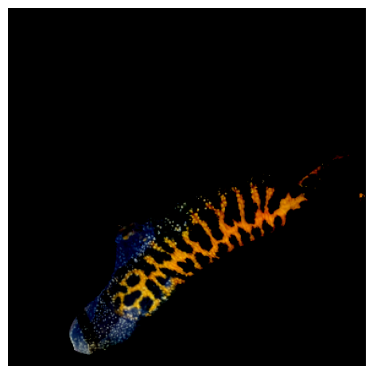
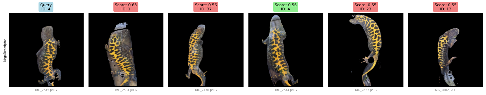

# Baselines


<!-- WARNING: THIS FILE WAS AUTOGENERATED! DO NOT EDIT! -->

``` python
import os
import sys
import torch
import pandas as pd
import numpy as np
import matplotlib.pyplot as plt
from wildlife_tools.similarity import CosineSimilarity
from wildlife_datasets import analysis, datasets, splits
import pycocotools.mask as mask_util
from wildlife_tools.data import ImageDataset
from sklearn.metrics import average_precision_score
import numpy as np
import timm
from transformers import AutoModel
import torch
import numpy as np
from wildlife_tools.inference import TopkClassifier, KnnClassifier
from wildlife_tools.features import DeepFeatures
import torchvision.transforms as T
from PIL import Image
import kaggle
import pandas as pd
from wildlife_tools.data import ImageDataset, FeatureDataset, FeatureDatabase
from gcn_reid.segmentation import decode_rle_mask
from gcn_reid.newt_dataset import upload_to_kaggle
from pathlib import Path
from gcn_reid.newt_dataset import download_kaggle_dataset
from tqdm import tqdm
from transformers import AutoImageProcessor, AutoModel
import cv2
```

    2025-06-26 16:41:47.199241: E external/local_xla/xla/stream_executor/cuda/cuda_fft.cc:477] Unable to register cuFFT factory: Attempting to register factory for plugin cuFFT when one has already been registered
    WARNING: All log messages before absl::InitializeLog() is called are written to STDERR
    E0000 00:00:1750956107.222767   89844 cuda_dnn.cc:8310] Unable to register cuDNN factory: Attempting to register factory for plugin cuDNN when one has already been registered
    E0000 00:00:1750956107.229954   89844 cuda_blas.cc:1418] Unable to register cuBLAS factory: Attempting to register factory for plugin cuBLAS when one has already been registered

``` python
dataset_name = 'mshahoyi/gcn-id-2024'
dataset_path = Path('data/gcn-id-2024')
download_kaggle_dataset(dataset_name, dataset_path)
```

    Dataset already exists at data/gcn-id-2024

    PosixPath('data/gcn-id-2024')

``` python
mega = timm.create_model('hf-hub:BVRA/MegaDescriptor-L-384', pretrained=True, num_classes=0)
miewid = AutoModel.from_pretrained("conservationxlabs/miewid-msv2", trust_remote_code=True)
```

## Run both models on all test sets and save the results

Artifacts are a dataframe like the newt dataframe but that contains two
new columns representing the mega and miewid embeddings.

``` python
device = 'cuda' if torch.cuda.is_available() else 'cpu'
mega_extractor = DeepFeatures(mega, device=device, batch_size=32, num_workers=4)
miewid_extractor = DeepFeatures(miewid, device=device, batch_size=32, num_workers=4)
```

``` python
df = pd.read_csv(dataset_path / 'metadata.csv')
mask = df.is_hard_test_query.notna() | df.is_least_similar_test_query.notna() | df.is_random_test_query.notna()
df = df[mask & ~df.is_video].reset_index(drop=True).rename(columns={"file_name": "image_name", "file_path": "path"})
df
```

<div>
<style scoped>
    .dataframe tbody tr th:only-of-type {
        vertical-align: middle;
    }
&#10;    .dataframe tbody tr th {
        vertical-align: top;
    }
&#10;    .dataframe thead th {
        text-align: right;
    }
</style>

<table class="dataframe" data-quarto-postprocess="true" data-border="1">
<thead>
<tr style="text-align: right;">
<th data-quarto-table-cell-role="th"></th>
<th data-quarto-table-cell-role="th">reference_id</th>
<th data-quarto-table-cell-role="th">path</th>
<th data-quarto-table-cell-role="th">image_name</th>
<th data-quarto-table-cell-role="th">is_video</th>
<th data-quarto-table-cell-role="th">identity</th>
<th data-quarto-table-cell-role="th">creation_date</th>
<th data-quarto-table-cell-role="th">bbox</th>
<th data-quarto-table-cell-role="th">segmentation_mask_rle</th>
<th data-quarto-table-cell-role="th">is_hard_test_query</th>
<th data-quarto-table-cell-role="th">is_hard_val_query</th>
<th data-quarto-table-cell-role="th">is_least_similar_test_query</th>
<th data-quarto-table-cell-role="th">is_least_similar_val_query</th>
<th data-quarto-table-cell-role="th">is_random_test_query</th>
<th data-quarto-table-cell-role="th">is_random_val_query</th>
</tr>
</thead>
<tbody>
<tr>
<td data-quarto-table-cell-role="th">0</td>
<td>GCN34-P3-S2</td>
<td>newts/1/IMG_2532.JPEG</td>
<td>IMG_2532.JPEG</td>
<td>False</td>
<td>1</td>
<td>2024-05-10 08:37:21+00:00</td>
<td>[14.939163208007812, 507.19061279296875, 1066....</td>
<td>2048x1536:Sd`03ko14N0000000bNKcRN0^O5om1KcRN1]...</td>
<td>NaN</td>
<td>False</td>
<td>NaN</td>
<td>NaN</td>
<td>True</td>
<td>NaN</td>
</tr>
<tr>
<td data-quarto-table-cell-role="th">1</td>
<td>GCN34-P3-S2</td>
<td>newts/1/IMG_2530.JPEG</td>
<td>IMG_2530.JPEG</td>
<td>False</td>
<td>1</td>
<td>2024-05-10 08:37:19+00:00</td>
<td>[288.80975341796875, 363.1075439453125, 1062.7...</td>
<td>2048x1536:[ajb03;31K_n1:YQN10O4Knm1h0lQN_O2O0M...</td>
<td>NaN</td>
<td>False</td>
<td>NaN</td>
<td>NaN</td>
<td>False</td>
<td>NaN</td>
</tr>
<tr>
<td data-quarto-table-cell-role="th">2</td>
<td>GCN34-P3-S2</td>
<td>newts/1/IMG_2531.JPEG</td>
<td>IMG_2531.JPEG</td>
<td>False</td>
<td>1</td>
<td>2024-05-10 08:37:20+00:00</td>
<td>[288.86181640625, 521.5284423828125, 1159.4096...</td>
<td>2048x1536:Pcdb07^o1d0D7H=E5K5L5J5K3M4M3M10001N...</td>
<td>NaN</td>
<td>False</td>
<td>NaN</td>
<td>NaN</td>
<td>False</td>
<td>NaN</td>
</tr>
<tr>
<td data-quarto-table-cell-role="th">3</td>
<td>GCN34-P3-S2</td>
<td>newts/1/IMG_2533.JPEG</td>
<td>IMG_2533.JPEG</td>
<td>False</td>
<td>1</td>
<td>2024-05-10 08:37:23+00:00</td>
<td>[489.2838134765625, 169.9361572265625, 1132.72...</td>
<td>2048x1536:X`Vo06do1;H;dNH]RN&gt;[m1e1]O5M4K4M3M3L...</td>
<td>NaN</td>
<td>False</td>
<td>NaN</td>
<td>NaN</td>
<td>False</td>
<td>NaN</td>
</tr>
<tr>
<td data-quarto-table-cell-role="th">4</td>
<td>GCN34-P3-S2</td>
<td>newts/1/IMG_2534.JPEG</td>
<td>IMG_2534.JPEG</td>
<td>False</td>
<td>1</td>
<td>2024-05-10 08:37:24+00:00</td>
<td>[365.6585388183594, 454.51068115234375, 1005.9...</td>
<td>2048x1536:SmZd03lo13M3M2O1O1N2`QNJTm16gRN3Vm1M...</td>
<td>NaN</td>
<td>True</td>
<td>NaN</td>
<td>NaN</td>
<td>False</td>
<td>NaN</td>
</tr>
<tr>
<td data-quarto-table-cell-role="th">...</td>
<td>...</td>
<td>...</td>
<td>...</td>
<td>...</td>
<td>...</td>
<td>...</td>
<td>...</td>
<td>...</td>
<td>...</td>
<td>...</td>
<td>...</td>
<td>...</td>
<td>...</td>
<td>...</td>
</tr>
<tr>
<td data-quarto-table-cell-role="th">418</td>
<td>GCN7-P3-S6</td>
<td>newts/202/IMG_3618.JPEG</td>
<td>IMG_3618.JPEG</td>
<td>False</td>
<td>202</td>
<td>2024-06-07 08:17:00+00:00</td>
<td>[173.46243286132812, 251.09988403320312, 1007....</td>
<td>2046x1538:]UV;2m18ek14RSNJ_O159;@8:j0KRe10^YN2...</td>
<td>False</td>
<td>NaN</td>
<td>False</td>
<td>NaN</td>
<td>NaN</td>
<td>NaN</td>
</tr>
<tr>
<td data-quarto-table-cell-role="th">419</td>
<td>GCN7-P3-S6</td>
<td>newts/202/IMG_3617.JPEG</td>
<td>IMG_3617.JPEG</td>
<td>False</td>
<td>202</td>
<td>2024-06-07 08:16:56+00:00</td>
<td>[333.4060974121094, 442.3371887207031, 1123.58...</td>
<td>2046x1538:Rlde0g0km1G_RNDOQ1ol1POoRN\2kl1`0J5T...</td>
<td>False</td>
<td>NaN</td>
<td>False</td>
<td>NaN</td>
<td>NaN</td>
<td>NaN</td>
</tr>
<tr>
<td data-quarto-table-cell-role="th">420</td>
<td>GCN7-P3-S6</td>
<td>newts/202/IMG_3616.JPEG</td>
<td>IMG_3616.JPEG</td>
<td>False</td>
<td>202</td>
<td>2024-06-07 08:16:55+00:00</td>
<td>[372.7743225097656, 699.0594482421875, 1003.42...</td>
<td>2046x1538:k_lg0;4Kan1c1SO`0D;G8J7H7L4K5L4M4L3M...</td>
<td>True</td>
<td>NaN</td>
<td>False</td>
<td>NaN</td>
<td>NaN</td>
<td>NaN</td>
</tr>
<tr>
<td data-quarto-table-cell-role="th">421</td>
<td>GCN7-P3-S6</td>
<td>newts/202/IMG_3615.JPEG</td>
<td>IMG_3615.JPEG</td>
<td>False</td>
<td>202</td>
<td>2024-06-07 08:16:54+00:00</td>
<td>[414.04083251953125, 1346.5162353515625, 966.7...</td>
<td>2046x1538:Ph`j0&lt;So1h0B?[Oc0Al0WO8I9Bc0C&lt;C6K6I6...</td>
<td>False</td>
<td>NaN</td>
<td>True</td>
<td>NaN</td>
<td>NaN</td>
<td>NaN</td>
</tr>
<tr>
<td data-quarto-table-cell-role="th">422</td>
<td>GCN7-P3-S6</td>
<td>newts/202/IMG_3619.JPEG</td>
<td>IMG_3619.JPEG</td>
<td>False</td>
<td>202</td>
<td>2024-06-07 08:17:01+00:00</td>
<td>[581.1024780273438, 81.09144592285156, 1273.64...</td>
<td>2046x1538:nRlU12ao1n0POP1gjNaNk:l1gD[NR;k1iD[N...</td>
<td>False</td>
<td>NaN</td>
<td>False</td>
<td>NaN</td>
<td>NaN</td>
<td>NaN</td>
</tr>
</tbody>
</table>

<p>423 rows × 14 columns</p>
</div>

``` python
mega_transform = T.Compose([T.Resize(384),
                            T.CenterCrop(384),
                            T.ToTensor(), 
                            T.Normalize([0.5, 0.5, 0.5], [0.5, 0.5, 0.5])]) 

miewid_transform = T.Compose([
    T.Resize(400),
    T.CenterCrop(400),
    T.ToTensor(),
    T.Normalize(mean=[0.485, 0.456, 0.406], std=[0.229, 0.224, 0.225]),
])

mega_transform_rotated = T.Compose([T.Resize(384),
                            T.CenterCrop(384),
                            T.RandomRotation([90, 90]),  # Add 90 degree clockwise rotation
                            T.ToTensor(), 
                            T.Normalize([0.5, 0.5, 0.5], [0.5, 0.5, 0.5])]) 

miewid_transform_rotated = T.Compose([
    T.Resize(400),
    T.CenterCrop(400),
    T.RandomRotation([90, 90]),  # Add 90 degree clockwise rotation
    T.ToTensor(),
    T.Normalize(mean=[0.485, 0.456, 0.406], std=[0.229, 0.224, 0.225]),
])
```

------------------------------------------------------------------------

<a
href="https://github.com/mshahoyi/gcn-reid/blob/main/gcn_reid/newt.py#L32"
target="_blank" style="float:right; font-size:smaller">source</a>

### get_cropped_newt

>  get_cropped_newt (path, rle)

------------------------------------------------------------------------

<a
href="https://github.com/mshahoyi/gcn-reid/blob/main/gcn_reid/newt.py#L49"
target="_blank" style="float:right; font-size:smaller">source</a>

### get_cropping_image_dataset

>  get_cropping_image_dataset ()

``` python
CroppingImageDataset = get_cropping_image_dataset()

mega_cropping_dataset = CroppingImageDataset(df, root=dataset_path, transform=mega_transform, crop_out=True)
miewid_cropping_dataset = CroppingImageDataset(df, root=dataset_path, transform=miewid_transform, crop_out=True)
mega_cropping_dataset_rotated = CroppingImageDataset(df, root=dataset_path, transform=mega_transform_rotated, crop_out=True)
miewid_cropping_dataset_rotated = CroppingImageDataset(df, root=dataset_path, transform=miewid_transform_rotated, crop_out=True)

mega_dataset = ImageDataset(df, root=dataset_path, transform=mega_transform)
miewid_dataset = ImageDataset(df, root=dataset_path, transform=miewid_transform)
mega_dataset_rotated = ImageDataset(df, root=dataset_path, transform=mega_transform_rotated)
miewid_dataset_rotated = ImageDataset(df, root=dataset_path, transform=miewid_transform_rotated)
```

``` python
num_images = 1
for i in range(num_images):
    plt.subplot(1, num_images, i+1)
    x, y = next(iter(mega_cropping_dataset_rotated))
    plt.imshow(x.permute(1, 2, 0))
    plt.axis('off')
    plt.tight_layout()
    plt.savefig('mega_images.png')
```



``` python
artifacts_path = Path('artifacts')
artifacts_path.mkdir(exist_ok=True)
artifacts_name = 'baseline_features.csv'
```

``` python
if not (artifacts_path/artifacts_name).exists():
    mega_results = mega_extractor(mega_dataset)
    miewid_results = miewid_extractor(miewid_dataset)
    mega_results_cropped = mega_extractor(mega_cropping_dataset)
    miewid_results_cropped = miewid_extractor(miewid_cropping_dataset)
    mega_results_cropped_rotated = mega_extractor(mega_cropping_dataset_rotated)
    miewid_results_cropped_rotated = miewid_extractor(miewid_cropping_dataset_rotated)
    mega_results_rotated = mega_extractor(mega_dataset_rotated)
    miewid_results_rotated = miewid_extractor(miewid_dataset_rotated)

    df['mega_features'] = [features.tolist() for features in mega_results.features]
    df['miewid_features'] = [features.tolist() for features in miewid_results.features]
    df['mega_features_cropped'] = [features.tolist() for features in mega_results_cropped.features]
    df['miewid_features_cropped'] = [features.tolist() for features in miewid_results_cropped.features]
    df['mega_features_cropped_rotated'] = [features.tolist() for features in mega_results_cropped_rotated.features]
    df['miewid_features_cropped_rotated'] = [features.tolist() for features in miewid_results_cropped_rotated.features]
    df['mega_features_rotated'] = [features.tolist() for features in mega_results_rotated.features]
    df['miewid_features_rotated'] = [features.tolist() for features in miewid_results_rotated.features]
    df.to_csv(artifacts_path/artifacts_name, index=False)
else: 
    df = pd.read_csv(artifacts_path/artifacts_name)
    df['mega_features'] = df['mega_features'].apply(eval)
    df['miewid_features'] = df['miewid_features'].apply(eval)
    df['mega_features_cropped'] = df['mega_features_cropped'].apply(eval)
    df['miewid_features_cropped'] = df['miewid_features_cropped'].apply(eval)
    df['mega_features_cropped_rotated'] = df['mega_features_cropped_rotated'].apply(eval)
    df['miewid_features_cropped_rotated'] = df['miewid_features_cropped_rotated'].apply(eval)
    df['mega_features_rotated'] = df['mega_features_rotated'].apply(eval)
    df['miewid_features_rotated'] = df['miewid_features_rotated'].apply(eval)
```

# Create debiasing examples

``` python
def create_debiasing_examples(image_path, rle, dataset_path):
    transform_crop = T.Compose([T.Resize(1000), T.CenterCrop(1000), T.ToTensor()])
    transform_crop_rotated = T.Compose([T.Resize(1000), T.CenterCrop(1000), T.RandomRotation([90, 90]), T.ToTensor()])
    
    original_image = Image.open(dataset_path/image_path)
    original_rotated_image = transform_crop_rotated(original_image).permute(1, 2, 0).numpy()
    original_image = transform_crop(original_image).permute(1, 2, 0).numpy()

    cropped_image = get_cropped_newt(dataset_path/image_path, rle)
    cropped_rotated_image = transform_crop_rotated(cropped_image).permute(1, 2, 0).numpy()
    cropped_image = transform_crop(cropped_image).permute(1, 2, 0).numpy()

    save_folder = artifacts_path/'debiasing_examples'
    save_folder.mkdir(exist_ok=True)

    # Save original image
    plt.figure(figsize=(5, 5))
    plt.imshow(original_image)
    plt.axis('off')
    plt.tight_layout()
    plt.savefig(save_folder/Path(image_path).name.replace('.JPEG', '_original.JPEG'), format='JPEG', dpi=300)
    plt.close()

    # Save cropped image
    plt.figure(figsize=(5, 5))
    plt.imshow(cropped_image)
    plt.axis('off')
    plt.tight_layout()
    plt.savefig(save_folder/Path(image_path).name.replace('.JPEG', '_cropped.JPEG'), format='JPEG', dpi=300)
    plt.close()

    # Save original rotated image
    plt.figure(figsize=(5, 5))
    plt.imshow(original_rotated_image)
    plt.axis('off')
    plt.tight_layout()
    plt.savefig(save_folder/Path(image_path).name.replace('.JPEG', '_original_rotated.JPEG'), format='JPEG', dpi=300)
    plt.close()

    # Save cropped rotated image
    plt.figure(figsize=(5, 5))
    plt.imshow(cropped_rotated_image)
    plt.axis('off')
    plt.tight_layout()
    plt.savefig(save_folder/Path(image_path).name.replace('.JPEG', '_cropped_rotated.JPEG'), format='JPEG', dpi=300)
    plt.close()
```

``` python
create_debiasing_examples(df.iloc[10]['path'], df.iloc[10]['segmentation_mask_rle'], dataset_path)
```

``` python
similarity_function = CosineSimilarity()

def get_top_k_accuracy(df, query_col, feature_col, k=1, database_feature_col=None):
    query_df = df[df[query_col] == True].reset_index(drop=True)
    database_df = df[df[query_col] != True].reset_index(drop=True)

    query_dataset = FeatureDataset(features=query_df[feature_col].tolist(), metadata=query_df)
    database_dataset = FeatureDataset(features=database_df[database_feature_col if database_feature_col else feature_col].tolist(), metadata=database_df)

    similarity = similarity_function(query_dataset, database_dataset)

    classifier = TopkClassifier(k=k, database_labels=database_dataset.labels_string, return_all=True)
    predictions, scores, idx = classifier(similarity)
    y = query_dataset.labels_string[:, np.newaxis]
    accuracy = np.mean(np.any(y == predictions, axis=1))

    query_identities = query_dataset.labels_string
    query_filenames = query_df['image_name'].values

    preds_df = pd.DataFrame(predictions, columns=pd.MultiIndex.from_product([['predicted_identity'], range(1, k+1)]))
    scores_df = pd.DataFrame(scores, columns=pd.MultiIndex.from_product([['score'], range(1, k+1)]))
    filenames_df = pd.DataFrame(database_df.iloc[idx.flatten()]['image_name'].values.reshape(idx.shape), columns=pd.MultiIndex.from_product([['predicted_image_name'], range(1, k+1)]))
    query_df = pd.DataFrame(np.column_stack([query_identities, query_filenames]), columns=pd.MultiIndex.from_product([['query'], ['identity', 'image_name']]))
    top_k_df = pd.concat([query_df, preds_df, scores_df, filenames_df], axis=1)

    return accuracy, top_k_df

accuracy, top_k_df = get_top_k_accuracy(df, 'is_hard_test_query', 'miewid_features', k=5)
top_k_df
```

<div>
<style scoped>
    .dataframe tbody tr th:only-of-type {
        vertical-align: middle;
    }
&#10;    .dataframe tbody tr th {
        vertical-align: top;
    }
&#10;    .dataframe thead tr th {
        text-align: left;
    }
</style>

<table class="dataframe" data-quarto-postprocess="true" data-border="1">
<thead>
<tr>
<th data-quarto-table-cell-role="th"></th>
<th colspan="2" data-quarto-table-cell-role="th"
data-halign="left">query</th>
<th colspan="5" data-quarto-table-cell-role="th"
data-halign="left">predicted_identity</th>
<th colspan="5" data-quarto-table-cell-role="th"
data-halign="left">score</th>
<th colspan="5" data-quarto-table-cell-role="th"
data-halign="left">predicted_image_name</th>
</tr>
<tr>
<th data-quarto-table-cell-role="th"></th>
<th data-quarto-table-cell-role="th">identity</th>
<th data-quarto-table-cell-role="th">image_name</th>
<th data-quarto-table-cell-role="th">1</th>
<th data-quarto-table-cell-role="th">2</th>
<th data-quarto-table-cell-role="th">3</th>
<th data-quarto-table-cell-role="th">4</th>
<th data-quarto-table-cell-role="th">5</th>
<th data-quarto-table-cell-role="th">1</th>
<th data-quarto-table-cell-role="th">2</th>
<th data-quarto-table-cell-role="th">3</th>
<th data-quarto-table-cell-role="th">4</th>
<th data-quarto-table-cell-role="th">5</th>
<th data-quarto-table-cell-role="th">1</th>
<th data-quarto-table-cell-role="th">2</th>
<th data-quarto-table-cell-role="th">3</th>
<th data-quarto-table-cell-role="th">4</th>
<th data-quarto-table-cell-role="th">5</th>
</tr>
</thead>
<tbody>
<tr>
<td data-quarto-table-cell-role="th">0</td>
<td>4</td>
<td>IMG_2545.JPEG</td>
<td>4</td>
<td>9</td>
<td>5</td>
<td>31</td>
<td>28</td>
<td>0.724900</td>
<td>0.669199</td>
<td>0.664537</td>
<td>0.648287</td>
<td>0.644597</td>
<td>IMG_2546.JPEG</td>
<td>IMG_2560.JPEG</td>
<td>IMG_2573.JPEG</td>
<td>IMG_2517.JPEG</td>
<td>IMG_2489.JPEG</td>
</tr>
<tr>
<td data-quarto-table-cell-role="th">1</td>
<td>28</td>
<td>IMG_2488.JPEG</td>
<td>28</td>
<td>30</td>
<td>8</td>
<td>54</td>
<td>27</td>
<td>0.732097</td>
<td>0.706550</td>
<td>0.674637</td>
<td>0.660041</td>
<td>0.657237</td>
<td>IMG_2490.JPEG</td>
<td>IMG_2483.JPEG</td>
<td>IMG_2586.JPEG</td>
<td>IMG_2404.JPEG</td>
<td>IMG_2453.JPEG</td>
</tr>
<tr>
<td data-quarto-table-cell-role="th">2</td>
<td>31</td>
<td>IMG_2521.JPEG</td>
<td>31</td>
<td>25</td>
<td>41</td>
<td>71</td>
<td>9</td>
<td>0.832421</td>
<td>0.702387</td>
<td>0.696077</td>
<td>0.688054</td>
<td>0.666718</td>
<td>IMG_2519.JPEG</td>
<td>IMG_2631.JPEG</td>
<td>IMG_2392.JPEG</td>
<td>IMG_3886.JPEG</td>
<td>IMG_2561.JPEG</td>
</tr>
<tr>
<td data-quarto-table-cell-role="th">3</td>
<td>39</td>
<td>IMG_2321.JPEG</td>
<td>28</td>
<td>39</td>
<td>57</td>
<td>181</td>
<td>4</td>
<td>0.534586</td>
<td>0.528971</td>
<td>0.525703</td>
<td>0.508656</td>
<td>0.504368</td>
<td>IMG_2486.JPEG</td>
<td>IMG_2320.JPEG</td>
<td>IMG_2349.JPEG</td>
<td>IMG_2274.JPEG</td>
<td>IMG_2546.JPEG</td>
</tr>
<tr>
<td data-quarto-table-cell-role="th">4</td>
<td>41</td>
<td>IMG_2391.JPEG</td>
<td>41</td>
<td>28</td>
<td>50</td>
<td>37</td>
<td>31</td>
<td>0.656017</td>
<td>0.608335</td>
<td>0.595848</td>
<td>0.593409</td>
<td>0.590966</td>
<td>IMG_2392.JPEG</td>
<td>IMG_2493.JPEG</td>
<td>IMG_2408.JPEG</td>
<td>IMG_2471.JPEG</td>
<td>IMG_2517.JPEG</td>
</tr>
<tr>
<td data-quarto-table-cell-role="th">5</td>
<td>44</td>
<td>IMG_2338.JPEG</td>
<td>47</td>
<td>57</td>
<td>46</td>
<td>29</td>
<td>22</td>
<td>0.528066</td>
<td>0.525686</td>
<td>0.524369</td>
<td>0.515956</td>
<td>0.514654</td>
<td>IMG_2358.JPEG</td>
<td>IMG_2349.JPEG</td>
<td>IMG_2330.JPEG</td>
<td>IMG_2498.JPEG</td>
<td>IMG_2680.JPEG</td>
</tr>
<tr>
<td data-quarto-table-cell-role="th">6</td>
<td>50</td>
<td>IMG_2411.JPEG</td>
<td>50</td>
<td>28</td>
<td>84</td>
<td>30</td>
<td>16</td>
<td>0.677512</td>
<td>0.601997</td>
<td>0.594606</td>
<td>0.591716</td>
<td>0.577166</td>
<td>IMG_2410.JPEG</td>
<td>IMG_2489.JPEG</td>
<td>IMG_2859.JPEG</td>
<td>IMG_2481.JPEG</td>
<td>IMG_2660.JPEG</td>
</tr>
<tr>
<td data-quarto-table-cell-role="th">7</td>
<td>54</td>
<td>IMG_2399.JPEG</td>
<td>54</td>
<td>21</td>
<td>13</td>
<td>14</td>
<td>31</td>
<td>0.753215</td>
<td>0.690221</td>
<td>0.655265</td>
<td>0.653530</td>
<td>0.646022</td>
<td>IMG_2403.JPEG</td>
<td>IMG_2690.JPEG</td>
<td>IMG_2601.JPEG</td>
<td>IMG_2613.JPEG</td>
<td>IMG_2516.JPEG</td>
</tr>
<tr>
<td data-quarto-table-cell-role="th">8</td>
<td>57</td>
<td>IMG_2352.JPEG</td>
<td>46</td>
<td>119</td>
<td>50</td>
<td>57</td>
<td>9</td>
<td>0.438227</td>
<td>0.426473</td>
<td>0.423811</td>
<td>0.387412</td>
<td>0.384438</td>
<td>IMG_2330.JPEG</td>
<td>IMG_3168.JPEG</td>
<td>IMG_2406.JPEG</td>
<td>IMG_2349.JPEG</td>
<td>IMG_2558.JPEG</td>
</tr>
<tr>
<td data-quarto-table-cell-role="th">9</td>
<td>59</td>
<td>IMG_2720.JPEG</td>
<td>59</td>
<td>41</td>
<td>28</td>
<td>178</td>
<td>181</td>
<td>0.774729</td>
<td>0.682074</td>
<td>0.674501</td>
<td>0.672033</td>
<td>0.661656</td>
<td>IMG_2718.JPEG</td>
<td>IMG_2392.JPEG</td>
<td>IMG_2487.JPEG</td>
<td>IMG_3383.JPEG</td>
<td>IMG_2275.JPEG</td>
</tr>
<tr>
<td data-quarto-table-cell-role="th">10</td>
<td>68</td>
<td>IMG_3809.JPEG</td>
<td>68</td>
<td>199</td>
<td>197</td>
<td>202</td>
<td>12</td>
<td>0.378799</td>
<td>0.353345</td>
<td>0.351397</td>
<td>0.339890</td>
<td>0.330514</td>
<td>IMG_3805.JPEG</td>
<td>IMG_3594.JPEG</td>
<td>IMG_3607.JPEG</td>
<td>IMG_3615.JPEG</td>
<td>IMG_2677.JPEG</td>
</tr>
<tr>
<td data-quarto-table-cell-role="th">11</td>
<td>71</td>
<td>IMG_3884.JPEG</td>
<td>71</td>
<td>31</td>
<td>41</td>
<td>119</td>
<td>178</td>
<td>0.717556</td>
<td>0.677027</td>
<td>0.647288</td>
<td>0.647048</td>
<td>0.643674</td>
<td>IMG_3885.JPEG</td>
<td>IMG_2520.JPEG</td>
<td>IMG_2392.JPEG</td>
<td>IMG_3170.JPEG</td>
<td>IMG_3383.JPEG</td>
</tr>
<tr>
<td data-quarto-table-cell-role="th">12</td>
<td>84</td>
<td>IMG_2858.JPEG</td>
<td>84</td>
<td>47</td>
<td>46</td>
<td>28</td>
<td>50</td>
<td>0.607246</td>
<td>0.581266</td>
<td>0.546994</td>
<td>0.546238</td>
<td>0.540468</td>
<td>IMG_2859.JPEG</td>
<td>IMG_2358.JPEG</td>
<td>IMG_2331.JPEG</td>
<td>IMG_2487.JPEG</td>
<td>IMG_2407.JPEG</td>
</tr>
<tr>
<td data-quarto-table-cell-role="th">13</td>
<td>85</td>
<td>IMG_2875.JPEG</td>
<td>8</td>
<td>28</td>
<td>25</td>
<td>85</td>
<td>89</td>
<td>0.636757</td>
<td>0.610658</td>
<td>0.609270</td>
<td>0.603354</td>
<td>0.602769</td>
<td>IMG_2585.JPEG</td>
<td>IMG_2490.JPEG</td>
<td>IMG_2631.JPEG</td>
<td>IMG_2874.JPEG</td>
<td>IMG_2838.JPEG</td>
</tr>
<tr>
<td data-quarto-table-cell-role="th">14</td>
<td>89</td>
<td>IMG_2836.JPEG</td>
<td>117</td>
<td>89</td>
<td>47</td>
<td>119</td>
<td>104</td>
<td>0.617693</td>
<td>0.612058</td>
<td>0.597806</td>
<td>0.574640</td>
<td>0.564394</td>
<td>IMG_3099.JPEG</td>
<td>IMG_2837.JPEG</td>
<td>IMG_2358.JPEG</td>
<td>IMG_3168.JPEG</td>
<td>IMG_3139.JPEG</td>
</tr>
<tr>
<td data-quarto-table-cell-role="th">15</td>
<td>92</td>
<td>IMG_2801.JPEG</td>
<td>92</td>
<td>139</td>
<td>13</td>
<td>16</td>
<td>54</td>
<td>0.699239</td>
<td>0.619799</td>
<td>0.594736</td>
<td>0.592516</td>
<td>0.589169</td>
<td>IMG_2802.JPEG</td>
<td>IMG_2909.JPEG</td>
<td>IMG_2601.JPEG</td>
<td>IMG_2656.JPEG</td>
<td>IMG_2403.JPEG</td>
</tr>
<tr>
<td data-quarto-table-cell-role="th">16</td>
<td>102</td>
<td>IMG_3556.JPEG</td>
<td>102</td>
<td>197</td>
<td>12</td>
<td>139</td>
<td>199</td>
<td>0.853831</td>
<td>0.523109</td>
<td>0.447423</td>
<td>0.439412</td>
<td>0.424171</td>
<td>IMG_3557.JPEG</td>
<td>IMG_3604.JPEG</td>
<td>IMG_2677.JPEG</td>
<td>IMG_2917.JPEG</td>
<td>IMG_3592.JPEG</td>
</tr>
<tr>
<td data-quarto-table-cell-role="th">17</td>
<td>104</td>
<td>IMG_3141.JPEG</td>
<td>104</td>
<td>117</td>
<td>119</td>
<td>139</td>
<td>191</td>
<td>0.661345</td>
<td>0.603737</td>
<td>0.598735</td>
<td>0.597498</td>
<td>0.596887</td>
<td>IMG_3140.JPEG</td>
<td>IMG_3103.JPEG</td>
<td>IMG_3171.JPEG</td>
<td>IMG_2914.JPEG</td>
<td>IMG_3664.JPEG</td>
</tr>
<tr>
<td data-quarto-table-cell-role="th">18</td>
<td>116</td>
<td>IMG_3109.JPEG</td>
<td>116</td>
<td>14</td>
<td>31</td>
<td>158</td>
<td>10</td>
<td>0.668391</td>
<td>0.616541</td>
<td>0.614679</td>
<td>0.605539</td>
<td>0.595929</td>
<td>IMG_3106.JPEG</td>
<td>IMG_2612.JPEG</td>
<td>IMG_2517.JPEG</td>
<td>IMG_3352.JPEG</td>
<td>IMG_2550.JPEG</td>
</tr>
<tr>
<td data-quarto-table-cell-role="th">19</td>
<td>117</td>
<td>IMG_3100.JPEG</td>
<td>19</td>
<td>117</td>
<td>8</td>
<td>37</td>
<td>18</td>
<td>0.698817</td>
<td>0.682098</td>
<td>0.666107</td>
<td>0.659217</td>
<td>0.657740</td>
<td>IMG_2646.JPEG</td>
<td>IMG_3101.JPEG</td>
<td>IMG_2583.JPEG</td>
<td>IMG_2469.JPEG</td>
<td>IMG_2606.JPEG</td>
</tr>
<tr>
<td data-quarto-table-cell-role="th">20</td>
<td>126</td>
<td>IMG_3251.JPEG</td>
<td>126</td>
<td>139</td>
<td>104</td>
<td>59</td>
<td>119</td>
<td>0.629487</td>
<td>0.623958</td>
<td>0.578767</td>
<td>0.572536</td>
<td>0.568722</td>
<td>IMG_3249.JPEG</td>
<td>IMG_2911.JPEG</td>
<td>IMG_3138.JPEG</td>
<td>IMG_2721.JPEG</td>
<td>IMG_3172.JPEG</td>
</tr>
<tr>
<td data-quarto-table-cell-role="th">21</td>
<td>128</td>
<td>IMG_3178.JPEG</td>
<td>128</td>
<td>9</td>
<td>195</td>
<td>41</td>
<td>71</td>
<td>0.641611</td>
<td>0.574624</td>
<td>0.561152</td>
<td>0.556977</td>
<td>0.554869</td>
<td>IMG_3176.JPEG</td>
<td>IMG_2561.JPEG</td>
<td>IMG_3657.JPEG</td>
<td>IMG_2394.JPEG</td>
<td>IMG_3885.JPEG</td>
</tr>
<tr>
<td data-quarto-table-cell-role="th">22</td>
<td>139</td>
<td>IMG_2910.JPEG</td>
<td>139</td>
<td>183</td>
<td>104</td>
<td>116</td>
<td>119</td>
<td>0.767497</td>
<td>0.659423</td>
<td>0.658805</td>
<td>0.646301</td>
<td>0.638824</td>
<td>IMG_2912.JPEG</td>
<td>IMG_2291.JPEG</td>
<td>IMG_3138.JPEG</td>
<td>IMG_3105.JPEG</td>
<td>IMG_3172.JPEG</td>
</tr>
<tr>
<td data-quarto-table-cell-role="th">23</td>
<td>158</td>
<td>IMG_3350.JPEG</td>
<td>158</td>
<td>59</td>
<td>50</td>
<td>41</td>
<td>70</td>
<td>0.592602</td>
<td>0.590315</td>
<td>0.586506</td>
<td>0.569277</td>
<td>0.562232</td>
<td>IMG_3352.JPEG</td>
<td>IMG_2721.JPEG</td>
<td>IMG_2408.JPEG</td>
<td>IMG_2392.JPEG</td>
<td>IMG_3742.JPEG</td>
</tr>
<tr>
<td data-quarto-table-cell-role="th">24</td>
<td>165</td>
<td>IMG_3281.JPEG</td>
<td>178</td>
<td>31</td>
<td>119</td>
<td>181</td>
<td>14</td>
<td>0.515876</td>
<td>0.510022</td>
<td>0.508807</td>
<td>0.498197</td>
<td>0.489520</td>
<td>IMG_3383.JPEG</td>
<td>IMG_2517.JPEG</td>
<td>IMG_3168.JPEG</td>
<td>IMG_2278.JPEG</td>
<td>IMG_2611.JPEG</td>
</tr>
<tr>
<td data-quarto-table-cell-role="th">25</td>
<td>178</td>
<td>IMG_3384.JPEG</td>
<td>178</td>
<td>25</td>
<td>9</td>
<td>71</td>
<td>41</td>
<td>0.788880</td>
<td>0.698863</td>
<td>0.682134</td>
<td>0.669123</td>
<td>0.667040</td>
<td>IMG_3383.JPEG</td>
<td>IMG_2631.JPEG</td>
<td>IMG_2561.JPEG</td>
<td>IMG_3887.JPEG</td>
<td>IMG_2392.JPEG</td>
</tr>
<tr>
<td data-quarto-table-cell-role="th">26</td>
<td>191</td>
<td>IMG_3663.JPEG</td>
<td>191</td>
<td>195</td>
<td>20</td>
<td>41</td>
<td>13</td>
<td>0.736426</td>
<td>0.678062</td>
<td>0.651511</td>
<td>0.633150</td>
<td>0.611358</td>
<td>IMG_3662.JPEG</td>
<td>IMG_3657.JPEG</td>
<td>IMG_2618.JPEG</td>
<td>IMG_2395.JPEG</td>
<td>IMG_2603.JPEG</td>
</tr>
<tr>
<td data-quarto-table-cell-role="th">27</td>
<td>195</td>
<td>IMG_3659.JPEG</td>
<td>195</td>
<td>191</td>
<td>117</td>
<td>15</td>
<td>71</td>
<td>0.726708</td>
<td>0.674290</td>
<td>0.601323</td>
<td>0.592833</td>
<td>0.583114</td>
<td>IMG_3660.JPEG</td>
<td>IMG_3664.JPEG</td>
<td>IMG_3103.JPEG</td>
<td>IMG_2641.JPEG</td>
<td>IMG_3886.JPEG</td>
</tr>
<tr>
<td data-quarto-table-cell-role="th">28</td>
<td>197</td>
<td>IMG_3608.JPEG</td>
<td>102</td>
<td>11</td>
<td>199</td>
<td>197</td>
<td>27</td>
<td>0.370432</td>
<td>0.368753</td>
<td>0.357455</td>
<td>0.354092</td>
<td>0.349813</td>
<td>IMG_3557.JPEG</td>
<td>IMG_2576.JPEG</td>
<td>IMG_3591.JPEG</td>
<td>IMG_3606.JPEG</td>
<td>IMG_2452.JPEG</td>
</tr>
<tr>
<td data-quarto-table-cell-role="th">29</td>
<td>202</td>
<td>IMG_3616.JPEG</td>
<td>202</td>
<td>197</td>
<td>199</td>
<td>126</td>
<td>26</td>
<td>0.512071</td>
<td>0.418952</td>
<td>0.408919</td>
<td>0.394108</td>
<td>0.393312</td>
<td>IMG_3617.JPEG</td>
<td>IMG_3604.JPEG</td>
<td>IMG_3595.JPEG</td>
<td>IMG_3247.JPEG</td>
<td>IMG_2692.JPEG</td>
</tr>
</tbody>
</table>

</div>

``` python
def calculate_map(df, query_col, feature_col, database_feature_col=None):
    """
    Calculate mean Average Precision (mAP) for retrieval task.
    
    Args:
        df: DataFrame containing features and metadata
        query_col: Column name indicating query samples (boolean)
        feature_col: Column name containing features for queries
        database_feature_col: Column name containing features for database (if different from feature_col)
    
    Returns:
        mAP: Mean Average Precision score
    """
    from sklearn.metrics import average_precision_score
    
    query_df = df[df[query_col] == True].reset_index(drop=True)
    database_df = df[df[query_col] != True].reset_index(drop=True)

    query_dataset = FeatureDataset(features=query_df[feature_col].tolist(), metadata=query_df)
    database_dataset = FeatureDataset(features=database_df[database_feature_col if database_feature_col else feature_col].tolist(), metadata=database_df)

    similarity = similarity_function(query_dataset, database_dataset)
    
    aps = []
    
    for i, query_label in enumerate(query_dataset.labels_string):
        # Get similarity scores for this query
        scores = similarity[i]
        
        # Create binary relevance labels (1 if same identity, 0 otherwise)
        relevance = (database_dataset.labels_string == query_label).astype(int)
        
        # Calculate Average Precision for this query
        if np.sum(relevance) > 0:  # Only if there are relevant items
            ap = average_precision_score(relevance, scores)
            aps.append(ap)
    
    return np.mean(aps) if aps else 0.0
```

``` python
test_map = calculate_map(df, 'is_hard_test_query', 'miewid_features')
test_map
```

    0.4900472748367101

``` python
# Calculate mAP for all your configurations
# Hard test queries
map_mega_hard = calculate_map(df, 'is_hard_test_query', 'mega_features')
map_miewid_hard = calculate_map(df, 'is_hard_test_query', 'miewid_features')
map_mega_hard_cropped = calculate_map(df, 'is_hard_test_query', 'mega_features_cropped')
map_miewid_hard_cropped = calculate_map(df, 'is_hard_test_query', 'miewid_features_cropped')
map_mega_hard_rotated = calculate_map(df, 'is_hard_test_query', 'mega_features', 'mega_features_rotated')
map_miewid_hard_rotated = calculate_map(df, 'is_hard_test_query', 'miewid_features', 'miewid_features_rotated')
map_mega_hard_cropped_rotated = calculate_map(df, 'is_hard_test_query', 'mega_features_cropped', 'mega_features_cropped_rotated')
map_miewid_hard_cropped_rotated = calculate_map(df, 'is_hard_test_query', 'miewid_features_cropped', 'miewid_features_cropped_rotated')

# Random test queries
map_mega_random = calculate_map(df, 'is_random_test_query', 'mega_features')
map_miewid_random = calculate_map(df, 'is_random_test_query', 'miewid_features')
map_mega_random_cropped = calculate_map(df, 'is_random_test_query', 'mega_features_cropped')
map_miewid_random_cropped = calculate_map(df, 'is_random_test_query', 'miewid_features_cropped')
map_mega_random_rotated = calculate_map(df, 'is_random_test_query', 'mega_features', 'mega_features_rotated')
map_miewid_random_rotated = calculate_map(df, 'is_random_test_query', 'miewid_features', 'miewid_features_rotated')
map_mega_random_cropped_rotated = calculate_map(df, 'is_random_test_query', 'mega_features_cropped', 'mega_features_cropped_rotated')
map_miewid_random_cropped_rotated = calculate_map(df, 'is_random_test_query', 'miewid_features_cropped', 'miewid_features_cropped_rotated')

# Least similar test queries
map_mega_least = calculate_map(df, 'is_least_similar_test_query', 'mega_features')
map_miewid_least = calculate_map(df, 'is_least_similar_test_query', 'miewid_features')
map_mega_least_cropped = calculate_map(df, 'is_least_similar_test_query', 'mega_features_cropped')
map_miewid_least_cropped = calculate_map(df, 'is_least_similar_test_query', 'miewid_features_cropped')
map_mega_least_rotated = calculate_map(df, 'is_least_similar_test_query', 'mega_features', 'mega_features_rotated')
map_miewid_least_rotated = calculate_map(df, 'is_least_similar_test_query', 'miewid_features', 'miewid_features_rotated')
map_mega_least_cropped_rotated = calculate_map(df, 'is_least_similar_test_query', 'mega_features_cropped', 'mega_features_cropped_rotated')
map_miewid_least_cropped_rotated = calculate_map(df, 'is_least_similar_test_query', 'miewid_features_cropped', 'miewid_features_cropped_rotated')
```

``` python
acc_mega_top_1_hard, acc_mega_top_1_hard_df = get_top_k_accuracy(df, 'is_hard_test_query', 'mega_features', k=1)
acc_mega_top_5_hard, acc_mega_top_5_hard_df = get_top_k_accuracy(df, 'is_hard_test_query', 'mega_features', k=5)
acc_miewid_top_1_hard, acc_miewid_top_1_hard_df = get_top_k_accuracy(df, 'is_hard_test_query', 'miewid_features', k=1)
acc_miewid_top_5_hard, acc_miewid_top_5_hard_df = get_top_k_accuracy(df, 'is_hard_test_query', 'miewid_features', k=5)
```

``` python
acc_mega_top_1_hard_cropped, acc_mega_top_1_hard_cropped_df = get_top_k_accuracy(df, 'is_hard_test_query', 'mega_features_cropped', k=1)
acc_mega_top_5_hard_cropped, acc_mega_top_5_hard_cropped_df = get_top_k_accuracy(df, 'is_hard_test_query', 'mega_features_cropped', k=5)
acc_miewid_top_1_hard_cropped, acc_miewid_top_1_hard_cropped_df = get_top_k_accuracy(df, 'is_hard_test_query', 'miewid_features_cropped', k=1)
acc_miewid_top_5_hard_cropped, acc_miewid_top_5_hard_cropped_df = get_top_k_accuracy(df, 'is_hard_test_query', 'miewid_features_cropped', k=5)
```

``` python
acc_mega_top_1_hard_rotated, acc_mega_top_1_hard_rotated_df = get_top_k_accuracy(df, 'is_hard_test_query', 'mega_features', k=1, database_feature_col='mega_features_rotated')
acc_mega_top_5_hard_rotated, acc_mega_top_5_hard_rotated_df = get_top_k_accuracy(df, 'is_hard_test_query', 'mega_features', k=5, database_feature_col='mega_features_rotated')
acc_miewid_top_1_hard_rotated, acc_miewid_top_1_hard_rotated_df = get_top_k_accuracy(df, 'is_hard_test_query', 'miewid_features', k=1, database_feature_col='miewid_features_rotated')
acc_miewid_top_5_hard_rotated, acc_miewid_top_5_hard_rotated_df = get_top_k_accuracy(df, 'is_hard_test_query', 'miewid_features', k=5, database_feature_col='miewid_features_rotated')
```

``` python
acc_mega_top_1_hard_cropped_rotated, acc_mega_top_1_hard_cropped_rotated_df = get_top_k_accuracy(df, 'is_hard_test_query', 'mega_features_cropped', k=1, database_feature_col='mega_features_cropped_rotated')
acc_mega_top_5_hard_cropped_rotated, acc_mega_top_5_hard_cropped_rotated_df = get_top_k_accuracy(df, 'is_hard_test_query', 'mega_features_cropped', k=5, database_feature_col='mega_features_cropped_rotated')
acc_miewid_top_1_hard_cropped_rotated, acc_miewid_top_1_hard_cropped_rotated_df = get_top_k_accuracy(df, 'is_hard_test_query', 'miewid_features_cropped', k=1, database_feature_col='miewid_features_cropped_rotated')
acc_miewid_top_5_hard_cropped_rotated, acc_miewid_top_5_hard_cropped_rotated_df = get_top_k_accuracy(df, 'is_hard_test_query', 'miewid_features_cropped', k=5, database_feature_col='miewid_features_cropped_rotated')
```

``` python
acc_mega_top_1_random, acc_mega_top_1_random_df = get_top_k_accuracy(df, 'is_random_test_query', 'mega_features', k=1)
acc_mega_top_5_random, acc_mega_top_5_random_df = get_top_k_accuracy(df, 'is_random_test_query', 'mega_features', k=5)
acc_miewid_top_1_random, acc_miewid_top_1_random_df = get_top_k_accuracy(df, 'is_random_test_query', 'miewid_features', k=1)
acc_miewid_top_5_random, acc_miewid_top_5_random_df = get_top_k_accuracy(df, 'is_random_test_query', 'miewid_features', k=5)
```

``` python
acc_mega_top_1_random_cropped, acc_mega_top_1_random_cropped_df = get_top_k_accuracy(df, 'is_random_test_query', 'mega_features_cropped', k=1)
acc_mega_top_5_random_cropped, acc_mega_top_5_random_cropped_df = get_top_k_accuracy(df, 'is_random_test_query', 'mega_features_cropped', k=5)
acc_miewid_top_1_random_cropped, acc_miewid_top_1_random_cropped_df = get_top_k_accuracy(df, 'is_random_test_query', 'miewid_features_cropped', k=1)
acc_miewid_top_5_random_cropped, acc_miewid_top_5_random_cropped_df = get_top_k_accuracy(df, 'is_random_test_query', 'miewid_features_cropped', k=5)
```

``` python
acc_mega_top_1_random_rotated, acc_mega_top_1_random_rotated_df = get_top_k_accuracy(df, 'is_random_test_query', 'mega_features', k=1, database_feature_col='mega_features_rotated')
acc_mega_top_5_random_rotated, acc_mega_top_5_random_rotated_df = get_top_k_accuracy(df, 'is_random_test_query', 'mega_features', k=5, database_feature_col='mega_features_rotated')
acc_miewid_top_1_random_rotated, acc_miewid_top_1_random_rotated_df = get_top_k_accuracy(df, 'is_random_test_query', 'miewid_features', k=1, database_feature_col='miewid_features_rotated')
acc_miewid_top_5_random_rotated, acc_miewid_top_5_random_rotated_df = get_top_k_accuracy(df, 'is_random_test_query', 'miewid_features', k=5, database_feature_col='miewid_features_rotated')
```

``` python
acc_mega_top_1_random_cropped_rotated, acc_mega_top_1_random_cropped_rotated_df = get_top_k_accuracy(df, 'is_random_test_query', 'mega_features_cropped', k=1, database_feature_col='mega_features_cropped_rotated')
acc_mega_top_5_random_cropped_rotated, acc_mega_top_5_random_cropped_rotated_df = get_top_k_accuracy(df, 'is_random_test_query', 'mega_features_cropped', k=5, database_feature_col='mega_features_cropped_rotated')
acc_miewid_top_1_random_cropped_rotated, acc_miewid_top_1_random_cropped_rotated_df = get_top_k_accuracy(df, 'is_random_test_query', 'miewid_features_cropped', k=1, database_feature_col='miewid_features_cropped_rotated')
acc_miewid_top_5_random_cropped_rotated, acc_miewid_top_5_random_cropped_rotated_df = get_top_k_accuracy(df, 'is_random_test_query', 'miewid_features_cropped', k=5, database_feature_col='miewid_features_cropped_rotated')
```

``` python
acc_mega_top_1_least, acc_mega_top_1_least_df = get_top_k_accuracy(df, 'is_least_similar_test_query', 'mega_features', k=1)
acc_mega_top_5_least, acc_mega_top_5_least_df = get_top_k_accuracy(df, 'is_least_similar_test_query', 'mega_features', k=5)
acc_miewid_top_1_least, acc_miewid_top_1_least_df = get_top_k_accuracy(df, 'is_least_similar_test_query', 'miewid_features', k=1)
acc_miewid_top_5_least, acc_miewid_top_5_least_df = get_top_k_accuracy(df, 'is_least_similar_test_query', 'miewid_features', k=5)
```

``` python
acc_mega_top_1_least_cropped, acc_mega_top_1_least_cropped_df = get_top_k_accuracy(df, 'is_least_similar_test_query', 'mega_features_cropped', k=1)
acc_mega_top_5_least_cropped, acc_mega_top_5_least_cropped_df = get_top_k_accuracy(df, 'is_least_similar_test_query', 'mega_features_cropped', k=5)
acc_miewid_top_1_least_cropped, acc_miewid_top_1_least_cropped_df = get_top_k_accuracy(df, 'is_least_similar_test_query', 'miewid_features_cropped', k=1)
acc_miewid_top_5_least_cropped, acc_miewid_top_5_least_cropped_df = get_top_k_accuracy(df, 'is_least_similar_test_query', 'miewid_features_cropped', k=5)
```

``` python
acc_mega_top_1_least_rotated, acc_mega_top_1_least_rotated_df = get_top_k_accuracy(df, 'is_least_similar_test_query', 'mega_features', k=1, database_feature_col='mega_features_rotated')
acc_mega_top_5_least_rotated, acc_mega_top_5_least_rotated_df = get_top_k_accuracy(df, 'is_least_similar_test_query', 'mega_features', k=5, database_feature_col='mega_features_rotated')
acc_miewid_top_1_least_rotated, acc_miewid_top_1_least_rotated_df = get_top_k_accuracy(df, 'is_least_similar_test_query', 'miewid_features', k=1, database_feature_col='miewid_features_rotated')
acc_miewid_top_5_least_rotated, acc_miewid_top_5_least_rotated_df = get_top_k_accuracy(df, 'is_least_similar_test_query', 'miewid_features', k=5, database_feature_col='miewid_features_rotated')
```

``` python
acc_mega_top_1_least_cropped_rotated, acc_mega_top_1_least_cropped_rotated_df = get_top_k_accuracy(df, 'is_least_similar_test_query', 'mega_features_cropped', k=1, database_feature_col='mega_features_cropped_rotated')
acc_mega_top_5_least_cropped_rotated, acc_mega_top_5_least_cropped_rotated_df = get_top_k_accuracy(df, 'is_least_similar_test_query', 'mega_features_cropped', k=5, database_feature_col='mega_features_cropped_rotated')
acc_miewid_top_1_least_cropped_rotated, acc_miewid_top_1_least_cropped_rotated_df = get_top_k_accuracy(df, 'is_least_similar_test_query', 'miewid_features_cropped', k=1, database_feature_col='miewid_features_cropped_rotated')
acc_miewid_top_5_least_cropped_rotated, acc_miewid_top_5_least_cropped_rotated_df = get_top_k_accuracy(df, 'is_least_similar_test_query', 'miewid_features_cropped', k=5, database_feature_col='miewid_features_cropped_rotated')
```

``` python
# Splits
random = 'Random'
least_similar = 'Least Similar'
hard = 'Hard'

# Debiasing
original = 'Original'
bg_removed = 'Background Removed'
rotated = 'Rotated'
bg_removed_rotated = 'Background Removed + Rotated'

# Models
mega = 'MegaDescriptor'
miewid = 'MiewID'

# Metrics
top_1 = 'Top-1'
top_5 = 'Top-5'
mAP = 'mAP'

# Create hierarchical index for rows
row_idx = pd.MultiIndex.from_product([
    [random, least_similar, hard],
    [original, bg_removed, rotated, bg_removed_rotated]
], names=['split', 'debiasing'])

# Create hierarchical columns
col_idx = pd.MultiIndex.from_product([
    [mega, miewid], 
    [top_1, top_5, mAP]
], names=['model', 'metric'])

# Update your results DataFrame to include mAP
# Add mAP column to your existing results_df
data_with_map = [
    # Random split
    [acc_mega_top_1_random, acc_mega_top_5_random, map_mega_random, acc_miewid_top_1_random, acc_miewid_top_5_random, map_miewid_random],
    [acc_mega_top_1_random_cropped, acc_mega_top_5_random_cropped, map_mega_random_cropped, acc_miewid_top_1_random_cropped, acc_miewid_top_5_random_cropped, map_miewid_random_cropped],
    [acc_mega_top_1_random_rotated, acc_mega_top_5_random_rotated, map_mega_random_rotated, acc_miewid_top_1_random_rotated, acc_miewid_top_5_random_rotated, map_miewid_random_rotated],
    [acc_mega_top_1_random_cropped_rotated, acc_mega_top_5_random_cropped_rotated, map_mega_random_cropped_rotated, acc_miewid_top_1_random_cropped_rotated, acc_miewid_top_5_random_cropped_rotated, map_miewid_random_cropped_rotated],
    
    # Least similar split
    [acc_mega_top_1_least, acc_mega_top_5_least, map_mega_least, acc_miewid_top_1_least, acc_miewid_top_5_least, map_miewid_least],
    [acc_mega_top_1_least_cropped, acc_mega_top_5_least_cropped, map_mega_least_cropped, acc_miewid_top_1_least_cropped, acc_miewid_top_5_least_cropped, map_miewid_least_cropped],
    [acc_mega_top_1_least_rotated, acc_mega_top_5_least_rotated, map_mega_least_rotated, acc_miewid_top_1_least_rotated, acc_miewid_top_5_least_rotated, map_miewid_least_rotated],
    [acc_mega_top_1_least_cropped_rotated, acc_mega_top_5_least_cropped_rotated, map_mega_least_cropped_rotated, acc_miewid_top_1_least_cropped_rotated, acc_miewid_top_5_least_cropped_rotated, map_miewid_least_cropped_rotated],
    
    # Hard split
    [acc_mega_top_1_hard, acc_mega_top_5_hard, map_mega_hard, acc_miewid_top_1_hard, acc_miewid_top_5_hard, map_miewid_hard],
    [acc_mega_top_1_hard_cropped, acc_mega_top_5_hard_cropped, map_mega_hard_cropped, acc_miewid_top_1_hard_cropped, acc_miewid_top_5_hard_cropped, map_miewid_hard_cropped],
    [acc_mega_top_1_hard_rotated, acc_mega_top_5_hard_rotated, map_mega_hard_rotated, acc_miewid_top_1_hard_rotated, acc_miewid_top_5_hard_rotated, map_miewid_hard_rotated],
    [acc_mega_top_1_hard_cropped_rotated, acc_mega_top_5_hard_cropped_rotated, map_mega_hard_cropped_rotated, acc_miewid_top_1_hard_cropped_rotated, acc_miewid_top_5_hard_cropped_rotated, map_miewid_hard_cropped_rotated]
]

# Create hierarchical columns including mAP
col_idx_with_map = pd.MultiIndex.from_product([
    [mega, miewid], 
    [top_1, top_5, 'mAP']
], names=['model', 'metric'])

results_df_with_map = pd.DataFrame(data_with_map, index=row_idx, columns=col_idx_with_map)
results_df_with_map.to_csv(artifacts_path/'baseline_results.csv', index=False)
results_df_with_map
```

<div>
<style scoped>
    .dataframe tbody tr th:only-of-type {
        vertical-align: middle;
    }
&#10;    .dataframe tbody tr th {
        vertical-align: top;
    }
&#10;    .dataframe thead tr th {
        text-align: left;
    }
&#10;    .dataframe thead tr:last-of-type th {
        text-align: right;
    }
</style>

<table class="dataframe" data-quarto-postprocess="true" data-border="1">
<thead>
<tr>
<th data-quarto-table-cell-role="th"></th>
<th data-quarto-table-cell-role="th">model</th>
<th colspan="3" data-quarto-table-cell-role="th"
data-halign="left">MegaDescriptor</th>
<th colspan="3" data-quarto-table-cell-role="th"
data-halign="left">MiewID</th>
</tr>
<tr>
<th data-quarto-table-cell-role="th"></th>
<th data-quarto-table-cell-role="th">metric</th>
<th data-quarto-table-cell-role="th">Top-1</th>
<th data-quarto-table-cell-role="th">Top-5</th>
<th data-quarto-table-cell-role="th">mAP</th>
<th data-quarto-table-cell-role="th">Top-1</th>
<th data-quarto-table-cell-role="th">Top-5</th>
<th data-quarto-table-cell-role="th">mAP</th>
</tr>
<tr>
<th data-quarto-table-cell-role="th">split</th>
<th data-quarto-table-cell-role="th">debiasing</th>
<th data-quarto-table-cell-role="th"></th>
<th data-quarto-table-cell-role="th"></th>
<th data-quarto-table-cell-role="th"></th>
<th data-quarto-table-cell-role="th"></th>
<th data-quarto-table-cell-role="th"></th>
<th data-quarto-table-cell-role="th"></th>
</tr>
</thead>
<tbody>
<tr>
<td rowspan="4" data-quarto-table-cell-role="th"
data-valign="top">Random</td>
<td data-quarto-table-cell-role="th">Original</td>
<td>0.933333</td>
<td>1.000000</td>
<td>0.770641</td>
<td>0.933333</td>
<td>0.966667</td>
<td>0.849536</td>
</tr>
<tr>
<td data-quarto-table-cell-role="th">Background Removed</td>
<td>0.800000</td>
<td>0.933333</td>
<td>0.658465</td>
<td>0.866667</td>
<td>0.966667</td>
<td>0.720268</td>
</tr>
<tr>
<td data-quarto-table-cell-role="th">Rotated</td>
<td>0.166667</td>
<td>0.733333</td>
<td>0.224212</td>
<td>0.033333</td>
<td>0.366667</td>
<td>0.095128</td>
</tr>
<tr>
<td data-quarto-table-cell-role="th">Background Removed + Rotated</td>
<td>0.233333</td>
<td>0.566667</td>
<td>0.211374</td>
<td>0.066667</td>
<td>0.233333</td>
<td>0.094184</td>
</tr>
<tr>
<td rowspan="4" data-quarto-table-cell-role="th" data-valign="top">Least
Similar</td>
<td data-quarto-table-cell-role="th">Original</td>
<td>0.566667</td>
<td>0.900000</td>
<td>0.497808</td>
<td>0.766667</td>
<td>0.900000</td>
<td>0.570848</td>
</tr>
<tr>
<td data-quarto-table-cell-role="th">Background Removed</td>
<td>0.366667</td>
<td>0.600000</td>
<td>0.289787</td>
<td>0.366667</td>
<td>0.600000</td>
<td>0.196391</td>
</tr>
<tr>
<td data-quarto-table-cell-role="th">Rotated</td>
<td>0.133333</td>
<td>0.600000</td>
<td>0.217086</td>
<td>0.133333</td>
<td>0.366667</td>
<td>0.133758</td>
</tr>
<tr>
<td data-quarto-table-cell-role="th">Background Removed + Rotated</td>
<td>0.166667</td>
<td>0.400000</td>
<td>0.122747</td>
<td>0.033333</td>
<td>0.200000</td>
<td>0.063122</td>
</tr>
<tr>
<td rowspan="4" data-quarto-table-cell-role="th"
data-valign="top">Hard</td>
<td data-quarto-table-cell-role="th">Original</td>
<td>0.633333</td>
<td>0.833333</td>
<td>0.459626</td>
<td>0.733333</td>
<td>0.933333</td>
<td>0.490047</td>
</tr>
<tr>
<td data-quarto-table-cell-role="th">Background Removed</td>
<td>0.466667</td>
<td>0.600000</td>
<td>0.303956</td>
<td>0.466667</td>
<td>0.666667</td>
<td>0.279974</td>
</tr>
<tr>
<td data-quarto-table-cell-role="th">Rotated</td>
<td>0.166667</td>
<td>0.566667</td>
<td>0.181456</td>
<td>0.033333</td>
<td>0.266667</td>
<td>0.075120</td>
</tr>
<tr>
<td data-quarto-table-cell-role="th">Background Removed + Rotated</td>
<td>0.066667</td>
<td>0.333333</td>
<td>0.113587</td>
<td>0.000000</td>
<td>0.066667</td>
<td>0.041813</td>
</tr>
</tbody>
</table>

</div>

``` python
# Save results as LaTeX table
latex_table = results_df_with_map.to_latex(
    float_format=lambda x: '{:.1f}\%'.format(x*100), # Convert to percentages with 1 decimal
    bold_rows=True,
    multicolumn=True,
    multicolumn_format='c',
    multirow=True
)

with open(artifacts_path/'baseline_results.tex', 'w') as f:
    f.write(latex_table)
```

``` python
all_results_df = pd.concat([
    acc_mega_top_5_hard_df.assign(split=hard, model=mega, debiasing=original),
    acc_mega_top_5_least_df.assign(split=least_similar, model=mega, debiasing=original), 
    acc_mega_top_5_random_df.assign(split=random, model=mega, debiasing=original),
    acc_miewid_top_5_hard_df.assign(split=hard, model=miewid, debiasing=original),
    acc_miewid_top_5_least_df.assign(split=least_similar, model=miewid, debiasing=original),
    acc_miewid_top_5_random_df.assign(split=random, model=miewid, debiasing=original),
    acc_mega_top_5_hard_cropped_df.assign(split=hard, model=mega, debiasing=bg_removed),
    acc_mega_top_5_least_cropped_df.assign(split=least_similar, model=mega, debiasing=bg_removed), 
    acc_mega_top_5_random_cropped_df.assign(split=random, model=mega, debiasing=bg_removed),
    acc_miewid_top_5_hard_cropped_df.assign(split=hard, model=miewid, debiasing=bg_removed),
    acc_miewid_top_5_least_cropped_df.assign(split=least_similar, model=miewid, debiasing=bg_removed), 
    acc_miewid_top_5_random_cropped_df.assign(split=random, model=miewid, debiasing=bg_removed),
    acc_mega_top_5_hard_rotated_df.assign(split=hard, model=mega, debiasing=rotated),
    acc_mega_top_5_least_rotated_df.assign(split=least_similar, model=mega, debiasing=rotated),
    acc_mega_top_5_random_rotated_df.assign(split=random, model=mega, debiasing=rotated),
    acc_miewid_top_5_hard_rotated_df.assign(split=hard, model=miewid, debiasing=rotated),
    acc_miewid_top_5_least_rotated_df.assign(split=least_similar, model=miewid, debiasing=rotated),
    acc_miewid_top_5_random_rotated_df.assign(split=random, model=miewid, debiasing=rotated),
    acc_mega_top_5_hard_cropped_rotated_df.assign(split=hard, model=mega, debiasing=bg_removed_rotated),
    acc_mega_top_5_least_cropped_rotated_df.assign(split=least_similar, model=mega, debiasing=bg_removed_rotated),
    acc_mega_top_5_random_cropped_rotated_df.assign(split=random, model=mega, debiasing=bg_removed_rotated),
    acc_miewid_top_5_hard_cropped_rotated_df.assign(split=hard, model=miewid, debiasing=bg_removed_rotated),
    acc_miewid_top_5_least_cropped_rotated_df.assign(split=least_similar, model=miewid, debiasing=bg_removed_rotated),
    acc_miewid_top_5_random_cropped_rotated_df.assign(split=random, model=miewid, debiasing=bg_removed_rotated),
])

all_results_df.to_csv(artifacts_path/'baseline_predictions.csv', index=False)
all_results_df
```

<div>
<style scoped>
    .dataframe tbody tr th:only-of-type {
        vertical-align: middle;
    }
&#10;    .dataframe tbody tr th {
        vertical-align: top;
    }
&#10;    .dataframe thead tr th {
        text-align: left;
    }
</style>

<table class="dataframe" data-quarto-postprocess="true" data-border="1">
<thead>
<tr>
<th data-quarto-table-cell-role="th"></th>
<th colspan="2" data-quarto-table-cell-role="th"
data-halign="left">query</th>
<th colspan="5" data-quarto-table-cell-role="th"
data-halign="left">predicted_identity</th>
<th colspan="5" data-quarto-table-cell-role="th"
data-halign="left">score</th>
<th colspan="5" data-quarto-table-cell-role="th"
data-halign="left">predicted_image_name</th>
<th data-quarto-table-cell-role="th">split</th>
<th data-quarto-table-cell-role="th">model</th>
<th data-quarto-table-cell-role="th">debiasing</th>
</tr>
<tr>
<th data-quarto-table-cell-role="th"></th>
<th data-quarto-table-cell-role="th">identity</th>
<th data-quarto-table-cell-role="th">image_name</th>
<th data-quarto-table-cell-role="th">1</th>
<th data-quarto-table-cell-role="th">2</th>
<th data-quarto-table-cell-role="th">3</th>
<th data-quarto-table-cell-role="th">4</th>
<th data-quarto-table-cell-role="th">5</th>
<th data-quarto-table-cell-role="th">1</th>
<th data-quarto-table-cell-role="th">2</th>
<th data-quarto-table-cell-role="th">3</th>
<th data-quarto-table-cell-role="th">4</th>
<th data-quarto-table-cell-role="th">5</th>
<th data-quarto-table-cell-role="th">1</th>
<th data-quarto-table-cell-role="th">2</th>
<th data-quarto-table-cell-role="th">3</th>
<th data-quarto-table-cell-role="th">4</th>
<th data-quarto-table-cell-role="th">5</th>
<th data-quarto-table-cell-role="th"></th>
<th data-quarto-table-cell-role="th"></th>
<th data-quarto-table-cell-role="th"></th>
</tr>
</thead>
<tbody>
<tr>
<td data-quarto-table-cell-role="th">0</td>
<td>4</td>
<td>IMG_2545.JPEG</td>
<td>1</td>
<td>37</td>
<td>4</td>
<td>23</td>
<td>13</td>
<td>0.630716</td>
<td>0.556669</td>
<td>0.555539</td>
<td>0.549326</td>
<td>0.548951</td>
<td>IMG_2534.JPEG</td>
<td>IMG_2470.JPEG</td>
<td>IMG_2544.JPEG</td>
<td>IMG_2627.JPEG</td>
<td>IMG_2602.JPEG</td>
<td>Hard</td>
<td>MegaDescriptor</td>
<td>Original</td>
</tr>
<tr>
<td data-quarto-table-cell-role="th">1</td>
<td>28</td>
<td>IMG_2488.JPEG</td>
<td>8</td>
<td>1</td>
<td>41</td>
<td>25</td>
<td>28</td>
<td>0.643836</td>
<td>0.628767</td>
<td>0.607394</td>
<td>0.596339</td>
<td>0.594998</td>
<td>IMG_2585.JPEG</td>
<td>IMG_2534.JPEG</td>
<td>IMG_2396.JPEG</td>
<td>IMG_2633.JPEG</td>
<td>IMG_2491.JPEG</td>
<td>Hard</td>
<td>MegaDescriptor</td>
<td>Original</td>
</tr>
<tr>
<td data-quarto-table-cell-role="th">2</td>
<td>31</td>
<td>IMG_2521.JPEG</td>
<td>31</td>
<td>37</td>
<td>183</td>
<td>25</td>
<td>14</td>
<td>0.728715</td>
<td>0.568181</td>
<td>0.557474</td>
<td>0.535568</td>
<td>0.528238</td>
<td>IMG_2518.JPEG</td>
<td>IMG_2471.JPEG</td>
<td>IMG_2290.JPEG</td>
<td>IMG_2630.JPEG</td>
<td>IMG_2612.JPEG</td>
<td>Hard</td>
<td>MegaDescriptor</td>
<td>Original</td>
</tr>
<tr>
<td data-quarto-table-cell-role="th">3</td>
<td>39</td>
<td>IMG_2321.JPEG</td>
<td>39</td>
<td>6</td>
<td>27</td>
<td>21</td>
<td>15</td>
<td>0.664895</td>
<td>0.523103</td>
<td>0.517725</td>
<td>0.506861</td>
<td>0.506137</td>
<td>IMG_2320.JPEG</td>
<td>IMG_2567.JPEG</td>
<td>IMG_2450.JPEG</td>
<td>IMG_2690.JPEG</td>
<td>IMG_2639.JPEG</td>
<td>Hard</td>
<td>MegaDescriptor</td>
<td>Original</td>
</tr>
<tr>
<td data-quarto-table-cell-role="th">4</td>
<td>41</td>
<td>IMG_2391.JPEG</td>
<td>28</td>
<td>46</td>
<td>50</td>
<td>41</td>
<td>47</td>
<td>0.646801</td>
<td>0.611557</td>
<td>0.573471</td>
<td>0.526165</td>
<td>0.506458</td>
<td>IMG_2486.JPEG</td>
<td>IMG_2331.JPEG</td>
<td>IMG_2408.JPEG</td>
<td>IMG_2393.JPEG</td>
<td>IMG_2358.JPEG</td>
<td>Hard</td>
<td>MegaDescriptor</td>
<td>Original</td>
</tr>
<tr>
<td data-quarto-table-cell-role="th">...</td>
<td>...</td>
<td>...</td>
<td>...</td>
<td>...</td>
<td>...</td>
<td>...</td>
<td>...</td>
<td>...</td>
<td>...</td>
<td>...</td>
<td>...</td>
<td>...</td>
<td>...</td>
<td>...</td>
<td>...</td>
<td>...</td>
<td>...</td>
<td>...</td>
<td>...</td>
<td>...</td>
</tr>
<tr>
<td data-quarto-table-cell-role="th">25</td>
<td>26</td>
<td>IMG_2692.JPEG</td>
<td>12</td>
<td>94</td>
<td>26</td>
<td>17</td>
<td>102</td>
<td>0.579380</td>
<td>0.548277</td>
<td>0.547460</td>
<td>0.545223</td>
<td>0.545015</td>
<td>IMG_2677.JPEG</td>
<td>IMG_2776.JPEG</td>
<td>IMG_2693.JPEG</td>
<td>IMG_2667.JPEG</td>
<td>IMG_3553.JPEG</td>
<td>Random</td>
<td>MiewID</td>
<td>Background Removed + Rotated</td>
</tr>
<tr>
<td data-quarto-table-cell-role="th">26</td>
<td>27</td>
<td>IMG_2450.JPEG</td>
<td>27</td>
<td>12</td>
<td>15</td>
<td>84</td>
<td>17</td>
<td>0.576737</td>
<td>0.565432</td>
<td>0.554395</td>
<td>0.545221</td>
<td>0.535901</td>
<td>IMG_2449.JPEG</td>
<td>IMG_2677.JPEG</td>
<td>IMG_2638.JPEG</td>
<td>IMG_2862.JPEG</td>
<td>IMG_2664.JPEG</td>
<td>Random</td>
<td>MiewID</td>
<td>Background Removed + Rotated</td>
</tr>
<tr>
<td data-quarto-table-cell-role="th">27</td>
<td>28</td>
<td>IMG_2491.JPEG</td>
<td>102</td>
<td>87</td>
<td>17</td>
<td>12</td>
<td>199</td>
<td>0.674675</td>
<td>0.581423</td>
<td>0.570964</td>
<td>0.562446</td>
<td>0.509154</td>
<td>IMG_3553.JPEG</td>
<td>IMG_2826.JPEG</td>
<td>IMG_2667.JPEG</td>
<td>IMG_2673.JPEG</td>
<td>IMG_3593.JPEG</td>
<td>Random</td>
<td>MiewID</td>
<td>Background Removed + Rotated</td>
</tr>
<tr>
<td data-quarto-table-cell-role="th">28</td>
<td>29</td>
<td>IMG_2495.JPEG</td>
<td>102</td>
<td>87</td>
<td>17</td>
<td>12</td>
<td>199</td>
<td>0.570392</td>
<td>0.564064</td>
<td>0.553170</td>
<td>0.515104</td>
<td>0.500254</td>
<td>IMG_3553.JPEG</td>
<td>IMG_2826.JPEG</td>
<td>IMG_2663.JPEG</td>
<td>IMG_2673.JPEG</td>
<td>IMG_3593.JPEG</td>
<td>Random</td>
<td>MiewID</td>
<td>Background Removed + Rotated</td>
</tr>
<tr>
<td data-quarto-table-cell-role="th">29</td>
<td>30</td>
<td>IMG_2482.JPEG</td>
<td>12</td>
<td>102</td>
<td>24</td>
<td>17</td>
<td>87</td>
<td>0.542574</td>
<td>0.483151</td>
<td>0.480009</td>
<td>0.474428</td>
<td>0.474404</td>
<td>IMG_2677.JPEG</td>
<td>IMG_3558.JPEG</td>
<td>IMG_2649.JPEG</td>
<td>IMG_2664.JPEG</td>
<td>IMG_2825.JPEG</td>
<td>Random</td>
<td>MiewID</td>
<td>Background Removed + Rotated</td>
</tr>
</tbody>
</table>

<p>720 rows × 20 columns</p>
</div>

``` python
# Plot predictions from acc_mega_top_5_hard_df
def plot_predictions(query_id, query_image_name, pred_scores, pred_image_ids, pred_image_names, master_df, data_path, query_transforms, pred_transforms, denorm_mean, denorm_std, masked, model_name):
    plt.subplot(1, 6, 1)
    
    query_image_path = data_path/master_df.loc[(master_df['identity'] == int(query_id)) & (master_df['image_name'] == query_image_name)]['path'].values[0]
    
    if masked:
        rle = master_df.loc[(master_df['identity'] == int(query_id)) & (master_df['image_name'] == query_image_name)]['segmentation_mask_rle'].values[0]
        img = get_cropped_newt(query_image_path, rle)
    else:
        img = Image.open(query_image_path)

    # Un-normalize for visualization
    img_tensor = query_transforms(img)
    
    # Convert lists to tensors for proper broadcasting
    if isinstance(denorm_mean, list):
        denorm_mean = torch.tensor(denorm_mean).view(3, 1, 1)
    if isinstance(denorm_std, list):
        denorm_std = torch.tensor(denorm_std).view(3, 1, 1)
    
    img_tensor = img_tensor * denorm_std + denorm_mean
    
    plt.imshow(img_tensor.permute(1, 2, 0))
    plt.title(f'Query\nID: {query_id}', fontsize=8, bbox=dict(facecolor='lightblue', boxstyle='round', edgecolor='lightblue'))
    plt.tick_params(axis='both', which='both', bottom=False, top=False, labelbottom=False, right=False, left=False, labelleft=False)
    plt.xlabel(f'{query_image_name}', fontsize=6, color='gray')
    plt.ylabel(f'{model_name}', fontsize=6, color='black')
    
    # Plot predictions
    for i in range(1, 6):
        plt.subplot(1, 6, i+1)
        pred_img_path = data_path/master_df.loc[(master_df['identity'] == int(pred_image_ids[i])) & (master_df['image_name'] == pred_image_names[i])]['path'].values[0]

        if masked:
            rle = master_df.loc[(master_df['identity'] == int(pred_image_ids[i])) & (master_df['image_name'] == pred_image_names[i])]['segmentation_mask_rle'].values[0]
            img = get_cropped_newt(pred_img_path, rle)
        else:
            img = Image.open(pred_img_path)
        
        # Un-normalize for visualization
        img_tensor = pred_transforms(img)
        
        # Convert lists to tensors for proper broadcasting
        if isinstance(denorm_mean, list):
            denorm_mean = torch.tensor(denorm_mean).view(3, 1, 1)
        if isinstance(denorm_std, list):
            denorm_std = torch.tensor(denorm_std).view(3, 1, 1)
        
        img_tensor = img_tensor * denorm_std + denorm_mean

        plt.imshow(img_tensor.permute(1, 2, 0))
        
        # Color code based on correctness
        color = 'lightgreen' if pred_image_ids[i] == query_id else 'lightcoral'
        plt.title(f'Score: {pred_scores[i]:.2f}\nID: {pred_image_ids[i]}', fontsize=8, bbox=dict(facecolor=color, boxstyle='round', edgecolor=color))
        plt.tick_params(axis='both', which='both', bottom=False, top=False, labelbottom=False, right=False, left=False, labelleft=False)
        plt.xlabel(f'{pred_image_names[i]}', fontsize=6, color='gray')
        # plt.axis('off')
    
    plt.tight_layout()
```

``` python
# Get image paths and plot first example
row = acc_mega_top_5_hard_df.iloc[0]
plt.figure(figsize=(14, 14))

plot_predictions(query_id=row['query', 'identity'], 
                query_image_name=row['query', 'image_name'], 
                pred_scores=row['score'],
                pred_image_ids=row['predicted_identity'], 
                pred_image_names=row['predicted_image_name'], 
                master_df=df,
                data_path=dataset_path,
                query_transforms=mega_transform,
                pred_transforms=mega_transform,
                denorm_mean=0.5,
                denorm_std=0.5,
                masked=True,
                model_name=mega)

# plt.savefig(results_preview_path/'prediction_example.svg', format='svg', dpi=300, bbox_inches='tight')
# plt.close()
```



``` python
dict_of_pred_transforms = {
    f'{mega}/{original}': mega_transform,
    f'{miewid}/{original}': miewid_transform,
    f'{mega}/{bg_removed}': mega_transform,
    f'{miewid}/{bg_removed}': miewid_transform,
    f'{mega}/{rotated}': mega_transform_rotated,
    f'{miewid}/{rotated}': miewid_transform_rotated,
    f'{mega}/{bg_removed_rotated}': mega_transform_rotated,
    f'{miewid}/{bg_removed_rotated}': miewid_transform_rotated,
}

save_path = artifacts_path/'results_preview'
save_path.mkdir(exist_ok=True)

for i, row in tqdm(all_results_df[:0].iterrows(), total=len(all_results_df)):
    key = f'{row.model.iloc[0]}/{row.debiasing.iloc[0]}'
    pred_transforms = dict_of_pred_transforms[key]
    query_transforms = mega_transform if row.model.iloc[0] == mega else miewid_transform

    if row.model.iloc[0] == mega:
        denorm_mean = 0.5
        denorm_std = 0.5
    else:
        denorm_mean = [0.485, 0.456, 0.406] 
        denorm_std = [0.229, 0.224, 0.225] 

    masked = row.debiasing.iloc[0] == bg_removed or row.debiasing.iloc[0] == bg_removed_rotated

    plt.figure(figsize=(10, 10))
    plot_predictions(query_id=row['query', 'identity'], 
                query_image_name=row['query', 'image_name'], 
                pred_scores=row['score'],
                pred_image_ids=row['predicted_identity'], 
                pred_image_names=row['predicted_image_name'], 
                master_df=df,
                data_path=dataset_path,
                query_transforms=query_transforms,
                pred_transforms=pred_transforms,
                denorm_mean=denorm_mean,
                denorm_std=denorm_std,
                masked=masked,
                model_name=row.model.iloc[0])

    file_name = f'query_id_{row["query", "identity"]}_{row["query", "image_name"]}_{row.model.iloc[0]}_{row.debiasing.iloc[0]}_split_{row.split.iloc[0]}.pdf'
    plt.savefig(save_path/file_name, format='pdf', dpi=300, bbox_inches='tight')
    plt.close()
```

      0%|          | 0/720 [00:00<?, ?it/s]

# The 24 evaluation previews

We want to show the evaluations, so we can select one for each of the
model (x2), split (x3), debiasing (x4), making it a total of 24

``` python
all_results_df.groupby(['model', 'split', 'debiasing']).first()[[['query', 'identity'], ['query', 'image_name']]]
```

    /tmp/ipykernel_89844/3094507868.py:1: PerformanceWarning: dropping on a non-lexsorted multi-index without a level parameter may impact performance.
      all_results_df.groupby(['model', 'split', 'debiasing']).first()[[['query', 'identity'], ['query', 'image_name']]]

<div>
<style scoped>
    .dataframe tbody tr th:only-of-type {
        vertical-align: middle;
    }
&#10;    .dataframe tbody tr th {
        vertical-align: top;
    }
&#10;    .dataframe thead tr th {
        text-align: left;
    }
&#10;    .dataframe thead tr:last-of-type th {
        text-align: right;
    }
</style>

<table class="dataframe" data-quarto-postprocess="true" data-border="1">
<thead>
<tr>
<th data-quarto-table-cell-role="th"></th>
<th data-quarto-table-cell-role="th"></th>
<th data-quarto-table-cell-role="th"></th>
<th colspan="2" data-quarto-table-cell-role="th"
data-halign="left">query</th>
</tr>
<tr>
<th data-quarto-table-cell-role="th"></th>
<th data-quarto-table-cell-role="th"></th>
<th data-quarto-table-cell-role="th"></th>
<th data-quarto-table-cell-role="th">identity</th>
<th data-quarto-table-cell-role="th">image_name</th>
</tr>
<tr>
<th data-quarto-table-cell-role="th">model</th>
<th data-quarto-table-cell-role="th">split</th>
<th data-quarto-table-cell-role="th">debiasing</th>
<th data-quarto-table-cell-role="th"></th>
<th data-quarto-table-cell-role="th"></th>
</tr>
</thead>
<tbody>
<tr>
<td rowspan="12" data-quarto-table-cell-role="th"
data-valign="top">MegaDescriptor</td>
<td rowspan="4" data-quarto-table-cell-role="th"
data-valign="top">Hard</td>
<td data-quarto-table-cell-role="th">Background Removed</td>
<td>4</td>
<td>IMG_2545.JPEG</td>
</tr>
<tr>
<td data-quarto-table-cell-role="th">Background Removed + Rotated</td>
<td>4</td>
<td>IMG_2545.JPEG</td>
</tr>
<tr>
<td data-quarto-table-cell-role="th">Original</td>
<td>4</td>
<td>IMG_2545.JPEG</td>
</tr>
<tr>
<td data-quarto-table-cell-role="th">Rotated</td>
<td>4</td>
<td>IMG_2545.JPEG</td>
</tr>
<tr>
<td rowspan="4" data-quarto-table-cell-role="th" data-valign="top">Least
Similar</td>
<td data-quarto-table-cell-role="th">Background Removed</td>
<td>37</td>
<td>IMG_2472.JPEG</td>
</tr>
<tr>
<td data-quarto-table-cell-role="th">Background Removed + Rotated</td>
<td>37</td>
<td>IMG_2472.JPEG</td>
</tr>
<tr>
<td data-quarto-table-cell-role="th">Original</td>
<td>37</td>
<td>IMG_2472.JPEG</td>
</tr>
<tr>
<td data-quarto-table-cell-role="th">Rotated</td>
<td>37</td>
<td>IMG_2472.JPEG</td>
</tr>
<tr>
<td rowspan="4" data-quarto-table-cell-role="th"
data-valign="top">Random</td>
<td data-quarto-table-cell-role="th">Background Removed</td>
<td>1</td>
<td>IMG_2532.JPEG</td>
</tr>
<tr>
<td data-quarto-table-cell-role="th">Background Removed + Rotated</td>
<td>1</td>
<td>IMG_2532.JPEG</td>
</tr>
<tr>
<td data-quarto-table-cell-role="th">Original</td>
<td>1</td>
<td>IMG_2532.JPEG</td>
</tr>
<tr>
<td data-quarto-table-cell-role="th">Rotated</td>
<td>1</td>
<td>IMG_2532.JPEG</td>
</tr>
<tr>
<td rowspan="12" data-quarto-table-cell-role="th"
data-valign="top">MiewID</td>
<td rowspan="4" data-quarto-table-cell-role="th"
data-valign="top">Hard</td>
<td data-quarto-table-cell-role="th">Background Removed</td>
<td>4</td>
<td>IMG_2545.JPEG</td>
</tr>
<tr>
<td data-quarto-table-cell-role="th">Background Removed + Rotated</td>
<td>4</td>
<td>IMG_2545.JPEG</td>
</tr>
<tr>
<td data-quarto-table-cell-role="th">Original</td>
<td>4</td>
<td>IMG_2545.JPEG</td>
</tr>
<tr>
<td data-quarto-table-cell-role="th">Rotated</td>
<td>4</td>
<td>IMG_2545.JPEG</td>
</tr>
<tr>
<td rowspan="4" data-quarto-table-cell-role="th" data-valign="top">Least
Similar</td>
<td data-quarto-table-cell-role="th">Background Removed</td>
<td>37</td>
<td>IMG_2472.JPEG</td>
</tr>
<tr>
<td data-quarto-table-cell-role="th">Background Removed + Rotated</td>
<td>37</td>
<td>IMG_2472.JPEG</td>
</tr>
<tr>
<td data-quarto-table-cell-role="th">Original</td>
<td>37</td>
<td>IMG_2472.JPEG</td>
</tr>
<tr>
<td data-quarto-table-cell-role="th">Rotated</td>
<td>37</td>
<td>IMG_2472.JPEG</td>
</tr>
<tr>
<td rowspan="4" data-quarto-table-cell-role="th"
data-valign="top">Random</td>
<td data-quarto-table-cell-role="th">Background Removed</td>
<td>1</td>
<td>IMG_2532.JPEG</td>
</tr>
<tr>
<td data-quarto-table-cell-role="th">Background Removed + Rotated</td>
<td>1</td>
<td>IMG_2532.JPEG</td>
</tr>
<tr>
<td data-quarto-table-cell-role="th">Original</td>
<td>1</td>
<td>IMG_2532.JPEG</td>
</tr>
<tr>
<td data-quarto-table-cell-role="th">Rotated</td>
<td>1</td>
<td>IMG_2532.JPEG</td>
</tr>
</tbody>
</table>

</div>
