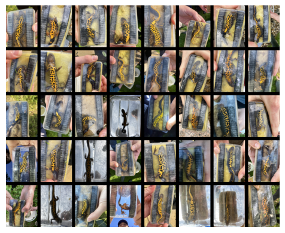
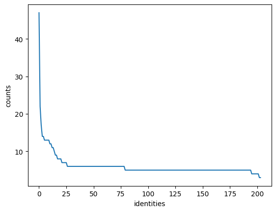

# Newt Dataset Preparation


<!-- WARNING: THIS FILE WAS AUTOGENERATED! DO NOT EDIT! -->

``` python
import numpy as np # linear algebra
import pandas as pd # data processing, CSV file I/O (e.g. pd.read_csv)
import os
import shutil
from pathlib import Path
from wildlife_datasets import datasets, analysis
from tqdm import tqdm
import matplotlib.pyplot as plt
from PIL.ExifTags import TAGS
from PIL import Image
import os
import exifread
from pymediainfo import MediaInfo
```

``` python
# Set pandas display options to show all columns and wide output
pd.set_option('display.max_columns', None)
pd.set_option('display.width', None)
pd.set_option('display.max_colwidth', None)
```

------------------------------------------------------------------------

<a
href="https://github.com/mshahoyi/gcn-reid/blob/main/gcn_reid/newt_dataset.py#L9"
target="_blank" style="float:right; font-size:smaller">source</a>

### download_kaggle_dataset

>  download_kaggle_dataset (dataset_name, download_path)

``` python
download_kaggle_dataset("mshahoyi/bar-hill-surveys", "./data/barhill-unprocessed")
```

    Dataset already exists at ./data/barhill-unprocessed

    './data/barhill-unprocessed'

``` python
data_root = Path("./data/barhill-unprocessed")/'Bar Hill Surveys 2024'
walk = list(os.walk(data_root))
walk[:4]
```

    [('data/barhill-unprocessed/Bar Hill Surveys 2024',
      ['Survey 5 06_06_24',
       'Survey 7 12_06_24',
       'Survey 2 10_05_24',
       'Survey 1 09_05_24',
       'Survey 6 07_06_24',
       'Survey 3 16_05_24',
       'Survey 8 13_06_24',
       'Survey 4 17_05_24'],
      ['Bar Hill GCN Survey Results 2024.xlsx',
       'ARU Research poster A1 (003) Ecoacoustics researching at Cambridge crematorium_edit (002).png',
       'GCN Surveys at Cambridge Crematorium 2024.docx']),
     ('data/barhill-unprocessed/Bar Hill Surveys 2024/Survey 5 06_06_24',
      ['Pond 4', 'Pond 3', 'Pond 2'],
      []),
     ('data/barhill-unprocessed/Bar Hill Surveys 2024/Survey 5 06_06_24/Pond 4',
      ['GCN1-P4-S5'],
      []),
     ('data/barhill-unprocessed/Bar Hill Surveys 2024/Survey 5 06_06_24/Pond 4/GCN1-P4-S5',
      [],
      ['IMG_3558.MOV',
       'IMG_3551.MOV',
       'IMG_3553.MOV',
       'IMG_3555.JPEG',
       'IMG_3556.JPEG',
       'IMG_3556.MOV',
       'IMG_3554.JPEG',
       'IMG_3557.JPEG',
       'IMG_3552.MOV',
       'IMG_3551.JPEG',
       'IMG_3557.MOV',
       'IMG_3552.JPEG',
       'IMG_3555.MOV',
       'IMG_3553.JPEG',
       'IMG_3554.MOV',
       'IMG_3558.JPEG'])]

``` python
gcns = [x for x in walk if 'gcn' in os.path.basename(x[0]).lower()]
gcns[:2]
```

    [('data/barhill-unprocessed/Bar Hill Surveys 2024/Survey 5 06_06_24/Pond 4/GCN1-P4-S5',
      [],
      ['IMG_3558.MOV',
       'IMG_3551.MOV',
       'IMG_3553.MOV',
       'IMG_3555.JPEG',
       'IMG_3556.JPEG',
       'IMG_3556.MOV',
       'IMG_3554.JPEG',
       'IMG_3557.JPEG',
       'IMG_3552.MOV',
       'IMG_3551.JPEG',
       'IMG_3557.MOV',
       'IMG_3552.JPEG',
       'IMG_3555.MOV',
       'IMG_3553.JPEG',
       'IMG_3554.MOV',
       'IMG_3558.JPEG']),
     ('data/barhill-unprocessed/Bar Hill Surveys 2024/Survey 5 06_06_24/Pond 3/GCN2-P3-S5',
      [],
      ['IMG_3564.JPEG',
       'IMG_3565.MOV',
       'IMG_3565.JPEG',
       'IMG_3563.MOV',
       'IMG_3561.MOV',
       'IMG_3566.JPEG',
       'IMG_3564.MOV',
       'IMG_3562.MOV',
       'IMG_3561.JPEG',
       'IMG_3563.JPEG',
       'IMG_3566.MOV',
       'IMG_3562.JPEG'])]

``` python
data = [(os.path.basename(root), list(map(lambda f: os.path.join(root, f), files))) for root, _, files in gcns]

dict(data[:2])
```

    {'GCN1-P4-S5': ['data/barhill-unprocessed/Bar Hill Surveys 2024/Survey 5 06_06_24/Pond 4/GCN1-P4-S5/IMG_3558.MOV',
      'data/barhill-unprocessed/Bar Hill Surveys 2024/Survey 5 06_06_24/Pond 4/GCN1-P4-S5/IMG_3551.MOV',
      'data/barhill-unprocessed/Bar Hill Surveys 2024/Survey 5 06_06_24/Pond 4/GCN1-P4-S5/IMG_3553.MOV',
      'data/barhill-unprocessed/Bar Hill Surveys 2024/Survey 5 06_06_24/Pond 4/GCN1-P4-S5/IMG_3555.JPEG',
      'data/barhill-unprocessed/Bar Hill Surveys 2024/Survey 5 06_06_24/Pond 4/GCN1-P4-S5/IMG_3556.JPEG',
      'data/barhill-unprocessed/Bar Hill Surveys 2024/Survey 5 06_06_24/Pond 4/GCN1-P4-S5/IMG_3556.MOV',
      'data/barhill-unprocessed/Bar Hill Surveys 2024/Survey 5 06_06_24/Pond 4/GCN1-P4-S5/IMG_3554.JPEG',
      'data/barhill-unprocessed/Bar Hill Surveys 2024/Survey 5 06_06_24/Pond 4/GCN1-P4-S5/IMG_3557.JPEG',
      'data/barhill-unprocessed/Bar Hill Surveys 2024/Survey 5 06_06_24/Pond 4/GCN1-P4-S5/IMG_3552.MOV',
      'data/barhill-unprocessed/Bar Hill Surveys 2024/Survey 5 06_06_24/Pond 4/GCN1-P4-S5/IMG_3551.JPEG',
      'data/barhill-unprocessed/Bar Hill Surveys 2024/Survey 5 06_06_24/Pond 4/GCN1-P4-S5/IMG_3557.MOV',
      'data/barhill-unprocessed/Bar Hill Surveys 2024/Survey 5 06_06_24/Pond 4/GCN1-P4-S5/IMG_3552.JPEG',
      'data/barhill-unprocessed/Bar Hill Surveys 2024/Survey 5 06_06_24/Pond 4/GCN1-P4-S5/IMG_3555.MOV',
      'data/barhill-unprocessed/Bar Hill Surveys 2024/Survey 5 06_06_24/Pond 4/GCN1-P4-S5/IMG_3553.JPEG',
      'data/barhill-unprocessed/Bar Hill Surveys 2024/Survey 5 06_06_24/Pond 4/GCN1-P4-S5/IMG_3554.MOV',
      'data/barhill-unprocessed/Bar Hill Surveys 2024/Survey 5 06_06_24/Pond 4/GCN1-P4-S5/IMG_3558.JPEG'],
     'GCN2-P3-S5': ['data/barhill-unprocessed/Bar Hill Surveys 2024/Survey 5 06_06_24/Pond 3/GCN2-P3-S5/IMG_3564.JPEG',
      'data/barhill-unprocessed/Bar Hill Surveys 2024/Survey 5 06_06_24/Pond 3/GCN2-P3-S5/IMG_3565.MOV',
      'data/barhill-unprocessed/Bar Hill Surveys 2024/Survey 5 06_06_24/Pond 3/GCN2-P3-S5/IMG_3565.JPEG',
      'data/barhill-unprocessed/Bar Hill Surveys 2024/Survey 5 06_06_24/Pond 3/GCN2-P3-S5/IMG_3563.MOV',
      'data/barhill-unprocessed/Bar Hill Surveys 2024/Survey 5 06_06_24/Pond 3/GCN2-P3-S5/IMG_3561.MOV',
      'data/barhill-unprocessed/Bar Hill Surveys 2024/Survey 5 06_06_24/Pond 3/GCN2-P3-S5/IMG_3566.JPEG',
      'data/barhill-unprocessed/Bar Hill Surveys 2024/Survey 5 06_06_24/Pond 3/GCN2-P3-S5/IMG_3564.MOV',
      'data/barhill-unprocessed/Bar Hill Surveys 2024/Survey 5 06_06_24/Pond 3/GCN2-P3-S5/IMG_3562.MOV',
      'data/barhill-unprocessed/Bar Hill Surveys 2024/Survey 5 06_06_24/Pond 3/GCN2-P3-S5/IMG_3561.JPEG',
      'data/barhill-unprocessed/Bar Hill Surveys 2024/Survey 5 06_06_24/Pond 3/GCN2-P3-S5/IMG_3563.JPEG',
      'data/barhill-unprocessed/Bar Hill Surveys 2024/Survey 5 06_06_24/Pond 3/GCN2-P3-S5/IMG_3566.MOV',
      'data/barhill-unprocessed/Bar Hill Surveys 2024/Survey 5 06_06_24/Pond 3/GCN2-P3-S5/IMG_3562.JPEG']}

``` python
metadata = pd.DataFrame(data).explode(1)
metadata.columns = ["reference_id", "file_path"]
metadata.shape
```

    (2504, 2)

``` python
metadata.head()
```

<div>
<style scoped>
    .dataframe tbody tr th:only-of-type {
        vertical-align: middle;
    }
&#10;    .dataframe tbody tr th {
        vertical-align: top;
    }
&#10;    .dataframe thead th {
        text-align: right;
    }
</style>

<table class="dataframe" data-quarto-postprocess="true" data-border="1">
<thead>
<tr style="text-align: right;">
<th data-quarto-table-cell-role="th"></th>
<th data-quarto-table-cell-role="th">identity</th>
<th data-quarto-table-cell-role="th">file_path</th>
</tr>
</thead>
<tbody>
<tr>
<td data-quarto-table-cell-role="th">0</td>
<td>GCN1-P4-S5</td>
<td>data/barhill-unprocessed/Bar Hill Surveys 2024...</td>
</tr>
<tr>
<td data-quarto-table-cell-role="th">0</td>
<td>GCN1-P4-S5</td>
<td>data/barhill-unprocessed/Bar Hill Surveys 2024...</td>
</tr>
<tr>
<td data-quarto-table-cell-role="th">0</td>
<td>GCN1-P4-S5</td>
<td>data/barhill-unprocessed/Bar Hill Surveys 2024...</td>
</tr>
<tr>
<td data-quarto-table-cell-role="th">0</td>
<td>GCN1-P4-S5</td>
<td>data/barhill-unprocessed/Bar Hill Surveys 2024...</td>
</tr>
<tr>
<td data-quarto-table-cell-role="th">0</td>
<td>GCN1-P4-S5</td>
<td>data/barhill-unprocessed/Bar Hill Surveys 2024...</td>
</tr>
</tbody>
</table>

</div>

``` python
metadata.info()
```

    <class 'pandas.core.frame.DataFrame'>
    Index: 2504 entries, 0 to 206
    Data columns (total 2 columns):
     #   Column     Non-Null Count  Dtype 
    ---  ------     --------------  ----- 
     0   identity   2504 non-null   object
     1   file_path  2504 non-null   object
    dtypes: object(2)
    memory usage: 58.7+ KB

``` python
metadata['file_name'] = metadata['file_path'].apply(lambda x: os.path.basename(x))
metadata['is_video'] = metadata['file_name'].apply(lambda x: 'mov' in x.lower())
metadata.head()
```

<div>
<style scoped>
    .dataframe tbody tr th:only-of-type {
        vertical-align: middle;
    }
&#10;    .dataframe tbody tr th {
        vertical-align: top;
    }
&#10;    .dataframe thead th {
        text-align: right;
    }
</style>

<table class="dataframe" data-quarto-postprocess="true" data-border="1">
<thead>
<tr style="text-align: right;">
<th data-quarto-table-cell-role="th"></th>
<th data-quarto-table-cell-role="th">identity</th>
<th data-quarto-table-cell-role="th">file_path</th>
<th data-quarto-table-cell-role="th">file_name</th>
<th data-quarto-table-cell-role="th">is_video</th>
</tr>
</thead>
<tbody>
<tr>
<td data-quarto-table-cell-role="th">0</td>
<td>GCN1-P4-S5</td>
<td>data/barhill-unprocessed/Bar Hill Surveys 2024...</td>
<td>IMG_3558.MOV</td>
<td>True</td>
</tr>
<tr>
<td data-quarto-table-cell-role="th">0</td>
<td>GCN1-P4-S5</td>
<td>data/barhill-unprocessed/Bar Hill Surveys 2024...</td>
<td>IMG_3551.MOV</td>
<td>True</td>
</tr>
<tr>
<td data-quarto-table-cell-role="th">0</td>
<td>GCN1-P4-S5</td>
<td>data/barhill-unprocessed/Bar Hill Surveys 2024...</td>
<td>IMG_3553.MOV</td>
<td>True</td>
</tr>
<tr>
<td data-quarto-table-cell-role="th">0</td>
<td>GCN1-P4-S5</td>
<td>data/barhill-unprocessed/Bar Hill Surveys 2024...</td>
<td>IMG_3555.JPEG</td>
<td>False</td>
</tr>
<tr>
<td data-quarto-table-cell-role="th">0</td>
<td>GCN1-P4-S5</td>
<td>data/barhill-unprocessed/Bar Hill Surveys 2024...</td>
<td>IMG_3556.JPEG</td>
<td>False</td>
</tr>
</tbody>
</table>

</div>

``` python
mapper = {reference_id: i+1 for i, reference_id in enumerate(metadata.reference_id.unique())}
metadata['identity'] = metadata.reference_id.map(mapper)
metadata
```

``` python
output_dir = Path("./data/gcns-processed")
shutil.rmtree(output_dir, ignore_errors=True)
Path(output_dir).mkdir(exist_ok=True)
```

``` python
class UnprocessedNewtsDataset(datasets.WildlifeDataset):
    def create_catalogue(self) -> pd.DataFrame:
        return metadata[~metadata.is_video].rename(columns={"file_name": "image_name", "file_path": "path"})
```

``` python
dataset = UnprocessedNewtsDataset('.')
plt.figure(figsize=(7, 7))
dataset.plot_grid()
plt.savefig(output_dir/'grid.png')
```




# Split the dataset

``` python
plt.figure(figsize=(3.5, 3))
plt.title("Number of images per identity")
analysis.display_statistics(dataset.df)
plt.savefig(output_dir/'distribution.png')
```

    Number of identitites            204
    Number of all animals            1252
    Number of animals with one image 0
    Number of unidentified animals   0



``` python
n_files = len(metadata)
n_images = len(metadata[~metadata.is_video])
n_videos = len(metadata[metadata.is_video])
n_identities = len(metadata.identity.unique())
stats = {
    "n_files": n_files,
    "n_images": n_images,
    "n_videos": n_videos,
    "n_identities": n_identities
}
pd.DataFrame(stats, index=[0]).to_csv(output_dir/'statistics.csv', index=False)
stats
```

    Split: time-unaware disjoint-set
    Samples: train/test/unassigned/total = 625/627/0/1252
    Classes: train/test/unassigned/total = 110/94/0/204
    Samples: train only/test only        = 625/627
    Classes: train only/test only/joint  = 110/94/0

    Fraction of train set     = 49.92%
    Fraction of test set only = 50.08%
    Split: time-unaware disjoint-set
    Samples: train/test/unassigned/total = 312/315/0/627
    Classes: train/test/unassigned/total = 50/44/0/94
    Samples: train only/test only        = 312/315
    Classes: train only/test only/joint  = 50/44/0

    Fraction of train set     = 49.76%
    Fraction of test set only = 50.24%
    Train: 625, Test: 312, Validation: 315

``` python
metadata_new = metadata.copy().reset_index(drop=True)

for i, row in tqdm(metadata_new.iterrows()):
    new_path = Path('newts')/str(row.identity)/row.file_name
    Path(output_dir/new_path).parent.mkdir(parents=True, exist_ok=True)
    shutil.copy(row.file_path, output_dir/new_path)
    metadata_new.loc[i, 'file_path'] = new_path
```

<div>
<style scoped>
    .dataframe tbody tr th:only-of-type {
        vertical-align: middle;
    }
&#10;    .dataframe tbody tr th {
        vertical-align: top;
    }
&#10;    .dataframe thead th {
        text-align: right;
    }
</style>

<table class="dataframe" data-quarto-postprocess="true" data-border="1">
<thead>
<tr style="text-align: right;">
<th data-quarto-table-cell-role="th"></th>
<th data-quarto-table-cell-role="th">identity</th>
<th data-quarto-table-cell-role="th">path</th>
<th data-quarto-table-cell-role="th">image_name</th>
<th data-quarto-table-cell-role="th">is_video</th>
</tr>
</thead>
<tbody>
<tr>
<td data-quarto-table-cell-role="th">0</td>
<td>GCN1-P1-S2</td>
<td>data/barhill-unprocessed/Bar Hill Surveys 2024...</td>
<td>IMG_2312.JPEG</td>
<td>False</td>
</tr>
<tr>
<td data-quarto-table-cell-role="th">1</td>
<td>GCN1-P1-S2</td>
<td>data/barhill-unprocessed/Bar Hill Surveys 2024...</td>
<td>IMG_2310.JPEG</td>
<td>False</td>
</tr>
<tr>
<td data-quarto-table-cell-role="th">2</td>
<td>GCN1-P1-S2</td>
<td>data/barhill-unprocessed/Bar Hill Surveys 2024...</td>
<td>IMG_2309.JPEG</td>
<td>False</td>
</tr>
<tr>
<td data-quarto-table-cell-role="th">3</td>
<td>GCN1-P1-S2</td>
<td>data/barhill-unprocessed/Bar Hill Surveys 2024...</td>
<td>IMG_2311.JPEG</td>
<td>False</td>
</tr>
<tr>
<td data-quarto-table-cell-role="th">4</td>
<td>GCN1-P1-S2</td>
<td>data/barhill-unprocessed/Bar Hill Surveys 2024...</td>
<td>IMG_2313.JPEG</td>
<td>False</td>
</tr>
</tbody>
</table>

</div>

# Extract the images time of capture

``` python
def get_image_creation_date(image_path):
    with open(image_path, 'rb') as f:
        tags = exifread.process_file(f, stop_tag="EXIF DateTimeOriginal")
        date_tag = tags.get("EXIF DateTimeOriginal")
        if date_tag:
            return pd.to_datetime(str(date_tag), format='%Y:%m:%d %H:%M:%S', utc=True)
    return None

def get_video_creation_date(video_path):
    media_info = MediaInfo.parse(video_path)
    for track in media_info.tracks:
        if track.track_type == "General":
            date = (
                track.tagged_date or
                track.recorded_date or
                track.encoded_date
            )
            if date:
                return pd.to_datetime(date).floor('s')
    return None

def get_creation_date(row):
    file_path = os.path.join(output_dir, row.file_path)
    is_video = row.is_video

    if is_video: return get_video_creation_date(file_path)
    return get_image_creation_date(file_path)
```

``` python
metadata_new['creation_date'] = pd.NA

for i, row in tqdm(metadata_new.iterrows(), total=len(metadata_new)):
    creation_date = get_creation_date(row)
    metadata_new.at[i, 'creation_date'] = creation_date
```

``` python
metadata_new
```

    2503it [00:06, 380.40it/s]

<div>
<style scoped>
    .dataframe tbody tr th:only-of-type {
        vertical-align: middle;
    }
&#10;    .dataframe tbody tr th {
        vertical-align: top;
    }
&#10;    .dataframe thead th {
        text-align: right;
    }
</style>

<table class="dataframe" data-quarto-postprocess="true" data-border="1">
<thead>
<tr style="text-align: right;">
<th data-quarto-table-cell-role="th"></th>
<th data-quarto-table-cell-role="th">identity</th>
<th data-quarto-table-cell-role="th">file_path</th>
<th data-quarto-table-cell-role="th">file_name</th>
<th data-quarto-table-cell-role="th">is_video</th>
<th data-quarto-table-cell-role="th">split</th>
</tr>
</thead>
<tbody>
<tr>
<td data-quarto-table-cell-role="th">0</td>
<td>GCN1-P4-S5</td>
<td>test/GCN1-P4-S5/IMG_3558.JPEG</td>
<td>IMG_3558.MOV</td>
<td>True</td>
<td>test</td>
</tr>
<tr>
<td data-quarto-table-cell-role="th">0</td>
<td>GCN1-P4-S5</td>
<td>test/GCN1-P4-S5/IMG_3558.JPEG</td>
<td>IMG_3551.MOV</td>
<td>True</td>
<td>test</td>
</tr>
<tr>
<td data-quarto-table-cell-role="th">0</td>
<td>GCN1-P4-S5</td>
<td>test/GCN1-P4-S5/IMG_3558.JPEG</td>
<td>IMG_3553.MOV</td>
<td>True</td>
<td>test</td>
</tr>
<tr>
<td data-quarto-table-cell-role="th">0</td>
<td>GCN1-P4-S5</td>
<td>test/GCN1-P4-S5/IMG_3558.JPEG</td>
<td>IMG_3555.JPEG</td>
<td>False</td>
<td>test</td>
</tr>
<tr>
<td data-quarto-table-cell-role="th">0</td>
<td>GCN1-P4-S5</td>
<td>test/GCN1-P4-S5/IMG_3558.JPEG</td>
<td>IMG_3556.JPEG</td>
<td>False</td>
<td>test</td>
</tr>
</tbody>
</table>

</div>

``` python
metadata_new.to_csv(output_dir/'metadata.csv', index=False)
metadata_new
```

# Upload to Kaggle

------------------------------------------------------------------------

<a
href="https://github.com/mshahoyi/gcn-reid/blob/main/gcn_reid/newt_dataset.py#L23"
target="_blank" style="float:right; font-size:smaller">source</a>

### upload_to_kaggle

>  upload_to_kaggle (user_id, title, id, licenses, keywords, dataset_dir)

``` python
upload_to_kaggle(user_id="mshahoyi",
                title="Barhill Great Crested Newts", 
                id="barhill-newts-all", 
                licenses=[{"name": "CC0-1.0"}], 
                keywords=["biology", "computer-vision", "animals", "great crested newts"], 
                dataset_dir="./data/gcns-processed")
```

``` python
import nbdev; nbdev.nbdev_export()
```
