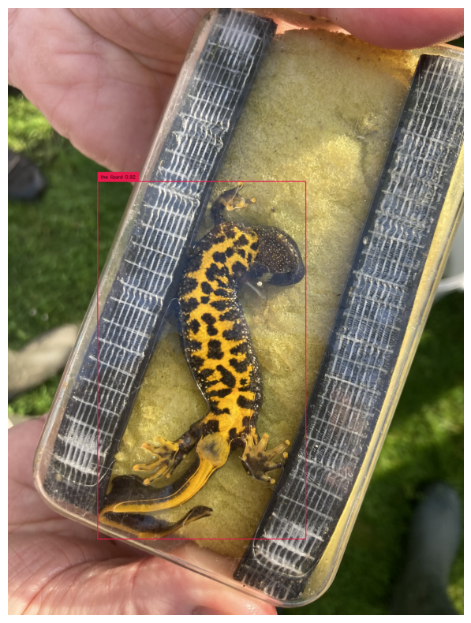
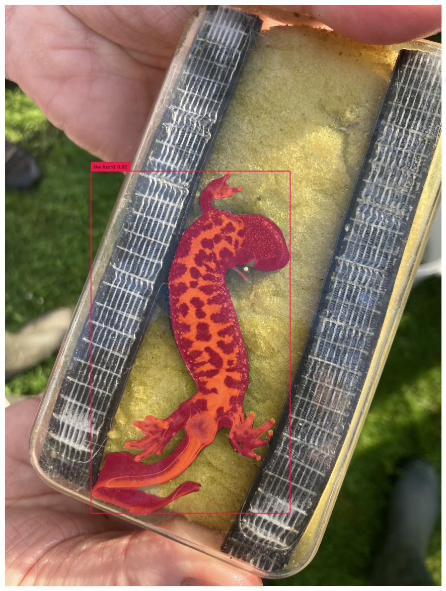
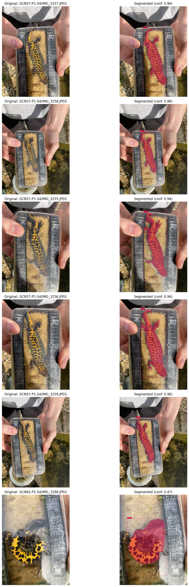
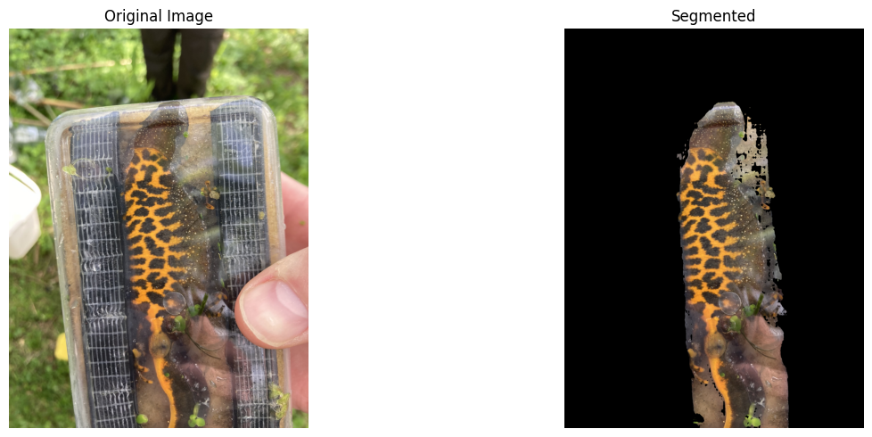

# Newt Segmentation


<!-- WARNING: THIS FILE WAS AUTOGENERATED! DO NOT EDIT! -->

``` python
import os
if not os.path.exists("./data/barhill"):
    os.system("kaggle datasets download -d mshahoyi/barhills-processed --unzip -p ./data")
```

``` python
try:
    import supervision
    os.chdir("gsam2")
except:
    os.system('git clone https://github.com/IDEA-Research/Grounded-SAM-2 gsam2')
    os.chdir("gsam2")
    os.system('pip install -q -e . -e grounding_dino')
    os.system('pip install -q supervision')
```

    /kaggle/working/gcn-reid/nbs/gsam2

``` python
import pandas as pd
import numpy as np
import matplotlib.pyplot as plt
import pycocotools.mask as mask_util
from PIL import Image
import argparse
import os
import cv2
import json
import torch
import pandas as pd
import pathlib
import shutil
from datetime import datetime
import subprocess
import tempfile
import numpy as np
from tqdm import tqdm
import matplotlib.pyplot as plt
import supervision as sv
import pycocotools.mask as mask_util
from pathlib import Path
from supervision.draw.color import ColorPalette
from utils.supervision_utils import CUSTOM_COLOR_MAP
from PIL import Image
import matplotlib.pyplot as plt
from sam2.build_sam import build_sam2
from sam2.sam2_image_predictor import SAM2ImagePredictor
from transformers import AutoProcessor, AutoModelForZeroShotObjectDetection
import pandas as pd
```

``` python
GROUNDING_MODEL = "IDEA-Research/grounding-dino-base"
SAM2_CHECKPOINT = "./checkpoints/sam2.1_hiera_large.pt"
SAM2_MODEL_CONFIG = "configs/sam2.1/sam2.1_hiera_l.yaml"
DEVICE = "cuda" if torch.cuda.is_available() else "cpu"
OUTPUT_DIR = Path("outputs/test_sam2.1")
DUMP_JSON_RESULTS = True
```

``` python
# create output directory
OUTPUT_DIR.mkdir(parents=True, exist_ok=True)

# environment settings
# use bfloat16
torch.autocast(device_type=DEVICE, dtype=torch.bfloat16).__enter__()

if torch.cuda.get_device_properties(0).major >= 8:
    # turn on tfloat32 for Ampere GPUs (https://pytorch.org/docs/stable/notes/cuda.html#tensorfloat-32-tf32-on-ampere-devices)
    torch.backends.cuda.matmul.allow_tf32 = True
    torch.backends.cudnn.allow_tf32 = True
```

``` python
os.chdir("checkpoints")
os.system("bash download_ckpts.sh")
os.chdir("..")
```

    /kaggle/working/gcn-reid/nbs/gsam2/checkpoints
    Downloading sam2.1_hiera_tiny.pt checkpoint...
    --2025-05-23 18:48:00--  https://dl.fbaipublicfiles.com/segment_anything_2/092824/sam2.1_hiera_tiny.pt
    Resolving dl.fbaipublicfiles.com (dl.fbaipublicfiles.com)... 13.227.219.59, 13.227.219.10, 13.227.219.70, ...
    Connecting to dl.fbaipublicfiles.com (dl.fbaipublicfiles.com)|13.227.219.59|:443... connected.
    HTTP request sent, awaiting response... 200 OK
    Length: 156008466 (149M) [application/vnd.snesdev-page-table]
    Saving to: ‘sam2.1_hiera_tiny.pt.6’

    sam2.1_hiera_tiny.p   0%[                    ]       0  --.-KB/s               

    huggingface/tokenizers: The current process just got forked, after parallelism has already been used. Disabling parallelism to avoid deadlocks...
    To disable this warning, you can either:
        - Avoid using `tokenizers` before the fork if possible
        - Explicitly set the environment variable TOKENIZERS_PARALLELISM=(true | false)

    sam2.1_hiera_tiny.p 100%[===================>] 148.78M   254MB/s    in 0.6s    

    2025-05-23 18:48:01 (254 MB/s) - ‘sam2.1_hiera_tiny.pt.6’ saved [156008466/156008466]

    Downloading sam2.1_hiera_small.pt checkpoint...
    --2025-05-23 18:48:01--  https://dl.fbaipublicfiles.com/segment_anything_2/092824/sam2.1_hiera_small.pt
    Resolving dl.fbaipublicfiles.com (dl.fbaipublicfiles.com)... 13.227.219.59, 13.227.219.70, 13.227.219.10, ...
    Connecting to dl.fbaipublicfiles.com (dl.fbaipublicfiles.com)|13.227.219.59|:443... connected.
    HTTP request sent, awaiting response... 200 OK
    Length: 184416285 (176M) [application/vnd.snesdev-page-table]
    Saving to: ‘sam2.1_hiera_small.pt.6’

    sam2.1_hiera_small. 100%[===================>] 175.87M   210MB/s    in 0.8s    

    2025-05-23 18:48:02 (210 MB/s) - ‘sam2.1_hiera_small.pt.6’ saved [184416285/184416285]

    Downloading sam2.1_hiera_base_plus.pt checkpoint...
    --2025-05-23 18:48:02--  https://dl.fbaipublicfiles.com/segment_anything_2/092824/sam2.1_hiera_base_plus.pt
    Resolving dl.fbaipublicfiles.com (dl.fbaipublicfiles.com)... 13.227.219.33, 13.227.219.59, 13.227.219.10, ...
    Connecting to dl.fbaipublicfiles.com (dl.fbaipublicfiles.com)|13.227.219.33|:443... connected.
    HTTP request sent, awaiting response... 200 OK
    Length: 323606802 (309M) [application/vnd.snesdev-page-table]
    Saving to: ‘sam2.1_hiera_base_plus.pt.6’

    sam2.1_hiera_base_p 100%[===================>] 308.62M   284MB/s    in 1.1s    

    2025-05-23 18:48:03 (284 MB/s) - ‘sam2.1_hiera_base_plus.pt.6’ saved [323606802/323606802]

    Downloading sam2.1_hiera_large.pt checkpoint...
    --2025-05-23 18:48:03--  https://dl.fbaipublicfiles.com/segment_anything_2/092824/sam2.1_hiera_large.pt
    Resolving dl.fbaipublicfiles.com (dl.fbaipublicfiles.com)... 13.227.219.10, 13.227.219.70, 13.227.219.33, ...
    Connecting to dl.fbaipublicfiles.com (dl.fbaipublicfiles.com)|13.227.219.10|:443... connected.
    HTTP request sent, awaiting response... 200 OK
    Length: 898083611 (856M) [application/vnd.snesdev-page-table]
    Saving to: ‘sam2.1_hiera_large.pt.6’

    sam2.1_hiera_large. 100%[===================>] 856.48M   291MB/s    in 2.9s    

    2025-05-23 18:48:06 (291 MB/s) - ‘sam2.1_hiera_large.pt.6’ saved [898083611/898083611]

    All checkpoints are downloaded successfully.
    /kaggle/working/gcn-reid/nbs/gsam2

``` python
# build SAM2 image predictor
sam2_checkpoint = SAM2_CHECKPOINT
model_cfg = SAM2_MODEL_CONFIG
sam2_model = build_sam2(model_cfg, sam2_checkpoint, device=DEVICE)
sam2_predictor = SAM2ImagePredictor(sam2_model)
```

``` python
# build grounding dino from huggingface
model_id = GROUNDING_MODEL
processor = AutoProcessor.from_pretrained(model_id)
grounding_model = AutoModelForZeroShotObjectDetection.from_pretrained(model_id).to(DEVICE)
```

``` python
# Go back to parent directory to access data
os.chdir("..")
```

    /kaggle/working/gcn-reid/nbs

``` python
image = pathlib.Path("./data/barhill/GCNs/GCN10-P1-S2/IMG_2367.JPEG")

# setup the input image and text prompt for SAM 2 and Grounding DINO
# VERY important: text queries need to be lowercased + end with a dot
text = "the lizard."
img_path = image
text, img_path
```

    ('the lizard.', PosixPath('data/barhill/GCNs/GCN10-P1-S2/IMG_2367.JPEG'))

``` python
image = Image.open(img_path)
image
```


``` python
sam2_predictor.set_image(np.array(image.convert("RGB")))

inputs = processor(images=image, text=text, return_tensors="pt").to(DEVICE)
```

``` python
with torch.no_grad():
    outputs = grounding_model(**inputs)
```

``` python
results = processor.post_process_grounded_object_detection(
    outputs,
    inputs.input_ids,
    box_threshold=0.4,
    text_threshold=0.3,
    target_sizes=[image.size[::-1]]
)

"""
Results is a list of dict with the following structure:
[
    {
        'scores': tensor([0.7969, 0.6469, 0.6002, 0.4220], device='cuda:0'), 
        'labels': ['car', 'tire', 'tire', 'tire'], 
        'boxes': tensor([[  89.3244,  278.6940, 1710.3505,  851.5143],
                        [1392.4701,  554.4064, 1628.6133,  777.5872],
                        [ 436.1182,  621.8940,  676.5255,  851.6897],
                        [1236.0990,  688.3547, 1400.2427,  753.1256]], device='cuda:0')
    }
]
"""
results
```

    [{'scores': tensor([0.9208], device='cuda:0'),
      'boxes': tensor([[ 302.1228,  585.2393, 1003.5174, 1791.4868]], device='cuda:0'),
      'text_labels': ['the lizard'],
      'labels': ['the lizard']}]

``` python
# get the box prompt for SAM 2
input_boxes = results[0]["boxes"].cpu().numpy()

masks, scores, logits = sam2_predictor.predict(
    point_coords=None,
    point_labels=None,
    box=input_boxes,
    multimask_output=False,
)
```

``` python
img = np.array(image)
img.shape
```

    (2048, 1536, 3)

``` python
"""
Post-process the output of the model to get the masks, scores, and logits for visualization
"""
# convert the shape to (n, H, W)
if masks.ndim == 4:
    masks = masks.squeeze(1)


confidences = results[0]["scores"].cpu().numpy().tolist()
class_names = results[0]["labels"]
class_ids = np.array(list(range(len(class_names))))

labels = [
    f"{class_name} {confidence:.2f}"
    for class_name, confidence
    in zip(class_names, confidences)
]
confidences, class_names, class_ids, labels
```

    ([0.9207897186279297], ['the lizard'], array([0]), ['the lizard 0.92'])

``` python
"""
Visualize image with supervision useful API
"""
img = cv2.imread(img_path)
detections = sv.Detections(
    xyxy=input_boxes,  # (n, 4)
    mask=masks.astype(bool),  # (n, h, w)
    class_id=class_ids
)

"""
Note that if you want to use default color map,
you can set color=ColorPalette.DEFAULT
"""

# --- Annotate Boxes ---
# Note that if you want to use default color map,
# you can set color=sv.ColorPalette.DEFAULT
# If CUSTOM_COLOR_MAP is a list of hex strings:
box_annotator = sv.BoxAnnotator(color=sv.ColorPalette.from_hex(CUSTOM_COLOR_MAP))
annotated_frame_boxes = box_annotator.annotate(scene=img.copy(), detections=detections)

# --- Annotate Labels ---
# If CUSTOM_COLOR_MAP is a list of hex strings:
label_annotator = sv.LabelAnnotator(color=sv.ColorPalette.from_hex(CUSTOM_COLOR_MAP), text_color=sv.Color.BLACK) # Specify text color if needed
# Create labels if not already defined (example)
# labels = [f"{class_names[i]}: {scores[i]:0.2f}" for i in range(len(class_names))]
annotated_frame_labels = label_annotator.annotate(scene=annotated_frame_boxes.copy(), detections=detections, labels=labels)

# --- Save intermediate image (optional) ---
cv2.imwrite(os.path.join(OUTPUT_DIR, "groundingdino_annotated_image.jpg"), annotated_frame_labels)

# --- Visualize intermediate image (boxes + labels) INLINE ---
print("Displaying image with boxes and labels:")
plt.figure(figsize=(10, 10)) # Adjust size as needed
plt.imshow(cv2.cvtColor(annotated_frame_labels, cv2.COLOR_BGR2RGB))
plt.axis('off')
plt.show()
```

    Displaying image with boxes and labels:



``` python
# --- Annotate Masks ---
# If CUSTOM_COLOR_MAP is a list of hex strings:
mask_annotator = sv.MaskAnnotator(color=sv.ColorPalette.from_hex(CUSTOM_COLOR_MAP))
# NOTE: mask_annotator modifies the 'scene' in place if you pass the same array
# It's safer to annotate on a fresh copy if you want to keep the previous step clean
# However, the supervision docs often show chaining like this. Let's assume chaining:
annotated_frame_final = mask_annotator.annotate(scene=annotated_frame_labels.copy(), detections=detections) # Use copy to avoid modifying annotated_frame_labels


# --- Visualize final image (boxes + labels + masks) INLINE ---
print("\nDisplaying final image with boxes, labels, and masks:")
plt.figure(figsize=(15, 15)) # Adjust size as needed
plt.imshow(cv2.cvtColor(annotated_frame_final, cv2.COLOR_BGR2RGB))
plt.axis('off')
plt.show()
```


    Displaying final image with boxes, labels, and masks:



# Segment the DS

``` python
ds_dir = pathlib.Path("./data/barhill")
```

``` python
gcns_dir = ds_dir/'GCNs'
```

``` python
# Load the metadata CSV
metadata_path = "./data/barhill/gallery_and_probes.csv"
metadata_df = pd.read_csv(metadata_path)
print(f"Loaded metadata with {len(metadata_df)} rows")

# Create output directory for visualization images - as sibling to data folder
vis_output_dir = pathlib.Path("./data/segmentation_visualizations")
vis_output_dir.mkdir(exist_ok=True)
```

    Loaded metadata with 1253 rows

``` python
# Initialize list to store RLE masks - we'll match by image filename
rle_masks = {}
visualization_samples = []  # Store some samples to display later

# Create directories for each newt ID in the visualization directory
for newt_id in tqdm(os.listdir(gcns_dir)):  # Process first 3 newts for demo
    newt_vis_dir = vis_output_dir / newt_id
    newt_vis_dir.mkdir(exist_ok=True)
    
    image_names = os.listdir(os.path.join(gcns_dir, newt_id))
    image_paths = [os.path.join(gcns_dir, newt_id, image) for image in image_names]
    
    # Process images one by one to avoid memory issues
    for image_path, image_name in zip(image_paths[:5], image_names[:5]):  # Limit to 5 per newt for demo
        try:
            # Create a key to match with CSV (assuming CSV has full path or we can construct it)
            image_key = f"{newt_id}/{image_name}"
            
            # Load image
            image = cv2.imread(image_path)
            if image is None:
                print(f"Could not read image {image_path}, skipping")
                rle_masks[image_key] = None
                continue
                
            # Convert to PIL for grounding model
            pil_image = Image.open(image_path)
            
            # Process single image with grounding model
            inputs = processor(images=pil_image, text=text, return_tensors="pt").to(DEVICE)
            
            with torch.no_grad(): 
                outputs = grounding_model(**inputs)

            results = processor.post_process_grounded_object_detection(
                outputs,
                inputs.input_ids,
                box_threshold=0.4,
                text_threshold=0.3,
                target_sizes=[(image.shape[0], image.shape[1])]
            )[0]  # Get first (and only) result
            
            # Skip if no detections
            if len(results["boxes"]) == 0:
                print(f"No detections for {image_path}, skipping")
                rle_masks[image_key] = None
                continue
                
            # Get the highest confidence box
            confidence_scores = results["scores"]
            best_box_idx = torch.argmax(confidence_scores)
            box = results["boxes"][best_box_idx].cpu().numpy()
            
            # Convert box to SAM format
            sam_box = box.astype(int)
            
            # Generate mask with SAM
            sam2_predictor.set_image(np.array(pil_image.convert("RGB")))
            masks, _, _ = sam2_predictor.predict(
                box=sam_box,
                multimask_output=False
            )
            
            # Get the mask and convert to RLE
            mask = masks[0]  # Get the first (and only) mask
            
            # Convert mask to RLE format using pycocotools
            # Ensure mask is in the right format (uint8, Fortran order)
            mask_uint8 = mask.astype(np.uint8, order='F')
            rle = mask_util.encode(mask_uint8)
            # Convert bytes to string for CSV storage
            rle_string = rle['counts'].decode('utf-8') if isinstance(rle['counts'], bytes) else str(rle['counts'])
            rle_masks[image_key] = f"{rle['size'][0]}x{rle['size'][1]}:{rle_string}"
            
            # Create visualization image (similar to the code above the for loop)
            img_bgr = cv2.cvtColor(np.array(pil_image), cv2.COLOR_RGB2BGR)
            
            # Create supervision detections object
            input_boxes = np.array([box])
            detections = sv.Detections(
                xyxy=input_boxes,  # (n, 4)
                mask=mask[np.newaxis, ...].astype(bool),  # (n, h, w)
                class_id=np.array([0])
            )
            
            # Create labels
            confidence = float(confidence_scores[best_box_idx])
            labels = [f"lizard {confidence:.2f}"]
            
            # Annotate image
            box_annotator = sv.BoxAnnotator(color=sv.ColorPalette.from_hex(CUSTOM_COLOR_MAP))
            annotated_frame = box_annotator.annotate(scene=img_bgr.copy(), detections=detections)
            
            label_annotator = sv.LabelAnnotator(color=sv.ColorPalette.from_hex(CUSTOM_COLOR_MAP), text_color=sv.Color.BLACK)
            annotated_frame = label_annotator.annotate(scene=annotated_frame, detections=detections, labels=labels)
            
            mask_annotator = sv.MaskAnnotator(color=sv.ColorPalette.from_hex(CUSTOM_COLOR_MAP))
            annotated_frame = mask_annotator.annotate(scene=annotated_frame, detections=detections)
            
            # Save visualization image
            vis_output_path = newt_vis_dir / f"{image_name}_segmented.jpg"
            cv2.imwrite(str(vis_output_path), annotated_frame)
            
            # Store sample for display (limit to first few)
            if len(visualization_samples) < 6:
                visualization_samples.append({
                    'original': np.array(pil_image),
                    'annotated': cv2.cvtColor(annotated_frame, cv2.COLOR_BGR2RGB),
                    'newt_id': newt_id,
                    'filename': image_name,
                    'confidence': confidence
                })
            
            print(f"Processed {image_path} -> RLE mask saved, visualization at {vis_output_path}")
            
        except Exception as e:
            print(f"Error processing {image_path}: {str(e)}")
            rle_masks[image_key] = None
            continue

print(f"\nVisualization images saved to: {vis_output_dir.absolute()}")
```

      0%|          | 0/207 [00:00<?, ?it/s]

    Processed data/barhill/GCNs/GCN57-P1-S4/IMG_3257.JPEG -> RLE mask saved, visualization at data/segmentation_visualizations/GCN57-P1-S4/IMG_3257.JPEG_segmented.jpg
    Processed data/barhill/GCNs/GCN57-P1-S4/IMG_3258.JPEG -> RLE mask saved, visualization at data/segmentation_visualizations/GCN57-P1-S4/IMG_3258.JPEG_segmented.jpg
    Processed data/barhill/GCNs/GCN57-P1-S4/IMG_3255.JPEG -> RLE mask saved, visualization at data/segmentation_visualizations/GCN57-P1-S4/IMG_3255.JPEG_segmented.jpg
    Processed data/barhill/GCNs/GCN57-P1-S4/IMG_3256.JPEG -> RLE mask saved, visualization at data/segmentation_visualizations/GCN57-P1-S4/IMG_3256.JPEG_segmented.jpg

      0%|          | 1/207 [00:10<35:05, 10.22s/it]

    Processed data/barhill/GCNs/GCN57-P1-S4/IMG_3259.JPEG -> RLE mask saved, visualization at data/segmentation_visualizations/GCN57-P1-S4/IMG_3259.JPEG_segmented.jpg
    Processed data/barhill/GCNs/GCN62-P1-S4/IMG_3288.JPEG -> RLE mask saved, visualization at data/segmentation_visualizations/GCN62-P1-S4/IMG_3288.JPEG_segmented.jpg
    Processed data/barhill/GCNs/GCN62-P1-S4/IMG_3290.JPEG -> RLE mask saved, visualization at data/segmentation_visualizations/GCN62-P1-S4/IMG_3290.JPEG_segmented.jpg
    Processed data/barhill/GCNs/GCN62-P1-S4/IMG_3289.JPEG -> RLE mask saved, visualization at data/segmentation_visualizations/GCN62-P1-S4/IMG_3289.JPEG_segmented.jpg
    Processed data/barhill/GCNs/GCN62-P1-S4/IMG_3287.JPEG -> RLE mask saved, visualization at data/segmentation_visualizations/GCN62-P1-S4/IMG_3287.JPEG_segmented.jpg

      1%|          | 2/207 [00:20<35:10, 10.29s/it]

    Processed data/barhill/GCNs/GCN62-P1-S4/IMG_3291.JPEG -> RLE mask saved, visualization at data/segmentation_visualizations/GCN62-P1-S4/IMG_3291.JPEG_segmented.jpg
    Processed data/barhill/GCNs/GCN22-P4-S4/IMG_3040.JPEG -> RLE mask saved, visualization at data/segmentation_visualizations/GCN22-P4-S4/IMG_3040.JPEG_segmented.jpg
    Processed data/barhill/GCNs/GCN22-P4-S4/IMG_3041.JPEG -> RLE mask saved, visualization at data/segmentation_visualizations/GCN22-P4-S4/IMG_3041.JPEG_segmented.jpg
    Processed data/barhill/GCNs/GCN22-P4-S4/IMG_3038.JPEG -> RLE mask saved, visualization at data/segmentation_visualizations/GCN22-P4-S4/IMG_3038.JPEG_segmented.jpg
    Processed data/barhill/GCNs/GCN22-P4-S4/IMG_3039.JPEG -> RLE mask saved, visualization at data/segmentation_visualizations/GCN22-P4-S4/IMG_3039.JPEG_segmented.jpg

      1%|▏         | 3/207 [00:30<34:52, 10.26s/it]

    Processed data/barhill/GCNs/GCN22-P4-S4/IMG_3036.JPEG -> RLE mask saved, visualization at data/segmentation_visualizations/GCN22-P4-S4/IMG_3036.JPEG_segmented.jpg
    Processed data/barhill/GCNs/GCN1-P1-S8/IMG_3754.JPEG -> RLE mask saved, visualization at data/segmentation_visualizations/GCN1-P1-S8/IMG_3754.JPEG_segmented.jpg
    Processed data/barhill/GCNs/GCN1-P1-S8/IMG_3746.JPEG -> RLE mask saved, visualization at data/segmentation_visualizations/GCN1-P1-S8/IMG_3746.JPEG_segmented.jpg
    Processed data/barhill/GCNs/GCN1-P1-S8/IMG_3752.JPEG -> RLE mask saved, visualization at data/segmentation_visualizations/GCN1-P1-S8/IMG_3752.JPEG_segmented.jpg
    Processed data/barhill/GCNs/GCN1-P1-S8/IMG_3744.JPEG -> RLE mask saved, visualization at data/segmentation_visualizations/GCN1-P1-S8/IMG_3744.JPEG_segmented.jpg

      2%|▏         | 4/207 [00:40<34:13, 10.12s/it]

    Processed data/barhill/GCNs/GCN1-P1-S8/IMG_3747.JPEG -> RLE mask saved, visualization at data/segmentation_visualizations/GCN1-P1-S8/IMG_3747.JPEG_segmented.jpg
    Processed data/barhill/GCNs/GCN31-P3-S4/IMG_3093.JPEG -> RLE mask saved, visualization at data/segmentation_visualizations/GCN31-P3-S4/IMG_3093.JPEG_segmented.jpg
    Processed data/barhill/GCNs/GCN31-P3-S4/IMG_3096.JPEG -> RLE mask saved, visualization at data/segmentation_visualizations/GCN31-P3-S4/IMG_3096.JPEG_segmented.jpg
    Processed data/barhill/GCNs/GCN31-P3-S4/IMG_3094.JPEG -> RLE mask saved, visualization at data/segmentation_visualizations/GCN31-P3-S4/IMG_3094.JPEG_segmented.jpg
    Processed data/barhill/GCNs/GCN31-P3-S4/IMG_3097.JPEG -> RLE mask saved, visualization at data/segmentation_visualizations/GCN31-P3-S4/IMG_3097.JPEG_segmented.jpg

      2%|▏         | 5/207 [00:50<33:39, 10.00s/it]

    Processed data/barhill/GCNs/GCN31-P3-S4/IMG_3095.JPEG -> RLE mask saved, visualization at data/segmentation_visualizations/GCN31-P3-S4/IMG_3095.JPEG_segmented.jpg
    Processed data/barhill/GCNs/GCN75-P5-S4/IMG_3369.JPEG -> RLE mask saved, visualization at data/segmentation_visualizations/GCN75-P5-S4/IMG_3369.JPEG_segmented.jpg
    Processed data/barhill/GCNs/GCN75-P5-S4/IMG_3371.JPEG -> RLE mask saved, visualization at data/segmentation_visualizations/GCN75-P5-S4/IMG_3371.JPEG_segmented.jpg
    Processed data/barhill/GCNs/GCN75-P5-S4/IMG_3370.JPEG -> RLE mask saved, visualization at data/segmentation_visualizations/GCN75-P5-S4/IMG_3370.JPEG_segmented.jpg
    Processed data/barhill/GCNs/GCN75-P5-S4/IMG_3368.JPEG -> RLE mask saved, visualization at data/segmentation_visualizations/GCN75-P5-S4/IMG_3368.JPEG_segmented.jpg

      3%|▎         | 6/207 [01:00<33:14,  9.92s/it]

    Processed data/barhill/GCNs/GCN75-P5-S4/IMG_3372.JPEG -> RLE mask saved, visualization at data/segmentation_visualizations/GCN75-P5-S4/IMG_3372.JPEG_segmented.jpg
    Processed data/barhill/GCNs/GCN23-P4-S2/IMG_2460.JPEG -> RLE mask saved, visualization at data/segmentation_visualizations/GCN23-P4-S2/IMG_2460.JPEG_segmented.jpg
    Processed data/barhill/GCNs/GCN23-P4-S2/IMG_2459.JPEG -> RLE mask saved, visualization at data/segmentation_visualizations/GCN23-P4-S2/IMG_2459.JPEG_segmented.jpg
    Processed data/barhill/GCNs/GCN23-P4-S2/IMG_2458.JPEG -> RLE mask saved, visualization at data/segmentation_visualizations/GCN23-P4-S2/IMG_2458.JPEG_segmented.jpg
    Processed data/barhill/GCNs/GCN23-P4-S2/IMG_2456.JPEG -> RLE mask saved, visualization at data/segmentation_visualizations/GCN23-P4-S2/IMG_2456.JPEG_segmented.jpg

      3%|▎         | 7/207 [01:09<32:50,  9.85s/it]

    Processed data/barhill/GCNs/GCN23-P4-S2/IMG_2455.JPEG -> RLE mask saved, visualization at data/segmentation_visualizations/GCN23-P4-S2/IMG_2455.JPEG_segmented.jpg
    Processed data/barhill/GCNs/GCN12-P7-S6/IMG_3660.JPEG -> RLE mask saved, visualization at data/segmentation_visualizations/GCN12-P7-S6/IMG_3660.JPEG_segmented.jpg
    Processed data/barhill/GCNs/GCN12-P7-S6/IMG_3658.JPEG -> RLE mask saved, visualization at data/segmentation_visualizations/GCN12-P7-S6/IMG_3658.JPEG_segmented.jpg
    Processed data/barhill/GCNs/GCN12-P7-S6/IMG_3657.JPEG -> RLE mask saved, visualization at data/segmentation_visualizations/GCN12-P7-S6/IMG_3657.JPEG_segmented.jpg

      4%|▍         | 8/207 [01:17<30:32,  9.21s/it]

    Processed data/barhill/GCNs/GCN12-P7-S6/IMG_3659.JPEG -> RLE mask saved, visualization at data/segmentation_visualizations/GCN12-P7-S6/IMG_3659.JPEG_segmented.jpg
    Processed data/barhill/GCNs/GCN14-P3-S3/IMG_2862.JPEG -> RLE mask saved, visualization at data/segmentation_visualizations/GCN14-P3-S3/IMG_2862.JPEG_segmented.jpg
    Processed data/barhill/GCNs/GCN14-P3-S3/IMG_2864.JPEG -> RLE mask saved, visualization at data/segmentation_visualizations/GCN14-P3-S3/IMG_2864.JPEG_segmented.jpg
    Processed data/barhill/GCNs/GCN14-P3-S3/IMG_2859.JPEG -> RLE mask saved, visualization at data/segmentation_visualizations/GCN14-P3-S3/IMG_2859.JPEG_segmented.jpg
    No detections for data/barhill/GCNs/GCN14-P3-S3/IMG_2863.JPEG, skipping

      4%|▍         | 9/207 [01:26<29:54,  9.06s/it]

    Processed data/barhill/GCNs/GCN14-P3-S3/IMG_2858.JPEG -> RLE mask saved, visualization at data/segmentation_visualizations/GCN14-P3-S3/IMG_2858.JPEG_segmented.jpg
    Processed data/barhill/GCNs/GCN13-P7-S6/IMG_3663.JPEG -> RLE mask saved, visualization at data/segmentation_visualizations/GCN13-P7-S6/IMG_3663.JPEG_segmented.jpg
    Processed data/barhill/GCNs/GCN13-P7-S6/IMG_3664.JPEG -> RLE mask saved, visualization at data/segmentation_visualizations/GCN13-P7-S6/IMG_3664.JPEG_segmented.jpg
    No detections for data/barhill/GCNs/GCN13-P7-S6/IMG_3665.JPEG, skipping

      5%|▍         | 10/207 [01:33<27:29,  8.37s/it]

    Processed data/barhill/GCNs/GCN13-P7-S6/IMG_3662.JPEG -> RLE mask saved, visualization at data/segmentation_visualizations/GCN13-P7-S6/IMG_3662.JPEG_segmented.jpg
    Processed data/barhill/GCNs/GCN53-P2-S2/IMG_2658.JPEG -> RLE mask saved, visualization at data/segmentation_visualizations/GCN53-P2-S2/IMG_2658.JPEG_segmented.jpg
    Processed data/barhill/GCNs/GCN53-P2-S2/IMG_2660.JPEG -> RLE mask saved, visualization at data/segmentation_visualizations/GCN53-P2-S2/IMG_2660.JPEG_segmented.jpg
    Processed data/barhill/GCNs/GCN53-P2-S2/IMG_2656.JPEG -> RLE mask saved, visualization at data/segmentation_visualizations/GCN53-P2-S2/IMG_2656.JPEG_segmented.jpg
    Processed data/barhill/GCNs/GCN53-P2-S2/IMG_2659.JPEG -> RLE mask saved, visualization at data/segmentation_visualizations/GCN53-P2-S2/IMG_2659.JPEG_segmented.jpg

      5%|▌         | 11/207 [01:43<28:51,  8.84s/it]

    Processed data/barhill/GCNs/GCN53-P2-S2/IMG_2655.JPEG -> RLE mask saved, visualization at data/segmentation_visualizations/GCN53-P2-S2/IMG_2655.JPEG_segmented.jpg
    Processed data/barhill/GCNs/GCN17-P2-S3/IMG_2882.JPEG -> RLE mask saved, visualization at data/segmentation_visualizations/GCN17-P2-S3/IMG_2882.JPEG_segmented.jpg
    Processed data/barhill/GCNs/GCN17-P2-S3/IMG_2883.JPEG -> RLE mask saved, visualization at data/segmentation_visualizations/GCN17-P2-S3/IMG_2883.JPEG_segmented.jpg
    Processed data/barhill/GCNs/GCN17-P2-S3/IMG_2880.JPEG -> RLE mask saved, visualization at data/segmentation_visualizations/GCN17-P2-S3/IMG_2880.JPEG_segmented.jpg
    Processed data/barhill/GCNs/GCN17-P2-S3/IMG_2884.JPEG -> RLE mask saved, visualization at data/segmentation_visualizations/GCN17-P2-S3/IMG_2884.JPEG_segmented.jpg

      6%|▌         | 12/207 [01:53<29:47,  9.17s/it]

    Processed data/barhill/GCNs/GCN17-P2-S3/IMG_2881.JPEG -> RLE mask saved, visualization at data/segmentation_visualizations/GCN17-P2-S3/IMG_2881.JPEG_segmented.jpg
    Processed data/barhill/GCNs/GCN28-P3-S4/IMG_3079.JPEG -> RLE mask saved, visualization at data/segmentation_visualizations/GCN28-P3-S4/IMG_3079.JPEG_segmented.jpg
    Processed data/barhill/GCNs/GCN28-P3-S4/IMG_3077.JPEG -> RLE mask saved, visualization at data/segmentation_visualizations/GCN28-P3-S4/IMG_3077.JPEG_segmented.jpg
    Processed data/barhill/GCNs/GCN28-P3-S4/IMG_3075.JPEG -> RLE mask saved, visualization at data/segmentation_visualizations/GCN28-P3-S4/IMG_3075.JPEG_segmented.jpg
    Processed data/barhill/GCNs/GCN28-P3-S4/IMG_3076.JPEG -> RLE mask saved, visualization at data/segmentation_visualizations/GCN28-P3-S4/IMG_3076.JPEG_segmented.jpg

      6%|▋         | 13/207 [02:03<30:22,  9.40s/it]

    Processed data/barhill/GCNs/GCN28-P3-S4/IMG_3078.JPEG -> RLE mask saved, visualization at data/segmentation_visualizations/GCN28-P3-S4/IMG_3078.JPEG_segmented.jpg
    Processed data/barhill/GCNs/GCN12-P1-S2/IMG_2380.JPEG -> RLE mask saved, visualization at data/segmentation_visualizations/GCN12-P1-S2/IMG_2380.JPEG_segmented.jpg
    Processed data/barhill/GCNs/GCN12-P1-S2/IMG_2384.JPEG -> RLE mask saved, visualization at data/segmentation_visualizations/GCN12-P1-S2/IMG_2384.JPEG_segmented.jpg
    Processed data/barhill/GCNs/GCN12-P1-S2/IMG_2379.JPEG -> RLE mask saved, visualization at data/segmentation_visualizations/GCN12-P1-S2/IMG_2379.JPEG_segmented.jpg
    Processed data/barhill/GCNs/GCN12-P1-S2/IMG_2383.JPEG -> RLE mask saved, visualization at data/segmentation_visualizations/GCN12-P1-S2/IMG_2383.JPEG_segmented.jpg

      7%|▋         | 14/207 [02:12<30:42,  9.54s/it]

    Processed data/barhill/GCNs/GCN12-P1-S2/IMG_2382.JPEG -> RLE mask saved, visualization at data/segmentation_visualizations/GCN12-P1-S2/IMG_2382.JPEG_segmented.jpg
    Processed data/barhill/GCNs/GCN1-P1-S6/IMG_3579.JPEG -> RLE mask saved, visualization at data/segmentation_visualizations/GCN1-P1-S6/IMG_3579.JPEG_segmented.jpg
    Processed data/barhill/GCNs/GCN1-P1-S6/IMG_3580.JPEG -> RLE mask saved, visualization at data/segmentation_visualizations/GCN1-P1-S6/IMG_3580.JPEG_segmented.jpg
    Processed data/barhill/GCNs/GCN1-P1-S6/IMG_3581.JPEG -> RLE mask saved, visualization at data/segmentation_visualizations/GCN1-P1-S6/IMG_3581.JPEG_segmented.jpg
    Processed data/barhill/GCNs/GCN1-P1-S6/IMG_3578.JPEG -> RLE mask saved, visualization at data/segmentation_visualizations/GCN1-P1-S6/IMG_3578.JPEG_segmented.jpg

      7%|▋         | 15/207 [02:22<30:46,  9.62s/it]

    Processed data/barhill/GCNs/GCN1-P1-S6/IMG_3577.JPEG -> RLE mask saved, visualization at data/segmentation_visualizations/GCN1-P1-S6/IMG_3577.JPEG_segmented.jpg
    Processed data/barhill/GCNs/GCN36-P3-S4/IMG_3126.JPEG -> RLE mask saved, visualization at data/segmentation_visualizations/GCN36-P3-S4/IMG_3126.JPEG_segmented.jpg
    Processed data/barhill/GCNs/GCN36-P3-S4/IMG_3128.JPEG -> RLE mask saved, visualization at data/segmentation_visualizations/GCN36-P3-S4/IMG_3128.JPEG_segmented.jpg
    Processed data/barhill/GCNs/GCN36-P3-S4/IMG_3124.JPEG -> RLE mask saved, visualization at data/segmentation_visualizations/GCN36-P3-S4/IMG_3124.JPEG_segmented.jpg
    Processed data/barhill/GCNs/GCN36-P3-S4/IMG_3129.JPEG -> RLE mask saved, visualization at data/segmentation_visualizations/GCN36-P3-S4/IMG_3129.JPEG_segmented.jpg

      8%|▊         | 16/207 [02:32<30:48,  9.68s/it]

    Processed data/barhill/GCNs/GCN36-P3-S4/IMG_3127.JPEG -> RLE mask saved, visualization at data/segmentation_visualizations/GCN36-P3-S4/IMG_3127.JPEG_segmented.jpg
    Processed data/barhill/GCNs/GCN41-P3-S4/IMG_3156.JPEG -> RLE mask saved, visualization at data/segmentation_visualizations/GCN41-P3-S4/IMG_3156.JPEG_segmented.jpg
    Processed data/barhill/GCNs/GCN41-P3-S4/IMG_3158.JPEG -> RLE mask saved, visualization at data/segmentation_visualizations/GCN41-P3-S4/IMG_3158.JPEG_segmented.jpg
    Processed data/barhill/GCNs/GCN41-P3-S4/IMG_3157.JPEG -> RLE mask saved, visualization at data/segmentation_visualizations/GCN41-P3-S4/IMG_3157.JPEG_segmented.jpg
    Processed data/barhill/GCNs/GCN41-P3-S4/IMG_3155.JPEG -> RLE mask saved, visualization at data/segmentation_visualizations/GCN41-P3-S4/IMG_3155.JPEG_segmented.jpg

      8%|▊         | 17/207 [02:42<30:45,  9.71s/it]

    Processed data/barhill/GCNs/GCN41-P3-S4/IMG_3159.JPEG -> RLE mask saved, visualization at data/segmentation_visualizations/GCN41-P3-S4/IMG_3159.JPEG_segmented.jpg
    Processed data/barhill/GCNs/GCN7-P1-S2/IMG_2352.JPEG -> RLE mask saved, visualization at data/segmentation_visualizations/GCN7-P1-S2/IMG_2352.JPEG_segmented.jpg
    Processed data/barhill/GCNs/GCN7-P1-S2/IMG_2348.JPEG -> RLE mask saved, visualization at data/segmentation_visualizations/GCN7-P1-S2/IMG_2348.JPEG_segmented.jpg
    Processed data/barhill/GCNs/GCN7-P1-S2/IMG_2350.JPEG -> RLE mask saved, visualization at data/segmentation_visualizations/GCN7-P1-S2/IMG_2350.JPEG_segmented.jpg
    Processed data/barhill/GCNs/GCN7-P1-S2/IMG_2351.JPEG -> RLE mask saved, visualization at data/segmentation_visualizations/GCN7-P1-S2/IMG_2351.JPEG_segmented.jpg

      9%|▊         | 18/207 [02:52<30:41,  9.74s/it]

    Processed data/barhill/GCNs/GCN7-P1-S2/IMG_2349.JPEG -> RLE mask saved, visualization at data/segmentation_visualizations/GCN7-P1-S2/IMG_2349.JPEG_segmented.jpg
    Processed data/barhill/GCNs/GCN63-P1-S4/IMG_3297.JPEG -> RLE mask saved, visualization at data/segmentation_visualizations/GCN63-P1-S4/IMG_3297.JPEG_segmented.jpg
    Processed data/barhill/GCNs/GCN63-P1-S4/IMG_3293.JPEG -> RLE mask saved, visualization at data/segmentation_visualizations/GCN63-P1-S4/IMG_3293.JPEG_segmented.jpg
    Processed data/barhill/GCNs/GCN63-P1-S4/IMG_3298.JPEG -> RLE mask saved, visualization at data/segmentation_visualizations/GCN63-P1-S4/IMG_3298.JPEG_segmented.jpg
    Processed data/barhill/GCNs/GCN63-P1-S4/IMG_3296.JPEG -> RLE mask saved, visualization at data/segmentation_visualizations/GCN63-P1-S4/IMG_3296.JPEG_segmented.jpg

      9%|▉         | 19/207 [03:02<30:36,  9.77s/it]

    Processed data/barhill/GCNs/GCN63-P1-S4/IMG_3294.JPEG -> RLE mask saved, visualization at data/segmentation_visualizations/GCN63-P1-S4/IMG_3294.JPEG_segmented.jpg
    Processed data/barhill/GCNs/GCN17-P7-S6/IMG_3685.JPEG -> RLE mask saved, visualization at data/segmentation_visualizations/GCN17-P7-S6/IMG_3685.JPEG_segmented.jpg
    Processed data/barhill/GCNs/GCN17-P7-S6/IMG_3686.JPEG -> RLE mask saved, visualization at data/segmentation_visualizations/GCN17-P7-S6/IMG_3686.JPEG_segmented.jpg
    Processed data/barhill/GCNs/GCN17-P7-S6/IMG_3687.JPEG -> RLE mask saved, visualization at data/segmentation_visualizations/GCN17-P7-S6/IMG_3687.JPEG_segmented.jpg
    Processed data/barhill/GCNs/GCN17-P7-S6/IMG_3689.JPEG -> RLE mask saved, visualization at data/segmentation_visualizations/GCN17-P7-S6/IMG_3689.JPEG_segmented.jpg

     10%|▉         | 20/207 [03:11<30:31,  9.79s/it]

    Processed data/barhill/GCNs/GCN17-P7-S6/IMG_3688.JPEG -> RLE mask saved, visualization at data/segmentation_visualizations/GCN17-P7-S6/IMG_3688.JPEG_segmented.jpg
    Processed data/barhill/GCNs/GCN8-P4-S4/IMG_2945.JPEG -> RLE mask saved, visualization at data/segmentation_visualizations/GCN8-P4-S4/IMG_2945.JPEG_segmented.jpg
    Processed data/barhill/GCNs/GCN8-P4-S4/IMG_2946.JPEG -> RLE mask saved, visualization at data/segmentation_visualizations/GCN8-P4-S4/IMG_2946.JPEG_segmented.jpg
    Processed data/barhill/GCNs/GCN8-P4-S4/IMG_2944.JPEG -> RLE mask saved, visualization at data/segmentation_visualizations/GCN8-P4-S4/IMG_2944.JPEG_segmented.jpg
    Processed data/barhill/GCNs/GCN8-P4-S4/IMG_2947.JPEG -> RLE mask saved, visualization at data/segmentation_visualizations/GCN8-P4-S4/IMG_2947.JPEG_segmented.jpg

     10%|█         | 21/207 [03:21<30:28,  9.83s/it]

    Processed data/barhill/GCNs/GCN8-P4-S4/IMG_2943.JPEG -> RLE mask saved, visualization at data/segmentation_visualizations/GCN8-P4-S4/IMG_2943.JPEG_segmented.jpg
    Processed data/barhill/GCNs/GCN34-P3-S2/IMG_2531.JPEG -> RLE mask saved, visualization at data/segmentation_visualizations/GCN34-P3-S2/IMG_2531.JPEG_segmented.jpg
    Processed data/barhill/GCNs/GCN34-P3-S2/IMG_2530.JPEG -> RLE mask saved, visualization at data/segmentation_visualizations/GCN34-P3-S2/IMG_2530.JPEG_segmented.jpg
    Processed data/barhill/GCNs/GCN34-P3-S2/IMG_2534.JPEG -> RLE mask saved, visualization at data/segmentation_visualizations/GCN34-P3-S2/IMG_2534.JPEG_segmented.jpg
    Processed data/barhill/GCNs/GCN34-P3-S2/IMG_2532.JPEG -> RLE mask saved, visualization at data/segmentation_visualizations/GCN34-P3-S2/IMG_2532.JPEG_segmented.jpg

     11%|█         | 22/207 [03:31<30:22,  9.85s/it]

    Processed data/barhill/GCNs/GCN34-P3-S2/IMG_2533.JPEG -> RLE mask saved, visualization at data/segmentation_visualizations/GCN34-P3-S2/IMG_2533.JPEG_segmented.jpg
    Processed data/barhill/GCNs/GCN50-P2-S4/IMG_3210.JPEG -> RLE mask saved, visualization at data/segmentation_visualizations/GCN50-P2-S4/IMG_3210.JPEG_segmented.jpg
    Processed data/barhill/GCNs/GCN50-P2-S4/IMG_3212.JPEG -> RLE mask saved, visualization at data/segmentation_visualizations/GCN50-P2-S4/IMG_3212.JPEG_segmented.jpg
    Processed data/barhill/GCNs/GCN50-P2-S4/IMG_3213.JPEG -> RLE mask saved, visualization at data/segmentation_visualizations/GCN50-P2-S4/IMG_3213.JPEG_segmented.jpg

     11%|█         | 23/207 [03:39<28:25,  9.27s/it]

    Processed data/barhill/GCNs/GCN50-P2-S4/IMG_3211.JPEG -> RLE mask saved, visualization at data/segmentation_visualizations/GCN50-P2-S4/IMG_3211.JPEG_segmented.jpg
    Processed data/barhill/GCNs/GCN9-P4-S4/IMG_2952.JPEG -> RLE mask saved, visualization at data/segmentation_visualizations/GCN9-P4-S4/IMG_2952.JPEG_segmented.jpg
    Processed data/barhill/GCNs/GCN9-P4-S4/IMG_2953.JPEG -> RLE mask saved, visualization at data/segmentation_visualizations/GCN9-P4-S4/IMG_2953.JPEG_segmented.jpg
    Processed data/barhill/GCNs/GCN9-P4-S4/IMG_2951.JPEG -> RLE mask saved, visualization at data/segmentation_visualizations/GCN9-P4-S4/IMG_2951.JPEG_segmented.jpg
    Processed data/barhill/GCNs/GCN9-P4-S4/IMG_2950.JPEG -> RLE mask saved, visualization at data/segmentation_visualizations/GCN9-P4-S4/IMG_2950.JPEG_segmented.jpg

     12%|█▏        | 24/207 [03:49<28:54,  9.48s/it]

    Processed data/barhill/GCNs/GCN9-P4-S4/IMG_2949.JPEG -> RLE mask saved, visualization at data/segmentation_visualizations/GCN9-P4-S4/IMG_2949.JPEG_segmented.jpg
    Processed data/barhill/GCNs/GCN5-P4-S4/IMG_2928.JPEG -> RLE mask saved, visualization at data/segmentation_visualizations/GCN5-P4-S4/IMG_2928.JPEG_segmented.jpg
    Processed data/barhill/GCNs/GCN5-P4-S4/IMG_2927.JPEG -> RLE mask saved, visualization at data/segmentation_visualizations/GCN5-P4-S4/IMG_2927.JPEG_segmented.jpg
    Processed data/barhill/GCNs/GCN5-P4-S4/IMG_2929.JPEG -> RLE mask saved, visualization at data/segmentation_visualizations/GCN5-P4-S4/IMG_2929.JPEG_segmented.jpg
    Processed data/barhill/GCNs/GCN5-P4-S4/IMG_2926.JPEG -> RLE mask saved, visualization at data/segmentation_visualizations/GCN5-P4-S4/IMG_2926.JPEG_segmented.jpg

     12%|█▏        | 25/207 [03:59<29:10,  9.62s/it]

    Processed data/barhill/GCNs/GCN5-P4-S4/IMG_2925.JPEG -> RLE mask saved, visualization at data/segmentation_visualizations/GCN5-P4-S4/IMG_2925.JPEG_segmented.jpg
    Processed data/barhill/GCNs/GCN44-P2-S4/IMG_3174.JPEG -> RLE mask saved, visualization at data/segmentation_visualizations/GCN44-P2-S4/IMG_3174.JPEG_segmented.jpg
    Processed data/barhill/GCNs/GCN44-P2-S4/IMG_3177.JPEG -> RLE mask saved, visualization at data/segmentation_visualizations/GCN44-P2-S4/IMG_3177.JPEG_segmented.jpg
    Processed data/barhill/GCNs/GCN44-P2-S4/IMG_3178.JPEG -> RLE mask saved, visualization at data/segmentation_visualizations/GCN44-P2-S4/IMG_3178.JPEG_segmented.jpg
    Processed data/barhill/GCNs/GCN44-P2-S4/IMG_3175.JPEG -> RLE mask saved, visualization at data/segmentation_visualizations/GCN44-P2-S4/IMG_3175.JPEG_segmented.jpg

     13%|█▎        | 26/207 [04:09<29:11,  9.68s/it]

    Processed data/barhill/GCNs/GCN44-P2-S4/IMG_3176.JPEG -> RLE mask saved, visualization at data/segmentation_visualizations/GCN44-P2-S4/IMG_3176.JPEG_segmented.jpg
    Processed data/barhill/GCNs/GCN59-P5-S2/IMG_2698.JPEG -> RLE mask saved, visualization at data/segmentation_visualizations/GCN59-P5-S2/IMG_2698.JPEG_segmented.jpg
    Processed data/barhill/GCNs/GCN59-P5-S2/IMG_2699.JPEG -> RLE mask saved, visualization at data/segmentation_visualizations/GCN59-P5-S2/IMG_2699.JPEG_segmented.jpg
    Processed data/barhill/GCNs/GCN59-P5-S2/IMG_2700.JPEG -> RLE mask saved, visualization at data/segmentation_visualizations/GCN59-P5-S2/IMG_2700.JPEG_segmented.jpg
    Processed data/barhill/GCNs/GCN59-P5-S2/IMG_2701.JPEG -> RLE mask saved, visualization at data/segmentation_visualizations/GCN59-P5-S2/IMG_2701.JPEG_segmented.jpg

     13%|█▎        | 27/207 [04:19<29:09,  9.72s/it]

    Processed data/barhill/GCNs/GCN59-P5-S2/IMG_2703.JPEG -> RLE mask saved, visualization at data/segmentation_visualizations/GCN59-P5-S2/IMG_2703.JPEG_segmented.jpg
    Processed data/barhill/GCNs/GCN13-P2-S3/IMG_2852.JPEG -> RLE mask saved, visualization at data/segmentation_visualizations/GCN13-P2-S3/IMG_2852.JPEG_segmented.jpg
    Processed data/barhill/GCNs/GCN13-P2-S3/IMG_2851.JPEG -> RLE mask saved, visualization at data/segmentation_visualizations/GCN13-P2-S3/IMG_2851.JPEG_segmented.jpg
    Processed data/barhill/GCNs/GCN13-P2-S3/IMG_2854.JPEG -> RLE mask saved, visualization at data/segmentation_visualizations/GCN13-P2-S3/IMG_2854.JPEG_segmented.jpg
    Processed data/barhill/GCNs/GCN13-P2-S3/IMG_2850.JPEG -> RLE mask saved, visualization at data/segmentation_visualizations/GCN13-P2-S3/IMG_2850.JPEG_segmented.jpg

     14%|█▎        | 28/207 [04:29<29:08,  9.77s/it]

    Processed data/barhill/GCNs/GCN13-P2-S3/IMG_2853.JPEG -> RLE mask saved, visualization at data/segmentation_visualizations/GCN13-P2-S3/IMG_2853.JPEG_segmented.jpg
    Processed data/barhill/GCNs/GCN7-P3-S6/IMG_3615.JPEG -> RLE mask saved, visualization at data/segmentation_visualizations/GCN7-P3-S6/IMG_3615.JPEG_segmented.jpg
    Processed data/barhill/GCNs/GCN7-P3-S6/IMG_3618.JPEG -> RLE mask saved, visualization at data/segmentation_visualizations/GCN7-P3-S6/IMG_3618.JPEG_segmented.jpg
    Processed data/barhill/GCNs/GCN7-P3-S6/IMG_3617.JPEG -> RLE mask saved, visualization at data/segmentation_visualizations/GCN7-P3-S6/IMG_3617.JPEG_segmented.jpg
    Processed data/barhill/GCNs/GCN7-P3-S6/IMG_3616.JPEG -> RLE mask saved, visualization at data/segmentation_visualizations/GCN7-P3-S6/IMG_3616.JPEG_segmented.jpg

     14%|█▍        | 29/207 [04:38<28:59,  9.77s/it]

    Processed data/barhill/GCNs/GCN7-P3-S6/IMG_3619.JPEG -> RLE mask saved, visualization at data/segmentation_visualizations/GCN7-P3-S6/IMG_3619.JPEG_segmented.jpg
    Processed data/barhill/GCNs/GCN25-P4-S4/IMG_3057.JPEG -> RLE mask saved, visualization at data/segmentation_visualizations/GCN25-P4-S4/IMG_3057.JPEG_segmented.jpg
    Processed data/barhill/GCNs/GCN25-P4-S4/IMG_3060.JPEG -> RLE mask saved, visualization at data/segmentation_visualizations/GCN25-P4-S4/IMG_3060.JPEG_segmented.jpg
    Processed data/barhill/GCNs/GCN25-P4-S4/IMG_3058.JPEG -> RLE mask saved, visualization at data/segmentation_visualizations/GCN25-P4-S4/IMG_3058.JPEG_segmented.jpg
    Processed data/barhill/GCNs/GCN25-P4-S4/IMG_3056.JPEG -> RLE mask saved, visualization at data/segmentation_visualizations/GCN25-P4-S4/IMG_3056.JPEG_segmented.jpg

     14%|█▍        | 30/207 [04:48<28:52,  9.79s/it]

    Processed data/barhill/GCNs/GCN25-P4-S4/IMG_3059.JPEG -> RLE mask saved, visualization at data/segmentation_visualizations/GCN25-P4-S4/IMG_3059.JPEG_segmented.jpg
    Processed data/barhill/GCNs/GCN2-P4-S3/IMG_2769.JPEG -> RLE mask saved, visualization at data/segmentation_visualizations/GCN2-P4-S3/IMG_2769.JPEG_segmented.jpg
    Processed data/barhill/GCNs/GCN2-P4-S3/IMG_2776.JPEG -> RLE mask saved, visualization at data/segmentation_visualizations/GCN2-P4-S3/IMG_2776.JPEG_segmented.jpg
    No detections for data/barhill/GCNs/GCN2-P4-S3/IMG_2771.JPEG, skipping
    Processed data/barhill/GCNs/GCN2-P4-S3/IMG_2770.JPEG -> RLE mask saved, visualization at data/segmentation_visualizations/GCN2-P4-S3/IMG_2770.JPEG_segmented.jpg

     15%|█▍        | 31/207 [04:57<27:57,  9.53s/it]

    Processed data/barhill/GCNs/GCN2-P4-S3/IMG_2775.JPEG -> RLE mask saved, visualization at data/segmentation_visualizations/GCN2-P4-S3/IMG_2775.JPEG_segmented.jpg
    Processed data/barhill/GCNs/GCN65-P1-S4/IMG_3307.JPEG -> RLE mask saved, visualization at data/segmentation_visualizations/GCN65-P1-S4/IMG_3307.JPEG_segmented.jpg
    Processed data/barhill/GCNs/GCN65-P1-S4/IMG_3311.JPEG -> RLE mask saved, visualization at data/segmentation_visualizations/GCN65-P1-S4/IMG_3311.JPEG_segmented.jpg
    Processed data/barhill/GCNs/GCN65-P1-S4/IMG_3308.JPEG -> RLE mask saved, visualization at data/segmentation_visualizations/GCN65-P1-S4/IMG_3308.JPEG_segmented.jpg
    Processed data/barhill/GCNs/GCN65-P1-S4/IMG_3306.JPEG -> RLE mask saved, visualization at data/segmentation_visualizations/GCN65-P1-S4/IMG_3306.JPEG_segmented.jpg

     15%|█▌        | 32/207 [05:07<28:06,  9.64s/it]

    Processed data/barhill/GCNs/GCN65-P1-S4/IMG_3310.JPEG -> RLE mask saved, visualization at data/segmentation_visualizations/GCN65-P1-S4/IMG_3310.JPEG_segmented.jpg
    Processed data/barhill/GCNs/GCN20-P4-S4/IMG_3025.JPEG -> RLE mask saved, visualization at data/segmentation_visualizations/GCN20-P4-S4/IMG_3025.JPEG_segmented.jpg
    Processed data/barhill/GCNs/GCN20-P4-S4/IMG_3023.JPEG -> RLE mask saved, visualization at data/segmentation_visualizations/GCN20-P4-S4/IMG_3023.JPEG_segmented.jpg
    Processed data/barhill/GCNs/GCN20-P4-S4/IMG_3028.JPEG -> RLE mask saved, visualization at data/segmentation_visualizations/GCN20-P4-S4/IMG_3028.JPEG_segmented.jpg
    Processed data/barhill/GCNs/GCN20-P4-S4/IMG_3026.JPEG -> RLE mask saved, visualization at data/segmentation_visualizations/GCN20-P4-S4/IMG_3026.JPEG_segmented.jpg

     16%|█▌        | 33/207 [05:17<28:38,  9.88s/it]

    Processed data/barhill/GCNs/GCN20-P4-S4/IMG_3027.JPEG -> RLE mask saved, visualization at data/segmentation_visualizations/GCN20-P4-S4/IMG_3027.JPEG_segmented.jpg
    Processed data/barhill/GCNs/GCN12-P4-S4/IMG_2968.JPEG -> RLE mask saved, visualization at data/segmentation_visualizations/GCN12-P4-S4/IMG_2968.JPEG_segmented.jpg
    Processed data/barhill/GCNs/GCN12-P4-S4/IMG_2971.JPEG -> RLE mask saved, visualization at data/segmentation_visualizations/GCN12-P4-S4/IMG_2971.JPEG_segmented.jpg
    Processed data/barhill/GCNs/GCN12-P4-S4/IMG_2969.JPEG -> RLE mask saved, visualization at data/segmentation_visualizations/GCN12-P4-S4/IMG_2969.JPEG_segmented.jpg
    Processed data/barhill/GCNs/GCN12-P4-S4/IMG_2972.JPEG -> RLE mask saved, visualization at data/segmentation_visualizations/GCN12-P4-S4/IMG_2972.JPEG_segmented.jpg

     16%|█▋        | 34/207 [05:27<28:27,  9.87s/it]

    Processed data/barhill/GCNs/GCN12-P4-S4/IMG_2970.JPEG -> RLE mask saved, visualization at data/segmentation_visualizations/GCN12-P4-S4/IMG_2970.JPEG_segmented.jpg
    Processed data/barhill/GCNs/GCN32-P4-S2/IMG_2515.JPEG -> RLE mask saved, visualization at data/segmentation_visualizations/GCN32-P4-S2/IMG_2515.JPEG_segmented.jpg
    Processed data/barhill/GCNs/GCN32-P4-S2/IMG_2519.JPEG -> RLE mask saved, visualization at data/segmentation_visualizations/GCN32-P4-S2/IMG_2519.JPEG_segmented.jpg
    Processed data/barhill/GCNs/GCN32-P4-S2/IMG_2517.JPEG -> RLE mask saved, visualization at data/segmentation_visualizations/GCN32-P4-S2/IMG_2517.JPEG_segmented.jpg
    Processed data/barhill/GCNs/GCN32-P4-S2/IMG_2520.JPEG -> RLE mask saved, visualization at data/segmentation_visualizations/GCN32-P4-S2/IMG_2520.JPEG_segmented.jpg

     17%|█▋        | 35/207 [05:37<28:31,  9.95s/it]

    Processed data/barhill/GCNs/GCN32-P4-S2/IMG_2516.JPEG -> RLE mask saved, visualization at data/segmentation_visualizations/GCN32-P4-S2/IMG_2516.JPEG_segmented.jpg
    Processed data/barhill/GCNs/GCN19-P4-S4/IMG_3021.JPEG -> RLE mask saved, visualization at data/segmentation_visualizations/GCN19-P4-S4/IMG_3021.JPEG_segmented.jpg
    Processed data/barhill/GCNs/GCN19-P4-S4/IMG_3018.JPEG -> RLE mask saved, visualization at data/segmentation_visualizations/GCN19-P4-S4/IMG_3018.JPEG_segmented.jpg
    Processed data/barhill/GCNs/GCN19-P4-S4/IMG_3019.JPEG -> RLE mask saved, visualization at data/segmentation_visualizations/GCN19-P4-S4/IMG_3019.JPEG_segmented.jpg
    Processed data/barhill/GCNs/GCN19-P4-S4/IMG_3020.JPEG -> RLE mask saved, visualization at data/segmentation_visualizations/GCN19-P4-S4/IMG_3020.JPEG_segmented.jpg

     17%|█▋        | 36/207 [05:48<29:12, 10.25s/it]

    Processed data/barhill/GCNs/GCN19-P4-S4/IMG_3017.JPEG -> RLE mask saved, visualization at data/segmentation_visualizations/GCN19-P4-S4/IMG_3017.JPEG_segmented.jpg
    Processed data/barhill/GCNs/GCN18-P1-S2/IMG_2422.JPEG -> RLE mask saved, visualization at data/segmentation_visualizations/GCN18-P1-S2/IMG_2422.JPEG_segmented.jpg
    Processed data/barhill/GCNs/GCN18-P1-S2/IMG_2419.JPEG -> RLE mask saved, visualization at data/segmentation_visualizations/GCN18-P1-S2/IMG_2419.JPEG_segmented.jpg
    Processed data/barhill/GCNs/GCN18-P1-S2/IMG_2420.JPEG -> RLE mask saved, visualization at data/segmentation_visualizations/GCN18-P1-S2/IMG_2420.JPEG_segmented.jpg
    Processed data/barhill/GCNs/GCN18-P1-S2/IMG_2423.JPEG -> RLE mask saved, visualization at data/segmentation_visualizations/GCN18-P1-S2/IMG_2423.JPEG_segmented.jpg

     18%|█▊        | 37/207 [06:01<31:08, 10.99s/it]

    Processed data/barhill/GCNs/GCN18-P1-S2/IMG_2424.JPEG -> RLE mask saved, visualization at data/segmentation_visualizations/GCN18-P1-S2/IMG_2424.JPEG_segmented.jpg
    Processed data/barhill/GCNs/GCN11-P1-S2/IMG_2375.JPEG -> RLE mask saved, visualization at data/segmentation_visualizations/GCN11-P1-S2/IMG_2375.JPEG_segmented.jpg
    Processed data/barhill/GCNs/GCN11-P1-S2/IMG_2377.JPEG -> RLE mask saved, visualization at data/segmentation_visualizations/GCN11-P1-S2/IMG_2377.JPEG_segmented.jpg
    Processed data/barhill/GCNs/GCN11-P1-S2/IMG_2376.JPEG -> RLE mask saved, visualization at data/segmentation_visualizations/GCN11-P1-S2/IMG_2376.JPEG_segmented.jpg
    Processed data/barhill/GCNs/GCN11-P1-S2/IMG_2374.JPEG -> RLE mask saved, visualization at data/segmentation_visualizations/GCN11-P1-S2/IMG_2374.JPEG_segmented.jpg

     18%|█▊        | 38/207 [06:13<31:33, 11.20s/it]

    Processed data/barhill/GCNs/GCN11-P1-S2/IMG_2373.JPEG -> RLE mask saved, visualization at data/segmentation_visualizations/GCN11-P1-S2/IMG_2373.JPEG_segmented.jpg
    Processed data/barhill/GCNs/GCN71-P1-S4/IMG_3346.JPEG -> RLE mask saved, visualization at data/segmentation_visualizations/GCN71-P1-S4/IMG_3346.JPEG_segmented.jpg
    Processed data/barhill/GCNs/GCN71-P1-S4/IMG_3343.JPEG -> RLE mask saved, visualization at data/segmentation_visualizations/GCN71-P1-S4/IMG_3343.JPEG_segmented.jpg
    Processed data/barhill/GCNs/GCN71-P1-S4/IMG_3344.JPEG -> RLE mask saved, visualization at data/segmentation_visualizations/GCN71-P1-S4/IMG_3344.JPEG_segmented.jpg
    Processed data/barhill/GCNs/GCN71-P1-S4/IMG_3348.JPEG -> RLE mask saved, visualization at data/segmentation_visualizations/GCN71-P1-S4/IMG_3348.JPEG_segmented.jpg

     19%|█▉        | 39/207 [06:24<31:03, 11.09s/it]

    Processed data/barhill/GCNs/GCN71-P1-S4/IMG_3347.JPEG -> RLE mask saved, visualization at data/segmentation_visualizations/GCN71-P1-S4/IMG_3347.JPEG_segmented.jpg
    Processed data/barhill/GCNs/GCN20-P7-S8/IMG_3939.JPEG -> RLE mask saved, visualization at data/segmentation_visualizations/GCN20-P7-S8/IMG_3939.JPEG_segmented.jpg
    Processed data/barhill/GCNs/GCN20-P7-S8/IMG_3935.JPEG -> RLE mask saved, visualization at data/segmentation_visualizations/GCN20-P7-S8/IMG_3935.JPEG_segmented.jpg
    Processed data/barhill/GCNs/GCN20-P7-S8/IMG_3936.JPEG -> RLE mask saved, visualization at data/segmentation_visualizations/GCN20-P7-S8/IMG_3936.JPEG_segmented.jpg
    Processed data/barhill/GCNs/GCN20-P7-S8/IMG_3941.JPEG -> RLE mask saved, visualization at data/segmentation_visualizations/GCN20-P7-S8/IMG_3941.JPEG_segmented.jpg

     19%|█▉        | 40/207 [06:34<30:02, 10.79s/it]

    Processed data/barhill/GCNs/GCN20-P7-S8/IMG_3947.JPEG -> RLE mask saved, visualization at data/segmentation_visualizations/GCN20-P7-S8/IMG_3947.JPEG_segmented.jpg
    No detections for data/barhill/GCNs/GCN60-P1-S4/IMG_3275.JPEG, skipping
    Processed data/barhill/GCNs/GCN60-P1-S4/IMG_3277.JPEG -> RLE mask saved, visualization at data/segmentation_visualizations/GCN60-P1-S4/IMG_3277.JPEG_segmented.jpg
    Processed data/barhill/GCNs/GCN60-P1-S4/IMG_3278.JPEG -> RLE mask saved, visualization at data/segmentation_visualizations/GCN60-P1-S4/IMG_3278.JPEG_segmented.jpg
    Processed data/barhill/GCNs/GCN60-P1-S4/IMG_3276.JPEG -> RLE mask saved, visualization at data/segmentation_visualizations/GCN60-P1-S4/IMG_3276.JPEG_segmented.jpg

     20%|█▉        | 41/207 [06:43<28:15, 10.22s/it]

    Processed data/barhill/GCNs/GCN60-P1-S4/IMG_3279.JPEG -> RLE mask saved, visualization at data/segmentation_visualizations/GCN60-P1-S4/IMG_3279.JPEG_segmented.jpg
    Processed data/barhill/GCNs/GCN64-P6-S2/IMG_2735.JPEG -> RLE mask saved, visualization at data/segmentation_visualizations/GCN64-P6-S2/IMG_2735.JPEG_segmented.jpg
    Processed data/barhill/GCNs/GCN64-P6-S2/IMG_2731.JPEG -> RLE mask saved, visualization at data/segmentation_visualizations/GCN64-P6-S2/IMG_2731.JPEG_segmented.jpg
    Processed data/barhill/GCNs/GCN64-P6-S2/IMG_2737.JPEG -> RLE mask saved, visualization at data/segmentation_visualizations/GCN64-P6-S2/IMG_2737.JPEG_segmented.jpg
    Processed data/barhill/GCNs/GCN64-P6-S2/IMG_2732.JPEG -> RLE mask saved, visualization at data/segmentation_visualizations/GCN64-P6-S2/IMG_2732.JPEG_segmented.jpg

     20%|██        | 42/207 [06:53<27:53, 10.15s/it]

    Processed data/barhill/GCNs/GCN64-P6-S2/IMG_2736.JPEG -> RLE mask saved, visualization at data/segmentation_visualizations/GCN64-P6-S2/IMG_2736.JPEG_segmented.jpg
    Processed data/barhill/GCNs/GCN24-P4-S4/IMG_3050.JPEG -> RLE mask saved, visualization at data/segmentation_visualizations/GCN24-P4-S4/IMG_3050.JPEG_segmented.jpg
    Processed data/barhill/GCNs/GCN24-P4-S4/IMG_3053.JPEG -> RLE mask saved, visualization at data/segmentation_visualizations/GCN24-P4-S4/IMG_3053.JPEG_segmented.jpg
    Processed data/barhill/GCNs/GCN24-P4-S4/IMG_3052.JPEG -> RLE mask saved, visualization at data/segmentation_visualizations/GCN24-P4-S4/IMG_3052.JPEG_segmented.jpg
    Processed data/barhill/GCNs/GCN24-P4-S4/IMG_3051.JPEG -> RLE mask saved, visualization at data/segmentation_visualizations/GCN24-P4-S4/IMG_3051.JPEG_segmented.jpg

     21%|██        | 43/207 [07:02<27:30, 10.07s/it]

    Processed data/barhill/GCNs/GCN24-P4-S4/IMG_3054.JPEG -> RLE mask saved, visualization at data/segmentation_visualizations/GCN24-P4-S4/IMG_3054.JPEG_segmented.jpg
    Processed data/barhill/GCNs/GCN56-P2-S4/IMG_3248 - Copy.JPEG -> RLE mask saved, visualization at data/segmentation_visualizations/GCN56-P2-S4/IMG_3248 - Copy.JPEG_segmented.jpg
    No detections for data/barhill/GCNs/GCN56-P2-S4/IMG_3251.JPEG, skipping
    Processed data/barhill/GCNs/GCN56-P2-S4/IMG_3249.JPEG -> RLE mask saved, visualization at data/segmentation_visualizations/GCN56-P2-S4/IMG_3249.JPEG_segmented.jpg
    Processed data/barhill/GCNs/GCN56-P2-S4/IMG_3250.JPEG -> RLE mask saved, visualization at data/segmentation_visualizations/GCN56-P2-S4/IMG_3250.JPEG_segmented.jpg

     21%|██▏       | 44/207 [07:11<26:21,  9.70s/it]

    Processed data/barhill/GCNs/GCN56-P2-S4/IMG_3247.JPEG -> RLE mask saved, visualization at data/segmentation_visualizations/GCN56-P2-S4/IMG_3247.JPEG_segmented.jpg
    Processed data/barhill/GCNs/GCN37-P3-S4/IMG_3132.JPEG -> RLE mask saved, visualization at data/segmentation_visualizations/GCN37-P3-S4/IMG_3132.JPEG_segmented.jpg
    Processed data/barhill/GCNs/GCN37-P3-S4/IMG_3135.JPEG -> RLE mask saved, visualization at data/segmentation_visualizations/GCN37-P3-S4/IMG_3135.JPEG_segmented.jpg
    Processed data/barhill/GCNs/GCN37-P3-S4/IMG_3133.JPEG -> RLE mask saved, visualization at data/segmentation_visualizations/GCN37-P3-S4/IMG_3133.JPEG_segmented.jpg
    Processed data/barhill/GCNs/GCN37-P3-S4/IMG_3134.JPEG -> RLE mask saved, visualization at data/segmentation_visualizations/GCN37-P3-S4/IMG_3134.JPEG_segmented.jpg

     22%|██▏       | 45/207 [07:20<25:30,  9.45s/it]

    No detections for data/barhill/GCNs/GCN37-P3-S4/IMG_3131.JPEG, skipping
    Processed data/barhill/GCNs/GCN35-P3-S2/IMG_2541.JPEG -> RLE mask saved, visualization at data/segmentation_visualizations/GCN35-P3-S2/IMG_2541.JPEG_segmented.jpg
    Processed data/barhill/GCNs/GCN35-P3-S2/IMG_2539.JPEG -> RLE mask saved, visualization at data/segmentation_visualizations/GCN35-P3-S2/IMG_2539.JPEG_segmented.jpg
    No detections for data/barhill/GCNs/GCN35-P3-S2/IMG_2538.JPEG, skipping
    Processed data/barhill/GCNs/GCN35-P3-S2/IMG_2542.JPEG -> RLE mask saved, visualization at data/segmentation_visualizations/GCN35-P3-S2/IMG_2542.JPEG_segmented.jpg

     22%|██▏       | 46/207 [07:29<24:49,  9.25s/it]

    Processed data/barhill/GCNs/GCN35-P3-S2/IMG_2540.JPEG -> RLE mask saved, visualization at data/segmentation_visualizations/GCN35-P3-S2/IMG_2540.JPEG_segmented.jpg
    Processed data/barhill/GCNs/GCN25-P4-S2/IMG_2469.JPEG -> RLE mask saved, visualization at data/segmentation_visualizations/GCN25-P4-S2/IMG_2469.JPEG_segmented.jpg
    Processed data/barhill/GCNs/GCN25-P4-S2/IMG_2468.JPEG -> RLE mask saved, visualization at data/segmentation_visualizations/GCN25-P4-S2/IMG_2468.JPEG_segmented.jpg
    Processed data/barhill/GCNs/GCN25-P4-S2/IMG_2471.JPEG -> RLE mask saved, visualization at data/segmentation_visualizations/GCN25-P4-S2/IMG_2471.JPEG_segmented.jpg
    Processed data/barhill/GCNs/GCN25-P4-S2/IMG_2470.JPEG -> RLE mask saved, visualization at data/segmentation_visualizations/GCN25-P4-S2/IMG_2470.JPEG_segmented.jpg

     23%|██▎       | 47/207 [07:39<25:10,  9.44s/it]

    Processed data/barhill/GCNs/GCN25-P4-S2/IMG_2472.JPEG -> RLE mask saved, visualization at data/segmentation_visualizations/GCN25-P4-S2/IMG_2472.JPEG_segmented.jpg
    Processed data/barhill/GCNs/GCN9-P7-S6/IMG_3643.JPEG -> RLE mask saved, visualization at data/segmentation_visualizations/GCN9-P7-S6/IMG_3643.JPEG_segmented.jpg
    No detections for data/barhill/GCNs/GCN9-P7-S6/IMG_3640.JPEG, skipping
    Processed data/barhill/GCNs/GCN9-P7-S6/IMG_3641.JPEG -> RLE mask saved, visualization at data/segmentation_visualizations/GCN9-P7-S6/IMG_3641.JPEG_segmented.jpg
    Processed data/barhill/GCNs/GCN9-P7-S6/IMG_3644.JPEG -> RLE mask saved, visualization at data/segmentation_visualizations/GCN9-P7-S6/IMG_3644.JPEG_segmented.jpg

     23%|██▎       | 48/207 [07:48<24:30,  9.25s/it]

    Processed data/barhill/GCNs/GCN9-P7-S6/IMG_3642.JPEG -> RLE mask saved, visualization at data/segmentation_visualizations/GCN9-P7-S6/IMG_3642.JPEG_segmented.jpg
    Processed data/barhill/GCNs/GCN15-P7-S6/IMG_3675.JPEG -> RLE mask saved, visualization at data/segmentation_visualizations/GCN15-P7-S6/IMG_3675.JPEG_segmented.jpg
    Processed data/barhill/GCNs/GCN15-P7-S6/IMG_3673.JPEG -> RLE mask saved, visualization at data/segmentation_visualizations/GCN15-P7-S6/IMG_3673.JPEG_segmented.jpg
    Processed data/barhill/GCNs/GCN15-P7-S6/IMG_3677.JPEG -> RLE mask saved, visualization at data/segmentation_visualizations/GCN15-P7-S6/IMG_3677.JPEG_segmented.jpg
    Processed data/barhill/GCNs/GCN15-P7-S6/IMG_3674.JPEG -> RLE mask saved, visualization at data/segmentation_visualizations/GCN15-P7-S6/IMG_3674.JPEG_segmented.jpg

     24%|██▎       | 49/207 [07:58<24:56,  9.47s/it]

    Processed data/barhill/GCNs/GCN15-P7-S6/IMG_3676.JPEG -> RLE mask saved, visualization at data/segmentation_visualizations/GCN15-P7-S6/IMG_3676.JPEG_segmented.jpg
    Processed data/barhill/GCNs/GCN45-P2-S4/IMG_3183.JPEG -> RLE mask saved, visualization at data/segmentation_visualizations/GCN45-P2-S4/IMG_3183.JPEG_segmented.jpg
    Processed data/barhill/GCNs/GCN45-P2-S4/IMG_3180.JPEG -> RLE mask saved, visualization at data/segmentation_visualizations/GCN45-P2-S4/IMG_3180.JPEG_segmented.jpg
    Processed data/barhill/GCNs/GCN45-P2-S4/IMG_3181.JPEG -> RLE mask saved, visualization at data/segmentation_visualizations/GCN45-P2-S4/IMG_3181.JPEG_segmented.jpg
    Processed data/barhill/GCNs/GCN45-P2-S4/IMG_3184.JPEG -> RLE mask saved, visualization at data/segmentation_visualizations/GCN45-P2-S4/IMG_3184.JPEG_segmented.jpg

     24%|██▍       | 50/207 [08:07<25:06,  9.59s/it]

    Processed data/barhill/GCNs/GCN45-P2-S4/IMG_3182.JPEG -> RLE mask saved, visualization at data/segmentation_visualizations/GCN45-P2-S4/IMG_3182.JPEG_segmented.jpg
    Processed data/barhill/GCNs/GCN31-P4-S2/IMG_2507.JPEG -> RLE mask saved, visualization at data/segmentation_visualizations/GCN31-P4-S2/IMG_2507.JPEG_segmented.jpg
    Processed data/barhill/GCNs/GCN31-P4-S2/IMG_2509.JPEG -> RLE mask saved, visualization at data/segmentation_visualizations/GCN31-P4-S2/IMG_2509.JPEG_segmented.jpg
    Processed data/barhill/GCNs/GCN31-P4-S2/IMG_2511.JPEG -> RLE mask saved, visualization at data/segmentation_visualizations/GCN31-P4-S2/IMG_2511.JPEG_segmented.jpg
    Processed data/barhill/GCNs/GCN31-P4-S2/IMG_2512.JPEG -> RLE mask saved, visualization at data/segmentation_visualizations/GCN31-P4-S2/IMG_2512.JPEG_segmented.jpg

     25%|██▍       | 51/207 [08:17<25:09,  9.68s/it]

    Processed data/barhill/GCNs/GCN31-P4-S2/IMG_2510.JPEG -> RLE mask saved, visualization at data/segmentation_visualizations/GCN31-P4-S2/IMG_2510.JPEG_segmented.jpg
    Processed data/barhill/GCNs/GCN36-P3-S2/IMG_2545.JPEG -> RLE mask saved, visualization at data/segmentation_visualizations/GCN36-P3-S2/IMG_2545.JPEG_segmented.jpg
    Processed data/barhill/GCNs/GCN36-P3-S2/IMG_2546.JPEG -> RLE mask saved, visualization at data/segmentation_visualizations/GCN36-P3-S2/IMG_2546.JPEG_segmented.jpg
    Processed data/barhill/GCNs/GCN36-P3-S2/IMG_2547.JPEG -> RLE mask saved, visualization at data/segmentation_visualizations/GCN36-P3-S2/IMG_2547.JPEG_segmented.jpg
    Processed data/barhill/GCNs/GCN36-P3-S2/IMG_2548.JPEG -> RLE mask saved, visualization at data/segmentation_visualizations/GCN36-P3-S2/IMG_2548.JPEG_segmented.jpg

     25%|██▌       | 52/207 [08:27<25:09,  9.74s/it]

    Processed data/barhill/GCNs/GCN36-P3-S2/IMG_2544.JPEG -> RLE mask saved, visualization at data/segmentation_visualizations/GCN36-P3-S2/IMG_2544.JPEG_segmented.jpg
    Processed data/barhill/GCNs/GCN42-P2-S4/IMG_3162.JPEG -> RLE mask saved, visualization at data/segmentation_visualizations/GCN42-P2-S4/IMG_3162.JPEG_segmented.jpg
    Processed data/barhill/GCNs/GCN42-P2-S4/IMG_3166.JPEG -> RLE mask saved, visualization at data/segmentation_visualizations/GCN42-P2-S4/IMG_3166.JPEG_segmented.jpg
    Processed data/barhill/GCNs/GCN42-P2-S4/IMG_3164.JPEG -> RLE mask saved, visualization at data/segmentation_visualizations/GCN42-P2-S4/IMG_3164.JPEG_segmented.jpg
    Processed data/barhill/GCNs/GCN42-P2-S4/IMG_3163.JPEG -> RLE mask saved, visualization at data/segmentation_visualizations/GCN42-P2-S4/IMG_3163.JPEG_segmented.jpg

     26%|██▌       | 53/207 [08:37<25:08,  9.79s/it]

    Processed data/barhill/GCNs/GCN42-P2-S4/IMG_3165.JPEG -> RLE mask saved, visualization at data/segmentation_visualizations/GCN42-P2-S4/IMG_3165.JPEG_segmented.jpg
    Processed data/barhill/GCNs/GCN28-P4-S2/IMG_2491.JPEG -> RLE mask saved, visualization at data/segmentation_visualizations/GCN28-P4-S2/IMG_2491.JPEG_segmented.jpg
    Processed data/barhill/GCNs/GCN28-P4-S2/IMG_2487.JPEG -> RLE mask saved, visualization at data/segmentation_visualizations/GCN28-P4-S2/IMG_2487.JPEG_segmented.jpg
    Processed data/barhill/GCNs/GCN28-P4-S2/IMG_2490.JPEG -> RLE mask saved, visualization at data/segmentation_visualizations/GCN28-P4-S2/IMG_2490.JPEG_segmented.jpg
    Processed data/barhill/GCNs/GCN28-P4-S2/IMG_2488.JPEG -> RLE mask saved, visualization at data/segmentation_visualizations/GCN28-P4-S2/IMG_2488.JPEG_segmented.jpg

     26%|██▌       | 54/207 [08:47<25:03,  9.83s/it]

    Processed data/barhill/GCNs/GCN28-P4-S2/IMG_2492.JPEG -> RLE mask saved, visualization at data/segmentation_visualizations/GCN28-P4-S2/IMG_2492.JPEG_segmented.jpg
    Processed data/barhill/GCNs/GCN52-P2-S4/IMG_3226.JPEG -> RLE mask saved, visualization at data/segmentation_visualizations/GCN52-P2-S4/IMG_3226.JPEG_segmented.jpg
    Processed data/barhill/GCNs/GCN52-P2-S4/IMG_3223.JPEG -> RLE mask saved, visualization at data/segmentation_visualizations/GCN52-P2-S4/IMG_3223.JPEG_segmented.jpg
    Processed data/barhill/GCNs/GCN52-P2-S4/IMG_3233.JPEG -> RLE mask saved, visualization at data/segmentation_visualizations/GCN52-P2-S4/IMG_3233.JPEG_segmented.jpg
    Processed data/barhill/GCNs/GCN52-P2-S4/IMG_3229.JPEG -> RLE mask saved, visualization at data/segmentation_visualizations/GCN52-P2-S4/IMG_3229.JPEG_segmented.jpg

     27%|██▋       | 55/207 [08:57<24:56,  9.84s/it]

    Processed data/barhill/GCNs/GCN52-P2-S4/IMG_3225.JPEG -> RLE mask saved, visualization at data/segmentation_visualizations/GCN52-P2-S4/IMG_3225.JPEG_segmented.jpg
    Processed data/barhill/GCNs/GCN22-P4-S2/IMG_2451.JPEG -> RLE mask saved, visualization at data/segmentation_visualizations/GCN22-P4-S2/IMG_2451.JPEG_segmented.jpg
    Processed data/barhill/GCNs/GCN22-P4-S2/IMG_2449.JPEG -> RLE mask saved, visualization at data/segmentation_visualizations/GCN22-P4-S2/IMG_2449.JPEG_segmented.jpg
    Processed data/barhill/GCNs/GCN22-P4-S2/IMG_2452.JPEG -> RLE mask saved, visualization at data/segmentation_visualizations/GCN22-P4-S2/IMG_2452.JPEG_segmented.jpg
    Processed data/barhill/GCNs/GCN22-P4-S2/IMG_2450.JPEG -> RLE mask saved, visualization at data/segmentation_visualizations/GCN22-P4-S2/IMG_2450.JPEG_segmented.jpg

     27%|██▋       | 56/207 [09:07<24:47,  9.85s/it]

    Processed data/barhill/GCNs/GCN22-P4-S2/IMG_2453.JPEG -> RLE mask saved, visualization at data/segmentation_visualizations/GCN22-P4-S2/IMG_2453.JPEG_segmented.jpg
    Processed data/barhill/GCNs/GCN41-P3-S2/IMG_2577.JPEG -> RLE mask saved, visualization at data/segmentation_visualizations/GCN41-P3-S2/IMG_2577.JPEG_segmented.jpg
    Processed data/barhill/GCNs/GCN41-P3-S2/IMG_2579.JPEG -> RLE mask saved, visualization at data/segmentation_visualizations/GCN41-P3-S2/IMG_2579.JPEG_segmented.jpg
    Processed data/barhill/GCNs/GCN41-P3-S2/IMG_2580.JPEG -> RLE mask saved, visualization at data/segmentation_visualizations/GCN41-P3-S2/IMG_2580.JPEG_segmented.jpg
    Processed data/barhill/GCNs/GCN41-P3-S2/IMG_2578.JPEG -> RLE mask saved, visualization at data/segmentation_visualizations/GCN41-P3-S2/IMG_2578.JPEG_segmented.jpg

     28%|██▊       | 57/207 [09:17<24:38,  9.85s/it]

    Processed data/barhill/GCNs/GCN41-P3-S2/IMG_2575.JPEG -> RLE mask saved, visualization at data/segmentation_visualizations/GCN41-P3-S2/IMG_2575.JPEG_segmented.jpg
    Processed data/barhill/GCNs/GCN63-P6-S2/IMG_2728.JPEG -> RLE mask saved, visualization at data/segmentation_visualizations/GCN63-P6-S2/IMG_2728.JPEG_segmented.jpg
    Processed data/barhill/GCNs/GCN63-P6-S2/IMG_2729.JPEG -> RLE mask saved, visualization at data/segmentation_visualizations/GCN63-P6-S2/IMG_2729.JPEG_segmented.jpg
    Processed data/barhill/GCNs/GCN63-P6-S2/IMG_2725.JPEG -> RLE mask saved, visualization at data/segmentation_visualizations/GCN63-P6-S2/IMG_2725.JPEG_segmented.jpg
    Processed data/barhill/GCNs/GCN63-P6-S2/IMG_2726.JPEG -> RLE mask saved, visualization at data/segmentation_visualizations/GCN63-P6-S2/IMG_2726.JPEG_segmented.jpg

     28%|██▊       | 58/207 [09:27<24:31,  9.88s/it]

    Processed data/barhill/GCNs/GCN63-P6-S2/IMG_2727.JPEG -> RLE mask saved, visualization at data/segmentation_visualizations/GCN63-P6-S2/IMG_2727.JPEG_segmented.jpg
    Processed data/barhill/GCNs/GCN1-P7-S3/IMG_2767.JPEG -> RLE mask saved, visualization at data/segmentation_visualizations/GCN1-P7-S3/IMG_2767.JPEG_segmented.jpg
    Processed data/barhill/GCNs/GCN1-P7-S3/IMG_2763.JPEG -> RLE mask saved, visualization at data/segmentation_visualizations/GCN1-P7-S3/IMG_2763.JPEG_segmented.jpg
    Processed data/barhill/GCNs/GCN1-P7-S3/IMG_2766.JPEG -> RLE mask saved, visualization at data/segmentation_visualizations/GCN1-P7-S3/IMG_2766.JPEG_segmented.jpg
    Processed data/barhill/GCNs/GCN1-P7-S3/IMG_2764.JPEG -> RLE mask saved, visualization at data/segmentation_visualizations/GCN1-P7-S3/IMG_2764.JPEG_segmented.jpg

     29%|██▊       | 59/207 [09:36<24:22,  9.88s/it]

    Processed data/barhill/GCNs/GCN1-P7-S3/IMG_2768.JPEG -> RLE mask saved, visualization at data/segmentation_visualizations/GCN1-P7-S3/IMG_2768.JPEG_segmented.jpg
    Processed data/barhill/GCNs/GCN69-P1-S4/IMG_3334.JPEG -> RLE mask saved, visualization at data/segmentation_visualizations/GCN69-P1-S4/IMG_3334.JPEG_segmented.jpg
    Processed data/barhill/GCNs/GCN69-P1-S4/IMG_3331.JPEG -> RLE mask saved, visualization at data/segmentation_visualizations/GCN69-P1-S4/IMG_3331.JPEG_segmented.jpg

     29%|██▉       | 60/207 [09:42<21:21,  8.72s/it]

    Processed data/barhill/GCNs/GCN69-P1-S4/IMG_3332.JPEG -> RLE mask saved, visualization at data/segmentation_visualizations/GCN69-P1-S4/IMG_3332.JPEG_segmented.jpg
    Processed data/barhill/GCNs/GCN59-P1-S4/IMG_3271.JPEG -> RLE mask saved, visualization at data/segmentation_visualizations/GCN59-P1-S4/IMG_3271.JPEG_segmented.jpg
    Processed data/barhill/GCNs/GCN59-P1-S4/IMG_3272.JPEG -> RLE mask saved, visualization at data/segmentation_visualizations/GCN59-P1-S4/IMG_3272.JPEG_segmented.jpg
    Processed data/barhill/GCNs/GCN59-P1-S4/IMG_3273.JPEG -> RLE mask saved, visualization at data/segmentation_visualizations/GCN59-P1-S4/IMG_3273.JPEG_segmented.jpg
    Processed data/barhill/GCNs/GCN59-P1-S4/IMG_3269.JPEG -> RLE mask saved, visualization at data/segmentation_visualizations/GCN59-P1-S4/IMG_3269.JPEG_segmented.jpg

     29%|██▉       | 61/207 [09:52<22:03,  9.06s/it]

    Processed data/barhill/GCNs/GCN59-P1-S4/IMG_3270.JPEG -> RLE mask saved, visualization at data/segmentation_visualizations/GCN59-P1-S4/IMG_3270.JPEG_segmented.jpg
    Processed data/barhill/GCNs/GCN19-P1-S2/IMG_2430.JPEG -> RLE mask saved, visualization at data/segmentation_visualizations/GCN19-P1-S2/IMG_2430.JPEG_segmented.jpg
    Processed data/barhill/GCNs/GCN19-P1-S2/IMG_2428.JPEG -> RLE mask saved, visualization at data/segmentation_visualizations/GCN19-P1-S2/IMG_2428.JPEG_segmented.jpg
    Processed data/barhill/GCNs/GCN19-P1-S2/IMG_2427.JPEG -> RLE mask saved, visualization at data/segmentation_visualizations/GCN19-P1-S2/IMG_2427.JPEG_segmented.jpg
    Processed data/barhill/GCNs/GCN19-P1-S2/IMG_2429.JPEG -> RLE mask saved, visualization at data/segmentation_visualizations/GCN19-P1-S2/IMG_2429.JPEG_segmented.jpg

     30%|██▉       | 62/207 [10:02<22:29,  9.31s/it]

    Processed data/barhill/GCNs/GCN19-P1-S2/IMG_2426.JPEG -> RLE mask saved, visualization at data/segmentation_visualizations/GCN19-P1-S2/IMG_2426.JPEG_segmented.jpg
    Processed data/barhill/GCNs/GCN24-P4-S2/IMG_2462.JPEG -> RLE mask saved, visualization at data/segmentation_visualizations/GCN24-P4-S2/IMG_2462.JPEG_segmented.jpg
    Processed data/barhill/GCNs/GCN24-P4-S2/IMG_2465.JPEG -> RLE mask saved, visualization at data/segmentation_visualizations/GCN24-P4-S2/IMG_2465.JPEG_segmented.jpg
    Processed data/barhill/GCNs/GCN24-P4-S2/IMG_2464.JPEG -> RLE mask saved, visualization at data/segmentation_visualizations/GCN24-P4-S2/IMG_2464.JPEG_segmented.jpg
    Processed data/barhill/GCNs/GCN24-P4-S2/IMG_2463.JPEG -> RLE mask saved, visualization at data/segmentation_visualizations/GCN24-P4-S2/IMG_2463.JPEG_segmented.jpg

     30%|███       | 63/207 [10:12<22:47,  9.50s/it]

    Processed data/barhill/GCNs/GCN24-P4-S2/IMG_2466.JPEG -> RLE mask saved, visualization at data/segmentation_visualizations/GCN24-P4-S2/IMG_2466.JPEG_segmented.jpg
    Processed data/barhill/GCNs/GCN9-P1-S2/IMG_2361.JPEG -> RLE mask saved, visualization at data/segmentation_visualizations/GCN9-P1-S2/IMG_2361.JPEG_segmented.jpg
    Processed data/barhill/GCNs/GCN9-P1-S2/IMG_2363.JPEG -> RLE mask saved, visualization at data/segmentation_visualizations/GCN9-P1-S2/IMG_2363.JPEG_segmented.jpg
    Processed data/barhill/GCNs/GCN9-P1-S2/IMG_2360.JPEG -> RLE mask saved, visualization at data/segmentation_visualizations/GCN9-P1-S2/IMG_2360.JPEG_segmented.jpg
    Processed data/barhill/GCNs/GCN9-P1-S2/IMG_2362.JPEG -> RLE mask saved, visualization at data/segmentation_visualizations/GCN9-P1-S2/IMG_2362.JPEG_segmented.jpg

     31%|███       | 64/207 [10:22<22:54,  9.61s/it]

    Processed data/barhill/GCNs/GCN9-P1-S2/IMG_2364.JPEG -> RLE mask saved, visualization at data/segmentation_visualizations/GCN9-P1-S2/IMG_2364.JPEG_segmented.jpg
    Processed data/barhill/GCNs/GCN48-P2-S2/IMG_2627.JPEG -> RLE mask saved, visualization at data/segmentation_visualizations/GCN48-P2-S2/IMG_2627.JPEG_segmented.jpg
    Processed data/barhill/GCNs/GCN48-P2-S2/IMG_2623.JPEG -> RLE mask saved, visualization at data/segmentation_visualizations/GCN48-P2-S2/IMG_2623.JPEG_segmented.jpg
    Processed data/barhill/GCNs/GCN48-P2-S2/IMG_2626.JPEG -> RLE mask saved, visualization at data/segmentation_visualizations/GCN48-P2-S2/IMG_2626.JPEG_segmented.jpg
    Processed data/barhill/GCNs/GCN48-P2-S2/IMG_2624.JPEG -> RLE mask saved, visualization at data/segmentation_visualizations/GCN48-P2-S2/IMG_2624.JPEG_segmented.jpg

     31%|███▏      | 65/207 [10:32<22:54,  9.68s/it]

    Processed data/barhill/GCNs/GCN48-P2-S2/IMG_2625.JPEG -> RLE mask saved, visualization at data/segmentation_visualizations/GCN48-P2-S2/IMG_2625.JPEG_segmented.jpg
    Processed data/barhill/GCNs/GCN3-P2-S8/IMG_3787.JPEG -> RLE mask saved, visualization at data/segmentation_visualizations/GCN3-P2-S8/IMG_3787.JPEG_segmented.jpg
    Processed data/barhill/GCNs/GCN3-P2-S8/IMG_3782.JPEG -> RLE mask saved, visualization at data/segmentation_visualizations/GCN3-P2-S8/IMG_3782.JPEG_segmented.jpg
    Processed data/barhill/GCNs/GCN3-P2-S8/IMG_3778.JPEG -> RLE mask saved, visualization at data/segmentation_visualizations/GCN3-P2-S8/IMG_3778.JPEG_segmented.jpg
    Processed data/barhill/GCNs/GCN3-P2-S8/IMG_3776.JPEG -> RLE mask saved, visualization at data/segmentation_visualizations/GCN3-P2-S8/IMG_3776.JPEG_segmented.jpg

     32%|███▏      | 66/207 [10:42<22:50,  9.72s/it]

    Processed data/barhill/GCNs/GCN3-P2-S8/IMG_3777.JPEG -> RLE mask saved, visualization at data/segmentation_visualizations/GCN3-P2-S8/IMG_3777.JPEG_segmented.jpg
    Processed data/barhill/GCNs/GCN68-P1-S4/IMG_3325.JPEG -> RLE mask saved, visualization at data/segmentation_visualizations/GCN68-P1-S4/IMG_3325.JPEG_segmented.jpg
    Processed data/barhill/GCNs/GCN68-P1-S4/IMG_3329.JPEG -> RLE mask saved, visualization at data/segmentation_visualizations/GCN68-P1-S4/IMG_3329.JPEG_segmented.jpg
    Processed data/barhill/GCNs/GCN68-P1-S4/IMG_3326.JPEG -> RLE mask saved, visualization at data/segmentation_visualizations/GCN68-P1-S4/IMG_3326.JPEG_segmented.jpg
    Processed data/barhill/GCNs/GCN68-P1-S4/IMG_3327.JPEG -> RLE mask saved, visualization at data/segmentation_visualizations/GCN68-P1-S4/IMG_3327.JPEG_segmented.jpg

     32%|███▏      | 67/207 [10:52<22:50,  9.79s/it]

    Processed data/barhill/GCNs/GCN68-P1-S4/IMG_3328.JPEG -> RLE mask saved, visualization at data/segmentation_visualizations/GCN68-P1-S4/IMG_3328.JPEG_segmented.jpg
    Processed data/barhill/GCNs/GCN10-P4-S4/IMG_2960.JPEG -> RLE mask saved, visualization at data/segmentation_visualizations/GCN10-P4-S4/IMG_2960.JPEG_segmented.jpg
    Processed data/barhill/GCNs/GCN10-P4-S4/IMG_2955.JPEG -> RLE mask saved, visualization at data/segmentation_visualizations/GCN10-P4-S4/IMG_2955.JPEG_segmented.jpg
    Processed data/barhill/GCNs/GCN10-P4-S4/IMG_2957.JPEG -> RLE mask saved, visualization at data/segmentation_visualizations/GCN10-P4-S4/IMG_2957.JPEG_segmented.jpg
    Processed data/barhill/GCNs/GCN10-P4-S4/IMG_2956.JPEG -> RLE mask saved, visualization at data/segmentation_visualizations/GCN10-P4-S4/IMG_2956.JPEG_segmented.jpg

     33%|███▎      | 68/207 [11:02<22:45,  9.82s/it]

    Processed data/barhill/GCNs/GCN10-P4-S4/IMG_2958.JPEG -> RLE mask saved, visualization at data/segmentation_visualizations/GCN10-P4-S4/IMG_2958.JPEG_segmented.jpg
    No detections for data/barhill/GCNs/GCN67-P1-S4/IMG_3319.JPEG, skipping
    Processed data/barhill/GCNs/GCN67-P1-S4/IMG_3322.JPEG -> RLE mask saved, visualization at data/segmentation_visualizations/GCN67-P1-S4/IMG_3322.JPEG_segmented.jpg
    Processed data/barhill/GCNs/GCN67-P1-S4/IMG_3323.JPEG -> RLE mask saved, visualization at data/segmentation_visualizations/GCN67-P1-S4/IMG_3323.JPEG_segmented.jpg
    Processed data/barhill/GCNs/GCN67-P1-S4/IMG_3320.JPEG -> RLE mask saved, visualization at data/segmentation_visualizations/GCN67-P1-S4/IMG_3320.JPEG_segmented.jpg

     33%|███▎      | 69/207 [11:10<21:54,  9.53s/it]

    Processed data/barhill/GCNs/GCN67-P1-S4/IMG_3321.JPEG -> RLE mask saved, visualization at data/segmentation_visualizations/GCN67-P1-S4/IMG_3321.JPEG_segmented.jpg
    Processed data/barhill/GCNs/GCN4-P4-S3/IMG_2784.JPEG -> RLE mask saved, visualization at data/segmentation_visualizations/GCN4-P4-S3/IMG_2784.JPEG_segmented.jpg
    Processed data/barhill/GCNs/GCN4-P4-S3/IMG_2781.JPEG -> RLE mask saved, visualization at data/segmentation_visualizations/GCN4-P4-S3/IMG_2781.JPEG_segmented.jpg
    Processed data/barhill/GCNs/GCN4-P4-S3/IMG_2782.JPEG -> RLE mask saved, visualization at data/segmentation_visualizations/GCN4-P4-S3/IMG_2782.JPEG_segmented.jpg
    Processed data/barhill/GCNs/GCN4-P4-S3/IMG_2785.JPEG -> RLE mask saved, visualization at data/segmentation_visualizations/GCN4-P4-S3/IMG_2785.JPEG_segmented.jpg

     34%|███▍      | 70/207 [11:20<22:00,  9.64s/it]

    Processed data/barhill/GCNs/GCN4-P4-S3/IMG_2786.JPEG -> RLE mask saved, visualization at data/segmentation_visualizations/GCN4-P4-S3/IMG_2786.JPEG_segmented.jpg
    No detections for data/barhill/GCNs/GCN4-P1-S1/IMG_2293.JPEG, skipping
    Processed data/barhill/GCNs/GCN4-P1-S1/IMG_2291.JPEG -> RLE mask saved, visualization at data/segmentation_visualizations/GCN4-P1-S1/IMG_2291.JPEG_segmented.jpg
    Processed data/barhill/GCNs/GCN4-P1-S1/IMG_2289.JPEG -> RLE mask saved, visualization at data/segmentation_visualizations/GCN4-P1-S1/IMG_2289.JPEG_segmented.jpg
    Processed data/barhill/GCNs/GCN4-P1-S1/IMG_2290.JPEG -> RLE mask saved, visualization at data/segmentation_visualizations/GCN4-P1-S1/IMG_2290.JPEG_segmented.jpg

     34%|███▍      | 71/207 [11:29<21:18,  9.40s/it]

    Processed data/barhill/GCNs/GCN4-P1-S1/IMG_2294.JPEG -> RLE mask saved, visualization at data/segmentation_visualizations/GCN4-P1-S1/IMG_2294.JPEG_segmented.jpg
    Processed data/barhill/GCNs/GCN73-P1-S4/IMG_3356.JPEG -> RLE mask saved, visualization at data/segmentation_visualizations/GCN73-P1-S4/IMG_3356.JPEG_segmented.jpg
    Processed data/barhill/GCNs/GCN73-P1-S4/IMG_3359.JPEG -> RLE mask saved, visualization at data/segmentation_visualizations/GCN73-P1-S4/IMG_3359.JPEG_segmented.jpg
    Processed data/barhill/GCNs/GCN73-P1-S4/IMG_3358.JPEG -> RLE mask saved, visualization at data/segmentation_visualizations/GCN73-P1-S4/IMG_3358.JPEG_segmented.jpg

     35%|███▍      | 72/207 [11:37<20:09,  8.96s/it]

    Processed data/barhill/GCNs/GCN73-P1-S4/IMG_3357.JPEG -> RLE mask saved, visualization at data/segmentation_visualizations/GCN73-P1-S4/IMG_3357.JPEG_segmented.jpg
    Processed data/barhill/GCNs/GCN5-P3-S1/IMG_2299.JPEG -> RLE mask saved, visualization at data/segmentation_visualizations/GCN5-P3-S1/IMG_2299.JPEG_segmented.jpg
    Processed data/barhill/GCNs/GCN5-P3-S1/IMG_2303.JPEG -> RLE mask saved, visualization at data/segmentation_visualizations/GCN5-P3-S1/IMG_2303.JPEG_segmented.jpg
    Processed data/barhill/GCNs/GCN5-P3-S1/IMG_2300.JPEG -> RLE mask saved, visualization at data/segmentation_visualizations/GCN5-P3-S1/IMG_2300.JPEG_segmented.jpg
    Processed data/barhill/GCNs/GCN5-P3-S1/IMG_2302.JPEG -> RLE mask saved, visualization at data/segmentation_visualizations/GCN5-P3-S1/IMG_2302.JPEG_segmented.jpg

     35%|███▌      | 73/207 [11:47<20:39,  9.25s/it]

    Processed data/barhill/GCNs/GCN5-P3-S1/IMG_2301.JPEG -> RLE mask saved, visualization at data/segmentation_visualizations/GCN5-P3-S1/IMG_2301.JPEG_segmented.jpg
    Processed data/barhill/GCNs/GCN74-P5-S4/IMG_3362.JPEG -> RLE mask saved, visualization at data/segmentation_visualizations/GCN74-P5-S4/IMG_3362.JPEG_segmented.jpg
    Processed data/barhill/GCNs/GCN74-P5-S4/IMG_3363.JPEG -> RLE mask saved, visualization at data/segmentation_visualizations/GCN74-P5-S4/IMG_3363.JPEG_segmented.jpg
    Processed data/barhill/GCNs/GCN74-P5-S4/IMG_3365.JPEG -> RLE mask saved, visualization at data/segmentation_visualizations/GCN74-P5-S4/IMG_3365.JPEG_segmented.jpg
    Processed data/barhill/GCNs/GCN74-P5-S4/IMG_3364.JPEG -> RLE mask saved, visualization at data/segmentation_visualizations/GCN74-P5-S4/IMG_3364.JPEG_segmented.jpg

     36%|███▌      | 74/207 [11:57<20:56,  9.44s/it]

    Processed data/barhill/GCNs/GCN74-P5-S4/IMG_3366.JPEG -> RLE mask saved, visualization at data/segmentation_visualizations/GCN74-P5-S4/IMG_3366.JPEG_segmented.jpg
    Processed data/barhill/GCNs/GCN17-P1-S2/IMG_2416.JPEG -> RLE mask saved, visualization at data/segmentation_visualizations/GCN17-P1-S2/IMG_2416.JPEG_segmented.jpg
    Processed data/barhill/GCNs/GCN17-P1-S2/IMG_2414.JPEG -> RLE mask saved, visualization at data/segmentation_visualizations/GCN17-P1-S2/IMG_2414.JPEG_segmented.jpg
    Processed data/barhill/GCNs/GCN17-P1-S2/IMG_2413.JPEG -> RLE mask saved, visualization at data/segmentation_visualizations/GCN17-P1-S2/IMG_2413.JPEG_segmented.jpg
    Processed data/barhill/GCNs/GCN17-P1-S2/IMG_2415.JPEG -> RLE mask saved, visualization at data/segmentation_visualizations/GCN17-P1-S2/IMG_2415.JPEG_segmented.jpg

     36%|███▌      | 75/207 [12:07<21:01,  9.56s/it]

    Processed data/barhill/GCNs/GCN17-P1-S2/IMG_2417.JPEG -> RLE mask saved, visualization at data/segmentation_visualizations/GCN17-P1-S2/IMG_2417.JPEG_segmented.jpg
    Processed data/barhill/GCNs/GCN26-P3-S4/IMG_3066.JPEG -> RLE mask saved, visualization at data/segmentation_visualizations/GCN26-P3-S4/IMG_3066.JPEG_segmented.jpg
    Processed data/barhill/GCNs/GCN26-P3-S4/IMG_3067.JPEG -> RLE mask saved, visualization at data/segmentation_visualizations/GCN26-P3-S4/IMG_3067.JPEG_segmented.jpg
    Processed data/barhill/GCNs/GCN26-P3-S4/IMG_3064.JPEG -> RLE mask saved, visualization at data/segmentation_visualizations/GCN26-P3-S4/IMG_3064.JPEG_segmented.jpg
    Processed data/barhill/GCNs/GCN26-P3-S4/IMG_3065.JPEG -> RLE mask saved, visualization at data/segmentation_visualizations/GCN26-P3-S4/IMG_3065.JPEG_segmented.jpg

     37%|███▋      | 76/207 [12:17<21:02,  9.63s/it]

    Processed data/barhill/GCNs/GCN26-P3-S4/IMG_3063.JPEG -> RLE mask saved, visualization at data/segmentation_visualizations/GCN26-P3-S4/IMG_3063.JPEG_segmented.jpg
    Processed data/barhill/GCNs/GCN2-P3-S5/IMG_3562.JPEG -> RLE mask saved, visualization at data/segmentation_visualizations/GCN2-P3-S5/IMG_3562.JPEG_segmented.jpg
    Processed data/barhill/GCNs/GCN2-P3-S5/IMG_3561.JPEG -> RLE mask saved, visualization at data/segmentation_visualizations/GCN2-P3-S5/IMG_3561.JPEG_segmented.jpg
    Processed data/barhill/GCNs/GCN2-P3-S5/IMG_3563.JPEG -> RLE mask saved, visualization at data/segmentation_visualizations/GCN2-P3-S5/IMG_3563.JPEG_segmented.jpg
    Processed data/barhill/GCNs/GCN2-P3-S5/IMG_3564.JPEG -> RLE mask saved, visualization at data/segmentation_visualizations/GCN2-P3-S5/IMG_3564.JPEG_segmented.jpg

     37%|███▋      | 77/207 [12:26<21:01,  9.70s/it]

    Processed data/barhill/GCNs/GCN2-P3-S5/IMG_3566.JPEG -> RLE mask saved, visualization at data/segmentation_visualizations/GCN2-P3-S5/IMG_3566.JPEG_segmented.jpg
    Processed data/barhill/GCNs/GCN11-P4-S4/IMG_2963.JPEG -> RLE mask saved, visualization at data/segmentation_visualizations/GCN11-P4-S4/IMG_2963.JPEG_segmented.jpg
    Processed data/barhill/GCNs/GCN11-P4-S4/IMG_2965.JPEG -> RLE mask saved, visualization at data/segmentation_visualizations/GCN11-P4-S4/IMG_2965.JPEG_segmented.jpg
    Processed data/barhill/GCNs/GCN11-P4-S4/IMG_2964.JPEG -> RLE mask saved, visualization at data/segmentation_visualizations/GCN11-P4-S4/IMG_2964.JPEG_segmented.jpg
    Processed data/barhill/GCNs/GCN11-P4-S4/IMG_2966.JPEG -> RLE mask saved, visualization at data/segmentation_visualizations/GCN11-P4-S4/IMG_2966.JPEG_segmented.jpg

     38%|███▊      | 78/207 [12:36<20:59,  9.77s/it]

    Processed data/barhill/GCNs/GCN11-P4-S4/IMG_2962.JPEG -> RLE mask saved, visualization at data/segmentation_visualizations/GCN11-P4-S4/IMG_2962.JPEG_segmented.jpg
    Processed data/barhill/GCNs/GCN10-P2-S3/IMG_2831.JPEG -> RLE mask saved, visualization at data/segmentation_visualizations/GCN10-P2-S3/IMG_2831.JPEG_segmented.jpg
    Processed data/barhill/GCNs/GCN10-P2-S3/IMG_2830.JPEG -> RLE mask saved, visualization at data/segmentation_visualizations/GCN10-P2-S3/IMG_2830.JPEG_segmented.jpg
    No detections for data/barhill/GCNs/GCN10-P2-S3/IMG_2834.JPEG, skipping
    Processed data/barhill/GCNs/GCN10-P2-S3/IMG_2832.JPEG -> RLE mask saved, visualization at data/segmentation_visualizations/GCN10-P2-S3/IMG_2832.JPEG_segmented.jpg

     38%|███▊      | 79/207 [12:45<20:10,  9.46s/it]

    Processed data/barhill/GCNs/GCN10-P2-S3/IMG_2833.JPEG -> RLE mask saved, visualization at data/segmentation_visualizations/GCN10-P2-S3/IMG_2833.JPEG_segmented.jpg
    Processed data/barhill/GCNs/GCN1-P2-S1/IMG_2238.JPEG -> RLE mask saved, visualization at data/segmentation_visualizations/GCN1-P2-S1/IMG_2238.JPEG_segmented.jpg
    Processed data/barhill/GCNs/GCN1-P2-S1/IMG_2236.JPEG -> RLE mask saved, visualization at data/segmentation_visualizations/GCN1-P2-S1/IMG_2236.JPEG_segmented.jpg
    Processed data/barhill/GCNs/GCN1-P2-S1/IMG_2234.JPEG -> RLE mask saved, visualization at data/segmentation_visualizations/GCN1-P2-S1/IMG_2234.JPEG_segmented.jpg
    Processed data/barhill/GCNs/GCN1-P2-S1/IMG_2235.JPEG -> RLE mask saved, visualization at data/segmentation_visualizations/GCN1-P2-S1/IMG_2235.JPEG_segmented.jpg

     39%|███▊      | 80/207 [12:55<20:17,  9.59s/it]

    Processed data/barhill/GCNs/GCN1-P2-S1/IMG_2237.JPEG -> RLE mask saved, visualization at data/segmentation_visualizations/GCN1-P2-S1/IMG_2237.JPEG_segmented.jpg
    Processed data/barhill/GCNs/GCN7-P7-S6/IMG_3629.JPEG -> RLE mask saved, visualization at data/segmentation_visualizations/GCN7-P7-S6/IMG_3629.JPEG_segmented.jpg
    Processed data/barhill/GCNs/GCN7-P7-S6/IMG_3632.JPEG -> RLE mask saved, visualization at data/segmentation_visualizations/GCN7-P7-S6/IMG_3632.JPEG_segmented.jpg
    Processed data/barhill/GCNs/GCN7-P7-S6/IMG_3631.JPEG -> RLE mask saved, visualization at data/segmentation_visualizations/GCN7-P7-S6/IMG_3631.JPEG_segmented.jpg
    Processed data/barhill/GCNs/GCN7-P7-S6/IMG_3628.JPEG -> RLE mask saved, visualization at data/segmentation_visualizations/GCN7-P7-S6/IMG_3628.JPEG_segmented.jpg

     39%|███▉      | 81/207 [13:05<20:18,  9.67s/it]

    Processed data/barhill/GCNs/GCN7-P7-S6/IMG_3630.JPEG -> RLE mask saved, visualization at data/segmentation_visualizations/GCN7-P7-S6/IMG_3630.JPEG_segmented.jpg
    Processed data/barhill/GCNs/GCN3-P4-S3/IMG_2790.JPEG -> RLE mask saved, visualization at data/segmentation_visualizations/GCN3-P4-S3/IMG_2790.JPEG_segmented.jpg
    Processed data/barhill/GCNs/GCN3-P4-S3/IMG_2792.JPEG -> RLE mask saved, visualization at data/segmentation_visualizations/GCN3-P4-S3/IMG_2792.JPEG_segmented.jpg
    Processed data/barhill/GCNs/GCN3-P4-S3/IMG_2791.JPEG -> RLE mask saved, visualization at data/segmentation_visualizations/GCN3-P4-S3/IMG_2791.JPEG_segmented.jpg
    Processed data/barhill/GCNs/GCN3-P4-S3/IMG_2789.JPEG -> RLE mask saved, visualization at data/segmentation_visualizations/GCN3-P4-S3/IMG_2789.JPEG_segmented.jpg

     40%|███▉      | 82/207 [13:15<20:18,  9.75s/it]

    Processed data/barhill/GCNs/GCN3-P4-S3/IMG_2793.JPEG -> RLE mask saved, visualization at data/segmentation_visualizations/GCN3-P4-S3/IMG_2793.JPEG_segmented.jpg
    Processed data/barhill/GCNs/GCN77-P6-S4/IMG_3387.JPEG -> RLE mask saved, visualization at data/segmentation_visualizations/GCN77-P6-S4/IMG_3387.JPEG_segmented.jpg
    Processed data/barhill/GCNs/GCN77-P6-S4/IMG_3385.JPEG -> RLE mask saved, visualization at data/segmentation_visualizations/GCN77-P6-S4/IMG_3385.JPEG_segmented.jpg
    Processed data/barhill/GCNs/GCN77-P6-S4/IMG_3386.JPEG -> RLE mask saved, visualization at data/segmentation_visualizations/GCN77-P6-S4/IMG_3386.JPEG_segmented.jpg
    Processed data/barhill/GCNs/GCN77-P6-S4/IMG_3383.JPEG -> RLE mask saved, visualization at data/segmentation_visualizations/GCN77-P6-S4/IMG_3383.JPEG_segmented.jpg

     40%|████      | 83/207 [13:25<20:12,  9.78s/it]

    Processed data/barhill/GCNs/GCN77-P6-S4/IMG_3384.JPEG -> RLE mask saved, visualization at data/segmentation_visualizations/GCN77-P6-S4/IMG_3384.JPEG_segmented.jpg
    Processed data/barhill/GCNs/GCN51-P2-S4/IMG_3219.JPEG -> RLE mask saved, visualization at data/segmentation_visualizations/GCN51-P2-S4/IMG_3219.JPEG_segmented.jpg
    Processed data/barhill/GCNs/GCN51-P2-S4/IMG_3218.JPEG -> RLE mask saved, visualization at data/segmentation_visualizations/GCN51-P2-S4/IMG_3218.JPEG_segmented.jpg
    Processed data/barhill/GCNs/GCN51-P2-S4/IMG_3217.JPEG -> RLE mask saved, visualization at data/segmentation_visualizations/GCN51-P2-S4/IMG_3217.JPEG_segmented.jpg
    Processed data/barhill/GCNs/GCN51-P2-S4/IMG_3216.JPEG -> RLE mask saved, visualization at data/segmentation_visualizations/GCN51-P2-S4/IMG_3216.JPEG_segmented.jpg

     41%|████      | 84/207 [13:34<20:06,  9.81s/it]

    Processed data/barhill/GCNs/GCN51-P2-S4/IMG_3220.JPEG -> RLE mask saved, visualization at data/segmentation_visualizations/GCN51-P2-S4/IMG_3220.JPEG_segmented.jpg
    Processed data/barhill/GCNs/GCN16-P4-S4/IMG_2998.JPEG -> RLE mask saved, visualization at data/segmentation_visualizations/GCN16-P4-S4/IMG_2998.JPEG_segmented.jpg
    Processed data/barhill/GCNs/GCN16-P4-S4/IMG_2993.JPEG -> RLE mask saved, visualization at data/segmentation_visualizations/GCN16-P4-S4/IMG_2993.JPEG_segmented.jpg
    Processed data/barhill/GCNs/GCN16-P4-S4/IMG_2995.JPEG -> RLE mask saved, visualization at data/segmentation_visualizations/GCN16-P4-S4/IMG_2995.JPEG_segmented.jpg
    Processed data/barhill/GCNs/GCN16-P4-S4/IMG_2994.JPEG -> RLE mask saved, visualization at data/segmentation_visualizations/GCN16-P4-S4/IMG_2994.JPEG_segmented.jpg

     41%|████      | 85/207 [13:44<19:58,  9.82s/it]

    Processed data/barhill/GCNs/GCN16-P4-S4/IMG_2997.JPEG -> RLE mask saved, visualization at data/segmentation_visualizations/GCN16-P4-S4/IMG_2997.JPEG_segmented.jpg
    Processed data/barhill/GCNs/GCN14-P1-S2/IMG_2392.JPEG -> RLE mask saved, visualization at data/segmentation_visualizations/GCN14-P1-S2/IMG_2392.JPEG_segmented.jpg
    Processed data/barhill/GCNs/GCN14-P1-S2/IMG_2394.JPEG -> RLE mask saved, visualization at data/segmentation_visualizations/GCN14-P1-S2/IMG_2394.JPEG_segmented.jpg
    Processed data/barhill/GCNs/GCN14-P1-S2/IMG_2393.JPEG -> RLE mask saved, visualization at data/segmentation_visualizations/GCN14-P1-S2/IMG_2393.JPEG_segmented.jpg
    Processed data/barhill/GCNs/GCN14-P1-S2/IMG_2391.JPEG -> RLE mask saved, visualization at data/segmentation_visualizations/GCN14-P1-S2/IMG_2391.JPEG_segmented.jpg

     42%|████▏     | 86/207 [13:54<19:50,  9.84s/it]

    Processed data/barhill/GCNs/GCN14-P1-S2/IMG_2396.JPEG -> RLE mask saved, visualization at data/segmentation_visualizations/GCN14-P1-S2/IMG_2396.JPEG_segmented.jpg
    Processed data/barhill/GCNs/GCN55-P2-S2/IMG_2673.JPEG -> RLE mask saved, visualization at data/segmentation_visualizations/GCN55-P2-S2/IMG_2673.JPEG_segmented.jpg
    Processed data/barhill/GCNs/GCN55-P2-S2/IMG_2674.JPEG -> RLE mask saved, visualization at data/segmentation_visualizations/GCN55-P2-S2/IMG_2674.JPEG_segmented.jpg
    Processed data/barhill/GCNs/GCN55-P2-S2/IMG_2676.JPEG -> RLE mask saved, visualization at data/segmentation_visualizations/GCN55-P2-S2/IMG_2676.JPEG_segmented.jpg
    Processed data/barhill/GCNs/GCN55-P2-S2/IMG_2677.JPEG -> RLE mask saved, visualization at data/segmentation_visualizations/GCN55-P2-S2/IMG_2677.JPEG_segmented.jpg

     42%|████▏     | 87/207 [14:04<19:42,  9.86s/it]

    Processed data/barhill/GCNs/GCN55-P2-S2/IMG_2675.JPEG -> RLE mask saved, visualization at data/segmentation_visualizations/GCN55-P2-S2/IMG_2675.JPEG_segmented.jpg
    Processed data/barhill/GCNs/GCN40-P3-S2/IMG_2571.JPEG -> RLE mask saved, visualization at data/segmentation_visualizations/GCN40-P3-S2/IMG_2571.JPEG_segmented.jpg
    Processed data/barhill/GCNs/GCN40-P3-S2/IMG_2573.JPEG -> RLE mask saved, visualization at data/segmentation_visualizations/GCN40-P3-S2/IMG_2573.JPEG_segmented.jpg
    Processed data/barhill/GCNs/GCN40-P3-S2/IMG_2570.JPEG -> RLE mask saved, visualization at data/segmentation_visualizations/GCN40-P3-S2/IMG_2570.JPEG_segmented.jpg
    Processed data/barhill/GCNs/GCN40-P3-S2/IMG_2569.JPEG -> RLE mask saved, visualization at data/segmentation_visualizations/GCN40-P3-S2/IMG_2569.JPEG_segmented.jpg

     43%|████▎     | 88/207 [14:14<19:33,  9.87s/it]

    Processed data/barhill/GCNs/GCN40-P3-S2/IMG_2572.JPEG -> RLE mask saved, visualization at data/segmentation_visualizations/GCN40-P3-S2/IMG_2572.JPEG_segmented.jpg
    Processed data/barhill/GCNs/GCN3-P2-S5/IMG_3571.JPEG -> RLE mask saved, visualization at data/segmentation_visualizations/GCN3-P2-S5/IMG_3571.JPEG_segmented.jpg
    Processed data/barhill/GCNs/GCN3-P2-S5/IMG_3570.JPEG -> RLE mask saved, visualization at data/segmentation_visualizations/GCN3-P2-S5/IMG_3570.JPEG_segmented.jpg
    Processed data/barhill/GCNs/GCN3-P2-S5/IMG_3568.JPEG -> RLE mask saved, visualization at data/segmentation_visualizations/GCN3-P2-S5/IMG_3568.JPEG_segmented.jpg
    No detections for data/barhill/GCNs/GCN3-P2-S5/IMG_3569.JPEG, skipping

     43%|████▎     | 89/207 [14:23<18:46,  9.55s/it]

    Processed data/barhill/GCNs/GCN3-P2-S5/IMG_3572.JPEG -> RLE mask saved, visualization at data/segmentation_visualizations/GCN3-P2-S5/IMG_3572.JPEG_segmented.jpg
    Processed data/barhill/GCNs/GCN51-P2-S2/IMG_2646.JPEG -> RLE mask saved, visualization at data/segmentation_visualizations/GCN51-P2-S2/IMG_2646.JPEG_segmented.jpg
    Processed data/barhill/GCNs/GCN51-P2-S2/IMG_2644.JPEG -> RLE mask saved, visualization at data/segmentation_visualizations/GCN51-P2-S2/IMG_2644.JPEG_segmented.jpg
    Processed data/barhill/GCNs/GCN51-P2-S2/IMG_2643.JPEG -> RLE mask saved, visualization at data/segmentation_visualizations/GCN51-P2-S2/IMG_2643.JPEG_segmented.jpg
    Processed data/barhill/GCNs/GCN51-P2-S2/IMG_2645.JPEG -> RLE mask saved, visualization at data/segmentation_visualizations/GCN51-P2-S2/IMG_2645.JPEG_segmented.jpg

     43%|████▎     | 90/207 [14:33<18:51,  9.67s/it]

    Processed data/barhill/GCNs/GCN51-P2-S2/IMG_2647.JPEG -> RLE mask saved, visualization at data/segmentation_visualizations/GCN51-P2-S2/IMG_2647.JPEG_segmented.jpg
    Processed data/barhill/GCNs/GCN30-P4-S2/IMG_2502.JPEG -> RLE mask saved, visualization at data/segmentation_visualizations/GCN30-P4-S2/IMG_2502.JPEG_segmented.jpg
    Processed data/barhill/GCNs/GCN30-P4-S2/IMG_2501.JPEG -> RLE mask saved, visualization at data/segmentation_visualizations/GCN30-P4-S2/IMG_2501.JPEG_segmented.jpg
    Processed data/barhill/GCNs/GCN30-P4-S2/IMG_2503.JPEG -> RLE mask saved, visualization at data/segmentation_visualizations/GCN30-P4-S2/IMG_2503.JPEG_segmented.jpg

     44%|████▍     | 91/207 [14:41<17:41,  9.15s/it]

    Processed data/barhill/GCNs/GCN30-P4-S2/IMG_2505.JPEG -> RLE mask saved, visualization at data/segmentation_visualizations/GCN30-P4-S2/IMG_2505.JPEG_segmented.jpg
    Processed data/barhill/GCNs/GCN16-P1-S2/IMG_2408.JPEG -> RLE mask saved, visualization at data/segmentation_visualizations/GCN16-P1-S2/IMG_2408.JPEG_segmented.jpg
    Processed data/barhill/GCNs/GCN16-P1-S2/IMG_2407.JPEG -> RLE mask saved, visualization at data/segmentation_visualizations/GCN16-P1-S2/IMG_2407.JPEG_segmented.jpg
    Processed data/barhill/GCNs/GCN16-P1-S2/IMG_2406.JPEG -> RLE mask saved, visualization at data/segmentation_visualizations/GCN16-P1-S2/IMG_2406.JPEG_segmented.jpg
    Processed data/barhill/GCNs/GCN16-P1-S2/IMG_2410.JPEG -> RLE mask saved, visualization at data/segmentation_visualizations/GCN16-P1-S2/IMG_2410.JPEG_segmented.jpg

     44%|████▍     | 92/207 [14:50<17:55,  9.35s/it]

    Processed data/barhill/GCNs/GCN16-P1-S2/IMG_2409.JPEG -> RLE mask saved, visualization at data/segmentation_visualizations/GCN16-P1-S2/IMG_2409.JPEG_segmented.jpg
    Processed data/barhill/GCNs/GCN4-P4-S4/IMG_2922.JPEG -> RLE mask saved, visualization at data/segmentation_visualizations/GCN4-P4-S4/IMG_2922.JPEG_segmented.jpg
    Processed data/barhill/GCNs/GCN4-P4-S4/IMG_2921.JPEG -> RLE mask saved, visualization at data/segmentation_visualizations/GCN4-P4-S4/IMG_2921.JPEG_segmented.jpg
    Processed data/barhill/GCNs/GCN4-P4-S4/IMG_2923.JPEG -> RLE mask saved, visualization at data/segmentation_visualizations/GCN4-P4-S4/IMG_2923.JPEG_segmented.jpg
    Processed data/barhill/GCNs/GCN4-P4-S4/IMG_2920.JPEG -> RLE mask saved, visualization at data/segmentation_visualizations/GCN4-P4-S4/IMG_2920.JPEG_segmented.jpg

     45%|████▍     | 93/207 [15:00<18:04,  9.51s/it]

    Processed data/barhill/GCNs/GCN4-P4-S4/IMG_2919.JPEG -> RLE mask saved, visualization at data/segmentation_visualizations/GCN4-P4-S4/IMG_2919.JPEG_segmented.jpg
    Processed data/barhill/GCNs/GCN10-P7-S6/IMG_3648.JPEG -> RLE mask saved, visualization at data/segmentation_visualizations/GCN10-P7-S6/IMG_3648.JPEG_segmented.jpg
    Processed data/barhill/GCNs/GCN10-P7-S6/IMG_3649.JPEG -> RLE mask saved, visualization at data/segmentation_visualizations/GCN10-P7-S6/IMG_3649.JPEG_segmented.jpg
    Processed data/barhill/GCNs/GCN10-P7-S6/IMG_3646.JPEG -> RLE mask saved, visualization at data/segmentation_visualizations/GCN10-P7-S6/IMG_3646.JPEG_segmented.jpg

     45%|████▌     | 94/207 [15:08<16:58,  9.01s/it]

    Processed data/barhill/GCNs/GCN10-P7-S6/IMG_3647.JPEG -> RLE mask saved, visualization at data/segmentation_visualizations/GCN10-P7-S6/IMG_3647.JPEG_segmented.jpg
    Processed data/barhill/GCNs/GCN56-P2-S2/IMG_2680.JPEG -> RLE mask saved, visualization at data/segmentation_visualizations/GCN56-P2-S2/IMG_2680.JPEG_segmented.jpg
    Processed data/barhill/GCNs/GCN56-P2-S2/IMG_2681.JPEG -> RLE mask saved, visualization at data/segmentation_visualizations/GCN56-P2-S2/IMG_2681.JPEG_segmented.jpg
    Processed data/barhill/GCNs/GCN56-P2-S2/IMG_2682.JPEG -> RLE mask saved, visualization at data/segmentation_visualizations/GCN56-P2-S2/IMG_2682.JPEG_segmented.jpg
    Processed data/barhill/GCNs/GCN56-P2-S2/IMG_2679.JPEG -> RLE mask saved, visualization at data/segmentation_visualizations/GCN56-P2-S2/IMG_2679.JPEG_segmented.jpg

     46%|████▌     | 95/207 [15:18<17:17,  9.26s/it]

    Processed data/barhill/GCNs/GCN56-P2-S2/IMG_2683.JPEG -> RLE mask saved, visualization at data/segmentation_visualizations/GCN56-P2-S2/IMG_2683.JPEG_segmented.jpg
    No detections for data/barhill/GCNs/GCN21-P4-S2/IMG_2440.JPEG, skipping
    Processed data/barhill/GCNs/GCN21-P4-S2/IMG_2443.JPEG -> RLE mask saved, visualization at data/segmentation_visualizations/GCN21-P4-S2/IMG_2443.JPEG_segmented.jpg
    No detections for data/barhill/GCNs/GCN21-P4-S2/IMG_2439.JPEG, skipping
    Processed data/barhill/GCNs/GCN21-P4-S2/IMG_2442.JPEG -> RLE mask saved, visualization at data/segmentation_visualizations/GCN21-P4-S2/IMG_2442.JPEG_segmented.jpg

     46%|████▋     | 96/207 [15:26<16:15,  8.79s/it]

    Processed data/barhill/GCNs/GCN21-P4-S2/IMG_2444.JPEG -> RLE mask saved, visualization at data/segmentation_visualizations/GCN21-P4-S2/IMG_2444.JPEG_segmented.jpg
    Processed data/barhill/GCNs/GCN3-P4-S4/IMG_2916.JPEG -> RLE mask saved, visualization at data/segmentation_visualizations/GCN3-P4-S4/IMG_2916.JPEG_segmented.jpg
    Processed data/barhill/GCNs/GCN3-P4-S4/IMG_2913.JPEG -> RLE mask saved, visualization at data/segmentation_visualizations/GCN3-P4-S4/IMG_2913.JPEG_segmented.jpg
    Processed data/barhill/GCNs/GCN3-P4-S4/IMG_2909.JPEG -> RLE mask saved, visualization at data/segmentation_visualizations/GCN3-P4-S4/IMG_2909.JPEG_segmented.jpg
    Processed data/barhill/GCNs/GCN3-P4-S4/IMG_2911.JPEG -> RLE mask saved, visualization at data/segmentation_visualizations/GCN3-P4-S4/IMG_2911.JPEG_segmented.jpg

     47%|████▋     | 97/207 [15:36<16:44,  9.13s/it]

    Processed data/barhill/GCNs/GCN3-P4-S4/IMG_2910.JPEG -> RLE mask saved, visualization at data/segmentation_visualizations/GCN3-P4-S4/IMG_2910.JPEG_segmented.jpg
    Processed data/barhill/GCNs/GCN7-P4-S3/IMG_2812.JPEG -> RLE mask saved, visualization at data/segmentation_visualizations/GCN7-P4-S3/IMG_2812.JPEG_segmented.jpg
    Processed data/barhill/GCNs/GCN7-P4-S3/IMG_2808.JPEG -> RLE mask saved, visualization at data/segmentation_visualizations/GCN7-P4-S3/IMG_2808.JPEG_segmented.jpg
    Processed data/barhill/GCNs/GCN7-P4-S3/IMG_2813.JPEG -> RLE mask saved, visualization at data/segmentation_visualizations/GCN7-P4-S3/IMG_2813.JPEG_segmented.jpg
    Processed data/barhill/GCNs/GCN7-P4-S3/IMG_2810.JPEG -> RLE mask saved, visualization at data/segmentation_visualizations/GCN7-P4-S3/IMG_2810.JPEG_segmented.jpg

     47%|████▋     | 98/207 [15:46<16:59,  9.36s/it]

    Processed data/barhill/GCNs/GCN7-P4-S3/IMG_2809.JPEG -> RLE mask saved, visualization at data/segmentation_visualizations/GCN7-P4-S3/IMG_2809.JPEG_segmented.jpg
    Processed data/barhill/GCNs/GCN1-P4-S5/IMG_3557.JPEG -> RLE mask saved, visualization at data/segmentation_visualizations/GCN1-P4-S5/IMG_3557.JPEG_segmented.jpg
    Processed data/barhill/GCNs/GCN1-P4-S5/IMG_3552.JPEG -> RLE mask saved, visualization at data/segmentation_visualizations/GCN1-P4-S5/IMG_3552.JPEG_segmented.jpg
    Processed data/barhill/GCNs/GCN1-P4-S5/IMG_3554.JPEG -> RLE mask saved, visualization at data/segmentation_visualizations/GCN1-P4-S5/IMG_3554.JPEG_segmented.jpg
    Processed data/barhill/GCNs/GCN1-P4-S5/IMG_3556.JPEG -> RLE mask saved, visualization at data/segmentation_visualizations/GCN1-P4-S5/IMG_3556.JPEG_segmented.jpg

     48%|████▊     | 99/207 [15:56<17:14,  9.57s/it]

    Processed data/barhill/GCNs/GCN1-P4-S5/IMG_3553.JPEG -> RLE mask saved, visualization at data/segmentation_visualizations/GCN1-P4-S5/IMG_3553.JPEG_segmented.jpg
    Processed data/barhill/GCNs/GCN3-P1-S1/IMG_2281.JPEG -> RLE mask saved, visualization at data/segmentation_visualizations/GCN3-P1-S1/IMG_2281.JPEG_segmented.jpg
    Processed data/barhill/GCNs/GCN3-P1-S1/IMG_2285.JPEG -> RLE mask saved, visualization at data/segmentation_visualizations/GCN3-P1-S1/IMG_2285.JPEG_segmented.jpg
    Processed data/barhill/GCNs/GCN3-P1-S1/IMG_2282.JPEG -> RLE mask saved, visualization at data/segmentation_visualizations/GCN3-P1-S1/IMG_2282.JPEG_segmented.jpg
    Processed data/barhill/GCNs/GCN3-P1-S1/IMG_2283.JPEG -> RLE mask saved, visualization at data/segmentation_visualizations/GCN3-P1-S1/IMG_2283.JPEG_segmented.jpg

     48%|████▊     | 100/207 [16:06<17:16,  9.69s/it]

    Processed data/barhill/GCNs/GCN3-P1-S1/IMG_2284.JPEG -> RLE mask saved, visualization at data/segmentation_visualizations/GCN3-P1-S1/IMG_2284.JPEG_segmented.jpg
    Processed data/barhill/GCNs/GCN72-P1-S4/IMG_3352.JPEG -> RLE mask saved, visualization at data/segmentation_visualizations/GCN72-P1-S4/IMG_3352.JPEG_segmented.jpg
    Processed data/barhill/GCNs/GCN72-P1-S4/IMG_3350.JPEG -> RLE mask saved, visualization at data/segmentation_visualizations/GCN72-P1-S4/IMG_3350.JPEG_segmented.jpg
    Processed data/barhill/GCNs/GCN72-P1-S4/IMG_3354.JPEG -> RLE mask saved, visualization at data/segmentation_visualizations/GCN72-P1-S4/IMG_3354.JPEG_segmented.jpg
    Processed data/barhill/GCNs/GCN72-P1-S4/IMG_3351.JPEG -> RLE mask saved, visualization at data/segmentation_visualizations/GCN72-P1-S4/IMG_3351.JPEG_segmented.jpg

     49%|████▉     | 101/207 [16:16<17:15,  9.77s/it]

    Processed data/barhill/GCNs/GCN72-P1-S4/IMG_3353.JPEG -> RLE mask saved, visualization at data/segmentation_visualizations/GCN72-P1-S4/IMG_3353.JPEG_segmented.jpg
    Processed data/barhill/GCNs/GCN39-P3-S4/IMG_3146.JPEG -> RLE mask saved, visualization at data/segmentation_visualizations/GCN39-P3-S4/IMG_3146.JPEG_segmented.jpg
    Processed data/barhill/GCNs/GCN39-P3-S4/IMG_3143.JPEG -> RLE mask saved, visualization at data/segmentation_visualizations/GCN39-P3-S4/IMG_3143.JPEG_segmented.jpg
    Processed data/barhill/GCNs/GCN39-P3-S4/IMG_3144.JPEG -> RLE mask saved, visualization at data/segmentation_visualizations/GCN39-P3-S4/IMG_3144.JPEG_segmented.jpg
    Processed data/barhill/GCNs/GCN39-P3-S4/IMG_3145.JPEG -> RLE mask saved, visualization at data/segmentation_visualizations/GCN39-P3-S4/IMG_3145.JPEG_segmented.jpg

     49%|████▉     | 102/207 [16:25<17:05,  9.77s/it]

    Processed data/barhill/GCNs/GCN39-P3-S4/IMG_3147.JPEG -> RLE mask saved, visualization at data/segmentation_visualizations/GCN39-P3-S4/IMG_3147.JPEG_segmented.jpg
    Processed data/barhill/GCNs/GCN17-P4-S4/IMG_3003.JPEG -> RLE mask saved, visualization at data/segmentation_visualizations/GCN17-P4-S4/IMG_3003.JPEG_segmented.jpg
    Processed data/barhill/GCNs/GCN17-P4-S4/IMG_3006.JPEG -> RLE mask saved, visualization at data/segmentation_visualizations/GCN17-P4-S4/IMG_3006.JPEG_segmented.jpg
    Processed data/barhill/GCNs/GCN17-P4-S4/IMG_3002.JPEG -> RLE mask saved, visualization at data/segmentation_visualizations/GCN17-P4-S4/IMG_3002.JPEG_segmented.jpg
    Processed data/barhill/GCNs/GCN17-P4-S4/IMG_3004.JPEG -> RLE mask saved, visualization at data/segmentation_visualizations/GCN17-P4-S4/IMG_3004.JPEG_segmented.jpg

     50%|████▉     | 103/207 [16:35<16:58,  9.79s/it]

    Processed data/barhill/GCNs/GCN17-P4-S4/IMG_3005.JPEG -> RLE mask saved, visualization at data/segmentation_visualizations/GCN17-P4-S4/IMG_3005.JPEG_segmented.jpg
    Processed data/barhill/GCNs/GCN16-P7-S8/IMG_3906.JPEG -> RLE mask saved, visualization at data/segmentation_visualizations/GCN16-P7-S8/IMG_3906.JPEG_segmented.jpg
    Processed data/barhill/GCNs/GCN16-P7-S8/IMG_3914.JPEG -> RLE mask saved, visualization at data/segmentation_visualizations/GCN16-P7-S8/IMG_3914.JPEG_segmented.jpg
    Processed data/barhill/GCNs/GCN16-P7-S8/IMG_3907.JPEG -> RLE mask saved, visualization at data/segmentation_visualizations/GCN16-P7-S8/IMG_3907.JPEG_segmented.jpg
    Processed data/barhill/GCNs/GCN16-P7-S8/IMG_3911.JPEG -> RLE mask saved, visualization at data/segmentation_visualizations/GCN16-P7-S8/IMG_3911.JPEG_segmented.jpg

     50%|█████     | 104/207 [16:45<16:57,  9.88s/it]

    Processed data/barhill/GCNs/GCN16-P7-S8/IMG_3915.JPEG -> RLE mask saved, visualization at data/segmentation_visualizations/GCN16-P7-S8/IMG_3915.JPEG_segmented.jpg
    Processed data/barhill/GCNs/GCN15-P1-S2/IMG_2402.JPEG -> RLE mask saved, visualization at data/segmentation_visualizations/GCN15-P1-S2/IMG_2402.JPEG_segmented.jpg
    Processed data/barhill/GCNs/GCN15-P1-S2/IMG_2403.JPEG -> RLE mask saved, visualization at data/segmentation_visualizations/GCN15-P1-S2/IMG_2403.JPEG_segmented.jpg
    Processed data/barhill/GCNs/GCN15-P1-S2/IMG_2399.JPEG -> RLE mask saved, visualization at data/segmentation_visualizations/GCN15-P1-S2/IMG_2399.JPEG_segmented.jpg
    Processed data/barhill/GCNs/GCN15-P1-S2/IMG_2401.JPEG -> RLE mask saved, visualization at data/segmentation_visualizations/GCN15-P1-S2/IMG_2401.JPEG_segmented.jpg

     51%|█████     | 105/207 [16:55<16:52,  9.93s/it]

    Processed data/barhill/GCNs/GCN15-P1-S2/IMG_2400.JPEG -> RLE mask saved, visualization at data/segmentation_visualizations/GCN15-P1-S2/IMG_2400.JPEG_segmented.jpg
    Processed data/barhill/GCNs/GCN13-P7-S8/IMG_3860.JPEG -> RLE mask saved, visualization at data/segmentation_visualizations/GCN13-P7-S8/IMG_3860.JPEG_segmented.jpg
    Processed data/barhill/GCNs/GCN13-P7-S8/IMG_3878.JPEG -> RLE mask saved, visualization at data/segmentation_visualizations/GCN13-P7-S8/IMG_3878.JPEG_segmented.jpg
    Processed data/barhill/GCNs/GCN13-P7-S8/IMG_3884.JPEG -> RLE mask saved, visualization at data/segmentation_visualizations/GCN13-P7-S8/IMG_3884.JPEG_segmented.jpg
    Processed data/barhill/GCNs/GCN13-P7-S8/IMG_3876.JPEG -> RLE mask saved, visualization at data/segmentation_visualizations/GCN13-P7-S8/IMG_3876.JPEG_segmented.jpg

     51%|█████     | 106/207 [17:05<16:45,  9.95s/it]

    Processed data/barhill/GCNs/GCN13-P7-S8/IMG_3881.JPEG -> RLE mask saved, visualization at data/segmentation_visualizations/GCN13-P7-S8/IMG_3881.JPEG_segmented.jpg
    Processed data/barhill/GCNs/GCN53-P2-S4/IMG_3226.JPEG -> RLE mask saved, visualization at data/segmentation_visualizations/GCN53-P2-S4/IMG_3226.JPEG_segmented.jpg
    Processed data/barhill/GCNs/GCN53-P2-S4/IMG_3223.JPEG -> RLE mask saved, visualization at data/segmentation_visualizations/GCN53-P2-S4/IMG_3223.JPEG_segmented.jpg
    Processed data/barhill/GCNs/GCN53-P2-S4/IMG_3233.JPEG -> RLE mask saved, visualization at data/segmentation_visualizations/GCN53-P2-S4/IMG_3233.JPEG_segmented.jpg
    Processed data/barhill/GCNs/GCN53-P2-S4/IMG_3229.JPEG -> RLE mask saved, visualization at data/segmentation_visualizations/GCN53-P2-S4/IMG_3229.JPEG_segmented.jpg

     52%|█████▏    | 107/207 [17:15<16:37,  9.97s/it]

    Processed data/barhill/GCNs/GCN53-P2-S4/IMG_3225.JPEG -> RLE mask saved, visualization at data/segmentation_visualizations/GCN53-P2-S4/IMG_3225.JPEG_segmented.jpg
    Processed data/barhill/GCNs/GCN27-P3-S4/IMG_3070.JPEG -> RLE mask saved, visualization at data/segmentation_visualizations/GCN27-P3-S4/IMG_3070.JPEG_segmented.jpg
    Processed data/barhill/GCNs/GCN27-P3-S4/IMG_3069.JPEG -> RLE mask saved, visualization at data/segmentation_visualizations/GCN27-P3-S4/IMG_3069.JPEG_segmented.jpg
    Processed data/barhill/GCNs/GCN27-P3-S4/IMG_3073.JPEG -> RLE mask saved, visualization at data/segmentation_visualizations/GCN27-P3-S4/IMG_3073.JPEG_segmented.jpg
    Processed data/barhill/GCNs/GCN27-P3-S4/IMG_3071.JPEG -> RLE mask saved, visualization at data/segmentation_visualizations/GCN27-P3-S4/IMG_3071.JPEG_segmented.jpg

     52%|█████▏    | 108/207 [17:25<16:28,  9.98s/it]

    Processed data/barhill/GCNs/GCN27-P3-S4/IMG_3072.JPEG -> RLE mask saved, visualization at data/segmentation_visualizations/GCN27-P3-S4/IMG_3072.JPEG_segmented.jpg
    Processed data/barhill/GCNs/GCN46-P2-S2/IMG_2614.JPEG -> RLE mask saved, visualization at data/segmentation_visualizations/GCN46-P2-S2/IMG_2614.JPEG_segmented.jpg
    Processed data/barhill/GCNs/GCN46-P2-S2/IMG_2615.JPEG -> RLE mask saved, visualization at data/segmentation_visualizations/GCN46-P2-S2/IMG_2615.JPEG_segmented.jpg
    Processed data/barhill/GCNs/GCN46-P2-S2/IMG_2613.JPEG -> RLE mask saved, visualization at data/segmentation_visualizations/GCN46-P2-S2/IMG_2613.JPEG_segmented.jpg
    Processed data/barhill/GCNs/GCN46-P2-S2/IMG_2612.JPEG -> RLE mask saved, visualization at data/segmentation_visualizations/GCN46-P2-S2/IMG_2612.JPEG_segmented.jpg

     53%|█████▎    | 109/207 [17:35<16:14,  9.95s/it]

    Processed data/barhill/GCNs/GCN46-P2-S2/IMG_2611.JPEG -> RLE mask saved, visualization at data/segmentation_visualizations/GCN46-P2-S2/IMG_2611.JPEG_segmented.jpg
    Processed data/barhill/GCNs/GCN40-P3-S4/IMG_3151.JPEG -> RLE mask saved, visualization at data/segmentation_visualizations/GCN40-P3-S4/IMG_3151.JPEG_segmented.jpg
    Processed data/barhill/GCNs/GCN40-P3-S4/IMG_3152.JPEG -> RLE mask saved, visualization at data/segmentation_visualizations/GCN40-P3-S4/IMG_3152.JPEG_segmented.jpg
    Processed data/barhill/GCNs/GCN40-P3-S4/IMG_3149.JPEG -> RLE mask saved, visualization at data/segmentation_visualizations/GCN40-P3-S4/IMG_3149.JPEG_segmented.jpg
    Processed data/barhill/GCNs/GCN40-P3-S4/IMG_3153.JPEG -> RLE mask saved, visualization at data/segmentation_visualizations/GCN40-P3-S4/IMG_3153.JPEG_segmented.jpg

     53%|█████▎    | 110/207 [17:45<16:03,  9.93s/it]

    Processed data/barhill/GCNs/GCN40-P3-S4/IMG_3150.JPEG -> RLE mask saved, visualization at data/segmentation_visualizations/GCN40-P3-S4/IMG_3150.JPEG_segmented.jpg
    Processed data/barhill/GCNs/GCN61-P5-S2/IMG_2714.JPEG -> RLE mask saved, visualization at data/segmentation_visualizations/GCN61-P5-S2/IMG_2714.JPEG_segmented.jpg
    Processed data/barhill/GCNs/GCN61-P5-S2/IMG_2716.JPEG -> RLE mask saved, visualization at data/segmentation_visualizations/GCN61-P5-S2/IMG_2716.JPEG_segmented.jpg
    Processed data/barhill/GCNs/GCN61-P5-S2/IMG_2715.JPEG -> RLE mask saved, visualization at data/segmentation_visualizations/GCN61-P5-S2/IMG_2715.JPEG_segmented.jpg
    Processed data/barhill/GCNs/GCN61-P5-S2/IMG_2713.JPEG -> RLE mask saved, visualization at data/segmentation_visualizations/GCN61-P5-S2/IMG_2713.JPEG_segmented.jpg

     54%|█████▎    | 111/207 [17:55<15:51,  9.91s/it]

    Processed data/barhill/GCNs/GCN61-P5-S2/IMG_2712.JPEG -> RLE mask saved, visualization at data/segmentation_visualizations/GCN61-P5-S2/IMG_2712.JPEG_segmented.jpg
    Processed data/barhill/GCNs/GCN47-P2-S2/IMG_2618.JPEG -> RLE mask saved, visualization at data/segmentation_visualizations/GCN47-P2-S2/IMG_2618.JPEG_segmented.jpg
    Processed data/barhill/GCNs/GCN47-P2-S2/IMG_2617.JPEG -> RLE mask saved, visualization at data/segmentation_visualizations/GCN47-P2-S2/IMG_2617.JPEG_segmented.jpg
    Processed data/barhill/GCNs/GCN47-P2-S2/IMG_2620.JPEG -> RLE mask saved, visualization at data/segmentation_visualizations/GCN47-P2-S2/IMG_2620.JPEG_segmented.jpg
    Processed data/barhill/GCNs/GCN47-P2-S2/IMG_2621.JPEG -> RLE mask saved, visualization at data/segmentation_visualizations/GCN47-P2-S2/IMG_2621.JPEG_segmented.jpg

     54%|█████▍    | 112/207 [18:05<15:42,  9.92s/it]

    Processed data/barhill/GCNs/GCN47-P2-S2/IMG_2619.JPEG -> RLE mask saved, visualization at data/segmentation_visualizations/GCN47-P2-S2/IMG_2619.JPEG_segmented.jpg
    Processed data/barhill/GCNs/GCN6-P1-S2/IMG_2343.JPEG -> RLE mask saved, visualization at data/segmentation_visualizations/GCN6-P1-S2/IMG_2343.JPEG_segmented.jpg
    Processed data/barhill/GCNs/GCN6-P1-S2/IMG_2344.JPEG -> RLE mask saved, visualization at data/segmentation_visualizations/GCN6-P1-S2/IMG_2344.JPEG_segmented.jpg
    Processed data/barhill/GCNs/GCN6-P1-S2/IMG_2341.JPEG -> RLE mask saved, visualization at data/segmentation_visualizations/GCN6-P1-S2/IMG_2341.JPEG_segmented.jpg
    Processed data/barhill/GCNs/GCN6-P1-S2/IMG_2342.JPEG -> RLE mask saved, visualization at data/segmentation_visualizations/GCN6-P1-S2/IMG_2342.JPEG_segmented.jpg

     55%|█████▍    | 113/207 [18:15<15:31,  9.91s/it]

    Processed data/barhill/GCNs/GCN6-P1-S2/IMG_2346.JPEG -> RLE mask saved, visualization at data/segmentation_visualizations/GCN6-P1-S2/IMG_2346.JPEG_segmented.jpg
    Processed data/barhill/GCNs/GCN21-P7-S8/IMG_3956.JPEG -> RLE mask saved, visualization at data/segmentation_visualizations/GCN21-P7-S8/IMG_3956.JPEG_segmented.jpg
    Processed data/barhill/GCNs/GCN21-P7-S8/IMG_3959.JPEG -> RLE mask saved, visualization at data/segmentation_visualizations/GCN21-P7-S8/IMG_3959.JPEG_segmented.jpg
    Processed data/barhill/GCNs/GCN21-P7-S8/IMG_3953.JPEG -> RLE mask saved, visualization at data/segmentation_visualizations/GCN21-P7-S8/IMG_3953.JPEG_segmented.jpg
    Processed data/barhill/GCNs/GCN21-P7-S8/IMG_3949.JPEG -> RLE mask saved, visualization at data/segmentation_visualizations/GCN21-P7-S8/IMG_3949.JPEG_segmented.jpg

     55%|█████▌    | 114/207 [18:25<15:18,  9.88s/it]

    Processed data/barhill/GCNs/GCN21-P7-S8/IMG_3950.JPEG -> RLE mask saved, visualization at data/segmentation_visualizations/GCN21-P7-S8/IMG_3950.JPEG_segmented.jpg
    Processed data/barhill/GCNs/GCN34-P3-S4/IMG_3115.JPEG -> RLE mask saved, visualization at data/segmentation_visualizations/GCN34-P3-S4/IMG_3115.JPEG_segmented.jpg
    Processed data/barhill/GCNs/GCN34-P3-S4/IMG_3111.JPEG -> RLE mask saved, visualization at data/segmentation_visualizations/GCN34-P3-S4/IMG_3111.JPEG_segmented.jpg
    Processed data/barhill/GCNs/GCN34-P3-S4/IMG_3112.JPEG -> RLE mask saved, visualization at data/segmentation_visualizations/GCN34-P3-S4/IMG_3112.JPEG_segmented.jpg
    Processed data/barhill/GCNs/GCN34-P3-S4/IMG_3114.JPEG -> RLE mask saved, visualization at data/segmentation_visualizations/GCN34-P3-S4/IMG_3114.JPEG_segmented.jpg

     56%|█████▌    | 115/207 [18:34<15:08,  9.88s/it]

    Processed data/barhill/GCNs/GCN34-P3-S4/IMG_3113.JPEG -> RLE mask saved, visualization at data/segmentation_visualizations/GCN34-P3-S4/IMG_3113.JPEG_segmented.jpg
    Processed data/barhill/GCNs/GCN15-P3-S3/IMG_2870.JPEG -> RLE mask saved, visualization at data/segmentation_visualizations/GCN15-P3-S3/IMG_2870.JPEG_segmented.jpg
    Processed data/barhill/GCNs/GCN15-P3-S3/IMG_2869.JPEG -> RLE mask saved, visualization at data/segmentation_visualizations/GCN15-P3-S3/IMG_2869.JPEG_segmented.jpg
    Processed data/barhill/GCNs/GCN15-P3-S3/IMG_2872.JPEG -> RLE mask saved, visualization at data/segmentation_visualizations/GCN15-P3-S3/IMG_2872.JPEG_segmented.jpg
    Processed data/barhill/GCNs/GCN15-P3-S3/IMG_2868.JPEG -> RLE mask saved, visualization at data/segmentation_visualizations/GCN15-P3-S3/IMG_2868.JPEG_segmented.jpg

     56%|█████▌    | 116/207 [18:44<15:00,  9.89s/it]

    Processed data/barhill/GCNs/GCN15-P3-S3/IMG_2871.JPEG -> RLE mask saved, visualization at data/segmentation_visualizations/GCN15-P3-S3/IMG_2871.JPEG_segmented.jpg
    No detections for data/barhill/GCNs/GCN55-P2-S4/IMG_3245.JPEG, skipping
    Processed data/barhill/GCNs/GCN55-P2-S4/IMG_3243.JPEG -> RLE mask saved, visualization at data/segmentation_visualizations/GCN55-P2-S4/IMG_3243.JPEG_segmented.jpg
    Processed data/barhill/GCNs/GCN55-P2-S4/IMG_3244.JPEG -> RLE mask saved, visualization at data/segmentation_visualizations/GCN55-P2-S4/IMG_3244.JPEG_segmented.jpg
    Processed data/barhill/GCNs/GCN55-P2-S4/IMG_3242.JPEG -> RLE mask saved, visualization at data/segmentation_visualizations/GCN55-P2-S4/IMG_3242.JPEG_segmented.jpg

     57%|█████▋    | 117/207 [18:53<14:19,  9.55s/it]

    Processed data/barhill/GCNs/GCN55-P2-S4/IMG_3241.JPEG -> RLE mask saved, visualization at data/segmentation_visualizations/GCN55-P2-S4/IMG_3241.JPEG_segmented.jpg
    Processed data/barhill/GCNs/GCN20-Ditch-S6/IMG_3709.JPEG -> RLE mask saved, visualization at data/segmentation_visualizations/GCN20-Ditch-S6/IMG_3709.JPEG_segmented.jpg
    Processed data/barhill/GCNs/GCN20-Ditch-S6/IMG_3711.JPEG -> RLE mask saved, visualization at data/segmentation_visualizations/GCN20-Ditch-S6/IMG_3711.JPEG_segmented.jpg
    Processed data/barhill/GCNs/GCN20-Ditch-S6/IMG_3712.JPEG -> RLE mask saved, visualization at data/segmentation_visualizations/GCN20-Ditch-S6/IMG_3712.JPEG_segmented.jpg
    Processed data/barhill/GCNs/GCN20-Ditch-S6/IMG_3710.JPEG -> RLE mask saved, visualization at data/segmentation_visualizations/GCN20-Ditch-S6/IMG_3710.JPEG_segmented.jpg

     57%|█████▋    | 118/207 [19:03<14:17,  9.63s/it]

    Processed data/barhill/GCNs/GCN20-Ditch-S6/IMG_3713.JPEG -> RLE mask saved, visualization at data/segmentation_visualizations/GCN20-Ditch-S6/IMG_3713.JPEG_segmented.jpg
    Processed data/barhill/GCNs/GCN27-P4-S2/IMG_2483.JPEG -> RLE mask saved, visualization at data/segmentation_visualizations/GCN27-P4-S2/IMG_2483.JPEG_segmented.jpg
    Processed data/barhill/GCNs/GCN27-P4-S2/IMG_2480.JPEG -> RLE mask saved, visualization at data/segmentation_visualizations/GCN27-P4-S2/IMG_2480.JPEG_segmented.jpg
    Processed data/barhill/GCNs/GCN27-P4-S2/IMG_2484.JPEG -> RLE mask saved, visualization at data/segmentation_visualizations/GCN27-P4-S2/IMG_2484.JPEG_segmented.jpg
    Processed data/barhill/GCNs/GCN27-P4-S2/IMG_2482.JPEG -> RLE mask saved, visualization at data/segmentation_visualizations/GCN27-P4-S2/IMG_2482.JPEG_segmented.jpg

     57%|█████▋    | 119/207 [19:13<14:13,  9.70s/it]

    Processed data/barhill/GCNs/GCN27-P4-S2/IMG_2481.JPEG -> RLE mask saved, visualization at data/segmentation_visualizations/GCN27-P4-S2/IMG_2481.JPEG_segmented.jpg
    Processed data/barhill/GCNs/GCN2-P4-S4/IMG_2907.JPEG -> RLE mask saved, visualization at data/segmentation_visualizations/GCN2-P4-S4/IMG_2907.JPEG_segmented.jpg
    Processed data/barhill/GCNs/GCN2-P4-S4/IMG_2905.JPEG -> RLE mask saved, visualization at data/segmentation_visualizations/GCN2-P4-S4/IMG_2905.JPEG_segmented.jpg
    Processed data/barhill/GCNs/GCN2-P4-S4/IMG_2904.JPEG -> RLE mask saved, visualization at data/segmentation_visualizations/GCN2-P4-S4/IMG_2904.JPEG_segmented.jpg
    Processed data/barhill/GCNs/GCN2-P4-S4/IMG_2902.JPEG -> RLE mask saved, visualization at data/segmentation_visualizations/GCN2-P4-S4/IMG_2902.JPEG_segmented.jpg

     58%|█████▊    | 120/207 [19:23<14:08,  9.75s/it]

    Processed data/barhill/GCNs/GCN2-P4-S4/IMG_2903.JPEG -> RLE mask saved, visualization at data/segmentation_visualizations/GCN2-P4-S4/IMG_2903.JPEG_segmented.jpg
    Processed data/barhill/GCNs/GCN49-P2-S4/IMG_3206.JPEG -> RLE mask saved, visualization at data/segmentation_visualizations/GCN49-P2-S4/IMG_3206.JPEG_segmented.jpg
    Processed data/barhill/GCNs/GCN49-P2-S4/IMG_3208.JPEG -> RLE mask saved, visualization at data/segmentation_visualizations/GCN49-P2-S4/IMG_3208.JPEG_segmented.jpg

     58%|█████▊    | 121/207 [19:29<12:19,  8.60s/it]

    Processed data/barhill/GCNs/GCN49-P2-S4/IMG_3207.JPEG -> RLE mask saved, visualization at data/segmentation_visualizations/GCN49-P2-S4/IMG_3207.JPEG_segmented.jpg
    Processed data/barhill/GCNs/GCN2-P1-S2/IMG_2314.JPEG -> RLE mask saved, visualization at data/segmentation_visualizations/GCN2-P1-S2/IMG_2314.JPEG_segmented.jpg
    Processed data/barhill/GCNs/GCN2-P1-S2/IMG_2319.JPEG -> RLE mask saved, visualization at data/segmentation_visualizations/GCN2-P1-S2/IMG_2319.JPEG_segmented.jpg
    Processed data/barhill/GCNs/GCN2-P1-S2/IMG_2316.JPEG -> RLE mask saved, visualization at data/segmentation_visualizations/GCN2-P1-S2/IMG_2316.JPEG_segmented.jpg
    Processed data/barhill/GCNs/GCN2-P1-S2/IMG_2315.JPEG -> RLE mask saved, visualization at data/segmentation_visualizations/GCN2-P1-S2/IMG_2315.JPEG_segmented.jpg

     59%|█████▉    | 122/207 [19:39<12:44,  9.00s/it]

    Processed data/barhill/GCNs/GCN2-P1-S2/IMG_2318.JPEG -> RLE mask saved, visualization at data/segmentation_visualizations/GCN2-P1-S2/IMG_2318.JPEG_segmented.jpg
    Processed data/barhill/GCNs/GCN66-P1-S4/IMG_3313.JPEG -> RLE mask saved, visualization at data/segmentation_visualizations/GCN66-P1-S4/IMG_3313.JPEG_segmented.jpg
    Processed data/barhill/GCNs/GCN66-P1-S4/IMG_3316.JPEG -> RLE mask saved, visualization at data/segmentation_visualizations/GCN66-P1-S4/IMG_3316.JPEG_segmented.jpg
    Processed data/barhill/GCNs/GCN66-P1-S4/IMG_3317.JPEG -> RLE mask saved, visualization at data/segmentation_visualizations/GCN66-P1-S4/IMG_3317.JPEG_segmented.jpg
    Processed data/barhill/GCNs/GCN66-P1-S4/IMG_3315.JPEG -> RLE mask saved, visualization at data/segmentation_visualizations/GCN66-P1-S4/IMG_3315.JPEG_segmented.jpg

     59%|█████▉    | 123/207 [19:48<12:59,  9.28s/it]

    Processed data/barhill/GCNs/GCN66-P1-S4/IMG_3314.JPEG -> RLE mask saved, visualization at data/segmentation_visualizations/GCN66-P1-S4/IMG_3314.JPEG_segmented.jpg
    Processed data/barhill/GCNs/GCN58-P1-S4/IMG_3263.JPEG -> RLE mask saved, visualization at data/segmentation_visualizations/GCN58-P1-S4/IMG_3263.JPEG_segmented.jpg
    Processed data/barhill/GCNs/GCN58-P1-S4/IMG_3266.JPEG -> RLE mask saved, visualization at data/segmentation_visualizations/GCN58-P1-S4/IMG_3266.JPEG_segmented.jpg
    Processed data/barhill/GCNs/GCN58-P1-S4/IMG_3265.JPEG -> RLE mask saved, visualization at data/segmentation_visualizations/GCN58-P1-S4/IMG_3265.JPEG_segmented.jpg
    Processed data/barhill/GCNs/GCN58-P1-S4/IMG_3264.JPEG -> RLE mask saved, visualization at data/segmentation_visualizations/GCN58-P1-S4/IMG_3264.JPEG_segmented.jpg

     60%|█████▉    | 124/207 [19:58<13:06,  9.48s/it]

    Processed data/barhill/GCNs/GCN58-P1-S4/IMG_3262.JPEG -> RLE mask saved, visualization at data/segmentation_visualizations/GCN58-P1-S4/IMG_3262.JPEG_segmented.jpg
    Processed data/barhill/GCNs/GCN37-P3-S2/IMG_2552.JPEG -> RLE mask saved, visualization at data/segmentation_visualizations/GCN37-P3-S2/IMG_2552.JPEG_segmented.jpg
    Processed data/barhill/GCNs/GCN37-P3-S2/IMG_2553.JPEG -> RLE mask saved, visualization at data/segmentation_visualizations/GCN37-P3-S2/IMG_2553.JPEG_segmented.jpg
    Processed data/barhill/GCNs/GCN37-P3-S2/IMG_2550.JPEG -> RLE mask saved, visualization at data/segmentation_visualizations/GCN37-P3-S2/IMG_2550.JPEG_segmented.jpg
    Processed data/barhill/GCNs/GCN37-P3-S2/IMG_2551.JPEG -> RLE mask saved, visualization at data/segmentation_visualizations/GCN37-P3-S2/IMG_2551.JPEG_segmented.jpg

     60%|██████    | 125/207 [20:08<13:07,  9.61s/it]

    Processed data/barhill/GCNs/GCN37-P3-S2/IMG_2554.JPEG -> RLE mask saved, visualization at data/segmentation_visualizations/GCN37-P3-S2/IMG_2554.JPEG_segmented.jpg
    Processed data/barhill/GCNs/GCN13-P4-S4/IMG_2975.JPEG -> RLE mask saved, visualization at data/segmentation_visualizations/GCN13-P4-S4/IMG_2975.JPEG_segmented.jpg
    Processed data/barhill/GCNs/GCN13-P4-S4/IMG_2974.JPEG -> RLE mask saved, visualization at data/segmentation_visualizations/GCN13-P4-S4/IMG_2974.JPEG_segmented.jpg
    Processed data/barhill/GCNs/GCN13-P4-S4/IMG_2978.JPEG -> RLE mask saved, visualization at data/segmentation_visualizations/GCN13-P4-S4/IMG_2978.JPEG_segmented.jpg
    Processed data/barhill/GCNs/GCN13-P4-S4/IMG_2976.JPEG -> RLE mask saved, visualization at data/segmentation_visualizations/GCN13-P4-S4/IMG_2976.JPEG_segmented.jpg

     61%|██████    | 126/207 [20:18<13:06,  9.71s/it]

    Processed data/barhill/GCNs/GCN13-P4-S4/IMG_2977.JPEG -> RLE mask saved, visualization at data/segmentation_visualizations/GCN13-P4-S4/IMG_2977.JPEG_segmented.jpg
    Processed data/barhill/GCNs/GCN50-P2-S2/IMG_2637.JPEG -> RLE mask saved, visualization at data/segmentation_visualizations/GCN50-P2-S2/IMG_2637.JPEG_segmented.jpg
    Processed data/barhill/GCNs/GCN50-P2-S2/IMG_2641.JPEG -> RLE mask saved, visualization at data/segmentation_visualizations/GCN50-P2-S2/IMG_2641.JPEG_segmented.jpg
    Processed data/barhill/GCNs/GCN50-P2-S2/IMG_2639.JPEG -> RLE mask saved, visualization at data/segmentation_visualizations/GCN50-P2-S2/IMG_2639.JPEG_segmented.jpg
    Processed data/barhill/GCNs/GCN50-P2-S2/IMG_2640.JPEG -> RLE mask saved, visualization at data/segmentation_visualizations/GCN50-P2-S2/IMG_2640.JPEG_segmented.jpg

     61%|██████▏   | 127/207 [20:28<13:01,  9.77s/it]

    Processed data/barhill/GCNs/GCN50-P2-S2/IMG_2638.JPEG -> RLE mask saved, visualization at data/segmentation_visualizations/GCN50-P2-S2/IMG_2638.JPEG_segmented.jpg
    Processed data/barhill/GCNs/GCN15-P4-S4/IMG_2990.JPEG -> RLE mask saved, visualization at data/segmentation_visualizations/GCN15-P4-S4/IMG_2990.JPEG_segmented.jpg
    Processed data/barhill/GCNs/GCN15-P4-S4/IMG_2991.JPEG -> RLE mask saved, visualization at data/segmentation_visualizations/GCN15-P4-S4/IMG_2991.JPEG_segmented.jpg
    Processed data/barhill/GCNs/GCN15-P4-S4/IMG_2988.JPEG -> RLE mask saved, visualization at data/segmentation_visualizations/GCN15-P4-S4/IMG_2988.JPEG_segmented.jpg
    Processed data/barhill/GCNs/GCN15-P4-S4/IMG_2987.JPEG -> RLE mask saved, visualization at data/segmentation_visualizations/GCN15-P4-S4/IMG_2987.JPEG_segmented.jpg

     62%|██████▏   | 128/207 [20:38<12:53,  9.79s/it]

    Processed data/barhill/GCNs/GCN15-P4-S4/IMG_2986.JPEG -> RLE mask saved, visualization at data/segmentation_visualizations/GCN15-P4-S4/IMG_2986.JPEG_segmented.jpg
    Processed data/barhill/GCNs/GCN38-P3-S4/IMG_3141.JPEG -> RLE mask saved, visualization at data/segmentation_visualizations/GCN38-P3-S4/IMG_3141.JPEG_segmented.jpg
    Processed data/barhill/GCNs/GCN38-P3-S4/IMG_3139.JPEG -> RLE mask saved, visualization at data/segmentation_visualizations/GCN38-P3-S4/IMG_3139.JPEG_segmented.jpg
    Processed data/barhill/GCNs/GCN38-P3-S4/IMG_3137.JPEG -> RLE mask saved, visualization at data/segmentation_visualizations/GCN38-P3-S4/IMG_3137.JPEG_segmented.jpg
    Processed data/barhill/GCNs/GCN38-P3-S4/IMG_3140.JPEG -> RLE mask saved, visualization at data/segmentation_visualizations/GCN38-P3-S4/IMG_3140.JPEG_segmented.jpg

     62%|██████▏   | 129/207 [20:48<12:44,  9.80s/it]

    Processed data/barhill/GCNs/GCN38-P3-S4/IMG_3138.JPEG -> RLE mask saved, visualization at data/segmentation_visualizations/GCN38-P3-S4/IMG_3138.JPEG_segmented.jpg
    Processed data/barhill/GCNs/GCN16-P7-S6/IMG_3679.JPEG -> RLE mask saved, visualization at data/segmentation_visualizations/GCN16-P7-S6/IMG_3679.JPEG_segmented.jpg
    Processed data/barhill/GCNs/GCN16-P7-S6/IMG_3682.JPEG -> RLE mask saved, visualization at data/segmentation_visualizations/GCN16-P7-S6/IMG_3682.JPEG_segmented.jpg
    Processed data/barhill/GCNs/GCN16-P7-S6/IMG_3681.JPEG -> RLE mask saved, visualization at data/segmentation_visualizations/GCN16-P7-S6/IMG_3681.JPEG_segmented.jpg
    Processed data/barhill/GCNs/GCN16-P7-S6/IMG_3683.JPEG -> RLE mask saved, visualization at data/segmentation_visualizations/GCN16-P7-S6/IMG_3683.JPEG_segmented.jpg

     63%|██████▎   | 130/207 [20:58<12:37,  9.83s/it]

    Processed data/barhill/GCNs/GCN16-P7-S6/IMG_3680.JPEG -> RLE mask saved, visualization at data/segmentation_visualizations/GCN16-P7-S6/IMG_3680.JPEG_segmented.jpg
    Processed data/barhill/GCNs/GCN18-P7-S6/IMG_3695.JPEG -> RLE mask saved, visualization at data/segmentation_visualizations/GCN18-P7-S6/IMG_3695.JPEG_segmented.jpg
    Processed data/barhill/GCNs/GCN18-P7-S6/IMG_3692.JPEG -> RLE mask saved, visualization at data/segmentation_visualizations/GCN18-P7-S6/IMG_3692.JPEG_segmented.jpg
    Processed data/barhill/GCNs/GCN18-P7-S6/IMG_3694.JPEG -> RLE mask saved, visualization at data/segmentation_visualizations/GCN18-P7-S6/IMG_3694.JPEG_segmented.jpg
    Processed data/barhill/GCNs/GCN18-P7-S6/IMG_3693.JPEG -> RLE mask saved, visualization at data/segmentation_visualizations/GCN18-P7-S6/IMG_3693.JPEG_segmented.jpg

     63%|██████▎   | 131/207 [21:08<12:28,  9.84s/it]

    Processed data/barhill/GCNs/GCN18-P7-S6/IMG_3691.JPEG -> RLE mask saved, visualization at data/segmentation_visualizations/GCN18-P7-S6/IMG_3691.JPEG_segmented.jpg
    Processed data/barhill/GCNs/GCN11-P2-S3/IMG_2841.JPEG -> RLE mask saved, visualization at data/segmentation_visualizations/GCN11-P2-S3/IMG_2841.JPEG_segmented.jpg
    Processed data/barhill/GCNs/GCN11-P2-S3/IMG_2836.JPEG -> RLE mask saved, visualization at data/segmentation_visualizations/GCN11-P2-S3/IMG_2836.JPEG_segmented.jpg
    Processed data/barhill/GCNs/GCN11-P2-S3/IMG_2839.JPEG -> RLE mask saved, visualization at data/segmentation_visualizations/GCN11-P2-S3/IMG_2839.JPEG_segmented.jpg
    Processed data/barhill/GCNs/GCN11-P2-S3/IMG_2838.JPEG -> RLE mask saved, visualization at data/segmentation_visualizations/GCN11-P2-S3/IMG_2838.JPEG_segmented.jpg

     64%|██████▍   | 132/207 [21:17<12:18,  9.84s/it]

    Processed data/barhill/GCNs/GCN11-P2-S3/IMG_2837.JPEG -> RLE mask saved, visualization at data/segmentation_visualizations/GCN11-P2-S3/IMG_2837.JPEG_segmented.jpg
    Processed data/barhill/GCNs/GCN6-P4-S8/IMG_3810.JPEG -> RLE mask saved, visualization at data/segmentation_visualizations/GCN6-P4-S8/IMG_3810.JPEG_segmented.jpg
    Processed data/barhill/GCNs/GCN6-P4-S8/IMG_3814.JPEG -> RLE mask saved, visualization at data/segmentation_visualizations/GCN6-P4-S8/IMG_3814.JPEG_segmented.jpg
    Processed data/barhill/GCNs/GCN6-P4-S8/IMG_3812.JPEG -> RLE mask saved, visualization at data/segmentation_visualizations/GCN6-P4-S8/IMG_3812.JPEG_segmented.jpg
    Processed data/barhill/GCNs/GCN6-P4-S8/IMG_3813.JPEG -> RLE mask saved, visualization at data/segmentation_visualizations/GCN6-P4-S8/IMG_3813.JPEG_segmented.jpg

     64%|██████▍   | 133/207 [21:27<12:07,  9.83s/it]

    Processed data/barhill/GCNs/GCN6-P4-S8/IMG_3807.JPEG -> RLE mask saved, visualization at data/segmentation_visualizations/GCN6-P4-S8/IMG_3807.JPEG_segmented.jpg
    Processed data/barhill/GCNs/GCN42-P3-S2/IMG_2585.JPEG -> RLE mask saved, visualization at data/segmentation_visualizations/GCN42-P3-S2/IMG_2585.JPEG_segmented.jpg
    Processed data/barhill/GCNs/GCN42-P3-S2/IMG_2582.JPEG -> RLE mask saved, visualization at data/segmentation_visualizations/GCN42-P3-S2/IMG_2582.JPEG_segmented.jpg
    Processed data/barhill/GCNs/GCN42-P3-S2/IMG_2586.JPEG -> RLE mask saved, visualization at data/segmentation_visualizations/GCN42-P3-S2/IMG_2586.JPEG_segmented.jpg
    Processed data/barhill/GCNs/GCN42-P3-S2/IMG_2584.JPEG -> RLE mask saved, visualization at data/segmentation_visualizations/GCN42-P3-S2/IMG_2584.JPEG_segmented.jpg

     65%|██████▍   | 134/207 [21:36<11:35,  9.53s/it]

    No detections for data/barhill/GCNs/GCN42-P3-S2/IMG_2583.JPEG, skipping
    No detections for data/barhill/GCNs/GCN1-P4-S4/IMG_2895.JPEG, skipping
    Processed data/barhill/GCNs/GCN1-P4-S4/IMG_2899.JPEG -> RLE mask saved, visualization at data/segmentation_visualizations/GCN1-P4-S4/IMG_2899.JPEG_segmented.jpg
    Processed data/barhill/GCNs/GCN1-P4-S4/IMG_2897.JPEG -> RLE mask saved, visualization at data/segmentation_visualizations/GCN1-P4-S4/IMG_2897.JPEG_segmented.jpg
    Processed data/barhill/GCNs/GCN1-P4-S4/IMG_2898.JPEG -> RLE mask saved, visualization at data/segmentation_visualizations/GCN1-P4-S4/IMG_2898.JPEG_segmented.jpg

     65%|██████▌   | 135/207 [21:45<11:10,  9.31s/it]

    Processed data/barhill/GCNs/GCN1-P4-S4/IMG_2896.JPEG -> RLE mask saved, visualization at data/segmentation_visualizations/GCN1-P4-S4/IMG_2896.JPEG_segmented.jpg
    Processed data/barhill/GCNs/GCN64-P1-S4/IMG_3303.JPEG -> RLE mask saved, visualization at data/segmentation_visualizations/GCN64-P1-S4/IMG_3303.JPEG_segmented.jpg
    Processed data/barhill/GCNs/GCN64-P1-S4/IMG_3304.JPEG -> RLE mask saved, visualization at data/segmentation_visualizations/GCN64-P1-S4/IMG_3304.JPEG_segmented.jpg
    Processed data/barhill/GCNs/GCN64-P1-S4/IMG_3300.JPEG -> RLE mask saved, visualization at data/segmentation_visualizations/GCN64-P1-S4/IMG_3300.JPEG_segmented.jpg
    Processed data/barhill/GCNs/GCN64-P1-S4/IMG_3302.JPEG -> RLE mask saved, visualization at data/segmentation_visualizations/GCN64-P1-S4/IMG_3302.JPEG_segmented.jpg

     66%|██████▌   | 136/207 [21:55<11:12,  9.47s/it]

    Processed data/barhill/GCNs/GCN64-P1-S4/IMG_3301.JPEG -> RLE mask saved, visualization at data/segmentation_visualizations/GCN64-P1-S4/IMG_3301.JPEG_segmented.jpg
    Processed data/barhill/GCNs/GCN70-P1-S4/IMG_3341.JPEG -> RLE mask saved, visualization at data/segmentation_visualizations/GCN70-P1-S4/IMG_3341.JPEG_segmented.jpg
    Processed data/barhill/GCNs/GCN70-P1-S4/IMG_3336.JPEG -> RLE mask saved, visualization at data/segmentation_visualizations/GCN70-P1-S4/IMG_3336.JPEG_segmented.jpg
    Processed data/barhill/GCNs/GCN70-P1-S4/IMG_3338.JPEG -> RLE mask saved, visualization at data/segmentation_visualizations/GCN70-P1-S4/IMG_3338.JPEG_segmented.jpg
    Processed data/barhill/GCNs/GCN70-P1-S4/IMG_3337.JPEG -> RLE mask saved, visualization at data/segmentation_visualizations/GCN70-P1-S4/IMG_3337.JPEG_segmented.jpg

     66%|██████▌   | 137/207 [22:05<11:11,  9.59s/it]

    Processed data/barhill/GCNs/GCN70-P1-S4/IMG_3340.JPEG -> RLE mask saved, visualization at data/segmentation_visualizations/GCN70-P1-S4/IMG_3340.JPEG_segmented.jpg
    Processed data/barhill/GCNs/GCN26-P4-S2/IMG_2475.JPEG -> RLE mask saved, visualization at data/segmentation_visualizations/GCN26-P4-S2/IMG_2475.JPEG_segmented.jpg
    Processed data/barhill/GCNs/GCN26-P4-S2/IMG_2474.JPEG -> RLE mask saved, visualization at data/segmentation_visualizations/GCN26-P4-S2/IMG_2474.JPEG_segmented.jpg
    Processed data/barhill/GCNs/GCN26-P4-S2/IMG_2476.JPEG -> RLE mask saved, visualization at data/segmentation_visualizations/GCN26-P4-S2/IMG_2476.JPEG_segmented.jpg
    Processed data/barhill/GCNs/GCN26-P4-S2/IMG_2477.JPEG -> RLE mask saved, visualization at data/segmentation_visualizations/GCN26-P4-S2/IMG_2477.JPEG_segmented.jpg

     67%|██████▋   | 138/207 [22:14<11:06,  9.66s/it]

    Processed data/barhill/GCNs/GCN26-P4-S2/IMG_2478.JPEG -> RLE mask saved, visualization at data/segmentation_visualizations/GCN26-P4-S2/IMG_2478.JPEG_segmented.jpg
    Processed data/barhill/GCNs/GCN39-P3-S2/IMG_2564.JPEG -> RLE mask saved, visualization at data/segmentation_visualizations/GCN39-P3-S2/IMG_2564.JPEG_segmented.jpg
    Processed data/barhill/GCNs/GCN39-P3-S2/IMG_2567.JPEG -> RLE mask saved, visualization at data/segmentation_visualizations/GCN39-P3-S2/IMG_2567.JPEG_segmented.jpg
    Processed data/barhill/GCNs/GCN39-P3-S2/IMG_2563.JPEG -> RLE mask saved, visualization at data/segmentation_visualizations/GCN39-P3-S2/IMG_2563.JPEG_segmented.jpg
    Processed data/barhill/GCNs/GCN39-P3-S2/IMG_2566.JPEG -> RLE mask saved, visualization at data/segmentation_visualizations/GCN39-P3-S2/IMG_2566.JPEG_segmented.jpg

     67%|██████▋   | 139/207 [22:24<11:01,  9.73s/it]

    Processed data/barhill/GCNs/GCN39-P3-S2/IMG_2565.JPEG -> RLE mask saved, visualization at data/segmentation_visualizations/GCN39-P3-S2/IMG_2565.JPEG_segmented.jpg
    Processed data/barhill/GCNs/GCN65-P6-S2/IMG_2742.JPEG -> RLE mask saved, visualization at data/segmentation_visualizations/GCN65-P6-S2/IMG_2742.JPEG_segmented.jpg
    Processed data/barhill/GCNs/GCN65-P6-S2/IMG_2741.JPEG -> RLE mask saved, visualization at data/segmentation_visualizations/GCN65-P6-S2/IMG_2741.JPEG_segmented.jpg
    Processed data/barhill/GCNs/GCN65-P6-S2/IMG_2745.JPEG -> RLE mask saved, visualization at data/segmentation_visualizations/GCN65-P6-S2/IMG_2745.JPEG_segmented.jpg
    Processed data/barhill/GCNs/GCN65-P6-S2/IMG_2743.JPEG -> RLE mask saved, visualization at data/segmentation_visualizations/GCN65-P6-S2/IMG_2743.JPEG_segmented.jpg

     68%|██████▊   | 140/207 [22:34<10:55,  9.78s/it]

    Processed data/barhill/GCNs/GCN65-P6-S2/IMG_2744.JPEG -> RLE mask saved, visualization at data/segmentation_visualizations/GCN65-P6-S2/IMG_2744.JPEG_segmented.jpg
    Processed data/barhill/GCNs/GCN23-P4-S4/IMG_3048.JPEG -> RLE mask saved, visualization at data/segmentation_visualizations/GCN23-P4-S4/IMG_3048.JPEG_segmented.jpg
    Processed data/barhill/GCNs/GCN23-P4-S4/IMG_3044.JPEG -> RLE mask saved, visualization at data/segmentation_visualizations/GCN23-P4-S4/IMG_3044.JPEG_segmented.jpg
    Processed data/barhill/GCNs/GCN23-P4-S4/IMG_3047.JPEG -> RLE mask saved, visualization at data/segmentation_visualizations/GCN23-P4-S4/IMG_3047.JPEG_segmented.jpg
    Processed data/barhill/GCNs/GCN23-P4-S4/IMG_3043.JPEG -> RLE mask saved, visualization at data/segmentation_visualizations/GCN23-P4-S4/IMG_3043.JPEG_segmented.jpg

     68%|██████▊   | 141/207 [22:44<10:47,  9.81s/it]

    Processed data/barhill/GCNs/GCN23-P4-S4/IMG_3046.JPEG -> RLE mask saved, visualization at data/segmentation_visualizations/GCN23-P4-S4/IMG_3046.JPEG_segmented.jpg
    Processed data/barhill/GCNs/GCN44-P4-S2/IMG_2600.JPEG -> RLE mask saved, visualization at data/segmentation_visualizations/GCN44-P4-S2/IMG_2600.JPEG_segmented.jpg
    No detections for data/barhill/GCNs/GCN44-P4-S2/IMG_2601.JPEG, skipping
    No detections for data/barhill/GCNs/GCN44-P4-S2/IMG_2602.JPEG, skipping
    Processed data/barhill/GCNs/GCN44-P4-S2/IMG_2599.JPEG -> RLE mask saved, visualization at data/segmentation_visualizations/GCN44-P4-S2/IMG_2599.JPEG_segmented.jpg

     69%|██████▊   | 142/207 [22:52<09:55,  9.17s/it]

    Processed data/barhill/GCNs/GCN44-P4-S2/IMG_2603.JPEG -> RLE mask saved, visualization at data/segmentation_visualizations/GCN44-P4-S2/IMG_2603.JPEG_segmented.jpg
    Processed data/barhill/GCNs/GCN5-P1-S2/IMG_2336.JPEG -> RLE mask saved, visualization at data/segmentation_visualizations/GCN5-P1-S2/IMG_2336.JPEG_segmented.jpg
    Processed data/barhill/GCNs/GCN5-P1-S2/IMG_2334.JPEG -> RLE mask saved, visualization at data/segmentation_visualizations/GCN5-P1-S2/IMG_2334.JPEG_segmented.jpg
    Processed data/barhill/GCNs/GCN5-P1-S2/IMG_2335.JPEG -> RLE mask saved, visualization at data/segmentation_visualizations/GCN5-P1-S2/IMG_2335.JPEG_segmented.jpg
    Processed data/barhill/GCNs/GCN5-P1-S2/IMG_2338.JPEG -> RLE mask saved, visualization at data/segmentation_visualizations/GCN5-P1-S2/IMG_2338.JPEG_segmented.jpg

     69%|██████▉   | 143/207 [23:02<09:59,  9.37s/it]

    Processed data/barhill/GCNs/GCN5-P1-S2/IMG_2337.JPEG -> RLE mask saved, visualization at data/segmentation_visualizations/GCN5-P1-S2/IMG_2337.JPEG_segmented.jpg
    Processed data/barhill/GCNs/GCN1-P1-S2/IMG_2311.JPEG -> RLE mask saved, visualization at data/segmentation_visualizations/GCN1-P1-S2/IMG_2311.JPEG_segmented.jpg
    Processed data/barhill/GCNs/GCN1-P1-S2/IMG_2310.JPEG -> RLE mask saved, visualization at data/segmentation_visualizations/GCN1-P1-S2/IMG_2310.JPEG_segmented.jpg
    Processed data/barhill/GCNs/GCN1-P1-S2/IMG_2313.JPEG -> RLE mask saved, visualization at data/segmentation_visualizations/GCN1-P1-S2/IMG_2313.JPEG_segmented.jpg
    Processed data/barhill/GCNs/GCN1-P1-S2/IMG_2312.JPEG -> RLE mask saved, visualization at data/segmentation_visualizations/GCN1-P1-S2/IMG_2312.JPEG_segmented.jpg

     70%|██████▉   | 144/207 [23:11<09:57,  9.49s/it]

    Processed data/barhill/GCNs/GCN1-P1-S2/IMG_2309.JPEG -> RLE mask saved, visualization at data/segmentation_visualizations/GCN1-P1-S2/IMG_2309.JPEG_segmented.jpg
    Processed data/barhill/GCNs/GCN18-P7-S8/IMG_3929.JPEG -> RLE mask saved, visualization at data/segmentation_visualizations/GCN18-P7-S8/IMG_3929.JPEG_segmented.jpg
    Processed data/barhill/GCNs/GCN18-P7-S8/IMG_3923.JPEG -> RLE mask saved, visualization at data/segmentation_visualizations/GCN18-P7-S8/IMG_3923.JPEG_segmented.jpg
    Processed data/barhill/GCNs/GCN18-P7-S8/IMG_3926.JPEG -> RLE mask saved, visualization at data/segmentation_visualizations/GCN18-P7-S8/IMG_3926.JPEG_segmented.jpg
    Processed data/barhill/GCNs/GCN18-P7-S8/IMG_3930.JPEG -> RLE mask saved, visualization at data/segmentation_visualizations/GCN18-P7-S8/IMG_3930.JPEG_segmented.jpg

     70%|███████   | 145/207 [23:21<09:53,  9.57s/it]

    Processed data/barhill/GCNs/GCN18-P7-S8/IMG_3918.JPEG -> RLE mask saved, visualization at data/segmentation_visualizations/GCN18-P7-S8/IMG_3918.JPEG_segmented.jpg
    Processed data/barhill/GCNs/GCN8-P7-S8/IMG_3842.JPEG -> RLE mask saved, visualization at data/segmentation_visualizations/GCN8-P7-S8/IMG_3842.JPEG_segmented.jpg
    Processed data/barhill/GCNs/GCN8-P7-S8/IMG_3843.JPEG -> RLE mask saved, visualization at data/segmentation_visualizations/GCN8-P7-S8/IMG_3843.JPEG_segmented.jpg
    Processed data/barhill/GCNs/GCN8-P7-S8/IMG_3839.JPEG -> RLE mask saved, visualization at data/segmentation_visualizations/GCN8-P7-S8/IMG_3839.JPEG_segmented.jpg
    Processed data/barhill/GCNs/GCN8-P7-S8/IMG_3836.JPEG -> RLE mask saved, visualization at data/segmentation_visualizations/GCN8-P7-S8/IMG_3836.JPEG_segmented.jpg

     71%|███████   | 146/207 [23:31<09:48,  9.65s/it]

    Processed data/barhill/GCNs/GCN8-P7-S8/IMG_3841.JPEG -> RLE mask saved, visualization at data/segmentation_visualizations/GCN8-P7-S8/IMG_3841.JPEG_segmented.jpg
    Processed data/barhill/GCNs/GCN9-P2-S3/IMG_2824.JPEG -> RLE mask saved, visualization at data/segmentation_visualizations/GCN9-P2-S3/IMG_2824.JPEG_segmented.jpg
    Processed data/barhill/GCNs/GCN9-P2-S3/IMG_2826.JPEG -> RLE mask saved, visualization at data/segmentation_visualizations/GCN9-P2-S3/IMG_2826.JPEG_segmented.jpg
    No detections for data/barhill/GCNs/GCN9-P2-S3/IMG_2827.JPEG, skipping
    Processed data/barhill/GCNs/GCN9-P2-S3/IMG_2825.JPEG -> RLE mask saved, visualization at data/segmentation_visualizations/GCN9-P2-S3/IMG_2825.JPEG_segmented.jpg

     71%|███████   | 147/207 [23:40<09:24,  9.40s/it]

    Processed data/barhill/GCNs/GCN9-P2-S3/IMG_2828.JPEG -> RLE mask saved, visualization at data/segmentation_visualizations/GCN9-P2-S3/IMG_2828.JPEG_segmented.jpg
    Processed data/barhill/GCNs/GCN16-P2-S3/IMG_2875.JPEG -> RLE mask saved, visualization at data/segmentation_visualizations/GCN16-P2-S3/IMG_2875.JPEG_segmented.jpg
    Processed data/barhill/GCNs/GCN16-P2-S3/IMG_2874.JPEG -> RLE mask saved, visualization at data/segmentation_visualizations/GCN16-P2-S3/IMG_2874.JPEG_segmented.jpg
    Processed data/barhill/GCNs/GCN16-P2-S3/IMG_2878.JPEG -> RLE mask saved, visualization at data/segmentation_visualizations/GCN16-P2-S3/IMG_2878.JPEG_segmented.jpg
    Processed data/barhill/GCNs/GCN16-P2-S3/IMG_2876.JPEG -> RLE mask saved, visualization at data/segmentation_visualizations/GCN16-P2-S3/IMG_2876.JPEG_segmented.jpg

     71%|███████▏  | 148/207 [23:50<09:23,  9.55s/it]

    Processed data/barhill/GCNs/GCN16-P2-S3/IMG_2877.JPEG -> RLE mask saved, visualization at data/segmentation_visualizations/GCN16-P2-S3/IMG_2877.JPEG_segmented.jpg
    Processed data/barhill/GCNs/GCN21-P4-S4/IMG_3034.JPEG -> RLE mask saved, visualization at data/segmentation_visualizations/GCN21-P4-S4/IMG_3034.JPEG_segmented.jpg
    Processed data/barhill/GCNs/GCN21-P4-S4/IMG_3031.JPEG -> RLE mask saved, visualization at data/segmentation_visualizations/GCN21-P4-S4/IMG_3031.JPEG_segmented.jpg
    Processed data/barhill/GCNs/GCN21-P4-S4/IMG_3030.JPEG -> RLE mask saved, visualization at data/segmentation_visualizations/GCN21-P4-S4/IMG_3030.JPEG_segmented.jpg
    Processed data/barhill/GCNs/GCN21-P4-S4/IMG_3032.JPEG -> RLE mask saved, visualization at data/segmentation_visualizations/GCN21-P4-S4/IMG_3032.JPEG_segmented.jpg

     72%|███████▏  | 149/207 [24:00<09:19,  9.65s/it]

    Processed data/barhill/GCNs/GCN21-P4-S4/IMG_3033.JPEG -> RLE mask saved, visualization at data/segmentation_visualizations/GCN21-P4-S4/IMG_3033.JPEG_segmented.jpg
    Processed data/barhill/GCNs/GCN45-P2-S2/IMG_2609.JPEG -> RLE mask saved, visualization at data/segmentation_visualizations/GCN45-P2-S2/IMG_2609.JPEG_segmented.jpg
    Processed data/barhill/GCNs/GCN45-P2-S2/IMG_2608.JPEG -> RLE mask saved, visualization at data/segmentation_visualizations/GCN45-P2-S2/IMG_2608.JPEG_segmented.jpg
    Processed data/barhill/GCNs/GCN45-P2-S2/IMG_2605.JPEG -> RLE mask saved, visualization at data/segmentation_visualizations/GCN45-P2-S2/IMG_2605.JPEG_segmented.jpg
    Processed data/barhill/GCNs/GCN45-P2-S2/IMG_2606.JPEG -> RLE mask saved, visualization at data/segmentation_visualizations/GCN45-P2-S2/IMG_2606.JPEG_segmented.jpg

     72%|███████▏  | 150/207 [24:09<09:13,  9.72s/it]

    Processed data/barhill/GCNs/GCN45-P2-S2/IMG_2607.JPEG -> RLE mask saved, visualization at data/segmentation_visualizations/GCN45-P2-S2/IMG_2607.JPEG_segmented.jpg
    Processed data/barhill/GCNs/GCN1-P4-S7/IMG_3735.JPEG -> RLE mask saved, visualization at data/segmentation_visualizations/GCN1-P4-S7/IMG_3735.JPEG_segmented.jpg
    Processed data/barhill/GCNs/GCN1-P4-S7/IMG_3734.JPEG -> RLE mask saved, visualization at data/segmentation_visualizations/GCN1-P4-S7/IMG_3734.JPEG_segmented.jpg
    Processed data/barhill/GCNs/GCN1-P4-S7/IMG_3739.JPEG -> RLE mask saved, visualization at data/segmentation_visualizations/GCN1-P4-S7/IMG_3739.JPEG_segmented.jpg
    Processed data/barhill/GCNs/GCN1-P4-S7/IMG_3736.JPEG -> RLE mask saved, visualization at data/segmentation_visualizations/GCN1-P4-S7/IMG_3736.JPEG_segmented.jpg

     73%|███████▎  | 151/207 [24:19<09:05,  9.74s/it]

    Processed data/barhill/GCNs/GCN1-P4-S7/IMG_3738.JPEG -> RLE mask saved, visualization at data/segmentation_visualizations/GCN1-P4-S7/IMG_3738.JPEG_segmented.jpg
    No detections for data/barhill/GCNs/GCN8-P7-S6/IMG_3635.JPEG, skipping
    Processed data/barhill/GCNs/GCN8-P7-S6/IMG_3634.JPEG -> RLE mask saved, visualization at data/segmentation_visualizations/GCN8-P7-S6/IMG_3634.JPEG_segmented.jpg
    Processed data/barhill/GCNs/GCN8-P7-S6/IMG_3637.JPEG -> RLE mask saved, visualization at data/segmentation_visualizations/GCN8-P7-S6/IMG_3637.JPEG_segmented.jpg
    Processed data/barhill/GCNs/GCN8-P7-S6/IMG_3638.JPEG -> RLE mask saved, visualization at data/segmentation_visualizations/GCN8-P7-S6/IMG_3638.JPEG_segmented.jpg

     73%|███████▎  | 152/207 [24:28<08:39,  9.44s/it]

    Processed data/barhill/GCNs/GCN8-P7-S6/IMG_3636.JPEG -> RLE mask saved, visualization at data/segmentation_visualizations/GCN8-P7-S6/IMG_3636.JPEG_segmented.jpg
    Processed data/barhill/GCNs/GCN43-P2-S4/IMG_3171.JPEG -> RLE mask saved, visualization at data/segmentation_visualizations/GCN43-P2-S4/IMG_3171.JPEG_segmented.jpg
    Processed data/barhill/GCNs/GCN43-P2-S4/IMG_3169.JPEG -> RLE mask saved, visualization at data/segmentation_visualizations/GCN43-P2-S4/IMG_3169.JPEG_segmented.jpg
    Processed data/barhill/GCNs/GCN43-P2-S4/IMG_3170.JPEG -> RLE mask saved, visualization at data/segmentation_visualizations/GCN43-P2-S4/IMG_3170.JPEG_segmented.jpg
    Processed data/barhill/GCNs/GCN43-P2-S4/IMG_3168.JPEG -> RLE mask saved, visualization at data/segmentation_visualizations/GCN43-P2-S4/IMG_3168.JPEG_segmented.jpg

     74%|███████▍  | 153/207 [24:38<08:36,  9.57s/it]

    Processed data/barhill/GCNs/GCN43-P2-S4/IMG_3172.JPEG -> RLE mask saved, visualization at data/segmentation_visualizations/GCN43-P2-S4/IMG_3172.JPEG_segmented.jpg
    Processed data/barhill/GCNs/GCN14-P4-S4/IMG_2984.JPEG -> RLE mask saved, visualization at data/segmentation_visualizations/GCN14-P4-S4/IMG_2984.JPEG_segmented.jpg
    Processed data/barhill/GCNs/GCN14-P4-S4/IMG_2982.JPEG -> RLE mask saved, visualization at data/segmentation_visualizations/GCN14-P4-S4/IMG_2982.JPEG_segmented.jpg
    Processed data/barhill/GCNs/GCN14-P4-S4/IMG_2983.JPEG -> RLE mask saved, visualization at data/segmentation_visualizations/GCN14-P4-S4/IMG_2983.JPEG_segmented.jpg
    Processed data/barhill/GCNs/GCN14-P4-S4/IMG_2981.JPEG -> RLE mask saved, visualization at data/segmentation_visualizations/GCN14-P4-S4/IMG_2981.JPEG_segmented.jpg

     74%|███████▍  | 154/207 [24:48<08:30,  9.63s/it]

    Processed data/barhill/GCNs/GCN14-P4-S4/IMG_2980.JPEG -> RLE mask saved, visualization at data/segmentation_visualizations/GCN14-P4-S4/IMG_2980.JPEG_segmented.jpg
    Processed data/barhill/GCNs/GCN4-P3-S6/IMG_3601.JPEG -> RLE mask saved, visualization at data/segmentation_visualizations/GCN4-P3-S6/IMG_3601.JPEG_segmented.jpg
    Processed data/barhill/GCNs/GCN4-P3-S6/IMG_3602.JPEG -> RLE mask saved, visualization at data/segmentation_visualizations/GCN4-P3-S6/IMG_3602.JPEG_segmented.jpg
    Processed data/barhill/GCNs/GCN4-P3-S6/IMG_3598.JPEG -> RLE mask saved, visualization at data/segmentation_visualizations/GCN4-P3-S6/IMG_3598.JPEG_segmented.jpg
    Processed data/barhill/GCNs/GCN4-P3-S6/IMG_3597.JPEG -> RLE mask saved, visualization at data/segmentation_visualizations/GCN4-P3-S6/IMG_3597.JPEG_segmented.jpg

     75%|███████▍  | 155/207 [24:57<08:22,  9.67s/it]

    Processed data/barhill/GCNs/GCN4-P3-S6/IMG_3599.JPEG -> RLE mask saved, visualization at data/segmentation_visualizations/GCN4-P3-S6/IMG_3599.JPEG_segmented.jpg
    Processed data/barhill/GCNs/GCN3-P3-S6/IMG_3594.JPEG -> RLE mask saved, visualization at data/segmentation_visualizations/GCN3-P3-S6/IMG_3594.JPEG_segmented.jpg
    Processed data/barhill/GCNs/GCN3-P3-S6/IMG_3592.JPEG -> RLE mask saved, visualization at data/segmentation_visualizations/GCN3-P3-S6/IMG_3592.JPEG_segmented.jpg
    Processed data/barhill/GCNs/GCN3-P3-S6/IMG_3595.JPEG -> RLE mask saved, visualization at data/segmentation_visualizations/GCN3-P3-S6/IMG_3595.JPEG_segmented.jpg
    Processed data/barhill/GCNs/GCN3-P3-S6/IMG_3591.JPEG -> RLE mask saved, visualization at data/segmentation_visualizations/GCN3-P3-S6/IMG_3591.JPEG_segmented.jpg

     75%|███████▌  | 156/207 [25:07<08:15,  9.71s/it]

    Processed data/barhill/GCNs/GCN3-P3-S6/IMG_3593.JPEG -> RLE mask saved, visualization at data/segmentation_visualizations/GCN3-P3-S6/IMG_3593.JPEG_segmented.jpg
    Processed data/barhill/GCNs/GCN49-P2-S2/IMG_2634.JPEG -> RLE mask saved, visualization at data/segmentation_visualizations/GCN49-P2-S2/IMG_2634.JPEG_segmented.jpg
    Processed data/barhill/GCNs/GCN49-P2-S2/IMG_2629.JPEG -> RLE mask saved, visualization at data/segmentation_visualizations/GCN49-P2-S2/IMG_2629.JPEG_segmented.jpg
    Processed data/barhill/GCNs/GCN49-P2-S2/IMG_2630.JPEG -> RLE mask saved, visualization at data/segmentation_visualizations/GCN49-P2-S2/IMG_2630.JPEG_segmented.jpg
    Processed data/barhill/GCNs/GCN49-P2-S2/IMG_2631.JPEG -> RLE mask saved, visualization at data/segmentation_visualizations/GCN49-P2-S2/IMG_2631.JPEG_segmented.jpg

     76%|███████▌  | 157/207 [25:17<08:08,  9.76s/it]

    Processed data/barhill/GCNs/GCN49-P2-S2/IMG_2633.JPEG -> RLE mask saved, visualization at data/segmentation_visualizations/GCN49-P2-S2/IMG_2633.JPEG_segmented.jpg
    Processed data/barhill/GCNs/GCN3-P1-S2/IMG_2320.JPEG -> RLE mask saved, visualization at data/segmentation_visualizations/GCN3-P1-S2/IMG_2320.JPEG_segmented.jpg
    Processed data/barhill/GCNs/GCN3-P1-S2/IMG_2325.JPEG -> RLE mask saved, visualization at data/segmentation_visualizations/GCN3-P1-S2/IMG_2325.JPEG_segmented.jpg
    Processed data/barhill/GCNs/GCN3-P1-S2/IMG_2324.JPEG -> RLE mask saved, visualization at data/segmentation_visualizations/GCN3-P1-S2/IMG_2324.JPEG_segmented.jpg
    Processed data/barhill/GCNs/GCN3-P1-S2/IMG_2322.JPEG -> RLE mask saved, visualization at data/segmentation_visualizations/GCN3-P1-S2/IMG_2322.JPEG_segmented.jpg

     76%|███████▋  | 158/207 [25:27<07:58,  9.78s/it]

    Processed data/barhill/GCNs/GCN3-P1-S2/IMG_2323.JPEG -> RLE mask saved, visualization at data/segmentation_visualizations/GCN3-P1-S2/IMG_2323.JPEG_segmented.jpg
    Processed data/barhill/GCNs/GCN18-P2-S3/IMG_2888.JPEG -> RLE mask saved, visualization at data/segmentation_visualizations/GCN18-P2-S3/IMG_2888.JPEG_segmented.jpg
    Processed data/barhill/GCNs/GCN18-P2-S3/IMG_2892.JPEG -> RLE mask saved, visualization at data/segmentation_visualizations/GCN18-P2-S3/IMG_2892.JPEG_segmented.jpg
    Processed data/barhill/GCNs/GCN18-P2-S3/IMG_2887.JPEG -> RLE mask saved, visualization at data/segmentation_visualizations/GCN18-P2-S3/IMG_2887.JPEG_segmented.jpg
    Processed data/barhill/GCNs/GCN18-P2-S3/IMG_2891.JPEG -> RLE mask saved, visualization at data/segmentation_visualizations/GCN18-P2-S3/IMG_2891.JPEG_segmented.jpg

     77%|███████▋  | 159/207 [25:37<07:50,  9.80s/it]

    Processed data/barhill/GCNs/GCN18-P2-S3/IMG_2890.JPEG -> RLE mask saved, visualization at data/segmentation_visualizations/GCN18-P2-S3/IMG_2890.JPEG_segmented.jpg
    Processed data/barhill/GCNs/GCN2-P2-S8/IMG_3762.JPEG -> RLE mask saved, visualization at data/segmentation_visualizations/GCN2-P2-S8/IMG_3762.JPEG_segmented.jpg
    Processed data/barhill/GCNs/GCN2-P2-S8/IMG_3759.JPEG -> RLE mask saved, visualization at data/segmentation_visualizations/GCN2-P2-S8/IMG_3759.JPEG_segmented.jpg
    Processed data/barhill/GCNs/GCN2-P2-S8/IMG_3773.JPEG -> RLE mask saved, visualization at data/segmentation_visualizations/GCN2-P2-S8/IMG_3773.JPEG_segmented.jpg
    Processed data/barhill/GCNs/GCN2-P2-S8/IMG_3757.JPEG -> RLE mask saved, visualization at data/segmentation_visualizations/GCN2-P2-S8/IMG_3757.JPEG_segmented.jpg

     77%|███████▋  | 160/207 [25:46<07:40,  9.79s/it]

    Processed data/barhill/GCNs/GCN2-P2-S8/IMG_3767.JPEG -> RLE mask saved, visualization at data/segmentation_visualizations/GCN2-P2-S8/IMG_3767.JPEG_segmented.jpg
    Processed data/barhill/GCNs/GCN54-P2-S2/IMG_2664.JPEG -> RLE mask saved, visualization at data/segmentation_visualizations/GCN54-P2-S2/IMG_2664.JPEG_segmented.jpg
    Processed data/barhill/GCNs/GCN54-P2-S2/IMG_2666.JPEG -> RLE mask saved, visualization at data/segmentation_visualizations/GCN54-P2-S2/IMG_2666.JPEG_segmented.jpg
    No detections for data/barhill/GCNs/GCN54-P2-S2/IMG_2665.JPEG, skipping
    Processed data/barhill/GCNs/GCN54-P2-S2/IMG_2669.JPEG -> RLE mask saved, visualization at data/segmentation_visualizations/GCN54-P2-S2/IMG_2669.JPEG_segmented.jpg

     78%|███████▊  | 161/207 [25:55<07:16,  9.50s/it]

    Processed data/barhill/GCNs/GCN54-P2-S2/IMG_2667.JPEG -> RLE mask saved, visualization at data/segmentation_visualizations/GCN54-P2-S2/IMG_2667.JPEG_segmented.jpg
    Processed data/barhill/GCNs/GCN5-P4-S8/IMG_3792.JPEG -> RLE mask saved, visualization at data/segmentation_visualizations/GCN5-P4-S8/IMG_3792.JPEG_segmented.jpg
    Processed data/barhill/GCNs/GCN5-P4-S8/IMG_3799.JPEG -> RLE mask saved, visualization at data/segmentation_visualizations/GCN5-P4-S8/IMG_3799.JPEG_segmented.jpg
    Processed data/barhill/GCNs/GCN5-P4-S8/IMG_3790.JPEG -> RLE mask saved, visualization at data/segmentation_visualizations/GCN5-P4-S8/IMG_3790.JPEG_segmented.jpg
    Processed data/barhill/GCNs/GCN5-P4-S8/IMG_3789.JPEG -> RLE mask saved, visualization at data/segmentation_visualizations/GCN5-P4-S8/IMG_3789.JPEG_segmented.jpg

     78%|███████▊  | 162/207 [26:05<07:11,  9.60s/it]

    Processed data/barhill/GCNs/GCN5-P4-S8/IMG_3800.JPEG -> RLE mask saved, visualization at data/segmentation_visualizations/GCN5-P4-S8/IMG_3800.JPEG_segmented.jpg
    Processed data/barhill/GCNs/GCN33-P3-S4/IMG_3107.JPEG -> RLE mask saved, visualization at data/segmentation_visualizations/GCN33-P3-S4/IMG_3107.JPEG_segmented.jpg
    Processed data/barhill/GCNs/GCN33-P3-S4/IMG_3105.JPEG -> RLE mask saved, visualization at data/segmentation_visualizations/GCN33-P3-S4/IMG_3105.JPEG_segmented.jpg
    Processed data/barhill/GCNs/GCN33-P3-S4/IMG_3109.JPEG -> RLE mask saved, visualization at data/segmentation_visualizations/GCN33-P3-S4/IMG_3109.JPEG_segmented.jpg
    Processed data/barhill/GCNs/GCN33-P3-S4/IMG_3106.JPEG -> RLE mask saved, visualization at data/segmentation_visualizations/GCN33-P3-S4/IMG_3106.JPEG_segmented.jpg

     79%|███████▊  | 163/207 [26:15<07:06,  9.69s/it]

    Processed data/barhill/GCNs/GCN33-P3-S4/IMG_3108.JPEG -> RLE mask saved, visualization at data/segmentation_visualizations/GCN33-P3-S4/IMG_3108.JPEG_segmented.jpg
    Processed data/barhill/GCNs/GCN38-P3-S2/IMG_2557.JPEG -> RLE mask saved, visualization at data/segmentation_visualizations/GCN38-P3-S2/IMG_2557.JPEG_segmented.jpg
    Processed data/barhill/GCNs/GCN38-P3-S2/IMG_2561.JPEG -> RLE mask saved, visualization at data/segmentation_visualizations/GCN38-P3-S2/IMG_2561.JPEG_segmented.jpg
    Processed data/barhill/GCNs/GCN38-P3-S2/IMG_2559.JPEG -> RLE mask saved, visualization at data/segmentation_visualizations/GCN38-P3-S2/IMG_2559.JPEG_segmented.jpg
    Processed data/barhill/GCNs/GCN38-P3-S2/IMG_2558.JPEG -> RLE mask saved, visualization at data/segmentation_visualizations/GCN38-P3-S2/IMG_2558.JPEG_segmented.jpg

     79%|███████▉  | 164/207 [26:25<06:58,  9.74s/it]

    Processed data/barhill/GCNs/GCN38-P3-S2/IMG_2560.JPEG -> RLE mask saved, visualization at data/segmentation_visualizations/GCN38-P3-S2/IMG_2560.JPEG_segmented.jpg
    Processed data/barhill/GCNs/GCN2-P1-S1/IMG_2277.JPEG -> RLE mask saved, visualization at data/segmentation_visualizations/GCN2-P1-S1/IMG_2277.JPEG_segmented.jpg
    Processed data/barhill/GCNs/GCN2-P1-S1/IMG_2279.JPEG -> RLE mask saved, visualization at data/segmentation_visualizations/GCN2-P1-S1/IMG_2279.JPEG_segmented.jpg
    Processed data/barhill/GCNs/GCN2-P1-S1/IMG_2278.JPEG -> RLE mask saved, visualization at data/segmentation_visualizations/GCN2-P1-S1/IMG_2278.JPEG_segmented.jpg
    Processed data/barhill/GCNs/GCN2-P1-S1/IMG_2276.JPEG -> RLE mask saved, visualization at data/segmentation_visualizations/GCN2-P1-S1/IMG_2276.JPEG_segmented.jpg

     80%|███████▉  | 165/207 [26:35<06:50,  9.77s/it]

    Processed data/barhill/GCNs/GCN2-P1-S1/IMG_2274.JPEG -> RLE mask saved, visualization at data/segmentation_visualizations/GCN2-P1-S1/IMG_2274.JPEG_segmented.jpg
    Processed data/barhill/GCNs/GCN14-P7-S8/IMG_3891.JPEG -> RLE mask saved, visualization at data/segmentation_visualizations/GCN14-P7-S8/IMG_3891.JPEG_segmented.jpg
    Processed data/barhill/GCNs/GCN14-P7-S8/IMG_3892.JPEG -> RLE mask saved, visualization at data/segmentation_visualizations/GCN14-P7-S8/IMG_3892.JPEG_segmented.jpg
    Processed data/barhill/GCNs/GCN14-P7-S8/IMG_3894.JPEG -> RLE mask saved, visualization at data/segmentation_visualizations/GCN14-P7-S8/IMG_3894.JPEG_segmented.jpg
    Processed data/barhill/GCNs/GCN14-P7-S8/IMG_3896.JPEG -> RLE mask saved, visualization at data/segmentation_visualizations/GCN14-P7-S8/IMG_3896.JPEG_segmented.jpg

     80%|████████  | 166/207 [26:45<06:40,  9.78s/it]

    Processed data/barhill/GCNs/GCN14-P7-S8/IMG_3901.JPEG -> RLE mask saved, visualization at data/segmentation_visualizations/GCN14-P7-S8/IMG_3901.JPEG_segmented.jpg
    Processed data/barhill/GCNs/GCN78-P6-S4/IMG_3393.JPEG -> RLE mask saved, visualization at data/segmentation_visualizations/GCN78-P6-S4/IMG_3393.JPEG_segmented.jpg
    Processed data/barhill/GCNs/GCN78-P6-S4/IMG_3391.JPEG -> RLE mask saved, visualization at data/segmentation_visualizations/GCN78-P6-S4/IMG_3391.JPEG_segmented.jpg
    Processed data/barhill/GCNs/GCN78-P6-S4/IMG_3389.JPEG -> RLE mask saved, visualization at data/segmentation_visualizations/GCN78-P6-S4/IMG_3389.JPEG_segmented.jpg
    Processed data/barhill/GCNs/GCN78-P6-S4/IMG_3390.JPEG -> RLE mask saved, visualization at data/segmentation_visualizations/GCN78-P6-S4/IMG_3390.JPEG_segmented.jpg

     81%|████████  | 167/207 [26:54<06:31,  9.79s/it]

    Processed data/barhill/GCNs/GCN78-P6-S4/IMG_3392.JPEG -> RLE mask saved, visualization at data/segmentation_visualizations/GCN78-P6-S4/IMG_3392.JPEG_segmented.jpg
    Processed data/barhill/GCNs/GCN18-P4-S4/IMG_3008.JPEG -> RLE mask saved, visualization at data/segmentation_visualizations/GCN18-P4-S4/IMG_3008.JPEG_segmented.jpg
    Processed data/barhill/GCNs/GCN18-P4-S4/IMG_3009.JPEG -> RLE mask saved, visualization at data/segmentation_visualizations/GCN18-P4-S4/IMG_3009.JPEG_segmented.jpg
    Processed data/barhill/GCNs/GCN18-P4-S4/IMG_3013.JPEG -> RLE mask saved, visualization at data/segmentation_visualizations/GCN18-P4-S4/IMG_3013.JPEG_segmented.jpg
    Processed data/barhill/GCNs/GCN18-P4-S4/IMG_3010.JPEG -> RLE mask saved, visualization at data/segmentation_visualizations/GCN18-P4-S4/IMG_3010.JPEG_segmented.jpg

     81%|████████  | 168/207 [27:04<06:21,  9.79s/it]

    Processed data/barhill/GCNs/GCN18-P4-S4/IMG_3011.JPEG -> RLE mask saved, visualization at data/segmentation_visualizations/GCN18-P4-S4/IMG_3011.JPEG_segmented.jpg
    Processed data/barhill/GCNs/GCN13-P1-S2/IMG_2387.JPEG -> RLE mask saved, visualization at data/segmentation_visualizations/GCN13-P1-S2/IMG_2387.JPEG_segmented.jpg
    Processed data/barhill/GCNs/GCN13-P1-S2/IMG_2389.JPEG -> RLE mask saved, visualization at data/segmentation_visualizations/GCN13-P1-S2/IMG_2389.JPEG_segmented.jpg
    Processed data/barhill/GCNs/GCN13-P1-S2/IMG_2390.JPEG -> RLE mask saved, visualization at data/segmentation_visualizations/GCN13-P1-S2/IMG_2390.JPEG_segmented.jpg
    Processed data/barhill/GCNs/GCN13-P1-S2/IMG_2386.JPEG -> RLE mask saved, visualization at data/segmentation_visualizations/GCN13-P1-S2/IMG_2386.JPEG_segmented.jpg

     82%|████████▏ | 169/207 [27:14<06:13,  9.82s/it]

    Processed data/barhill/GCNs/GCN13-P1-S2/IMG_2388.JPEG -> RLE mask saved, visualization at data/segmentation_visualizations/GCN13-P1-S2/IMG_2388.JPEG_segmented.jpg
    Processed data/barhill/GCNs/GCN61-P1-S4/IMG_3282.JPEG -> RLE mask saved, visualization at data/segmentation_visualizations/GCN61-P1-S4/IMG_3282.JPEG_segmented.jpg
    Processed data/barhill/GCNs/GCN61-P1-S4/IMG_3284.JPEG -> RLE mask saved, visualization at data/segmentation_visualizations/GCN61-P1-S4/IMG_3284.JPEG_segmented.jpg
    Processed data/barhill/GCNs/GCN61-P1-S4/IMG_3281.JPEG -> RLE mask saved, visualization at data/segmentation_visualizations/GCN61-P1-S4/IMG_3281.JPEG_segmented.jpg
    Processed data/barhill/GCNs/GCN61-P1-S4/IMG_3285.JPEG -> RLE mask saved, visualization at data/segmentation_visualizations/GCN61-P1-S4/IMG_3285.JPEG_segmented.jpg

     82%|████████▏ | 170/207 [27:24<06:03,  9.82s/it]

    Processed data/barhill/GCNs/GCN61-P1-S4/IMG_3283.JPEG -> RLE mask saved, visualization at data/segmentation_visualizations/GCN61-P1-S4/IMG_3283.JPEG_segmented.jpg
    Processed data/barhill/GCNs/GCN6-P4-S4/IMG_2932.JPEG -> RLE mask saved, visualization at data/segmentation_visualizations/GCN6-P4-S4/IMG_2932.JPEG_segmented.jpg
    Processed data/barhill/GCNs/GCN6-P4-S4/IMG_2931.JPEG -> RLE mask saved, visualization at data/segmentation_visualizations/GCN6-P4-S4/IMG_2931.JPEG_segmented.jpg
    Processed data/barhill/GCNs/GCN6-P4-S4/IMG_2933.JPEG -> RLE mask saved, visualization at data/segmentation_visualizations/GCN6-P4-S4/IMG_2933.JPEG_segmented.jpg
    Processed data/barhill/GCNs/GCN6-P4-S4/IMG_2934.JPEG -> RLE mask saved, visualization at data/segmentation_visualizations/GCN6-P4-S4/IMG_2934.JPEG_segmented.jpg

     83%|████████▎ | 171/207 [27:34<05:54,  9.84s/it]

    Processed data/barhill/GCNs/GCN6-P4-S4/IMG_2935.JPEG -> RLE mask saved, visualization at data/segmentation_visualizations/GCN6-P4-S4/IMG_2935.JPEG_segmented.jpg
    Processed data/barhill/GCNs/GCN10-P1-S2/IMG_2368.JPEG -> RLE mask saved, visualization at data/segmentation_visualizations/GCN10-P1-S2/IMG_2368.JPEG_segmented.jpg
    Processed data/barhill/GCNs/GCN10-P1-S2/IMG_2369.JPEG -> RLE mask saved, visualization at data/segmentation_visualizations/GCN10-P1-S2/IMG_2369.JPEG_segmented.jpg
    Processed data/barhill/GCNs/GCN10-P1-S2/IMG_2370.JPEG -> RLE mask saved, visualization at data/segmentation_visualizations/GCN10-P1-S2/IMG_2370.JPEG_segmented.jpg
    Processed data/barhill/GCNs/GCN10-P1-S2/IMG_2371.JPEG -> RLE mask saved, visualization at data/segmentation_visualizations/GCN10-P1-S2/IMG_2371.JPEG_segmented.jpg

     83%|████████▎ | 172/207 [27:44<05:44,  9.84s/it]

    Processed data/barhill/GCNs/GCN10-P1-S2/IMG_2367.JPEG -> RLE mask saved, visualization at data/segmentation_visualizations/GCN10-P1-S2/IMG_2367.JPEG_segmented.jpg
    Processed data/barhill/GCNs/GCN11-P7-S6/IMG_3654.JPEG -> RLE mask saved, visualization at data/segmentation_visualizations/GCN11-P7-S6/IMG_3654.JPEG_segmented.jpg
    Processed data/barhill/GCNs/GCN11-P7-S6/IMG_3653.JPEG -> RLE mask saved, visualization at data/segmentation_visualizations/GCN11-P7-S6/IMG_3653.JPEG_segmented.jpg
    Processed data/barhill/GCNs/GCN11-P7-S6/IMG_3652.JPEG -> RLE mask saved, visualization at data/segmentation_visualizations/GCN11-P7-S6/IMG_3652.JPEG_segmented.jpg
    Processed data/barhill/GCNs/GCN11-P7-S6/IMG_3651.JPEG -> RLE mask saved, visualization at data/segmentation_visualizations/GCN11-P7-S6/IMG_3651.JPEG_segmented.jpg

     84%|████████▎ | 173/207 [27:53<05:34,  9.85s/it]

    Processed data/barhill/GCNs/GCN11-P7-S6/IMG_3655.JPEG -> RLE mask saved, visualization at data/segmentation_visualizations/GCN11-P7-S6/IMG_3655.JPEG_segmented.jpg
    Processed data/barhill/GCNs/GCN43-P3-S2/IMG_2590.JPEG -> RLE mask saved, visualization at data/segmentation_visualizations/GCN43-P3-S2/IMG_2590.JPEG_segmented.jpg
    Processed data/barhill/GCNs/GCN43-P3-S2/IMG_2592.JPEG -> RLE mask saved, visualization at data/segmentation_visualizations/GCN43-P3-S2/IMG_2592.JPEG_segmented.jpg
    Processed data/barhill/GCNs/GCN43-P3-S2/IMG_2588.JPEG -> RLE mask saved, visualization at data/segmentation_visualizations/GCN43-P3-S2/IMG_2588.JPEG_segmented.jpg
    Processed data/barhill/GCNs/GCN43-P3-S2/IMG_2589.JPEG -> RLE mask saved, visualization at data/segmentation_visualizations/GCN43-P3-S2/IMG_2589.JPEG_segmented.jpg

     84%|████████▍ | 174/207 [28:03<05:24,  9.85s/it]

    Processed data/barhill/GCNs/GCN43-P3-S2/IMG_2591.JPEG -> RLE mask saved, visualization at data/segmentation_visualizations/GCN43-P3-S2/IMG_2591.JPEG_segmented.jpg
    Processed data/barhill/GCNs/GCN5-P3-S6/IMG_3604.JPEG -> RLE mask saved, visualization at data/segmentation_visualizations/GCN5-P3-S6/IMG_3604.JPEG_segmented.jpg
    Processed data/barhill/GCNs/GCN5-P3-S6/IMG_3607.JPEG -> RLE mask saved, visualization at data/segmentation_visualizations/GCN5-P3-S6/IMG_3607.JPEG_segmented.jpg
    Processed data/barhill/GCNs/GCN5-P3-S6/IMG_3606.JPEG -> RLE mask saved, visualization at data/segmentation_visualizations/GCN5-P3-S6/IMG_3606.JPEG_segmented.jpg
    Processed data/barhill/GCNs/GCN5-P3-S6/IMG_3608.JPEG -> RLE mask saved, visualization at data/segmentation_visualizations/GCN5-P3-S6/IMG_3608.JPEG_segmented.jpg

     85%|████████▍ | 175/207 [28:13<05:14,  9.83s/it]

    Processed data/barhill/GCNs/GCN5-P3-S6/IMG_3605.JPEG -> RLE mask saved, visualization at data/segmentation_visualizations/GCN5-P3-S6/IMG_3605.JPEG_segmented.jpg
    Processed data/barhill/GCNs/GCN10-P7-S8/IMG_3854.JPEG -> RLE mask saved, visualization at data/segmentation_visualizations/GCN10-P7-S8/IMG_3854.JPEG_segmented.jpg
    Processed data/barhill/GCNs/GCN10-P7-S8/IMG_3849.JPEG -> RLE mask saved, visualization at data/segmentation_visualizations/GCN10-P7-S8/IMG_3849.JPEG_segmented.jpg
    Processed data/barhill/GCNs/GCN10-P7-S8/IMG_3851.JPEG -> RLE mask saved, visualization at data/segmentation_visualizations/GCN10-P7-S8/IMG_3851.JPEG_segmented.jpg
    Processed data/barhill/GCNs/GCN10-P7-S8/IMG_3848.JPEG -> RLE mask saved, visualization at data/segmentation_visualizations/GCN10-P7-S8/IMG_3848.JPEG_segmented.jpg

     85%|████████▌ | 176/207 [28:23<05:04,  9.83s/it]

    Processed data/barhill/GCNs/GCN10-P7-S8/IMG_3846.JPEG -> RLE mask saved, visualization at data/segmentation_visualizations/GCN10-P7-S8/IMG_3846.JPEG_segmented.jpg
    Processed data/barhill/GCNs/GCN54-P2-S4/IMG_3235.JPEG -> RLE mask saved, visualization at data/segmentation_visualizations/GCN54-P2-S4/IMG_3235.JPEG_segmented.jpg
    Processed data/barhill/GCNs/GCN54-P2-S4/IMG_3236.JPEG -> RLE mask saved, visualization at data/segmentation_visualizations/GCN54-P2-S4/IMG_3236.JPEG_segmented.jpg
    Processed data/barhill/GCNs/GCN54-P2-S4/IMG_3237.JPEG -> RLE mask saved, visualization at data/segmentation_visualizations/GCN54-P2-S4/IMG_3237.JPEG_segmented.jpg
    Processed data/barhill/GCNs/GCN54-P2-S4/IMG_3239.JPEG -> RLE mask saved, visualization at data/segmentation_visualizations/GCN54-P2-S4/IMG_3239.JPEG_segmented.jpg

     86%|████████▌ | 177/207 [28:33<04:55,  9.86s/it]

    Processed data/barhill/GCNs/GCN54-P2-S4/IMG_3238.JPEG -> RLE mask saved, visualization at data/segmentation_visualizations/GCN54-P2-S4/IMG_3238.JPEG_segmented.jpg
    Processed data/barhill/GCNs/GCN6-P3-S6/IMG_3611.JPEG -> RLE mask saved, visualization at data/segmentation_visualizations/GCN6-P3-S6/IMG_3611.JPEG_segmented.jpg
    Processed data/barhill/GCNs/GCN6-P3-S6/IMG_3610.JPEG -> RLE mask saved, visualization at data/segmentation_visualizations/GCN6-P3-S6/IMG_3610.JPEG_segmented.jpg
    Processed data/barhill/GCNs/GCN6-P3-S6/IMG_3613.JPEG -> RLE mask saved, visualization at data/segmentation_visualizations/GCN6-P3-S6/IMG_3613.JPEG_segmented.jpg

     86%|████████▌ | 178/207 [28:41<04:27,  9.24s/it]

    Processed data/barhill/GCNs/GCN6-P3-S6/IMG_3612.JPEG -> RLE mask saved, visualization at data/segmentation_visualizations/GCN6-P3-S6/IMG_3612.JPEG_segmented.jpg
    Processed data/barhill/GCNs/GCN7-P7-S8/IMG_3822.JPEG -> RLE mask saved, visualization at data/segmentation_visualizations/GCN7-P7-S8/IMG_3822.JPEG_segmented.jpg
    Processed data/barhill/GCNs/GCN7-P7-S8/IMG_3823.JPEG -> RLE mask saved, visualization at data/segmentation_visualizations/GCN7-P7-S8/IMG_3823.JPEG_segmented.jpg
    Processed data/barhill/GCNs/GCN7-P7-S8/IMG_3820.JPEG -> RLE mask saved, visualization at data/segmentation_visualizations/GCN7-P7-S8/IMG_3820.JPEG_segmented.jpg
    Processed data/barhill/GCNs/GCN7-P7-S8/IMG_3825.JPEG -> RLE mask saved, visualization at data/segmentation_visualizations/GCN7-P7-S8/IMG_3825.JPEG_segmented.jpg

     86%|████████▋ | 179/207 [28:50<04:23,  9.41s/it]

    Processed data/barhill/GCNs/GCN7-P7-S8/IMG_3821.JPEG -> RLE mask saved, visualization at data/segmentation_visualizations/GCN7-P7-S8/IMG_3821.JPEG_segmented.jpg
    Processed data/barhill/GCNs/GCN8-P4-S3/IMG_2819.JPEG -> RLE mask saved, visualization at data/segmentation_visualizations/GCN8-P4-S3/IMG_2819.JPEG_segmented.jpg
    Processed data/barhill/GCNs/GCN8-P4-S3/IMG_2816.JPEG -> RLE mask saved, visualization at data/segmentation_visualizations/GCN8-P4-S3/IMG_2816.JPEG_segmented.jpg
    Processed data/barhill/GCNs/GCN8-P4-S3/IMG_2815.JPEG -> RLE mask saved, visualization at data/segmentation_visualizations/GCN8-P4-S3/IMG_2815.JPEG_segmented.jpg
    Processed data/barhill/GCNs/GCN8-P4-S3/IMG_2817.JPEG -> RLE mask saved, visualization at data/segmentation_visualizations/GCN8-P4-S3/IMG_2817.JPEG_segmented.jpg

     87%|████████▋ | 180/207 [29:00<04:17,  9.55s/it]

    Processed data/barhill/GCNs/GCN8-P4-S3/IMG_2818.JPEG -> RLE mask saved, visualization at data/segmentation_visualizations/GCN8-P4-S3/IMG_2818.JPEG_segmented.jpg
    Processed data/barhill/GCNs/GCN29-P3-S4/IMG_3082.JPEG -> RLE mask saved, visualization at data/segmentation_visualizations/GCN29-P3-S4/IMG_3082.JPEG_segmented.jpg
    Processed data/barhill/GCNs/GCN29-P3-S4/IMG_3085.JPEG -> RLE mask saved, visualization at data/segmentation_visualizations/GCN29-P3-S4/IMG_3085.JPEG_segmented.jpg
    Processed data/barhill/GCNs/GCN29-P3-S4/IMG_3083.JPEG -> RLE mask saved, visualization at data/segmentation_visualizations/GCN29-P3-S4/IMG_3083.JPEG_segmented.jpg
    Processed data/barhill/GCNs/GCN29-P3-S4/IMG_3084.JPEG -> RLE mask saved, visualization at data/segmentation_visualizations/GCN29-P3-S4/IMG_3084.JPEG_segmented.jpg

     87%|████████▋ | 181/207 [29:10<04:10,  9.63s/it]

    Processed data/barhill/GCNs/GCN29-P3-S4/IMG_3081.JPEG -> RLE mask saved, visualization at data/segmentation_visualizations/GCN29-P3-S4/IMG_3081.JPEG_segmented.jpg
    Processed data/barhill/GCNs/GCN60-P5-S2/IMG_2706.JPEG -> RLE mask saved, visualization at data/segmentation_visualizations/GCN60-P5-S2/IMG_2706.JPEG_segmented.jpg
    Processed data/barhill/GCNs/GCN60-P5-S2/IMG_2709.JPEG -> RLE mask saved, visualization at data/segmentation_visualizations/GCN60-P5-S2/IMG_2709.JPEG_segmented.jpg
    Processed data/barhill/GCNs/GCN60-P5-S2/IMG_2705.JPEG -> RLE mask saved, visualization at data/segmentation_visualizations/GCN60-P5-S2/IMG_2705.JPEG_segmented.jpg
    Processed data/barhill/GCNs/GCN60-P5-S2/IMG_2708.JPEG -> RLE mask saved, visualization at data/segmentation_visualizations/GCN60-P5-S2/IMG_2708.JPEG_segmented.jpg

     88%|████████▊ | 182/207 [29:20<04:02,  9.69s/it]

    Processed data/barhill/GCNs/GCN60-P5-S2/IMG_2710.JPEG -> RLE mask saved, visualization at data/segmentation_visualizations/GCN60-P5-S2/IMG_2710.JPEG_segmented.jpg
    Processed data/barhill/GCNs/GCN32-P3-S4/IMG_3102.JPEG -> RLE mask saved, visualization at data/segmentation_visualizations/GCN32-P3-S4/IMG_3102.JPEG_segmented.jpg
    Processed data/barhill/GCNs/GCN32-P3-S4/IMG_3100.JPEG -> RLE mask saved, visualization at data/segmentation_visualizations/GCN32-P3-S4/IMG_3100.JPEG_segmented.jpg
    Processed data/barhill/GCNs/GCN32-P3-S4/IMG_3101.JPEG -> RLE mask saved, visualization at data/segmentation_visualizations/GCN32-P3-S4/IMG_3101.JPEG_segmented.jpg
    Processed data/barhill/GCNs/GCN32-P3-S4/IMG_3103.JPEG -> RLE mask saved, visualization at data/segmentation_visualizations/GCN32-P3-S4/IMG_3103.JPEG_segmented.jpg

     88%|████████▊ | 183/207 [29:30<03:53,  9.73s/it]

    Processed data/barhill/GCNs/GCN32-P3-S4/IMG_3099.JPEG -> RLE mask saved, visualization at data/segmentation_visualizations/GCN32-P3-S4/IMG_3099.JPEG_segmented.jpg
    Processed data/barhill/GCNs/GCN20-P1-S2/IMG_2432.JPEG -> RLE mask saved, visualization at data/segmentation_visualizations/GCN20-P1-S2/IMG_2432.JPEG_segmented.jpg
    Processed data/barhill/GCNs/GCN20-P1-S2/IMG_2433.JPEG -> RLE mask saved, visualization at data/segmentation_visualizations/GCN20-P1-S2/IMG_2433.JPEG_segmented.jpg
    Processed data/barhill/GCNs/GCN20-P1-S2/IMG_2435.JPEG -> RLE mask saved, visualization at data/segmentation_visualizations/GCN20-P1-S2/IMG_2435.JPEG_segmented.jpg
    Processed data/barhill/GCNs/GCN20-P1-S2/IMG_2434.JPEG -> RLE mask saved, visualization at data/segmentation_visualizations/GCN20-P1-S2/IMG_2434.JPEG_segmented.jpg

     89%|████████▉ | 184/207 [29:40<03:45,  9.78s/it]

    Processed data/barhill/GCNs/GCN20-P1-S2/IMG_2436.JPEG -> RLE mask saved, visualization at data/segmentation_visualizations/GCN20-P1-S2/IMG_2436.JPEG_segmented.jpg
    Processed data/barhill/GCNs/GCN7-P4-S4/IMG_2938.JPEG -> RLE mask saved, visualization at data/segmentation_visualizations/GCN7-P4-S4/IMG_2938.JPEG_segmented.jpg
    Processed data/barhill/GCNs/GCN7-P4-S4/IMG_2941.JPEG -> RLE mask saved, visualization at data/segmentation_visualizations/GCN7-P4-S4/IMG_2941.JPEG_segmented.jpg
    Processed data/barhill/GCNs/GCN7-P4-S4/IMG_2937.JPEG -> RLE mask saved, visualization at data/segmentation_visualizations/GCN7-P4-S4/IMG_2937.JPEG_segmented.jpg
    Processed data/barhill/GCNs/GCN7-P4-S4/IMG_2940.JPEG -> RLE mask saved, visualization at data/segmentation_visualizations/GCN7-P4-S4/IMG_2940.JPEG_segmented.jpg

     89%|████████▉ | 185/207 [29:50<03:35,  9.81s/it]

    Processed data/barhill/GCNs/GCN7-P4-S4/IMG_2939.JPEG -> RLE mask saved, visualization at data/segmentation_visualizations/GCN7-P4-S4/IMG_2939.JPEG_segmented.jpg
    Processed data/barhill/GCNs/GCN57-P2-S2/IMG_2687.JPEG -> RLE mask saved, visualization at data/segmentation_visualizations/GCN57-P2-S2/IMG_2687.JPEG_segmented.jpg
    Processed data/barhill/GCNs/GCN57-P2-S2/IMG_2690.JPEG -> RLE mask saved, visualization at data/segmentation_visualizations/GCN57-P2-S2/IMG_2690.JPEG_segmented.jpg
    Processed data/barhill/GCNs/GCN57-P2-S2/IMG_2689.JPEG -> RLE mask saved, visualization at data/segmentation_visualizations/GCN57-P2-S2/IMG_2689.JPEG_segmented.jpg
    Processed data/barhill/GCNs/GCN57-P2-S2/IMG_2688.JPEG -> RLE mask saved, visualization at data/segmentation_visualizations/GCN57-P2-S2/IMG_2688.JPEG_segmented.jpg

     90%|████████▉ | 186/207 [29:59<03:26,  9.84s/it]

    Processed data/barhill/GCNs/GCN57-P2-S2/IMG_2686.JPEG -> RLE mask saved, visualization at data/segmentation_visualizations/GCN57-P2-S2/IMG_2686.JPEG_segmented.jpg
    Processed data/barhill/GCNs/GCN8-P3-S6/IMG_3622.JPEG -> RLE mask saved, visualization at data/segmentation_visualizations/GCN8-P3-S6/IMG_3622.JPEG_segmented.jpg
    Processed data/barhill/GCNs/GCN8-P3-S6/IMG_3625.JPEG -> RLE mask saved, visualization at data/segmentation_visualizations/GCN8-P3-S6/IMG_3625.JPEG_segmented.jpg
    Processed data/barhill/GCNs/GCN8-P3-S6/IMG_3623.JPEG -> RLE mask saved, visualization at data/segmentation_visualizations/GCN8-P3-S6/IMG_3623.JPEG_segmented.jpg
    Processed data/barhill/GCNs/GCN8-P3-S6/IMG_3624.JPEG -> RLE mask saved, visualization at data/segmentation_visualizations/GCN8-P3-S6/IMG_3624.JPEG_segmented.jpg

     90%|█████████ | 187/207 [30:08<03:10,  9.50s/it]

    No detections for data/barhill/GCNs/GCN8-P3-S6/IMG_3621.JPEG, skipping
    Processed data/barhill/GCNs/GCN5-P4-S3/IMG_2796.JPEG -> RLE mask saved, visualization at data/segmentation_visualizations/GCN5-P4-S3/IMG_2796.JPEG_segmented.jpg
    Processed data/barhill/GCNs/GCN5-P4-S3/IMG_2795.JPEG -> RLE mask saved, visualization at data/segmentation_visualizations/GCN5-P4-S3/IMG_2795.JPEG_segmented.jpg
    Processed data/barhill/GCNs/GCN5-P4-S3/IMG_2797.JPEG -> RLE mask saved, visualization at data/segmentation_visualizations/GCN5-P4-S3/IMG_2797.JPEG_segmented.jpg
    Processed data/barhill/GCNs/GCN5-P4-S3/IMG_2800.JPEG -> RLE mask saved, visualization at data/segmentation_visualizations/GCN5-P4-S3/IMG_2800.JPEG_segmented.jpg

     91%|█████████ | 188/207 [30:18<03:02,  9.62s/it]

    Processed data/barhill/GCNs/GCN5-P4-S3/IMG_2799.JPEG -> RLE mask saved, visualization at data/segmentation_visualizations/GCN5-P4-S3/IMG_2799.JPEG_segmented.jpg
    Processed data/barhill/GCNs/GCN46-P2-S4/IMG_3190.JPEG -> RLE mask saved, visualization at data/segmentation_visualizations/GCN46-P2-S4/IMG_3190.JPEG_segmented.jpg
    Processed data/barhill/GCNs/GCN46-P2-S4/IMG_3187.JPEG -> RLE mask saved, visualization at data/segmentation_visualizations/GCN46-P2-S4/IMG_3187.JPEG_segmented.jpg
    No detections for data/barhill/GCNs/GCN46-P2-S4/IMG_3189.JPEG, skipping
    Processed data/barhill/GCNs/GCN46-P2-S4/IMG_3188.JPEG -> RLE mask saved, visualization at data/segmentation_visualizations/GCN46-P2-S4/IMG_3188.JPEG_segmented.jpg

     91%|█████████▏| 189/207 [30:27<02:48,  9.37s/it]

    Processed data/barhill/GCNs/GCN46-P2-S4/IMG_3186.JPEG -> RLE mask saved, visualization at data/segmentation_visualizations/GCN46-P2-S4/IMG_3186.JPEG_segmented.jpg
    No detections for data/barhill/GCNs/GCN6-P4-S3/IMG_2805.JPEG, skipping
    No detections for data/barhill/GCNs/GCN6-P4-S3/IMG_2801.JPEG, skipping
    Processed data/barhill/GCNs/GCN6-P4-S3/IMG_2806.JPEG -> RLE mask saved, visualization at data/segmentation_visualizations/GCN6-P4-S3/IMG_2806.JPEG_segmented.jpg
    Processed data/barhill/GCNs/GCN6-P4-S3/IMG_2804.JPEG -> RLE mask saved, visualization at data/segmentation_visualizations/GCN6-P4-S3/IMG_2804.JPEG_segmented.jpg

     92%|█████████▏| 190/207 [30:35<02:30,  8.86s/it]

    Processed data/barhill/GCNs/GCN6-P4-S3/IMG_2803.JPEG -> RLE mask saved, visualization at data/segmentation_visualizations/GCN6-P4-S3/IMG_2803.JPEG_segmented.jpg
    Processed data/barhill/GCNs/GCN14-P7-S6/IMG_3668.JPEG -> RLE mask saved, visualization at data/segmentation_visualizations/GCN14-P7-S6/IMG_3668.JPEG_segmented.jpg
    Processed data/barhill/GCNs/GCN14-P7-S6/IMG_3671.JPEG -> RLE mask saved, visualization at data/segmentation_visualizations/GCN14-P7-S6/IMG_3671.JPEG_segmented.jpg
    Processed data/barhill/GCNs/GCN14-P7-S6/IMG_3667.JPEG -> RLE mask saved, visualization at data/segmentation_visualizations/GCN14-P7-S6/IMG_3667.JPEG_segmented.jpg
    Processed data/barhill/GCNs/GCN14-P7-S6/IMG_3670.JPEG -> RLE mask saved, visualization at data/segmentation_visualizations/GCN14-P7-S6/IMG_3670.JPEG_segmented.jpg

     92%|█████████▏| 191/207 [30:44<02:26,  9.14s/it]

    Processed data/barhill/GCNs/GCN14-P7-S6/IMG_3669.JPEG -> RLE mask saved, visualization at data/segmentation_visualizations/GCN14-P7-S6/IMG_3669.JPEG_segmented.jpg
    Processed data/barhill/GCNs/GCN29-P4-S2/IMG_2495.JPEG -> RLE mask saved, visualization at data/segmentation_visualizations/GCN29-P4-S2/IMG_2495.JPEG_segmented.jpg
    Processed data/barhill/GCNs/GCN29-P4-S2/IMG_2496.JPEG -> RLE mask saved, visualization at data/segmentation_visualizations/GCN29-P4-S2/IMG_2496.JPEG_segmented.jpg
    Processed data/barhill/GCNs/GCN29-P4-S2/IMG_2499.JPEG -> RLE mask saved, visualization at data/segmentation_visualizations/GCN29-P4-S2/IMG_2499.JPEG_segmented.jpg
    Processed data/barhill/GCNs/GCN29-P4-S2/IMG_2497.JPEG -> RLE mask saved, visualization at data/segmentation_visualizations/GCN29-P4-S2/IMG_2497.JPEG_segmented.jpg

     93%|█████████▎| 192/207 [30:54<02:20,  9.35s/it]

    Processed data/barhill/GCNs/GCN29-P4-S2/IMG_2498.JPEG -> RLE mask saved, visualization at data/segmentation_visualizations/GCN29-P4-S2/IMG_2498.JPEG_segmented.jpg
    Processed data/barhill/GCNs/GCN58-P2-S2/IMG_2695.JPEG -> RLE mask saved, visualization at data/segmentation_visualizations/GCN58-P2-S2/IMG_2695.JPEG_segmented.jpg
    Processed data/barhill/GCNs/GCN58-P2-S2/IMG_2694.JPEG -> RLE mask saved, visualization at data/segmentation_visualizations/GCN58-P2-S2/IMG_2694.JPEG_segmented.jpg
    Processed data/barhill/GCNs/GCN58-P2-S2/IMG_2692.JPEG -> RLE mask saved, visualization at data/segmentation_visualizations/GCN58-P2-S2/IMG_2692.JPEG_segmented.jpg
    Processed data/barhill/GCNs/GCN58-P2-S2/IMG_2696.JPEG -> RLE mask saved, visualization at data/segmentation_visualizations/GCN58-P2-S2/IMG_2696.JPEG_segmented.jpg

     93%|█████████▎| 193/207 [31:04<02:13,  9.51s/it]

    Processed data/barhill/GCNs/GCN58-P2-S2/IMG_2693.JPEG -> RLE mask saved, visualization at data/segmentation_visualizations/GCN58-P2-S2/IMG_2693.JPEG_segmented.jpg
    Processed data/barhill/GCNs/GCN33-P3-S2/IMG_2528.JPEG -> RLE mask saved, visualization at data/segmentation_visualizations/GCN33-P3-S2/IMG_2528.JPEG_segmented.jpg
    Processed data/barhill/GCNs/GCN33-P3-S2/IMG_2526.JPEG -> RLE mask saved, visualization at data/segmentation_visualizations/GCN33-P3-S2/IMG_2526.JPEG_segmented.jpg
    Processed data/barhill/GCNs/GCN33-P3-S2/IMG_2524.JPEG -> RLE mask saved, visualization at data/segmentation_visualizations/GCN33-P3-S2/IMG_2524.JPEG_segmented.jpg
    Processed data/barhill/GCNs/GCN33-P3-S2/IMG_2525.JPEG -> RLE mask saved, visualization at data/segmentation_visualizations/GCN33-P3-S2/IMG_2525.JPEG_segmented.jpg

     94%|█████████▎| 194/207 [31:14<02:05,  9.62s/it]

    Processed data/barhill/GCNs/GCN33-P3-S2/IMG_2527.JPEG -> RLE mask saved, visualization at data/segmentation_visualizations/GCN33-P3-S2/IMG_2527.JPEG_segmented.jpg
    Processed data/barhill/GCNs/GCN48-P2-S4/IMG_3202.JPEG -> RLE mask saved, visualization at data/segmentation_visualizations/GCN48-P2-S4/IMG_3202.JPEG_segmented.jpg
    Processed data/barhill/GCNs/GCN48-P2-S4/IMG_3199.JPEG -> RLE mask saved, visualization at data/segmentation_visualizations/GCN48-P2-S4/IMG_3199.JPEG_segmented.jpg
    Processed data/barhill/GCNs/GCN48-P2-S4/IMG_3200.JPEG -> RLE mask saved, visualization at data/segmentation_visualizations/GCN48-P2-S4/IMG_3200.JPEG_segmented.jpg
    Processed data/barhill/GCNs/GCN48-P2-S4/IMG_3198.JPEG -> RLE mask saved, visualization at data/segmentation_visualizations/GCN48-P2-S4/IMG_3198.JPEG_segmented.jpg

     94%|█████████▍| 195/207 [31:24<01:56,  9.70s/it]

    Processed data/barhill/GCNs/GCN48-P2-S4/IMG_3201.JPEG -> RLE mask saved, visualization at data/segmentation_visualizations/GCN48-P2-S4/IMG_3201.JPEG_segmented.jpg
    Processed data/barhill/GCNs/GCN47-P2-S4/IMG_3196.JPEG -> RLE mask saved, visualization at data/segmentation_visualizations/GCN47-P2-S4/IMG_3196.JPEG_segmented.jpg
    Processed data/barhill/GCNs/GCN47-P2-S4/IMG_3192.JPEG -> RLE mask saved, visualization at data/segmentation_visualizations/GCN47-P2-S4/IMG_3192.JPEG_segmented.jpg
    Processed data/barhill/GCNs/GCN47-P2-S4/IMG_3193.JPEG -> RLE mask saved, visualization at data/segmentation_visualizations/GCN47-P2-S4/IMG_3193.JPEG_segmented.jpg
    Processed data/barhill/GCNs/GCN47-P2-S4/IMG_3194.JPEG -> RLE mask saved, visualization at data/segmentation_visualizations/GCN47-P2-S4/IMG_3194.JPEG_segmented.jpg

     95%|█████████▍| 196/207 [31:34<01:47,  9.77s/it]

    Processed data/barhill/GCNs/GCN47-P2-S4/IMG_3195.JPEG -> RLE mask saved, visualization at data/segmentation_visualizations/GCN47-P2-S4/IMG_3195.JPEG_segmented.jpg
    Processed data/barhill/GCNs/GCN35-P3-S4/IMG_3121.JPEG -> RLE mask saved, visualization at data/segmentation_visualizations/GCN35-P3-S4/IMG_3121.JPEG_segmented.jpg
    Processed data/barhill/GCNs/GCN35-P3-S4/IMG_3119.JPEG -> RLE mask saved, visualization at data/segmentation_visualizations/GCN35-P3-S4/IMG_3119.JPEG_segmented.jpg
    Processed data/barhill/GCNs/GCN35-P3-S4/IMG_3118.JPEG -> RLE mask saved, visualization at data/segmentation_visualizations/GCN35-P3-S4/IMG_3118.JPEG_segmented.jpg
    Processed data/barhill/GCNs/GCN35-P3-S4/IMG_3120.JPEG -> RLE mask saved, visualization at data/segmentation_visualizations/GCN35-P3-S4/IMG_3120.JPEG_segmented.jpg

     95%|█████████▌| 197/207 [31:44<01:37,  9.79s/it]

    Processed data/barhill/GCNs/GCN35-P3-S4/IMG_3122.JPEG -> RLE mask saved, visualization at data/segmentation_visualizations/GCN35-P3-S4/IMG_3122.JPEG_segmented.jpg
    Processed data/barhill/GCNs/GCN12-P2-S3/IMG_2843.JPEG -> RLE mask saved, visualization at data/segmentation_visualizations/GCN12-P2-S3/IMG_2843.JPEG_segmented.jpg
    Processed data/barhill/GCNs/GCN12-P2-S3/IMG_2846.JPEG -> RLE mask saved, visualization at data/segmentation_visualizations/GCN12-P2-S3/IMG_2846.JPEG_segmented.jpg
    Processed data/barhill/GCNs/GCN12-P2-S3/IMG_2845.JPEG -> RLE mask saved, visualization at data/segmentation_visualizations/GCN12-P2-S3/IMG_2845.JPEG_segmented.jpg
    Processed data/barhill/GCNs/GCN12-P2-S3/IMG_2848.JPEG -> RLE mask saved, visualization at data/segmentation_visualizations/GCN12-P2-S3/IMG_2848.JPEG_segmented.jpg

     96%|█████████▌| 198/207 [31:53<01:28,  9.80s/it]

    Processed data/barhill/GCNs/GCN12-P2-S3/IMG_2847.JPEG -> RLE mask saved, visualization at data/segmentation_visualizations/GCN12-P2-S3/IMG_2847.JPEG_segmented.jpg
    Processed data/barhill/GCNs/GCN76-P5-S4/IMG_3376.JPEG -> RLE mask saved, visualization at data/segmentation_visualizations/GCN76-P5-S4/IMG_3376.JPEG_segmented.jpg
    Processed data/barhill/GCNs/GCN76-P5-S4/IMG_3379.JPEG -> RLE mask saved, visualization at data/segmentation_visualizations/GCN76-P5-S4/IMG_3379.JPEG_segmented.jpg
    Processed data/barhill/GCNs/GCN76-P5-S4/IMG_3375.JPEG -> RLE mask saved, visualization at data/segmentation_visualizations/GCN76-P5-S4/IMG_3375.JPEG_segmented.jpg
    Processed data/barhill/GCNs/GCN76-P5-S4/IMG_3377.JPEG -> RLE mask saved, visualization at data/segmentation_visualizations/GCN76-P5-S4/IMG_3377.JPEG_segmented.jpg

     96%|█████████▌| 199/207 [32:03<01:18,  9.84s/it]

    Processed data/barhill/GCNs/GCN76-P5-S4/IMG_3374.JPEG -> RLE mask saved, visualization at data/segmentation_visualizations/GCN76-P5-S4/IMG_3374.JPEG_segmented.jpg
    Processed data/barhill/GCNs/GCN11-P7-S8/IMG_3872.JPEG -> RLE mask saved, visualization at data/segmentation_visualizations/GCN11-P7-S8/IMG_3872.JPEG_segmented.jpg
    Processed data/barhill/GCNs/GCN11-P7-S8/IMG_3860.JPEG -> RLE mask saved, visualization at data/segmentation_visualizations/GCN11-P7-S8/IMG_3860.JPEG_segmented.jpg
    Processed data/barhill/GCNs/GCN11-P7-S8/IMG_3866.JPEG -> RLE mask saved, visualization at data/segmentation_visualizations/GCN11-P7-S8/IMG_3866.JPEG_segmented.jpg
    Processed data/barhill/GCNs/GCN11-P7-S8/IMG_3859.JPEG -> RLE mask saved, visualization at data/segmentation_visualizations/GCN11-P7-S8/IMG_3859.JPEG_segmented.jpg

     97%|█████████▋| 200/207 [32:13<01:08,  9.83s/it]

    Processed data/barhill/GCNs/GCN11-P7-S8/IMG_3865.JPEG -> RLE mask saved, visualization at data/segmentation_visualizations/GCN11-P7-S8/IMG_3865.JPEG_segmented.jpg
    Processed data/barhill/GCNs/GCN2-P4-S6/IMG_3588.JPEG -> RLE mask saved, visualization at data/segmentation_visualizations/GCN2-P4-S6/IMG_3588.JPEG_segmented.jpg
    Processed data/barhill/GCNs/GCN2-P4-S6/IMG_3586.JPEG -> RLE mask saved, visualization at data/segmentation_visualizations/GCN2-P4-S6/IMG_3586.JPEG_segmented.jpg
    Processed data/barhill/GCNs/GCN2-P4-S6/IMG_3583.JPEG -> RLE mask saved, visualization at data/segmentation_visualizations/GCN2-P4-S6/IMG_3583.JPEG_segmented.jpg
    Processed data/barhill/GCNs/GCN2-P4-S6/IMG_3585.JPEG -> RLE mask saved, visualization at data/segmentation_visualizations/GCN2-P4-S6/IMG_3585.JPEG_segmented.jpg

     97%|█████████▋| 201/207 [32:23<00:58,  9.80s/it]

    Processed data/barhill/GCNs/GCN2-P4-S6/IMG_3584.JPEG -> RLE mask saved, visualization at data/segmentation_visualizations/GCN2-P4-S6/IMG_3584.JPEG_segmented.jpg
    Processed data/barhill/GCNs/GCN4-P1-S2/IMG_2331.JPEG -> RLE mask saved, visualization at data/segmentation_visualizations/GCN4-P1-S2/IMG_2331.JPEG_segmented.jpg
    Processed data/barhill/GCNs/GCN4-P1-S2/IMG_2330.JPEG -> RLE mask saved, visualization at data/segmentation_visualizations/GCN4-P1-S2/IMG_2330.JPEG_segmented.jpg
    Processed data/barhill/GCNs/GCN4-P1-S2/IMG_2328.JPEG -> RLE mask saved, visualization at data/segmentation_visualizations/GCN4-P1-S2/IMG_2328.JPEG_segmented.jpg
    Processed data/barhill/GCNs/GCN4-P1-S2/IMG_2327.JPEG -> RLE mask saved, visualization at data/segmentation_visualizations/GCN4-P1-S2/IMG_2327.JPEG_segmented.jpg

     98%|█████████▊| 202/207 [32:33<00:49,  9.81s/it]

    Processed data/barhill/GCNs/GCN4-P1-S2/IMG_2332.JPEG -> RLE mask saved, visualization at data/segmentation_visualizations/GCN4-P1-S2/IMG_2332.JPEG_segmented.jpg
    Processed data/barhill/GCNs/GCN52-P2-S2/IMG_2649.JPEG -> RLE mask saved, visualization at data/segmentation_visualizations/GCN52-P2-S2/IMG_2649.JPEG_segmented.jpg
    Processed data/barhill/GCNs/GCN52-P2-S2/IMG_2652.JPEG -> RLE mask saved, visualization at data/segmentation_visualizations/GCN52-P2-S2/IMG_2652.JPEG_segmented.jpg
    Processed data/barhill/GCNs/GCN52-P2-S2/IMG_2651.JPEG -> RLE mask saved, visualization at data/segmentation_visualizations/GCN52-P2-S2/IMG_2651.JPEG_segmented.jpg
    Processed data/barhill/GCNs/GCN52-P2-S2/IMG_2650.JPEG -> RLE mask saved, visualization at data/segmentation_visualizations/GCN52-P2-S2/IMG_2650.JPEG_segmented.jpg

     98%|█████████▊| 203/207 [32:42<00:39,  9.80s/it]

    Processed data/barhill/GCNs/GCN52-P2-S2/IMG_2653.JPEG -> RLE mask saved, visualization at data/segmentation_visualizations/GCN52-P2-S2/IMG_2653.JPEG_segmented.jpg
    Processed data/barhill/GCNs/GCN30-P3-S4/IMG_3089.JPEG -> RLE mask saved, visualization at data/segmentation_visualizations/GCN30-P3-S4/IMG_3089.JPEG_segmented.jpg
    Processed data/barhill/GCNs/GCN30-P3-S4/IMG_3088.JPEG -> RLE mask saved, visualization at data/segmentation_visualizations/GCN30-P3-S4/IMG_3088.JPEG_segmented.jpg
    Processed data/barhill/GCNs/GCN30-P3-S4/IMG_3087.JPEG -> RLE mask saved, visualization at data/segmentation_visualizations/GCN30-P3-S4/IMG_3087.JPEG_segmented.jpg
    Processed data/barhill/GCNs/GCN30-P3-S4/IMG_3090.JPEG -> RLE mask saved, visualization at data/segmentation_visualizations/GCN30-P3-S4/IMG_3090.JPEG_segmented.jpg

     99%|█████████▊| 204/207 [32:52<00:29,  9.82s/it]

    Processed data/barhill/GCNs/GCN30-P3-S4/IMG_3091.JPEG -> RLE mask saved, visualization at data/segmentation_visualizations/GCN30-P3-S4/IMG_3091.JPEG_segmented.jpg
    Processed data/barhill/GCNs/GCN62-P5-S2/IMG_2718.JPEG -> RLE mask saved, visualization at data/segmentation_visualizations/GCN62-P5-S2/IMG_2718.JPEG_segmented.jpg
    Processed data/barhill/GCNs/GCN62-P5-S2/IMG_2721.JPEG -> RLE mask saved, visualization at data/segmentation_visualizations/GCN62-P5-S2/IMG_2721.JPEG_segmented.jpg
    Processed data/barhill/GCNs/GCN62-P5-S2/IMG_2719.JPEG -> RLE mask saved, visualization at data/segmentation_visualizations/GCN62-P5-S2/IMG_2719.JPEG_segmented.jpg
    Processed data/barhill/GCNs/GCN62-P5-S2/IMG_2720.JPEG -> RLE mask saved, visualization at data/segmentation_visualizations/GCN62-P5-S2/IMG_2720.JPEG_segmented.jpg

     99%|█████████▉| 205/207 [33:02<00:19,  9.84s/it]

    Processed data/barhill/GCNs/GCN62-P5-S2/IMG_2722.JPEG -> RLE mask saved, visualization at data/segmentation_visualizations/GCN62-P5-S2/IMG_2722.JPEG_segmented.jpg
    Processed data/barhill/GCNs/GCN19-P9-S6/IMG_3702.JPEG -> RLE mask saved, visualization at data/segmentation_visualizations/GCN19-P9-S6/IMG_3702.JPEG_segmented.jpg
    Processed data/barhill/GCNs/GCN19-P9-S6/IMG_3700.JPEG -> RLE mask saved, visualization at data/segmentation_visualizations/GCN19-P9-S6/IMG_3700.JPEG_segmented.jpg
    Processed data/barhill/GCNs/GCN19-P9-S6/IMG_3704.JPEG -> RLE mask saved, visualization at data/segmentation_visualizations/GCN19-P9-S6/IMG_3704.JPEG_segmented.jpg
    Processed data/barhill/GCNs/GCN19-P9-S6/IMG_3701.JPEG -> RLE mask saved, visualization at data/segmentation_visualizations/GCN19-P9-S6/IMG_3701.JPEG_segmented.jpg

    100%|█████████▉| 206/207 [33:12<00:09,  9.84s/it]

    Processed data/barhill/GCNs/GCN19-P9-S6/IMG_3703.JPEG -> RLE mask saved, visualization at data/segmentation_visualizations/GCN19-P9-S6/IMG_3703.JPEG_segmented.jpg
    Processed data/barhill/GCNs/GCN8-P1-S2/IMG_2355.JPEG -> RLE mask saved, visualization at data/segmentation_visualizations/GCN8-P1-S2/IMG_2355.JPEG_segmented.jpg
    Processed data/barhill/GCNs/GCN8-P1-S2/IMG_2357.JPEG -> RLE mask saved, visualization at data/segmentation_visualizations/GCN8-P1-S2/IMG_2357.JPEG_segmented.jpg
    Processed data/barhill/GCNs/GCN8-P1-S2/IMG_2354.JPEG -> RLE mask saved, visualization at data/segmentation_visualizations/GCN8-P1-S2/IMG_2354.JPEG_segmented.jpg
    Processed data/barhill/GCNs/GCN8-P1-S2/IMG_2358.JPEG -> RLE mask saved, visualization at data/segmentation_visualizations/GCN8-P1-S2/IMG_2358.JPEG_segmented.jpg

    100%|██████████| 207/207 [33:22<00:00,  9.67s/it]

    Processed data/barhill/GCNs/GCN8-P1-S2/IMG_2356.JPEG -> RLE mask saved, visualization at data/segmentation_visualizations/GCN8-P1-S2/IMG_2356.JPEG_segmented.jpg

    Visualization images saved to: /kaggle/working/gcn-reid/nbs/data/segmentation_visualizations

``` python
# Display sample visualizations
if visualization_samples:
    fig, axes = plt.subplots(len(visualization_samples), 2, figsize=(15, 5 * len(visualization_samples)))
    if len(visualization_samples) == 1:
        axes = axes.reshape(1, -1)
    
    for i, sample in enumerate(visualization_samples):
        # Original image
        axes[i, 0].imshow(sample['original'])
        axes[i, 0].set_title(f"Original: {sample['newt_id']}/{sample['filename']}")
        axes[i, 0].axis('off')
        
        # Annotated image
        axes[i, 1].imshow(sample['annotated'])
        axes[i, 1].set_title(f"Segmented (conf: {sample['confidence']:.2f})")
        axes[i, 1].axis('off')
    
    plt.tight_layout()
    plt.show()
else:
    print("No visualization samples to display")
```



``` python
# Update the metadata CSV with RLE masks
def add_rle_to_metadata(metadata_df, rle_masks):
    """Add RLE mask column to metadata DataFrame"""
    
    # Initialize the new column
    metadata_df['segmentation_mask_rle'] = None
    
    # Try to match images - this depends on how paths are stored in your CSV
    for idx, row in metadata_df.iterrows():
        # Create image key from newt_id and image_name
        image_key = f"{row['newt_id']}/{row['image_name']}"
        
        # Set the RLE mask if we found a match
        if image_key in rle_masks:
            metadata_df.at[idx, 'segmentation_mask_rle'] = rle_masks[image_key]
    
    return metadata_df

# Update the metadata
metadata_df = add_rle_to_metadata(metadata_df, rle_masks)

# Save the updated CSV
updated_csv_path = "./data/barhill/gallery_and_probes_with_masks.csv"
metadata_df.to_csv(updated_csv_path, index=False)
print(f"Updated metadata saved to {updated_csv_path}")

# Show summary
mask_count = metadata_df['segmentation_mask_rle'].notna().sum()
print(f"Added segmentation masks for {mask_count} out of {len(metadata_df)} images")
```

    Updated metadata saved to ./data/barhill/gallery_and_probes_with_masks.csv
    Added segmentation masks for 998 out of 1253 images

------------------------------------------------------------------------

<a
href="https://github.com/mshahoyi/gcn-reid/blob/main/gcn_reid/segmentation.py#L9"
target="_blank" style="float:right; font-size:smaller">source</a>

### decode_rle_mask

>  decode_rle_mask (rle_string)

*Decode RLE string back to binary mask*

------------------------------------------------------------------------

<a
href="https://github.com/mshahoyi/gcn-reid/blob/main/gcn_reid/segmentation.py#L43"
target="_blank" style="float:right; font-size:smaller">source</a>

### visualize_segmentation

>  visualize_segmentation (image_path, rle_string, mode='all', figsize=(15,
>                              5))

\*Visualize image with segmentation mask applied

Args: image_path (str): Path to the image file rle_string (str):
RLE-encoded segmentation mask mode (str): Visualization mode - ‘all’,
‘side_by_side’, ‘mask_only’, ‘overlay’, ‘cutout’ figsize (tuple): Figure
size for matplotlib

Returns: tuple: (original_image, decoded_mask, masked_image) as numpy
arrays\*

------------------------------------------------------------------------

<a
href="https://github.com/mshahoyi/gcn-reid/blob/main/gcn_reid/segmentation.py#L154"
target="_blank" style="float:right; font-size:smaller">source</a>

### visualize_segmentation_from_metadata

>  visualize_segmentation_from_metadata (metadata_df, idx, base_path='',
>                                            mode='all', figsize=(15, 5))

\*Visualize segmentation for a specific row in metadata DataFrame

Args: metadata_df (pd.DataFrame): Metadata DataFrame with image paths
and RLE masks idx (int): Row index to visualize base_path (str): Base
path to prepend to image paths if needed mode (str): Visualization
mode - same as visualize_segmentation figsize (tuple): Figure size for
matplotlib

Returns: tuple: (original_image, decoded_mask, masked_image) as numpy
arrays\*

``` python
# Example usage of the exported functions:
# Count number of masks
mask_count = metadata_df['segmentation_mask_rle'].notna().sum()
print(f"Found {mask_count} segmentation masks in metadata")

# Get first available mask if any exist
sample_rle = metadata_df['segmentation_mask_rle'].dropna().iloc[0] if mask_count > 0 else None
if sample_rle:
    # Find the corresponding image path
    sample_idx = metadata_df['segmentation_mask_rle'].dropna().index[0]
    
    # Debug: show the RLE string format
    print(f"Sample RLE string: {sample_rle[:100]}...")
    
    # Test decode function directly
    test_mask = decode_rle_mask(sample_rle)
    if test_mask is not None:
        print(f"Successfully decoded mask with shape: {test_mask.shape}")
        
        # Now try the visualization function
        print("Using exported visualization function:")
        try:
            image, mask, masked = visualize_segmentation_from_metadata(metadata_df, sample_idx, base_path="./data", mode='side_by_side')
            print(f"Returned image shape: {image.shape}")
            print(f"Returned mask shape: {mask.shape}")
            print(f"Returned masked image shape: {masked.shape}")
        except Exception as e:
            print(f"Visualization error: {e}")
    else:
        print("Failed to decode mask")
else:
    print("No segmentation masks found in metadata")
```

    Found 998 segmentation masks in metadata
    Sample RLE string: 2048x1536:bjlS15go17J6oIGT\N<`c1O^\N7]c1Ib\N>Xc1Ai\Nb0Tc1]Ol\Ng0Qc1XOP]Nj0nb1TOT]Nm0lLnNTc14P`NP1fLW...
    Successfully decoded mask with shape: (2048, 1536)
    Using exported visualization function:
    Visualizing: barhill/GCNs/GCN63-P6-S2/IMG_2725.JPEG
    RLE mask available: 9647 characters



    Returned image shape: (2048, 1536, 3)
    Returned mask shape: (2048, 1536)
    Returned masked image shape: (2048, 1536, 3)

``` python
# Show directory structure
print("Directory structure:")
print(f"Data directory: {ds_dir.absolute()}")
print(f"Visualizations directory: {vis_output_dir.absolute()}")
print(f"Total visualization subdirectories created: {len(list(vis_output_dir.iterdir()))}")
```

    Directory structure:
    Data directory: /kaggle/working/gcn-reid/nbs/data/barhill
    Visualizations directory: /kaggle/working/gcn-reid/nbs/data/segmentation_visualizations
    Total visualization subdirectories created: 207

# Create New Kaggle Dataset

``` python
# Create dataset directory under data/
dataset_name = "barhill-segmented"
dataset_dir = pathlib.Path(f"./data/{dataset_name}")
dataset_dir.mkdir(exist_ok=True)

print(f"Creating new dataset: {dataset_name}")

# Create subdirectories
original_images_dir = dataset_dir / "original_images"
sample_visualizations_dir = dataset_dir / "sample_segmentations" 
original_images_dir.mkdir(exist_ok=True)
sample_visualizations_dir.mkdir(exist_ok=True)

print("Created dataset subdirectories")
```

    Creating new dataset: barhill-segmented
    Created dataset subdirectories

``` python
# Copy original images (newt directories directly under original_images, not under GCNs)
print("Copying original images...")
shutil.copytree(gcns_dir, original_images_dir, dirs_exist_ok=True)
print(f"Copied {len(list(original_images_dir.iterdir()))} newt directories")

# Copy a sample of visualization images (limit to avoid large dataset)
print("Copying sample visualizations...")
vis_count = 0
max_vis_samples = 50  # Limit to 50 visualization images

for newt_dir in vis_output_dir.iterdir():
    if newt_dir.is_dir() and vis_count < max_vis_samples:
        sample_newt_dir = sample_visualizations_dir / newt_dir.name
        sample_newt_dir.mkdir(exist_ok=True)
        
        # Copy up to 5 images per newt
        vis_images = list(newt_dir.glob("*_segmented.jpg"))
        for img_path in vis_images[:5]:
            if vis_count < max_vis_samples:
                shutil.copy2(img_path, sample_newt_dir / img_path.name)
                vis_count += 1
            else:
                break

print(f"Copied {vis_count} visualization sample images")
```

    Copying original images...
    Copied 207 newt directories
    Copying sample visualizations...
    Copied 50 visualization sample images

``` python
# Fix metadata and save
print("Fixing metadata paths and removing unnecessary columns...")

# Remove the Unnamed: 0 column if it exists
if 'Unnamed: 0' in metadata_df.columns:
    metadata_df = metadata_df.drop('Unnamed: 0', axis=1)
    metadata_df = metadata_df.drop('is_probe', axis=1)
    print("Removed 'Unnamed: 0' and 'is_probe' columns")

# Update image paths in metadata to match new structure
def fix_image_paths(metadata_df):
    """Fix image paths to point to correct locations in new dataset"""
    
    # Create a mapping of old paths to new paths
    path_mapping = {}
    
    for idx, row in metadata_df.iterrows():
        # Try different possible path column names
        old_path = None
        if 'image_path' in metadata_df.columns:
            old_path = row['image_path']
        elif 'path' in metadata_df.columns:
            old_path = row['path']
        elif 'file_path' in metadata_df.columns:
            old_path = row['file_path']
        
        if old_path and isinstance(old_path, str):
            # Extract newt_id and filename from old path
            # Old path might be like: "barhill/GCNs/GCN10-P1-S2/IMG_2367.JPEG"
            path_parts = pathlib.Path(old_path).parts
            
            # Find GCNs in the path and get the parts after it
            try:
                gcns_idx = path_parts.index('GCNs')
                newt_id = path_parts[gcns_idx + 1]
                filename = path_parts[-1]
                
                # New path format: "original_images/GCN10-P1-S2/IMG_2367.JPEG"
                new_path = f"original_images/{newt_id}/{filename}"
                
                # Update the metadata
                if 'image_path' in metadata_df.columns:
                    metadata_df.at[idx, 'image_path'] = new_path
                elif 'path' in metadata_df.columns:
                    metadata_df.at[idx, 'path'] = new_path
                elif 'file_path' in metadata_df.columns:
                    metadata_df.at[idx, 'file_path'] = new_path
                    
                path_mapping[old_path] = new_path
                
            except (ValueError, IndexError):
                print(f"Could not parse path: {old_path}")
                continue
    
    return metadata_df, path_mapping

metadata_df, path_mapping = fix_image_paths(metadata_df)
print(f"Updated {len(path_mapping)} image paths")

# Save the updated metadata CSV
metadata_dest = dataset_dir / "metadata.csv"
metadata_df.to_csv(metadata_dest, index=False)
print(f"Saved metadata CSV to: {metadata_dest}")
```

    Fixing metadata paths and removing unnecessary columns...
    Removed 'Unnamed: 0' and 'is_probe' columns
    Updated 1253 image paths
    Saved metadata CSV to: data/barhill-segmented/metadata.csv

``` python
# Verify image paths exist (assertions)
print("Verifying image paths...")
missing_files = []
verified_count = 0

for idx, row in metadata_df.iterrows():
    # Get the image path from the row
    image_path = None
    if 'image_path' in metadata_df.columns:
        image_path = row['image_path']
    elif 'path' in metadata_df.columns:
        image_path = row['path']
    elif 'file_path' in metadata_df.columns:
        image_path = row['file_path']
    
    if image_path and isinstance(image_path, str):
        full_path = dataset_dir / image_path
        if full_path.exists():
            verified_count += 1
        else:
            missing_files.append(str(full_path))

print(f"Verified {verified_count} out of {len(metadata_df)} image paths")

if missing_files:
    print(f"WARNING: {len(missing_files)} files are missing!")
    for missing in missing_files[:10]:  # Show first 10 missing files
        print(f"  Missing: {missing}")
    if len(missing_files) > 10:
        print(f"  ... and {len(missing_files) - 10} more")
else:
    print("✅ All image paths verified successfully!")

# Assert that we have a reasonable number of valid paths
assert verified_count > 0, "No valid image paths found!"
assert verified_count / len(metadata_df) > 0.5, f"Too many missing files: {len(missing_files)} missing out of {len(metadata_df)}"

print("Path verification passed!")
```

    Verifying image paths...
    Verified 1253 out of 1253 image paths
    ✅ All image paths verified successfully!
    Path verification passed!

``` python
# Create dataset info file
dataset_info = {
    "title": "Barhill Great Crested Newts - Segmented Dataset",
    "description": """
This dataset contains Great Crested Newt images from the Barhill dataset with added segmentation masks.

Contents:
- original_images/: Original newt images organized by individual ID directories
- sample_segmentations/: Sample images showing segmentation results with bounding boxes and masks
- metadata.csv: Complete metadata with RLE-encoded segmentation masks

The segmentation masks were generated using Grounded-SAM-2 model to detect and segment newts.
Each row in metadata.csv contains an 'segmentation_mask_rle' column with RLE-encoded binary masks.

Use the decode_rle_mask() function from the original notebook to convert RLE strings back to binary masks.
""",
    "created": datetime.now().isoformat(),
    "source": "Generated from Barhill dataset using Grounded-SAM-2 segmentation"
}

# Write dataset info
with open(dataset_dir / "dataset-info.json", "w") as f:
    json.dump(dataset_info, f, indent=2)

print(f"Created dataset info file")
```

    Created dataset info file

```` python
# Create README for the dataset
readme_content = f"""# Barhill Great Crested Newts - Segmented Dataset

This dataset contains Great Crested Newt images with automatically generated segmentation masks.

## Contents

### original_images/
Original newt images organized by individual newt ID directories.
Each directory contains images for one individual newt.

### sample_segmentations/
Sample images showing the segmentation results with:
- Bounding boxes around detected newts
- Confidence scores
- Segmentation masks overlaid

### metadata.csv
Complete metadata file with the following key columns:
- `segmentation_mask_rle`: RLE-encoded binary segmentation masks
- `image_path`: Path to the original image within this dataset
- Other original metadata columns from the source dataset

## Usage

To decode the RLE masks back to binary format:

```python
import pycocotools.mask as mask_util
import pandas as pd

def decode_rle_mask(rle_string):
    if pd.isna(rle_string):
        return None
    
    size_part, counts_part = rle_string.split(':')
    height, width = map(int, size_part.split('x'))
    
    rle_dict = {{
        'size': [height, width],
        'counts': counts_part.encode('utf-8')
    }}
    
    return mask_util.decode(rle_dict)

# Load metadata and decode a mask
df = pd.read_csv('metadata.csv')
mask = decode_rle_mask(df['segmentation_mask_rle'].iloc[0])
```

## Generation Details

- **Model**: Grounded-SAM-2 (IDEA-Research/grounding-dino-tiny + SAM2.1)
- **Text prompt**: "the lizard."
- **Detection threshold**: 0.4 box threshold, 0.3 text threshold
- **Segmentation**: SAM2 with highest confidence detection box as prompt

## Dataset Statistics

- Total images: {len(metadata_df)} 
- Images with segmentation masks: {mask_count}
- Sample visualizations included: {vis_count}
- Verified image paths: {verified_count}

Generated on: {datetime.now().strftime('%Y-%m-%d %H:%M:%S')}
"""

with open(dataset_dir / "README.md", "w") as f:
    f.write(readme_content)

print("Created README.md")
````

    Created README.md

``` python
# Print dataset summary
print("\n" + "="*50)
print("DATASET CREATION COMPLETE")
print("="*50)
print(f"Dataset name: {dataset_name}")
print(f"Dataset directory: {dataset_dir.absolute()}")

total_size_mb = sum(f.stat().st_size for f in dataset_dir.rglob('*') if f.is_file()) / (1024*1024)
print(f"Total size: {total_size_mb:.1f} MB")

print("\nDataset contents:")
for item in dataset_dir.iterdir():
    if item.is_dir():
        file_count = len(list(item.rglob('*')))
        dir_size_mb = sum(f.stat().st_size for f in item.rglob('*') if f.is_file()) / (1024*1024)
        print(f"  📁 {item.name}/: {file_count} files ({dir_size_mb:.1f} MB)")
    else:
        size_mb = item.stat().st_size / (1024*1024)
        print(f"  📄 {item.name}: {size_mb:.2f} MB")

# Upload to Kaggle
print("\n" + "="*50)
print("UPLOADING TO KAGGLE")
print("="*50)
```


    ==================================================
    DATASET CREATION COMPLETE
    ==================================================
    Dataset name: barhill-segmented
    Dataset directory: /kaggle/working/gcn-reid/nbs/data/barhill-segmented
    Total size: 851.6 MB

    Dataset contents:
      📁 sample_segmentations/: 61 files (38.6 MB)
      📄 dataset-info.json: 0.00 MB
      📄 metadata.csv: 6.38 MB
      📄 README.md: 0.00 MB
      📁 original_images/: 1460 files (806.6 MB)
      📄 dataset-metadata.json: 0.00 MB

``` python
try:
    # Create dataset metadata for Kaggle
    kaggle_metadata = {
        "title": "Barhill Great Crested Newts - Segmented Dataset",
        "id": "mshahoyi/barhill-newts-segmented",
        "licenses": [{"name": "CC0-1.0"}],
        "keywords": ["biology", "computer-vision", "segmentation", "animals", "newts"]
    }
    
    # Write Kaggle dataset metadata
    with open(dataset_dir / "dataset-metadata.json", "w") as f:
        json.dump(kaggle_metadata, f, indent=2)
    
    # Change to dataset directory and upload
    original_cwd = os.getcwd()
    os.chdir(dataset_dir)
    
    print("Checking if dataset exists...")
    
    # Check if dataset exists
    check_result = subprocess.run([
        "kaggle", "datasets", "list", 
        "--user", "mshahoyi",
        "--search", "barhill-newts-segmented"
    ], capture_output=True, text=True)
    
    dataset_exists = "barhill-newts-segmented" in check_result.stdout
    
    print(f"Current directory: {os.getcwd()}")
    print(f"Files to upload: {list(pathlib.Path('.').iterdir())}")
    
    if dataset_exists:
        print("Dataset exists, updating...")
        result = subprocess.run([
            "kaggle", "datasets", "version",
            "-p", ".",
            "-m", "Updated with segmentation masks",
            "--dir-mode", "zip"
        ], capture_output=True, text=True, check=True)
        print("✅ Dataset updated successfully!")
        print("Output:", result.stdout)
    else:
        print("Dataset does not exist, creating new...")
        result = subprocess.run([
            "kaggle", "datasets", "create",
            "-p", ".",
            "--dir-mode", "zip"
        ], capture_output=True, text=True, check=True)
        print("✅ Dataset created successfully!")
        print("Output:", result.stdout)
    
    # Change back to original directory
    os.chdir(original_cwd)
    
except Exception as e:
    print(f"❌ Error during upload: {str(e)}")
    print("You may need to upload manually using:")
    print(f"cd {dataset_dir}")
    print("kaggle datasets create/version -p . --dir-mode zip")

print(f"\nDataset available at: https://www.kaggle.com/datasets/mshahoyi/barhill-newts-segmented")# %%
```
