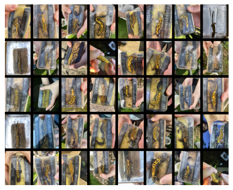
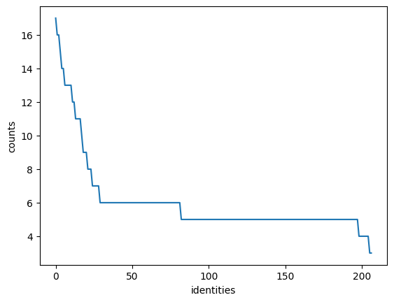
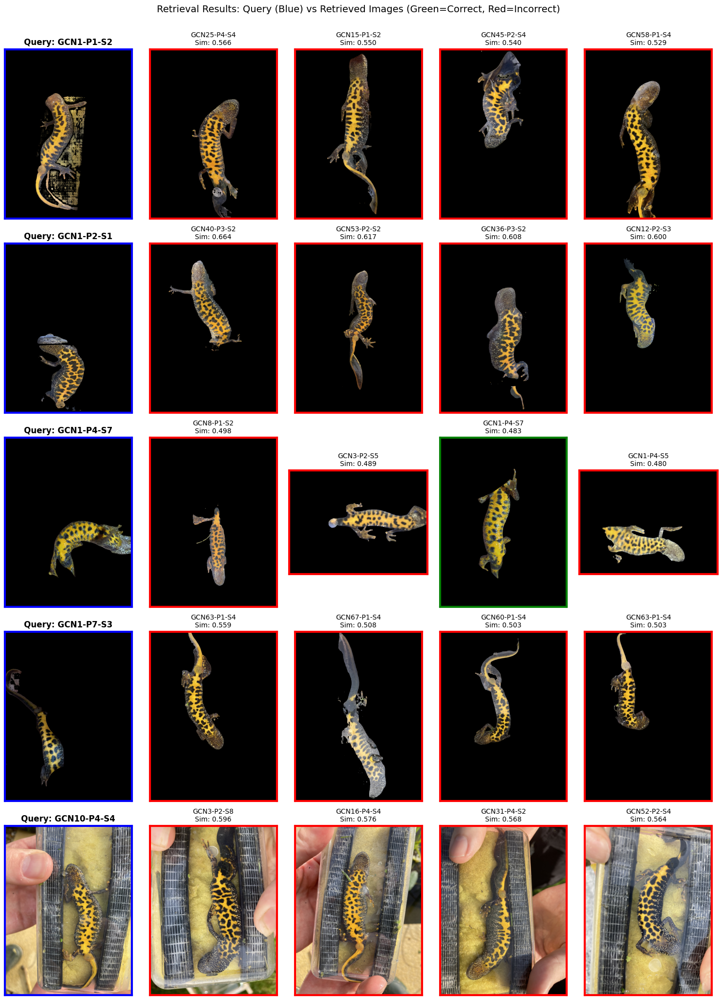
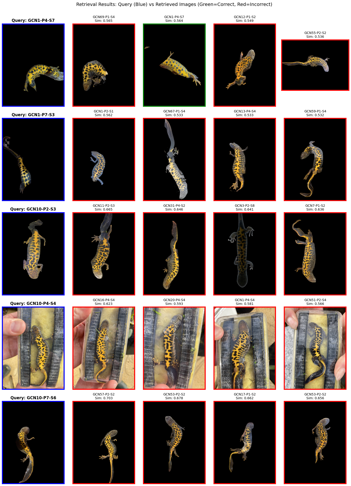
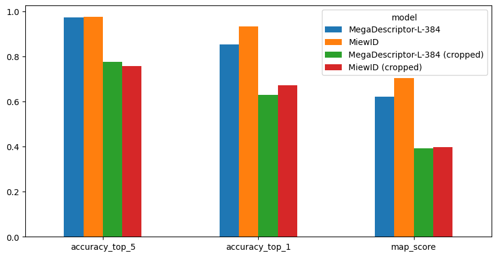

# Newt Current


<!-- WARNING: THIS FILE WAS AUTOGENERATED! DO NOT EDIT! -->

``` python
import os
import sys
import torch
import pandas as pd
import numpy as np
import matplotlib.pyplot as plt
from wildlife_tools.similarity import CosineSimilarity
from wildlife_datasets import analysis, datasets, splits
import pycocotools.mask as mask_util
from wildlife_tools.data import ImageDataset
from sklearn.metrics import average_precision_score
import numpy as np
import timm
from transformers import AutoModel
import torch
import numpy as np
from wildlife_tools.inference import TopkClassifier, KnnClassifier
from wildlife_tools.features import DeepFeatures
import torchvision.transforms as T
from PIL import Image
import kaggle
import pandas as pd
from wildlife_tools.data import ImageDataset
from gcn_reid.segmentation import decode_rle_mask
```

# Create Dataset Class

------------------------------------------------------------------------

<a
href="https://github.com/mshahoyi/gcn-reid/blob/main/gcn_reid/newt.py#L9"
target="_blank" style="float:right; font-size:smaller">source</a>

### get_newt_dataset

>  get_newt_dataset ()

------------------------------------------------------------------------

<a
href="https://github.com/mshahoyi/gcn-reid/blob/main/gcn_reid/newt.py#L32"
target="_blank" style="float:right; font-size:smaller">source</a>

### get_cropped_newt

>  get_cropped_newt (path, rle)

------------------------------------------------------------------------

<a
href="https://github.com/mshahoyi/gcn-reid/blob/main/gcn_reid/newt.py#L49"
target="_blank" style="float:right; font-size:smaller">source</a>

### get_cropping_image_dataset

>  get_cropping_image_dataset ()

``` python
CroppingImageDataset = get_cropping_image_dataset()
```

    Dataset already exists at data/newt_dataset

<div>
<style scoped>
    .dataframe tbody tr th:only-of-type {
        vertical-align: middle;
    }
&#10;    .dataframe tbody tr th {
        vertical-align: top;
    }
&#10;    .dataframe thead th {
        text-align: right;
    }
</style>

<table class="dataframe" data-quarto-postprocess="true" data-border="1">
<thead>
<tr style="text-align: right;">
<th data-quarto-table-cell-role="th"></th>
<th data-quarto-table-cell-role="th">path</th>
<th data-quarto-table-cell-role="th">image_name</th>
<th data-quarto-table-cell-role="th">identity</th>
<th data-quarto-table-cell-role="th">segmentation_mask_rle</th>
</tr>
</thead>
<tbody>
<tr>
<td data-quarto-table-cell-role="th">0</td>
<td>original_images/GCN63-P6-S2/IMG_2725.JPEG</td>
<td>IMG_2725.JPEG</td>
<td>GCN63-P6-S2</td>
<td>2048x1536:bjlS15go17J6oIGT\N&lt;`c1O^\N7]c1Ib\N&gt;X...</td>
</tr>
<tr>
<td data-quarto-table-cell-role="th">1</td>
<td>original_images/GCN63-P6-S2/IMG_2727.JPEG</td>
<td>IMG_2727.JPEG</td>
<td>GCN63-P6-S2</td>
<td>2048x1536:XljT17do17N2M2THEQ`N&lt;k_1KP`N=h_1FU`N...</td>
</tr>
<tr>
<td data-quarto-table-cell-role="th">2</td>
<td>original_images/GCN63-P6-S2/IMG_2728.JPEG</td>
<td>IMG_2728.JPEG</td>
<td>GCN63-P6-S2</td>
<td>2048x1536:chln02mo12N2M3E&lt;M3N1OO4CQS2LXmM6L5K5...</td>
</tr>
<tr>
<td data-quarto-table-cell-role="th">3</td>
<td>original_images/GCN63-P6-S2/IMG_2726.JPEG</td>
<td>IMG_2726.JPEG</td>
<td>GCN63-P6-S2</td>
<td>2048x1536:l]\P1U1=]O4KVl1R1ZSN^O:IVl1m2K6[TNYL...</td>
</tr>
<tr>
<td data-quarto-table-cell-role="th">4</td>
<td>original_images/GCN63-P6-S2/IMG_2729.JPEG</td>
<td>IMG_2729.JPEG</td>
<td>GCN63-P6-S2</td>
<td>2048x1536:S]`92no11OO10ho31VPL3_PNKVo1=VOGQRN7...</td>
</tr>
</tbody>
</table>

</div>

``` python
dataset_path = "data/newt_dataset"
NewtDataset = get_newt_dataset()
NewtDataset._download(dataset_name="mshahoyi/barhill-newts-segmented", download_path=dataset_path)
dataset = NewtDataset(dataset_path)
dataset.df.head()
```

``` python
dataset.plot_grid()
```




``` python
analysis.display_statistics(dataset.df)
```

    Number of identitites            207
    Number of all animals            1253
    Number of animals with one image 0
    Number of unidentified animals   0



# Create Query and Database Sets

``` python
splitter = splits.ClosedSetSplit(0.9)
for idx_database, idx_query in splitter.split(dataset.df):
    df_database, df_query = dataset.df.loc[idx_database], dataset.df.loc[idx_query]
    splits.analyze_split(dataset.df, idx_database, idx_query)
```

    Split: time-unaware closed-set
    Samples: train/test/unassigned/total = 1043/210/0/1253
    Classes: train/test/unassigned/total = 207/207/0/207
    Samples: train only/test only        = 0/0
    Classes: train only/test only/joint  = 0/0/207

    Fraction of train set     = 83.24%
    Fraction of test set only = 0.00%

# Test MegaDescriptor

``` python
transform = T.Compose([T.Resize([384, 384]), T.ToTensor(), T.Normalize(mean=(0.485, 0.456, 0.406), std=(0.229, 0.224, 0.225))])
dataset_database = datasets.WildlifeDataset(df=df_database, root=dataset.root, transform=transform)
dataset_query = datasets.WildlifeDataset(df=df_query, root=dataset.root, transform=transform)
```

``` python
name = 'hf-hub:BVRA/MegaDescriptor-L-384'
device = torch.device('cuda:1' if torch.cuda.is_available() else 'cpu')
extractor = DeepFeatures(timm.create_model(name, num_classes=0, pretrained=True), 
                         device=device,
                         batch_size=32,
                         num_workers=4,
                         )
print("model loaded to device:", device)
```

    2025-05-27 17:23:22.237805: E external/local_xla/xla/stream_executor/cuda/cuda_fft.cc:477] Unable to register cuFFT factory: Attempting to register factory for plugin cuFFT when one has already been registered
    WARNING: All log messages before absl::InitializeLog() is called are written to STDERR
    E0000 00:00:1748366602.260419   47612 cuda_dnn.cc:8310] Unable to register cuDNN factory: Attempting to register factory for plugin cuDNN when one has already been registered
    E0000 00:00:1748366602.267161   47612 cuda_blas.cc:1418] Unable to register cuBLAS factory: Attempting to register factory for plugin cuBLAS when one has already been registered

    model loaded to device: cuda:1

``` python
query = extractor(CroppingImageDataset(dataset_query.df, root=dataset_query.root, transform=dataset_query.transform, crop_out=False))
database = extractor(CroppingImageDataset(dataset_database.df, root=dataset_database.root, transform=dataset_database.transform, crop_out=False))
```

    100%|█████████████████████████████████████████████████████████████████| 7/7 [00:18<00:00,  2.63s/it]
    100%|███████████████████████████████████████████████████████████████| 33/33 [01:30<00:00,  2.75s/it]

``` python
similarity_function = CosineSimilarity()
similarity = similarity_function(query, database)
```

``` python
top_5_classifier = TopkClassifier(k=5, database_labels=dataset_database.labels_string, return_all=True)
predictions_top_5, scores_top_5, _ = top_5_classifier(similarity)
```

``` python
accuracy_top_1 = np.mean(dataset_query.labels_string == predictions_top_5[:, 0])
accuracy_top_5 = np.mean(np.any(predictions_top_5 == dataset_query.labels_string[:, np.newaxis], axis=1))

accuracy_top_1, accuracy_top_5
```

    (0.8523809523809524, 0.8523809523809524, 0.9714285714285714)

``` python
def calculate_map(query_labels, database_labels, similarity_matrix):
    """
    Calculate mean Average Precision (mAP) for retrieval task.
    
    Args:
        query_labels: Array of query labels
        database_labels: Array of database labels  
        similarity_matrix: Similarity scores between queries and database
    
    Returns:
        mAP: Mean Average Precision
    """
    aps = []
    
    for i, query_label in enumerate(query_labels):
        # Get similarity scores for this query
        scores = similarity_matrix[i]
        
        # Create binary relevance labels (1 if same identity, 0 otherwise)
        relevance = (database_labels == query_label).astype(int)
        
        # Calculate Average Precision for this query
        if np.sum(relevance) > 0:  # Only if there are relevant items
            ap = average_precision_score(relevance, scores)
            aps.append(ap)
    
    return np.mean(aps)

# Calculate mAP
map_score = calculate_map(dataset_query.labels_string, dataset_database.labels_string, similarity)
print(f"Mean Average Precision (mAP): {map_score:.4f}")
```

    Mean Average Precision (mAP): 0.6209

------------------------------------------------------------------------

<a
href="https://github.com/mshahoyi/gcn-reid/blob/main/gcn_reid/newt.py#L76"
target="_blank" style="float:right; font-size:smaller">source</a>

### plot_retrieval_results

>  plot_retrieval_results (dataset_query, dataset_database,
>                              similarity_matrix, crop_out=False,
>                              mode='mistakes', num_results=4, num_queries=5,
>                              figsize=(15, 20))

\*Plot retrieval results showing query images and their most similar
matches.

Args: dataset_query: Query dataset with images and labels
dataset_database: Database dataset with images and labels
similarity_matrix: Similarity scores between queries and database
num_results: Number of top similar images to show per query num_queries:
Number of query images to display figsize: Figure size for the plot\*

``` python
# Plot retrieval results
plot_retrieval_results(dataset_query, dataset_database, similarity, num_results=4, num_queries=5)
```


# Test MiewID

``` python
miew_id_model = AutoModel.from_pretrained("conservationxlabs/miewid-msv2", trust_remote_code=True)

miew_id_extractor = DeepFeatures(miew_id_model, 
                         device=device,
                         batch_size=32,
                         num_workers=4,
                         )
```

    Building Model Backbone for efficientnetv2_rw_m model
    config.model_name efficientnetv2_rw_m
    model_name efficientnetv2_rw_m

    /usr/local/lib/python3.11/dist-packages/torch/nn/modules/module.py:2397: UserWarning: for conv_stem.weight: copying from a non-meta parameter in the checkpoint to a meta parameter in the current model, which is a no-op. (Did you mean to pass `assign=True` to assign items in the state dictionary to their corresponding key in the module instead of copying them in place?)
      warnings.warn(
    /usr/local/lib/python3.11/dist-packages/torch/nn/modules/module.py:2397: UserWarning: for bn1.weight: copying from a non-meta parameter in the checkpoint to a meta parameter in the current model, which is a no-op. (Did you mean to pass `assign=True` to assign items in the state dictionary to their corresponding key in the module instead of copying them in place?)
      warnings.warn(
    /usr/local/lib/python3.11/dist-packages/torch/nn/modules/module.py:2397: UserWarning: for bn1.bias: copying from a non-meta parameter in the checkpoint to a meta parameter in the current model, which is a no-op. (Did you mean to pass `assign=True` to assign items in the state dictionary to their corresponding key in the module instead of copying them in place?)
      warnings.warn(
    /usr/local/lib/python3.11/dist-packages/torch/nn/modules/module.py:2397: UserWarning: for blocks.0.0.conv_exp.weight: copying from a non-meta parameter in the checkpoint to a meta parameter in the current model, which is a no-op. (Did you mean to pass `assign=True` to assign items in the state dictionary to their corresponding key in the module instead of copying them in place?)
      warnings.warn(
    /usr/local/lib/python3.11/dist-packages/torch/nn/modules/module.py:2397: UserWarning: for blocks.0.0.bn1.weight: copying from a non-meta parameter in the checkpoint to a meta parameter in the current model, which is a no-op. (Did you mean to pass `assign=True` to assign items in the state dictionary to their corresponding key in the module instead of copying them in place?)
      warnings.warn(
    /usr/local/lib/python3.11/dist-packages/torch/nn/modules/module.py:2397: UserWarning: for blocks.0.0.bn1.bias: copying from a non-meta parameter in the checkpoint to a meta parameter in the current model, which is a no-op. (Did you mean to pass `assign=True` to assign items in the state dictionary to their corresponding key in the module instead of copying them in place?)
      warnings.warn(
    /usr/local/lib/python3.11/dist-packages/torch/nn/modules/module.py:2397: UserWarning: for blocks.0.0.conv_pwl.weight: copying from a non-meta parameter in the checkpoint to a meta parameter in the current model, which is a no-op. (Did you mean to pass `assign=True` to assign items in the state dictionary to their corresponding key in the module instead of copying them in place?)
      warnings.warn(
    /usr/local/lib/python3.11/dist-packages/torch/nn/modules/module.py:2397: UserWarning: for blocks.0.0.bn2.weight: copying from a non-meta parameter in the checkpoint to a meta parameter in the current model, which is a no-op. (Did you mean to pass `assign=True` to assign items in the state dictionary to their corresponding key in the module instead of copying them in place?)
      warnings.warn(
    /usr/local/lib/python3.11/dist-packages/torch/nn/modules/module.py:2397: UserWarning: for blocks.0.0.bn2.bias: copying from a non-meta parameter in the checkpoint to a meta parameter in the current model, which is a no-op. (Did you mean to pass `assign=True` to assign items in the state dictionary to their corresponding key in the module instead of copying them in place?)
      warnings.warn(
    /usr/local/lib/python3.11/dist-packages/torch/nn/modules/module.py:2397: UserWarning: for blocks.0.1.conv_exp.weight: copying from a non-meta parameter in the checkpoint to a meta parameter in the current model, which is a no-op. (Did you mean to pass `assign=True` to assign items in the state dictionary to their corresponding key in the module instead of copying them in place?)
      warnings.warn(
    /usr/local/lib/python3.11/dist-packages/torch/nn/modules/module.py:2397: UserWarning: for blocks.0.1.bn1.weight: copying from a non-meta parameter in the checkpoint to a meta parameter in the current model, which is a no-op. (Did you mean to pass `assign=True` to assign items in the state dictionary to their corresponding key in the module instead of copying them in place?)
      warnings.warn(
    /usr/local/lib/python3.11/dist-packages/torch/nn/modules/module.py:2397: UserWarning: for blocks.0.1.bn1.bias: copying from a non-meta parameter in the checkpoint to a meta parameter in the current model, which is a no-op. (Did you mean to pass `assign=True` to assign items in the state dictionary to their corresponding key in the module instead of copying them in place?)
      warnings.warn(
    /usr/local/lib/python3.11/dist-packages/torch/nn/modules/module.py:2397: UserWarning: for blocks.0.1.conv_pwl.weight: copying from a non-meta parameter in the checkpoint to a meta parameter in the current model, which is a no-op. (Did you mean to pass `assign=True` to assign items in the state dictionary to their corresponding key in the module instead of copying them in place?)
      warnings.warn(
    /usr/local/lib/python3.11/dist-packages/torch/nn/modules/module.py:2397: UserWarning: for blocks.0.1.bn2.weight: copying from a non-meta parameter in the checkpoint to a meta parameter in the current model, which is a no-op. (Did you mean to pass `assign=True` to assign items in the state dictionary to their corresponding key in the module instead of copying them in place?)
      warnings.warn(
    /usr/local/lib/python3.11/dist-packages/torch/nn/modules/module.py:2397: UserWarning: for blocks.0.1.bn2.bias: copying from a non-meta parameter in the checkpoint to a meta parameter in the current model, which is a no-op. (Did you mean to pass `assign=True` to assign items in the state dictionary to their corresponding key in the module instead of copying them in place?)
      warnings.warn(
    /usr/local/lib/python3.11/dist-packages/torch/nn/modules/module.py:2397: UserWarning: for blocks.0.2.conv_exp.weight: copying from a non-meta parameter in the checkpoint to a meta parameter in the current model, which is a no-op. (Did you mean to pass `assign=True` to assign items in the state dictionary to their corresponding key in the module instead of copying them in place?)
      warnings.warn(
    /usr/local/lib/python3.11/dist-packages/torch/nn/modules/module.py:2397: UserWarning: for blocks.0.2.bn1.weight: copying from a non-meta parameter in the checkpoint to a meta parameter in the current model, which is a no-op. (Did you mean to pass `assign=True` to assign items in the state dictionary to their corresponding key in the module instead of copying them in place?)
      warnings.warn(
    /usr/local/lib/python3.11/dist-packages/torch/nn/modules/module.py:2397: UserWarning: for blocks.0.2.bn1.bias: copying from a non-meta parameter in the checkpoint to a meta parameter in the current model, which is a no-op. (Did you mean to pass `assign=True` to assign items in the state dictionary to their corresponding key in the module instead of copying them in place?)
      warnings.warn(
    /usr/local/lib/python3.11/dist-packages/torch/nn/modules/module.py:2397: UserWarning: for blocks.0.2.conv_pwl.weight: copying from a non-meta parameter in the checkpoint to a meta parameter in the current model, which is a no-op. (Did you mean to pass `assign=True` to assign items in the state dictionary to their corresponding key in the module instead of copying them in place?)
      warnings.warn(
    /usr/local/lib/python3.11/dist-packages/torch/nn/modules/module.py:2397: UserWarning: for blocks.0.2.bn2.weight: copying from a non-meta parameter in the checkpoint to a meta parameter in the current model, which is a no-op. (Did you mean to pass `assign=True` to assign items in the state dictionary to their corresponding key in the module instead of copying them in place?)
      warnings.warn(
    /usr/local/lib/python3.11/dist-packages/torch/nn/modules/module.py:2397: UserWarning: for blocks.0.2.bn2.bias: copying from a non-meta parameter in the checkpoint to a meta parameter in the current model, which is a no-op. (Did you mean to pass `assign=True` to assign items in the state dictionary to their corresponding key in the module instead of copying them in place?)
      warnings.warn(
    /usr/local/lib/python3.11/dist-packages/torch/nn/modules/module.py:2397: UserWarning: for blocks.1.0.conv_exp.weight: copying from a non-meta parameter in the checkpoint to a meta parameter in the current model, which is a no-op. (Did you mean to pass `assign=True` to assign items in the state dictionary to their corresponding key in the module instead of copying them in place?)
      warnings.warn(
    /usr/local/lib/python3.11/dist-packages/torch/nn/modules/module.py:2397: UserWarning: for blocks.1.0.bn1.weight: copying from a non-meta parameter in the checkpoint to a meta parameter in the current model, which is a no-op. (Did you mean to pass `assign=True` to assign items in the state dictionary to their corresponding key in the module instead of copying them in place?)
      warnings.warn(
    /usr/local/lib/python3.11/dist-packages/torch/nn/modules/module.py:2397: UserWarning: for blocks.1.0.bn1.bias: copying from a non-meta parameter in the checkpoint to a meta parameter in the current model, which is a no-op. (Did you mean to pass `assign=True` to assign items in the state dictionary to their corresponding key in the module instead of copying them in place?)
      warnings.warn(
    /usr/local/lib/python3.11/dist-packages/torch/nn/modules/module.py:2397: UserWarning: for blocks.1.0.conv_pwl.weight: copying from a non-meta parameter in the checkpoint to a meta parameter in the current model, which is a no-op. (Did you mean to pass `assign=True` to assign items in the state dictionary to their corresponding key in the module instead of copying them in place?)
      warnings.warn(
    /usr/local/lib/python3.11/dist-packages/torch/nn/modules/module.py:2397: UserWarning: for blocks.1.0.bn2.weight: copying from a non-meta parameter in the checkpoint to a meta parameter in the current model, which is a no-op. (Did you mean to pass `assign=True` to assign items in the state dictionary to their corresponding key in the module instead of copying them in place?)
      warnings.warn(
    /usr/local/lib/python3.11/dist-packages/torch/nn/modules/module.py:2397: UserWarning: for blocks.1.0.bn2.bias: copying from a non-meta parameter in the checkpoint to a meta parameter in the current model, which is a no-op. (Did you mean to pass `assign=True` to assign items in the state dictionary to their corresponding key in the module instead of copying them in place?)
      warnings.warn(
    /usr/local/lib/python3.11/dist-packages/torch/nn/modules/module.py:2397: UserWarning: for blocks.1.1.conv_exp.weight: copying from a non-meta parameter in the checkpoint to a meta parameter in the current model, which is a no-op. (Did you mean to pass `assign=True` to assign items in the state dictionary to their corresponding key in the module instead of copying them in place?)
      warnings.warn(
    /usr/local/lib/python3.11/dist-packages/torch/nn/modules/module.py:2397: UserWarning: for blocks.1.1.bn1.weight: copying from a non-meta parameter in the checkpoint to a meta parameter in the current model, which is a no-op. (Did you mean to pass `assign=True` to assign items in the state dictionary to their corresponding key in the module instead of copying them in place?)
      warnings.warn(
    /usr/local/lib/python3.11/dist-packages/torch/nn/modules/module.py:2397: UserWarning: for blocks.1.1.bn1.bias: copying from a non-meta parameter in the checkpoint to a meta parameter in the current model, which is a no-op. (Did you mean to pass `assign=True` to assign items in the state dictionary to their corresponding key in the module instead of copying them in place?)
      warnings.warn(
    /usr/local/lib/python3.11/dist-packages/torch/nn/modules/module.py:2397: UserWarning: for blocks.1.1.conv_pwl.weight: copying from a non-meta parameter in the checkpoint to a meta parameter in the current model, which is a no-op. (Did you mean to pass `assign=True` to assign items in the state dictionary to their corresponding key in the module instead of copying them in place?)
      warnings.warn(
    /usr/local/lib/python3.11/dist-packages/torch/nn/modules/module.py:2397: UserWarning: for blocks.1.1.bn2.weight: copying from a non-meta parameter in the checkpoint to a meta parameter in the current model, which is a no-op. (Did you mean to pass `assign=True` to assign items in the state dictionary to their corresponding key in the module instead of copying them in place?)
      warnings.warn(
    /usr/local/lib/python3.11/dist-packages/torch/nn/modules/module.py:2397: UserWarning: for blocks.1.1.bn2.bias: copying from a non-meta parameter in the checkpoint to a meta parameter in the current model, which is a no-op. (Did you mean to pass `assign=True` to assign items in the state dictionary to their corresponding key in the module instead of copying them in place?)
      warnings.warn(
    /usr/local/lib/python3.11/dist-packages/torch/nn/modules/module.py:2397: UserWarning: for blocks.1.2.conv_exp.weight: copying from a non-meta parameter in the checkpoint to a meta parameter in the current model, which is a no-op. (Did you mean to pass `assign=True` to assign items in the state dictionary to their corresponding key in the module instead of copying them in place?)
      warnings.warn(
    /usr/local/lib/python3.11/dist-packages/torch/nn/modules/module.py:2397: UserWarning: for blocks.1.2.bn1.weight: copying from a non-meta parameter in the checkpoint to a meta parameter in the current model, which is a no-op. (Did you mean to pass `assign=True` to assign items in the state dictionary to their corresponding key in the module instead of copying them in place?)
      warnings.warn(
    /usr/local/lib/python3.11/dist-packages/torch/nn/modules/module.py:2397: UserWarning: for blocks.1.2.bn1.bias: copying from a non-meta parameter in the checkpoint to a meta parameter in the current model, which is a no-op. (Did you mean to pass `assign=True` to assign items in the state dictionary to their corresponding key in the module instead of copying them in place?)
      warnings.warn(
    /usr/local/lib/python3.11/dist-packages/torch/nn/modules/module.py:2397: UserWarning: for blocks.1.2.conv_pwl.weight: copying from a non-meta parameter in the checkpoint to a meta parameter in the current model, which is a no-op. (Did you mean to pass `assign=True` to assign items in the state dictionary to their corresponding key in the module instead of copying them in place?)
      warnings.warn(
    /usr/local/lib/python3.11/dist-packages/torch/nn/modules/module.py:2397: UserWarning: for blocks.1.2.bn2.weight: copying from a non-meta parameter in the checkpoint to a meta parameter in the current model, which is a no-op. (Did you mean to pass `assign=True` to assign items in the state dictionary to their corresponding key in the module instead of copying them in place?)
      warnings.warn(
    /usr/local/lib/python3.11/dist-packages/torch/nn/modules/module.py:2397: UserWarning: for blocks.1.2.bn2.bias: copying from a non-meta parameter in the checkpoint to a meta parameter in the current model, which is a no-op. (Did you mean to pass `assign=True` to assign items in the state dictionary to their corresponding key in the module instead of copying them in place?)
      warnings.warn(
    /usr/local/lib/python3.11/dist-packages/torch/nn/modules/module.py:2397: UserWarning: for blocks.1.3.conv_exp.weight: copying from a non-meta parameter in the checkpoint to a meta parameter in the current model, which is a no-op. (Did you mean to pass `assign=True` to assign items in the state dictionary to their corresponding key in the module instead of copying them in place?)
      warnings.warn(
    /usr/local/lib/python3.11/dist-packages/torch/nn/modules/module.py:2397: UserWarning: for blocks.1.3.bn1.weight: copying from a non-meta parameter in the checkpoint to a meta parameter in the current model, which is a no-op. (Did you mean to pass `assign=True` to assign items in the state dictionary to their corresponding key in the module instead of copying them in place?)
      warnings.warn(
    /usr/local/lib/python3.11/dist-packages/torch/nn/modules/module.py:2397: UserWarning: for blocks.1.3.bn1.bias: copying from a non-meta parameter in the checkpoint to a meta parameter in the current model, which is a no-op. (Did you mean to pass `assign=True` to assign items in the state dictionary to their corresponding key in the module instead of copying them in place?)
      warnings.warn(
    /usr/local/lib/python3.11/dist-packages/torch/nn/modules/module.py:2397: UserWarning: for blocks.1.3.conv_pwl.weight: copying from a non-meta parameter in the checkpoint to a meta parameter in the current model, which is a no-op. (Did you mean to pass `assign=True` to assign items in the state dictionary to their corresponding key in the module instead of copying them in place?)
      warnings.warn(
    /usr/local/lib/python3.11/dist-packages/torch/nn/modules/module.py:2397: UserWarning: for blocks.1.3.bn2.weight: copying from a non-meta parameter in the checkpoint to a meta parameter in the current model, which is a no-op. (Did you mean to pass `assign=True` to assign items in the state dictionary to their corresponding key in the module instead of copying them in place?)
      warnings.warn(
    /usr/local/lib/python3.11/dist-packages/torch/nn/modules/module.py:2397: UserWarning: for blocks.1.3.bn2.bias: copying from a non-meta parameter in the checkpoint to a meta parameter in the current model, which is a no-op. (Did you mean to pass `assign=True` to assign items in the state dictionary to their corresponding key in the module instead of copying them in place?)
      warnings.warn(
    /usr/local/lib/python3.11/dist-packages/torch/nn/modules/module.py:2397: UserWarning: for blocks.1.4.conv_exp.weight: copying from a non-meta parameter in the checkpoint to a meta parameter in the current model, which is a no-op. (Did you mean to pass `assign=True` to assign items in the state dictionary to their corresponding key in the module instead of copying them in place?)
      warnings.warn(
    /usr/local/lib/python3.11/dist-packages/torch/nn/modules/module.py:2397: UserWarning: for blocks.1.4.bn1.weight: copying from a non-meta parameter in the checkpoint to a meta parameter in the current model, which is a no-op. (Did you mean to pass `assign=True` to assign items in the state dictionary to their corresponding key in the module instead of copying them in place?)
      warnings.warn(
    /usr/local/lib/python3.11/dist-packages/torch/nn/modules/module.py:2397: UserWarning: for blocks.1.4.bn1.bias: copying from a non-meta parameter in the checkpoint to a meta parameter in the current model, which is a no-op. (Did you mean to pass `assign=True` to assign items in the state dictionary to their corresponding key in the module instead of copying them in place?)
      warnings.warn(
    /usr/local/lib/python3.11/dist-packages/torch/nn/modules/module.py:2397: UserWarning: for blocks.1.4.conv_pwl.weight: copying from a non-meta parameter in the checkpoint to a meta parameter in the current model, which is a no-op. (Did you mean to pass `assign=True` to assign items in the state dictionary to their corresponding key in the module instead of copying them in place?)
      warnings.warn(
    /usr/local/lib/python3.11/dist-packages/torch/nn/modules/module.py:2397: UserWarning: for blocks.1.4.bn2.weight: copying from a non-meta parameter in the checkpoint to a meta parameter in the current model, which is a no-op. (Did you mean to pass `assign=True` to assign items in the state dictionary to their corresponding key in the module instead of copying them in place?)
      warnings.warn(
    /usr/local/lib/python3.11/dist-packages/torch/nn/modules/module.py:2397: UserWarning: for blocks.1.4.bn2.bias: copying from a non-meta parameter in the checkpoint to a meta parameter in the current model, which is a no-op. (Did you mean to pass `assign=True` to assign items in the state dictionary to their corresponding key in the module instead of copying them in place?)
      warnings.warn(
    /usr/local/lib/python3.11/dist-packages/torch/nn/modules/module.py:2397: UserWarning: for blocks.2.0.conv_exp.weight: copying from a non-meta parameter in the checkpoint to a meta parameter in the current model, which is a no-op. (Did you mean to pass `assign=True` to assign items in the state dictionary to their corresponding key in the module instead of copying them in place?)
      warnings.warn(
    /usr/local/lib/python3.11/dist-packages/torch/nn/modules/module.py:2397: UserWarning: for blocks.2.0.bn1.weight: copying from a non-meta parameter in the checkpoint to a meta parameter in the current model, which is a no-op. (Did you mean to pass `assign=True` to assign items in the state dictionary to their corresponding key in the module instead of copying them in place?)
      warnings.warn(
    /usr/local/lib/python3.11/dist-packages/torch/nn/modules/module.py:2397: UserWarning: for blocks.2.0.bn1.bias: copying from a non-meta parameter in the checkpoint to a meta parameter in the current model, which is a no-op. (Did you mean to pass `assign=True` to assign items in the state dictionary to their corresponding key in the module instead of copying them in place?)
      warnings.warn(
    /usr/local/lib/python3.11/dist-packages/torch/nn/modules/module.py:2397: UserWarning: for blocks.2.0.conv_pwl.weight: copying from a non-meta parameter in the checkpoint to a meta parameter in the current model, which is a no-op. (Did you mean to pass `assign=True` to assign items in the state dictionary to their corresponding key in the module instead of copying them in place?)
      warnings.warn(
    /usr/local/lib/python3.11/dist-packages/torch/nn/modules/module.py:2397: UserWarning: for blocks.2.0.bn2.weight: copying from a non-meta parameter in the checkpoint to a meta parameter in the current model, which is a no-op. (Did you mean to pass `assign=True` to assign items in the state dictionary to their corresponding key in the module instead of copying them in place?)
      warnings.warn(
    /usr/local/lib/python3.11/dist-packages/torch/nn/modules/module.py:2397: UserWarning: for blocks.2.0.bn2.bias: copying from a non-meta parameter in the checkpoint to a meta parameter in the current model, which is a no-op. (Did you mean to pass `assign=True` to assign items in the state dictionary to their corresponding key in the module instead of copying them in place?)
      warnings.warn(
    /usr/local/lib/python3.11/dist-packages/torch/nn/modules/module.py:2397: UserWarning: for blocks.2.1.conv_exp.weight: copying from a non-meta parameter in the checkpoint to a meta parameter in the current model, which is a no-op. (Did you mean to pass `assign=True` to assign items in the state dictionary to their corresponding key in the module instead of copying them in place?)
      warnings.warn(
    /usr/local/lib/python3.11/dist-packages/torch/nn/modules/module.py:2397: UserWarning: for blocks.2.1.bn1.weight: copying from a non-meta parameter in the checkpoint to a meta parameter in the current model, which is a no-op. (Did you mean to pass `assign=True` to assign items in the state dictionary to their corresponding key in the module instead of copying them in place?)
      warnings.warn(
    /usr/local/lib/python3.11/dist-packages/torch/nn/modules/module.py:2397: UserWarning: for blocks.2.1.bn1.bias: copying from a non-meta parameter in the checkpoint to a meta parameter in the current model, which is a no-op. (Did you mean to pass `assign=True` to assign items in the state dictionary to their corresponding key in the module instead of copying them in place?)
      warnings.warn(
    /usr/local/lib/python3.11/dist-packages/torch/nn/modules/module.py:2397: UserWarning: for blocks.2.1.conv_pwl.weight: copying from a non-meta parameter in the checkpoint to a meta parameter in the current model, which is a no-op. (Did you mean to pass `assign=True` to assign items in the state dictionary to their corresponding key in the module instead of copying them in place?)
      warnings.warn(
    /usr/local/lib/python3.11/dist-packages/torch/nn/modules/module.py:2397: UserWarning: for blocks.2.1.bn2.weight: copying from a non-meta parameter in the checkpoint to a meta parameter in the current model, which is a no-op. (Did you mean to pass `assign=True` to assign items in the state dictionary to their corresponding key in the module instead of copying them in place?)
      warnings.warn(
    /usr/local/lib/python3.11/dist-packages/torch/nn/modules/module.py:2397: UserWarning: for blocks.2.1.bn2.bias: copying from a non-meta parameter in the checkpoint to a meta parameter in the current model, which is a no-op. (Did you mean to pass `assign=True` to assign items in the state dictionary to their corresponding key in the module instead of copying them in place?)
      warnings.warn(
    /usr/local/lib/python3.11/dist-packages/torch/nn/modules/module.py:2397: UserWarning: for blocks.2.2.conv_exp.weight: copying from a non-meta parameter in the checkpoint to a meta parameter in the current model, which is a no-op. (Did you mean to pass `assign=True` to assign items in the state dictionary to their corresponding key in the module instead of copying them in place?)
      warnings.warn(
    /usr/local/lib/python3.11/dist-packages/torch/nn/modules/module.py:2397: UserWarning: for blocks.2.2.bn1.weight: copying from a non-meta parameter in the checkpoint to a meta parameter in the current model, which is a no-op. (Did you mean to pass `assign=True` to assign items in the state dictionary to their corresponding key in the module instead of copying them in place?)
      warnings.warn(
    /usr/local/lib/python3.11/dist-packages/torch/nn/modules/module.py:2397: UserWarning: for blocks.2.2.bn1.bias: copying from a non-meta parameter in the checkpoint to a meta parameter in the current model, which is a no-op. (Did you mean to pass `assign=True` to assign items in the state dictionary to their corresponding key in the module instead of copying them in place?)
      warnings.warn(
    /usr/local/lib/python3.11/dist-packages/torch/nn/modules/module.py:2397: UserWarning: for blocks.2.2.conv_pwl.weight: copying from a non-meta parameter in the checkpoint to a meta parameter in the current model, which is a no-op. (Did you mean to pass `assign=True` to assign items in the state dictionary to their corresponding key in the module instead of copying them in place?)
      warnings.warn(
    /usr/local/lib/python3.11/dist-packages/torch/nn/modules/module.py:2397: UserWarning: for blocks.2.2.bn2.weight: copying from a non-meta parameter in the checkpoint to a meta parameter in the current model, which is a no-op. (Did you mean to pass `assign=True` to assign items in the state dictionary to their corresponding key in the module instead of copying them in place?)
      warnings.warn(
    /usr/local/lib/python3.11/dist-packages/torch/nn/modules/module.py:2397: UserWarning: for blocks.2.2.bn2.bias: copying from a non-meta parameter in the checkpoint to a meta parameter in the current model, which is a no-op. (Did you mean to pass `assign=True` to assign items in the state dictionary to their corresponding key in the module instead of copying them in place?)
      warnings.warn(
    /usr/local/lib/python3.11/dist-packages/torch/nn/modules/module.py:2397: UserWarning: for blocks.2.3.conv_exp.weight: copying from a non-meta parameter in the checkpoint to a meta parameter in the current model, which is a no-op. (Did you mean to pass `assign=True` to assign items in the state dictionary to their corresponding key in the module instead of copying them in place?)
      warnings.warn(
    /usr/local/lib/python3.11/dist-packages/torch/nn/modules/module.py:2397: UserWarning: for blocks.2.3.bn1.weight: copying from a non-meta parameter in the checkpoint to a meta parameter in the current model, which is a no-op. (Did you mean to pass `assign=True` to assign items in the state dictionary to their corresponding key in the module instead of copying them in place?)
      warnings.warn(
    /usr/local/lib/python3.11/dist-packages/torch/nn/modules/module.py:2397: UserWarning: for blocks.2.3.bn1.bias: copying from a non-meta parameter in the checkpoint to a meta parameter in the current model, which is a no-op. (Did you mean to pass `assign=True` to assign items in the state dictionary to their corresponding key in the module instead of copying them in place?)
      warnings.warn(
    /usr/local/lib/python3.11/dist-packages/torch/nn/modules/module.py:2397: UserWarning: for blocks.2.3.conv_pwl.weight: copying from a non-meta parameter in the checkpoint to a meta parameter in the current model, which is a no-op. (Did you mean to pass `assign=True` to assign items in the state dictionary to their corresponding key in the module instead of copying them in place?)
      warnings.warn(
    /usr/local/lib/python3.11/dist-packages/torch/nn/modules/module.py:2397: UserWarning: for blocks.2.3.bn2.weight: copying from a non-meta parameter in the checkpoint to a meta parameter in the current model, which is a no-op. (Did you mean to pass `assign=True` to assign items in the state dictionary to their corresponding key in the module instead of copying them in place?)
      warnings.warn(
    /usr/local/lib/python3.11/dist-packages/torch/nn/modules/module.py:2397: UserWarning: for blocks.2.3.bn2.bias: copying from a non-meta parameter in the checkpoint to a meta parameter in the current model, which is a no-op. (Did you mean to pass `assign=True` to assign items in the state dictionary to their corresponding key in the module instead of copying them in place?)
      warnings.warn(
    /usr/local/lib/python3.11/dist-packages/torch/nn/modules/module.py:2397: UserWarning: for blocks.2.4.conv_exp.weight: copying from a non-meta parameter in the checkpoint to a meta parameter in the current model, which is a no-op. (Did you mean to pass `assign=True` to assign items in the state dictionary to their corresponding key in the module instead of copying them in place?)
      warnings.warn(
    /usr/local/lib/python3.11/dist-packages/torch/nn/modules/module.py:2397: UserWarning: for blocks.2.4.bn1.weight: copying from a non-meta parameter in the checkpoint to a meta parameter in the current model, which is a no-op. (Did you mean to pass `assign=True` to assign items in the state dictionary to their corresponding key in the module instead of copying them in place?)
      warnings.warn(
    /usr/local/lib/python3.11/dist-packages/torch/nn/modules/module.py:2397: UserWarning: for blocks.2.4.bn1.bias: copying from a non-meta parameter in the checkpoint to a meta parameter in the current model, which is a no-op. (Did you mean to pass `assign=True` to assign items in the state dictionary to their corresponding key in the module instead of copying them in place?)
      warnings.warn(
    /usr/local/lib/python3.11/dist-packages/torch/nn/modules/module.py:2397: UserWarning: for blocks.2.4.conv_pwl.weight: copying from a non-meta parameter in the checkpoint to a meta parameter in the current model, which is a no-op. (Did you mean to pass `assign=True` to assign items in the state dictionary to their corresponding key in the module instead of copying them in place?)
      warnings.warn(
    /usr/local/lib/python3.11/dist-packages/torch/nn/modules/module.py:2397: UserWarning: for blocks.2.4.bn2.weight: copying from a non-meta parameter in the checkpoint to a meta parameter in the current model, which is a no-op. (Did you mean to pass `assign=True` to assign items in the state dictionary to their corresponding key in the module instead of copying them in place?)
      warnings.warn(
    /usr/local/lib/python3.11/dist-packages/torch/nn/modules/module.py:2397: UserWarning: for blocks.2.4.bn2.bias: copying from a non-meta parameter in the checkpoint to a meta parameter in the current model, which is a no-op. (Did you mean to pass `assign=True` to assign items in the state dictionary to their corresponding key in the module instead of copying them in place?)
      warnings.warn(
    /usr/local/lib/python3.11/dist-packages/torch/nn/modules/module.py:2397: UserWarning: for blocks.3.0.conv_pw.weight: copying from a non-meta parameter in the checkpoint to a meta parameter in the current model, which is a no-op. (Did you mean to pass `assign=True` to assign items in the state dictionary to their corresponding key in the module instead of copying them in place?)
      warnings.warn(
    /usr/local/lib/python3.11/dist-packages/torch/nn/modules/module.py:2397: UserWarning: for blocks.3.0.bn1.weight: copying from a non-meta parameter in the checkpoint to a meta parameter in the current model, which is a no-op. (Did you mean to pass `assign=True` to assign items in the state dictionary to their corresponding key in the module instead of copying them in place?)
      warnings.warn(
    /usr/local/lib/python3.11/dist-packages/torch/nn/modules/module.py:2397: UserWarning: for blocks.3.0.bn1.bias: copying from a non-meta parameter in the checkpoint to a meta parameter in the current model, which is a no-op. (Did you mean to pass `assign=True` to assign items in the state dictionary to their corresponding key in the module instead of copying them in place?)
      warnings.warn(
    /usr/local/lib/python3.11/dist-packages/torch/nn/modules/module.py:2397: UserWarning: for blocks.3.0.conv_dw.weight: copying from a non-meta parameter in the checkpoint to a meta parameter in the current model, which is a no-op. (Did you mean to pass `assign=True` to assign items in the state dictionary to their corresponding key in the module instead of copying them in place?)
      warnings.warn(
    /usr/local/lib/python3.11/dist-packages/torch/nn/modules/module.py:2397: UserWarning: for blocks.3.0.bn2.weight: copying from a non-meta parameter in the checkpoint to a meta parameter in the current model, which is a no-op. (Did you mean to pass `assign=True` to assign items in the state dictionary to their corresponding key in the module instead of copying them in place?)
      warnings.warn(
    /usr/local/lib/python3.11/dist-packages/torch/nn/modules/module.py:2397: UserWarning: for blocks.3.0.bn2.bias: copying from a non-meta parameter in the checkpoint to a meta parameter in the current model, which is a no-op. (Did you mean to pass `assign=True` to assign items in the state dictionary to their corresponding key in the module instead of copying them in place?)
      warnings.warn(
    /usr/local/lib/python3.11/dist-packages/torch/nn/modules/module.py:2397: UserWarning: for blocks.3.0.se.conv_reduce.weight: copying from a non-meta parameter in the checkpoint to a meta parameter in the current model, which is a no-op. (Did you mean to pass `assign=True` to assign items in the state dictionary to their corresponding key in the module instead of copying them in place?)
      warnings.warn(
    /usr/local/lib/python3.11/dist-packages/torch/nn/modules/module.py:2397: UserWarning: for blocks.3.0.se.conv_reduce.bias: copying from a non-meta parameter in the checkpoint to a meta parameter in the current model, which is a no-op. (Did you mean to pass `assign=True` to assign items in the state dictionary to their corresponding key in the module instead of copying them in place?)
      warnings.warn(
    /usr/local/lib/python3.11/dist-packages/torch/nn/modules/module.py:2397: UserWarning: for blocks.3.0.se.conv_expand.weight: copying from a non-meta parameter in the checkpoint to a meta parameter in the current model, which is a no-op. (Did you mean to pass `assign=True` to assign items in the state dictionary to their corresponding key in the module instead of copying them in place?)
      warnings.warn(
    /usr/local/lib/python3.11/dist-packages/torch/nn/modules/module.py:2397: UserWarning: for blocks.3.0.se.conv_expand.bias: copying from a non-meta parameter in the checkpoint to a meta parameter in the current model, which is a no-op. (Did you mean to pass `assign=True` to assign items in the state dictionary to their corresponding key in the module instead of copying them in place?)
      warnings.warn(
    /usr/local/lib/python3.11/dist-packages/torch/nn/modules/module.py:2397: UserWarning: for blocks.3.0.conv_pwl.weight: copying from a non-meta parameter in the checkpoint to a meta parameter in the current model, which is a no-op. (Did you mean to pass `assign=True` to assign items in the state dictionary to their corresponding key in the module instead of copying them in place?)
      warnings.warn(
    /usr/local/lib/python3.11/dist-packages/torch/nn/modules/module.py:2397: UserWarning: for blocks.3.0.bn3.weight: copying from a non-meta parameter in the checkpoint to a meta parameter in the current model, which is a no-op. (Did you mean to pass `assign=True` to assign items in the state dictionary to their corresponding key in the module instead of copying them in place?)
      warnings.warn(
    /usr/local/lib/python3.11/dist-packages/torch/nn/modules/module.py:2397: UserWarning: for blocks.3.0.bn3.bias: copying from a non-meta parameter in the checkpoint to a meta parameter in the current model, which is a no-op. (Did you mean to pass `assign=True` to assign items in the state dictionary to their corresponding key in the module instead of copying them in place?)
      warnings.warn(
    /usr/local/lib/python3.11/dist-packages/torch/nn/modules/module.py:2397: UserWarning: for blocks.3.1.conv_pw.weight: copying from a non-meta parameter in the checkpoint to a meta parameter in the current model, which is a no-op. (Did you mean to pass `assign=True` to assign items in the state dictionary to their corresponding key in the module instead of copying them in place?)
      warnings.warn(
    /usr/local/lib/python3.11/dist-packages/torch/nn/modules/module.py:2397: UserWarning: for blocks.3.1.bn1.weight: copying from a non-meta parameter in the checkpoint to a meta parameter in the current model, which is a no-op. (Did you mean to pass `assign=True` to assign items in the state dictionary to their corresponding key in the module instead of copying them in place?)
      warnings.warn(
    /usr/local/lib/python3.11/dist-packages/torch/nn/modules/module.py:2397: UserWarning: for blocks.3.1.bn1.bias: copying from a non-meta parameter in the checkpoint to a meta parameter in the current model, which is a no-op. (Did you mean to pass `assign=True` to assign items in the state dictionary to their corresponding key in the module instead of copying them in place?)
      warnings.warn(
    /usr/local/lib/python3.11/dist-packages/torch/nn/modules/module.py:2397: UserWarning: for blocks.3.1.conv_dw.weight: copying from a non-meta parameter in the checkpoint to a meta parameter in the current model, which is a no-op. (Did you mean to pass `assign=True` to assign items in the state dictionary to their corresponding key in the module instead of copying them in place?)
      warnings.warn(
    /usr/local/lib/python3.11/dist-packages/torch/nn/modules/module.py:2397: UserWarning: for blocks.3.1.bn2.weight: copying from a non-meta parameter in the checkpoint to a meta parameter in the current model, which is a no-op. (Did you mean to pass `assign=True` to assign items in the state dictionary to their corresponding key in the module instead of copying them in place?)
      warnings.warn(
    /usr/local/lib/python3.11/dist-packages/torch/nn/modules/module.py:2397: UserWarning: for blocks.3.1.bn2.bias: copying from a non-meta parameter in the checkpoint to a meta parameter in the current model, which is a no-op. (Did you mean to pass `assign=True` to assign items in the state dictionary to their corresponding key in the module instead of copying them in place?)
      warnings.warn(
    /usr/local/lib/python3.11/dist-packages/torch/nn/modules/module.py:2397: UserWarning: for blocks.3.1.se.conv_reduce.weight: copying from a non-meta parameter in the checkpoint to a meta parameter in the current model, which is a no-op. (Did you mean to pass `assign=True` to assign items in the state dictionary to their corresponding key in the module instead of copying them in place?)
      warnings.warn(
    /usr/local/lib/python3.11/dist-packages/torch/nn/modules/module.py:2397: UserWarning: for blocks.3.1.se.conv_reduce.bias: copying from a non-meta parameter in the checkpoint to a meta parameter in the current model, which is a no-op. (Did you mean to pass `assign=True` to assign items in the state dictionary to their corresponding key in the module instead of copying them in place?)
      warnings.warn(
    /usr/local/lib/python3.11/dist-packages/torch/nn/modules/module.py:2397: UserWarning: for blocks.3.1.se.conv_expand.weight: copying from a non-meta parameter in the checkpoint to a meta parameter in the current model, which is a no-op. (Did you mean to pass `assign=True` to assign items in the state dictionary to their corresponding key in the module instead of copying them in place?)
      warnings.warn(
    /usr/local/lib/python3.11/dist-packages/torch/nn/modules/module.py:2397: UserWarning: for blocks.3.1.se.conv_expand.bias: copying from a non-meta parameter in the checkpoint to a meta parameter in the current model, which is a no-op. (Did you mean to pass `assign=True` to assign items in the state dictionary to their corresponding key in the module instead of copying them in place?)
      warnings.warn(
    /usr/local/lib/python3.11/dist-packages/torch/nn/modules/module.py:2397: UserWarning: for blocks.3.1.conv_pwl.weight: copying from a non-meta parameter in the checkpoint to a meta parameter in the current model, which is a no-op. (Did you mean to pass `assign=True` to assign items in the state dictionary to their corresponding key in the module instead of copying them in place?)
      warnings.warn(
    /usr/local/lib/python3.11/dist-packages/torch/nn/modules/module.py:2397: UserWarning: for blocks.3.1.bn3.weight: copying from a non-meta parameter in the checkpoint to a meta parameter in the current model, which is a no-op. (Did you mean to pass `assign=True` to assign items in the state dictionary to their corresponding key in the module instead of copying them in place?)
      warnings.warn(
    /usr/local/lib/python3.11/dist-packages/torch/nn/modules/module.py:2397: UserWarning: for blocks.3.1.bn3.bias: copying from a non-meta parameter in the checkpoint to a meta parameter in the current model, which is a no-op. (Did you mean to pass `assign=True` to assign items in the state dictionary to their corresponding key in the module instead of copying them in place?)
      warnings.warn(
    /usr/local/lib/python3.11/dist-packages/torch/nn/modules/module.py:2397: UserWarning: for blocks.3.2.conv_pw.weight: copying from a non-meta parameter in the checkpoint to a meta parameter in the current model, which is a no-op. (Did you mean to pass `assign=True` to assign items in the state dictionary to their corresponding key in the module instead of copying them in place?)
      warnings.warn(
    /usr/local/lib/python3.11/dist-packages/torch/nn/modules/module.py:2397: UserWarning: for blocks.3.2.bn1.weight: copying from a non-meta parameter in the checkpoint to a meta parameter in the current model, which is a no-op. (Did you mean to pass `assign=True` to assign items in the state dictionary to their corresponding key in the module instead of copying them in place?)
      warnings.warn(
    /usr/local/lib/python3.11/dist-packages/torch/nn/modules/module.py:2397: UserWarning: for blocks.3.2.bn1.bias: copying from a non-meta parameter in the checkpoint to a meta parameter in the current model, which is a no-op. (Did you mean to pass `assign=True` to assign items in the state dictionary to their corresponding key in the module instead of copying them in place?)
      warnings.warn(
    /usr/local/lib/python3.11/dist-packages/torch/nn/modules/module.py:2397: UserWarning: for blocks.3.2.conv_dw.weight: copying from a non-meta parameter in the checkpoint to a meta parameter in the current model, which is a no-op. (Did you mean to pass `assign=True` to assign items in the state dictionary to their corresponding key in the module instead of copying them in place?)
      warnings.warn(
    /usr/local/lib/python3.11/dist-packages/torch/nn/modules/module.py:2397: UserWarning: for blocks.3.2.bn2.weight: copying from a non-meta parameter in the checkpoint to a meta parameter in the current model, which is a no-op. (Did you mean to pass `assign=True` to assign items in the state dictionary to their corresponding key in the module instead of copying them in place?)
      warnings.warn(
    /usr/local/lib/python3.11/dist-packages/torch/nn/modules/module.py:2397: UserWarning: for blocks.3.2.bn2.bias: copying from a non-meta parameter in the checkpoint to a meta parameter in the current model, which is a no-op. (Did you mean to pass `assign=True` to assign items in the state dictionary to their corresponding key in the module instead of copying them in place?)
      warnings.warn(
    /usr/local/lib/python3.11/dist-packages/torch/nn/modules/module.py:2397: UserWarning: for blocks.3.2.se.conv_reduce.weight: copying from a non-meta parameter in the checkpoint to a meta parameter in the current model, which is a no-op. (Did you mean to pass `assign=True` to assign items in the state dictionary to their corresponding key in the module instead of copying them in place?)
      warnings.warn(
    /usr/local/lib/python3.11/dist-packages/torch/nn/modules/module.py:2397: UserWarning: for blocks.3.2.se.conv_reduce.bias: copying from a non-meta parameter in the checkpoint to a meta parameter in the current model, which is a no-op. (Did you mean to pass `assign=True` to assign items in the state dictionary to their corresponding key in the module instead of copying them in place?)
      warnings.warn(
    /usr/local/lib/python3.11/dist-packages/torch/nn/modules/module.py:2397: UserWarning: for blocks.3.2.se.conv_expand.weight: copying from a non-meta parameter in the checkpoint to a meta parameter in the current model, which is a no-op. (Did you mean to pass `assign=True` to assign items in the state dictionary to their corresponding key in the module instead of copying them in place?)
      warnings.warn(
    /usr/local/lib/python3.11/dist-packages/torch/nn/modules/module.py:2397: UserWarning: for blocks.3.2.se.conv_expand.bias: copying from a non-meta parameter in the checkpoint to a meta parameter in the current model, which is a no-op. (Did you mean to pass `assign=True` to assign items in the state dictionary to their corresponding key in the module instead of copying them in place?)
      warnings.warn(
    /usr/local/lib/python3.11/dist-packages/torch/nn/modules/module.py:2397: UserWarning: for blocks.3.2.conv_pwl.weight: copying from a non-meta parameter in the checkpoint to a meta parameter in the current model, which is a no-op. (Did you mean to pass `assign=True` to assign items in the state dictionary to their corresponding key in the module instead of copying them in place?)
      warnings.warn(
    /usr/local/lib/python3.11/dist-packages/torch/nn/modules/module.py:2397: UserWarning: for blocks.3.2.bn3.weight: copying from a non-meta parameter in the checkpoint to a meta parameter in the current model, which is a no-op. (Did you mean to pass `assign=True` to assign items in the state dictionary to their corresponding key in the module instead of copying them in place?)
      warnings.warn(
    /usr/local/lib/python3.11/dist-packages/torch/nn/modules/module.py:2397: UserWarning: for blocks.3.2.bn3.bias: copying from a non-meta parameter in the checkpoint to a meta parameter in the current model, which is a no-op. (Did you mean to pass `assign=True` to assign items in the state dictionary to their corresponding key in the module instead of copying them in place?)
      warnings.warn(
    /usr/local/lib/python3.11/dist-packages/torch/nn/modules/module.py:2397: UserWarning: for blocks.3.3.conv_pw.weight: copying from a non-meta parameter in the checkpoint to a meta parameter in the current model, which is a no-op. (Did you mean to pass `assign=True` to assign items in the state dictionary to their corresponding key in the module instead of copying them in place?)
      warnings.warn(
    /usr/local/lib/python3.11/dist-packages/torch/nn/modules/module.py:2397: UserWarning: for blocks.3.3.bn1.weight: copying from a non-meta parameter in the checkpoint to a meta parameter in the current model, which is a no-op. (Did you mean to pass `assign=True` to assign items in the state dictionary to their corresponding key in the module instead of copying them in place?)
      warnings.warn(
    /usr/local/lib/python3.11/dist-packages/torch/nn/modules/module.py:2397: UserWarning: for blocks.3.3.bn1.bias: copying from a non-meta parameter in the checkpoint to a meta parameter in the current model, which is a no-op. (Did you mean to pass `assign=True` to assign items in the state dictionary to their corresponding key in the module instead of copying them in place?)
      warnings.warn(
    /usr/local/lib/python3.11/dist-packages/torch/nn/modules/module.py:2397: UserWarning: for blocks.3.3.conv_dw.weight: copying from a non-meta parameter in the checkpoint to a meta parameter in the current model, which is a no-op. (Did you mean to pass `assign=True` to assign items in the state dictionary to their corresponding key in the module instead of copying them in place?)
      warnings.warn(
    /usr/local/lib/python3.11/dist-packages/torch/nn/modules/module.py:2397: UserWarning: for blocks.3.3.bn2.weight: copying from a non-meta parameter in the checkpoint to a meta parameter in the current model, which is a no-op. (Did you mean to pass `assign=True` to assign items in the state dictionary to their corresponding key in the module instead of copying them in place?)
      warnings.warn(
    /usr/local/lib/python3.11/dist-packages/torch/nn/modules/module.py:2397: UserWarning: for blocks.3.3.bn2.bias: copying from a non-meta parameter in the checkpoint to a meta parameter in the current model, which is a no-op. (Did you mean to pass `assign=True` to assign items in the state dictionary to their corresponding key in the module instead of copying them in place?)
      warnings.warn(
    /usr/local/lib/python3.11/dist-packages/torch/nn/modules/module.py:2397: UserWarning: for blocks.3.3.se.conv_reduce.weight: copying from a non-meta parameter in the checkpoint to a meta parameter in the current model, which is a no-op. (Did you mean to pass `assign=True` to assign items in the state dictionary to their corresponding key in the module instead of copying them in place?)
      warnings.warn(
    /usr/local/lib/python3.11/dist-packages/torch/nn/modules/module.py:2397: UserWarning: for blocks.3.3.se.conv_reduce.bias: copying from a non-meta parameter in the checkpoint to a meta parameter in the current model, which is a no-op. (Did you mean to pass `assign=True` to assign items in the state dictionary to their corresponding key in the module instead of copying them in place?)
      warnings.warn(
    /usr/local/lib/python3.11/dist-packages/torch/nn/modules/module.py:2397: UserWarning: for blocks.3.3.se.conv_expand.weight: copying from a non-meta parameter in the checkpoint to a meta parameter in the current model, which is a no-op. (Did you mean to pass `assign=True` to assign items in the state dictionary to their corresponding key in the module instead of copying them in place?)
      warnings.warn(
    /usr/local/lib/python3.11/dist-packages/torch/nn/modules/module.py:2397: UserWarning: for blocks.3.3.se.conv_expand.bias: copying from a non-meta parameter in the checkpoint to a meta parameter in the current model, which is a no-op. (Did you mean to pass `assign=True` to assign items in the state dictionary to their corresponding key in the module instead of copying them in place?)
      warnings.warn(
    /usr/local/lib/python3.11/dist-packages/torch/nn/modules/module.py:2397: UserWarning: for blocks.3.3.conv_pwl.weight: copying from a non-meta parameter in the checkpoint to a meta parameter in the current model, which is a no-op. (Did you mean to pass `assign=True` to assign items in the state dictionary to their corresponding key in the module instead of copying them in place?)
      warnings.warn(
    /usr/local/lib/python3.11/dist-packages/torch/nn/modules/module.py:2397: UserWarning: for blocks.3.3.bn3.weight: copying from a non-meta parameter in the checkpoint to a meta parameter in the current model, which is a no-op. (Did you mean to pass `assign=True` to assign items in the state dictionary to their corresponding key in the module instead of copying them in place?)
      warnings.warn(
    /usr/local/lib/python3.11/dist-packages/torch/nn/modules/module.py:2397: UserWarning: for blocks.3.3.bn3.bias: copying from a non-meta parameter in the checkpoint to a meta parameter in the current model, which is a no-op. (Did you mean to pass `assign=True` to assign items in the state dictionary to their corresponding key in the module instead of copying them in place?)
      warnings.warn(
    /usr/local/lib/python3.11/dist-packages/torch/nn/modules/module.py:2397: UserWarning: for blocks.3.4.conv_pw.weight: copying from a non-meta parameter in the checkpoint to a meta parameter in the current model, which is a no-op. (Did you mean to pass `assign=True` to assign items in the state dictionary to their corresponding key in the module instead of copying them in place?)
      warnings.warn(
    /usr/local/lib/python3.11/dist-packages/torch/nn/modules/module.py:2397: UserWarning: for blocks.3.4.bn1.weight: copying from a non-meta parameter in the checkpoint to a meta parameter in the current model, which is a no-op. (Did you mean to pass `assign=True` to assign items in the state dictionary to their corresponding key in the module instead of copying them in place?)
      warnings.warn(
    /usr/local/lib/python3.11/dist-packages/torch/nn/modules/module.py:2397: UserWarning: for blocks.3.4.bn1.bias: copying from a non-meta parameter in the checkpoint to a meta parameter in the current model, which is a no-op. (Did you mean to pass `assign=True` to assign items in the state dictionary to their corresponding key in the module instead of copying them in place?)
      warnings.warn(
    /usr/local/lib/python3.11/dist-packages/torch/nn/modules/module.py:2397: UserWarning: for blocks.3.4.conv_dw.weight: copying from a non-meta parameter in the checkpoint to a meta parameter in the current model, which is a no-op. (Did you mean to pass `assign=True` to assign items in the state dictionary to their corresponding key in the module instead of copying them in place?)
      warnings.warn(
    /usr/local/lib/python3.11/dist-packages/torch/nn/modules/module.py:2397: UserWarning: for blocks.3.4.bn2.weight: copying from a non-meta parameter in the checkpoint to a meta parameter in the current model, which is a no-op. (Did you mean to pass `assign=True` to assign items in the state dictionary to their corresponding key in the module instead of copying them in place?)
      warnings.warn(
    /usr/local/lib/python3.11/dist-packages/torch/nn/modules/module.py:2397: UserWarning: for blocks.3.4.bn2.bias: copying from a non-meta parameter in the checkpoint to a meta parameter in the current model, which is a no-op. (Did you mean to pass `assign=True` to assign items in the state dictionary to their corresponding key in the module instead of copying them in place?)
      warnings.warn(
    /usr/local/lib/python3.11/dist-packages/torch/nn/modules/module.py:2397: UserWarning: for blocks.3.4.se.conv_reduce.weight: copying from a non-meta parameter in the checkpoint to a meta parameter in the current model, which is a no-op. (Did you mean to pass `assign=True` to assign items in the state dictionary to their corresponding key in the module instead of copying them in place?)
      warnings.warn(
    /usr/local/lib/python3.11/dist-packages/torch/nn/modules/module.py:2397: UserWarning: for blocks.3.4.se.conv_reduce.bias: copying from a non-meta parameter in the checkpoint to a meta parameter in the current model, which is a no-op. (Did you mean to pass `assign=True` to assign items in the state dictionary to their corresponding key in the module instead of copying them in place?)
      warnings.warn(
    /usr/local/lib/python3.11/dist-packages/torch/nn/modules/module.py:2397: UserWarning: for blocks.3.4.se.conv_expand.weight: copying from a non-meta parameter in the checkpoint to a meta parameter in the current model, which is a no-op. (Did you mean to pass `assign=True` to assign items in the state dictionary to their corresponding key in the module instead of copying them in place?)
      warnings.warn(
    /usr/local/lib/python3.11/dist-packages/torch/nn/modules/module.py:2397: UserWarning: for blocks.3.4.se.conv_expand.bias: copying from a non-meta parameter in the checkpoint to a meta parameter in the current model, which is a no-op. (Did you mean to pass `assign=True` to assign items in the state dictionary to their corresponding key in the module instead of copying them in place?)
      warnings.warn(
    /usr/local/lib/python3.11/dist-packages/torch/nn/modules/module.py:2397: UserWarning: for blocks.3.4.conv_pwl.weight: copying from a non-meta parameter in the checkpoint to a meta parameter in the current model, which is a no-op. (Did you mean to pass `assign=True` to assign items in the state dictionary to their corresponding key in the module instead of copying them in place?)
      warnings.warn(
    /usr/local/lib/python3.11/dist-packages/torch/nn/modules/module.py:2397: UserWarning: for blocks.3.4.bn3.weight: copying from a non-meta parameter in the checkpoint to a meta parameter in the current model, which is a no-op. (Did you mean to pass `assign=True` to assign items in the state dictionary to their corresponding key in the module instead of copying them in place?)
      warnings.warn(
    /usr/local/lib/python3.11/dist-packages/torch/nn/modules/module.py:2397: UserWarning: for blocks.3.4.bn3.bias: copying from a non-meta parameter in the checkpoint to a meta parameter in the current model, which is a no-op. (Did you mean to pass `assign=True` to assign items in the state dictionary to their corresponding key in the module instead of copying them in place?)
      warnings.warn(
    /usr/local/lib/python3.11/dist-packages/torch/nn/modules/module.py:2397: UserWarning: for blocks.3.5.conv_pw.weight: copying from a non-meta parameter in the checkpoint to a meta parameter in the current model, which is a no-op. (Did you mean to pass `assign=True` to assign items in the state dictionary to their corresponding key in the module instead of copying them in place?)
      warnings.warn(
    /usr/local/lib/python3.11/dist-packages/torch/nn/modules/module.py:2397: UserWarning: for blocks.3.5.bn1.weight: copying from a non-meta parameter in the checkpoint to a meta parameter in the current model, which is a no-op. (Did you mean to pass `assign=True` to assign items in the state dictionary to their corresponding key in the module instead of copying them in place?)
      warnings.warn(
    /usr/local/lib/python3.11/dist-packages/torch/nn/modules/module.py:2397: UserWarning: for blocks.3.5.bn1.bias: copying from a non-meta parameter in the checkpoint to a meta parameter in the current model, which is a no-op. (Did you mean to pass `assign=True` to assign items in the state dictionary to their corresponding key in the module instead of copying them in place?)
      warnings.warn(
    /usr/local/lib/python3.11/dist-packages/torch/nn/modules/module.py:2397: UserWarning: for blocks.3.5.conv_dw.weight: copying from a non-meta parameter in the checkpoint to a meta parameter in the current model, which is a no-op. (Did you mean to pass `assign=True` to assign items in the state dictionary to their corresponding key in the module instead of copying them in place?)
      warnings.warn(
    /usr/local/lib/python3.11/dist-packages/torch/nn/modules/module.py:2397: UserWarning: for blocks.3.5.bn2.weight: copying from a non-meta parameter in the checkpoint to a meta parameter in the current model, which is a no-op. (Did you mean to pass `assign=True` to assign items in the state dictionary to their corresponding key in the module instead of copying them in place?)
      warnings.warn(
    /usr/local/lib/python3.11/dist-packages/torch/nn/modules/module.py:2397: UserWarning: for blocks.3.5.bn2.bias: copying from a non-meta parameter in the checkpoint to a meta parameter in the current model, which is a no-op. (Did you mean to pass `assign=True` to assign items in the state dictionary to their corresponding key in the module instead of copying them in place?)
      warnings.warn(
    /usr/local/lib/python3.11/dist-packages/torch/nn/modules/module.py:2397: UserWarning: for blocks.3.5.se.conv_reduce.weight: copying from a non-meta parameter in the checkpoint to a meta parameter in the current model, which is a no-op. (Did you mean to pass `assign=True` to assign items in the state dictionary to their corresponding key in the module instead of copying them in place?)
      warnings.warn(
    /usr/local/lib/python3.11/dist-packages/torch/nn/modules/module.py:2397: UserWarning: for blocks.3.5.se.conv_reduce.bias: copying from a non-meta parameter in the checkpoint to a meta parameter in the current model, which is a no-op. (Did you mean to pass `assign=True` to assign items in the state dictionary to their corresponding key in the module instead of copying them in place?)
      warnings.warn(
    /usr/local/lib/python3.11/dist-packages/torch/nn/modules/module.py:2397: UserWarning: for blocks.3.5.se.conv_expand.weight: copying from a non-meta parameter in the checkpoint to a meta parameter in the current model, which is a no-op. (Did you mean to pass `assign=True` to assign items in the state dictionary to their corresponding key in the module instead of copying them in place?)
      warnings.warn(
    /usr/local/lib/python3.11/dist-packages/torch/nn/modules/module.py:2397: UserWarning: for blocks.3.5.se.conv_expand.bias: copying from a non-meta parameter in the checkpoint to a meta parameter in the current model, which is a no-op. (Did you mean to pass `assign=True` to assign items in the state dictionary to their corresponding key in the module instead of copying them in place?)
      warnings.warn(
    /usr/local/lib/python3.11/dist-packages/torch/nn/modules/module.py:2397: UserWarning: for blocks.3.5.conv_pwl.weight: copying from a non-meta parameter in the checkpoint to a meta parameter in the current model, which is a no-op. (Did you mean to pass `assign=True` to assign items in the state dictionary to their corresponding key in the module instead of copying them in place?)
      warnings.warn(
    /usr/local/lib/python3.11/dist-packages/torch/nn/modules/module.py:2397: UserWarning: for blocks.3.5.bn3.weight: copying from a non-meta parameter in the checkpoint to a meta parameter in the current model, which is a no-op. (Did you mean to pass `assign=True` to assign items in the state dictionary to their corresponding key in the module instead of copying them in place?)
      warnings.warn(
    /usr/local/lib/python3.11/dist-packages/torch/nn/modules/module.py:2397: UserWarning: for blocks.3.5.bn3.bias: copying from a non-meta parameter in the checkpoint to a meta parameter in the current model, which is a no-op. (Did you mean to pass `assign=True` to assign items in the state dictionary to their corresponding key in the module instead of copying them in place?)
      warnings.warn(
    /usr/local/lib/python3.11/dist-packages/torch/nn/modules/module.py:2397: UserWarning: for blocks.3.6.conv_pw.weight: copying from a non-meta parameter in the checkpoint to a meta parameter in the current model, which is a no-op. (Did you mean to pass `assign=True` to assign items in the state dictionary to their corresponding key in the module instead of copying them in place?)
      warnings.warn(
    /usr/local/lib/python3.11/dist-packages/torch/nn/modules/module.py:2397: UserWarning: for blocks.3.6.bn1.weight: copying from a non-meta parameter in the checkpoint to a meta parameter in the current model, which is a no-op. (Did you mean to pass `assign=True` to assign items in the state dictionary to their corresponding key in the module instead of copying them in place?)
      warnings.warn(
    /usr/local/lib/python3.11/dist-packages/torch/nn/modules/module.py:2397: UserWarning: for blocks.3.6.bn1.bias: copying from a non-meta parameter in the checkpoint to a meta parameter in the current model, which is a no-op. (Did you mean to pass `assign=True` to assign items in the state dictionary to their corresponding key in the module instead of copying them in place?)
      warnings.warn(
    /usr/local/lib/python3.11/dist-packages/torch/nn/modules/module.py:2397: UserWarning: for blocks.3.6.conv_dw.weight: copying from a non-meta parameter in the checkpoint to a meta parameter in the current model, which is a no-op. (Did you mean to pass `assign=True` to assign items in the state dictionary to their corresponding key in the module instead of copying them in place?)
      warnings.warn(
    /usr/local/lib/python3.11/dist-packages/torch/nn/modules/module.py:2397: UserWarning: for blocks.3.6.bn2.weight: copying from a non-meta parameter in the checkpoint to a meta parameter in the current model, which is a no-op. (Did you mean to pass `assign=True` to assign items in the state dictionary to their corresponding key in the module instead of copying them in place?)
      warnings.warn(
    /usr/local/lib/python3.11/dist-packages/torch/nn/modules/module.py:2397: UserWarning: for blocks.3.6.bn2.bias: copying from a non-meta parameter in the checkpoint to a meta parameter in the current model, which is a no-op. (Did you mean to pass `assign=True` to assign items in the state dictionary to their corresponding key in the module instead of copying them in place?)
      warnings.warn(
    /usr/local/lib/python3.11/dist-packages/torch/nn/modules/module.py:2397: UserWarning: for blocks.3.6.se.conv_reduce.weight: copying from a non-meta parameter in the checkpoint to a meta parameter in the current model, which is a no-op. (Did you mean to pass `assign=True` to assign items in the state dictionary to their corresponding key in the module instead of copying them in place?)
      warnings.warn(
    /usr/local/lib/python3.11/dist-packages/torch/nn/modules/module.py:2397: UserWarning: for blocks.3.6.se.conv_reduce.bias: copying from a non-meta parameter in the checkpoint to a meta parameter in the current model, which is a no-op. (Did you mean to pass `assign=True` to assign items in the state dictionary to their corresponding key in the module instead of copying them in place?)
      warnings.warn(
    /usr/local/lib/python3.11/dist-packages/torch/nn/modules/module.py:2397: UserWarning: for blocks.3.6.se.conv_expand.weight: copying from a non-meta parameter in the checkpoint to a meta parameter in the current model, which is a no-op. (Did you mean to pass `assign=True` to assign items in the state dictionary to their corresponding key in the module instead of copying them in place?)
      warnings.warn(
    /usr/local/lib/python3.11/dist-packages/torch/nn/modules/module.py:2397: UserWarning: for blocks.3.6.se.conv_expand.bias: copying from a non-meta parameter in the checkpoint to a meta parameter in the current model, which is a no-op. (Did you mean to pass `assign=True` to assign items in the state dictionary to their corresponding key in the module instead of copying them in place?)
      warnings.warn(
    /usr/local/lib/python3.11/dist-packages/torch/nn/modules/module.py:2397: UserWarning: for blocks.3.6.conv_pwl.weight: copying from a non-meta parameter in the checkpoint to a meta parameter in the current model, which is a no-op. (Did you mean to pass `assign=True` to assign items in the state dictionary to their corresponding key in the module instead of copying them in place?)
      warnings.warn(
    /usr/local/lib/python3.11/dist-packages/torch/nn/modules/module.py:2397: UserWarning: for blocks.3.6.bn3.weight: copying from a non-meta parameter in the checkpoint to a meta parameter in the current model, which is a no-op. (Did you mean to pass `assign=True` to assign items in the state dictionary to their corresponding key in the module instead of copying them in place?)
      warnings.warn(
    /usr/local/lib/python3.11/dist-packages/torch/nn/modules/module.py:2397: UserWarning: for blocks.3.6.bn3.bias: copying from a non-meta parameter in the checkpoint to a meta parameter in the current model, which is a no-op. (Did you mean to pass `assign=True` to assign items in the state dictionary to their corresponding key in the module instead of copying them in place?)
      warnings.warn(
    /usr/local/lib/python3.11/dist-packages/torch/nn/modules/module.py:2397: UserWarning: for blocks.3.7.conv_pw.weight: copying from a non-meta parameter in the checkpoint to a meta parameter in the current model, which is a no-op. (Did you mean to pass `assign=True` to assign items in the state dictionary to their corresponding key in the module instead of copying them in place?)
      warnings.warn(
    /usr/local/lib/python3.11/dist-packages/torch/nn/modules/module.py:2397: UserWarning: for blocks.3.7.bn1.weight: copying from a non-meta parameter in the checkpoint to a meta parameter in the current model, which is a no-op. (Did you mean to pass `assign=True` to assign items in the state dictionary to their corresponding key in the module instead of copying them in place?)
      warnings.warn(
    /usr/local/lib/python3.11/dist-packages/torch/nn/modules/module.py:2397: UserWarning: for blocks.3.7.bn1.bias: copying from a non-meta parameter in the checkpoint to a meta parameter in the current model, which is a no-op. (Did you mean to pass `assign=True` to assign items in the state dictionary to their corresponding key in the module instead of copying them in place?)
      warnings.warn(
    /usr/local/lib/python3.11/dist-packages/torch/nn/modules/module.py:2397: UserWarning: for blocks.3.7.conv_dw.weight: copying from a non-meta parameter in the checkpoint to a meta parameter in the current model, which is a no-op. (Did you mean to pass `assign=True` to assign items in the state dictionary to their corresponding key in the module instead of copying them in place?)
      warnings.warn(
    /usr/local/lib/python3.11/dist-packages/torch/nn/modules/module.py:2397: UserWarning: for blocks.3.7.bn2.weight: copying from a non-meta parameter in the checkpoint to a meta parameter in the current model, which is a no-op. (Did you mean to pass `assign=True` to assign items in the state dictionary to their corresponding key in the module instead of copying them in place?)
      warnings.warn(
    /usr/local/lib/python3.11/dist-packages/torch/nn/modules/module.py:2397: UserWarning: for blocks.3.7.bn2.bias: copying from a non-meta parameter in the checkpoint to a meta parameter in the current model, which is a no-op. (Did you mean to pass `assign=True` to assign items in the state dictionary to their corresponding key in the module instead of copying them in place?)
      warnings.warn(
    /usr/local/lib/python3.11/dist-packages/torch/nn/modules/module.py:2397: UserWarning: for blocks.3.7.se.conv_reduce.weight: copying from a non-meta parameter in the checkpoint to a meta parameter in the current model, which is a no-op. (Did you mean to pass `assign=True` to assign items in the state dictionary to their corresponding key in the module instead of copying them in place?)
      warnings.warn(
    /usr/local/lib/python3.11/dist-packages/torch/nn/modules/module.py:2397: UserWarning: for blocks.3.7.se.conv_reduce.bias: copying from a non-meta parameter in the checkpoint to a meta parameter in the current model, which is a no-op. (Did you mean to pass `assign=True` to assign items in the state dictionary to their corresponding key in the module instead of copying them in place?)
      warnings.warn(
    /usr/local/lib/python3.11/dist-packages/torch/nn/modules/module.py:2397: UserWarning: for blocks.3.7.se.conv_expand.weight: copying from a non-meta parameter in the checkpoint to a meta parameter in the current model, which is a no-op. (Did you mean to pass `assign=True` to assign items in the state dictionary to their corresponding key in the module instead of copying them in place?)
      warnings.warn(
    /usr/local/lib/python3.11/dist-packages/torch/nn/modules/module.py:2397: UserWarning: for blocks.3.7.se.conv_expand.bias: copying from a non-meta parameter in the checkpoint to a meta parameter in the current model, which is a no-op. (Did you mean to pass `assign=True` to assign items in the state dictionary to their corresponding key in the module instead of copying them in place?)
      warnings.warn(
    /usr/local/lib/python3.11/dist-packages/torch/nn/modules/module.py:2397: UserWarning: for blocks.3.7.conv_pwl.weight: copying from a non-meta parameter in the checkpoint to a meta parameter in the current model, which is a no-op. (Did you mean to pass `assign=True` to assign items in the state dictionary to their corresponding key in the module instead of copying them in place?)
      warnings.warn(
    /usr/local/lib/python3.11/dist-packages/torch/nn/modules/module.py:2397: UserWarning: for blocks.3.7.bn3.weight: copying from a non-meta parameter in the checkpoint to a meta parameter in the current model, which is a no-op. (Did you mean to pass `assign=True` to assign items in the state dictionary to their corresponding key in the module instead of copying them in place?)
      warnings.warn(
    /usr/local/lib/python3.11/dist-packages/torch/nn/modules/module.py:2397: UserWarning: for blocks.3.7.bn3.bias: copying from a non-meta parameter in the checkpoint to a meta parameter in the current model, which is a no-op. (Did you mean to pass `assign=True` to assign items in the state dictionary to their corresponding key in the module instead of copying them in place?)
      warnings.warn(
    /usr/local/lib/python3.11/dist-packages/torch/nn/modules/module.py:2397: UserWarning: for blocks.4.0.conv_pw.weight: copying from a non-meta parameter in the checkpoint to a meta parameter in the current model, which is a no-op. (Did you mean to pass `assign=True` to assign items in the state dictionary to their corresponding key in the module instead of copying them in place?)
      warnings.warn(
    /usr/local/lib/python3.11/dist-packages/torch/nn/modules/module.py:2397: UserWarning: for blocks.4.0.bn1.weight: copying from a non-meta parameter in the checkpoint to a meta parameter in the current model, which is a no-op. (Did you mean to pass `assign=True` to assign items in the state dictionary to their corresponding key in the module instead of copying them in place?)
      warnings.warn(
    /usr/local/lib/python3.11/dist-packages/torch/nn/modules/module.py:2397: UserWarning: for blocks.4.0.bn1.bias: copying from a non-meta parameter in the checkpoint to a meta parameter in the current model, which is a no-op. (Did you mean to pass `assign=True` to assign items in the state dictionary to their corresponding key in the module instead of copying them in place?)
      warnings.warn(
    /usr/local/lib/python3.11/dist-packages/torch/nn/modules/module.py:2397: UserWarning: for blocks.4.0.conv_dw.weight: copying from a non-meta parameter in the checkpoint to a meta parameter in the current model, which is a no-op. (Did you mean to pass `assign=True` to assign items in the state dictionary to their corresponding key in the module instead of copying them in place?)
      warnings.warn(
    /usr/local/lib/python3.11/dist-packages/torch/nn/modules/module.py:2397: UserWarning: for blocks.4.0.bn2.weight: copying from a non-meta parameter in the checkpoint to a meta parameter in the current model, which is a no-op. (Did you mean to pass `assign=True` to assign items in the state dictionary to their corresponding key in the module instead of copying them in place?)
      warnings.warn(
    /usr/local/lib/python3.11/dist-packages/torch/nn/modules/module.py:2397: UserWarning: for blocks.4.0.bn2.bias: copying from a non-meta parameter in the checkpoint to a meta parameter in the current model, which is a no-op. (Did you mean to pass `assign=True` to assign items in the state dictionary to their corresponding key in the module instead of copying them in place?)
      warnings.warn(
    /usr/local/lib/python3.11/dist-packages/torch/nn/modules/module.py:2397: UserWarning: for blocks.4.0.se.conv_reduce.weight: copying from a non-meta parameter in the checkpoint to a meta parameter in the current model, which is a no-op. (Did you mean to pass `assign=True` to assign items in the state dictionary to their corresponding key in the module instead of copying them in place?)
      warnings.warn(
    /usr/local/lib/python3.11/dist-packages/torch/nn/modules/module.py:2397: UserWarning: for blocks.4.0.se.conv_reduce.bias: copying from a non-meta parameter in the checkpoint to a meta parameter in the current model, which is a no-op. (Did you mean to pass `assign=True` to assign items in the state dictionary to their corresponding key in the module instead of copying them in place?)
      warnings.warn(
    /usr/local/lib/python3.11/dist-packages/torch/nn/modules/module.py:2397: UserWarning: for blocks.4.0.se.conv_expand.weight: copying from a non-meta parameter in the checkpoint to a meta parameter in the current model, which is a no-op. (Did you mean to pass `assign=True` to assign items in the state dictionary to their corresponding key in the module instead of copying them in place?)
      warnings.warn(
    /usr/local/lib/python3.11/dist-packages/torch/nn/modules/module.py:2397: UserWarning: for blocks.4.0.se.conv_expand.bias: copying from a non-meta parameter in the checkpoint to a meta parameter in the current model, which is a no-op. (Did you mean to pass `assign=True` to assign items in the state dictionary to their corresponding key in the module instead of copying them in place?)
      warnings.warn(
    /usr/local/lib/python3.11/dist-packages/torch/nn/modules/module.py:2397: UserWarning: for blocks.4.0.conv_pwl.weight: copying from a non-meta parameter in the checkpoint to a meta parameter in the current model, which is a no-op. (Did you mean to pass `assign=True` to assign items in the state dictionary to their corresponding key in the module instead of copying them in place?)
      warnings.warn(
    /usr/local/lib/python3.11/dist-packages/torch/nn/modules/module.py:2397: UserWarning: for blocks.4.0.bn3.weight: copying from a non-meta parameter in the checkpoint to a meta parameter in the current model, which is a no-op. (Did you mean to pass `assign=True` to assign items in the state dictionary to their corresponding key in the module instead of copying them in place?)
      warnings.warn(
    /usr/local/lib/python3.11/dist-packages/torch/nn/modules/module.py:2397: UserWarning: for blocks.4.0.bn3.bias: copying from a non-meta parameter in the checkpoint to a meta parameter in the current model, which is a no-op. (Did you mean to pass `assign=True` to assign items in the state dictionary to their corresponding key in the module instead of copying them in place?)
      warnings.warn(
    /usr/local/lib/python3.11/dist-packages/torch/nn/modules/module.py:2397: UserWarning: for blocks.4.1.conv_pw.weight: copying from a non-meta parameter in the checkpoint to a meta parameter in the current model, which is a no-op. (Did you mean to pass `assign=True` to assign items in the state dictionary to their corresponding key in the module instead of copying them in place?)
      warnings.warn(
    /usr/local/lib/python3.11/dist-packages/torch/nn/modules/module.py:2397: UserWarning: for blocks.4.1.bn1.weight: copying from a non-meta parameter in the checkpoint to a meta parameter in the current model, which is a no-op. (Did you mean to pass `assign=True` to assign items in the state dictionary to their corresponding key in the module instead of copying them in place?)
      warnings.warn(
    /usr/local/lib/python3.11/dist-packages/torch/nn/modules/module.py:2397: UserWarning: for blocks.4.1.bn1.bias: copying from a non-meta parameter in the checkpoint to a meta parameter in the current model, which is a no-op. (Did you mean to pass `assign=True` to assign items in the state dictionary to their corresponding key in the module instead of copying them in place?)
      warnings.warn(
    /usr/local/lib/python3.11/dist-packages/torch/nn/modules/module.py:2397: UserWarning: for blocks.4.1.conv_dw.weight: copying from a non-meta parameter in the checkpoint to a meta parameter in the current model, which is a no-op. (Did you mean to pass `assign=True` to assign items in the state dictionary to their corresponding key in the module instead of copying them in place?)
      warnings.warn(
    /usr/local/lib/python3.11/dist-packages/torch/nn/modules/module.py:2397: UserWarning: for blocks.4.1.bn2.weight: copying from a non-meta parameter in the checkpoint to a meta parameter in the current model, which is a no-op. (Did you mean to pass `assign=True` to assign items in the state dictionary to their corresponding key in the module instead of copying them in place?)
      warnings.warn(
    /usr/local/lib/python3.11/dist-packages/torch/nn/modules/module.py:2397: UserWarning: for blocks.4.1.bn2.bias: copying from a non-meta parameter in the checkpoint to a meta parameter in the current model, which is a no-op. (Did you mean to pass `assign=True` to assign items in the state dictionary to their corresponding key in the module instead of copying them in place?)
      warnings.warn(
    /usr/local/lib/python3.11/dist-packages/torch/nn/modules/module.py:2397: UserWarning: for blocks.4.1.se.conv_reduce.weight: copying from a non-meta parameter in the checkpoint to a meta parameter in the current model, which is a no-op. (Did you mean to pass `assign=True` to assign items in the state dictionary to their corresponding key in the module instead of copying them in place?)
      warnings.warn(
    /usr/local/lib/python3.11/dist-packages/torch/nn/modules/module.py:2397: UserWarning: for blocks.4.1.se.conv_reduce.bias: copying from a non-meta parameter in the checkpoint to a meta parameter in the current model, which is a no-op. (Did you mean to pass `assign=True` to assign items in the state dictionary to their corresponding key in the module instead of copying them in place?)
      warnings.warn(
    /usr/local/lib/python3.11/dist-packages/torch/nn/modules/module.py:2397: UserWarning: for blocks.4.1.se.conv_expand.weight: copying from a non-meta parameter in the checkpoint to a meta parameter in the current model, which is a no-op. (Did you mean to pass `assign=True` to assign items in the state dictionary to their corresponding key in the module instead of copying them in place?)
      warnings.warn(
    /usr/local/lib/python3.11/dist-packages/torch/nn/modules/module.py:2397: UserWarning: for blocks.4.1.se.conv_expand.bias: copying from a non-meta parameter in the checkpoint to a meta parameter in the current model, which is a no-op. (Did you mean to pass `assign=True` to assign items in the state dictionary to their corresponding key in the module instead of copying them in place?)
      warnings.warn(
    /usr/local/lib/python3.11/dist-packages/torch/nn/modules/module.py:2397: UserWarning: for blocks.4.1.conv_pwl.weight: copying from a non-meta parameter in the checkpoint to a meta parameter in the current model, which is a no-op. (Did you mean to pass `assign=True` to assign items in the state dictionary to their corresponding key in the module instead of copying them in place?)
      warnings.warn(
    /usr/local/lib/python3.11/dist-packages/torch/nn/modules/module.py:2397: UserWarning: for blocks.4.1.bn3.weight: copying from a non-meta parameter in the checkpoint to a meta parameter in the current model, which is a no-op. (Did you mean to pass `assign=True` to assign items in the state dictionary to their corresponding key in the module instead of copying them in place?)
      warnings.warn(
    /usr/local/lib/python3.11/dist-packages/torch/nn/modules/module.py:2397: UserWarning: for blocks.4.1.bn3.bias: copying from a non-meta parameter in the checkpoint to a meta parameter in the current model, which is a no-op. (Did you mean to pass `assign=True` to assign items in the state dictionary to their corresponding key in the module instead of copying them in place?)
      warnings.warn(
    /usr/local/lib/python3.11/dist-packages/torch/nn/modules/module.py:2397: UserWarning: for blocks.4.2.conv_pw.weight: copying from a non-meta parameter in the checkpoint to a meta parameter in the current model, which is a no-op. (Did you mean to pass `assign=True` to assign items in the state dictionary to their corresponding key in the module instead of copying them in place?)
      warnings.warn(
    /usr/local/lib/python3.11/dist-packages/torch/nn/modules/module.py:2397: UserWarning: for blocks.4.2.bn1.weight: copying from a non-meta parameter in the checkpoint to a meta parameter in the current model, which is a no-op. (Did you mean to pass `assign=True` to assign items in the state dictionary to their corresponding key in the module instead of copying them in place?)
      warnings.warn(
    /usr/local/lib/python3.11/dist-packages/torch/nn/modules/module.py:2397: UserWarning: for blocks.4.2.bn1.bias: copying from a non-meta parameter in the checkpoint to a meta parameter in the current model, which is a no-op. (Did you mean to pass `assign=True` to assign items in the state dictionary to their corresponding key in the module instead of copying them in place?)
      warnings.warn(
    /usr/local/lib/python3.11/dist-packages/torch/nn/modules/module.py:2397: UserWarning: for blocks.4.2.conv_dw.weight: copying from a non-meta parameter in the checkpoint to a meta parameter in the current model, which is a no-op. (Did you mean to pass `assign=True` to assign items in the state dictionary to their corresponding key in the module instead of copying them in place?)
      warnings.warn(
    /usr/local/lib/python3.11/dist-packages/torch/nn/modules/module.py:2397: UserWarning: for blocks.4.2.bn2.weight: copying from a non-meta parameter in the checkpoint to a meta parameter in the current model, which is a no-op. (Did you mean to pass `assign=True` to assign items in the state dictionary to their corresponding key in the module instead of copying them in place?)
      warnings.warn(
    /usr/local/lib/python3.11/dist-packages/torch/nn/modules/module.py:2397: UserWarning: for blocks.4.2.bn2.bias: copying from a non-meta parameter in the checkpoint to a meta parameter in the current model, which is a no-op. (Did you mean to pass `assign=True` to assign items in the state dictionary to their corresponding key in the module instead of copying them in place?)
      warnings.warn(
    /usr/local/lib/python3.11/dist-packages/torch/nn/modules/module.py:2397: UserWarning: for blocks.4.2.se.conv_reduce.weight: copying from a non-meta parameter in the checkpoint to a meta parameter in the current model, which is a no-op. (Did you mean to pass `assign=True` to assign items in the state dictionary to their corresponding key in the module instead of copying them in place?)
      warnings.warn(
    /usr/local/lib/python3.11/dist-packages/torch/nn/modules/module.py:2397: UserWarning: for blocks.4.2.se.conv_reduce.bias: copying from a non-meta parameter in the checkpoint to a meta parameter in the current model, which is a no-op. (Did you mean to pass `assign=True` to assign items in the state dictionary to their corresponding key in the module instead of copying them in place?)
      warnings.warn(
    /usr/local/lib/python3.11/dist-packages/torch/nn/modules/module.py:2397: UserWarning: for blocks.4.2.se.conv_expand.weight: copying from a non-meta parameter in the checkpoint to a meta parameter in the current model, which is a no-op. (Did you mean to pass `assign=True` to assign items in the state dictionary to their corresponding key in the module instead of copying them in place?)
      warnings.warn(
    /usr/local/lib/python3.11/dist-packages/torch/nn/modules/module.py:2397: UserWarning: for blocks.4.2.se.conv_expand.bias: copying from a non-meta parameter in the checkpoint to a meta parameter in the current model, which is a no-op. (Did you mean to pass `assign=True` to assign items in the state dictionary to their corresponding key in the module instead of copying them in place?)
      warnings.warn(
    /usr/local/lib/python3.11/dist-packages/torch/nn/modules/module.py:2397: UserWarning: for blocks.4.2.conv_pwl.weight: copying from a non-meta parameter in the checkpoint to a meta parameter in the current model, which is a no-op. (Did you mean to pass `assign=True` to assign items in the state dictionary to their corresponding key in the module instead of copying them in place?)
      warnings.warn(
    /usr/local/lib/python3.11/dist-packages/torch/nn/modules/module.py:2397: UserWarning: for blocks.4.2.bn3.weight: copying from a non-meta parameter in the checkpoint to a meta parameter in the current model, which is a no-op. (Did you mean to pass `assign=True` to assign items in the state dictionary to their corresponding key in the module instead of copying them in place?)
      warnings.warn(
    /usr/local/lib/python3.11/dist-packages/torch/nn/modules/module.py:2397: UserWarning: for blocks.4.2.bn3.bias: copying from a non-meta parameter in the checkpoint to a meta parameter in the current model, which is a no-op. (Did you mean to pass `assign=True` to assign items in the state dictionary to their corresponding key in the module instead of copying them in place?)
      warnings.warn(
    /usr/local/lib/python3.11/dist-packages/torch/nn/modules/module.py:2397: UserWarning: for blocks.4.3.conv_pw.weight: copying from a non-meta parameter in the checkpoint to a meta parameter in the current model, which is a no-op. (Did you mean to pass `assign=True` to assign items in the state dictionary to their corresponding key in the module instead of copying them in place?)
      warnings.warn(
    /usr/local/lib/python3.11/dist-packages/torch/nn/modules/module.py:2397: UserWarning: for blocks.4.3.bn1.weight: copying from a non-meta parameter in the checkpoint to a meta parameter in the current model, which is a no-op. (Did you mean to pass `assign=True` to assign items in the state dictionary to their corresponding key in the module instead of copying them in place?)
      warnings.warn(
    /usr/local/lib/python3.11/dist-packages/torch/nn/modules/module.py:2397: UserWarning: for blocks.4.3.bn1.bias: copying from a non-meta parameter in the checkpoint to a meta parameter in the current model, which is a no-op. (Did you mean to pass `assign=True` to assign items in the state dictionary to their corresponding key in the module instead of copying them in place?)
      warnings.warn(
    /usr/local/lib/python3.11/dist-packages/torch/nn/modules/module.py:2397: UserWarning: for blocks.4.3.conv_dw.weight: copying from a non-meta parameter in the checkpoint to a meta parameter in the current model, which is a no-op. (Did you mean to pass `assign=True` to assign items in the state dictionary to their corresponding key in the module instead of copying them in place?)
      warnings.warn(
    /usr/local/lib/python3.11/dist-packages/torch/nn/modules/module.py:2397: UserWarning: for blocks.4.3.bn2.weight: copying from a non-meta parameter in the checkpoint to a meta parameter in the current model, which is a no-op. (Did you mean to pass `assign=True` to assign items in the state dictionary to their corresponding key in the module instead of copying them in place?)
      warnings.warn(
    /usr/local/lib/python3.11/dist-packages/torch/nn/modules/module.py:2397: UserWarning: for blocks.4.3.bn2.bias: copying from a non-meta parameter in the checkpoint to a meta parameter in the current model, which is a no-op. (Did you mean to pass `assign=True` to assign items in the state dictionary to their corresponding key in the module instead of copying them in place?)
      warnings.warn(
    /usr/local/lib/python3.11/dist-packages/torch/nn/modules/module.py:2397: UserWarning: for blocks.4.3.se.conv_reduce.weight: copying from a non-meta parameter in the checkpoint to a meta parameter in the current model, which is a no-op. (Did you mean to pass `assign=True` to assign items in the state dictionary to their corresponding key in the module instead of copying them in place?)
      warnings.warn(
    /usr/local/lib/python3.11/dist-packages/torch/nn/modules/module.py:2397: UserWarning: for blocks.4.3.se.conv_reduce.bias: copying from a non-meta parameter in the checkpoint to a meta parameter in the current model, which is a no-op. (Did you mean to pass `assign=True` to assign items in the state dictionary to their corresponding key in the module instead of copying them in place?)
      warnings.warn(
    /usr/local/lib/python3.11/dist-packages/torch/nn/modules/module.py:2397: UserWarning: for blocks.4.3.se.conv_expand.weight: copying from a non-meta parameter in the checkpoint to a meta parameter in the current model, which is a no-op. (Did you mean to pass `assign=True` to assign items in the state dictionary to their corresponding key in the module instead of copying them in place?)
      warnings.warn(
    /usr/local/lib/python3.11/dist-packages/torch/nn/modules/module.py:2397: UserWarning: for blocks.4.3.se.conv_expand.bias: copying from a non-meta parameter in the checkpoint to a meta parameter in the current model, which is a no-op. (Did you mean to pass `assign=True` to assign items in the state dictionary to their corresponding key in the module instead of copying them in place?)
      warnings.warn(
    /usr/local/lib/python3.11/dist-packages/torch/nn/modules/module.py:2397: UserWarning: for blocks.4.3.conv_pwl.weight: copying from a non-meta parameter in the checkpoint to a meta parameter in the current model, which is a no-op. (Did you mean to pass `assign=True` to assign items in the state dictionary to their corresponding key in the module instead of copying them in place?)
      warnings.warn(
    /usr/local/lib/python3.11/dist-packages/torch/nn/modules/module.py:2397: UserWarning: for blocks.4.3.bn3.weight: copying from a non-meta parameter in the checkpoint to a meta parameter in the current model, which is a no-op. (Did you mean to pass `assign=True` to assign items in the state dictionary to their corresponding key in the module instead of copying them in place?)
      warnings.warn(
    /usr/local/lib/python3.11/dist-packages/torch/nn/modules/module.py:2397: UserWarning: for blocks.4.3.bn3.bias: copying from a non-meta parameter in the checkpoint to a meta parameter in the current model, which is a no-op. (Did you mean to pass `assign=True` to assign items in the state dictionary to their corresponding key in the module instead of copying them in place?)
      warnings.warn(
    /usr/local/lib/python3.11/dist-packages/torch/nn/modules/module.py:2397: UserWarning: for blocks.4.4.conv_pw.weight: copying from a non-meta parameter in the checkpoint to a meta parameter in the current model, which is a no-op. (Did you mean to pass `assign=True` to assign items in the state dictionary to their corresponding key in the module instead of copying them in place?)
      warnings.warn(
    /usr/local/lib/python3.11/dist-packages/torch/nn/modules/module.py:2397: UserWarning: for blocks.4.4.bn1.weight: copying from a non-meta parameter in the checkpoint to a meta parameter in the current model, which is a no-op. (Did you mean to pass `assign=True` to assign items in the state dictionary to their corresponding key in the module instead of copying them in place?)
      warnings.warn(
    /usr/local/lib/python3.11/dist-packages/torch/nn/modules/module.py:2397: UserWarning: for blocks.4.4.bn1.bias: copying from a non-meta parameter in the checkpoint to a meta parameter in the current model, which is a no-op. (Did you mean to pass `assign=True` to assign items in the state dictionary to their corresponding key in the module instead of copying them in place?)
      warnings.warn(
    /usr/local/lib/python3.11/dist-packages/torch/nn/modules/module.py:2397: UserWarning: for blocks.4.4.conv_dw.weight: copying from a non-meta parameter in the checkpoint to a meta parameter in the current model, which is a no-op. (Did you mean to pass `assign=True` to assign items in the state dictionary to their corresponding key in the module instead of copying them in place?)
      warnings.warn(
    /usr/local/lib/python3.11/dist-packages/torch/nn/modules/module.py:2397: UserWarning: for blocks.4.4.bn2.weight: copying from a non-meta parameter in the checkpoint to a meta parameter in the current model, which is a no-op. (Did you mean to pass `assign=True` to assign items in the state dictionary to their corresponding key in the module instead of copying them in place?)
      warnings.warn(
    /usr/local/lib/python3.11/dist-packages/torch/nn/modules/module.py:2397: UserWarning: for blocks.4.4.bn2.bias: copying from a non-meta parameter in the checkpoint to a meta parameter in the current model, which is a no-op. (Did you mean to pass `assign=True` to assign items in the state dictionary to their corresponding key in the module instead of copying them in place?)
      warnings.warn(
    /usr/local/lib/python3.11/dist-packages/torch/nn/modules/module.py:2397: UserWarning: for blocks.4.4.se.conv_reduce.weight: copying from a non-meta parameter in the checkpoint to a meta parameter in the current model, which is a no-op. (Did you mean to pass `assign=True` to assign items in the state dictionary to their corresponding key in the module instead of copying them in place?)
      warnings.warn(
    /usr/local/lib/python3.11/dist-packages/torch/nn/modules/module.py:2397: UserWarning: for blocks.4.4.se.conv_reduce.bias: copying from a non-meta parameter in the checkpoint to a meta parameter in the current model, which is a no-op. (Did you mean to pass `assign=True` to assign items in the state dictionary to their corresponding key in the module instead of copying them in place?)
      warnings.warn(
    /usr/local/lib/python3.11/dist-packages/torch/nn/modules/module.py:2397: UserWarning: for blocks.4.4.se.conv_expand.weight: copying from a non-meta parameter in the checkpoint to a meta parameter in the current model, which is a no-op. (Did you mean to pass `assign=True` to assign items in the state dictionary to their corresponding key in the module instead of copying them in place?)
      warnings.warn(
    /usr/local/lib/python3.11/dist-packages/torch/nn/modules/module.py:2397: UserWarning: for blocks.4.4.se.conv_expand.bias: copying from a non-meta parameter in the checkpoint to a meta parameter in the current model, which is a no-op. (Did you mean to pass `assign=True` to assign items in the state dictionary to their corresponding key in the module instead of copying them in place?)
      warnings.warn(
    /usr/local/lib/python3.11/dist-packages/torch/nn/modules/module.py:2397: UserWarning: for blocks.4.4.conv_pwl.weight: copying from a non-meta parameter in the checkpoint to a meta parameter in the current model, which is a no-op. (Did you mean to pass `assign=True` to assign items in the state dictionary to their corresponding key in the module instead of copying them in place?)
      warnings.warn(
    /usr/local/lib/python3.11/dist-packages/torch/nn/modules/module.py:2397: UserWarning: for blocks.4.4.bn3.weight: copying from a non-meta parameter in the checkpoint to a meta parameter in the current model, which is a no-op. (Did you mean to pass `assign=True` to assign items in the state dictionary to their corresponding key in the module instead of copying them in place?)
      warnings.warn(
    /usr/local/lib/python3.11/dist-packages/torch/nn/modules/module.py:2397: UserWarning: for blocks.4.4.bn3.bias: copying from a non-meta parameter in the checkpoint to a meta parameter in the current model, which is a no-op. (Did you mean to pass `assign=True` to assign items in the state dictionary to their corresponding key in the module instead of copying them in place?)
      warnings.warn(
    /usr/local/lib/python3.11/dist-packages/torch/nn/modules/module.py:2397: UserWarning: for blocks.4.5.conv_pw.weight: copying from a non-meta parameter in the checkpoint to a meta parameter in the current model, which is a no-op. (Did you mean to pass `assign=True` to assign items in the state dictionary to their corresponding key in the module instead of copying them in place?)
      warnings.warn(
    /usr/local/lib/python3.11/dist-packages/torch/nn/modules/module.py:2397: UserWarning: for blocks.4.5.bn1.weight: copying from a non-meta parameter in the checkpoint to a meta parameter in the current model, which is a no-op. (Did you mean to pass `assign=True` to assign items in the state dictionary to their corresponding key in the module instead of copying them in place?)
      warnings.warn(
    /usr/local/lib/python3.11/dist-packages/torch/nn/modules/module.py:2397: UserWarning: for blocks.4.5.bn1.bias: copying from a non-meta parameter in the checkpoint to a meta parameter in the current model, which is a no-op. (Did you mean to pass `assign=True` to assign items in the state dictionary to their corresponding key in the module instead of copying them in place?)
      warnings.warn(
    /usr/local/lib/python3.11/dist-packages/torch/nn/modules/module.py:2397: UserWarning: for blocks.4.5.conv_dw.weight: copying from a non-meta parameter in the checkpoint to a meta parameter in the current model, which is a no-op. (Did you mean to pass `assign=True` to assign items in the state dictionary to their corresponding key in the module instead of copying them in place?)
      warnings.warn(
    /usr/local/lib/python3.11/dist-packages/torch/nn/modules/module.py:2397: UserWarning: for blocks.4.5.bn2.weight: copying from a non-meta parameter in the checkpoint to a meta parameter in the current model, which is a no-op. (Did you mean to pass `assign=True` to assign items in the state dictionary to their corresponding key in the module instead of copying them in place?)
      warnings.warn(
    /usr/local/lib/python3.11/dist-packages/torch/nn/modules/module.py:2397: UserWarning: for blocks.4.5.bn2.bias: copying from a non-meta parameter in the checkpoint to a meta parameter in the current model, which is a no-op. (Did you mean to pass `assign=True` to assign items in the state dictionary to their corresponding key in the module instead of copying them in place?)
      warnings.warn(
    /usr/local/lib/python3.11/dist-packages/torch/nn/modules/module.py:2397: UserWarning: for blocks.4.5.se.conv_reduce.weight: copying from a non-meta parameter in the checkpoint to a meta parameter in the current model, which is a no-op. (Did you mean to pass `assign=True` to assign items in the state dictionary to their corresponding key in the module instead of copying them in place?)
      warnings.warn(
    /usr/local/lib/python3.11/dist-packages/torch/nn/modules/module.py:2397: UserWarning: for blocks.4.5.se.conv_reduce.bias: copying from a non-meta parameter in the checkpoint to a meta parameter in the current model, which is a no-op. (Did you mean to pass `assign=True` to assign items in the state dictionary to their corresponding key in the module instead of copying them in place?)
      warnings.warn(
    /usr/local/lib/python3.11/dist-packages/torch/nn/modules/module.py:2397: UserWarning: for blocks.4.5.se.conv_expand.weight: copying from a non-meta parameter in the checkpoint to a meta parameter in the current model, which is a no-op. (Did you mean to pass `assign=True` to assign items in the state dictionary to their corresponding key in the module instead of copying them in place?)
      warnings.warn(
    /usr/local/lib/python3.11/dist-packages/torch/nn/modules/module.py:2397: UserWarning: for blocks.4.5.se.conv_expand.bias: copying from a non-meta parameter in the checkpoint to a meta parameter in the current model, which is a no-op. (Did you mean to pass `assign=True` to assign items in the state dictionary to their corresponding key in the module instead of copying them in place?)
      warnings.warn(
    /usr/local/lib/python3.11/dist-packages/torch/nn/modules/module.py:2397: UserWarning: for blocks.4.5.conv_pwl.weight: copying from a non-meta parameter in the checkpoint to a meta parameter in the current model, which is a no-op. (Did you mean to pass `assign=True` to assign items in the state dictionary to their corresponding key in the module instead of copying them in place?)
      warnings.warn(
    /usr/local/lib/python3.11/dist-packages/torch/nn/modules/module.py:2397: UserWarning: for blocks.4.5.bn3.weight: copying from a non-meta parameter in the checkpoint to a meta parameter in the current model, which is a no-op. (Did you mean to pass `assign=True` to assign items in the state dictionary to their corresponding key in the module instead of copying them in place?)
      warnings.warn(
    /usr/local/lib/python3.11/dist-packages/torch/nn/modules/module.py:2397: UserWarning: for blocks.4.5.bn3.bias: copying from a non-meta parameter in the checkpoint to a meta parameter in the current model, which is a no-op. (Did you mean to pass `assign=True` to assign items in the state dictionary to their corresponding key in the module instead of copying them in place?)
      warnings.warn(
    /usr/local/lib/python3.11/dist-packages/torch/nn/modules/module.py:2397: UserWarning: for blocks.4.6.conv_pw.weight: copying from a non-meta parameter in the checkpoint to a meta parameter in the current model, which is a no-op. (Did you mean to pass `assign=True` to assign items in the state dictionary to their corresponding key in the module instead of copying them in place?)
      warnings.warn(
    /usr/local/lib/python3.11/dist-packages/torch/nn/modules/module.py:2397: UserWarning: for blocks.4.6.bn1.weight: copying from a non-meta parameter in the checkpoint to a meta parameter in the current model, which is a no-op. (Did you mean to pass `assign=True` to assign items in the state dictionary to their corresponding key in the module instead of copying them in place?)
      warnings.warn(
    /usr/local/lib/python3.11/dist-packages/torch/nn/modules/module.py:2397: UserWarning: for blocks.4.6.bn1.bias: copying from a non-meta parameter in the checkpoint to a meta parameter in the current model, which is a no-op. (Did you mean to pass `assign=True` to assign items in the state dictionary to their corresponding key in the module instead of copying them in place?)
      warnings.warn(
    /usr/local/lib/python3.11/dist-packages/torch/nn/modules/module.py:2397: UserWarning: for blocks.4.6.conv_dw.weight: copying from a non-meta parameter in the checkpoint to a meta parameter in the current model, which is a no-op. (Did you mean to pass `assign=True` to assign items in the state dictionary to their corresponding key in the module instead of copying them in place?)
      warnings.warn(
    /usr/local/lib/python3.11/dist-packages/torch/nn/modules/module.py:2397: UserWarning: for blocks.4.6.bn2.weight: copying from a non-meta parameter in the checkpoint to a meta parameter in the current model, which is a no-op. (Did you mean to pass `assign=True` to assign items in the state dictionary to their corresponding key in the module instead of copying them in place?)
      warnings.warn(
    /usr/local/lib/python3.11/dist-packages/torch/nn/modules/module.py:2397: UserWarning: for blocks.4.6.bn2.bias: copying from a non-meta parameter in the checkpoint to a meta parameter in the current model, which is a no-op. (Did you mean to pass `assign=True` to assign items in the state dictionary to their corresponding key in the module instead of copying them in place?)
      warnings.warn(
    /usr/local/lib/python3.11/dist-packages/torch/nn/modules/module.py:2397: UserWarning: for blocks.4.6.se.conv_reduce.weight: copying from a non-meta parameter in the checkpoint to a meta parameter in the current model, which is a no-op. (Did you mean to pass `assign=True` to assign items in the state dictionary to their corresponding key in the module instead of copying them in place?)
      warnings.warn(
    /usr/local/lib/python3.11/dist-packages/torch/nn/modules/module.py:2397: UserWarning: for blocks.4.6.se.conv_reduce.bias: copying from a non-meta parameter in the checkpoint to a meta parameter in the current model, which is a no-op. (Did you mean to pass `assign=True` to assign items in the state dictionary to their corresponding key in the module instead of copying them in place?)
      warnings.warn(
    /usr/local/lib/python3.11/dist-packages/torch/nn/modules/module.py:2397: UserWarning: for blocks.4.6.se.conv_expand.weight: copying from a non-meta parameter in the checkpoint to a meta parameter in the current model, which is a no-op. (Did you mean to pass `assign=True` to assign items in the state dictionary to their corresponding key in the module instead of copying them in place?)
      warnings.warn(
    /usr/local/lib/python3.11/dist-packages/torch/nn/modules/module.py:2397: UserWarning: for blocks.4.6.se.conv_expand.bias: copying from a non-meta parameter in the checkpoint to a meta parameter in the current model, which is a no-op. (Did you mean to pass `assign=True` to assign items in the state dictionary to their corresponding key in the module instead of copying them in place?)
      warnings.warn(
    /usr/local/lib/python3.11/dist-packages/torch/nn/modules/module.py:2397: UserWarning: for blocks.4.6.conv_pwl.weight: copying from a non-meta parameter in the checkpoint to a meta parameter in the current model, which is a no-op. (Did you mean to pass `assign=True` to assign items in the state dictionary to their corresponding key in the module instead of copying them in place?)
      warnings.warn(
    /usr/local/lib/python3.11/dist-packages/torch/nn/modules/module.py:2397: UserWarning: for blocks.4.6.bn3.weight: copying from a non-meta parameter in the checkpoint to a meta parameter in the current model, which is a no-op. (Did you mean to pass `assign=True` to assign items in the state dictionary to their corresponding key in the module instead of copying them in place?)
      warnings.warn(
    /usr/local/lib/python3.11/dist-packages/torch/nn/modules/module.py:2397: UserWarning: for blocks.4.6.bn3.bias: copying from a non-meta parameter in the checkpoint to a meta parameter in the current model, which is a no-op. (Did you mean to pass `assign=True` to assign items in the state dictionary to their corresponding key in the module instead of copying them in place?)
      warnings.warn(
    /usr/local/lib/python3.11/dist-packages/torch/nn/modules/module.py:2397: UserWarning: for blocks.4.7.conv_pw.weight: copying from a non-meta parameter in the checkpoint to a meta parameter in the current model, which is a no-op. (Did you mean to pass `assign=True` to assign items in the state dictionary to their corresponding key in the module instead of copying them in place?)
      warnings.warn(
    /usr/local/lib/python3.11/dist-packages/torch/nn/modules/module.py:2397: UserWarning: for blocks.4.7.bn1.weight: copying from a non-meta parameter in the checkpoint to a meta parameter in the current model, which is a no-op. (Did you mean to pass `assign=True` to assign items in the state dictionary to their corresponding key in the module instead of copying them in place?)
      warnings.warn(
    /usr/local/lib/python3.11/dist-packages/torch/nn/modules/module.py:2397: UserWarning: for blocks.4.7.bn1.bias: copying from a non-meta parameter in the checkpoint to a meta parameter in the current model, which is a no-op. (Did you mean to pass `assign=True` to assign items in the state dictionary to their corresponding key in the module instead of copying them in place?)
      warnings.warn(
    /usr/local/lib/python3.11/dist-packages/torch/nn/modules/module.py:2397: UserWarning: for blocks.4.7.conv_dw.weight: copying from a non-meta parameter in the checkpoint to a meta parameter in the current model, which is a no-op. (Did you mean to pass `assign=True` to assign items in the state dictionary to their corresponding key in the module instead of copying them in place?)
      warnings.warn(
    /usr/local/lib/python3.11/dist-packages/torch/nn/modules/module.py:2397: UserWarning: for blocks.4.7.bn2.weight: copying from a non-meta parameter in the checkpoint to a meta parameter in the current model, which is a no-op. (Did you mean to pass `assign=True` to assign items in the state dictionary to their corresponding key in the module instead of copying them in place?)
      warnings.warn(
    /usr/local/lib/python3.11/dist-packages/torch/nn/modules/module.py:2397: UserWarning: for blocks.4.7.bn2.bias: copying from a non-meta parameter in the checkpoint to a meta parameter in the current model, which is a no-op. (Did you mean to pass `assign=True` to assign items in the state dictionary to their corresponding key in the module instead of copying them in place?)
      warnings.warn(
    /usr/local/lib/python3.11/dist-packages/torch/nn/modules/module.py:2397: UserWarning: for blocks.4.7.se.conv_reduce.weight: copying from a non-meta parameter in the checkpoint to a meta parameter in the current model, which is a no-op. (Did you mean to pass `assign=True` to assign items in the state dictionary to their corresponding key in the module instead of copying them in place?)
      warnings.warn(
    /usr/local/lib/python3.11/dist-packages/torch/nn/modules/module.py:2397: UserWarning: for blocks.4.7.se.conv_reduce.bias: copying from a non-meta parameter in the checkpoint to a meta parameter in the current model, which is a no-op. (Did you mean to pass `assign=True` to assign items in the state dictionary to their corresponding key in the module instead of copying them in place?)
      warnings.warn(
    /usr/local/lib/python3.11/dist-packages/torch/nn/modules/module.py:2397: UserWarning: for blocks.4.7.se.conv_expand.weight: copying from a non-meta parameter in the checkpoint to a meta parameter in the current model, which is a no-op. (Did you mean to pass `assign=True` to assign items in the state dictionary to their corresponding key in the module instead of copying them in place?)
      warnings.warn(
    /usr/local/lib/python3.11/dist-packages/torch/nn/modules/module.py:2397: UserWarning: for blocks.4.7.se.conv_expand.bias: copying from a non-meta parameter in the checkpoint to a meta parameter in the current model, which is a no-op. (Did you mean to pass `assign=True` to assign items in the state dictionary to their corresponding key in the module instead of copying them in place?)
      warnings.warn(
    /usr/local/lib/python3.11/dist-packages/torch/nn/modules/module.py:2397: UserWarning: for blocks.4.7.conv_pwl.weight: copying from a non-meta parameter in the checkpoint to a meta parameter in the current model, which is a no-op. (Did you mean to pass `assign=True` to assign items in the state dictionary to their corresponding key in the module instead of copying them in place?)
      warnings.warn(
    /usr/local/lib/python3.11/dist-packages/torch/nn/modules/module.py:2397: UserWarning: for blocks.4.7.bn3.weight: copying from a non-meta parameter in the checkpoint to a meta parameter in the current model, which is a no-op. (Did you mean to pass `assign=True` to assign items in the state dictionary to their corresponding key in the module instead of copying them in place?)
      warnings.warn(
    /usr/local/lib/python3.11/dist-packages/torch/nn/modules/module.py:2397: UserWarning: for blocks.4.7.bn3.bias: copying from a non-meta parameter in the checkpoint to a meta parameter in the current model, which is a no-op. (Did you mean to pass `assign=True` to assign items in the state dictionary to their corresponding key in the module instead of copying them in place?)
      warnings.warn(
    /usr/local/lib/python3.11/dist-packages/torch/nn/modules/module.py:2397: UserWarning: for blocks.4.8.conv_pw.weight: copying from a non-meta parameter in the checkpoint to a meta parameter in the current model, which is a no-op. (Did you mean to pass `assign=True` to assign items in the state dictionary to their corresponding key in the module instead of copying them in place?)
      warnings.warn(
    /usr/local/lib/python3.11/dist-packages/torch/nn/modules/module.py:2397: UserWarning: for blocks.4.8.bn1.weight: copying from a non-meta parameter in the checkpoint to a meta parameter in the current model, which is a no-op. (Did you mean to pass `assign=True` to assign items in the state dictionary to their corresponding key in the module instead of copying them in place?)
      warnings.warn(
    /usr/local/lib/python3.11/dist-packages/torch/nn/modules/module.py:2397: UserWarning: for blocks.4.8.bn1.bias: copying from a non-meta parameter in the checkpoint to a meta parameter in the current model, which is a no-op. (Did you mean to pass `assign=True` to assign items in the state dictionary to their corresponding key in the module instead of copying them in place?)
      warnings.warn(
    /usr/local/lib/python3.11/dist-packages/torch/nn/modules/module.py:2397: UserWarning: for blocks.4.8.conv_dw.weight: copying from a non-meta parameter in the checkpoint to a meta parameter in the current model, which is a no-op. (Did you mean to pass `assign=True` to assign items in the state dictionary to their corresponding key in the module instead of copying them in place?)
      warnings.warn(
    /usr/local/lib/python3.11/dist-packages/torch/nn/modules/module.py:2397: UserWarning: for blocks.4.8.bn2.weight: copying from a non-meta parameter in the checkpoint to a meta parameter in the current model, which is a no-op. (Did you mean to pass `assign=True` to assign items in the state dictionary to their corresponding key in the module instead of copying them in place?)
      warnings.warn(
    /usr/local/lib/python3.11/dist-packages/torch/nn/modules/module.py:2397: UserWarning: for blocks.4.8.bn2.bias: copying from a non-meta parameter in the checkpoint to a meta parameter in the current model, which is a no-op. (Did you mean to pass `assign=True` to assign items in the state dictionary to their corresponding key in the module instead of copying them in place?)
      warnings.warn(
    /usr/local/lib/python3.11/dist-packages/torch/nn/modules/module.py:2397: UserWarning: for blocks.4.8.se.conv_reduce.weight: copying from a non-meta parameter in the checkpoint to a meta parameter in the current model, which is a no-op. (Did you mean to pass `assign=True` to assign items in the state dictionary to their corresponding key in the module instead of copying them in place?)
      warnings.warn(
    /usr/local/lib/python3.11/dist-packages/torch/nn/modules/module.py:2397: UserWarning: for blocks.4.8.se.conv_reduce.bias: copying from a non-meta parameter in the checkpoint to a meta parameter in the current model, which is a no-op. (Did you mean to pass `assign=True` to assign items in the state dictionary to their corresponding key in the module instead of copying them in place?)
      warnings.warn(
    /usr/local/lib/python3.11/dist-packages/torch/nn/modules/module.py:2397: UserWarning: for blocks.4.8.se.conv_expand.weight: copying from a non-meta parameter in the checkpoint to a meta parameter in the current model, which is a no-op. (Did you mean to pass `assign=True` to assign items in the state dictionary to their corresponding key in the module instead of copying them in place?)
      warnings.warn(
    /usr/local/lib/python3.11/dist-packages/torch/nn/modules/module.py:2397: UserWarning: for blocks.4.8.se.conv_expand.bias: copying from a non-meta parameter in the checkpoint to a meta parameter in the current model, which is a no-op. (Did you mean to pass `assign=True` to assign items in the state dictionary to their corresponding key in the module instead of copying them in place?)
      warnings.warn(
    /usr/local/lib/python3.11/dist-packages/torch/nn/modules/module.py:2397: UserWarning: for blocks.4.8.conv_pwl.weight: copying from a non-meta parameter in the checkpoint to a meta parameter in the current model, which is a no-op. (Did you mean to pass `assign=True` to assign items in the state dictionary to their corresponding key in the module instead of copying them in place?)
      warnings.warn(
    /usr/local/lib/python3.11/dist-packages/torch/nn/modules/module.py:2397: UserWarning: for blocks.4.8.bn3.weight: copying from a non-meta parameter in the checkpoint to a meta parameter in the current model, which is a no-op. (Did you mean to pass `assign=True` to assign items in the state dictionary to their corresponding key in the module instead of copying them in place?)
      warnings.warn(
    /usr/local/lib/python3.11/dist-packages/torch/nn/modules/module.py:2397: UserWarning: for blocks.4.8.bn3.bias: copying from a non-meta parameter in the checkpoint to a meta parameter in the current model, which is a no-op. (Did you mean to pass `assign=True` to assign items in the state dictionary to their corresponding key in the module instead of copying them in place?)
      warnings.warn(
    /usr/local/lib/python3.11/dist-packages/torch/nn/modules/module.py:2397: UserWarning: for blocks.4.9.conv_pw.weight: copying from a non-meta parameter in the checkpoint to a meta parameter in the current model, which is a no-op. (Did you mean to pass `assign=True` to assign items in the state dictionary to their corresponding key in the module instead of copying them in place?)
      warnings.warn(
    /usr/local/lib/python3.11/dist-packages/torch/nn/modules/module.py:2397: UserWarning: for blocks.4.9.bn1.weight: copying from a non-meta parameter in the checkpoint to a meta parameter in the current model, which is a no-op. (Did you mean to pass `assign=True` to assign items in the state dictionary to their corresponding key in the module instead of copying them in place?)
      warnings.warn(
    /usr/local/lib/python3.11/dist-packages/torch/nn/modules/module.py:2397: UserWarning: for blocks.4.9.bn1.bias: copying from a non-meta parameter in the checkpoint to a meta parameter in the current model, which is a no-op. (Did you mean to pass `assign=True` to assign items in the state dictionary to their corresponding key in the module instead of copying them in place?)
      warnings.warn(
    /usr/local/lib/python3.11/dist-packages/torch/nn/modules/module.py:2397: UserWarning: for blocks.4.9.conv_dw.weight: copying from a non-meta parameter in the checkpoint to a meta parameter in the current model, which is a no-op. (Did you mean to pass `assign=True` to assign items in the state dictionary to their corresponding key in the module instead of copying them in place?)
      warnings.warn(
    /usr/local/lib/python3.11/dist-packages/torch/nn/modules/module.py:2397: UserWarning: for blocks.4.9.bn2.weight: copying from a non-meta parameter in the checkpoint to a meta parameter in the current model, which is a no-op. (Did you mean to pass `assign=True` to assign items in the state dictionary to their corresponding key in the module instead of copying them in place?)
      warnings.warn(
    /usr/local/lib/python3.11/dist-packages/torch/nn/modules/module.py:2397: UserWarning: for blocks.4.9.bn2.bias: copying from a non-meta parameter in the checkpoint to a meta parameter in the current model, which is a no-op. (Did you mean to pass `assign=True` to assign items in the state dictionary to their corresponding key in the module instead of copying them in place?)
      warnings.warn(
    /usr/local/lib/python3.11/dist-packages/torch/nn/modules/module.py:2397: UserWarning: for blocks.4.9.se.conv_reduce.weight: copying from a non-meta parameter in the checkpoint to a meta parameter in the current model, which is a no-op. (Did you mean to pass `assign=True` to assign items in the state dictionary to their corresponding key in the module instead of copying them in place?)
      warnings.warn(
    /usr/local/lib/python3.11/dist-packages/torch/nn/modules/module.py:2397: UserWarning: for blocks.4.9.se.conv_reduce.bias: copying from a non-meta parameter in the checkpoint to a meta parameter in the current model, which is a no-op. (Did you mean to pass `assign=True` to assign items in the state dictionary to their corresponding key in the module instead of copying them in place?)
      warnings.warn(
    /usr/local/lib/python3.11/dist-packages/torch/nn/modules/module.py:2397: UserWarning: for blocks.4.9.se.conv_expand.weight: copying from a non-meta parameter in the checkpoint to a meta parameter in the current model, which is a no-op. (Did you mean to pass `assign=True` to assign items in the state dictionary to their corresponding key in the module instead of copying them in place?)
      warnings.warn(
    /usr/local/lib/python3.11/dist-packages/torch/nn/modules/module.py:2397: UserWarning: for blocks.4.9.se.conv_expand.bias: copying from a non-meta parameter in the checkpoint to a meta parameter in the current model, which is a no-op. (Did you mean to pass `assign=True` to assign items in the state dictionary to their corresponding key in the module instead of copying them in place?)
      warnings.warn(
    /usr/local/lib/python3.11/dist-packages/torch/nn/modules/module.py:2397: UserWarning: for blocks.4.9.conv_pwl.weight: copying from a non-meta parameter in the checkpoint to a meta parameter in the current model, which is a no-op. (Did you mean to pass `assign=True` to assign items in the state dictionary to their corresponding key in the module instead of copying them in place?)
      warnings.warn(
    /usr/local/lib/python3.11/dist-packages/torch/nn/modules/module.py:2397: UserWarning: for blocks.4.9.bn3.weight: copying from a non-meta parameter in the checkpoint to a meta parameter in the current model, which is a no-op. (Did you mean to pass `assign=True` to assign items in the state dictionary to their corresponding key in the module instead of copying them in place?)
      warnings.warn(
    /usr/local/lib/python3.11/dist-packages/torch/nn/modules/module.py:2397: UserWarning: for blocks.4.9.bn3.bias: copying from a non-meta parameter in the checkpoint to a meta parameter in the current model, which is a no-op. (Did you mean to pass `assign=True` to assign items in the state dictionary to their corresponding key in the module instead of copying them in place?)
      warnings.warn(
    /usr/local/lib/python3.11/dist-packages/torch/nn/modules/module.py:2397: UserWarning: for blocks.4.10.conv_pw.weight: copying from a non-meta parameter in the checkpoint to a meta parameter in the current model, which is a no-op. (Did you mean to pass `assign=True` to assign items in the state dictionary to their corresponding key in the module instead of copying them in place?)
      warnings.warn(
    /usr/local/lib/python3.11/dist-packages/torch/nn/modules/module.py:2397: UserWarning: for blocks.4.10.bn1.weight: copying from a non-meta parameter in the checkpoint to a meta parameter in the current model, which is a no-op. (Did you mean to pass `assign=True` to assign items in the state dictionary to their corresponding key in the module instead of copying them in place?)
      warnings.warn(
    /usr/local/lib/python3.11/dist-packages/torch/nn/modules/module.py:2397: UserWarning: for blocks.4.10.bn1.bias: copying from a non-meta parameter in the checkpoint to a meta parameter in the current model, which is a no-op. (Did you mean to pass `assign=True` to assign items in the state dictionary to their corresponding key in the module instead of copying them in place?)
      warnings.warn(
    /usr/local/lib/python3.11/dist-packages/torch/nn/modules/module.py:2397: UserWarning: for blocks.4.10.conv_dw.weight: copying from a non-meta parameter in the checkpoint to a meta parameter in the current model, which is a no-op. (Did you mean to pass `assign=True` to assign items in the state dictionary to their corresponding key in the module instead of copying them in place?)
      warnings.warn(
    /usr/local/lib/python3.11/dist-packages/torch/nn/modules/module.py:2397: UserWarning: for blocks.4.10.bn2.weight: copying from a non-meta parameter in the checkpoint to a meta parameter in the current model, which is a no-op. (Did you mean to pass `assign=True` to assign items in the state dictionary to their corresponding key in the module instead of copying them in place?)
      warnings.warn(
    /usr/local/lib/python3.11/dist-packages/torch/nn/modules/module.py:2397: UserWarning: for blocks.4.10.bn2.bias: copying from a non-meta parameter in the checkpoint to a meta parameter in the current model, which is a no-op. (Did you mean to pass `assign=True` to assign items in the state dictionary to their corresponding key in the module instead of copying them in place?)
      warnings.warn(
    /usr/local/lib/python3.11/dist-packages/torch/nn/modules/module.py:2397: UserWarning: for blocks.4.10.se.conv_reduce.weight: copying from a non-meta parameter in the checkpoint to a meta parameter in the current model, which is a no-op. (Did you mean to pass `assign=True` to assign items in the state dictionary to their corresponding key in the module instead of copying them in place?)
      warnings.warn(
    /usr/local/lib/python3.11/dist-packages/torch/nn/modules/module.py:2397: UserWarning: for blocks.4.10.se.conv_reduce.bias: copying from a non-meta parameter in the checkpoint to a meta parameter in the current model, which is a no-op. (Did you mean to pass `assign=True` to assign items in the state dictionary to their corresponding key in the module instead of copying them in place?)
      warnings.warn(
    /usr/local/lib/python3.11/dist-packages/torch/nn/modules/module.py:2397: UserWarning: for blocks.4.10.se.conv_expand.weight: copying from a non-meta parameter in the checkpoint to a meta parameter in the current model, which is a no-op. (Did you mean to pass `assign=True` to assign items in the state dictionary to their corresponding key in the module instead of copying them in place?)
      warnings.warn(
    /usr/local/lib/python3.11/dist-packages/torch/nn/modules/module.py:2397: UserWarning: for blocks.4.10.se.conv_expand.bias: copying from a non-meta parameter in the checkpoint to a meta parameter in the current model, which is a no-op. (Did you mean to pass `assign=True` to assign items in the state dictionary to their corresponding key in the module instead of copying them in place?)
      warnings.warn(
    /usr/local/lib/python3.11/dist-packages/torch/nn/modules/module.py:2397: UserWarning: for blocks.4.10.conv_pwl.weight: copying from a non-meta parameter in the checkpoint to a meta parameter in the current model, which is a no-op. (Did you mean to pass `assign=True` to assign items in the state dictionary to their corresponding key in the module instead of copying them in place?)
      warnings.warn(
    /usr/local/lib/python3.11/dist-packages/torch/nn/modules/module.py:2397: UserWarning: for blocks.4.10.bn3.weight: copying from a non-meta parameter in the checkpoint to a meta parameter in the current model, which is a no-op. (Did you mean to pass `assign=True` to assign items in the state dictionary to their corresponding key in the module instead of copying them in place?)
      warnings.warn(
    /usr/local/lib/python3.11/dist-packages/torch/nn/modules/module.py:2397: UserWarning: for blocks.4.10.bn3.bias: copying from a non-meta parameter in the checkpoint to a meta parameter in the current model, which is a no-op. (Did you mean to pass `assign=True` to assign items in the state dictionary to their corresponding key in the module instead of copying them in place?)
      warnings.warn(
    /usr/local/lib/python3.11/dist-packages/torch/nn/modules/module.py:2397: UserWarning: for blocks.4.11.conv_pw.weight: copying from a non-meta parameter in the checkpoint to a meta parameter in the current model, which is a no-op. (Did you mean to pass `assign=True` to assign items in the state dictionary to their corresponding key in the module instead of copying them in place?)
      warnings.warn(
    /usr/local/lib/python3.11/dist-packages/torch/nn/modules/module.py:2397: UserWarning: for blocks.4.11.bn1.weight: copying from a non-meta parameter in the checkpoint to a meta parameter in the current model, which is a no-op. (Did you mean to pass `assign=True` to assign items in the state dictionary to their corresponding key in the module instead of copying them in place?)
      warnings.warn(
    /usr/local/lib/python3.11/dist-packages/torch/nn/modules/module.py:2397: UserWarning: for blocks.4.11.bn1.bias: copying from a non-meta parameter in the checkpoint to a meta parameter in the current model, which is a no-op. (Did you mean to pass `assign=True` to assign items in the state dictionary to their corresponding key in the module instead of copying them in place?)
      warnings.warn(
    /usr/local/lib/python3.11/dist-packages/torch/nn/modules/module.py:2397: UserWarning: for blocks.4.11.conv_dw.weight: copying from a non-meta parameter in the checkpoint to a meta parameter in the current model, which is a no-op. (Did you mean to pass `assign=True` to assign items in the state dictionary to their corresponding key in the module instead of copying them in place?)
      warnings.warn(
    /usr/local/lib/python3.11/dist-packages/torch/nn/modules/module.py:2397: UserWarning: for blocks.4.11.bn2.weight: copying from a non-meta parameter in the checkpoint to a meta parameter in the current model, which is a no-op. (Did you mean to pass `assign=True` to assign items in the state dictionary to their corresponding key in the module instead of copying them in place?)
      warnings.warn(
    /usr/local/lib/python3.11/dist-packages/torch/nn/modules/module.py:2397: UserWarning: for blocks.4.11.bn2.bias: copying from a non-meta parameter in the checkpoint to a meta parameter in the current model, which is a no-op. (Did you mean to pass `assign=True` to assign items in the state dictionary to their corresponding key in the module instead of copying them in place?)
      warnings.warn(
    /usr/local/lib/python3.11/dist-packages/torch/nn/modules/module.py:2397: UserWarning: for blocks.4.11.se.conv_reduce.weight: copying from a non-meta parameter in the checkpoint to a meta parameter in the current model, which is a no-op. (Did you mean to pass `assign=True` to assign items in the state dictionary to their corresponding key in the module instead of copying them in place?)
      warnings.warn(
    /usr/local/lib/python3.11/dist-packages/torch/nn/modules/module.py:2397: UserWarning: for blocks.4.11.se.conv_reduce.bias: copying from a non-meta parameter in the checkpoint to a meta parameter in the current model, which is a no-op. (Did you mean to pass `assign=True` to assign items in the state dictionary to their corresponding key in the module instead of copying them in place?)
      warnings.warn(
    /usr/local/lib/python3.11/dist-packages/torch/nn/modules/module.py:2397: UserWarning: for blocks.4.11.se.conv_expand.weight: copying from a non-meta parameter in the checkpoint to a meta parameter in the current model, which is a no-op. (Did you mean to pass `assign=True` to assign items in the state dictionary to their corresponding key in the module instead of copying them in place?)
      warnings.warn(
    /usr/local/lib/python3.11/dist-packages/torch/nn/modules/module.py:2397: UserWarning: for blocks.4.11.se.conv_expand.bias: copying from a non-meta parameter in the checkpoint to a meta parameter in the current model, which is a no-op. (Did you mean to pass `assign=True` to assign items in the state dictionary to their corresponding key in the module instead of copying them in place?)
      warnings.warn(
    /usr/local/lib/python3.11/dist-packages/torch/nn/modules/module.py:2397: UserWarning: for blocks.4.11.conv_pwl.weight: copying from a non-meta parameter in the checkpoint to a meta parameter in the current model, which is a no-op. (Did you mean to pass `assign=True` to assign items in the state dictionary to their corresponding key in the module instead of copying them in place?)
      warnings.warn(
    /usr/local/lib/python3.11/dist-packages/torch/nn/modules/module.py:2397: UserWarning: for blocks.4.11.bn3.weight: copying from a non-meta parameter in the checkpoint to a meta parameter in the current model, which is a no-op. (Did you mean to pass `assign=True` to assign items in the state dictionary to their corresponding key in the module instead of copying them in place?)
      warnings.warn(
    /usr/local/lib/python3.11/dist-packages/torch/nn/modules/module.py:2397: UserWarning: for blocks.4.11.bn3.bias: copying from a non-meta parameter in the checkpoint to a meta parameter in the current model, which is a no-op. (Did you mean to pass `assign=True` to assign items in the state dictionary to their corresponding key in the module instead of copying them in place?)
      warnings.warn(
    /usr/local/lib/python3.11/dist-packages/torch/nn/modules/module.py:2397: UserWarning: for blocks.4.12.conv_pw.weight: copying from a non-meta parameter in the checkpoint to a meta parameter in the current model, which is a no-op. (Did you mean to pass `assign=True` to assign items in the state dictionary to their corresponding key in the module instead of copying them in place?)
      warnings.warn(
    /usr/local/lib/python3.11/dist-packages/torch/nn/modules/module.py:2397: UserWarning: for blocks.4.12.bn1.weight: copying from a non-meta parameter in the checkpoint to a meta parameter in the current model, which is a no-op. (Did you mean to pass `assign=True` to assign items in the state dictionary to their corresponding key in the module instead of copying them in place?)
      warnings.warn(
    /usr/local/lib/python3.11/dist-packages/torch/nn/modules/module.py:2397: UserWarning: for blocks.4.12.bn1.bias: copying from a non-meta parameter in the checkpoint to a meta parameter in the current model, which is a no-op. (Did you mean to pass `assign=True` to assign items in the state dictionary to their corresponding key in the module instead of copying them in place?)
      warnings.warn(
    /usr/local/lib/python3.11/dist-packages/torch/nn/modules/module.py:2397: UserWarning: for blocks.4.12.conv_dw.weight: copying from a non-meta parameter in the checkpoint to a meta parameter in the current model, which is a no-op. (Did you mean to pass `assign=True` to assign items in the state dictionary to their corresponding key in the module instead of copying them in place?)
      warnings.warn(
    /usr/local/lib/python3.11/dist-packages/torch/nn/modules/module.py:2397: UserWarning: for blocks.4.12.bn2.weight: copying from a non-meta parameter in the checkpoint to a meta parameter in the current model, which is a no-op. (Did you mean to pass `assign=True` to assign items in the state dictionary to their corresponding key in the module instead of copying them in place?)
      warnings.warn(
    /usr/local/lib/python3.11/dist-packages/torch/nn/modules/module.py:2397: UserWarning: for blocks.4.12.bn2.bias: copying from a non-meta parameter in the checkpoint to a meta parameter in the current model, which is a no-op. (Did you mean to pass `assign=True` to assign items in the state dictionary to their corresponding key in the module instead of copying them in place?)
      warnings.warn(
    /usr/local/lib/python3.11/dist-packages/torch/nn/modules/module.py:2397: UserWarning: for blocks.4.12.se.conv_reduce.weight: copying from a non-meta parameter in the checkpoint to a meta parameter in the current model, which is a no-op. (Did you mean to pass `assign=True` to assign items in the state dictionary to their corresponding key in the module instead of copying them in place?)
      warnings.warn(
    /usr/local/lib/python3.11/dist-packages/torch/nn/modules/module.py:2397: UserWarning: for blocks.4.12.se.conv_reduce.bias: copying from a non-meta parameter in the checkpoint to a meta parameter in the current model, which is a no-op. (Did you mean to pass `assign=True` to assign items in the state dictionary to their corresponding key in the module instead of copying them in place?)
      warnings.warn(
    /usr/local/lib/python3.11/dist-packages/torch/nn/modules/module.py:2397: UserWarning: for blocks.4.12.se.conv_expand.weight: copying from a non-meta parameter in the checkpoint to a meta parameter in the current model, which is a no-op. (Did you mean to pass `assign=True` to assign items in the state dictionary to their corresponding key in the module instead of copying them in place?)
      warnings.warn(
    /usr/local/lib/python3.11/dist-packages/torch/nn/modules/module.py:2397: UserWarning: for blocks.4.12.se.conv_expand.bias: copying from a non-meta parameter in the checkpoint to a meta parameter in the current model, which is a no-op. (Did you mean to pass `assign=True` to assign items in the state dictionary to their corresponding key in the module instead of copying them in place?)
      warnings.warn(
    /usr/local/lib/python3.11/dist-packages/torch/nn/modules/module.py:2397: UserWarning: for blocks.4.12.conv_pwl.weight: copying from a non-meta parameter in the checkpoint to a meta parameter in the current model, which is a no-op. (Did you mean to pass `assign=True` to assign items in the state dictionary to their corresponding key in the module instead of copying them in place?)
      warnings.warn(
    /usr/local/lib/python3.11/dist-packages/torch/nn/modules/module.py:2397: UserWarning: for blocks.4.12.bn3.weight: copying from a non-meta parameter in the checkpoint to a meta parameter in the current model, which is a no-op. (Did you mean to pass `assign=True` to assign items in the state dictionary to their corresponding key in the module instead of copying them in place?)
      warnings.warn(
    /usr/local/lib/python3.11/dist-packages/torch/nn/modules/module.py:2397: UserWarning: for blocks.4.12.bn3.bias: copying from a non-meta parameter in the checkpoint to a meta parameter in the current model, which is a no-op. (Did you mean to pass `assign=True` to assign items in the state dictionary to their corresponding key in the module instead of copying them in place?)
      warnings.warn(
    /usr/local/lib/python3.11/dist-packages/torch/nn/modules/module.py:2397: UserWarning: for blocks.4.13.conv_pw.weight: copying from a non-meta parameter in the checkpoint to a meta parameter in the current model, which is a no-op. (Did you mean to pass `assign=True` to assign items in the state dictionary to their corresponding key in the module instead of copying them in place?)
      warnings.warn(
    /usr/local/lib/python3.11/dist-packages/torch/nn/modules/module.py:2397: UserWarning: for blocks.4.13.bn1.weight: copying from a non-meta parameter in the checkpoint to a meta parameter in the current model, which is a no-op. (Did you mean to pass `assign=True` to assign items in the state dictionary to their corresponding key in the module instead of copying them in place?)
      warnings.warn(
    /usr/local/lib/python3.11/dist-packages/torch/nn/modules/module.py:2397: UserWarning: for blocks.4.13.bn1.bias: copying from a non-meta parameter in the checkpoint to a meta parameter in the current model, which is a no-op. (Did you mean to pass `assign=True` to assign items in the state dictionary to their corresponding key in the module instead of copying them in place?)
      warnings.warn(
    /usr/local/lib/python3.11/dist-packages/torch/nn/modules/module.py:2397: UserWarning: for blocks.4.13.conv_dw.weight: copying from a non-meta parameter in the checkpoint to a meta parameter in the current model, which is a no-op. (Did you mean to pass `assign=True` to assign items in the state dictionary to their corresponding key in the module instead of copying them in place?)
      warnings.warn(
    /usr/local/lib/python3.11/dist-packages/torch/nn/modules/module.py:2397: UserWarning: for blocks.4.13.bn2.weight: copying from a non-meta parameter in the checkpoint to a meta parameter in the current model, which is a no-op. (Did you mean to pass `assign=True` to assign items in the state dictionary to their corresponding key in the module instead of copying them in place?)
      warnings.warn(
    /usr/local/lib/python3.11/dist-packages/torch/nn/modules/module.py:2397: UserWarning: for blocks.4.13.bn2.bias: copying from a non-meta parameter in the checkpoint to a meta parameter in the current model, which is a no-op. (Did you mean to pass `assign=True` to assign items in the state dictionary to their corresponding key in the module instead of copying them in place?)
      warnings.warn(
    /usr/local/lib/python3.11/dist-packages/torch/nn/modules/module.py:2397: UserWarning: for blocks.4.13.se.conv_reduce.weight: copying from a non-meta parameter in the checkpoint to a meta parameter in the current model, which is a no-op. (Did you mean to pass `assign=True` to assign items in the state dictionary to their corresponding key in the module instead of copying them in place?)
      warnings.warn(
    /usr/local/lib/python3.11/dist-packages/torch/nn/modules/module.py:2397: UserWarning: for blocks.4.13.se.conv_reduce.bias: copying from a non-meta parameter in the checkpoint to a meta parameter in the current model, which is a no-op. (Did you mean to pass `assign=True` to assign items in the state dictionary to their corresponding key in the module instead of copying them in place?)
      warnings.warn(
    /usr/local/lib/python3.11/dist-packages/torch/nn/modules/module.py:2397: UserWarning: for blocks.4.13.se.conv_expand.weight: copying from a non-meta parameter in the checkpoint to a meta parameter in the current model, which is a no-op. (Did you mean to pass `assign=True` to assign items in the state dictionary to their corresponding key in the module instead of copying them in place?)
      warnings.warn(
    /usr/local/lib/python3.11/dist-packages/torch/nn/modules/module.py:2397: UserWarning: for blocks.4.13.se.conv_expand.bias: copying from a non-meta parameter in the checkpoint to a meta parameter in the current model, which is a no-op. (Did you mean to pass `assign=True` to assign items in the state dictionary to their corresponding key in the module instead of copying them in place?)
      warnings.warn(
    /usr/local/lib/python3.11/dist-packages/torch/nn/modules/module.py:2397: UserWarning: for blocks.4.13.conv_pwl.weight: copying from a non-meta parameter in the checkpoint to a meta parameter in the current model, which is a no-op. (Did you mean to pass `assign=True` to assign items in the state dictionary to their corresponding key in the module instead of copying them in place?)
      warnings.warn(
    /usr/local/lib/python3.11/dist-packages/torch/nn/modules/module.py:2397: UserWarning: for blocks.4.13.bn3.weight: copying from a non-meta parameter in the checkpoint to a meta parameter in the current model, which is a no-op. (Did you mean to pass `assign=True` to assign items in the state dictionary to their corresponding key in the module instead of copying them in place?)
      warnings.warn(
    /usr/local/lib/python3.11/dist-packages/torch/nn/modules/module.py:2397: UserWarning: for blocks.4.13.bn3.bias: copying from a non-meta parameter in the checkpoint to a meta parameter in the current model, which is a no-op. (Did you mean to pass `assign=True` to assign items in the state dictionary to their corresponding key in the module instead of copying them in place?)
      warnings.warn(
    /usr/local/lib/python3.11/dist-packages/torch/nn/modules/module.py:2397: UserWarning: for blocks.4.14.conv_pw.weight: copying from a non-meta parameter in the checkpoint to a meta parameter in the current model, which is a no-op. (Did you mean to pass `assign=True` to assign items in the state dictionary to their corresponding key in the module instead of copying them in place?)
      warnings.warn(
    /usr/local/lib/python3.11/dist-packages/torch/nn/modules/module.py:2397: UserWarning: for blocks.4.14.bn1.weight: copying from a non-meta parameter in the checkpoint to a meta parameter in the current model, which is a no-op. (Did you mean to pass `assign=True` to assign items in the state dictionary to their corresponding key in the module instead of copying them in place?)
      warnings.warn(
    /usr/local/lib/python3.11/dist-packages/torch/nn/modules/module.py:2397: UserWarning: for blocks.4.14.bn1.bias: copying from a non-meta parameter in the checkpoint to a meta parameter in the current model, which is a no-op. (Did you mean to pass `assign=True` to assign items in the state dictionary to their corresponding key in the module instead of copying them in place?)
      warnings.warn(
    /usr/local/lib/python3.11/dist-packages/torch/nn/modules/module.py:2397: UserWarning: for blocks.4.14.conv_dw.weight: copying from a non-meta parameter in the checkpoint to a meta parameter in the current model, which is a no-op. (Did you mean to pass `assign=True` to assign items in the state dictionary to their corresponding key in the module instead of copying them in place?)
      warnings.warn(
    /usr/local/lib/python3.11/dist-packages/torch/nn/modules/module.py:2397: UserWarning: for blocks.4.14.bn2.weight: copying from a non-meta parameter in the checkpoint to a meta parameter in the current model, which is a no-op. (Did you mean to pass `assign=True` to assign items in the state dictionary to their corresponding key in the module instead of copying them in place?)
      warnings.warn(
    /usr/local/lib/python3.11/dist-packages/torch/nn/modules/module.py:2397: UserWarning: for blocks.4.14.bn2.bias: copying from a non-meta parameter in the checkpoint to a meta parameter in the current model, which is a no-op. (Did you mean to pass `assign=True` to assign items in the state dictionary to their corresponding key in the module instead of copying them in place?)
      warnings.warn(
    /usr/local/lib/python3.11/dist-packages/torch/nn/modules/module.py:2397: UserWarning: for blocks.4.14.se.conv_reduce.weight: copying from a non-meta parameter in the checkpoint to a meta parameter in the current model, which is a no-op. (Did you mean to pass `assign=True` to assign items in the state dictionary to their corresponding key in the module instead of copying them in place?)
      warnings.warn(
    /usr/local/lib/python3.11/dist-packages/torch/nn/modules/module.py:2397: UserWarning: for blocks.4.14.se.conv_reduce.bias: copying from a non-meta parameter in the checkpoint to a meta parameter in the current model, which is a no-op. (Did you mean to pass `assign=True` to assign items in the state dictionary to their corresponding key in the module instead of copying them in place?)
      warnings.warn(
    /usr/local/lib/python3.11/dist-packages/torch/nn/modules/module.py:2397: UserWarning: for blocks.4.14.se.conv_expand.weight: copying from a non-meta parameter in the checkpoint to a meta parameter in the current model, which is a no-op. (Did you mean to pass `assign=True` to assign items in the state dictionary to their corresponding key in the module instead of copying them in place?)
      warnings.warn(
    /usr/local/lib/python3.11/dist-packages/torch/nn/modules/module.py:2397: UserWarning: for blocks.4.14.se.conv_expand.bias: copying from a non-meta parameter in the checkpoint to a meta parameter in the current model, which is a no-op. (Did you mean to pass `assign=True` to assign items in the state dictionary to their corresponding key in the module instead of copying them in place?)
      warnings.warn(
    /usr/local/lib/python3.11/dist-packages/torch/nn/modules/module.py:2397: UserWarning: for blocks.4.14.conv_pwl.weight: copying from a non-meta parameter in the checkpoint to a meta parameter in the current model, which is a no-op. (Did you mean to pass `assign=True` to assign items in the state dictionary to their corresponding key in the module instead of copying them in place?)
      warnings.warn(
    /usr/local/lib/python3.11/dist-packages/torch/nn/modules/module.py:2397: UserWarning: for blocks.4.14.bn3.weight: copying from a non-meta parameter in the checkpoint to a meta parameter in the current model, which is a no-op. (Did you mean to pass `assign=True` to assign items in the state dictionary to their corresponding key in the module instead of copying them in place?)
      warnings.warn(
    /usr/local/lib/python3.11/dist-packages/torch/nn/modules/module.py:2397: UserWarning: for blocks.4.14.bn3.bias: copying from a non-meta parameter in the checkpoint to a meta parameter in the current model, which is a no-op. (Did you mean to pass `assign=True` to assign items in the state dictionary to their corresponding key in the module instead of copying them in place?)
      warnings.warn(
    /usr/local/lib/python3.11/dist-packages/torch/nn/modules/module.py:2397: UserWarning: for blocks.5.0.conv_pw.weight: copying from a non-meta parameter in the checkpoint to a meta parameter in the current model, which is a no-op. (Did you mean to pass `assign=True` to assign items in the state dictionary to their corresponding key in the module instead of copying them in place?)
      warnings.warn(
    /usr/local/lib/python3.11/dist-packages/torch/nn/modules/module.py:2397: UserWarning: for blocks.5.0.bn1.weight: copying from a non-meta parameter in the checkpoint to a meta parameter in the current model, which is a no-op. (Did you mean to pass `assign=True` to assign items in the state dictionary to their corresponding key in the module instead of copying them in place?)
      warnings.warn(
    /usr/local/lib/python3.11/dist-packages/torch/nn/modules/module.py:2397: UserWarning: for blocks.5.0.bn1.bias: copying from a non-meta parameter in the checkpoint to a meta parameter in the current model, which is a no-op. (Did you mean to pass `assign=True` to assign items in the state dictionary to their corresponding key in the module instead of copying them in place?)
      warnings.warn(
    /usr/local/lib/python3.11/dist-packages/torch/nn/modules/module.py:2397: UserWarning: for blocks.5.0.conv_dw.weight: copying from a non-meta parameter in the checkpoint to a meta parameter in the current model, which is a no-op. (Did you mean to pass `assign=True` to assign items in the state dictionary to their corresponding key in the module instead of copying them in place?)
      warnings.warn(
    /usr/local/lib/python3.11/dist-packages/torch/nn/modules/module.py:2397: UserWarning: for blocks.5.0.bn2.weight: copying from a non-meta parameter in the checkpoint to a meta parameter in the current model, which is a no-op. (Did you mean to pass `assign=True` to assign items in the state dictionary to their corresponding key in the module instead of copying them in place?)
      warnings.warn(
    /usr/local/lib/python3.11/dist-packages/torch/nn/modules/module.py:2397: UserWarning: for blocks.5.0.bn2.bias: copying from a non-meta parameter in the checkpoint to a meta parameter in the current model, which is a no-op. (Did you mean to pass `assign=True` to assign items in the state dictionary to their corresponding key in the module instead of copying them in place?)
      warnings.warn(
    /usr/local/lib/python3.11/dist-packages/torch/nn/modules/module.py:2397: UserWarning: for blocks.5.0.se.conv_reduce.weight: copying from a non-meta parameter in the checkpoint to a meta parameter in the current model, which is a no-op. (Did you mean to pass `assign=True` to assign items in the state dictionary to their corresponding key in the module instead of copying them in place?)
      warnings.warn(
    /usr/local/lib/python3.11/dist-packages/torch/nn/modules/module.py:2397: UserWarning: for blocks.5.0.se.conv_reduce.bias: copying from a non-meta parameter in the checkpoint to a meta parameter in the current model, which is a no-op. (Did you mean to pass `assign=True` to assign items in the state dictionary to their corresponding key in the module instead of copying them in place?)
      warnings.warn(
    /usr/local/lib/python3.11/dist-packages/torch/nn/modules/module.py:2397: UserWarning: for blocks.5.0.se.conv_expand.weight: copying from a non-meta parameter in the checkpoint to a meta parameter in the current model, which is a no-op. (Did you mean to pass `assign=True` to assign items in the state dictionary to their corresponding key in the module instead of copying them in place?)
      warnings.warn(
    /usr/local/lib/python3.11/dist-packages/torch/nn/modules/module.py:2397: UserWarning: for blocks.5.0.se.conv_expand.bias: copying from a non-meta parameter in the checkpoint to a meta parameter in the current model, which is a no-op. (Did you mean to pass `assign=True` to assign items in the state dictionary to their corresponding key in the module instead of copying them in place?)
      warnings.warn(
    /usr/local/lib/python3.11/dist-packages/torch/nn/modules/module.py:2397: UserWarning: for blocks.5.0.conv_pwl.weight: copying from a non-meta parameter in the checkpoint to a meta parameter in the current model, which is a no-op. (Did you mean to pass `assign=True` to assign items in the state dictionary to their corresponding key in the module instead of copying them in place?)
      warnings.warn(
    /usr/local/lib/python3.11/dist-packages/torch/nn/modules/module.py:2397: UserWarning: for blocks.5.0.bn3.weight: copying from a non-meta parameter in the checkpoint to a meta parameter in the current model, which is a no-op. (Did you mean to pass `assign=True` to assign items in the state dictionary to their corresponding key in the module instead of copying them in place?)
      warnings.warn(
    /usr/local/lib/python3.11/dist-packages/torch/nn/modules/module.py:2397: UserWarning: for blocks.5.0.bn3.bias: copying from a non-meta parameter in the checkpoint to a meta parameter in the current model, which is a no-op. (Did you mean to pass `assign=True` to assign items in the state dictionary to their corresponding key in the module instead of copying them in place?)
      warnings.warn(
    /usr/local/lib/python3.11/dist-packages/torch/nn/modules/module.py:2397: UserWarning: for blocks.5.1.conv_pw.weight: copying from a non-meta parameter in the checkpoint to a meta parameter in the current model, which is a no-op. (Did you mean to pass `assign=True` to assign items in the state dictionary to their corresponding key in the module instead of copying them in place?)
      warnings.warn(
    /usr/local/lib/python3.11/dist-packages/torch/nn/modules/module.py:2397: UserWarning: for blocks.5.1.bn1.weight: copying from a non-meta parameter in the checkpoint to a meta parameter in the current model, which is a no-op. (Did you mean to pass `assign=True` to assign items in the state dictionary to their corresponding key in the module instead of copying them in place?)
      warnings.warn(
    /usr/local/lib/python3.11/dist-packages/torch/nn/modules/module.py:2397: UserWarning: for blocks.5.1.bn1.bias: copying from a non-meta parameter in the checkpoint to a meta parameter in the current model, which is a no-op. (Did you mean to pass `assign=True` to assign items in the state dictionary to their corresponding key in the module instead of copying them in place?)
      warnings.warn(
    /usr/local/lib/python3.11/dist-packages/torch/nn/modules/module.py:2397: UserWarning: for blocks.5.1.conv_dw.weight: copying from a non-meta parameter in the checkpoint to a meta parameter in the current model, which is a no-op. (Did you mean to pass `assign=True` to assign items in the state dictionary to their corresponding key in the module instead of copying them in place?)
      warnings.warn(
    /usr/local/lib/python3.11/dist-packages/torch/nn/modules/module.py:2397: UserWarning: for blocks.5.1.bn2.weight: copying from a non-meta parameter in the checkpoint to a meta parameter in the current model, which is a no-op. (Did you mean to pass `assign=True` to assign items in the state dictionary to their corresponding key in the module instead of copying them in place?)
      warnings.warn(
    /usr/local/lib/python3.11/dist-packages/torch/nn/modules/module.py:2397: UserWarning: for blocks.5.1.bn2.bias: copying from a non-meta parameter in the checkpoint to a meta parameter in the current model, which is a no-op. (Did you mean to pass `assign=True` to assign items in the state dictionary to their corresponding key in the module instead of copying them in place?)
      warnings.warn(
    /usr/local/lib/python3.11/dist-packages/torch/nn/modules/module.py:2397: UserWarning: for blocks.5.1.se.conv_reduce.weight: copying from a non-meta parameter in the checkpoint to a meta parameter in the current model, which is a no-op. (Did you mean to pass `assign=True` to assign items in the state dictionary to their corresponding key in the module instead of copying them in place?)
      warnings.warn(
    /usr/local/lib/python3.11/dist-packages/torch/nn/modules/module.py:2397: UserWarning: for blocks.5.1.se.conv_reduce.bias: copying from a non-meta parameter in the checkpoint to a meta parameter in the current model, which is a no-op. (Did you mean to pass `assign=True` to assign items in the state dictionary to their corresponding key in the module instead of copying them in place?)
      warnings.warn(
    /usr/local/lib/python3.11/dist-packages/torch/nn/modules/module.py:2397: UserWarning: for blocks.5.1.se.conv_expand.weight: copying from a non-meta parameter in the checkpoint to a meta parameter in the current model, which is a no-op. (Did you mean to pass `assign=True` to assign items in the state dictionary to their corresponding key in the module instead of copying them in place?)
      warnings.warn(
    /usr/local/lib/python3.11/dist-packages/torch/nn/modules/module.py:2397: UserWarning: for blocks.5.1.se.conv_expand.bias: copying from a non-meta parameter in the checkpoint to a meta parameter in the current model, which is a no-op. (Did you mean to pass `assign=True` to assign items in the state dictionary to their corresponding key in the module instead of copying them in place?)
      warnings.warn(
    /usr/local/lib/python3.11/dist-packages/torch/nn/modules/module.py:2397: UserWarning: for blocks.5.1.conv_pwl.weight: copying from a non-meta parameter in the checkpoint to a meta parameter in the current model, which is a no-op. (Did you mean to pass `assign=True` to assign items in the state dictionary to their corresponding key in the module instead of copying them in place?)
      warnings.warn(
    /usr/local/lib/python3.11/dist-packages/torch/nn/modules/module.py:2397: UserWarning: for blocks.5.1.bn3.weight: copying from a non-meta parameter in the checkpoint to a meta parameter in the current model, which is a no-op. (Did you mean to pass `assign=True` to assign items in the state dictionary to their corresponding key in the module instead of copying them in place?)
      warnings.warn(
    /usr/local/lib/python3.11/dist-packages/torch/nn/modules/module.py:2397: UserWarning: for blocks.5.1.bn3.bias: copying from a non-meta parameter in the checkpoint to a meta parameter in the current model, which is a no-op. (Did you mean to pass `assign=True` to assign items in the state dictionary to their corresponding key in the module instead of copying them in place?)
      warnings.warn(
    /usr/local/lib/python3.11/dist-packages/torch/nn/modules/module.py:2397: UserWarning: for blocks.5.2.conv_pw.weight: copying from a non-meta parameter in the checkpoint to a meta parameter in the current model, which is a no-op. (Did you mean to pass `assign=True` to assign items in the state dictionary to their corresponding key in the module instead of copying them in place?)
      warnings.warn(
    /usr/local/lib/python3.11/dist-packages/torch/nn/modules/module.py:2397: UserWarning: for blocks.5.2.bn1.weight: copying from a non-meta parameter in the checkpoint to a meta parameter in the current model, which is a no-op. (Did you mean to pass `assign=True` to assign items in the state dictionary to their corresponding key in the module instead of copying them in place?)
      warnings.warn(
    /usr/local/lib/python3.11/dist-packages/torch/nn/modules/module.py:2397: UserWarning: for blocks.5.2.bn1.bias: copying from a non-meta parameter in the checkpoint to a meta parameter in the current model, which is a no-op. (Did you mean to pass `assign=True` to assign items in the state dictionary to their corresponding key in the module instead of copying them in place?)
      warnings.warn(
    /usr/local/lib/python3.11/dist-packages/torch/nn/modules/module.py:2397: UserWarning: for blocks.5.2.conv_dw.weight: copying from a non-meta parameter in the checkpoint to a meta parameter in the current model, which is a no-op. (Did you mean to pass `assign=True` to assign items in the state dictionary to their corresponding key in the module instead of copying them in place?)
      warnings.warn(
    /usr/local/lib/python3.11/dist-packages/torch/nn/modules/module.py:2397: UserWarning: for blocks.5.2.bn2.weight: copying from a non-meta parameter in the checkpoint to a meta parameter in the current model, which is a no-op. (Did you mean to pass `assign=True` to assign items in the state dictionary to their corresponding key in the module instead of copying them in place?)
      warnings.warn(
    /usr/local/lib/python3.11/dist-packages/torch/nn/modules/module.py:2397: UserWarning: for blocks.5.2.bn2.bias: copying from a non-meta parameter in the checkpoint to a meta parameter in the current model, which is a no-op. (Did you mean to pass `assign=True` to assign items in the state dictionary to their corresponding key in the module instead of copying them in place?)
      warnings.warn(
    /usr/local/lib/python3.11/dist-packages/torch/nn/modules/module.py:2397: UserWarning: for blocks.5.2.se.conv_reduce.weight: copying from a non-meta parameter in the checkpoint to a meta parameter in the current model, which is a no-op. (Did you mean to pass `assign=True` to assign items in the state dictionary to their corresponding key in the module instead of copying them in place?)
      warnings.warn(
    /usr/local/lib/python3.11/dist-packages/torch/nn/modules/module.py:2397: UserWarning: for blocks.5.2.se.conv_reduce.bias: copying from a non-meta parameter in the checkpoint to a meta parameter in the current model, which is a no-op. (Did you mean to pass `assign=True` to assign items in the state dictionary to their corresponding key in the module instead of copying them in place?)
      warnings.warn(
    /usr/local/lib/python3.11/dist-packages/torch/nn/modules/module.py:2397: UserWarning: for blocks.5.2.se.conv_expand.weight: copying from a non-meta parameter in the checkpoint to a meta parameter in the current model, which is a no-op. (Did you mean to pass `assign=True` to assign items in the state dictionary to their corresponding key in the module instead of copying them in place?)
      warnings.warn(
    /usr/local/lib/python3.11/dist-packages/torch/nn/modules/module.py:2397: UserWarning: for blocks.5.2.se.conv_expand.bias: copying from a non-meta parameter in the checkpoint to a meta parameter in the current model, which is a no-op. (Did you mean to pass `assign=True` to assign items in the state dictionary to their corresponding key in the module instead of copying them in place?)
      warnings.warn(
    /usr/local/lib/python3.11/dist-packages/torch/nn/modules/module.py:2397: UserWarning: for blocks.5.2.conv_pwl.weight: copying from a non-meta parameter in the checkpoint to a meta parameter in the current model, which is a no-op. (Did you mean to pass `assign=True` to assign items in the state dictionary to their corresponding key in the module instead of copying them in place?)
      warnings.warn(
    /usr/local/lib/python3.11/dist-packages/torch/nn/modules/module.py:2397: UserWarning: for blocks.5.2.bn3.weight: copying from a non-meta parameter in the checkpoint to a meta parameter in the current model, which is a no-op. (Did you mean to pass `assign=True` to assign items in the state dictionary to their corresponding key in the module instead of copying them in place?)
      warnings.warn(
    /usr/local/lib/python3.11/dist-packages/torch/nn/modules/module.py:2397: UserWarning: for blocks.5.2.bn3.bias: copying from a non-meta parameter in the checkpoint to a meta parameter in the current model, which is a no-op. (Did you mean to pass `assign=True` to assign items in the state dictionary to their corresponding key in the module instead of copying them in place?)
      warnings.warn(
    /usr/local/lib/python3.11/dist-packages/torch/nn/modules/module.py:2397: UserWarning: for blocks.5.3.conv_pw.weight: copying from a non-meta parameter in the checkpoint to a meta parameter in the current model, which is a no-op. (Did you mean to pass `assign=True` to assign items in the state dictionary to their corresponding key in the module instead of copying them in place?)
      warnings.warn(
    /usr/local/lib/python3.11/dist-packages/torch/nn/modules/module.py:2397: UserWarning: for blocks.5.3.bn1.weight: copying from a non-meta parameter in the checkpoint to a meta parameter in the current model, which is a no-op. (Did you mean to pass `assign=True` to assign items in the state dictionary to their corresponding key in the module instead of copying them in place?)
      warnings.warn(
    /usr/local/lib/python3.11/dist-packages/torch/nn/modules/module.py:2397: UserWarning: for blocks.5.3.bn1.bias: copying from a non-meta parameter in the checkpoint to a meta parameter in the current model, which is a no-op. (Did you mean to pass `assign=True` to assign items in the state dictionary to their corresponding key in the module instead of copying them in place?)
      warnings.warn(
    /usr/local/lib/python3.11/dist-packages/torch/nn/modules/module.py:2397: UserWarning: for blocks.5.3.conv_dw.weight: copying from a non-meta parameter in the checkpoint to a meta parameter in the current model, which is a no-op. (Did you mean to pass `assign=True` to assign items in the state dictionary to their corresponding key in the module instead of copying them in place?)
      warnings.warn(
    /usr/local/lib/python3.11/dist-packages/torch/nn/modules/module.py:2397: UserWarning: for blocks.5.3.bn2.weight: copying from a non-meta parameter in the checkpoint to a meta parameter in the current model, which is a no-op. (Did you mean to pass `assign=True` to assign items in the state dictionary to their corresponding key in the module instead of copying them in place?)
      warnings.warn(
    /usr/local/lib/python3.11/dist-packages/torch/nn/modules/module.py:2397: UserWarning: for blocks.5.3.bn2.bias: copying from a non-meta parameter in the checkpoint to a meta parameter in the current model, which is a no-op. (Did you mean to pass `assign=True` to assign items in the state dictionary to their corresponding key in the module instead of copying them in place?)
      warnings.warn(
    /usr/local/lib/python3.11/dist-packages/torch/nn/modules/module.py:2397: UserWarning: for blocks.5.3.se.conv_reduce.weight: copying from a non-meta parameter in the checkpoint to a meta parameter in the current model, which is a no-op. (Did you mean to pass `assign=True` to assign items in the state dictionary to their corresponding key in the module instead of copying them in place?)
      warnings.warn(
    /usr/local/lib/python3.11/dist-packages/torch/nn/modules/module.py:2397: UserWarning: for blocks.5.3.se.conv_reduce.bias: copying from a non-meta parameter in the checkpoint to a meta parameter in the current model, which is a no-op. (Did you mean to pass `assign=True` to assign items in the state dictionary to their corresponding key in the module instead of copying them in place?)
      warnings.warn(
    /usr/local/lib/python3.11/dist-packages/torch/nn/modules/module.py:2397: UserWarning: for blocks.5.3.se.conv_expand.weight: copying from a non-meta parameter in the checkpoint to a meta parameter in the current model, which is a no-op. (Did you mean to pass `assign=True` to assign items in the state dictionary to their corresponding key in the module instead of copying them in place?)
      warnings.warn(
    /usr/local/lib/python3.11/dist-packages/torch/nn/modules/module.py:2397: UserWarning: for blocks.5.3.se.conv_expand.bias: copying from a non-meta parameter in the checkpoint to a meta parameter in the current model, which is a no-op. (Did you mean to pass `assign=True` to assign items in the state dictionary to their corresponding key in the module instead of copying them in place?)
      warnings.warn(
    /usr/local/lib/python3.11/dist-packages/torch/nn/modules/module.py:2397: UserWarning: for blocks.5.3.conv_pwl.weight: copying from a non-meta parameter in the checkpoint to a meta parameter in the current model, which is a no-op. (Did you mean to pass `assign=True` to assign items in the state dictionary to their corresponding key in the module instead of copying them in place?)
      warnings.warn(
    /usr/local/lib/python3.11/dist-packages/torch/nn/modules/module.py:2397: UserWarning: for blocks.5.3.bn3.weight: copying from a non-meta parameter in the checkpoint to a meta parameter in the current model, which is a no-op. (Did you mean to pass `assign=True` to assign items in the state dictionary to their corresponding key in the module instead of copying them in place?)
      warnings.warn(
    /usr/local/lib/python3.11/dist-packages/torch/nn/modules/module.py:2397: UserWarning: for blocks.5.3.bn3.bias: copying from a non-meta parameter in the checkpoint to a meta parameter in the current model, which is a no-op. (Did you mean to pass `assign=True` to assign items in the state dictionary to their corresponding key in the module instead of copying them in place?)
      warnings.warn(
    /usr/local/lib/python3.11/dist-packages/torch/nn/modules/module.py:2397: UserWarning: for blocks.5.4.conv_pw.weight: copying from a non-meta parameter in the checkpoint to a meta parameter in the current model, which is a no-op. (Did you mean to pass `assign=True` to assign items in the state dictionary to their corresponding key in the module instead of copying them in place?)
      warnings.warn(
    /usr/local/lib/python3.11/dist-packages/torch/nn/modules/module.py:2397: UserWarning: for blocks.5.4.bn1.weight: copying from a non-meta parameter in the checkpoint to a meta parameter in the current model, which is a no-op. (Did you mean to pass `assign=True` to assign items in the state dictionary to their corresponding key in the module instead of copying them in place?)
      warnings.warn(
    /usr/local/lib/python3.11/dist-packages/torch/nn/modules/module.py:2397: UserWarning: for blocks.5.4.bn1.bias: copying from a non-meta parameter in the checkpoint to a meta parameter in the current model, which is a no-op. (Did you mean to pass `assign=True` to assign items in the state dictionary to their corresponding key in the module instead of copying them in place?)
      warnings.warn(
    /usr/local/lib/python3.11/dist-packages/torch/nn/modules/module.py:2397: UserWarning: for blocks.5.4.conv_dw.weight: copying from a non-meta parameter in the checkpoint to a meta parameter in the current model, which is a no-op. (Did you mean to pass `assign=True` to assign items in the state dictionary to their corresponding key in the module instead of copying them in place?)
      warnings.warn(
    /usr/local/lib/python3.11/dist-packages/torch/nn/modules/module.py:2397: UserWarning: for blocks.5.4.bn2.weight: copying from a non-meta parameter in the checkpoint to a meta parameter in the current model, which is a no-op. (Did you mean to pass `assign=True` to assign items in the state dictionary to their corresponding key in the module instead of copying them in place?)
      warnings.warn(
    /usr/local/lib/python3.11/dist-packages/torch/nn/modules/module.py:2397: UserWarning: for blocks.5.4.bn2.bias: copying from a non-meta parameter in the checkpoint to a meta parameter in the current model, which is a no-op. (Did you mean to pass `assign=True` to assign items in the state dictionary to their corresponding key in the module instead of copying them in place?)
      warnings.warn(
    /usr/local/lib/python3.11/dist-packages/torch/nn/modules/module.py:2397: UserWarning: for blocks.5.4.se.conv_reduce.weight: copying from a non-meta parameter in the checkpoint to a meta parameter in the current model, which is a no-op. (Did you mean to pass `assign=True` to assign items in the state dictionary to their corresponding key in the module instead of copying them in place?)
      warnings.warn(
    /usr/local/lib/python3.11/dist-packages/torch/nn/modules/module.py:2397: UserWarning: for blocks.5.4.se.conv_reduce.bias: copying from a non-meta parameter in the checkpoint to a meta parameter in the current model, which is a no-op. (Did you mean to pass `assign=True` to assign items in the state dictionary to their corresponding key in the module instead of copying them in place?)
      warnings.warn(
    /usr/local/lib/python3.11/dist-packages/torch/nn/modules/module.py:2397: UserWarning: for blocks.5.4.se.conv_expand.weight: copying from a non-meta parameter in the checkpoint to a meta parameter in the current model, which is a no-op. (Did you mean to pass `assign=True` to assign items in the state dictionary to their corresponding key in the module instead of copying them in place?)
      warnings.warn(
    /usr/local/lib/python3.11/dist-packages/torch/nn/modules/module.py:2397: UserWarning: for blocks.5.4.se.conv_expand.bias: copying from a non-meta parameter in the checkpoint to a meta parameter in the current model, which is a no-op. (Did you mean to pass `assign=True` to assign items in the state dictionary to their corresponding key in the module instead of copying them in place?)
      warnings.warn(
    /usr/local/lib/python3.11/dist-packages/torch/nn/modules/module.py:2397: UserWarning: for blocks.5.4.conv_pwl.weight: copying from a non-meta parameter in the checkpoint to a meta parameter in the current model, which is a no-op. (Did you mean to pass `assign=True` to assign items in the state dictionary to their corresponding key in the module instead of copying them in place?)
      warnings.warn(
    /usr/local/lib/python3.11/dist-packages/torch/nn/modules/module.py:2397: UserWarning: for blocks.5.4.bn3.weight: copying from a non-meta parameter in the checkpoint to a meta parameter in the current model, which is a no-op. (Did you mean to pass `assign=True` to assign items in the state dictionary to their corresponding key in the module instead of copying them in place?)
      warnings.warn(
    /usr/local/lib/python3.11/dist-packages/torch/nn/modules/module.py:2397: UserWarning: for blocks.5.4.bn3.bias: copying from a non-meta parameter in the checkpoint to a meta parameter in the current model, which is a no-op. (Did you mean to pass `assign=True` to assign items in the state dictionary to their corresponding key in the module instead of copying them in place?)
      warnings.warn(
    /usr/local/lib/python3.11/dist-packages/torch/nn/modules/module.py:2397: UserWarning: for blocks.5.5.conv_pw.weight: copying from a non-meta parameter in the checkpoint to a meta parameter in the current model, which is a no-op. (Did you mean to pass `assign=True` to assign items in the state dictionary to their corresponding key in the module instead of copying them in place?)
      warnings.warn(
    /usr/local/lib/python3.11/dist-packages/torch/nn/modules/module.py:2397: UserWarning: for blocks.5.5.bn1.weight: copying from a non-meta parameter in the checkpoint to a meta parameter in the current model, which is a no-op. (Did you mean to pass `assign=True` to assign items in the state dictionary to their corresponding key in the module instead of copying them in place?)
      warnings.warn(
    /usr/local/lib/python3.11/dist-packages/torch/nn/modules/module.py:2397: UserWarning: for blocks.5.5.bn1.bias: copying from a non-meta parameter in the checkpoint to a meta parameter in the current model, which is a no-op. (Did you mean to pass `assign=True` to assign items in the state dictionary to their corresponding key in the module instead of copying them in place?)
      warnings.warn(
    /usr/local/lib/python3.11/dist-packages/torch/nn/modules/module.py:2397: UserWarning: for blocks.5.5.conv_dw.weight: copying from a non-meta parameter in the checkpoint to a meta parameter in the current model, which is a no-op. (Did you mean to pass `assign=True` to assign items in the state dictionary to their corresponding key in the module instead of copying them in place?)
      warnings.warn(
    /usr/local/lib/python3.11/dist-packages/torch/nn/modules/module.py:2397: UserWarning: for blocks.5.5.bn2.weight: copying from a non-meta parameter in the checkpoint to a meta parameter in the current model, which is a no-op. (Did you mean to pass `assign=True` to assign items in the state dictionary to their corresponding key in the module instead of copying them in place?)
      warnings.warn(
    /usr/local/lib/python3.11/dist-packages/torch/nn/modules/module.py:2397: UserWarning: for blocks.5.5.bn2.bias: copying from a non-meta parameter in the checkpoint to a meta parameter in the current model, which is a no-op. (Did you mean to pass `assign=True` to assign items in the state dictionary to their corresponding key in the module instead of copying them in place?)
      warnings.warn(
    /usr/local/lib/python3.11/dist-packages/torch/nn/modules/module.py:2397: UserWarning: for blocks.5.5.se.conv_reduce.weight: copying from a non-meta parameter in the checkpoint to a meta parameter in the current model, which is a no-op. (Did you mean to pass `assign=True` to assign items in the state dictionary to their corresponding key in the module instead of copying them in place?)
      warnings.warn(
    /usr/local/lib/python3.11/dist-packages/torch/nn/modules/module.py:2397: UserWarning: for blocks.5.5.se.conv_reduce.bias: copying from a non-meta parameter in the checkpoint to a meta parameter in the current model, which is a no-op. (Did you mean to pass `assign=True` to assign items in the state dictionary to their corresponding key in the module instead of copying them in place?)
      warnings.warn(
    /usr/local/lib/python3.11/dist-packages/torch/nn/modules/module.py:2397: UserWarning: for blocks.5.5.se.conv_expand.weight: copying from a non-meta parameter in the checkpoint to a meta parameter in the current model, which is a no-op. (Did you mean to pass `assign=True` to assign items in the state dictionary to their corresponding key in the module instead of copying them in place?)
      warnings.warn(
    /usr/local/lib/python3.11/dist-packages/torch/nn/modules/module.py:2397: UserWarning: for blocks.5.5.se.conv_expand.bias: copying from a non-meta parameter in the checkpoint to a meta parameter in the current model, which is a no-op. (Did you mean to pass `assign=True` to assign items in the state dictionary to their corresponding key in the module instead of copying them in place?)
      warnings.warn(
    /usr/local/lib/python3.11/dist-packages/torch/nn/modules/module.py:2397: UserWarning: for blocks.5.5.conv_pwl.weight: copying from a non-meta parameter in the checkpoint to a meta parameter in the current model, which is a no-op. (Did you mean to pass `assign=True` to assign items in the state dictionary to their corresponding key in the module instead of copying them in place?)
      warnings.warn(
    /usr/local/lib/python3.11/dist-packages/torch/nn/modules/module.py:2397: UserWarning: for blocks.5.5.bn3.weight: copying from a non-meta parameter in the checkpoint to a meta parameter in the current model, which is a no-op. (Did you mean to pass `assign=True` to assign items in the state dictionary to their corresponding key in the module instead of copying them in place?)
      warnings.warn(
    /usr/local/lib/python3.11/dist-packages/torch/nn/modules/module.py:2397: UserWarning: for blocks.5.5.bn3.bias: copying from a non-meta parameter in the checkpoint to a meta parameter in the current model, which is a no-op. (Did you mean to pass `assign=True` to assign items in the state dictionary to their corresponding key in the module instead of copying them in place?)
      warnings.warn(
    /usr/local/lib/python3.11/dist-packages/torch/nn/modules/module.py:2397: UserWarning: for blocks.5.6.conv_pw.weight: copying from a non-meta parameter in the checkpoint to a meta parameter in the current model, which is a no-op. (Did you mean to pass `assign=True` to assign items in the state dictionary to their corresponding key in the module instead of copying them in place?)
      warnings.warn(
    /usr/local/lib/python3.11/dist-packages/torch/nn/modules/module.py:2397: UserWarning: for blocks.5.6.bn1.weight: copying from a non-meta parameter in the checkpoint to a meta parameter in the current model, which is a no-op. (Did you mean to pass `assign=True` to assign items in the state dictionary to their corresponding key in the module instead of copying them in place?)
      warnings.warn(
    /usr/local/lib/python3.11/dist-packages/torch/nn/modules/module.py:2397: UserWarning: for blocks.5.6.bn1.bias: copying from a non-meta parameter in the checkpoint to a meta parameter in the current model, which is a no-op. (Did you mean to pass `assign=True` to assign items in the state dictionary to their corresponding key in the module instead of copying them in place?)
      warnings.warn(
    /usr/local/lib/python3.11/dist-packages/torch/nn/modules/module.py:2397: UserWarning: for blocks.5.6.conv_dw.weight: copying from a non-meta parameter in the checkpoint to a meta parameter in the current model, which is a no-op. (Did you mean to pass `assign=True` to assign items in the state dictionary to their corresponding key in the module instead of copying them in place?)
      warnings.warn(
    /usr/local/lib/python3.11/dist-packages/torch/nn/modules/module.py:2397: UserWarning: for blocks.5.6.bn2.weight: copying from a non-meta parameter in the checkpoint to a meta parameter in the current model, which is a no-op. (Did you mean to pass `assign=True` to assign items in the state dictionary to their corresponding key in the module instead of copying them in place?)
      warnings.warn(
    /usr/local/lib/python3.11/dist-packages/torch/nn/modules/module.py:2397: UserWarning: for blocks.5.6.bn2.bias: copying from a non-meta parameter in the checkpoint to a meta parameter in the current model, which is a no-op. (Did you mean to pass `assign=True` to assign items in the state dictionary to their corresponding key in the module instead of copying them in place?)
      warnings.warn(
    /usr/local/lib/python3.11/dist-packages/torch/nn/modules/module.py:2397: UserWarning: for blocks.5.6.se.conv_reduce.weight: copying from a non-meta parameter in the checkpoint to a meta parameter in the current model, which is a no-op. (Did you mean to pass `assign=True` to assign items in the state dictionary to their corresponding key in the module instead of copying them in place?)
      warnings.warn(
    /usr/local/lib/python3.11/dist-packages/torch/nn/modules/module.py:2397: UserWarning: for blocks.5.6.se.conv_reduce.bias: copying from a non-meta parameter in the checkpoint to a meta parameter in the current model, which is a no-op. (Did you mean to pass `assign=True` to assign items in the state dictionary to their corresponding key in the module instead of copying them in place?)
      warnings.warn(
    /usr/local/lib/python3.11/dist-packages/torch/nn/modules/module.py:2397: UserWarning: for blocks.5.6.se.conv_expand.weight: copying from a non-meta parameter in the checkpoint to a meta parameter in the current model, which is a no-op. (Did you mean to pass `assign=True` to assign items in the state dictionary to their corresponding key in the module instead of copying them in place?)
      warnings.warn(
    /usr/local/lib/python3.11/dist-packages/torch/nn/modules/module.py:2397: UserWarning: for blocks.5.6.se.conv_expand.bias: copying from a non-meta parameter in the checkpoint to a meta parameter in the current model, which is a no-op. (Did you mean to pass `assign=True` to assign items in the state dictionary to their corresponding key in the module instead of copying them in place?)
      warnings.warn(
    /usr/local/lib/python3.11/dist-packages/torch/nn/modules/module.py:2397: UserWarning: for blocks.5.6.conv_pwl.weight: copying from a non-meta parameter in the checkpoint to a meta parameter in the current model, which is a no-op. (Did you mean to pass `assign=True` to assign items in the state dictionary to their corresponding key in the module instead of copying them in place?)
      warnings.warn(
    /usr/local/lib/python3.11/dist-packages/torch/nn/modules/module.py:2397: UserWarning: for blocks.5.6.bn3.weight: copying from a non-meta parameter in the checkpoint to a meta parameter in the current model, which is a no-op. (Did you mean to pass `assign=True` to assign items in the state dictionary to their corresponding key in the module instead of copying them in place?)
      warnings.warn(
    /usr/local/lib/python3.11/dist-packages/torch/nn/modules/module.py:2397: UserWarning: for blocks.5.6.bn3.bias: copying from a non-meta parameter in the checkpoint to a meta parameter in the current model, which is a no-op. (Did you mean to pass `assign=True` to assign items in the state dictionary to their corresponding key in the module instead of copying them in place?)
      warnings.warn(
    /usr/local/lib/python3.11/dist-packages/torch/nn/modules/module.py:2397: UserWarning: for blocks.5.7.conv_pw.weight: copying from a non-meta parameter in the checkpoint to a meta parameter in the current model, which is a no-op. (Did you mean to pass `assign=True` to assign items in the state dictionary to their corresponding key in the module instead of copying them in place?)
      warnings.warn(
    /usr/local/lib/python3.11/dist-packages/torch/nn/modules/module.py:2397: UserWarning: for blocks.5.7.bn1.weight: copying from a non-meta parameter in the checkpoint to a meta parameter in the current model, which is a no-op. (Did you mean to pass `assign=True` to assign items in the state dictionary to their corresponding key in the module instead of copying them in place?)
      warnings.warn(
    /usr/local/lib/python3.11/dist-packages/torch/nn/modules/module.py:2397: UserWarning: for blocks.5.7.bn1.bias: copying from a non-meta parameter in the checkpoint to a meta parameter in the current model, which is a no-op. (Did you mean to pass `assign=True` to assign items in the state dictionary to their corresponding key in the module instead of copying them in place?)
      warnings.warn(
    /usr/local/lib/python3.11/dist-packages/torch/nn/modules/module.py:2397: UserWarning: for blocks.5.7.conv_dw.weight: copying from a non-meta parameter in the checkpoint to a meta parameter in the current model, which is a no-op. (Did you mean to pass `assign=True` to assign items in the state dictionary to their corresponding key in the module instead of copying them in place?)
      warnings.warn(
    /usr/local/lib/python3.11/dist-packages/torch/nn/modules/module.py:2397: UserWarning: for blocks.5.7.bn2.weight: copying from a non-meta parameter in the checkpoint to a meta parameter in the current model, which is a no-op. (Did you mean to pass `assign=True` to assign items in the state dictionary to their corresponding key in the module instead of copying them in place?)
      warnings.warn(
    /usr/local/lib/python3.11/dist-packages/torch/nn/modules/module.py:2397: UserWarning: for blocks.5.7.bn2.bias: copying from a non-meta parameter in the checkpoint to a meta parameter in the current model, which is a no-op. (Did you mean to pass `assign=True` to assign items in the state dictionary to their corresponding key in the module instead of copying them in place?)
      warnings.warn(
    /usr/local/lib/python3.11/dist-packages/torch/nn/modules/module.py:2397: UserWarning: for blocks.5.7.se.conv_reduce.weight: copying from a non-meta parameter in the checkpoint to a meta parameter in the current model, which is a no-op. (Did you mean to pass `assign=True` to assign items in the state dictionary to their corresponding key in the module instead of copying them in place?)
      warnings.warn(
    /usr/local/lib/python3.11/dist-packages/torch/nn/modules/module.py:2397: UserWarning: for blocks.5.7.se.conv_reduce.bias: copying from a non-meta parameter in the checkpoint to a meta parameter in the current model, which is a no-op. (Did you mean to pass `assign=True` to assign items in the state dictionary to their corresponding key in the module instead of copying them in place?)
      warnings.warn(
    /usr/local/lib/python3.11/dist-packages/torch/nn/modules/module.py:2397: UserWarning: for blocks.5.7.se.conv_expand.weight: copying from a non-meta parameter in the checkpoint to a meta parameter in the current model, which is a no-op. (Did you mean to pass `assign=True` to assign items in the state dictionary to their corresponding key in the module instead of copying them in place?)
      warnings.warn(
    /usr/local/lib/python3.11/dist-packages/torch/nn/modules/module.py:2397: UserWarning: for blocks.5.7.se.conv_expand.bias: copying from a non-meta parameter in the checkpoint to a meta parameter in the current model, which is a no-op. (Did you mean to pass `assign=True` to assign items in the state dictionary to their corresponding key in the module instead of copying them in place?)
      warnings.warn(
    /usr/local/lib/python3.11/dist-packages/torch/nn/modules/module.py:2397: UserWarning: for blocks.5.7.conv_pwl.weight: copying from a non-meta parameter in the checkpoint to a meta parameter in the current model, which is a no-op. (Did you mean to pass `assign=True` to assign items in the state dictionary to their corresponding key in the module instead of copying them in place?)
      warnings.warn(
    /usr/local/lib/python3.11/dist-packages/torch/nn/modules/module.py:2397: UserWarning: for blocks.5.7.bn3.weight: copying from a non-meta parameter in the checkpoint to a meta parameter in the current model, which is a no-op. (Did you mean to pass `assign=True` to assign items in the state dictionary to their corresponding key in the module instead of copying them in place?)
      warnings.warn(
    /usr/local/lib/python3.11/dist-packages/torch/nn/modules/module.py:2397: UserWarning: for blocks.5.7.bn3.bias: copying from a non-meta parameter in the checkpoint to a meta parameter in the current model, which is a no-op. (Did you mean to pass `assign=True` to assign items in the state dictionary to their corresponding key in the module instead of copying them in place?)
      warnings.warn(
    /usr/local/lib/python3.11/dist-packages/torch/nn/modules/module.py:2397: UserWarning: for blocks.5.8.conv_pw.weight: copying from a non-meta parameter in the checkpoint to a meta parameter in the current model, which is a no-op. (Did you mean to pass `assign=True` to assign items in the state dictionary to their corresponding key in the module instead of copying them in place?)
      warnings.warn(
    /usr/local/lib/python3.11/dist-packages/torch/nn/modules/module.py:2397: UserWarning: for blocks.5.8.bn1.weight: copying from a non-meta parameter in the checkpoint to a meta parameter in the current model, which is a no-op. (Did you mean to pass `assign=True` to assign items in the state dictionary to their corresponding key in the module instead of copying them in place?)
      warnings.warn(
    /usr/local/lib/python3.11/dist-packages/torch/nn/modules/module.py:2397: UserWarning: for blocks.5.8.bn1.bias: copying from a non-meta parameter in the checkpoint to a meta parameter in the current model, which is a no-op. (Did you mean to pass `assign=True` to assign items in the state dictionary to their corresponding key in the module instead of copying them in place?)
      warnings.warn(
    /usr/local/lib/python3.11/dist-packages/torch/nn/modules/module.py:2397: UserWarning: for blocks.5.8.conv_dw.weight: copying from a non-meta parameter in the checkpoint to a meta parameter in the current model, which is a no-op. (Did you mean to pass `assign=True` to assign items in the state dictionary to their corresponding key in the module instead of copying them in place?)
      warnings.warn(
    /usr/local/lib/python3.11/dist-packages/torch/nn/modules/module.py:2397: UserWarning: for blocks.5.8.bn2.weight: copying from a non-meta parameter in the checkpoint to a meta parameter in the current model, which is a no-op. (Did you mean to pass `assign=True` to assign items in the state dictionary to their corresponding key in the module instead of copying them in place?)
      warnings.warn(
    /usr/local/lib/python3.11/dist-packages/torch/nn/modules/module.py:2397: UserWarning: for blocks.5.8.bn2.bias: copying from a non-meta parameter in the checkpoint to a meta parameter in the current model, which is a no-op. (Did you mean to pass `assign=True` to assign items in the state dictionary to their corresponding key in the module instead of copying them in place?)
      warnings.warn(
    /usr/local/lib/python3.11/dist-packages/torch/nn/modules/module.py:2397: UserWarning: for blocks.5.8.se.conv_reduce.weight: copying from a non-meta parameter in the checkpoint to a meta parameter in the current model, which is a no-op. (Did you mean to pass `assign=True` to assign items in the state dictionary to their corresponding key in the module instead of copying them in place?)
      warnings.warn(
    /usr/local/lib/python3.11/dist-packages/torch/nn/modules/module.py:2397: UserWarning: for blocks.5.8.se.conv_reduce.bias: copying from a non-meta parameter in the checkpoint to a meta parameter in the current model, which is a no-op. (Did you mean to pass `assign=True` to assign items in the state dictionary to their corresponding key in the module instead of copying them in place?)
      warnings.warn(
    /usr/local/lib/python3.11/dist-packages/torch/nn/modules/module.py:2397: UserWarning: for blocks.5.8.se.conv_expand.weight: copying from a non-meta parameter in the checkpoint to a meta parameter in the current model, which is a no-op. (Did you mean to pass `assign=True` to assign items in the state dictionary to their corresponding key in the module instead of copying them in place?)
      warnings.warn(
    /usr/local/lib/python3.11/dist-packages/torch/nn/modules/module.py:2397: UserWarning: for blocks.5.8.se.conv_expand.bias: copying from a non-meta parameter in the checkpoint to a meta parameter in the current model, which is a no-op. (Did you mean to pass `assign=True` to assign items in the state dictionary to their corresponding key in the module instead of copying them in place?)
      warnings.warn(
    /usr/local/lib/python3.11/dist-packages/torch/nn/modules/module.py:2397: UserWarning: for blocks.5.8.conv_pwl.weight: copying from a non-meta parameter in the checkpoint to a meta parameter in the current model, which is a no-op. (Did you mean to pass `assign=True` to assign items in the state dictionary to their corresponding key in the module instead of copying them in place?)
      warnings.warn(
    /usr/local/lib/python3.11/dist-packages/torch/nn/modules/module.py:2397: UserWarning: for blocks.5.8.bn3.weight: copying from a non-meta parameter in the checkpoint to a meta parameter in the current model, which is a no-op. (Did you mean to pass `assign=True` to assign items in the state dictionary to their corresponding key in the module instead of copying them in place?)
      warnings.warn(
    /usr/local/lib/python3.11/dist-packages/torch/nn/modules/module.py:2397: UserWarning: for blocks.5.8.bn3.bias: copying from a non-meta parameter in the checkpoint to a meta parameter in the current model, which is a no-op. (Did you mean to pass `assign=True` to assign items in the state dictionary to their corresponding key in the module instead of copying them in place?)
      warnings.warn(
    /usr/local/lib/python3.11/dist-packages/torch/nn/modules/module.py:2397: UserWarning: for blocks.5.9.conv_pw.weight: copying from a non-meta parameter in the checkpoint to a meta parameter in the current model, which is a no-op. (Did you mean to pass `assign=True` to assign items in the state dictionary to their corresponding key in the module instead of copying them in place?)
      warnings.warn(
    /usr/local/lib/python3.11/dist-packages/torch/nn/modules/module.py:2397: UserWarning: for blocks.5.9.bn1.weight: copying from a non-meta parameter in the checkpoint to a meta parameter in the current model, which is a no-op. (Did you mean to pass `assign=True` to assign items in the state dictionary to their corresponding key in the module instead of copying them in place?)
      warnings.warn(
    /usr/local/lib/python3.11/dist-packages/torch/nn/modules/module.py:2397: UserWarning: for blocks.5.9.bn1.bias: copying from a non-meta parameter in the checkpoint to a meta parameter in the current model, which is a no-op. (Did you mean to pass `assign=True` to assign items in the state dictionary to their corresponding key in the module instead of copying them in place?)
      warnings.warn(
    /usr/local/lib/python3.11/dist-packages/torch/nn/modules/module.py:2397: UserWarning: for blocks.5.9.conv_dw.weight: copying from a non-meta parameter in the checkpoint to a meta parameter in the current model, which is a no-op. (Did you mean to pass `assign=True` to assign items in the state dictionary to their corresponding key in the module instead of copying them in place?)
      warnings.warn(
    /usr/local/lib/python3.11/dist-packages/torch/nn/modules/module.py:2397: UserWarning: for blocks.5.9.bn2.weight: copying from a non-meta parameter in the checkpoint to a meta parameter in the current model, which is a no-op. (Did you mean to pass `assign=True` to assign items in the state dictionary to their corresponding key in the module instead of copying them in place?)
      warnings.warn(
    /usr/local/lib/python3.11/dist-packages/torch/nn/modules/module.py:2397: UserWarning: for blocks.5.9.bn2.bias: copying from a non-meta parameter in the checkpoint to a meta parameter in the current model, which is a no-op. (Did you mean to pass `assign=True` to assign items in the state dictionary to their corresponding key in the module instead of copying them in place?)
      warnings.warn(
    /usr/local/lib/python3.11/dist-packages/torch/nn/modules/module.py:2397: UserWarning: for blocks.5.9.se.conv_reduce.weight: copying from a non-meta parameter in the checkpoint to a meta parameter in the current model, which is a no-op. (Did you mean to pass `assign=True` to assign items in the state dictionary to their corresponding key in the module instead of copying them in place?)
      warnings.warn(
    /usr/local/lib/python3.11/dist-packages/torch/nn/modules/module.py:2397: UserWarning: for blocks.5.9.se.conv_reduce.bias: copying from a non-meta parameter in the checkpoint to a meta parameter in the current model, which is a no-op. (Did you mean to pass `assign=True` to assign items in the state dictionary to their corresponding key in the module instead of copying them in place?)
      warnings.warn(
    /usr/local/lib/python3.11/dist-packages/torch/nn/modules/module.py:2397: UserWarning: for blocks.5.9.se.conv_expand.weight: copying from a non-meta parameter in the checkpoint to a meta parameter in the current model, which is a no-op. (Did you mean to pass `assign=True` to assign items in the state dictionary to their corresponding key in the module instead of copying them in place?)
      warnings.warn(
    /usr/local/lib/python3.11/dist-packages/torch/nn/modules/module.py:2397: UserWarning: for blocks.5.9.se.conv_expand.bias: copying from a non-meta parameter in the checkpoint to a meta parameter in the current model, which is a no-op. (Did you mean to pass `assign=True` to assign items in the state dictionary to their corresponding key in the module instead of copying them in place?)
      warnings.warn(
    /usr/local/lib/python3.11/dist-packages/torch/nn/modules/module.py:2397: UserWarning: for blocks.5.9.conv_pwl.weight: copying from a non-meta parameter in the checkpoint to a meta parameter in the current model, which is a no-op. (Did you mean to pass `assign=True` to assign items in the state dictionary to their corresponding key in the module instead of copying them in place?)
      warnings.warn(
    /usr/local/lib/python3.11/dist-packages/torch/nn/modules/module.py:2397: UserWarning: for blocks.5.9.bn3.weight: copying from a non-meta parameter in the checkpoint to a meta parameter in the current model, which is a no-op. (Did you mean to pass `assign=True` to assign items in the state dictionary to their corresponding key in the module instead of copying them in place?)
      warnings.warn(
    /usr/local/lib/python3.11/dist-packages/torch/nn/modules/module.py:2397: UserWarning: for blocks.5.9.bn3.bias: copying from a non-meta parameter in the checkpoint to a meta parameter in the current model, which is a no-op. (Did you mean to pass `assign=True` to assign items in the state dictionary to their corresponding key in the module instead of copying them in place?)
      warnings.warn(
    /usr/local/lib/python3.11/dist-packages/torch/nn/modules/module.py:2397: UserWarning: for blocks.5.10.conv_pw.weight: copying from a non-meta parameter in the checkpoint to a meta parameter in the current model, which is a no-op. (Did you mean to pass `assign=True` to assign items in the state dictionary to their corresponding key in the module instead of copying them in place?)
      warnings.warn(
    /usr/local/lib/python3.11/dist-packages/torch/nn/modules/module.py:2397: UserWarning: for blocks.5.10.bn1.weight: copying from a non-meta parameter in the checkpoint to a meta parameter in the current model, which is a no-op. (Did you mean to pass `assign=True` to assign items in the state dictionary to their corresponding key in the module instead of copying them in place?)
      warnings.warn(
    /usr/local/lib/python3.11/dist-packages/torch/nn/modules/module.py:2397: UserWarning: for blocks.5.10.bn1.bias: copying from a non-meta parameter in the checkpoint to a meta parameter in the current model, which is a no-op. (Did you mean to pass `assign=True` to assign items in the state dictionary to their corresponding key in the module instead of copying them in place?)
      warnings.warn(
    /usr/local/lib/python3.11/dist-packages/torch/nn/modules/module.py:2397: UserWarning: for blocks.5.10.conv_dw.weight: copying from a non-meta parameter in the checkpoint to a meta parameter in the current model, which is a no-op. (Did you mean to pass `assign=True` to assign items in the state dictionary to their corresponding key in the module instead of copying them in place?)
      warnings.warn(
    /usr/local/lib/python3.11/dist-packages/torch/nn/modules/module.py:2397: UserWarning: for blocks.5.10.bn2.weight: copying from a non-meta parameter in the checkpoint to a meta parameter in the current model, which is a no-op. (Did you mean to pass `assign=True` to assign items in the state dictionary to their corresponding key in the module instead of copying them in place?)
      warnings.warn(
    /usr/local/lib/python3.11/dist-packages/torch/nn/modules/module.py:2397: UserWarning: for blocks.5.10.bn2.bias: copying from a non-meta parameter in the checkpoint to a meta parameter in the current model, which is a no-op. (Did you mean to pass `assign=True` to assign items in the state dictionary to their corresponding key in the module instead of copying them in place?)
      warnings.warn(
    /usr/local/lib/python3.11/dist-packages/torch/nn/modules/module.py:2397: UserWarning: for blocks.5.10.se.conv_reduce.weight: copying from a non-meta parameter in the checkpoint to a meta parameter in the current model, which is a no-op. (Did you mean to pass `assign=True` to assign items in the state dictionary to their corresponding key in the module instead of copying them in place?)
      warnings.warn(
    /usr/local/lib/python3.11/dist-packages/torch/nn/modules/module.py:2397: UserWarning: for blocks.5.10.se.conv_reduce.bias: copying from a non-meta parameter in the checkpoint to a meta parameter in the current model, which is a no-op. (Did you mean to pass `assign=True` to assign items in the state dictionary to their corresponding key in the module instead of copying them in place?)
      warnings.warn(
    /usr/local/lib/python3.11/dist-packages/torch/nn/modules/module.py:2397: UserWarning: for blocks.5.10.se.conv_expand.weight: copying from a non-meta parameter in the checkpoint to a meta parameter in the current model, which is a no-op. (Did you mean to pass `assign=True` to assign items in the state dictionary to their corresponding key in the module instead of copying them in place?)
      warnings.warn(
    /usr/local/lib/python3.11/dist-packages/torch/nn/modules/module.py:2397: UserWarning: for blocks.5.10.se.conv_expand.bias: copying from a non-meta parameter in the checkpoint to a meta parameter in the current model, which is a no-op. (Did you mean to pass `assign=True` to assign items in the state dictionary to their corresponding key in the module instead of copying them in place?)
      warnings.warn(
    /usr/local/lib/python3.11/dist-packages/torch/nn/modules/module.py:2397: UserWarning: for blocks.5.10.conv_pwl.weight: copying from a non-meta parameter in the checkpoint to a meta parameter in the current model, which is a no-op. (Did you mean to pass `assign=True` to assign items in the state dictionary to their corresponding key in the module instead of copying them in place?)
      warnings.warn(
    /usr/local/lib/python3.11/dist-packages/torch/nn/modules/module.py:2397: UserWarning: for blocks.5.10.bn3.weight: copying from a non-meta parameter in the checkpoint to a meta parameter in the current model, which is a no-op. (Did you mean to pass `assign=True` to assign items in the state dictionary to their corresponding key in the module instead of copying them in place?)
      warnings.warn(
    /usr/local/lib/python3.11/dist-packages/torch/nn/modules/module.py:2397: UserWarning: for blocks.5.10.bn3.bias: copying from a non-meta parameter in the checkpoint to a meta parameter in the current model, which is a no-op. (Did you mean to pass `assign=True` to assign items in the state dictionary to their corresponding key in the module instead of copying them in place?)
      warnings.warn(
    /usr/local/lib/python3.11/dist-packages/torch/nn/modules/module.py:2397: UserWarning: for blocks.5.11.conv_pw.weight: copying from a non-meta parameter in the checkpoint to a meta parameter in the current model, which is a no-op. (Did you mean to pass `assign=True` to assign items in the state dictionary to their corresponding key in the module instead of copying them in place?)
      warnings.warn(
    /usr/local/lib/python3.11/dist-packages/torch/nn/modules/module.py:2397: UserWarning: for blocks.5.11.bn1.weight: copying from a non-meta parameter in the checkpoint to a meta parameter in the current model, which is a no-op. (Did you mean to pass `assign=True` to assign items in the state dictionary to their corresponding key in the module instead of copying them in place?)
      warnings.warn(
    /usr/local/lib/python3.11/dist-packages/torch/nn/modules/module.py:2397: UserWarning: for blocks.5.11.bn1.bias: copying from a non-meta parameter in the checkpoint to a meta parameter in the current model, which is a no-op. (Did you mean to pass `assign=True` to assign items in the state dictionary to their corresponding key in the module instead of copying them in place?)
      warnings.warn(
    /usr/local/lib/python3.11/dist-packages/torch/nn/modules/module.py:2397: UserWarning: for blocks.5.11.conv_dw.weight: copying from a non-meta parameter in the checkpoint to a meta parameter in the current model, which is a no-op. (Did you mean to pass `assign=True` to assign items in the state dictionary to their corresponding key in the module instead of copying them in place?)
      warnings.warn(
    /usr/local/lib/python3.11/dist-packages/torch/nn/modules/module.py:2397: UserWarning: for blocks.5.11.bn2.weight: copying from a non-meta parameter in the checkpoint to a meta parameter in the current model, which is a no-op. (Did you mean to pass `assign=True` to assign items in the state dictionary to their corresponding key in the module instead of copying them in place?)
      warnings.warn(
    /usr/local/lib/python3.11/dist-packages/torch/nn/modules/module.py:2397: UserWarning: for blocks.5.11.bn2.bias: copying from a non-meta parameter in the checkpoint to a meta parameter in the current model, which is a no-op. (Did you mean to pass `assign=True` to assign items in the state dictionary to their corresponding key in the module instead of copying them in place?)
      warnings.warn(
    /usr/local/lib/python3.11/dist-packages/torch/nn/modules/module.py:2397: UserWarning: for blocks.5.11.se.conv_reduce.weight: copying from a non-meta parameter in the checkpoint to a meta parameter in the current model, which is a no-op. (Did you mean to pass `assign=True` to assign items in the state dictionary to their corresponding key in the module instead of copying them in place?)
      warnings.warn(
    /usr/local/lib/python3.11/dist-packages/torch/nn/modules/module.py:2397: UserWarning: for blocks.5.11.se.conv_reduce.bias: copying from a non-meta parameter in the checkpoint to a meta parameter in the current model, which is a no-op. (Did you mean to pass `assign=True` to assign items in the state dictionary to their corresponding key in the module instead of copying them in place?)
      warnings.warn(
    /usr/local/lib/python3.11/dist-packages/torch/nn/modules/module.py:2397: UserWarning: for blocks.5.11.se.conv_expand.weight: copying from a non-meta parameter in the checkpoint to a meta parameter in the current model, which is a no-op. (Did you mean to pass `assign=True` to assign items in the state dictionary to their corresponding key in the module instead of copying them in place?)
      warnings.warn(
    /usr/local/lib/python3.11/dist-packages/torch/nn/modules/module.py:2397: UserWarning: for blocks.5.11.se.conv_expand.bias: copying from a non-meta parameter in the checkpoint to a meta parameter in the current model, which is a no-op. (Did you mean to pass `assign=True` to assign items in the state dictionary to their corresponding key in the module instead of copying them in place?)
      warnings.warn(
    /usr/local/lib/python3.11/dist-packages/torch/nn/modules/module.py:2397: UserWarning: for blocks.5.11.conv_pwl.weight: copying from a non-meta parameter in the checkpoint to a meta parameter in the current model, which is a no-op. (Did you mean to pass `assign=True` to assign items in the state dictionary to their corresponding key in the module instead of copying them in place?)
      warnings.warn(
    /usr/local/lib/python3.11/dist-packages/torch/nn/modules/module.py:2397: UserWarning: for blocks.5.11.bn3.weight: copying from a non-meta parameter in the checkpoint to a meta parameter in the current model, which is a no-op. (Did you mean to pass `assign=True` to assign items in the state dictionary to their corresponding key in the module instead of copying them in place?)
      warnings.warn(
    /usr/local/lib/python3.11/dist-packages/torch/nn/modules/module.py:2397: UserWarning: for blocks.5.11.bn3.bias: copying from a non-meta parameter in the checkpoint to a meta parameter in the current model, which is a no-op. (Did you mean to pass `assign=True` to assign items in the state dictionary to their corresponding key in the module instead of copying them in place?)
      warnings.warn(
    /usr/local/lib/python3.11/dist-packages/torch/nn/modules/module.py:2397: UserWarning: for blocks.5.12.conv_pw.weight: copying from a non-meta parameter in the checkpoint to a meta parameter in the current model, which is a no-op. (Did you mean to pass `assign=True` to assign items in the state dictionary to their corresponding key in the module instead of copying them in place?)
      warnings.warn(
    /usr/local/lib/python3.11/dist-packages/torch/nn/modules/module.py:2397: UserWarning: for blocks.5.12.bn1.weight: copying from a non-meta parameter in the checkpoint to a meta parameter in the current model, which is a no-op. (Did you mean to pass `assign=True` to assign items in the state dictionary to their corresponding key in the module instead of copying them in place?)
      warnings.warn(
    /usr/local/lib/python3.11/dist-packages/torch/nn/modules/module.py:2397: UserWarning: for blocks.5.12.bn1.bias: copying from a non-meta parameter in the checkpoint to a meta parameter in the current model, which is a no-op. (Did you mean to pass `assign=True` to assign items in the state dictionary to their corresponding key in the module instead of copying them in place?)
      warnings.warn(
    /usr/local/lib/python3.11/dist-packages/torch/nn/modules/module.py:2397: UserWarning: for blocks.5.12.conv_dw.weight: copying from a non-meta parameter in the checkpoint to a meta parameter in the current model, which is a no-op. (Did you mean to pass `assign=True` to assign items in the state dictionary to their corresponding key in the module instead of copying them in place?)
      warnings.warn(
    /usr/local/lib/python3.11/dist-packages/torch/nn/modules/module.py:2397: UserWarning: for blocks.5.12.bn2.weight: copying from a non-meta parameter in the checkpoint to a meta parameter in the current model, which is a no-op. (Did you mean to pass `assign=True` to assign items in the state dictionary to their corresponding key in the module instead of copying them in place?)
      warnings.warn(
    /usr/local/lib/python3.11/dist-packages/torch/nn/modules/module.py:2397: UserWarning: for blocks.5.12.bn2.bias: copying from a non-meta parameter in the checkpoint to a meta parameter in the current model, which is a no-op. (Did you mean to pass `assign=True` to assign items in the state dictionary to their corresponding key in the module instead of copying them in place?)
      warnings.warn(
    /usr/local/lib/python3.11/dist-packages/torch/nn/modules/module.py:2397: UserWarning: for blocks.5.12.se.conv_reduce.weight: copying from a non-meta parameter in the checkpoint to a meta parameter in the current model, which is a no-op. (Did you mean to pass `assign=True` to assign items in the state dictionary to their corresponding key in the module instead of copying them in place?)
      warnings.warn(
    /usr/local/lib/python3.11/dist-packages/torch/nn/modules/module.py:2397: UserWarning: for blocks.5.12.se.conv_reduce.bias: copying from a non-meta parameter in the checkpoint to a meta parameter in the current model, which is a no-op. (Did you mean to pass `assign=True` to assign items in the state dictionary to their corresponding key in the module instead of copying them in place?)
      warnings.warn(
    /usr/local/lib/python3.11/dist-packages/torch/nn/modules/module.py:2397: UserWarning: for blocks.5.12.se.conv_expand.weight: copying from a non-meta parameter in the checkpoint to a meta parameter in the current model, which is a no-op. (Did you mean to pass `assign=True` to assign items in the state dictionary to their corresponding key in the module instead of copying them in place?)
      warnings.warn(
    /usr/local/lib/python3.11/dist-packages/torch/nn/modules/module.py:2397: UserWarning: for blocks.5.12.se.conv_expand.bias: copying from a non-meta parameter in the checkpoint to a meta parameter in the current model, which is a no-op. (Did you mean to pass `assign=True` to assign items in the state dictionary to their corresponding key in the module instead of copying them in place?)
      warnings.warn(
    /usr/local/lib/python3.11/dist-packages/torch/nn/modules/module.py:2397: UserWarning: for blocks.5.12.conv_pwl.weight: copying from a non-meta parameter in the checkpoint to a meta parameter in the current model, which is a no-op. (Did you mean to pass `assign=True` to assign items in the state dictionary to their corresponding key in the module instead of copying them in place?)
      warnings.warn(
    /usr/local/lib/python3.11/dist-packages/torch/nn/modules/module.py:2397: UserWarning: for blocks.5.12.bn3.weight: copying from a non-meta parameter in the checkpoint to a meta parameter in the current model, which is a no-op. (Did you mean to pass `assign=True` to assign items in the state dictionary to their corresponding key in the module instead of copying them in place?)
      warnings.warn(
    /usr/local/lib/python3.11/dist-packages/torch/nn/modules/module.py:2397: UserWarning: for blocks.5.12.bn3.bias: copying from a non-meta parameter in the checkpoint to a meta parameter in the current model, which is a no-op. (Did you mean to pass `assign=True` to assign items in the state dictionary to their corresponding key in the module instead of copying them in place?)
      warnings.warn(
    /usr/local/lib/python3.11/dist-packages/torch/nn/modules/module.py:2397: UserWarning: for blocks.5.13.conv_pw.weight: copying from a non-meta parameter in the checkpoint to a meta parameter in the current model, which is a no-op. (Did you mean to pass `assign=True` to assign items in the state dictionary to their corresponding key in the module instead of copying them in place?)
      warnings.warn(
    /usr/local/lib/python3.11/dist-packages/torch/nn/modules/module.py:2397: UserWarning: for blocks.5.13.bn1.weight: copying from a non-meta parameter in the checkpoint to a meta parameter in the current model, which is a no-op. (Did you mean to pass `assign=True` to assign items in the state dictionary to their corresponding key in the module instead of copying them in place?)
      warnings.warn(
    /usr/local/lib/python3.11/dist-packages/torch/nn/modules/module.py:2397: UserWarning: for blocks.5.13.bn1.bias: copying from a non-meta parameter in the checkpoint to a meta parameter in the current model, which is a no-op. (Did you mean to pass `assign=True` to assign items in the state dictionary to their corresponding key in the module instead of copying them in place?)
      warnings.warn(
    /usr/local/lib/python3.11/dist-packages/torch/nn/modules/module.py:2397: UserWarning: for blocks.5.13.conv_dw.weight: copying from a non-meta parameter in the checkpoint to a meta parameter in the current model, which is a no-op. (Did you mean to pass `assign=True` to assign items in the state dictionary to their corresponding key in the module instead of copying them in place?)
      warnings.warn(
    /usr/local/lib/python3.11/dist-packages/torch/nn/modules/module.py:2397: UserWarning: for blocks.5.13.bn2.weight: copying from a non-meta parameter in the checkpoint to a meta parameter in the current model, which is a no-op. (Did you mean to pass `assign=True` to assign items in the state dictionary to their corresponding key in the module instead of copying them in place?)
      warnings.warn(
    /usr/local/lib/python3.11/dist-packages/torch/nn/modules/module.py:2397: UserWarning: for blocks.5.13.bn2.bias: copying from a non-meta parameter in the checkpoint to a meta parameter in the current model, which is a no-op. (Did you mean to pass `assign=True` to assign items in the state dictionary to their corresponding key in the module instead of copying them in place?)
      warnings.warn(
    /usr/local/lib/python3.11/dist-packages/torch/nn/modules/module.py:2397: UserWarning: for blocks.5.13.se.conv_reduce.weight: copying from a non-meta parameter in the checkpoint to a meta parameter in the current model, which is a no-op. (Did you mean to pass `assign=True` to assign items in the state dictionary to their corresponding key in the module instead of copying them in place?)
      warnings.warn(
    /usr/local/lib/python3.11/dist-packages/torch/nn/modules/module.py:2397: UserWarning: for blocks.5.13.se.conv_reduce.bias: copying from a non-meta parameter in the checkpoint to a meta parameter in the current model, which is a no-op. (Did you mean to pass `assign=True` to assign items in the state dictionary to their corresponding key in the module instead of copying them in place?)
      warnings.warn(
    /usr/local/lib/python3.11/dist-packages/torch/nn/modules/module.py:2397: UserWarning: for blocks.5.13.se.conv_expand.weight: copying from a non-meta parameter in the checkpoint to a meta parameter in the current model, which is a no-op. (Did you mean to pass `assign=True` to assign items in the state dictionary to their corresponding key in the module instead of copying them in place?)
      warnings.warn(
    /usr/local/lib/python3.11/dist-packages/torch/nn/modules/module.py:2397: UserWarning: for blocks.5.13.se.conv_expand.bias: copying from a non-meta parameter in the checkpoint to a meta parameter in the current model, which is a no-op. (Did you mean to pass `assign=True` to assign items in the state dictionary to their corresponding key in the module instead of copying them in place?)
      warnings.warn(
    /usr/local/lib/python3.11/dist-packages/torch/nn/modules/module.py:2397: UserWarning: for blocks.5.13.conv_pwl.weight: copying from a non-meta parameter in the checkpoint to a meta parameter in the current model, which is a no-op. (Did you mean to pass `assign=True` to assign items in the state dictionary to their corresponding key in the module instead of copying them in place?)
      warnings.warn(
    /usr/local/lib/python3.11/dist-packages/torch/nn/modules/module.py:2397: UserWarning: for blocks.5.13.bn3.weight: copying from a non-meta parameter in the checkpoint to a meta parameter in the current model, which is a no-op. (Did you mean to pass `assign=True` to assign items in the state dictionary to their corresponding key in the module instead of copying them in place?)
      warnings.warn(
    /usr/local/lib/python3.11/dist-packages/torch/nn/modules/module.py:2397: UserWarning: for blocks.5.13.bn3.bias: copying from a non-meta parameter in the checkpoint to a meta parameter in the current model, which is a no-op. (Did you mean to pass `assign=True` to assign items in the state dictionary to their corresponding key in the module instead of copying them in place?)
      warnings.warn(
    /usr/local/lib/python3.11/dist-packages/torch/nn/modules/module.py:2397: UserWarning: for blocks.5.14.conv_pw.weight: copying from a non-meta parameter in the checkpoint to a meta parameter in the current model, which is a no-op. (Did you mean to pass `assign=True` to assign items in the state dictionary to their corresponding key in the module instead of copying them in place?)
      warnings.warn(
    /usr/local/lib/python3.11/dist-packages/torch/nn/modules/module.py:2397: UserWarning: for blocks.5.14.bn1.weight: copying from a non-meta parameter in the checkpoint to a meta parameter in the current model, which is a no-op. (Did you mean to pass `assign=True` to assign items in the state dictionary to their corresponding key in the module instead of copying them in place?)
      warnings.warn(
    /usr/local/lib/python3.11/dist-packages/torch/nn/modules/module.py:2397: UserWarning: for blocks.5.14.bn1.bias: copying from a non-meta parameter in the checkpoint to a meta parameter in the current model, which is a no-op. (Did you mean to pass `assign=True` to assign items in the state dictionary to their corresponding key in the module instead of copying them in place?)
      warnings.warn(
    /usr/local/lib/python3.11/dist-packages/torch/nn/modules/module.py:2397: UserWarning: for blocks.5.14.conv_dw.weight: copying from a non-meta parameter in the checkpoint to a meta parameter in the current model, which is a no-op. (Did you mean to pass `assign=True` to assign items in the state dictionary to their corresponding key in the module instead of copying them in place?)
      warnings.warn(
    /usr/local/lib/python3.11/dist-packages/torch/nn/modules/module.py:2397: UserWarning: for blocks.5.14.bn2.weight: copying from a non-meta parameter in the checkpoint to a meta parameter in the current model, which is a no-op. (Did you mean to pass `assign=True` to assign items in the state dictionary to their corresponding key in the module instead of copying them in place?)
      warnings.warn(
    /usr/local/lib/python3.11/dist-packages/torch/nn/modules/module.py:2397: UserWarning: for blocks.5.14.bn2.bias: copying from a non-meta parameter in the checkpoint to a meta parameter in the current model, which is a no-op. (Did you mean to pass `assign=True` to assign items in the state dictionary to their corresponding key in the module instead of copying them in place?)
      warnings.warn(
    /usr/local/lib/python3.11/dist-packages/torch/nn/modules/module.py:2397: UserWarning: for blocks.5.14.se.conv_reduce.weight: copying from a non-meta parameter in the checkpoint to a meta parameter in the current model, which is a no-op. (Did you mean to pass `assign=True` to assign items in the state dictionary to their corresponding key in the module instead of copying them in place?)
      warnings.warn(
    /usr/local/lib/python3.11/dist-packages/torch/nn/modules/module.py:2397: UserWarning: for blocks.5.14.se.conv_reduce.bias: copying from a non-meta parameter in the checkpoint to a meta parameter in the current model, which is a no-op. (Did you mean to pass `assign=True` to assign items in the state dictionary to their corresponding key in the module instead of copying them in place?)
      warnings.warn(
    /usr/local/lib/python3.11/dist-packages/torch/nn/modules/module.py:2397: UserWarning: for blocks.5.14.se.conv_expand.weight: copying from a non-meta parameter in the checkpoint to a meta parameter in the current model, which is a no-op. (Did you mean to pass `assign=True` to assign items in the state dictionary to their corresponding key in the module instead of copying them in place?)
      warnings.warn(
    /usr/local/lib/python3.11/dist-packages/torch/nn/modules/module.py:2397: UserWarning: for blocks.5.14.se.conv_expand.bias: copying from a non-meta parameter in the checkpoint to a meta parameter in the current model, which is a no-op. (Did you mean to pass `assign=True` to assign items in the state dictionary to their corresponding key in the module instead of copying them in place?)
      warnings.warn(
    /usr/local/lib/python3.11/dist-packages/torch/nn/modules/module.py:2397: UserWarning: for blocks.5.14.conv_pwl.weight: copying from a non-meta parameter in the checkpoint to a meta parameter in the current model, which is a no-op. (Did you mean to pass `assign=True` to assign items in the state dictionary to their corresponding key in the module instead of copying them in place?)
      warnings.warn(
    /usr/local/lib/python3.11/dist-packages/torch/nn/modules/module.py:2397: UserWarning: for blocks.5.14.bn3.weight: copying from a non-meta parameter in the checkpoint to a meta parameter in the current model, which is a no-op. (Did you mean to pass `assign=True` to assign items in the state dictionary to their corresponding key in the module instead of copying them in place?)
      warnings.warn(
    /usr/local/lib/python3.11/dist-packages/torch/nn/modules/module.py:2397: UserWarning: for blocks.5.14.bn3.bias: copying from a non-meta parameter in the checkpoint to a meta parameter in the current model, which is a no-op. (Did you mean to pass `assign=True` to assign items in the state dictionary to their corresponding key in the module instead of copying them in place?)
      warnings.warn(
    /usr/local/lib/python3.11/dist-packages/torch/nn/modules/module.py:2397: UserWarning: for blocks.5.15.conv_pw.weight: copying from a non-meta parameter in the checkpoint to a meta parameter in the current model, which is a no-op. (Did you mean to pass `assign=True` to assign items in the state dictionary to their corresponding key in the module instead of copying them in place?)
      warnings.warn(
    /usr/local/lib/python3.11/dist-packages/torch/nn/modules/module.py:2397: UserWarning: for blocks.5.15.bn1.weight: copying from a non-meta parameter in the checkpoint to a meta parameter in the current model, which is a no-op. (Did you mean to pass `assign=True` to assign items in the state dictionary to their corresponding key in the module instead of copying them in place?)
      warnings.warn(
    /usr/local/lib/python3.11/dist-packages/torch/nn/modules/module.py:2397: UserWarning: for blocks.5.15.bn1.bias: copying from a non-meta parameter in the checkpoint to a meta parameter in the current model, which is a no-op. (Did you mean to pass `assign=True` to assign items in the state dictionary to their corresponding key in the module instead of copying them in place?)
      warnings.warn(
    /usr/local/lib/python3.11/dist-packages/torch/nn/modules/module.py:2397: UserWarning: for blocks.5.15.conv_dw.weight: copying from a non-meta parameter in the checkpoint to a meta parameter in the current model, which is a no-op. (Did you mean to pass `assign=True` to assign items in the state dictionary to their corresponding key in the module instead of copying them in place?)
      warnings.warn(
    /usr/local/lib/python3.11/dist-packages/torch/nn/modules/module.py:2397: UserWarning: for blocks.5.15.bn2.weight: copying from a non-meta parameter in the checkpoint to a meta parameter in the current model, which is a no-op. (Did you mean to pass `assign=True` to assign items in the state dictionary to their corresponding key in the module instead of copying them in place?)
      warnings.warn(
    /usr/local/lib/python3.11/dist-packages/torch/nn/modules/module.py:2397: UserWarning: for blocks.5.15.bn2.bias: copying from a non-meta parameter in the checkpoint to a meta parameter in the current model, which is a no-op. (Did you mean to pass `assign=True` to assign items in the state dictionary to their corresponding key in the module instead of copying them in place?)
      warnings.warn(
    /usr/local/lib/python3.11/dist-packages/torch/nn/modules/module.py:2397: UserWarning: for blocks.5.15.se.conv_reduce.weight: copying from a non-meta parameter in the checkpoint to a meta parameter in the current model, which is a no-op. (Did you mean to pass `assign=True` to assign items in the state dictionary to their corresponding key in the module instead of copying them in place?)
      warnings.warn(
    /usr/local/lib/python3.11/dist-packages/torch/nn/modules/module.py:2397: UserWarning: for blocks.5.15.se.conv_reduce.bias: copying from a non-meta parameter in the checkpoint to a meta parameter in the current model, which is a no-op. (Did you mean to pass `assign=True` to assign items in the state dictionary to their corresponding key in the module instead of copying them in place?)
      warnings.warn(
    /usr/local/lib/python3.11/dist-packages/torch/nn/modules/module.py:2397: UserWarning: for blocks.5.15.se.conv_expand.weight: copying from a non-meta parameter in the checkpoint to a meta parameter in the current model, which is a no-op. (Did you mean to pass `assign=True` to assign items in the state dictionary to their corresponding key in the module instead of copying them in place?)
      warnings.warn(
    /usr/local/lib/python3.11/dist-packages/torch/nn/modules/module.py:2397: UserWarning: for blocks.5.15.se.conv_expand.bias: copying from a non-meta parameter in the checkpoint to a meta parameter in the current model, which is a no-op. (Did you mean to pass `assign=True` to assign items in the state dictionary to their corresponding key in the module instead of copying them in place?)
      warnings.warn(
    /usr/local/lib/python3.11/dist-packages/torch/nn/modules/module.py:2397: UserWarning: for blocks.5.15.conv_pwl.weight: copying from a non-meta parameter in the checkpoint to a meta parameter in the current model, which is a no-op. (Did you mean to pass `assign=True` to assign items in the state dictionary to their corresponding key in the module instead of copying them in place?)
      warnings.warn(
    /usr/local/lib/python3.11/dist-packages/torch/nn/modules/module.py:2397: UserWarning: for blocks.5.15.bn3.weight: copying from a non-meta parameter in the checkpoint to a meta parameter in the current model, which is a no-op. (Did you mean to pass `assign=True` to assign items in the state dictionary to their corresponding key in the module instead of copying them in place?)
      warnings.warn(
    /usr/local/lib/python3.11/dist-packages/torch/nn/modules/module.py:2397: UserWarning: for blocks.5.15.bn3.bias: copying from a non-meta parameter in the checkpoint to a meta parameter in the current model, which is a no-op. (Did you mean to pass `assign=True` to assign items in the state dictionary to their corresponding key in the module instead of copying them in place?)
      warnings.warn(
    /usr/local/lib/python3.11/dist-packages/torch/nn/modules/module.py:2397: UserWarning: for blocks.5.16.conv_pw.weight: copying from a non-meta parameter in the checkpoint to a meta parameter in the current model, which is a no-op. (Did you mean to pass `assign=True` to assign items in the state dictionary to their corresponding key in the module instead of copying them in place?)
      warnings.warn(
    /usr/local/lib/python3.11/dist-packages/torch/nn/modules/module.py:2397: UserWarning: for blocks.5.16.bn1.weight: copying from a non-meta parameter in the checkpoint to a meta parameter in the current model, which is a no-op. (Did you mean to pass `assign=True` to assign items in the state dictionary to their corresponding key in the module instead of copying them in place?)
      warnings.warn(
    /usr/local/lib/python3.11/dist-packages/torch/nn/modules/module.py:2397: UserWarning: for blocks.5.16.bn1.bias: copying from a non-meta parameter in the checkpoint to a meta parameter in the current model, which is a no-op. (Did you mean to pass `assign=True` to assign items in the state dictionary to their corresponding key in the module instead of copying them in place?)
      warnings.warn(
    /usr/local/lib/python3.11/dist-packages/torch/nn/modules/module.py:2397: UserWarning: for blocks.5.16.conv_dw.weight: copying from a non-meta parameter in the checkpoint to a meta parameter in the current model, which is a no-op. (Did you mean to pass `assign=True` to assign items in the state dictionary to their corresponding key in the module instead of copying them in place?)
      warnings.warn(
    /usr/local/lib/python3.11/dist-packages/torch/nn/modules/module.py:2397: UserWarning: for blocks.5.16.bn2.weight: copying from a non-meta parameter in the checkpoint to a meta parameter in the current model, which is a no-op. (Did you mean to pass `assign=True` to assign items in the state dictionary to their corresponding key in the module instead of copying them in place?)
      warnings.warn(
    /usr/local/lib/python3.11/dist-packages/torch/nn/modules/module.py:2397: UserWarning: for blocks.5.16.bn2.bias: copying from a non-meta parameter in the checkpoint to a meta parameter in the current model, which is a no-op. (Did you mean to pass `assign=True` to assign items in the state dictionary to their corresponding key in the module instead of copying them in place?)
      warnings.warn(
    /usr/local/lib/python3.11/dist-packages/torch/nn/modules/module.py:2397: UserWarning: for blocks.5.16.se.conv_reduce.weight: copying from a non-meta parameter in the checkpoint to a meta parameter in the current model, which is a no-op. (Did you mean to pass `assign=True` to assign items in the state dictionary to their corresponding key in the module instead of copying them in place?)
      warnings.warn(
    /usr/local/lib/python3.11/dist-packages/torch/nn/modules/module.py:2397: UserWarning: for blocks.5.16.se.conv_reduce.bias: copying from a non-meta parameter in the checkpoint to a meta parameter in the current model, which is a no-op. (Did you mean to pass `assign=True` to assign items in the state dictionary to their corresponding key in the module instead of copying them in place?)
      warnings.warn(
    /usr/local/lib/python3.11/dist-packages/torch/nn/modules/module.py:2397: UserWarning: for blocks.5.16.se.conv_expand.weight: copying from a non-meta parameter in the checkpoint to a meta parameter in the current model, which is a no-op. (Did you mean to pass `assign=True` to assign items in the state dictionary to their corresponding key in the module instead of copying them in place?)
      warnings.warn(
    /usr/local/lib/python3.11/dist-packages/torch/nn/modules/module.py:2397: UserWarning: for blocks.5.16.se.conv_expand.bias: copying from a non-meta parameter in the checkpoint to a meta parameter in the current model, which is a no-op. (Did you mean to pass `assign=True` to assign items in the state dictionary to their corresponding key in the module instead of copying them in place?)
      warnings.warn(
    /usr/local/lib/python3.11/dist-packages/torch/nn/modules/module.py:2397: UserWarning: for blocks.5.16.conv_pwl.weight: copying from a non-meta parameter in the checkpoint to a meta parameter in the current model, which is a no-op. (Did you mean to pass `assign=True` to assign items in the state dictionary to their corresponding key in the module instead of copying them in place?)
      warnings.warn(
    /usr/local/lib/python3.11/dist-packages/torch/nn/modules/module.py:2397: UserWarning: for blocks.5.16.bn3.weight: copying from a non-meta parameter in the checkpoint to a meta parameter in the current model, which is a no-op. (Did you mean to pass `assign=True` to assign items in the state dictionary to their corresponding key in the module instead of copying them in place?)
      warnings.warn(
    /usr/local/lib/python3.11/dist-packages/torch/nn/modules/module.py:2397: UserWarning: for blocks.5.16.bn3.bias: copying from a non-meta parameter in the checkpoint to a meta parameter in the current model, which is a no-op. (Did you mean to pass `assign=True` to assign items in the state dictionary to their corresponding key in the module instead of copying them in place?)
      warnings.warn(
    /usr/local/lib/python3.11/dist-packages/torch/nn/modules/module.py:2397: UserWarning: for blocks.5.17.conv_pw.weight: copying from a non-meta parameter in the checkpoint to a meta parameter in the current model, which is a no-op. (Did you mean to pass `assign=True` to assign items in the state dictionary to their corresponding key in the module instead of copying them in place?)
      warnings.warn(
    /usr/local/lib/python3.11/dist-packages/torch/nn/modules/module.py:2397: UserWarning: for blocks.5.17.bn1.weight: copying from a non-meta parameter in the checkpoint to a meta parameter in the current model, which is a no-op. (Did you mean to pass `assign=True` to assign items in the state dictionary to their corresponding key in the module instead of copying them in place?)
      warnings.warn(
    /usr/local/lib/python3.11/dist-packages/torch/nn/modules/module.py:2397: UserWarning: for blocks.5.17.bn1.bias: copying from a non-meta parameter in the checkpoint to a meta parameter in the current model, which is a no-op. (Did you mean to pass `assign=True` to assign items in the state dictionary to their corresponding key in the module instead of copying them in place?)
      warnings.warn(
    /usr/local/lib/python3.11/dist-packages/torch/nn/modules/module.py:2397: UserWarning: for blocks.5.17.conv_dw.weight: copying from a non-meta parameter in the checkpoint to a meta parameter in the current model, which is a no-op. (Did you mean to pass `assign=True` to assign items in the state dictionary to their corresponding key in the module instead of copying them in place?)
      warnings.warn(
    /usr/local/lib/python3.11/dist-packages/torch/nn/modules/module.py:2397: UserWarning: for blocks.5.17.bn2.weight: copying from a non-meta parameter in the checkpoint to a meta parameter in the current model, which is a no-op. (Did you mean to pass `assign=True` to assign items in the state dictionary to their corresponding key in the module instead of copying them in place?)
      warnings.warn(
    /usr/local/lib/python3.11/dist-packages/torch/nn/modules/module.py:2397: UserWarning: for blocks.5.17.bn2.bias: copying from a non-meta parameter in the checkpoint to a meta parameter in the current model, which is a no-op. (Did you mean to pass `assign=True` to assign items in the state dictionary to their corresponding key in the module instead of copying them in place?)
      warnings.warn(
    /usr/local/lib/python3.11/dist-packages/torch/nn/modules/module.py:2397: UserWarning: for blocks.5.17.se.conv_reduce.weight: copying from a non-meta parameter in the checkpoint to a meta parameter in the current model, which is a no-op. (Did you mean to pass `assign=True` to assign items in the state dictionary to their corresponding key in the module instead of copying them in place?)
      warnings.warn(
    /usr/local/lib/python3.11/dist-packages/torch/nn/modules/module.py:2397: UserWarning: for blocks.5.17.se.conv_reduce.bias: copying from a non-meta parameter in the checkpoint to a meta parameter in the current model, which is a no-op. (Did you mean to pass `assign=True` to assign items in the state dictionary to their corresponding key in the module instead of copying them in place?)
      warnings.warn(
    /usr/local/lib/python3.11/dist-packages/torch/nn/modules/module.py:2397: UserWarning: for blocks.5.17.se.conv_expand.weight: copying from a non-meta parameter in the checkpoint to a meta parameter in the current model, which is a no-op. (Did you mean to pass `assign=True` to assign items in the state dictionary to their corresponding key in the module instead of copying them in place?)
      warnings.warn(
    /usr/local/lib/python3.11/dist-packages/torch/nn/modules/module.py:2397: UserWarning: for blocks.5.17.se.conv_expand.bias: copying from a non-meta parameter in the checkpoint to a meta parameter in the current model, which is a no-op. (Did you mean to pass `assign=True` to assign items in the state dictionary to their corresponding key in the module instead of copying them in place?)
      warnings.warn(
    /usr/local/lib/python3.11/dist-packages/torch/nn/modules/module.py:2397: UserWarning: for blocks.5.17.conv_pwl.weight: copying from a non-meta parameter in the checkpoint to a meta parameter in the current model, which is a no-op. (Did you mean to pass `assign=True` to assign items in the state dictionary to their corresponding key in the module instead of copying them in place?)
      warnings.warn(
    /usr/local/lib/python3.11/dist-packages/torch/nn/modules/module.py:2397: UserWarning: for blocks.5.17.bn3.weight: copying from a non-meta parameter in the checkpoint to a meta parameter in the current model, which is a no-op. (Did you mean to pass `assign=True` to assign items in the state dictionary to their corresponding key in the module instead of copying them in place?)
      warnings.warn(
    /usr/local/lib/python3.11/dist-packages/torch/nn/modules/module.py:2397: UserWarning: for blocks.5.17.bn3.bias: copying from a non-meta parameter in the checkpoint to a meta parameter in the current model, which is a no-op. (Did you mean to pass `assign=True` to assign items in the state dictionary to their corresponding key in the module instead of copying them in place?)
      warnings.warn(
    /usr/local/lib/python3.11/dist-packages/torch/nn/modules/module.py:2397: UserWarning: for blocks.5.18.conv_pw.weight: copying from a non-meta parameter in the checkpoint to a meta parameter in the current model, which is a no-op. (Did you mean to pass `assign=True` to assign items in the state dictionary to their corresponding key in the module instead of copying them in place?)
      warnings.warn(
    /usr/local/lib/python3.11/dist-packages/torch/nn/modules/module.py:2397: UserWarning: for blocks.5.18.bn1.weight: copying from a non-meta parameter in the checkpoint to a meta parameter in the current model, which is a no-op. (Did you mean to pass `assign=True` to assign items in the state dictionary to their corresponding key in the module instead of copying them in place?)
      warnings.warn(
    /usr/local/lib/python3.11/dist-packages/torch/nn/modules/module.py:2397: UserWarning: for blocks.5.18.bn1.bias: copying from a non-meta parameter in the checkpoint to a meta parameter in the current model, which is a no-op. (Did you mean to pass `assign=True` to assign items in the state dictionary to their corresponding key in the module instead of copying them in place?)
      warnings.warn(
    /usr/local/lib/python3.11/dist-packages/torch/nn/modules/module.py:2397: UserWarning: for blocks.5.18.conv_dw.weight: copying from a non-meta parameter in the checkpoint to a meta parameter in the current model, which is a no-op. (Did you mean to pass `assign=True` to assign items in the state dictionary to their corresponding key in the module instead of copying them in place?)
      warnings.warn(
    /usr/local/lib/python3.11/dist-packages/torch/nn/modules/module.py:2397: UserWarning: for blocks.5.18.bn2.weight: copying from a non-meta parameter in the checkpoint to a meta parameter in the current model, which is a no-op. (Did you mean to pass `assign=True` to assign items in the state dictionary to their corresponding key in the module instead of copying them in place?)
      warnings.warn(
    /usr/local/lib/python3.11/dist-packages/torch/nn/modules/module.py:2397: UserWarning: for blocks.5.18.bn2.bias: copying from a non-meta parameter in the checkpoint to a meta parameter in the current model, which is a no-op. (Did you mean to pass `assign=True` to assign items in the state dictionary to their corresponding key in the module instead of copying them in place?)
      warnings.warn(
    /usr/local/lib/python3.11/dist-packages/torch/nn/modules/module.py:2397: UserWarning: for blocks.5.18.se.conv_reduce.weight: copying from a non-meta parameter in the checkpoint to a meta parameter in the current model, which is a no-op. (Did you mean to pass `assign=True` to assign items in the state dictionary to their corresponding key in the module instead of copying them in place?)
      warnings.warn(
    /usr/local/lib/python3.11/dist-packages/torch/nn/modules/module.py:2397: UserWarning: for blocks.5.18.se.conv_reduce.bias: copying from a non-meta parameter in the checkpoint to a meta parameter in the current model, which is a no-op. (Did you mean to pass `assign=True` to assign items in the state dictionary to their corresponding key in the module instead of copying them in place?)
      warnings.warn(
    /usr/local/lib/python3.11/dist-packages/torch/nn/modules/module.py:2397: UserWarning: for blocks.5.18.se.conv_expand.weight: copying from a non-meta parameter in the checkpoint to a meta parameter in the current model, which is a no-op. (Did you mean to pass `assign=True` to assign items in the state dictionary to their corresponding key in the module instead of copying them in place?)
      warnings.warn(
    /usr/local/lib/python3.11/dist-packages/torch/nn/modules/module.py:2397: UserWarning: for blocks.5.18.se.conv_expand.bias: copying from a non-meta parameter in the checkpoint to a meta parameter in the current model, which is a no-op. (Did you mean to pass `assign=True` to assign items in the state dictionary to their corresponding key in the module instead of copying them in place?)
      warnings.warn(
    /usr/local/lib/python3.11/dist-packages/torch/nn/modules/module.py:2397: UserWarning: for blocks.5.18.conv_pwl.weight: copying from a non-meta parameter in the checkpoint to a meta parameter in the current model, which is a no-op. (Did you mean to pass `assign=True` to assign items in the state dictionary to their corresponding key in the module instead of copying them in place?)
      warnings.warn(
    /usr/local/lib/python3.11/dist-packages/torch/nn/modules/module.py:2397: UserWarning: for blocks.5.18.bn3.weight: copying from a non-meta parameter in the checkpoint to a meta parameter in the current model, which is a no-op. (Did you mean to pass `assign=True` to assign items in the state dictionary to their corresponding key in the module instead of copying them in place?)
      warnings.warn(
    /usr/local/lib/python3.11/dist-packages/torch/nn/modules/module.py:2397: UserWarning: for blocks.5.18.bn3.bias: copying from a non-meta parameter in the checkpoint to a meta parameter in the current model, which is a no-op. (Did you mean to pass `assign=True` to assign items in the state dictionary to their corresponding key in the module instead of copying them in place?)
      warnings.warn(
    /usr/local/lib/python3.11/dist-packages/torch/nn/modules/module.py:2397: UserWarning: for blocks.5.19.conv_pw.weight: copying from a non-meta parameter in the checkpoint to a meta parameter in the current model, which is a no-op. (Did you mean to pass `assign=True` to assign items in the state dictionary to their corresponding key in the module instead of copying them in place?)
      warnings.warn(
    /usr/local/lib/python3.11/dist-packages/torch/nn/modules/module.py:2397: UserWarning: for blocks.5.19.bn1.weight: copying from a non-meta parameter in the checkpoint to a meta parameter in the current model, which is a no-op. (Did you mean to pass `assign=True` to assign items in the state dictionary to their corresponding key in the module instead of copying them in place?)
      warnings.warn(
    /usr/local/lib/python3.11/dist-packages/torch/nn/modules/module.py:2397: UserWarning: for blocks.5.19.bn1.bias: copying from a non-meta parameter in the checkpoint to a meta parameter in the current model, which is a no-op. (Did you mean to pass `assign=True` to assign items in the state dictionary to their corresponding key in the module instead of copying them in place?)
      warnings.warn(
    /usr/local/lib/python3.11/dist-packages/torch/nn/modules/module.py:2397: UserWarning: for blocks.5.19.conv_dw.weight: copying from a non-meta parameter in the checkpoint to a meta parameter in the current model, which is a no-op. (Did you mean to pass `assign=True` to assign items in the state dictionary to their corresponding key in the module instead of copying them in place?)
      warnings.warn(
    /usr/local/lib/python3.11/dist-packages/torch/nn/modules/module.py:2397: UserWarning: for blocks.5.19.bn2.weight: copying from a non-meta parameter in the checkpoint to a meta parameter in the current model, which is a no-op. (Did you mean to pass `assign=True` to assign items in the state dictionary to their corresponding key in the module instead of copying them in place?)
      warnings.warn(
    /usr/local/lib/python3.11/dist-packages/torch/nn/modules/module.py:2397: UserWarning: for blocks.5.19.bn2.bias: copying from a non-meta parameter in the checkpoint to a meta parameter in the current model, which is a no-op. (Did you mean to pass `assign=True` to assign items in the state dictionary to their corresponding key in the module instead of copying them in place?)
      warnings.warn(
    /usr/local/lib/python3.11/dist-packages/torch/nn/modules/module.py:2397: UserWarning: for blocks.5.19.se.conv_reduce.weight: copying from a non-meta parameter in the checkpoint to a meta parameter in the current model, which is a no-op. (Did you mean to pass `assign=True` to assign items in the state dictionary to their corresponding key in the module instead of copying them in place?)
      warnings.warn(
    /usr/local/lib/python3.11/dist-packages/torch/nn/modules/module.py:2397: UserWarning: for blocks.5.19.se.conv_reduce.bias: copying from a non-meta parameter in the checkpoint to a meta parameter in the current model, which is a no-op. (Did you mean to pass `assign=True` to assign items in the state dictionary to their corresponding key in the module instead of copying them in place?)
      warnings.warn(
    /usr/local/lib/python3.11/dist-packages/torch/nn/modules/module.py:2397: UserWarning: for blocks.5.19.se.conv_expand.weight: copying from a non-meta parameter in the checkpoint to a meta parameter in the current model, which is a no-op. (Did you mean to pass `assign=True` to assign items in the state dictionary to their corresponding key in the module instead of copying them in place?)
      warnings.warn(
    /usr/local/lib/python3.11/dist-packages/torch/nn/modules/module.py:2397: UserWarning: for blocks.5.19.se.conv_expand.bias: copying from a non-meta parameter in the checkpoint to a meta parameter in the current model, which is a no-op. (Did you mean to pass `assign=True` to assign items in the state dictionary to their corresponding key in the module instead of copying them in place?)
      warnings.warn(
    /usr/local/lib/python3.11/dist-packages/torch/nn/modules/module.py:2397: UserWarning: for blocks.5.19.conv_pwl.weight: copying from a non-meta parameter in the checkpoint to a meta parameter in the current model, which is a no-op. (Did you mean to pass `assign=True` to assign items in the state dictionary to their corresponding key in the module instead of copying them in place?)
      warnings.warn(
    /usr/local/lib/python3.11/dist-packages/torch/nn/modules/module.py:2397: UserWarning: for blocks.5.19.bn3.weight: copying from a non-meta parameter in the checkpoint to a meta parameter in the current model, which is a no-op. (Did you mean to pass `assign=True` to assign items in the state dictionary to their corresponding key in the module instead of copying them in place?)
      warnings.warn(
    /usr/local/lib/python3.11/dist-packages/torch/nn/modules/module.py:2397: UserWarning: for blocks.5.19.bn3.bias: copying from a non-meta parameter in the checkpoint to a meta parameter in the current model, which is a no-op. (Did you mean to pass `assign=True` to assign items in the state dictionary to their corresponding key in the module instead of copying them in place?)
      warnings.warn(
    /usr/local/lib/python3.11/dist-packages/torch/nn/modules/module.py:2397: UserWarning: for blocks.5.20.conv_pw.weight: copying from a non-meta parameter in the checkpoint to a meta parameter in the current model, which is a no-op. (Did you mean to pass `assign=True` to assign items in the state dictionary to their corresponding key in the module instead of copying them in place?)
      warnings.warn(
    /usr/local/lib/python3.11/dist-packages/torch/nn/modules/module.py:2397: UserWarning: for blocks.5.20.bn1.weight: copying from a non-meta parameter in the checkpoint to a meta parameter in the current model, which is a no-op. (Did you mean to pass `assign=True` to assign items in the state dictionary to their corresponding key in the module instead of copying them in place?)
      warnings.warn(
    /usr/local/lib/python3.11/dist-packages/torch/nn/modules/module.py:2397: UserWarning: for blocks.5.20.bn1.bias: copying from a non-meta parameter in the checkpoint to a meta parameter in the current model, which is a no-op. (Did you mean to pass `assign=True` to assign items in the state dictionary to their corresponding key in the module instead of copying them in place?)
      warnings.warn(
    /usr/local/lib/python3.11/dist-packages/torch/nn/modules/module.py:2397: UserWarning: for blocks.5.20.conv_dw.weight: copying from a non-meta parameter in the checkpoint to a meta parameter in the current model, which is a no-op. (Did you mean to pass `assign=True` to assign items in the state dictionary to their corresponding key in the module instead of copying them in place?)
      warnings.warn(
    /usr/local/lib/python3.11/dist-packages/torch/nn/modules/module.py:2397: UserWarning: for blocks.5.20.bn2.weight: copying from a non-meta parameter in the checkpoint to a meta parameter in the current model, which is a no-op. (Did you mean to pass `assign=True` to assign items in the state dictionary to their corresponding key in the module instead of copying them in place?)
      warnings.warn(
    /usr/local/lib/python3.11/dist-packages/torch/nn/modules/module.py:2397: UserWarning: for blocks.5.20.bn2.bias: copying from a non-meta parameter in the checkpoint to a meta parameter in the current model, which is a no-op. (Did you mean to pass `assign=True` to assign items in the state dictionary to their corresponding key in the module instead of copying them in place?)
      warnings.warn(
    /usr/local/lib/python3.11/dist-packages/torch/nn/modules/module.py:2397: UserWarning: for blocks.5.20.se.conv_reduce.weight: copying from a non-meta parameter in the checkpoint to a meta parameter in the current model, which is a no-op. (Did you mean to pass `assign=True` to assign items in the state dictionary to their corresponding key in the module instead of copying them in place?)
      warnings.warn(
    /usr/local/lib/python3.11/dist-packages/torch/nn/modules/module.py:2397: UserWarning: for blocks.5.20.se.conv_reduce.bias: copying from a non-meta parameter in the checkpoint to a meta parameter in the current model, which is a no-op. (Did you mean to pass `assign=True` to assign items in the state dictionary to their corresponding key in the module instead of copying them in place?)
      warnings.warn(
    /usr/local/lib/python3.11/dist-packages/torch/nn/modules/module.py:2397: UserWarning: for blocks.5.20.se.conv_expand.weight: copying from a non-meta parameter in the checkpoint to a meta parameter in the current model, which is a no-op. (Did you mean to pass `assign=True` to assign items in the state dictionary to their corresponding key in the module instead of copying them in place?)
      warnings.warn(
    /usr/local/lib/python3.11/dist-packages/torch/nn/modules/module.py:2397: UserWarning: for blocks.5.20.se.conv_expand.bias: copying from a non-meta parameter in the checkpoint to a meta parameter in the current model, which is a no-op. (Did you mean to pass `assign=True` to assign items in the state dictionary to their corresponding key in the module instead of copying them in place?)
      warnings.warn(
    /usr/local/lib/python3.11/dist-packages/torch/nn/modules/module.py:2397: UserWarning: for blocks.5.20.conv_pwl.weight: copying from a non-meta parameter in the checkpoint to a meta parameter in the current model, which is a no-op. (Did you mean to pass `assign=True` to assign items in the state dictionary to their corresponding key in the module instead of copying them in place?)
      warnings.warn(
    /usr/local/lib/python3.11/dist-packages/torch/nn/modules/module.py:2397: UserWarning: for blocks.5.20.bn3.weight: copying from a non-meta parameter in the checkpoint to a meta parameter in the current model, which is a no-op. (Did you mean to pass `assign=True` to assign items in the state dictionary to their corresponding key in the module instead of copying them in place?)
      warnings.warn(
    /usr/local/lib/python3.11/dist-packages/torch/nn/modules/module.py:2397: UserWarning: for blocks.5.20.bn3.bias: copying from a non-meta parameter in the checkpoint to a meta parameter in the current model, which is a no-op. (Did you mean to pass `assign=True` to assign items in the state dictionary to their corresponding key in the module instead of copying them in place?)
      warnings.warn(
    /usr/local/lib/python3.11/dist-packages/torch/nn/modules/module.py:2397: UserWarning: for blocks.5.21.conv_pw.weight: copying from a non-meta parameter in the checkpoint to a meta parameter in the current model, which is a no-op. (Did you mean to pass `assign=True` to assign items in the state dictionary to their corresponding key in the module instead of copying them in place?)
      warnings.warn(
    /usr/local/lib/python3.11/dist-packages/torch/nn/modules/module.py:2397: UserWarning: for blocks.5.21.bn1.weight: copying from a non-meta parameter in the checkpoint to a meta parameter in the current model, which is a no-op. (Did you mean to pass `assign=True` to assign items in the state dictionary to their corresponding key in the module instead of copying them in place?)
      warnings.warn(
    /usr/local/lib/python3.11/dist-packages/torch/nn/modules/module.py:2397: UserWarning: for blocks.5.21.bn1.bias: copying from a non-meta parameter in the checkpoint to a meta parameter in the current model, which is a no-op. (Did you mean to pass `assign=True` to assign items in the state dictionary to their corresponding key in the module instead of copying them in place?)
      warnings.warn(
    /usr/local/lib/python3.11/dist-packages/torch/nn/modules/module.py:2397: UserWarning: for blocks.5.21.conv_dw.weight: copying from a non-meta parameter in the checkpoint to a meta parameter in the current model, which is a no-op. (Did you mean to pass `assign=True` to assign items in the state dictionary to their corresponding key in the module instead of copying them in place?)
      warnings.warn(
    /usr/local/lib/python3.11/dist-packages/torch/nn/modules/module.py:2397: UserWarning: for blocks.5.21.bn2.weight: copying from a non-meta parameter in the checkpoint to a meta parameter in the current model, which is a no-op. (Did you mean to pass `assign=True` to assign items in the state dictionary to their corresponding key in the module instead of copying them in place?)
      warnings.warn(
    /usr/local/lib/python3.11/dist-packages/torch/nn/modules/module.py:2397: UserWarning: for blocks.5.21.bn2.bias: copying from a non-meta parameter in the checkpoint to a meta parameter in the current model, which is a no-op. (Did you mean to pass `assign=True` to assign items in the state dictionary to their corresponding key in the module instead of copying them in place?)
      warnings.warn(
    /usr/local/lib/python3.11/dist-packages/torch/nn/modules/module.py:2397: UserWarning: for blocks.5.21.se.conv_reduce.weight: copying from a non-meta parameter in the checkpoint to a meta parameter in the current model, which is a no-op. (Did you mean to pass `assign=True` to assign items in the state dictionary to their corresponding key in the module instead of copying them in place?)
      warnings.warn(
    /usr/local/lib/python3.11/dist-packages/torch/nn/modules/module.py:2397: UserWarning: for blocks.5.21.se.conv_reduce.bias: copying from a non-meta parameter in the checkpoint to a meta parameter in the current model, which is a no-op. (Did you mean to pass `assign=True` to assign items in the state dictionary to their corresponding key in the module instead of copying them in place?)
      warnings.warn(
    /usr/local/lib/python3.11/dist-packages/torch/nn/modules/module.py:2397: UserWarning: for blocks.5.21.se.conv_expand.weight: copying from a non-meta parameter in the checkpoint to a meta parameter in the current model, which is a no-op. (Did you mean to pass `assign=True` to assign items in the state dictionary to their corresponding key in the module instead of copying them in place?)
      warnings.warn(
    /usr/local/lib/python3.11/dist-packages/torch/nn/modules/module.py:2397: UserWarning: for blocks.5.21.se.conv_expand.bias: copying from a non-meta parameter in the checkpoint to a meta parameter in the current model, which is a no-op. (Did you mean to pass `assign=True` to assign items in the state dictionary to their corresponding key in the module instead of copying them in place?)
      warnings.warn(
    /usr/local/lib/python3.11/dist-packages/torch/nn/modules/module.py:2397: UserWarning: for blocks.5.21.conv_pwl.weight: copying from a non-meta parameter in the checkpoint to a meta parameter in the current model, which is a no-op. (Did you mean to pass `assign=True` to assign items in the state dictionary to their corresponding key in the module instead of copying them in place?)
      warnings.warn(
    /usr/local/lib/python3.11/dist-packages/torch/nn/modules/module.py:2397: UserWarning: for blocks.5.21.bn3.weight: copying from a non-meta parameter in the checkpoint to a meta parameter in the current model, which is a no-op. (Did you mean to pass `assign=True` to assign items in the state dictionary to their corresponding key in the module instead of copying them in place?)
      warnings.warn(
    /usr/local/lib/python3.11/dist-packages/torch/nn/modules/module.py:2397: UserWarning: for blocks.5.21.bn3.bias: copying from a non-meta parameter in the checkpoint to a meta parameter in the current model, which is a no-op. (Did you mean to pass `assign=True` to assign items in the state dictionary to their corresponding key in the module instead of copying them in place?)
      warnings.warn(
    /usr/local/lib/python3.11/dist-packages/torch/nn/modules/module.py:2397: UserWarning: for blocks.5.22.conv_pw.weight: copying from a non-meta parameter in the checkpoint to a meta parameter in the current model, which is a no-op. (Did you mean to pass `assign=True` to assign items in the state dictionary to their corresponding key in the module instead of copying them in place?)
      warnings.warn(
    /usr/local/lib/python3.11/dist-packages/torch/nn/modules/module.py:2397: UserWarning: for blocks.5.22.bn1.weight: copying from a non-meta parameter in the checkpoint to a meta parameter in the current model, which is a no-op. (Did you mean to pass `assign=True` to assign items in the state dictionary to their corresponding key in the module instead of copying them in place?)
      warnings.warn(
    /usr/local/lib/python3.11/dist-packages/torch/nn/modules/module.py:2397: UserWarning: for blocks.5.22.bn1.bias: copying from a non-meta parameter in the checkpoint to a meta parameter in the current model, which is a no-op. (Did you mean to pass `assign=True` to assign items in the state dictionary to their corresponding key in the module instead of copying them in place?)
      warnings.warn(
    /usr/local/lib/python3.11/dist-packages/torch/nn/modules/module.py:2397: UserWarning: for blocks.5.22.conv_dw.weight: copying from a non-meta parameter in the checkpoint to a meta parameter in the current model, which is a no-op. (Did you mean to pass `assign=True` to assign items in the state dictionary to their corresponding key in the module instead of copying them in place?)
      warnings.warn(
    /usr/local/lib/python3.11/dist-packages/torch/nn/modules/module.py:2397: UserWarning: for blocks.5.22.bn2.weight: copying from a non-meta parameter in the checkpoint to a meta parameter in the current model, which is a no-op. (Did you mean to pass `assign=True` to assign items in the state dictionary to their corresponding key in the module instead of copying them in place?)
      warnings.warn(
    /usr/local/lib/python3.11/dist-packages/torch/nn/modules/module.py:2397: UserWarning: for blocks.5.22.bn2.bias: copying from a non-meta parameter in the checkpoint to a meta parameter in the current model, which is a no-op. (Did you mean to pass `assign=True` to assign items in the state dictionary to their corresponding key in the module instead of copying them in place?)
      warnings.warn(
    /usr/local/lib/python3.11/dist-packages/torch/nn/modules/module.py:2397: UserWarning: for blocks.5.22.se.conv_reduce.weight: copying from a non-meta parameter in the checkpoint to a meta parameter in the current model, which is a no-op. (Did you mean to pass `assign=True` to assign items in the state dictionary to their corresponding key in the module instead of copying them in place?)
      warnings.warn(
    /usr/local/lib/python3.11/dist-packages/torch/nn/modules/module.py:2397: UserWarning: for blocks.5.22.se.conv_reduce.bias: copying from a non-meta parameter in the checkpoint to a meta parameter in the current model, which is a no-op. (Did you mean to pass `assign=True` to assign items in the state dictionary to their corresponding key in the module instead of copying them in place?)
      warnings.warn(
    /usr/local/lib/python3.11/dist-packages/torch/nn/modules/module.py:2397: UserWarning: for blocks.5.22.se.conv_expand.weight: copying from a non-meta parameter in the checkpoint to a meta parameter in the current model, which is a no-op. (Did you mean to pass `assign=True` to assign items in the state dictionary to their corresponding key in the module instead of copying them in place?)
      warnings.warn(
    /usr/local/lib/python3.11/dist-packages/torch/nn/modules/module.py:2397: UserWarning: for blocks.5.22.se.conv_expand.bias: copying from a non-meta parameter in the checkpoint to a meta parameter in the current model, which is a no-op. (Did you mean to pass `assign=True` to assign items in the state dictionary to their corresponding key in the module instead of copying them in place?)
      warnings.warn(
    /usr/local/lib/python3.11/dist-packages/torch/nn/modules/module.py:2397: UserWarning: for blocks.5.22.conv_pwl.weight: copying from a non-meta parameter in the checkpoint to a meta parameter in the current model, which is a no-op. (Did you mean to pass `assign=True` to assign items in the state dictionary to their corresponding key in the module instead of copying them in place?)
      warnings.warn(
    /usr/local/lib/python3.11/dist-packages/torch/nn/modules/module.py:2397: UserWarning: for blocks.5.22.bn3.weight: copying from a non-meta parameter in the checkpoint to a meta parameter in the current model, which is a no-op. (Did you mean to pass `assign=True` to assign items in the state dictionary to their corresponding key in the module instead of copying them in place?)
      warnings.warn(
    /usr/local/lib/python3.11/dist-packages/torch/nn/modules/module.py:2397: UserWarning: for blocks.5.22.bn3.bias: copying from a non-meta parameter in the checkpoint to a meta parameter in the current model, which is a no-op. (Did you mean to pass `assign=True` to assign items in the state dictionary to their corresponding key in the module instead of copying them in place?)
      warnings.warn(
    /usr/local/lib/python3.11/dist-packages/torch/nn/modules/module.py:2397: UserWarning: for blocks.5.23.conv_pw.weight: copying from a non-meta parameter in the checkpoint to a meta parameter in the current model, which is a no-op. (Did you mean to pass `assign=True` to assign items in the state dictionary to their corresponding key in the module instead of copying them in place?)
      warnings.warn(
    /usr/local/lib/python3.11/dist-packages/torch/nn/modules/module.py:2397: UserWarning: for blocks.5.23.bn1.weight: copying from a non-meta parameter in the checkpoint to a meta parameter in the current model, which is a no-op. (Did you mean to pass `assign=True` to assign items in the state dictionary to their corresponding key in the module instead of copying them in place?)
      warnings.warn(
    /usr/local/lib/python3.11/dist-packages/torch/nn/modules/module.py:2397: UserWarning: for blocks.5.23.bn1.bias: copying from a non-meta parameter in the checkpoint to a meta parameter in the current model, which is a no-op. (Did you mean to pass `assign=True` to assign items in the state dictionary to their corresponding key in the module instead of copying them in place?)
      warnings.warn(
    /usr/local/lib/python3.11/dist-packages/torch/nn/modules/module.py:2397: UserWarning: for blocks.5.23.conv_dw.weight: copying from a non-meta parameter in the checkpoint to a meta parameter in the current model, which is a no-op. (Did you mean to pass `assign=True` to assign items in the state dictionary to their corresponding key in the module instead of copying them in place?)
      warnings.warn(
    /usr/local/lib/python3.11/dist-packages/torch/nn/modules/module.py:2397: UserWarning: for blocks.5.23.bn2.weight: copying from a non-meta parameter in the checkpoint to a meta parameter in the current model, which is a no-op. (Did you mean to pass `assign=True` to assign items in the state dictionary to their corresponding key in the module instead of copying them in place?)
      warnings.warn(
    /usr/local/lib/python3.11/dist-packages/torch/nn/modules/module.py:2397: UserWarning: for blocks.5.23.bn2.bias: copying from a non-meta parameter in the checkpoint to a meta parameter in the current model, which is a no-op. (Did you mean to pass `assign=True` to assign items in the state dictionary to their corresponding key in the module instead of copying them in place?)
      warnings.warn(
    /usr/local/lib/python3.11/dist-packages/torch/nn/modules/module.py:2397: UserWarning: for blocks.5.23.se.conv_reduce.weight: copying from a non-meta parameter in the checkpoint to a meta parameter in the current model, which is a no-op. (Did you mean to pass `assign=True` to assign items in the state dictionary to their corresponding key in the module instead of copying them in place?)
      warnings.warn(
    /usr/local/lib/python3.11/dist-packages/torch/nn/modules/module.py:2397: UserWarning: for blocks.5.23.se.conv_reduce.bias: copying from a non-meta parameter in the checkpoint to a meta parameter in the current model, which is a no-op. (Did you mean to pass `assign=True` to assign items in the state dictionary to their corresponding key in the module instead of copying them in place?)
      warnings.warn(
    /usr/local/lib/python3.11/dist-packages/torch/nn/modules/module.py:2397: UserWarning: for blocks.5.23.se.conv_expand.weight: copying from a non-meta parameter in the checkpoint to a meta parameter in the current model, which is a no-op. (Did you mean to pass `assign=True` to assign items in the state dictionary to their corresponding key in the module instead of copying them in place?)
      warnings.warn(
    /usr/local/lib/python3.11/dist-packages/torch/nn/modules/module.py:2397: UserWarning: for blocks.5.23.se.conv_expand.bias: copying from a non-meta parameter in the checkpoint to a meta parameter in the current model, which is a no-op. (Did you mean to pass `assign=True` to assign items in the state dictionary to their corresponding key in the module instead of copying them in place?)
      warnings.warn(
    /usr/local/lib/python3.11/dist-packages/torch/nn/modules/module.py:2397: UserWarning: for blocks.5.23.conv_pwl.weight: copying from a non-meta parameter in the checkpoint to a meta parameter in the current model, which is a no-op. (Did you mean to pass `assign=True` to assign items in the state dictionary to their corresponding key in the module instead of copying them in place?)
      warnings.warn(
    /usr/local/lib/python3.11/dist-packages/torch/nn/modules/module.py:2397: UserWarning: for blocks.5.23.bn3.weight: copying from a non-meta parameter in the checkpoint to a meta parameter in the current model, which is a no-op. (Did you mean to pass `assign=True` to assign items in the state dictionary to their corresponding key in the module instead of copying them in place?)
      warnings.warn(
    /usr/local/lib/python3.11/dist-packages/torch/nn/modules/module.py:2397: UserWarning: for blocks.5.23.bn3.bias: copying from a non-meta parameter in the checkpoint to a meta parameter in the current model, which is a no-op. (Did you mean to pass `assign=True` to assign items in the state dictionary to their corresponding key in the module instead of copying them in place?)
      warnings.warn(
    /usr/local/lib/python3.11/dist-packages/torch/nn/modules/module.py:2397: UserWarning: for conv_head.weight: copying from a non-meta parameter in the checkpoint to a meta parameter in the current model, which is a no-op. (Did you mean to pass `assign=True` to assign items in the state dictionary to their corresponding key in the module instead of copying them in place?)
      warnings.warn(
    /usr/local/lib/python3.11/dist-packages/torch/nn/modules/module.py:2397: UserWarning: for bn2.weight: copying from a non-meta parameter in the checkpoint to a meta parameter in the current model, which is a no-op. (Did you mean to pass `assign=True` to assign items in the state dictionary to their corresponding key in the module instead of copying them in place?)
      warnings.warn(
    /usr/local/lib/python3.11/dist-packages/torch/nn/modules/module.py:2397: UserWarning: for bn2.bias: copying from a non-meta parameter in the checkpoint to a meta parameter in the current model, which is a no-op. (Did you mean to pass `assign=True` to assign items in the state dictionary to their corresponding key in the module instead of copying them in place?)
      warnings.warn(

    final_in_features 2152

``` python
miew_id_query = miew_id_extractor(ImageDataset(dataset_query.df, root=dataset_query.root, transform=dataset_query.transform))
miew_id_database = miew_id_extractor(ImageDataset(dataset_database.df, root=dataset_database.root, transform=dataset_database.transform))
```

    100%|█████████████████████████████████████████████████████████████████| 7/7 [00:08<00:00,  1.15s/it]
    100%|███████████████████████████████████████████████████████████████| 33/33 [00:27<00:00,  1.22it/s]

``` python
miew_id_similarity = similarity_function(miew_id_query, miew_id_database)
miew_id_predictions_top_5, miew_id_scores_top_5, _ = top_5_classifier(miew_id_similarity)
```

``` python
miew_id_accuracy_top_1 = np.mean(dataset_query.labels_string == miew_id_predictions_top_5[:, 0])
miew_id_accuracy_top_5 = np.mean(np.any(miew_id_predictions_top_5 == dataset_query.labels_string[:, np.newaxis], axis=1))

miew_id_accuracy_top_1, miew_id_accuracy_top_5
```

    (0.9333333333333333, 0.9333333333333333, 0.9761904761904762)

``` python
miew_id_map_score = calculate_map(dataset_query.labels_string, dataset_database.labels_string, miew_id_similarity)
miew_id_map_score
```

    0.7022891902605303

``` python
plot_retrieval_results(dataset_query, dataset_database, miew_id_similarity, mode="mistakes", num_results=4, num_queries=5)
```


# Test on Cropped Newts

``` python
cropped_mega_query = extractor(CroppingImageDataset(dataset_query.df, root=dataset_query.root, transform=dataset_query.transform))
cropped_mega_database = extractor(CroppingImageDataset(dataset_database.df, root=dataset_database.root, transform=dataset_database.transform))
```

    100%|█████████████████████████████████████████████████████████████████| 7/7 [00:25<00:00,  3.64s/it]
    100%|███████████████████████████████████████████████████████████████| 33/33 [01:36<00:00,  2.93s/it]

``` python
cropped_mega_similarity = similarity_function(cropped_mega_query, cropped_mega_database)
cropped_mega_predictions_top_5, cropped_mega_scores_top_5, _ = top_5_classifier(cropped_mega_similarity)
```

``` python
cropped_mega_accuracy_top_1 = np.mean(dataset_query.labels_string == cropped_mega_predictions_top_5[:, 0])
cropped_mega_accuracy_top_5 = np.mean(np.any(cropped_mega_predictions_top_5 == dataset_query.labels_string[:, np.newaxis], axis=1))

cropped_mega_accuracy_top_1, cropped_mega_accuracy_top_5
```

    (0.6285714285714286, 0.6285714285714286, 0.7761904761904762)

``` python
cropped_mega_map_score = calculate_map(dataset_query.labels_string, dataset_database.labels_string, cropped_mega_similarity)
cropped_mega_map_score
```

    0.3916774944167913

``` python
plot_retrieval_results(dataset_query, dataset_database, cropped_mega_similarity, crop_out=True, mode="mistakes", num_results=4, num_queries=5)
```



# Test Cropped out newts on MiewID

``` python
miew_id_cropped_query = miew_id_extractor(CroppingImageDataset(dataset_query.df, root=dataset_query.root, transform=dataset_query.transform))
miew_id_cropped_database = miew_id_extractor(CroppingImageDataset(dataset_database.df, root=dataset_database.root, transform=dataset_database.transform))
```

    100%|█████████████████████████████████████████████████████████████████| 7/7 [00:13<00:00,  1.88s/it]
    100%|███████████████████████████████████████████████████████████████| 33/33 [00:51<00:00,  1.55s/it]

``` python
miew_id_cropped_similarity = similarity_function(miew_id_cropped_query, miew_id_cropped_database)
miew_id_cropped_predictions_top_5, miew_id_cropped_scores_top_5, _ = top_5_classifier(miew_id_cropped_similarity)
```

``` python
miew_id_cropped_accuracy_top_1 = np.mean(dataset_query.labels_string == miew_id_cropped_predictions_top_5[:, 0])
miew_id_cropped_accuracy_top_5 = np.mean(np.any(miew_id_cropped_predictions_top_5 == dataset_query.labels_string[:, np.newaxis], axis=1))

miew_id_cropped_accuracy_top_1, miew_id_cropped_accuracy_top_5
```

    (0.6714285714285714, 0.7571428571428571)

``` python
miew_id_cropped_map_score = calculate_map(dataset_query.labels_string, dataset_database.labels_string, miew_id_cropped_similarity)
miew_id_cropped_map_score
```

    0.3966437532673124

``` python
plot_retrieval_results(dataset_query, dataset_database, miew_id_cropped_similarity, crop_out=True, mode="mistakes", num_results=4, num_queries=5)
```



# Create a dataframe of the results

``` python
results = pd.DataFrame({
    "model": ["MegaDescriptor-L-384", "MiewID", "MegaDescriptor-L-384 (cropped)", "MiewID (cropped)"],
    "accuracy_top_5": [accuracy_top_5, miew_id_accuracy_top_5, cropped_mega_accuracy_top_5, miew_id_cropped_accuracy_top_5],
    "accuracy_top_1": [accuracy_top_1, miew_id_accuracy_top_1, cropped_mega_accuracy_top_1, miew_id_cropped_accuracy_top_1],
    "map_score": [map_score, miew_id_map_score, cropped_mega_map_score, miew_id_cropped_map_score]
})

results
```

<div>
<style scoped>
    .dataframe tbody tr th:only-of-type {
        vertical-align: middle;
    }
&#10;    .dataframe tbody tr th {
        vertical-align: top;
    }
&#10;    .dataframe thead th {
        text-align: right;
    }
</style>

<table class="dataframe" data-quarto-postprocess="true" data-border="1">
<thead>
<tr style="text-align: right;">
<th data-quarto-table-cell-role="th"></th>
<th data-quarto-table-cell-role="th">model</th>
<th data-quarto-table-cell-role="th">accuracy_top_5</th>
<th data-quarto-table-cell-role="th">accuracy_top_1</th>
<th data-quarto-table-cell-role="th">map_score</th>
</tr>
</thead>
<tbody>
<tr>
<td data-quarto-table-cell-role="th">0</td>
<td>MegaDescriptor-L-384</td>
<td>0.971429</td>
<td>0.852381</td>
<td>0.620877</td>
</tr>
<tr>
<td data-quarto-table-cell-role="th">1</td>
<td>MiewID</td>
<td>0.976190</td>
<td>0.933333</td>
<td>0.702289</td>
</tr>
<tr>
<td data-quarto-table-cell-role="th">2</td>
<td>MegaDescriptor-L-384 (cropped)</td>
<td>0.776190</td>
<td>0.628571</td>
<td>0.391677</td>
</tr>
<tr>
<td data-quarto-table-cell-role="th">3</td>
<td>MiewID (cropped)</td>
<td>0.757143</td>
<td>0.671429</td>
<td>0.396644</td>
</tr>
</tbody>
</table>

</div>

``` python
results.set_index("model").transpose().plot.bar(figsize=(10, 5), rot=0)
```



``` python
import nbdev
nbdev.export.nbdev_export()
```
